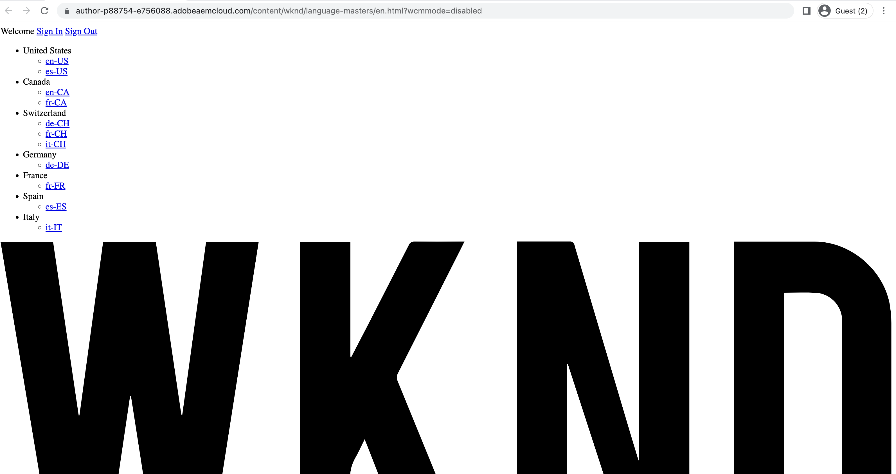

# Déploiement à l’aide du pipeline front-end

Dans ce chapitre, nous allons créer et exécuter un pipeline front-end dans Adobe Cloud Manager. Il crée uniquement les fichiers à partir de `ui.frontend` et les déploie sur le réseau de diffusion de contenu intégré dans AEM as a Cloud Service. S’éloignant ainsi du  `/etc.clientlibs` diffusion des ressources front-end basée sur .

## Objectifs {#objectives}

* Créez et exécutez un pipeline front-end.
* Vérifier que les ressources front-end NE sont PAS livrées à partir de `/etc.clientlibs` mais à partir d’un nouveau nom d’hôte commençant par `https://static-`

## Utilisation du pipeline front-end

>[!VIDEO](https://video.tv.adobe.com/v/3409420/)

## Prérequis {#prerequisites}

Il s’agit d’un tutoriel en plusieurs parties qui suppose que les étapes décrites dans la section [Mettre à jour le projet AEM standard](./update-project.md) ont été terminées.

Vérifiez que vous avez [autorisations de création et de déploiement de pipelines dans Cloud Manager](https://experienceleague.adobe.com/docs/experience-manager-cloud-manager/content/requirements/users-and-roles.html?lang=en#role-definitions) et [accès à un environnement as a Cloud Service AEM](https://experienceleague.adobe.com/docs/experience-manager-cloud-service/content/implementing/using-cloud-manager/manage-environments.html).

## Renommer le pipeline existant

Renommez le pipeline existant à partir de __Déploiement dans Dev__ to  __Déploiement de WKND FullStack vers Dev__ en accédant à la fonction __Configuration__ de __Nom du pipeline hors production__ champ . Cela permet d’indiquer clairement si un pipeline est complet ou frontal en examinant simplement son nom.

Également dans la variable __Code source__ , assurez-vous que les valeurs des champs Repository et Branche Git sont correctes et que la branche comporte vos modifications du contrat de pipeline frontal.

## Création d’un pipeline front-end

À __UNIQUEMENT__ créer et déployer les ressources front-end à partir de la `ui.frontend` effectuez les étapes suivantes :

1. Dans l’interface utilisateur de Cloud Manager, à partir du __Pipelines__ , cliquez sur __Ajouter__ , puis sélectionnez __Ajout d’un pipeline hors production__ (ou __Ajout d’un pipeline de production__) en fonction de l’environnement as a Cloud Service AEM sur lequel vous souhaitez effectuer le déploiement.

1. Dans le __Ajout d’un pipeline hors production__ dans la boîte de dialogue __Configuration__ , sélectionnez __Pipeline de déploiement__ option, nommez-la comme __Déploiement de FrontEnd WKND vers Dev__, puis cliquez sur __Continuer__

1. Dans le cadre de la __Code source__ , sélectionnez __Code front-end__ et sélectionnez l’environnement à partir de __Environnements de déploiement éligibles__. Dans le __Code source__ Assurez-vous que les valeurs des champs Repository et Branche Git sont correctes et que la branche a modifié le contrat de pipeline frontal.
Et __plus important__ pour le __Emplacement du code__ champ dont la valeur est `/ui.frontend` et enfin, cliquez sur __Enregistrer__.

## Séquence de déploiement

* Exécutez d’abord le nouveau nom __Déploiement de WKND FullStack vers Dev__ pour supprimer les fichiers clientlib WKND du référentiel AEM. Et surtout préparer l’AEM pour le contrat de pipeline frontal en ajoutant __Configuration Sling__ Fichiers (`SiteConfig`, `HtmlPageItemsConfig`).

>[!WARNING]
>
>Après, la variable __Déploiement de WKND FullStack vers Dev__ la fin du pipeline ; __sans style__ Site WKND, qui peut sembler rompu. Planifiez une panne ou un déploiement pendant les heures impaires. Il s’agit d’une interruption unique que vous devez prévoir au cours du changement initial, de l’utilisation d’un seul pipeline pleine pile au pipeline frontal.

* Enfin, exécutez le __Déploiement de FrontEnd WKND vers Dev__ pipeline à créer uniquement `ui.frontend` et déployez les ressources front-end directement sur le réseau de diffusion de contenu.

>[!IMPORTANT]
>
>Vous remarquerez que la variable __sans style__ Le site WKND est revenu à la normale et cette fois __FrontEnd__ l’exécution du pipeline était beaucoup plus rapide que le pipeline de pile complète.

## Vérifier les changements de style et le nouveau paradigme de diffusion

* Ouvrez n’importe quelle page du site WKND et vous pouvez voir la couleur du texte dans __Adobe rouge__ et les fichiers de ressources front-end (CSS, JS) sont fournis à partir du réseau de diffusion de contenu. Le nom d’hôte de la requête de ressource commence par `https://static-pXX-eYY.p123-e456.adobeaemcloud.com/$HASH_VALUE$/theme/site.css` de même que le site.js ou toute autre ressource statique référencée dans la variable `HtmlPageItemsConfig` fichier .

>[!TIP]
>
>Le `$HASH_VALUE$` est identique à ce que vous voyez dans la variable __Déploiement de FrontEnd WKND vers Dev__  pipeline __HACHAGE DU CONTENU__ champ . AEM est informé de l’URL du réseau de diffusion de contenu de la ressource frontale, la valeur est stockée à l’adresse `/conf/wknd/sling:configs/com.adobe.cq.wcm.core.components.config.HtmlPageItemsConfig/jcr:content` under __prefixPath__ .

## Félicitations ! {#congratulations}

Félicitations, vous avez créé, exécuté et vérifié le pipeline front-end qui crée et déploie uniquement le module &quot;ui.frontend&quot; du projet WKND Sites. Désormais, votre équipe front-end peut rapidement itérer sur la conception du site et le comportement front-end, en dehors du cycle de vie complet du projet AEM.

## Étapes suivantes {#next-steps}

Dans le chapitre suivant, [Considérations](considerations.md), vous examinerez l’impact sur le processus de développement front-end et back-end.
