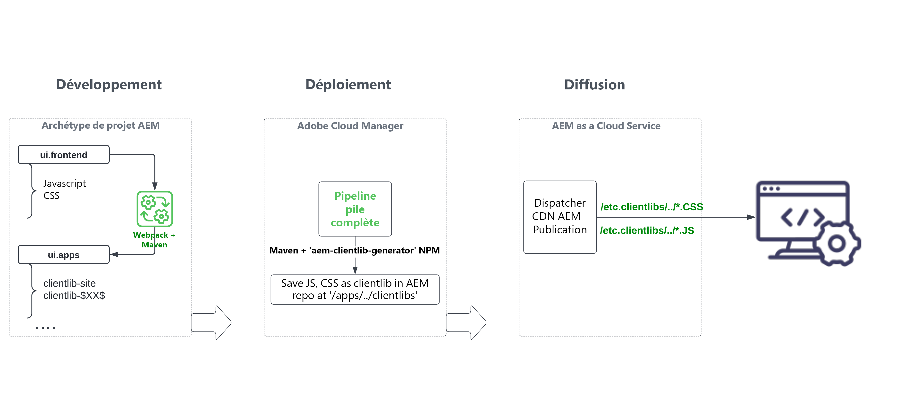

# Examinez le module &quot;ui.frontend&quot; du projet AEM pile complète {#aem-full-stack-ui-frontent}

Dans ce chapitre, nous passons en revue le développement, le déploiement et la diffusion des artefacts front-end d’un projet d’AEM à pile complète, en nous concentrant sur le module &quot;ui.frontend&quot; de la variable __Projet WKND Sites__.


## Objectifs {#objective}

* Comprendre le flux de création et de déploiement des artefacts front-end dans un projet AEM plein pile
* Examinez le rapport AEM du projet de pile complète `ui.frontend` du module [webpack](https://webpack.js.org/) configs
* Processus de génération de la bibliothèque cliente AEM (également appelée clientlibs)

## Flux de déploiement front-end pour AEM projets de création de site rapide et de pile complète

>[!IMPORTANT]
>
>Cette vidéo explique et présente le flux front-end pour les deux **Création rapide et complète de site** projets pour souligner la différence subtile dans le modèle de création, de déploiement et de diffusion des ressources front-end.

>[!VIDEO](https://video.tv.adobe.com/v/3409344/)

## Prérequis {#prerequisites}


* Cloner le [AEM projet WKND Sites](https://github.com/adobe/aem-guides-wknd)
* Création et déploiement du projet WKND Sites AEM cloné pour AEM as a Cloud Service.

Voir le projet AEM site WKND [README.md](https://github.com/adobe/aem-guides-wknd/blob/main/README.md) pour plus d’informations.

## AEM flux d’artefact front-end du projet à pile complète {#flow-of-frontend-artifacts}

Vous trouverez ci-dessous une représentation de haut niveau de la fonction __développement, déploiement et diffusion__ flux des artefacts front-end dans un projet AEM plein pile.




Au cours de la phase de développement, les modifications frontales telles que le style et le rebranding sont effectuées en mettant à jour les fichiers CSS et JS du `ui.frontend/src/main/webpack` dossier. Ensuite, au moment de la création, la variable [webpack](https://webpack.js.org/) module-bundler et module externe maven transforment ces fichiers en bibliothèques clientes d’AEM optimisées sous `ui.apps` module .

Les modifications front-end sont déployées dans AEM environnement as a Cloud Service lors de l’exécution de la variable [__Pile complète__ pipeline dans Cloud Manager](https://experienceleague.adobe.com/docs/experience-manager-cloud-service/content/implementing/using-cloud-manager/cicd-pipelines/introduction-ci-cd-pipelines.html).

Les ressources front-end sont diffusées aux navigateurs web via des chemins URI commençant par `/etc.clientlibs/`, et sont généralement mis en cache sur AEM Dispatcher et CDN.


>[!NOTE]
>
> De même, dans la variable __parcours de création rapide de site__, la variable [modifications frontales](https://experienceleague.adobe.com/docs/experience-manager-cloud-service/content/sites/administering/site-creation/quick-site/customize-theme.html) sont déployés dans AEM environnement as a Cloud Service en exécutant la fonction __Front-end__ pipeline, voir [Configuration de votre pipeline](https://experienceleague.adobe.com/docs/experience-manager-cloud-service/content/sites/administering/site-creation/quick-site/pipeline-setup.html)

### Examinez les configurations Webpack dans le projet WKND Sites {#development-frontend-webpack-clientlib}

* Il y a trois __webpack__ Fichiers de configuration utilisés pour regrouper les ressources front-end des sites WKND.

   1. `webpack.common` : contient le paramètre __common__ configuration pour indiquer le regroupement et l’optimisation des ressources WKND. Le __output__ indique où émettre les fichiers consolidés (également appelés bundles JavaScript, mais à ne pas confondre avec les lots OSGi AEM) qu’elle crée. Le nom par défaut est défini sur `clientlib-site/js/[name].bundle.js`.

   ```javascript
       ...
       output: {
               filename: 'clientlib-site/js/[name].bundle.js',
               path: path.resolve(__dirname, 'dist')
           }
       ...    
   ```

   1. `webpack.dev.js` contient la variable __development__ configuration pour webpack-dev-server et pointe vers le modèle de HTML à utiliser. Il comprend également une configuration proxy utilisée pour une instance AEM s’exécutant sur `localhost:4502`.

   ```javascript
       ...
       devServer: {
           proxy: [{
               context: ['/content', '/etc.clientlibs', '/libs'],
               target: 'http://localhost:4502',
           }],
       ...    
   ```

   1. `webpack.prod.js` contient la variable __production__ et utilise les modules externes pour transformer les fichiers de développement en lots optimisés.

   ```javascript
       ...
       module.exports = merge(common, {
           mode: 'production',
           optimization: {
               minimize: true,
               minimizer: [
                   new TerserPlugin(),
                   new CssMinimizerPlugin({ ...})
           }
       ...    
   ```


* Les ressources regroupées sont déplacées vers la `ui.apps` module utilisant [aem-clientlib-generator](https://www.npmjs.com/package/aem-clientlib-generator) à l’aide de la configuration gérée dans le module externe `clientlib.config.js` fichier .

```javascript
    ...
    const BUILD_DIR = path.join(__dirname, 'dist');
    const CLIENTLIB_DIR = path.join(
    __dirname,
    '..',
    'ui.apps',
    'src',
    'main',
    'content',
    'jcr_root',
    'apps',
    'wknd',
    'clientlibs'
    );
    ...
```

* Le __frontend-maven-plugin__ de `ui.frontend/pom.xml` orchestre le regroupement webpack et la génération clientlib pendant la génération AEM projet.

`$ mvn clean install -PautoInstallSinglePackage`

### Déploiement vers AEM as a Cloud Service {#deployment-frontend-aemaacs}

Le [__Pile complète__ pipeline](https://experienceleague.adobe.com/docs/experience-manager-cloud-service/content/implementing/using-cloud-manager/cicd-pipelines/introduction-ci-cd-pipelines.html?#full-stack-pipeline) déploie ces modifications dans un environnement as a Cloud Service AEM.


### Diffusion depuis AEM as a Cloud Service {#delivery-frontend-aemaacs}

Les ressources front-end déployées via le pipeline full-stack sont diffusées du site AEM aux navigateurs web sous la forme `/etc.clientlibs` fichiers . Vous pouvez le vérifier en consultant le [site WKND hébergé publiquement](https://wknd.site/content/wknd/us/en.html) et la source d’affichage de la page web.

```html
    ....
    <link rel="stylesheet" href="/etc.clientlibs/wknd/clientlibs/clientlib-site.lc-181cd4102f7f49aa30eea548a7715c31-lc.min.css" type="text/css">

    ...

    <script async src="/etc.clientlibs/wknd/clientlibs/clientlib-site.lc-d4e7c03fe5c6a405a23b3ca1cc3dcd3d-lc.min.js"></script>
    ....
```

## Félicitations ! {#congratulations}

Félicitations, vous avez examiné le module ui.frontend du projet full-stack.

## Étapes suivantes {#next-steps}

Dans le chapitre suivant, [Mettre à jour le projet pour utiliser le pipeline front-end](update-project.md), vous allez mettre à jour le projet AEM WKND Sites pour l’activer pour le contrat de pipeline frontal.
