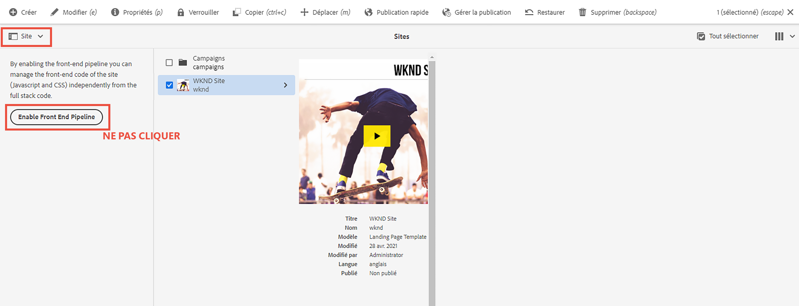

# Mettre à jour le projet d’AEM full-stack pour utiliser le pipeline front-end {#update-project-enable-frontend-pipeline}

Dans ce chapitre, nous apportons des modifications de configuration au __Projet WKND Sites__ pour utiliser le pipeline frontal afin de déployer JavaScript et CSS, plutôt que d’avoir à exécuter un pipeline complet. Cela découple le cycle de vie du développement et du déploiement des artefacts front-end et back-end, ce qui permet un processus de développement itératif plus rapide dans l’ensemble.

## Objectifs {#objectives}

* Mettre à jour le projet full-stack pour utiliser le pipeline front-end

## Présentation des modifications de configuration dans le projet d’AEM de pile complète

>[!VIDEO](https://video.tv.adobe.com/v/3409419?quality=12&learn=on)

## Prérequis {#prerequisites}

Il s’agit d’un tutoriel en plusieurs parties qui suppose que vous avez examiné la variable [Module ui.frontend](./review-uifrontend-module.md).


## Modifications apportées au projet d’AEM de pile complète

Il existe trois modifications de configuration liées au projet et un changement de style à déployer pour une exécution de test, donc au total quatre modifications spécifiques dans le projet WKND pour l’activer pour le contrat de pipeline frontal.

1. Supprimez le `ui.frontend` module à partir du cycle de génération de pile complète

   * Dans, la racine du projet WKND Sites `pom.xml` commentez la variable `<module>ui.frontend</module>` entrée du sous-module.

   ```xml
       ...
       <modules>
       <module>all</module>
       <module>core</module>
       <!--
       <module>ui.frontend</module>
       -->                
       <module>ui.apps</module>
       ...
   ```

   * Et la dépendance liée aux commentaires de la `ui.apps/pom.xml`

   ```xml
       ...
       <!-- ====================================================================== -->
       <!-- D E P E N D E N C I E S                                                -->
       <!-- ====================================================================== -->
           ...
       <!--
           <dependency>
               <groupId>com.adobe.aem.guides</groupId>
               <artifactId>aem-guides-wknd.ui.frontend</artifactId>
               <version>${project.version}</version>
               <type>zip</type>
           </dependency>
       -->    
       ...
   ```

1. Préparez le `ui.frontend` pour le contrat de pipeline front-end en ajoutant deux nouveaux fichiers de configuration webpack.

   * Copiez le fichier existant `webpack.common.js` as `webpack.theme.common.js`et modifiez `output` et `MiniCssExtractPlugin`, `CopyWebpackPlugin` plugin config params comme ci-dessous :

   ```javascript
   ...
   output: {
           filename: 'theme/js/[name].js', 
           path: path.resolve(__dirname, 'dist')
       }
   ...
   
   ...
       new MiniCssExtractPlugin({
               filename: 'theme/[name].css'
           }),
       new CopyWebpackPlugin({
           patterns: [
               { from: path.resolve(__dirname, SOURCE_ROOT + '/resources'), to: './clientlib-site' }
           ]
       })
   ...
   ```

   * Copiez le fichier existant `webpack.prod.js` as `webpack.theme.prod.js`et modifiez la variable `common` emplacement de la variable vers le fichier ci-dessus en tant que

   ```javascript
   ...
       const common = require('./webpack.theme.common.js');
   ...
   ```

   >[!NOTE]
   >
   >Les deux modifications de configuration &quot;webpack&quot; ci-dessus doivent comporter des noms de fichier et de dossier de sortie différents. Il est donc facile de différencier facilement les artefacts front-end du pipeline clientlib (full-stack) et générés par le thème (front-end).
   >
   >Comme vous l’avez deviné, les modifications ci-dessus peuvent également être ignorées pour utiliser les configurations webpack existantes, mais les modifications ci-dessous sont requises.
   >
   >C&#39;est à vous de décider comment vous voulez les nommer ou les organiser.


   * Dans le `package.json` , assurez-vous que la variable  `name` La valeur de la propriété est identique au nom du site de la variable `/conf` noeud . Et sous le `scripts` , une `build` script expliquant comment créer les fichiers front-end à partir de ce module.

   ```javascript
       {
       "name": "wknd",
       "version": "1.0.0",
       ...
   
       "scripts": {
           "build": "webpack --config ./webpack.theme.prod.js"
       }
   
       ...
       }
   ```

1. Préparez le `ui.content` pour le pipeline frontal en ajoutant deux configurations Sling.

   * Créez un fichier sous `com.adobe.cq.wcm.core.components.config.HtmlPageItemsConfig` - cela inclut tous les fichiers front-end que la variable `ui.frontend` génère sous le `dist` à l’aide du processus de création webpack.

   ```xml
   ...
       <css
       jcr:primaryType="nt:unstructured"
       element="link"
       location="header">
       <attributes
           jcr:primaryType="nt:unstructured">
           <as
               jcr:primaryType="nt:unstructured"
               name="as"
               value="style"/>
           <href
               jcr:primaryType="nt:unstructured"
               name="href"
               value="/theme/site.css"/>
   ...
   ```

   >[!TIP]
   >
   >    Consultez la [HtmlPageItemsConfig](https://github.com/adobe/aem-guides-wknd/blob/feature/frontend-pipeline/ui.content/src/main/content/jcr_root/conf/wknd/_sling_configs/com.adobe.cq.wcm.core.components.config.HtmlPageItemsConfig/.content.xml) dans le __AEM projet WKND Sites__.


   * Deuxièmement, `com.adobe.aem.wcm.site.manager.config.SiteConfig` avec le `themePackageName` étant identique à la valeur `package.json` et `name` valeur de propriété et `siteTemplatePath` pointant vers un `/libs/wcm/core/site-templates/aem-site-template-stub-2.0.0` valeur du chemin d’accès au stub.

   ```xml
   ...
       <?xml version="1.0" encoding="UTF-8"?>
       <jcr:root xmlns:sling="http://sling.apache.org/jcr/sling/1.0" xmlns:jcr="http://www.jcp.org/jcr/1.0" xmlns:nt="http://www.jcp.org/jcr/nt/1.0"
               jcr:primaryType="nt:unstructured"
               siteTemplatePath="/libs/wcm/core/site-templates/aem-site-template-stub-2.0.0"
               themePackageName="wknd">
       </jcr:root>
   ...
   ```

   >[!TIP]
   >
   >    Voir la section [SiteConfig](https://github.com/adobe/aem-guides-wknd/blob/feature/frontend-pipeline/ui.content/src/main/content/jcr_root/conf/wknd/_sling_configs/com.adobe.aem.wcm.site.manager.config.SiteConfig/.content.xml) dans le __AEM projet WKND Sites__.

1. Un thème ou des styles changent pour être déployés via le pipeline frontal pour une exécution de test. Nous sommes en train de modifier `text-color` pour Adobe rouge (ou vous pouvez choisir le vôtre) en mettant à jour la variable `ui.frontend/src/main/webpack/base/sass/_variables.scss`.

   ```css
       $black:     #a40606;
       ...
   ```

Enfin, envoyez ces modifications au référentiel git d’Adobe de votre programme.


>[!AVAILABILITY]
>
> Ces modifications sont disponibles sur GitHub dans la variable [__pipeline front-end__](https://github.com/adobe/aem-guides-wknd/tree/feature/frontend-pipeline) de la branche __AEM projet WKND Sites__.


## Attention - _Activation du pipeline front-end_ button

Le [Sélecteur de rail](https://experienceleague.adobe.com/docs/experience-manager-cloud-service/content/sites/authoring/getting-started/basic-handling.html) &#39;s [Site](https://experienceleague.adobe.com/docs/experience-manager-cloud-service/content/sites/authoring/getting-started/basic-handling.html) affiche la variable **Activation du pipeline front-end** lors de la sélection de la racine du site ou de la page du site. Cliquer **Activation du pipeline front-end** remplace le bouton ci-dessus. **Configurations Sling**, assurez-vous que **vous ne cliquez pas sur** ce bouton après le déploiement des modifications ci-dessus via l’exécution du pipeline Cloud Manager.



S’il fait l’objet d’un clic par erreur, vous devez réexécuter les pipelines pour vous assurer que le contrat et les modifications du pipeline front-end sont restaurés.

## Félicitations ! {#congratulations}

Félicitations, vous avez mis à jour le projet WKND Sites pour l’activer pour le contrat de pipeline frontal.

## Étapes suivantes {#next-steps}

Dans le chapitre suivant, [Déploiement à l’aide du pipeline front-end](create-frontend-pipeline.md), vous allez créer et exécuter un pipeline front-end et vérifier comment nous __déplacé__ à partir de la diffusion des ressources front-end &#39;/etc.clientlibs&#39;.
