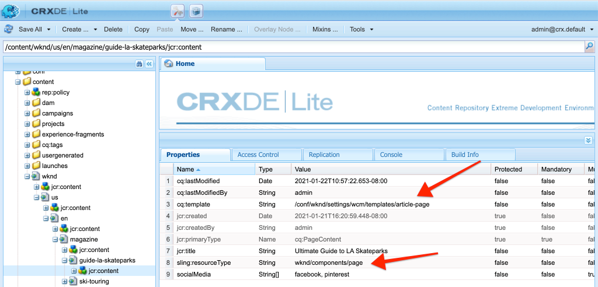

# Pages et modèles {#pages-and-template}

Ce chapitre porte sur la relation entre un composant de page de base et des modèles modifiables. Nous allons créer un modèle d’article sans style basé sur certaines maquettes de [AdobeXD](https://www.adobe.com/products/xd.html). Dans le processus de création du modèle, les composants principaux et les configurations de stratégie avancées des modèles modifiables sont traités.

## Conditions préalables {#prerequisites}

Examinez les outils et les instructions nécessaires pour configurer un [environnement de développement local](overview.md#local-dev-environment).

### Projet de démarrage

Consultez le code de ligne de base sur lequel le didacticiel s&#39;appuie :

1. Cloner le référentiel [github.com/adobe/aem-guides-wknd](https://github.com/adobe/aem-guides-wknd).
1. Consultez la branche `pages-templates/start`.

   ```shell
   $ git clone git@github.com:adobe/aem-guides-wknd.git ~/code/aem-guides-wknd
   $ cd ~/code/aem-guides-wknd
   $ git checkout pages-templates/start
   ```

1. Déployez la base de code sur une instance AEM locale en utilisant vos compétences Maven :

   ```shell
   $ cd ~/code/aem-guides-wknd
   $ mvn clean install -PautoInstallSinglePackage
   ```

Vous pouvez toujours vue le code terminé sur [GitHub](https://github.com/adobe/aem-guides-wknd/tree/pages-templates/solution) ou vérifier le code localement en passant à la branche `pages-templates/solution`.

## Intention

1. Inspect une conception de page créée dans Adobe XD et la mappe aux composants principaux.
1. Comprendre les détails des modèles modifiables et comment les stratégies peuvent être utilisées pour appliquer un contrôle granulaire du contenu de la page.
1. Découvrez comment les modèles et les pages sont liés

## Ce que vous allez créer {#what-you-will-build}

Dans cette partie du didacticiel, vous allez créer un nouveau modèle de page d’article qui pourra être utilisé pour créer de nouvelles pages d’article et s’aligner sur une structure commune. Le modèle de page de l’article sera basé sur des conceptions et un kit d’interface produit dans AdobeXD. Ce chapitre porte uniquement sur la création de la structure ou du squelette du modèle. Aucun style ne sera implémenté mais le modèle et les pages seront fonctionnels.


## Planification de l’interface utilisateur avec Adobe XD {#adobexd}

Dans la plupart des cas, la planification d’un nouveau début Web avec des maquettes et des conceptions statiques. [Adobe ](https://www.adobe.com/products/xd.html) XDest un outil de conception qui permet de créer des expériences utilisateur. Ensuite, nous allons examiner un kit d’interface utilisateur et des maquettes pour vous aider à planifier la structure du modèle de page d’article.

>[!VIDEO](https://video.tv.adobe.com/v/30214/?quality=12&learn=on)

Téléchargez le [fichier de conception de l’article WKND](https://github.com/adobe/aem-guides-wknd/releases/download/aem-guides-wknd-0.0.2/AEM_UI-kit-WKND-article-design.xd).

## Créer un en-tête et un pied de page avec des fragments d’expérience {#experience-fragments}

Une pratique courante lors de la création de contenu global, tel qu’un en-tête ou un pied de page, consiste à utiliser un [fragment d’expérience](https://docs.adobe.com/content/help/en/experience-manager-learn/sites/experience-fragments/experience-fragments-feature-video-use.html). Fragments d’expérience, nous permettent de combiner plusieurs composants afin de créer un composant unique, pouvant être référencé. Les fragments d’expérience ont l’avantage de prendre en charge la gestion multisite et nous permettent de gérer différents en-têtes/pieds de page par langue.

Ensuite, nous allons mettre à jour le fragment d’expérience destiné à être utilisé comme en-tête et pied de page pour ajouter le logo WKND.

>[!VIDEO](https://video.tv.adobe.com/v/30215/?quality=12&learn=on)

>[!NOTE]
>
> Vos fragments d’expérience ont-ils un aspect différent de celui de la vidéo ? Essayez de les supprimer et réinstallez la base de code du projet de démarrage.

Vous trouverez ci-dessous les étapes de haut niveau effectuées dans la vidéo ci-dessus.

1. Mettez à jour l’en-tête du fragment d’expérience situé à l’adresse [http://localhost:4502/editor.html/content/experience-fragments/wknd/us/en/site/header/master.html](http://localhost:4502/editor.html/content/experience-fragments/wknd/us/en/site/header/master.html) pour inclure le logo WKND Dark.

   

   *Logo WKND Dark*

1. Mettez à jour l’en-tête du fragment d’expérience situé [http://localhost:4502/editor.html/content/experience-fragments/wknd/us/en/site/footer/master.html](http://localhost:4502/editor.html/content/experience-fragments/wknd/us/en/site/footer/master.html) pour inclure le logo de l’éclairage WKND.

   

   *Logo WKND Light*

## Création d’un modèle de page d’article

Lors de la création d’une page, vous devez sélectionner un modèle. C’est la base pour la création de la page. Le modèle définit la structure de la page résultante, le contenu initial et les composants autorisés.

Il existe 3 zones principales de [Modèles modifiables](https://docs.adobe.com/content/help/fr-FR/experience-manager-65/developing/platform/templates/page-templates-editable.html) :

1. **Structure**  : définit les composants qui font partie du modèle. Ils ne seront pas modifiables par les auteurs de contenu.
1. **Contenu**  initial : définit les composants que le modèle utilisera, qui peuvent être modifiés et/ou supprimés par les auteurs de contenu.
1. **Stratégies**  : définit des configurations sur le comportement des composants et sur les options disponibles pour les auteurs.

Nous allons ensuite créer le modèle de page d’article. Cela se produit dans une instance locale d&#39;AEM.

>[!VIDEO](https://video.tv.adobe.com/v/30217/?quality=12&learn=on)

Vous trouverez ci-dessous les étapes de haut niveau effectuées dans la vidéo ci-dessus.

1. Accédez au dossier WKND Sites Template : **Outils** > **Général** > **Modèles** > **Site WKND**
1. Créez un modèle à l’aide du **type de modèle Page vide du site WKND** avec le titre **Modèle de page d’article**.
1. En mode **Structure**, configurez le modèle pour inclure les éléments suivants :

   * En-tête du fragment d’expérience
   * Image
   * Chemin de navigation
   * Conteneur : 8 colonnes large Bureau, 12 colonnes large Tablette, Mobile
   * Conteneur : 4 colonnes de large, 12 colonnes de large Tablette, Mobile
   * Pied de page du fragment d’expérience

   

   *Structure - Modèle de page d’article*

1. Passez en mode **Contenu initial** et ajoutez les composants suivants comme contenu de démarrage :

   * **Conteneur principal**
      * Titre - taille par défaut de H1
      * Titre - *&quot;Par nom d’auteur&quot;* avec une taille H4
      * Texte - vide
   * **Conteneur latéral**
      * Titre - *&quot;Partager cet article&quot;* avec une taille H5
      * Partage sur les réseaux sociaux
      * Séparateur
      * Téléchargement
      * Liste

   

   *Contenu initial - Modèle de page d’article*

1. Mettez à jour les **propriétés de page initiales** afin d’activer le partage des utilisateurs pour **Facebook** et **Pinterest**.
1. Téléchargez une image sur les propriétés **du modèle de page d&#39;article** afin de l&#39;identifier facilement :

   

   *Miniature du modèle de page d’article*

1. Activez les **modèles de page d&#39;article** dans le dossier [Modèles de site WKND](http://localhost:4502/libs/wcm/core/content/sites/templates.html/conf/wknd/settings/wcm/templates).

## Création d’une page d’article

Maintenant que nous avons un modèle, créons une nouvelle page en utilisant ce modèle.

1. Téléchargez le package zip suivant, [WKND-PagesTemplates-DAM-Assets.zip](assets/pages-templates/WKND-PagesTemplates-DAM-Assets.zip) et installez-le via [CRX Package Manager](http://localhost:4502/crx/packmgr/index.jsp).

   Le package ci-dessus installera plusieurs images et ressources sous `/content/dam/wknd/en/magazine/la-skateparks` pour les utiliser dans les étapes suivantes pour remplir une page d&#39;article.

   *Les images et les ressources du paquet ci-dessus sont libres de toute licence avec l&#39;aimable autorisation de  [Unsplash.com](https://unsplash.com/).*

   

1. Créez une nouvelle page, sous **WKND** > **US** > **en**, nommée **Magazine**. Utilisez le modèle **Page de contenu**.

   Cette page ajoutera une structure à notre site et nous permettra de voir le composant Chemin de navigation en action.

1. Créez ensuite une nouvelle page, sous **WKND** > **US** > **en** > **Magazine**. Utilisez le modèle **Page d’article**. Utilisez le titre du **Guide ultime pour les parcs de ski LA** et le nom de **guide-la-skateparks**.

   

1. Renseignez la page avec le contenu afin de correspondre aux maquettes inspectées dans la section [UI Planning avec AdobeXD](#adobexd). L&#39;exemple de texte de l&#39;article peut être [téléchargé ici](assets/pages-templates/la-skateparks-copy.txt). Vous devriez être en mesure de créer quelque chose de similaire à ceci :

   

   >[!NOTE]
   >
   > Le composant Image situé en haut de la page peut être modifié mais pas supprimé. Le composant de chemin de navigation s’affiche sur la page mais ne peut pas être modifié ou supprimé.

## Inspect de la structure de noeud {#node-structure}

A ce stade, la page de l&#39;article n&#39;est clairement pas stylisée. Toutefois, la structure de base est en place. Ensuite, nous allons examiner la structure des noeuds de la page d’article afin de mieux comprendre le rôle du modèle et du composant de page responsable du rendu du contenu.

Nous pouvons le faire à l&#39;aide de l&#39;outil CRXDE-Lite sur une instance d&#39;AEM locale.

1. Ouvrez [CRXDE-Lite](http://localhost:4502/crx/de/index.jsp#/content/wknd/us/en/magazine/guide-la-skateparks/jcr%3Acontent) et utilisez l&#39;arborescence de navigation pour accéder à `/content/wknd/us/en/magazine/guide-la-skateparks`.

1. Cliquez sur le noeud `jcr:content` situé sous la page `la-skateparks` et vue les propriétés :

   

   Notez la valeur de `cq:template`, qui pointe vers `/conf/wknd/settings/wcm/templates/article-page`, le modèle de page d’article que nous avons créé précédemment.

   Notez également la valeur de `sling:resourceType`, qui pointe vers `wknd/components/structure/page`. Il s’agit du composant de page créé par l’archétype du projet AEM et responsable du rendu de la page en fonction du modèle.

1. Développez le noeud `jcr:content` sous `/content/wknd/us/en/magazine/guide-la-skateparks/jcr:content` et vue la hiérarchie des noeuds :

   

   Vous devriez être en mesure de mapper de manière plus ou moins précise chacun des noeuds aux composants créés. Vérifiez si vous pouvez identifier les différents Conteneurs de mise en page utilisés en examinant les noeuds précédés de `responsivegrid`.

1. Examinez ensuite le composant de page à l&#39;adresse `/apps/wknd/components/structure/page`. Vue des propriétés du composant dans le CRXDE Lite :

   

   Notez que le composant de page se trouve sous un dossier nommé **structure**. Il s’agit d’une convention qui correspond au mode de structure de l’éditeur de modèles et qui est utilisée pour indiquer que le composant de page n’est pas un composant avec lequel les auteurs interagiront directement.

   Notez qu’il n’existe que 2 scripts HTL, `customfooterlibs.html` et `customheaderlibs.html` sous le composant de page. Comment ce composant génère-t-il la page ?

   Notez la propriété `sling:resourceSuperType` et la valeur de `core/wcm/components/page/v2/page`. Cette propriété permet au composant de page du WKND d’hériter de toutes les fonctionnalités du composant de page Composant principal. Il s’agit du premier exemple d’un élément appelé [Modèle de composant proxy](https://docs.adobe.com/content/help/en/experience-manager-core-components/using/developing/guidelines.html#ProxyComponentPattern). Vous trouverez plus d’informations[ ici.](https://docs.adobe.com/content/help/en/experience-manager-core-components/using/developing/guidelines.html).

1. Inspect un autre composant dans les composants WKND, le composant `Breadcrumb` situé à l&#39;emplacement suivant : `/apps/wknd/components/content/breadcrumb`. Notez que la même propriété `sling:resourceSuperType` est disponible, mais cette fois elle pointe sur `core/wcm/components/breadcrumb/v2/breadcrumb`. Voici un autre exemple d&#39;utilisation du modèle de composant Proxy pour inclure un composant principal. En fait, tous les composants de la base de code WKND sont des proxies de AEM Core Components (à l&#39;exception de notre célèbre composant HelloWorld). Il est recommandé d&#39;essayer de réutiliser autant de fonctionnalités des composants principaux que possible *avant* d&#39;écrire du code personnalisé.

1. Examinez ensuite la page du composant principal à `/apps/core/wcm/components/page/v2/page` à l&#39;aide du CRXDE Lite :

   

   Notez que beaucoup d’autres scripts sont inclus sous cette page. La page Composant principal contient beaucoup de fonctionnalités. Cette fonctionnalité est divisée en plusieurs scripts afin de faciliter la maintenance et la lisibilité. Vous pouvez suivre l’inclusion des scripts HTL en ouvrant `page.html` et en recherchant `data-sly-include` :

   ```html
   <!--/* /apps/core/wcm/components/page/v2/page/page.html */-->
   <!DOCTYPE HTML>
   <html data-sly-use.page="com.adobe.cq.wcm.core.components.models.Page" lang="${page.language}"
           data-sly-use.head="head.html"
           data-sly-use.footer="footer.html"
           data-sly-use.redirect="redirect.html">
       <head data-sly-call="${head.head @ page = page}"></head>
       <body class="${page.cssClassNames}">
           <sly data-sly-test.isRedirectPage="${page.redirectTarget && (wcmmode.edit || wcmmode.preview)}"
               data-sly-call="${redirect.redirect @ redirectTarget = page.redirectTarget}"></sly>
           <sly data-sly-test="${!isRedirectPage}">
               <sly data-sly-include="body.socialmedia_begin.html"></sly>
               <sly data-sly-include="body.html"></sly>
               <sly data-sly-call="${footer.footer @ page = page}"></sly>
               <sly data-sly-include="body.socialmedia_end.html"></sly>
           </sly>
       </body>
   </html>
   ```

   L’autre raison de diviser le code HTML en plusieurs scripts est de permettre aux composants proxy de remplacer des scripts individuels pour implémenter une logique métier personnalisée. Les scripts HTL, `customfooterlibs.html` et `customheaderlibs.html`, sont créés dans le but explicite d’être remplacés par la mise en oeuvre de projets.

   Pour en savoir plus sur la manière dont le modèle modifiable prend en compte le rendu de la page de contenu [en lisant cet article](https://docs.adobe.com/content/help/en/experience-manager-65/developing/platform/templates/page-templates-editable.html#resultant-content-pages).

1. Inspect est un autre composant principal, comme la barre de navigation à `/apps/core/wcm/components/breadcrumb/v2/breadcrumb`. Vue du script `breadcrumb.html` pour comprendre comment le balisage du composant Breadcrumb est finalement généré.

## Enregistrement des configurations dans le contrôle de code source {#configuration-persistence}

Dans de nombreux cas, en particulier au début d&#39;un projet AEM, il est important de conserver les configurations, comme les modèles et les stratégies de contenu connexes, pour contrôler la source. Ceci garantit que tous les développeurs travaillent sur le même ensemble de contenu et de configurations et peut garantir une cohérence supplémentaire entre les environnements. Une fois qu&#39;un projet atteint un certain niveau de maturité, la pratique de gestion des modèles peut être transmise à un groupe spécial d&#39;utilisateurs de la puissance.

Pour l&#39;instant, nous traiterons les modèles comme d&#39;autres éléments de code et synchroniserons le **Modèle de page d&#39;article** dans le cadre du projet. Jusqu&#39;à présent, nous avons **poussé** le code de notre projet AEM vers une instance locale d&#39;AEM. Le **modèle de page d&#39;article** a été créé directement sur une instance locale d&#39;AEM, nous devons donc **extraire** ou importer le modèle dans notre projet AEM. Le module **ui.content** est inclus dans le projet AEM à cet effet spécifique.

Les prochaines étapes se dérouleront à l&#39;aide de l&#39;IDE Eclipse, mais elles peuvent être effectuées à l&#39;aide de tout IDE que vous avez configuré pour **extraire** ou importer du contenu à partir d&#39;une instance locale d&#39;AEM.

1. Dans l&#39;Eclipse IDE, assurez-vous qu&#39;un serveur connecté à l&#39;instance locale d&#39;AEM a démarré le module externe d&#39;outil de développement AEM et que le module **ui.content** a été ajouté à la configuration du serveur.

   

1. Développez le module **ui.content** dans l&#39;explorateur de projets. Développez le dossier `src` (celui qui contient la petite icône glob) et accédez à `/conf/wknd/settings/wcm/templates`.

1. [!UICONTROL Cliquez avec le bouton droit de la souris ] sur le  `templates` noeud et sélectionnez  **Importer à partir du serveur...** :

   

   Confirmez la boîte de dialogue **Importer à partir du référentiel** et cliquez sur **Terminer**. Vous devriez maintenant voir le dossier `article-page-template` sous le dossier `templates`.

1. Répétez les étapes pour importer le contenu, mais sélectionnez le noeud **policies** situé à `/conf/wknd/settings/wcm/policies`.

   

1. Inspect le fichier `filter.xml` situé à `src/main/content/META-INF/vault/filter.xml`.

   ```xml
   <!--ui.content filter.xml-->
   <?xml version="1.0" encoding="UTF-8"?>
   <workspaceFilter version="1.0">
       <filter root="/conf/wknd" mode="merge"/>
       <filter root="/content/wknd" mode="merge"/>
       <filter root="/content/dam/wknd" mode="merge"/>
       <filter root="/content/experience-fragments/wknd" mode="merge"/>
   </workspaceFilter>
   ```

   Le fichier `filter.xml` est chargé d&#39;identifier les chemins d&#39;accès des noeuds qui seront installés avec le package. Remarquez le `mode="merge"` sur chaque filtres qui indique que le contenu existant ne sera pas modifié, seul le nouveau contenu sera ajouté. Les auteurs de contenu pouvant mettre à jour ces chemins, il est important qu’un déploiement de code ne remplace **pas** le contenu. Pour plus d&#39;informations sur l&#39;utilisation des éléments de filtre, consultez la [documentation FileVault](https://jackrabbit.apache.org/filevault/filter.html).

   Comparez `ui.content/src/main/content/META-INF/vault/filter.xml` et `ui.apps/src/main/content/META-INF/vault/filter.xml` pour comprendre les différents noeuds gérés par chaque module.

   >[!WARNING]
   >
   > Afin d&#39;assurer des déploiements cohérents pour le site de référence WKND, certaines branches du projet sont configurées de telle sorte que `ui.content` remplacera toute modification du JCR. Il s’agit de la conception, c’est-à-dire pour les branches de solution, puisque le code/les styles seront écrits pour des stratégies spécifiques.

## Félicitations! {#congratulations}

Félicitations, vous venez de créer un nouveau modèle et une nouvelle page avec Adobe Experience Manager Sites.

### Étapes suivantes {#next-steps}

A ce stade, la page de l&#39;article n&#39;est clairement pas stylisée. Suivez le didacticiel [Bibliothèques côté client et Workflow frontal](client-side-libraries.md) pour découvrir les meilleures pratiques d&#39;inclusion de CSS et de JavaScript pour appliquer des styles globaux au site et intégrer une version frontale dédiée.

Vue le code terminé sur [GitHub](https://github.com/adobe/aem-guides-wknd) ou passez en revue et déployez le code localement sur la brach Git `pages-templates/solution`.

1. Cloner le référentiel [github.com/adobe/aem-wknd-guides](https://github.com/adobe/aem-guides-wknd).
1. Consultez la branche `pages-templates/solution`.
