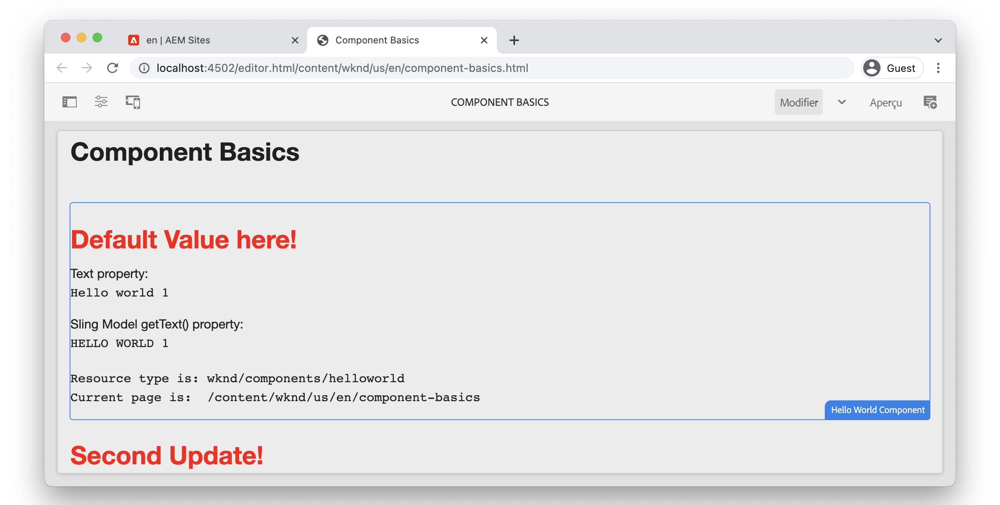

# Notions de base des composants {#component-basics}

Dans ce chapitre, explorons la technologie sous-jacente d’un composant d’Adobe Experience Manager (AEM) Sites à l’aide d’un simple exemple `HelloWorld`. De petites modifications sont apportées à un composant existant, couvrant les rubriques sur la création, HTL, les modèles Sling et les bibliothèques côté client.

## Prérequis {#prerequisites}

Examinez les outils et les instructions nécessaires pour configurer un [environnement de développement local](./overview.md#local-dev-environment).

L’IDE utilisé dans les vidéos est [Visual Studio Code](https://code.visualstudio.com/) et le module [VSCode AEM Sync](https://marketplace.visualstudio.com/items?itemName=yamato-ltd.vscode-aem-sync).

## Objectif {#objective}

1. Découvrez le rôle des modèles HTL et des modèles Sling pour effectuer dynamiquement le rendu du HTML.
1. Découvrez comment les boîtes de dialogue sont utilisées pour faciliter la création de contenu.
1. Découvrez les principes de base des bibliothèques côté client pour inclure CSS et JavaScript pour prendre en charge un composant.

## Ce que vous allez créer {#what-build}

Dans ce chapitre, vous apportez plusieurs modifications à un simple composant `HelloWorld`. Lorsque vous apporterez des modification au composant `HelloWorld`, vous découvrirez les principaux domaines du développement de composant d’AEM.

## Chapitre sur le projet de démarrage {#starter-project}

Ce chapitre s’appuie sur un projet générique généré par l’[archétype de projet d’AEM](https://github.com/adobe/aem-project-archetype). Regardez la vidéo ci-dessous et examinez les [conditions préalables](#prerequisites) pour commencer.

>[!NOTE]
>
> Si vous avez terminé avec succès le chapitre précédent, vous pouvez réutiliser le projet et ignorer les étapes de consultation du projet de démarrage.

>[!VIDEO](https://video.tv.adobe.com/v/330985?quality=12&learn=on)

Ouvrez un nouveau terminal de ligne de commande et effectuez les actions suivantes.

1. Dans un répertoire vide, clonez le référentiel [aem-guides-wknd](https://github.com/adobe/aem-guides-wknd) :

   ```shell
   $ git clone git@github.com:adobe/aem-guides-wknd.git --branch tutorial/component-basics-start --single-branch
   ```

   >[!NOTE]
   >
   > Vous pouvez éventuellement continuer à utiliser le projet généré dans le chapitre précédent, [Configuration du projet](./project-setup.md).

1. Accédez au dossier `aem-guides-wknd`.

   ```shell
   $ cd aem-guides-wknd
   ```

1. Créez et déployez le projet sur une instance locale d’AEM avec la commande suivante :

   ```shell
   $ mvn clean install -PautoInstallSinglePackage
   ```

   >[!NOTE]
   >
   > Si vous utilisez la version 6.5 ou 6.4 d’AEM, ajoutez le profil `classic` à n’importe quelle commande Maven.

   ```shell
   $ mvn clean install -PautoInstallSinglePackage -Pclassic
   ```

1. Importez le projet dans l’IDE de votre choix en suivant les instructions pour configurer un [environnement de développement local](overview.md#local-dev-environment).

## Création de composants {#component-authoring}

Les composants peuvent être considérés comme de petits blocs de création modulaires d’une page web. Pour réutiliser les composants, ceux-ci doivent pouvoir être configurés. Pour ce faire, utilisez la boîte de dialogue de création. Créons ensuite un composant simple et examinons comment les valeurs de la boîte de dialogue sont conservées dans AEM.

>[!VIDEO](https://video.tv.adobe.com/v/330986?quality=12&learn=on)

Vous trouverez ci-dessous les étapes générales effectuées dans la vidéo ci-dessus.

1. Créez une page nommée **Principes de base des composants** sous **WKND Site** `>` **US** `>` **en**.
1. Ajoutez le **composant Hello World** sur la page nouvellement créée.
1. Ouvrez la boîte de dialogue du composant et saisissez du texte. Enregistrez les modifications pour voir le message affiché sur la page.
1. Passez en mode de développement, affichez le chemin d’accès du contenu dans CRXDE-Lite et examinez les propriétés de l’instance du composant.
1. Utilisez CRXDE-Lite pour afficher les scripts `cq:dialog` et `helloworld.html` depuis `/apps/wknd/components/content/helloworld`.

## HTL (langage de modèle HTML) et boîtes de dialogue {#htl-dialogs}

Le langage du modèle HTML ou **[HTL](https://experienceleague.adobe.com/docs/experience-manager-htl/content/getting-started.html?lang=fr)** est un langage de modèle léger côté serveur utilisé par les composants d’AEM pour effectuer le rendu du contenu.

Les **boîtes de dialogue** définissent les configurations disponibles qui peuvent être effectuées pour un composant.

Nous allons maintenant mettre à jour le script HTL `HelloWorld` pour afficher un message de salutations supplémentaire avant le message texte.

>[!VIDEO](https://video.tv.adobe.com/v/330987?quality=12&learn=on)

Vous trouverez ci-dessous les étapes générales effectuées dans la vidéo ci-dessus.

1. Basculez vers l’IDE et ouvrez le projet sur le module `ui.apps`.
1. Ouvrez le fichier `helloworld.html` et mettez à jour le balisage HTML.
1. Utilisez les outils de l’IDE tels que [VSCode AEM Sync](https://marketplace.visualstudio.com/items?itemName=yamato-ltd.vscode-aem-sync) pour synchroniser la modification du fichier avec l’instance AEM locale.
1. Revenez sur le navigateur et observez que le rendu du composant a changé.
1. Ouvrez le fichier `.content.xml` qui définit la boîte de dialogue du composant `HelloWorld` à :

   ```plain
   <code>/aem-guides-wknd/ui.apps/src/main/content/jcr_root/apps/wknd/components/helloworld/_cq_dialog/.content.xml
   ```

1. Mettez à jour la boîte de dialogue pour ajouter un champ de texte supplémentaire nommé **Titre** avec le nom `./title` :

   ```xml
   <?xml version="1.0" encoding="UTF-8"?>
   <jcr:root xmlns:sling="http://sling.apache.org/jcr/sling/1.0" xmlns:cq="http://www.day.com/jcr/cq/1.0" xmlns:jcr="http://www.jcp.org/jcr/1.0" xmlns:nt="http://www.jcp.org/jcr/nt/1.0"
       jcr:primaryType="nt:unstructured"
       jcr:title="Properties"
       sling:resourceType="cq/gui/components/authoring/dialog">
       <content
           jcr:primaryType="nt:unstructured"
           sling:resourceType="granite/ui/components/coral/foundation/fixedcolumns">
           <items jcr:primaryType="nt:unstructured">
               <column
                   jcr:primaryType="nt:unstructured"
                   sling:resourceType="granite/ui/components/coral/foundation/container">
                   <items jcr:primaryType="nt:unstructured">
                       <title
                           jcr:primaryType="nt:unstructured"
                           sling:resourceType="granite/ui/components/coral/foundation/form/textfield"
                           fieldLabel="Title"
                           name="./title"/>
                       <text
                           jcr:primaryType="nt:unstructured"
                           sling:resourceType="granite/ui/components/coral/foundation/form/textfield"
                           fieldLabel="Text"
                           name="./text"/>
                   </items>
               </column>
           </items>
       </content>
   </jcr:root>
   ```

1. Rouvrez le fichier `helloworld.html`, qui représente le script HTL principal responsable du rendu du composant `HelloWorld` depuis le chemin d’accès ci-dessous :

   ```plain
       <code>/aem-guides-wknd.ui.apps/src/main/content/jcr_root/apps/wknd/components/helloworld/helloworld.html
   ```

1. Mettez à jour `helloworld.html` pour effectuer le rendu de la valeur du champ de texte **Salutations** dans le cadre d’une balise `H1` :

   ```html
   <div class="cmp-helloworld" data-cmp-is="helloworld">
       <h1 class="cmp-helloworld__title">${properties.title}</h1>
       ...
   </div>
   ```

1. Déployez les modifications sur une instance locale d’AEM à l’aide du module de développement ou de vos compétences Maven.

## Modèles Sling {#sling-models}

Les modèles Sling sont des objets POJO (Plain Old Java™ Object) Java™ pilotés par des annotations qui facilitent le mappage des données du JCR avec les variables Java™. Ils apportent aussi plusieurs autres subtilités lorsqu’ils sont développés dans le contexte d’AEM.

Ensuite, effectuons des mises à jour sur le modèle Sling `HelloWorldModel` pour appliquer une logique commerciale aux valeurs stockées dans le JCR avant de les générer sur la page.

>[!VIDEO](https://video.tv.adobe.com/v/330988?quality=12&learn=on)

1. Ouvrez le fichier `HelloWorldModel.java`, qui est le modèle Sling utilisé avec le composant `HelloWorld`.

   ```plain
   <code>/aem-guides-wknd.core/src/main/java/com/adobe/aem/guides/wknd/core/models/HelloWorldModel.java
   ```

1. Ajoutez les instructions d’importation suivantes :

   ```java
   import org.apache.commons.lang3.StringUtils;
   import org.apache.sling.models.annotations.DefaultInjectionStrategy;
   ```

1. Mettez à jour l’annotation `@Model` pour utiliser `DefaultInjectionStrategy` :

   ```java
   @Model(adaptables = Resource.class,
      defaultInjectionStrategy = DefaultInjectionStrategy.OPTIONAL)
      public class HelloWorldModel {
      ...
   ```

1. Ajoutez les lignes suivantes à la classe `HelloWorldModel` pour mapper les valeurs des propriétés JCR `title` et `text` du composant aux variables Java™ :

   ```java
   ...
   @Model(adaptables = Resource.class,
   defaultInjectionStrategy = DefaultInjectionStrategy.OPTIONAL)
   public class HelloWorldModel {
   
       ...
   
       @ValueMapValue
       private String title;
   
       @ValueMapValue
       private String text;
   
       @PostConstruct
       protected void init() {
           ...
   ```

1. Ajoutez la méthode suivante `getTitle()` à la classe `HelloWorldModel` qui renvoie la valeur de la propriété nommée `title`. Cette méthode ajoute une logique supplémentaire pour renvoyer une valeur de chaîne de « Default Value here! » (Valeur par défaut ici) si la propriété `title` est null ou vide :

   ```java
   /***
   *
   * @return the value of title, if null or blank returns "Default Value here!"
   */
   public String getTitle() {
       return StringUtils.isNotBlank(title) ? title : "Default Value here!";
   }
   ```

1. Ajoutez la méthode suivante `getText()` à la classe `HelloWorldModel` qui renvoie la valeur de la propriété nommée `text`. Cette méthode transforme la chaîne en caractères majuscules.

   ```java
       /***
       *
       * @return All caps variation of the text value
       */
   public String getText() {
       return StringUtils.isNotBlank(this.text) ? this.text.toUpperCase() : null;
   }
   ```

1. Créez et déployez le lot à partir du module `core` :

   ```shell
   $ cd core
   $ mvn clean install -PautoInstallBundle
   ```

   >[!NOTE]
   >
   > Pour les versions 6.4 et 6.5 d’AEM, utilisez `mvn clean install -PautoInstallBundle -Pclassic`.

1. Mettez à jour le fichier `helloworld.html` sur `aem-guides-wknd.ui.apps/src/main/content/jcr_root/apps/wknd/components/content/helloworld/helloworld.html` pour utiliser les méthodes nouvellement créées du modèle `HelloWorld`.

   Le modèle `HelloWorld` est appelé pour cette instance de composant via la directive HTL : `data-sly-use.model="com.adobe.aem.guides.wknd.core.models.HelloWorldModel"`, enregistrant l’instance dans la variable `model`.

   L’instance de modèle `HelloWorld` est désormais disponible dans le fichier HTL via la variable `model` à l’aide de `HelloWord`. Ces appels de méthodes peuvent utiliser une syntaxe de méthode abrégée. Par exemple, `${model.getTitle()}` peut être raccourci en `${model.title}`.

   De même, tous les scripts HTL sont injectés avec les [objets globaux](https://experienceleague.adobe.com/docs/experience-manager-htl/content/global-objects.html?lang=fr) accessibles en utilisant la même syntaxe que les objets de modèle Sling.

   ```html
   <div class="cmp-helloworld" data-cmp-is="helloworld" 
       data-sly-use.model="com.adobe.aem.guides.wknd.core.models.HelloWorldModel">
       <h1 class="cmp-helloworld__title">${model.title}</h1>
       <div class="cmp-helloworld__item" data-sly-test="${properties.text}">
           <p class="cmp-helloworld__item-label">Text property:</p>
           <pre class="cmp-helloworld__item-output" data-cmp-hook-helloworld="property">${properties.text}</pre>
       </div>
       <div class="cmp-helloworld__item" data-sly-test="${model.text}">
           <p class="cmp-helloworld__item-label">Sling Model getText() property:</p>
           <pre class="cmp-helloworld__item-output" data-cmp-hook-helloworld="property">${model.text}</pre>
       </div>
   </div>
   ```

1. Déployez les modifications sur une instance locale d’AEM à l’aide du module de développement Eclipse ou de vos compétences Maven.

## Bibliothèques côté client {#client-side-libraries}

Les bibliothèques côté client, ou `clientlibs`, offrent un mécanisme d’organisation et de gestion des fichiers CSS et JavaScript nécessaire à une implémentation d’AEM Sites. Les bibliothèques côté client sont la méthode standard pour inclure CSS et JavaScript sur une page dans AEM.

Le module [ui.frontend](https://experienceleague.adobe.com/docs/experience-manager-core-components/using/developing/archetype/uifrontend.html?lang=fr) est un projet [webpack](https://webpack.js.org/) découplé qui est intégré au processus de génération. Cela permet l’utilisation de bibliothèques front-end populaires telles que Sass, LESS et TypeScript. Le module `ui.frontend` est étudié plus en détail dans le [chapitre sur les bibliothèques côté client](/help/getting-started-wknd-tutorial-develop/project-archetype/client-side-libraries.md).

Ensuite, mettez à jour les styles CSS pour le composant `HelloWorld`.

>[!VIDEO](https://video.tv.adobe.com/v/340750?quality=12&learn=on)

Vous trouverez ci-dessous les étapes générales effectuées dans la vidéo ci-dessus.

1. Ouvrez une fenêtre de terminal et accédez au répertoire `ui.frontend`.

1. Maintenant que vous vous trouvez dans le répertoire `ui.frontend`, exécutez la commande `npm install npm-run-all --save-dev` pour installer le module de nœud [npm-run-all](https://www.npmjs.com/package/npm-run-all). Cette étape est **requise sur le projet d’AEM généré par l’archétype 39**. Elle n’est pas obligatoire dans la version à venir de l’archétype.

1. Exécutez ensuite la commande `npm run watch` :

   ```shell
   $ npm run watch
   ```

1. Basculez vers l’IDE et ouvrez le projet sur le module `ui.frontend`.
1. Ouvrez le fichier `ui.frontend/src/main/webpack/components/_helloworld.scss`.
1. Mettez à jour le fichier pour afficher un titre rouge :

   ```scss
   .cmp-helloworld {}
   .cmp-helloworld__title {
       color: red;
   }
   ```

1. Dans le terminal, vous devriez voir l’Activityqui indique que le module `ui.frontend` compile et synchronise les modifications avec l’instance locale d’AEM.

   ```shell
   Entrypoint site 214 KiB = clientlib-site/site.css 8.45 KiB clientlib-site/site.js 206 KiB
   2022-02-22 17:28:51: webpack 5.69.1 compiled successfully in 119 ms
   change:dist/index.html
   + jcr_root/apps/wknd/clientlibs/clientlib-site/css/site.css
   + jcr_root/apps/wknd/clientlibs/clientlib-site/css
   + jcr_root/apps/wknd/clientlibs/clientlib-site/js/site.js
   + jcr_root/apps/wknd/clientlibs/clientlib-site/js
   + jcr_root/apps/wknd/clientlibs/clientlib-site
   + jcr_root/apps/wknd/clientlibs/clientlib-dependencies/css.txt
   + jcr_root/apps/wknd/clientlibs/clientlib-dependencies/js.txt
   + jcr_root/apps/wknd/clientlibs/clientlib-dependencies
   ```

1. Revenez sur le navigateur et notez que la couleur du titre a changé.

   

## Félicitations. {#congratulations}

Félicitations, vous avez appris les bases du développement de composants dans Adobe Experience Manager.

### Étapes suivantes {#next-steps}

Familiarisez-vous avec les pages et les modèles d’Adobe Experience Manager dans le chapitre suivant, [Pages et modèles](pages-templates.md). Comprenez comment les composants principaux sont traités par proxy dans le projet et découvrez les configurations de stratégie avancées des modèles modifiables pour créer un modèle de page d’article bien structuré.

Affichez le code terminé sur [GitHub](https://github.com/adobe/aem-guides-wknd) ou vérifiez et déployez le code localement sur la branche Git `tutorial/component-basics-solution`.
