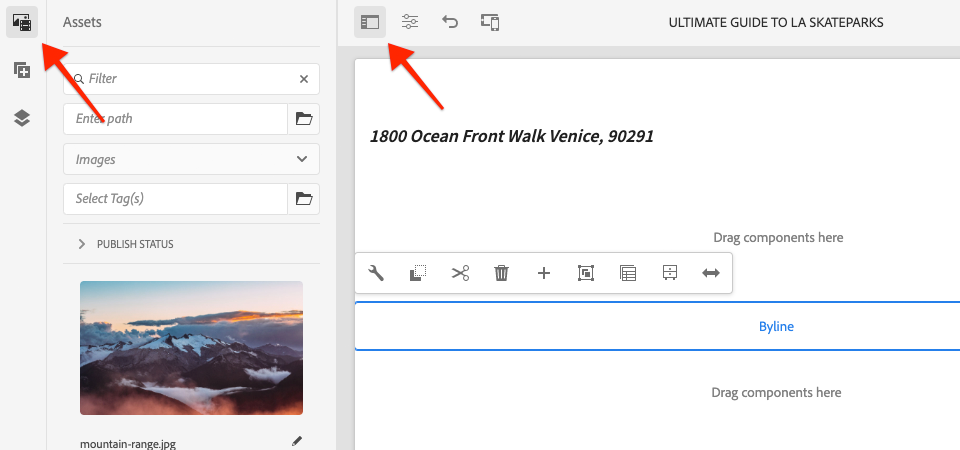

# Custom Component (composant personnalisé){#custom-component}

Ce tutoriel porte sur la création de bout en bout d’un composant de ligne d’AEM personnalisé qui affiche le contenu créé dans une boîte de dialogue et explore le développement d’un modèle Sling pour encapsuler la logique commerciale qui renseigne le code HTL du composant.

## Prérequis {#prerequisites}

Examinez les outils et instructions requis pour configurer un [environnement de développement local](overview.md#local-dev-environment).

### Projet de démarrage

>[!NOTE]
>
> Si vous avez terminé avec succès le chapitre précédent, vous pouvez réutiliser le projet et ignorer les étapes d’extraction du projet de démarrage.

Consultez le code de ligne de base sur lequel le tutoriel s’appuie :

1. Extrayez la branche `tutorial/custom-component-start` à partir de [GitHub](https://github.com/adobe/aem-guides-wknd)

   ```shell
   $ cd aem-guides-wknd
   $ git checkout tutorial/custom-component-start
   ```

1. Déployez la base de code sur une instance d’AEM locale à l’aide de vos compétences Maven :

   ```shell
   $ mvn clean install -PautoInstallSinglePackage
   ```

   >[!NOTE]
   >
   > Si vous utilisez AEM 6.5 ou 6.4, ajoutez le profil `classic` à toute commande Maven.

   ```shell
   $ mvn clean install -PautoInstallSinglePackage -Pclassic
   ```

Vous pouvez toujours afficher le code terminé sur [GitHub](https://github.com/adobe/aem-guides-wknd/tree/tutorial/custom-component-solution) ou extraire le code localement en passant à la branche `tutorial/custom-component-solution`.

## Intention

1. Comprendre comment créer un composant d’AEM personnalisé
1. Découvrez comment encapsuler la logique commerciale avec les modèles Sling
1. Comprendre comment utiliser un modèle Sling dans un script HTL

## Ce que vous allez créer {#byline-component}

Dans cette partie du tutoriel WKND, un composant de signature est créé afin d’afficher les informations créées sur le contributeur d’un article.


*Composant Byline*

L’implémentation du composant Signature comprend une boîte de dialogue qui collecte le contenu de la signature et un modèle Sling personnalisé qui récupère celui de la signature :

* Nom
* Image
* Professions

## Créer un composant Byline {#create-byline-component}

Créez tout d’abord la structure de noeud Composant signature et définissez une boîte de dialogue. Cela représente le composant dans AEM et définit implicitement le type de ressource du composant en fonction de son emplacement dans le JCR.

La boîte de dialogue expose l’interface que les auteurs de contenu peuvent fournir. Pour cette implémentation, le composant **Image** du composant principal de la gestion du contenu web d’AEM sera utilisé pour gérer la création et le rendu de l’image de la signature. Il sera donc défini comme `sling:resourceSuperType` de notre composant.

### Créer une définition de composant {#create-component-definition}

1. Dans le module **ui.apps** , accédez à `/apps/wknd/components` et créez un dossier nommé `byline`.
1. Sous le dossier `byline`, ajoutez un nouveau fichier nommé `.content.xml`

   

1. Renseignez le fichier `.content.xml` avec les éléments suivants :

   ```xml
   <?xml version="1.0" encoding="UTF-8"?>
       <jcr:root xmlns:sling="http://sling.apache.org/jcr/sling/1.0" xmlns:cq="http://www.day.com/jcr/cq/1.0" xmlns:jcr="http://www.jcp.org/jcr/1.0"
       jcr:primaryType="cq:Component"
       jcr:title="Byline"
       jcr:description="Displays a contributor's byline."
       componentGroup="WKND Sites Project - Content"
       sling:resourceSuperType="core/wcm/components/image/v2/image"/>
   ```

   Le fichier XML ci-dessus fournit la définition du composant, y compris le titre, la description et le groupe. `sling:resourceSuperType` pointe vers `core/wcm/components/image/v2/image`, qui est le [composant d’image principal](https://experienceleague.adobe.com/docs/experience-manager-core-components/using/components/image.html?lang=fr).

### Créez le script HTL {#create-the-htl-script}

1. Sous le dossier `byline` , ajoutez un nouveau fichier `byline.html`, responsable de la présentation HTML du composant. Il est important de nommer le fichier de la même manière que le dossier, car il devient le script par défaut utilisé par Sling pour effectuer le rendu de ce type de ressource.

1. Ajoutez le code suivant à la balise `byline.html`.

   ```html
   <!--/* byline.html */-->
   <div data-sly-use.placeholderTemplate="core/wcm/components/commons/v1/templates.html">
   </div>
   <sly data-sly-call="${placeholderTemplate.placeholder @ isEmpty=true}"></sly>
   ```

`byline.html` est  [revisité ultérieurement](#byline-htl), une fois le modèle Sling créé. L’état actuel du fichier HTL permet au composant de s’afficher dans un état vide dans l’éditeur de page d’AEM Sites lorsqu’il est glissé-déposé sur la page.

### Création de la définition de boîte de dialogue {#create-the-dialog-definition}

Définissez ensuite une boîte de dialogue pour le composant Byline avec les champs suivants :

* **Nom** : un champ de texte du nom du contributeur.
* **Image** : une référence à la biographie du contributeur.
* **Professions** : une liste des emplois attribués au contributeur. Les professions doivent être classées par ordre alphabétique croissant (de a à z).

1. Sous le dossier `byline` , créez un dossier nommé `_cq_dialog`.
1. Sous `byline/_cq_dialog`, ajoutez un nouveau fichier nommé `.content.xml`. Il s’agit de la définition XML de la boîte de dialogue. Ajoutez le code XML suivant :

   ```xml
   <?xml version="1.0" encoding="UTF-8"?>
   <jcr:root xmlns:sling="http://sling.apache.org/jcr/sling/1.0" xmlns:cq="http://www.day.com/jcr/cq/1.0" xmlns:jcr="http://www.jcp.org/jcr/1.0" xmlns:nt="http://www.jcp.org/jcr/nt/1.0"
           jcr:primaryType="nt:unstructured"
           jcr:title="Byline"
           sling:resourceType="cq/gui/components/authoring/dialog">
       <content
               jcr:primaryType="nt:unstructured"
               sling:resourceType="granite/ui/components/coral/foundation/container">
           <items jcr:primaryType="nt:unstructured">
               <tabs
                       jcr:primaryType="nt:unstructured"
                       sling:resourceType="granite/ui/components/coral/foundation/tabs"
                       maximized="{Boolean}false">
                   <items jcr:primaryType="nt:unstructured">
                       <asset
                               jcr:primaryType="nt:unstructured"
                               sling:hideResource="{Boolean}false"/>
                       <metadata
                               jcr:primaryType="nt:unstructured"
                               sling:hideResource="{Boolean}true"/>
                       <properties
                               jcr:primaryType="nt:unstructured"
                               jcr:title="Properties"
                               sling:resourceType="granite/ui/components/coral/foundation/container"
                               margin="{Boolean}true">
                           <items jcr:primaryType="nt:unstructured">
                               <columns
                                       jcr:primaryType="nt:unstructured"
                                       sling:resourceType="granite/ui/components/coral/foundation/fixedcolumns"
                                       margin="{Boolean}true">
                                   <items jcr:primaryType="nt:unstructured">
                                       <column
                                               jcr:primaryType="nt:unstructured"
                                               sling:resourceType="granite/ui/components/coral/foundation/container">
                                           <items jcr:primaryType="nt:unstructured">
                                               <name
                                                       jcr:primaryType="nt:unstructured"
                                                       sling:resourceType="granite/ui/components/coral/foundation/form/textfield"
                                                       emptyText="Enter the contributor's name to display."
                                                       fieldDescription="The contributor's name to display."
                                                       fieldLabel="Name"
                                                       name="./name"
                                                       required="{Boolean}true"/>
                                               <occupations
                                                       jcr:primaryType="nt:unstructured"
                                                       sling:resourceType="granite/ui/components/coral/foundation/form/multifield"
                                                       fieldDescription="A list of the contributor's occupations."
                                                       fieldLabel="Occupations"
                                                       required="{Boolean}false">
                                                   <field
                                                           jcr:primaryType="nt:unstructured"
                                                           sling:resourceType="granite/ui/components/coral/foundation/form/textfield"
                                                           emptyText="Enter an occupation"
                                                           name="./occupations"/>
                                               </occupations>
                                           </items>
                                       </column>
                                   </items>
                               </columns>
                           </items>
                       </properties>
                   </items>
               </tabs>
           </items>
       </content>
   </jcr:root>
   ```

   Ces définitions de noeud de boîte de dialogue utilisent [Sling Resource Merger](https://sling.apache.org/documentation/bundles/resource-merger.html) pour contrôler quels onglets de boîte de dialogue sont hérités du composant `sling:resourceSuperType`, dans ce cas le **composant d’image des composants principaux**.

   

### Création de la boîte de dialogue Stratégie {#create-the-policy-dialog}

Selon la même approche que pour la création de boîte de dialogue, créez une boîte de dialogue Stratégie (anciennement appelée boîte de dialogue de conception) pour masquer les champs indésirables dans la configuration Stratégie héritée du composant Image des composants principaux.

1. Sous le dossier `byline` , créez un dossier nommé `_cq_design_dialog`.
1. Sous `byline/_cq_design_dialog`, créez un fichier nommé `.content.xml`. Mettez à jour le fichier avec ce qui suit : avec le code XML suivant. Il est plus facile d’ouvrir la balise `.content.xml` et de copier/coller le code XML ci-dessous.

   ```xml
   <?xml version="1.0" encoding="UTF-8"?>
   <jcr:root xmlns:sling="http://sling.apache.org/jcr/sling/1.0" xmlns:granite="http://www.adobe.com/jcr/granite/1.0" xmlns:cq="http://www.day.com/jcr/cq/1.0" xmlns:jcr="http://www.jcp.org/jcr/1.0" xmlns:nt="http://www.jcp.org/jcr/nt/1.0"
       jcr:primaryType="nt:unstructured"
       jcr:title="Byline"
       sling:resourceType="cq/gui/components/authoring/dialog">
       <content
               jcr:primaryType="nt:unstructured">
           <items jcr:primaryType="nt:unstructured">
               <tabs
                       jcr:primaryType="nt:unstructured">
                   <items jcr:primaryType="nt:unstructured">
                       <properties
                               jcr:primaryType="nt:unstructured">
                           <items jcr:primaryType="nt:unstructured">
                               <content
                                       jcr:primaryType="nt:unstructured">
                                   <items jcr:primaryType="nt:unstructured">
                                       <decorative
                                               jcr:primaryType="nt:unstructured"
                                               sling:hideResource="{Boolean}true"/>
                                       <altValueFromDAM
                                               jcr:primaryType="nt:unstructured"
                                               sling:hideResource="{Boolean}true"/>
                                       <titleValueFromDAM
                                               jcr:primaryType="nt:unstructured"
                                               sling:hideResource="{Boolean}true"/>
                                       <displayCaptionPopup
                                               jcr:primaryType="nt:unstructured"
                                               sling:hideResource="{Boolean}true"/>
                                       <disableUuidTracking
                                               jcr:primaryType="nt:unstructured"
                                               sling:hideResource="{Boolean}true"/>
                                   </items>
                               </content>
                           </items>
                       </properties>
                       <features
                               jcr:primaryType="nt:unstructured">
                           <items jcr:primaryType="nt:unstructured">
                               <content
                                       jcr:primaryType="nt:unstructured">
                                   <items jcr:primaryType="nt:unstructured">
                                       <accordion
                                               jcr:primaryType="nt:unstructured">
                                           <items jcr:primaryType="nt:unstructured">
                                               <orientation
                                                       jcr:primaryType="nt:unstructured"
                                                       sling:hideResource="{Boolean}true"/>
                                               <crop
                                                       jcr:primaryType="nt:unstructured"
                                                       sling:hideResource="{Boolean}true"/>
                                           </items>
                                       </accordion>
                                   </items>
                               </content>
                           </items>
                       </features>
                   </items>
               </tabs>
           </items>
       </content>
   </jcr:root>
   ```

   La base de la **boîte de dialogue de stratégie** XML précédente a été obtenue à partir du [composant d’image des composants principaux](https://github.com/adobe/aem-core-wcm-components/blob/master/content/src/content/jcr_root/apps/core/wcm/components/image/v2/image/_cq_design_dialog/.content.xml).

   Comme dans la configuration de la boîte de dialogue, [Sling Resource Merger](https://sling.apache.org/documentation/bundles/resource-merger.html) est utilisé pour masquer les champs non pertinents qui sont par ailleurs hérités de `sling:resourceSuperType`, comme le montrent les définitions de noeud avec la propriété `sling:hideResource="{Boolean}true"`.

### Déployer le code {#deploy-the-code}

1. Déployez la base de code mise à jour sur une instance d’AEM locale à l’aide de vos compétences Maven :

   ```shell
   $ cd aem-guides-wknd
   $ mvn clean install -PautoInstallSinglePackage
   ```

## Ajouter le composant à une page {#add-the-component-to-a-page}

Pour simplifier les choses et se concentrer sur le développement AEM composant, nous allons ajouter le composant Byline dans son état actuel à une page Article afin de vérifier que la définition de noeud `cq:Component` est déployée et correcte, AEM reconnaît la nouvelle définition de composant et la boîte de dialogue du composant fonctionne pour la création.

### Ajout d’une image à AEM Assets

Tout d’abord, téléchargez un exemple de capture d’écran vers AEM Assets à utiliser pour remplir l’image dans le composant de signature.

1. Accédez au dossier LA Skateparks dans AEM Assets : [http://localhost:4502/assets.html/content/dam/wknd/en/magazine/la-skateparks](http://localhost:4502/assets.html/content/dam/wknd/en/magazine/la-skateparks).

1. Téléchargez la capture d’écran de **[stacey-roswells.jpg](assets/custom-component/stacey-roswells.jpg)** dans le dossier.

   

### Créez le composant {#author-the-component}

Ajoutez ensuite le composant Byline à une page dans AEM. Puisque nous avons ajouté le composant Byline au groupe de composants **WKND Sites Project - Content**, par l’intermédiaire de la définition `ui.apps/src/main/content/jcr_root/apps/wknd/components/byline/.content.xml`, il est automatiquement disponible pour tout groupe de composants **Conteneur** dont la **Stratégie** autorise le **projet WKND Sites - Contenu** , qui est le conteneur de mise en page de l’article est .

1. Accédez à l’article LA Skatepark à l’adresse : [http://localhost:4502/editor.html/content/wknd/us/en/magazine/guide-la-skateparks.html](http://localhost:4502/editor.html/content/wknd/us/en/magazine/guide-la-skateparks.html)

1. Dans la barre latérale gauche, faites glisser un **composant Byline** sur **bottom** du conteneur de mises en page de la page d’article ouverte.

   

1. Assurez-vous que la barre latérale gauche **est ouverte** et visible, et que l’**outil de recherche de ressources** est sélectionné.

   

1. Sélectionnez l’**espace réservé du composant de signature**, qui à son tour affiche la barre d’actions et appuyez sur l’icône **clé à molette** pour ouvrir la boîte de dialogue.

   

1. Une fois la boîte de dialogue ouverte et le premier onglet (Ressource) principal, ouvrez la barre latérale gauche. Faites glisser une image dans la zone de dépôt Image à partir de l’outil de recherche de ressources. Recherchez &quot;stacey&quot; pour trouver l’image biographique de Stacey Roswells fournie dans le package ui.content WKND.

   

1. Après avoir ajouté une image, cliquez sur l’onglet **Propriétés** pour saisir le **Nom** et **Professions**.

   Lorsque vous entrez dans une profession, entrez-les dans l&#39;ordre **alphabétique inverse** afin que la logique d&#39;entreprise alphabétisante que nous allons mettre en oeuvre dans le modèle Sling soit facilement apparente.

   Appuyez sur le bouton **Terminé** en bas à droite pour enregistrer les modifications.

   

   AEM les auteurs configurent et créent des composants via les boîtes de dialogue. À ce stade du développement du composant Byline, les boîtes de dialogue sont incluses pour la collecte des données, mais la logique de rendu du contenu créé n’a pas encore été ajoutée. Par conséquent, seul l’espace réservé s’affiche.

1. Après avoir enregistré la boîte de dialogue, accédez à [CRXDE Lite](http://localhost:4502/crx/de/index.jsp#/content/wknd/us/en/magazine/guide-la-skateparks/jcr%3Acontent/root/container/container/byline) et vérifiez comment le contenu du composant est stocké sur le noeud de contenu du composant d’origine sous la page AEM.

   Recherchez le noeud de contenu du composant Byline sous la page LA Skate Parks, c’est-à-dire `/content/wknd/us/en/magazine/guide-la-skateparks/jcr:content/root/container/container/byline`.

   Notez que les noms de propriété `name`, `occupations` et `fileReference` sont stockés sur le **noeud de ligne**.

   Notez également que la valeur `sling:resourceType` du noeud est définie sur `wknd/components/content/byline`, ce qui lie ce noeud de contenu à l’implémentation du composant de signature.

   

## Créer un modèle Sling de signature {#create-sling-model}

Ensuite, nous allons créer un modèle Sling pour agir comme modèle de données et héberger la logique commerciale du composant Signature.

Les modèles Sling sont des objets POJO (Plain Old Java Object) Java pilotés par les annotations. Ils facilitent le mappage des données du JCR aux variables Java et fournissent un certain nombre d’autres détails lors du développement dans le contexte d’AEM.

### Examinez les dépendances Maven {#maven-dependency}

Le modèle Sling de signature repose sur plusieurs API Java fournies par AEM. Ces API sont disponibles via la liste `dependencies` répertoriée dans le fichier POM du module `core`. Le projet utilisé pour ce tutoriel a été créé pour AEM en tant que Cloud Service. Cependant, il est unique dans la mesure où il est compatible avec AEM 6.5/6.4. Par conséquent, les deux dépendances pour Cloud Service et AEM 6.x sont incluses.

1. Ouvrez le fichier `pom.xml` sous `<src>/aem-guides-wknd/core/pom.xml`.
1. Recherchez la dépendance pour `aem-sdk-api` - **AEM en tant que Cloud Service uniquement**

   ```xml
   <dependency>
       <groupId>com.adobe.aem</groupId>
       <artifactId>aem-sdk-api</artifactId>
   </dependency>
   ```

   [aem-sdk-api](https://experienceleague.adobe.com/docs/experience-manager-cloud-service/implementing/developing/aem-as-a-cloud-service-sdk.html?lang=fr#building-for-the-sdk) contient toutes les API Java publiques exposées par AEM. `aem-sdk-api` est utilisé par défaut lors de la création de ce projet. La version est conservée dans le modèle pom du réacteur parent situé à la racine du projet à `aem-guides-wknd/pom.xml`.

1. Recherchez la dépendance pour `uber-jar` - **AEM 6.5/6.4 Only**

   ```xml
   ...
       <dependency>
           <groupId>com.adobe.aem</groupId>
           <artifactId>uber-jar</artifactId>
           <classifier>apis</classifier>
       </dependency>
   ...
   ```

   `uber-jar` n’est inclus que lorsque le profil `classic` est appelé, c’est-à-dire `mvn clean install -PautoInstallSinglePackage -Pclassic`. Encore une fois, c&#39;est unique à ce projet. Dans un projet réel, généré à partir de l’archétype de projet AEM, `uber-jar` sera la valeur par défaut si la version d’AEM spécifiée est 6.5 ou 6.4.

   [uber-jar](https://docs.adobe.com/content/help/en/experience-manager-65/developing/devtools/ht-projects-maven.html#experience-manager-api-dependencies) contient toutes les API Java publiques exposées par AEM 6.x. La version est conservée dans le modèle pom du réacteur parent situé à la racine du projet `aem-guides-wknd/pom.xml`.

1. Recherchez la dépendance pour `core.wcm.components.core` :

   ```xml
    <!-- Core Component Dependency -->
       <dependency>
           <groupId>com.adobe.cq</groupId>
           <artifactId>core.wcm.components.core</artifactId>
       </dependency>
   ```

   Il s’agit de l’ensemble des API Java publiques exposées par AEM Core Components. AEM Core Components est un projet géré en dehors d’AEM et a donc un cycle de publication distinct. C’est pourquoi il s’agit d’une dépendance qui doit être incluse séparément et qui est **et non** incluse avec la balise `uber-jar` ou `aem-sdk-api`.

   Comme l’uber-jar, la version de cette dépendance est conservée dans le fichier pom du réacteur parent situé à l’emplacement `aem-guides-wknd/pom.xml`.

   Plus loin dans ce tutoriel, nous utiliserons la classe Image des composants principaux pour afficher l’image dans le composant Byline. Il est nécessaire d’avoir la dépendance de composant principal pour créer et compiler notre modèle Sling.

### Interface de signature {#byline-interface}

Créez une interface Java publique pour la signature. `Byline.java` définit les méthodes publiques nécessaires pour piloter le script  `byline.html` HTL.

1. Dans le module `aem-guides-wknd.core` sous `core/src/main/java/com/adobe/aem/guides/wknd/core/models`, créez un fichier nommé `Byline.java`.

   

1. Mettez à jour `Byline.java` avec les méthodes suivantes :

   ```java
   package com.adobe.aem.guides.wknd.core.models;
   
   import java.util.List;
   
   /**
   * Represents the Byline AEM Component for the WKND Site project.
   **/
   public interface Byline {
       /***
       * @return a string to display as the name.
       */
       String getName();
   
       /***
       * Occupations are to be sorted alphabetically in a descending order.
       *
       * @return a list of occupations.
       */
       List<String> getOccupations();
   
       /***
       * @return a boolean if the component has enough content to display.
       */
       boolean isEmpty();
   }
   ```

   Les deux premières méthodes exposent les valeurs des **name** et **occupations** pour le composant de signature.

   La méthode `isEmpty()` permet de déterminer si le contenu du composant doit être rendu ou s’il attend d’être configuré.

   Notez qu’il n’existe aucune méthode pour l’image ; [Nous allons examiner les raisons pour lesquelles cela se produit plus tard](#tackling-the-image-problem).

### Implémentation par signature {#byline-implementation}

`BylineImpl.java` est l’implémentation du modèle Sling qui implémente l’ `Byline.java` interface définie précédemment. Le code complet de `BylineImpl.java` se trouve au bas de cette section.

1. Créez un dossier nommé `impl` sous `core/src/main/java/com/adobe/aem/guides/core/models`.
1. Dans le dossier `impl` , créez un fichier `BylineImpl.java`.

   

1. Ouvrez `BylineImpl.java`. Indiquez qu’il implémente l’interface `Byline` . Utilisez les fonctionnalités de saisie semi-automatique de l’IDE ou mettez à jour manuellement le fichier pour inclure les méthodes nécessaires à l’implémentation de l’interface `Byline` :

   ```java
   package com.adobe.aem.guides.wknd.core.models.impl;
   import java.util.List;
   import com.adobe.aem.guides.wknd.core.models.Byline;
   
   public class BylineImpl implements Byline {
   
       @Override
       public String getName() {
           // TODO Auto-generated method stub
           return null;
       }
   
       @Override
       public List<String> getOccupations() {
           // TODO Auto-generated method stub
           return null;
       }
   
       @Override
       public boolean isEmpty() {
           // TODO Auto-generated method stub
           return false;
       }
   }
   ```

1. Ajoutez les annotations du modèle Sling en mettant à jour `BylineImpl.java` avec les annotations au niveau de la classe suivantes. Cette `@Model(..)`annotation fait de la classe un modèle Sling.

   ```java
   import org.apache.sling.api.SlingHttpServletRequest;
   import org.apache.sling.models.annotations.Model;
   import org.apache.sling.models.annotations.DefaultInjectionStrategy;
   ...
   @Model(
           adaptables = {SlingHttpServletRequest.class},
           adapters = {Byline.class},
           resourceType = {BylineImpl.RESOURCE_TYPE},
           defaultInjectionStrategy = DefaultInjectionStrategy.OPTIONAL
   )
   public class BylineImpl implements Byline {
       protected static final String RESOURCE_TYPE = "wknd/components/content/byline";
       ...
   }
   ```

   Examinons cette annotation et ses paramètres :

   * L’annotation `@Model` enregistre BylineImpl en tant que modèle Sling lorsqu’il est déployé sur AEM.
   * Le paramètre `adaptables` indique que ce modèle peut être adapté par la requête.
   * Le paramètre `adapters` permet à la classe d’implémentation d’être enregistrée sous l’interface de signature. Cela permet au script HTL d’appeler le modèle Sling via l’interface (au lieu de l’impl directement). [Vous trouverez plus d’informations sur les adaptateurs ici](https://sling.apache.org/documentation/bundles/models.html#specifying-an-alternate-adapter-class-since-110).
   * `resourceType` pointe vers le type de ressource de composant Byline (créé précédemment) et aide à résoudre le modèle correct en cas d’implémentations multiples. [Vous trouverez plus d’informations sur l’association d’une classe de modèle à un type de ressource ici](https://sling.apache.org/documentation/bundles/models.html#associating-a-model-class-with-a-resource-type-since-130).

### Implémentation des méthodes de modèle Sling {#implementing-the-sling-model-methods}

#### getName() {#implementing-get-name}

La première méthode que nous allons aborder est `getName()` , qui renvoie simplement la valeur stockée dans le noeud de contenu JCR de la signature sous la propriété `name`.

Pour ce faire, l’annotation de modèle Sling `@ValueMapValue` est utilisée pour injecter la valeur dans un champ Java à l’aide de la ValueMap de la ressource de requête.


```java
import org.apache.sling.models.annotations.injectorspecific.ValueMapValue;

public class BylineImpl implements Byline {
    ...
    @ValueMapValue
    private String name;

    ...
    @Override
    public String getName() {
        return name;
    }
    ...
}
```

Comme la propriété JCR partage le même nom que le champ Java (les deux sont &quot;name&quot;), `@ValueMapValue` résout automatiquement cette association et injecte la valeur de la propriété dans le champ Java.

#### getOccupations() {#implementing-get-occupations}

La méthode suivante à mettre en oeuvre est `getOccupations()`. Cette méthode collecte toutes les occupations stockées dans la propriété JCR `occupations` et renvoie une collection triée (alphabétiquement) de celles-ci.

En utilisant la même technique explorée dans `getName()`, la valeur de propriété peut être injectée dans le champ du modèle Sling.

Une fois que les valeurs de propriété JCR sont disponibles dans le modèle Sling via le champ Java injecté `occupations`, la logique métier de tri peut être appliquée à la méthode `getOccupations()` .


```java
import java.util.ArrayList;
import java.util.Collections;
  ...

public class BylineImpl implements Byline {
    ...
    @ValueMapValue
    private List<String> occupations;
    ...
    @Override
    public List<String> getOccupations() {
        if (occupations != null) {
            Collections.sort(occupations);
            return new ArrayList<String>(occupations);
        } else {
            return Collections.emptyList();
        }
    }
    ...
}
  ...
```


#### isEmpty() {#implementing-is-empty}

La dernière méthode publique est `isEmpty()` , qui détermine le moment où le composant doit se considérer comme &quot;suffisamment créé&quot; pour effectuer le rendu.

Pour ce composant, nous avons des exigences commerciales indiquant que les trois champs, nom, image et occupations doivent être remplis *avant* que le composant puisse être rendu.


```java
import org.apache.commons.lang3.StringUtils;
  ...
public class BylineImpl implements Byline {
    ...
    @Override
    public boolean isEmpty() {
        if (StringUtils.isBlank(name)) {
            // Name is missing, but required
            return true;
        } else if (occupations == null || occupations.isEmpty()) {
            // At least one occupation is required
            return true;
        } else if (/* image is not null, logic to be determined */) {
            // A valid image is required
            return true;
        } else {
            // Everything is populated, so this component is not considered empty
            return false;
        }
    }
    ...
}
```


#### Traitement du &quot;problème de l&#39;image&quot; {#tackling-the-image-problem}

La vérification des conditions de nom et d’occupation est triviale (et Apache Commons Lang3 fournit la classe [StringUtils](https://commons.apache.org/proper/commons-lang/apidocs/org/apache/commons/lang3/StringUtils.html) toujours pratique). Cependant, la manière dont la **présence de l’image** peut être validée, étant donné que le composant d’image des composants principaux est utilisé pour faire surface de l’image.

Il existe deux façons de s&#39;y attaquer :

Vérifiez si la propriété `fileReference` JCR correspond à une ressource. ** Convertissez cette ressource en modèle Sling d’image de composant principal et assurez-vous que la  `getSrc()` méthode n’est pas vide.

Nous allons opter pour l’approche **second**. La première approche est probablement suffisante, mais dans ce tutoriel, cette dernière sera utilisée pour nous permettre d’explorer d’autres fonctionnalités des modèles Sling.

1. Créez une méthode privée qui récupère l’image. Cette méthode est laissée privée car nous n’avons pas besoin d’exposer l’objet Image dans le HTL lui-même, et il est utilisé uniquement pour piloter `isEmpty().`

   La méthode privée suivante pour `getImage()` :

   ```java
   import com.adobe.cq.wcm.core.components.models.Image;
   ...
   private Image getImage() {
       Image image = null;
       // Figure out how to populate the image variable!
       return image;
   }
   ```

   Comme mentionné ci-dessus, il existe deux autres méthodes pour obtenir le **modèle Sling d’image** :

   Le premier utilise l’annotation `@Self` pour adapter automatiquement la requête actuelle à la balise `Image.class` du composant principal.

   ```java
   @Self
   private Image image;
   ```

   La seconde utilise le service OSGi [Apache Sling ModelFactory](https://sling.apache.org/apidocs/sling10/org/apache/sling/models/factory/ModelFactory.html), qui est très pratique, et nous aide à créer des modèles Sling d’autres types dans le code Java.

   Nous allons opter pour la seconde approche.

   >[!NOTE]
   >
   >Dans une mise en oeuvre réelle, l’approche &quot;One&quot;, en utilisant `@Self` est préférable, car il s’agit de la solution la plus simple et la plus élégante. Dans ce tutoriel, nous utiliserons la deuxième approche, car elle nous oblige à explorer d’autres facettes des modèles Sling qui sont extrêmement utiles, c’est-à-dire des composants plus complexes !

   Comme les modèles Sling sont des services POJO Java et non des services OSGi, les annotations d’injection OSGi habituelles `@Reference` **ne peuvent pas** être utilisées, à la place, les modèles Sling fournissent une annotation **[@OSGiService](https://sling.apache.org/documentation/bundles/models.html#injector-specific-annotations)** spéciale qui fournit des fonctionnalités similaires.

1. Mettez à jour `BylineImpl.java` pour inclure l’annotation `OSGiService` afin d’injecter la balise `ModelFactory` :

   ```java
   import org.apache.sling.models.factory.ModelFactory;
   import org.apache.sling.models.annotations.injectorspecific.OSGiService;
   ...
   public class BylineImpl implements Byline {
       ...
       @OSGiService
       private ModelFactory modelFactory;
   }
   ```

   Avec `ModelFactory` disponible, un modèle Sling d’image de composant principal peut être créé à l’aide de :

   ```java
   modelFactory.getModelFromWrappedRequest(SlingHttpServletRequest request, Resource resource, java.lang.Class<T> targetClass)
   ```

   Toutefois, cette méthode nécessite une requête et une ressource, qui ne sont pas encore disponibles dans le modèle Sling. Pour les obtenir, d’autres annotations de modèle Sling sont utilisées.

   Pour obtenir la requête actuelle, l’annotation **[@Self](https://sling.apache.org/documentation/bundles/models.html#injector-specific-annotations)** peut être utilisée pour injecter l’annotation `adaptable` (définie dans `@Model(..)` comme `SlingHttpServletRequest.class`, dans un champ de classe Java.

1. Ajoutez l’annotation **@Self** pour obtenir la requête **SlingHttpServletRequest** :

   ```java
   import org.apache.sling.models.annotations.injectorspecific.Self;
   ...
   @Self
   private SlingHttpServletRequest request;
   ```

   N’oubliez pas que l’utilisation de `@Self Image image` pour injecter le modèle Sling d’image du composant principal était une option ci-dessus. L’annotation `@Self` tente d’injecter l’objet adaptable (dans notre cas, SlingHttpServletRequest) et s’adapte au type de champ d’annotation. Étant donné que le modèle Sling d’image des composants principaux est adaptable à partir des objets SlingHttpServletRequest , cela aurait fonctionné et est moins de code que notre approche plus exploratoire.

   Nous avons maintenant injecté les variables nécessaires pour instancier notre modèle d’image via l’API ModelFactory. Nous utiliserons l’annotation **[@PostConstruct](https://sling.apache.org/documentation/bundles/models.html#postconstruct-methods)** du modèle Sling pour obtenir cet objet après l’instanciation du modèle Sling.

   `@PostConstruct` est incroyablement utile et agit de la même manière qu’un constructeur. Cependant, il est appelé une fois la classe instanciée et tous les champs Java annotés injectés. Tandis que d’autres annotations de modèle Sling annotent des champs de classe Java (variables), `@PostConstruct` annote un vide, une méthode de paramètre zéro, généralement appelée `init()` (mais peut être nommée n’importe quel élément).

1. Ajoutez la méthode **@PostConstruct** :

   ```java
   import javax.annotation.PostConstruct;
   ...
   public class BylineImpl implements Byline {
       ...
       private Image image;
   
       @PostConstruct
       private void init() {
           image = modelFactory.getModelFromWrappedRequest(request,
                                                           request.getResource(),
                                                           Image.class);
       }
       ...
   }
   ```

   N’oubliez pas que les modèles Sling sont des services OSGi **NOT**. Il est donc sûr de conserver l’état de classe. Souvent `@PostConstruct` crée et configure l’état de classe de modèle Sling pour une utilisation ultérieure, comme le fait un constructeur simple.

   Notez que si la méthode `@PostConstruct` renvoie une exception, le modèle Sling n’instanciera pas (il sera nul).

1. **getImage()**  peut désormais être mis à jour pour renvoyer simplement l’objet image.

   ```java
   /**
       * @return the Image Sling Model of this resource, or null if the resource cannot create a valid Image Sling Model.
   */
   private Image getImage() {
       return image;
   }
   ```

1. Revenons à `isEmpty()` et terminons l’implémentation :

   ```java
   @Override
   public boolean isEmpty() {
      final Image componentImage = getImage();
   
       if (StringUtils.isBlank(name)) {
           // Name is missing, but required
           return true;
       } else if (occupations == null || occupations.isEmpty()) {
           // At least one occupation is required
           return true;
       } else if (componentImage == null || StringUtils.isBlank(componentImage.getSrc())) {
           // A valid image is required
           return true;
       } else {
           // Everything is populated, so this component is not considered empty
           return false;
       }
   }
   ```

   Notez que plusieurs appels à `getImage()` ne posent pas problème, car renvoie la variable de classe `image` initialisée et n’appelle pas `modelFactory.getModelFromWrappedRequest(...)` ce qui n’est pas trop coûteux, mais qui mérite d’être appelé inutilement.

1. La dernière balise `BylineImpl.java` doit se présenter comme suit :


   ```java
   package com.adobe.aem.guides.wknd.core.models.impl;
   
   import java.util.ArrayList;
   import java.util.Collections;
   import java.util.List;
   import javax.annotation.PostConstruct;
   import org.apache.commons.lang3.StringUtils;
   import org.apache.sling.api.SlingHttpServletRequest;
   import org.apache.sling.models.annotations.DefaultInjectionStrategy;
   import org.apache.sling.models.annotations.Model;
   import org.apache.sling.models.annotations.injectorspecific.OSGiService;
   import org.apache.sling.models.annotations.injectorspecific.Self;
   import org.apache.sling.models.annotations.injectorspecific.ValueMapValue;
   import org.apache.sling.models.factory.ModelFactory;
   import com.adobe.aem.guides.wknd.core.models.Byline;
   import com.adobe.cq.wcm.core.components.models.Image;
   
   @Model(
           adaptables = {SlingHttpServletRequest.class},
           adapters = {Byline.class},
           resourceType = {BylineImpl.RESOURCE_TYPE},
           defaultInjectionStrategy = DefaultInjectionStrategy.OPTIONAL
   )
   public class BylineImpl implements Byline {
       protected static final String RESOURCE_TYPE = "wknd/components/content/byline";
   
       @Self
       private SlingHttpServletRequest request;
   
       @OSGiService
       private ModelFactory modelFactory;
   
       @ValueMapValue
       private String name;
   
       @ValueMapValue
       private List<String> occupations;
   
       private Image image;
   
       @PostConstruct
       private void init() {
           image = modelFactory.getModelFromWrappedRequest(request, request.getResource(), Image.class);
       }
   
       @Override
       public String getName() {
           return name;
       }
   
       @Override
       public List<String> getOccupations() {
           if (occupations != null) {
               Collections.sort(occupations);
               return new ArrayList<String>(occupations);
           } else {
               return Collections.emptyList();
           }
       }
   
       @Override
       public boolean isEmpty() {
           final Image componentImage = getImage();
   
           if (StringUtils.isBlank(name)) {
               // Name is missing, but required
               return true;
           } else if (occupations == null || occupations.isEmpty()) {
               // At least one occupation is required
               return true;
           } else if (componentImage == null || StringUtils.isBlank(componentImage.getSrc())) {
               // A valid image is required
               return true;
           } else {
               // Everything is populated, so this component is not considered empty
               return false;
           }
       }
   
       /**
       * @return the Image Sling Model of this resource, or null if the resource cannot create a valid Image Sling Model.
       */
       private Image getImage() {
           return image;
       }
   }
   ```


## Byline HTL {#byline-htl}

Dans le module `ui.apps` , ouvrez `/apps/wknd/components/byline/byline.html` que nous avons créé dans la configuration précédente du composant AEM.

```html
<div data-sly-use.placeholderTemplate="core/wcm/components/commons/v1/templates.html">
</div>
<sly data-sly-call="${placeholderTemplate.placeholder @ isEmpty=false}"></sly>
```

Examinons ce que ce script HTL fait jusqu’à présent :

* `placeholderTemplate` pointe vers l’espace réservé des composants principaux, qui s’affiche lorsque le composant n’est pas entièrement configuré. Cela s’affiche dans l’éditeur de page AEM Sites sous la forme d’une boîte avec le titre du composant, comme défini ci-dessus dans la propriété `cq:Component` de `jcr:title`.

* `data-sly-call="${placeholderTemplate.placeholder @ isEmpty=false}` charge la balise `placeholderTemplate` définie ci-dessus et transmet une valeur booléenne (actuellement codée en dur sur `false`) dans le modèle d’espace réservé. Si `isEmpty` est vrai, le modèle d’espace réservé effectue le rendu de la zone grise, sinon il ne rend rien.

### Mettre à jour le protocole HTL

1. Mettez à jour **byline.html** avec la structure HTML squelettique suivante :

   ```html
   <div data-sly-use.placeholderTemplate="core/wcm/components/commons/v1/templates.html"
       class="cmp-byline">
           <div class="cmp-byline__image">
               <!--/* Include the Core Components Image Component */-->
           </div>
           <h2 class="cmp-byline__name"><!--/* Include the name */--></h2>
           <p class="cmp-byline__occupations"><!--/* Include the occupations */--></p>
   </div>
   <sly data-sly-call="${placeholderTemplate.placeholder @ isEmpty=true}"></sly>
   ```

   Notez que les classes CSS suivent la [convention d’affectation de nom BEM](https://getbem.com/naming/). Bien que l’utilisation des conventions BEM ne soit pas obligatoire, BEM est recommandée, car elle est utilisée dans les classes CSS des composants principaux et donne généralement lieu à des règles CSS claires et lisibles.

### Instanciation d’objets de modèle Sling dans HTL {#instantiating-sling-model-objects-in-htl}

[Use block statement](https://github.com/adobe/htl-spec/blob/master/SPECIFICATION.md#221-use) est utilisé pour instancier des objets Sling Model dans le script HTL et les affecter à une variable HTL.

`data-sly-use.byline="com.adobe.aem.guides.wknd.models.Byline"` utilise l’interface Byline (com.adobe.aem.guides.wknd.models.Byline) implémentée par BylineImpl et s’adapte à la SlingHttpServletRequest actuelle, et le résultat est stocké dans une variable HTL nommée par ligne (  `data-sly-use.<variable-name>`).

1. Mettez à jour l’extérieur `div` pour référencer le modèle Sling **Byline** par son interface publique :

   ```xml
   <div data-sly-use.byline="com.adobe.aem.guides.wknd.core.models.Byline"
       data-sly-use.placeholderTemplate="core/wcm/components/commons/v1/templates.html"
       class="cmp-byline">
       ...
   </div>
   ```

### Accès aux méthodes de modèle Sling {#accessing-sling-model-methods}

HTL emprunte à partir de JSTL et utilise le même raccourcissement des noms de méthodes getter Java.

Par exemple, l’appel de la méthode `getName()` du modèle Sling de signature peut être raccourci à `byline.name`, de la même manière, au lieu de `byline.isEmpty`, il peut être raccourci à `byline.empty`. L’utilisation de noms complets de méthodes, `byline.getName` ou `byline.isEmpty`, fonctionne également. Notez que `()` ne sont jamais utilisés pour appeler des méthodes dans HTL (comme JSTL).

Les méthodes Java nécessitant un paramètre **ne peuvent pas** être utilisées dans HTL. C’est par conception que la logique reste simple en HTL.

1. Le nom de la signature peut être ajouté au composant en appelant la méthode `getName()` sur le modèle Sling de signature ou dans HTL : `${byline.name}`.

   Mettez à jour la balise `h2` :

   ```xml
   <h2 class="cmp-byline__name">${byline.name}</h2>
   ```

### Utilisation des options d’expression HTL {#using-htl-expression-options}

[Les ](https://github.com/adobe/htl-spec/blob/master/SPECIFICATION.md#12-available-expression-options) options d’expressions HTL agissent comme des modificateurs sur le contenu dans HTL et vont de la mise en forme de date à la traduction i18n. Les expressions peuvent également être utilisées pour joindre des listes ou des tableaux de valeurs, ce qui est nécessaire pour afficher les occupations dans un format délimité par des virgules.

Les expressions sont ajoutées via l’opérateur `@` dans l’expression HTL.

1. Pour joindre la liste des occupations avec &quot;, &quot;, le code suivant est utilisé :

   ```html
   <p class="cmp-byline__occupations">${byline.occupations @ join=', '}</p>
   ```

### Affichage conditionnel de l’espace réservé {#conditionally-displaying-the-placeholder}

La plupart des scripts HTL pour les composants AEM utilisent le **paradigme d’espace réservé** pour fournir une indication visuelle aux auteurs **indiquant qu’un composant est mal créé et ne s’affichera pas sur AEM Publish**. La convention qui motive cette décision consiste à mettre en oeuvre une méthode sur le modèle Sling de support du composant, dans notre cas : `Byline.isEmpty()`.

`isEmpty()` est appelée sur le modèle Sling de signature et le résultat (ou plutôt son négatif, via l’ `!` opérateur ) est enregistré dans une variable HTL nommée  `hasContent`:

1. Mettez à jour l’extérieur `div` pour enregistrer une variable HTL nommée `hasContent` :

   ```html
    <div data-sly-use.byline="com.adobe.aem.guides.wknd.core.models.Byline"
         data-sly-use.placeholderTemplate="core/wcm/components/commons/v1/templates.html"
         data-sly-test.hasContent="${!byline.empty}"
         class="cmp-byline">
         ...
   </div>
   ```

   Notez l’utilisation de `data-sly-test`, le bloc `test` HTL est intéressant dans la mesure où il définit une variable HTL ET effectue/ne génère pas l’élément HTML sur lequel il est basé, selon si le résultat de l’expression HTL est vrai ou non. Si la valeur est &quot;true&quot;, l’élément HTML est rendu, sinon il n’est pas rendu.

   Cette variable HTL `hasContent` peut désormais être réutilisée pour afficher/masquer de manière conditionnelle l’espace réservé.

1. Mettez à jour l’appel conditionnel vers la balise `placeholderTemplate` au bas du fichier avec ce qui suit :

   ```html
   <sly data-sly-call="${placeholderTemplate.placeholder @ isEmpty=!hasContent}"></sly>
   ```

### Affichage de l’image à l’aide des composants principaux {#using-the-core-components-image}

Le script HTL pour `byline.html` est maintenant presque terminé et ne manque que l’image.

Puisque nous utilisons `sling:resourceSuperType` le composant Image des composants principaux pour créer l’image, nous pouvons également utiliser le composant Image des composants principaux pour effectuer le rendu de l’image.

Pour ce faire, nous devons inclure la ressource de signature actuelle, mais forcer le type de ressource du composant Image des composants principaux, en utilisant le type de ressource `core/wcm/components/image/v2/image`. Il s’agit d’un modèle puissant pour la réutilisation des composants. Pour ce faire, le bloc `data-sly-resource` de HTL est utilisé.

1. Remplacez `div` par une classe `cmp-byline__image` par ce qui suit :

   ```html
   <div class="cmp-byline__image"
       data-sly-resource="${ '.' @ resourceType = 'core/wcm/components/image/v2/image' }"></div>
   ```

   Cette `data-sly-resource`, qui inclut la ressource actuelle via le chemin relatif `'.'`, force l’inclusion de la ressource actuelle (ou de la ressource de contenu de ligne abrégée) avec le type de ressource `core/wcm/components/image/v2/image`.

   Le type de ressource des composants principaux est utilisé directement, et non via un proxy, car il s’agit d’une utilisation en script, qui n’est jamais conservée dans notre contenu.

2. Terminé `byline.html` ci-dessous :

   ```html
   <!--/* byline.html */-->
   <div data-sly-use.byline="com.adobe.aem.guides.wknd.core.models.Byline" 
       data-sly-use.placeholderTemplate="core/wcm/components/commons/v1/templates.html"
       data-sly-test.hasContent="${!byline.empty}"
       class="cmp-byline">
       <div class="cmp-byline__image"
           data-sly-resource="${ '.' @ resourceType = 'core/wcm/components/image/v2/image' }">
       </div>
       <h2 class="cmp-byline__name">${byline.name}</h2>
       <p class="cmp-byline__occupations">${byline.occupations @ join=', '}</p>
   </div>
   <sly data-sly-call="${placeholderTemplate.placeholder @ isEmpty=!hasContent}"></sly>
   ```

3. Déployez la base de code sur une instance d’AEM locale. Comme des modifications majeures ont été apportées aux fichiers POM, effectuez une version Maven complète à partir du répertoire racine du projet.

   ```shell
   $ cd aem-guides-wknd/
   $ mvn clean install -PautoInstallSinglePackage
   ```

   Si vous effectuez un déploiement vers AEM 6.5/6.4, appelez le profil `classic` :

   ```shell
   $ mvn clean install -PautoInstallSinglePackage -Pclassic
   ```

### Vérification du composant Byline non stylisé {#reviewing-the-unstyled-byline-component}

1. Après avoir déployé la mise à jour, accédez à la page [Guide Ultimate pour les skateparks ](http://localhost:4502/editor.html/content/wknd/us/en/magazine/guide-la-skateparks.html) ou à l’emplacement où vous avez ajouté le composant Byline plus tôt dans le chapitre.

1. **image**, **name** et **occupations** apparaissent désormais et nous disposons d’un composant Byline sans style, mais qui fonctionne.

   

### Vérification de l’enregistrement du modèle Sling {#reviewing-the-sling-model-registration}

La [vue État des modèles Sling de la console web d’AEM](http://localhost:4502/system/console/status-slingmodels) affiche tous les modèles Sling enregistrés dans AEM. Le modèle Sling de signature peut être validé comme étant installé et reconnu en consultant cette liste.

Si la valeur **BylineImpl** n’est pas affichée dans cette liste, il y a probablement un problème avec les annotations du modèle Sling ou le modèle Sling n’a pas été ajouté au module Modèles Sling enregistré (com.adobe.aem.guides.wknd.core.models) dans le projet principal.


*http://localhost:4502/system/console/status-slingmodels*

## Styles de ligne {#byline-styles}

Le composant Signature doit être mis en forme pour correspondre à la conception créative du composant Signature. Pour ce faire, utilisez SCSS, qui AEM la prise en charge via le sous-projet **ui.frontend** Maven.

### Ajouter un style par défaut

Ajoutez des styles par défaut pour le composant Byline. Dans le projet **ui.frontend** sous `/src/main/webpack/components` :

1. Créez un nouveau fichier nommé `_byline.scss`.

   

1. Ajoutez la signature des mises en oeuvre CSS (écrite en tant que SCSS) dans la balise `default.scss` :

   ```scss
   .cmp-byline {
       $imageSize: 60px;
   
       .cmp-byline__image {
           float: left;
   
       /* This class targets a Core Component Image CSS class */
       .cmp-image__image {
           width: $imageSize;
           height: $imageSize;
           border-radius: $imageSize / 2;
           object-fit: cover;
           }
       }
   
       .cmp-byline__name {
           font-size: $font-size-medium;
           font-family: $font-family-serif;
           padding-top: 0.5rem;
           margin-left: $imageSize + 25px;
           margin-bottom: .25rem;
           margin-top:0rem;
       }
   
       .cmp-byline__occupations {
           margin-left: $imageSize + 25px;
           color: $gray;
           font-size: $font-size-xsmall;
           text-transform: uppercase;
       }
   }
   ```

1. Voir `main.scss` à `ui.frontend/src/main/webpack/site/main.scss` :

   ```scss
   @import 'variables';
   @import 'wkndicons';
   @import 'base';
   @import '../components/**/*.scss';
   @import './styles/*.scss';
   ```

   `main.scss` est le point d’entrée principal pour les styles inclus par le  `ui.frontend` module. L’expression régulière `'../components/**/*.scss'` comprend tous les fichiers qui se trouvent dans le dossier `components/`.

1. Créez et déployez le projet complet pour AEM :

   ```shell
   $ cd aem-guides-wknd/
   $ mvn clean install -PautoInstallSinglePackage
   ```

   Si vous utilisez AEM 6.4/6.5, ajoutez le profil `-Pclassic`.

   >[!TIP]
   >
   >Vous devrez peut-être vider le cache du navigateur pour vous assurer que le fichier CSS obsolète n’est pas diffusé et actualiser la page avec le composant signature pour obtenir le style complet.

## Assemblage {#putting-it-together}

Vous trouverez ci-dessous à quoi devrait ressembler le composant Byline entièrement créé et stylisé sur la page AEM.


## Félicitations !  {#congratulations}

Félicitations, vous venez de créer entièrement un composant personnalisé à l’aide d’Adobe Experience Manager !

### Étapes suivantes {#next-steps}

Continuez à en savoir plus sur le développement des composants d’AEM en explorant la manière d’écrire des tests JUnit pour le code Java signature afin de vous assurer que tout est développé correctement et que la logique commerciale implémentée est correcte et complète.

* [Écriture de tests unitaires ou de composants AEM](unit-testing.md)

Affichez le code terminé sur [GitHub](https://github.com/adobe/aem-guides-wknd) ou passez en revue le code et déployez-le localement sur la branche Git `tutorial/custom-component-solution`.

1. Cloner le référentiel [github.com/adobe/aem-guides-wknd](https://github.com/adobe/aem-guides-wknd).
1. Consultez la branche `tutorial/custom-component-solution`
