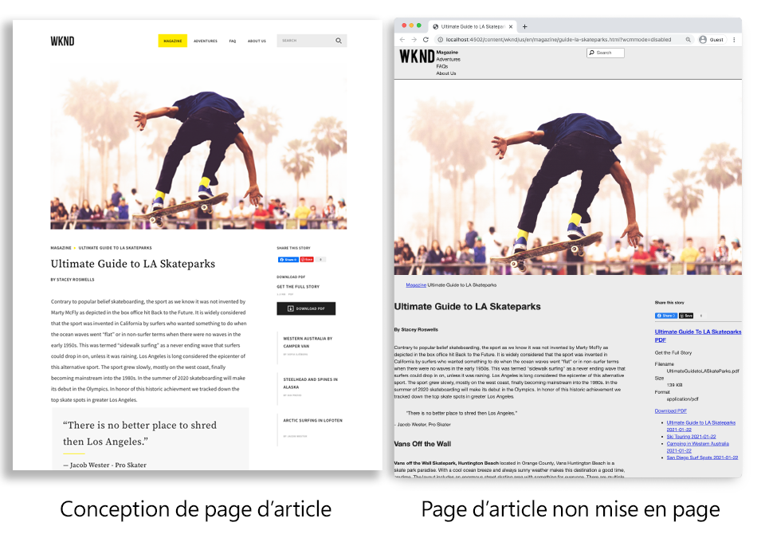
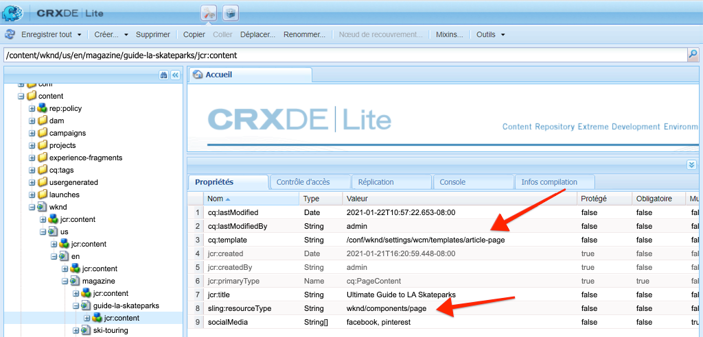
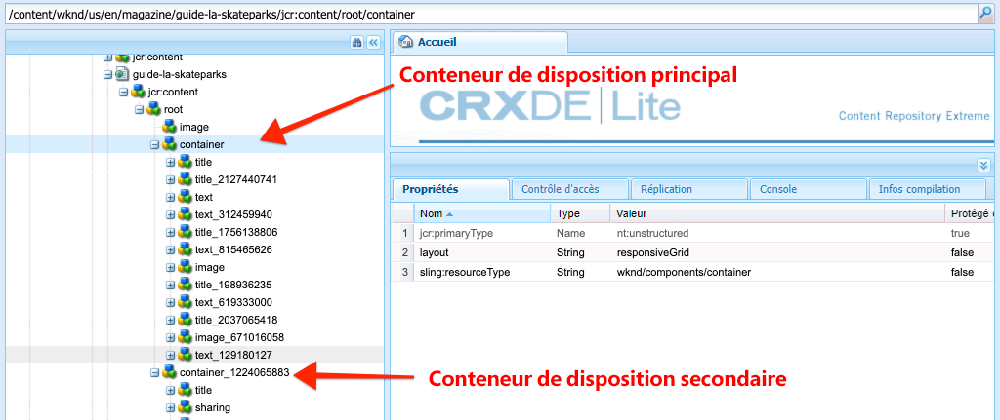
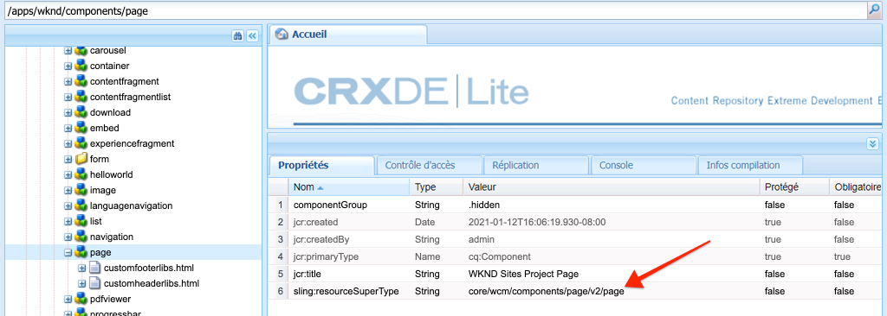
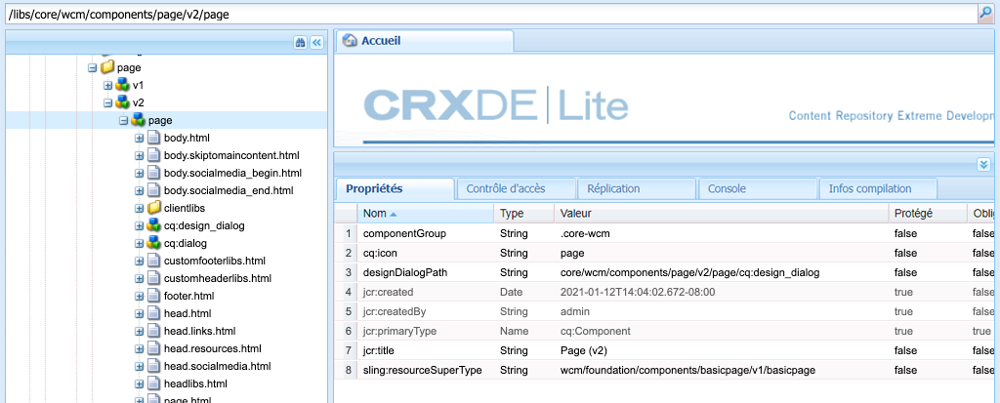

# Pages et modèles {#pages-and-template}

{{edge-delivery-services-and-page-editor}}

Dans ce chapitre, explorons la relation entre un composant de page de base et des modèles modifiables. Découvrez comment créer un modèle d’article sans style basé sur certaines maquettes d’[Adobe XD](https://helpx.adobe.com/fr/support/xd.html). Lors du processus de création du modèle, les composants principaux et les configurations de politiques avancées des modèles modifiables sont traités.

## Prérequis {#prerequisites}

Examinez les outils et les instructions nécessaires pour configurer un [environnement de développement local](overview.md#local-dev-environment).

### Projet de démarrage

>[!NOTE]
>
> Si vous avez terminé avec succès le chapitre précédent, vous pouvez réutiliser le projet et ignorer les étapes de consultation du projet de démarrage.

Consultez le code de ligne de base sur lequel le tutoriel s’appuie :

1. Consultez la branche `tutorial/pages-templates-start` à partir de [GitHub](https://github.com/adobe/aem-guides-wknd).

   ```shell
   $ cd ~/code/aem-guides-wknd
   $ git checkout tutorial/pages-templates-start
   ```

1. Déployez la base de code sur une instance locale d’AEM à l’aide de vos compétences Maven :

   ```shell
   $ mvn clean install -PautoInstallSinglePackage
   ```

   >[!NOTE]
   >
   > Si vous utilisez AEM 6.5 ou 6.4, ajoutez le profil `classic` à n’importe quelle commande Maven.

   ```shell
   $ mvn clean install -PautoInstallSinglePackage -Pclassic
   ```

Vous pouvez toujours afficher le code terminé sur [GitHub](https://github.com/adobe/aem-guides-wknd/tree/tutorial/pages-templates-solution) ou consulter le code localement en passant à la branche `tutorial/pages-templates-solution`.

## Objectif

1. Examinez une conception de page créée dans Adobe XD et mappez-la aux composants principaux.
1. Découvrez les détails des modèles modifiables et comment les politiques peuvent être utilisées pour appliquer un contrôle granulaire du contenu de la page.
1. Apprenez comment les modèles et les pages sont liés.

## Ce que vous allez créer {#what-build}

Dans cette partie du tutoriel, vous créez un modèle de page d’article qui peut être utilisé pour créer des pages d’article et qui s’aligne sur une structure commune. Le modèle de page d’article est basé sur des conceptions et un kit d’interface utilisateur produits dans Adobe XD. Ce chapitre se concentre uniquement sur la création de la structure, ou squelette, du modèle. Aucun style n’est implémenté, mais le modèle et les pages sont fonctionnels.



## Planifier l’interface utilisateur avec Adobe XD {#adobexd}

En règle générale, la planification d’un nouveau site web commence par des maquettes et des conceptions statiques. [Adobe XD](https://helpx.adobe.com/fr/support/xd.html) est un outil de conception qui crée une expérience utilisateur. Examinons ensuite un kit d’interface utilisateur et des maquettes pour planifier la structure du modèle de page d’article.

>[!VIDEO](https://video.tv.adobe.com/v/30214?quality=12&learn=on)

**Téléchargez le [fichier de conception d’article WKND](https://github.com/adobe/aem-guides-wknd/releases/download/aem-guides-wknd-0.0.2/AEM_UI-kit-WKND-article-design.xd)**.

>[!NOTE]
>
> Un [kit d’interface utilisateur des composants principaux d’AEM est également disponible](https://experienceleague.adobe.com/docs/experience-manager-learn/assets/AEM-CoreComponents-UI-Kit.xd) comme point de départ pour les projets personnalisés.

## Créer le modèle de page d’article

Lors de la création d’une page, vous devez sélectionner un modèle, qui est utilisé comme base pour créer la page. Le modèle définit la structure de la page créée, le contenu initial et les composants autorisés.

Il existe trois domaines principaux dans les [Modèles modifiables](https://experienceleague.adobe.com/docs/experience-manager-65/developing/platform/templates/page-templates-editable.html?lang=fr) :

1. **Structure** : définit les composants qui font partie du modèle. Ces composants ne sont pas modifiables par les créateurs et créatrices de contenu.
1. **Contenu initial** : définit les composants avec lesquels le modèle commence. Ces composants peuvent être modifiés et/ou supprimés par les créateurs et créatrices de contenu.
1. **Politiques** : définissent des configurations sur le comportement des composants et les options dont disposent les créateurs et créatrices.

Créez ensuite un modèle dans AEM qui correspond à la structure des maquettes. Cela se produit dans une instance locale d’AEM. Suivez les étapes de la vidéo ci-dessous :

>[!VIDEO](https://video.tv.adobe.com/v/330991?quality=12&learn=on)

Étapes de haut niveau pour la vidéo ci-dessus :

### Configurations de structure

1. Créez un modèle à l’aide du **Type de modèle de page** appelé **Page d’article**.
1. Passez en mode **Structure**.
1. Ajoutez un composant **Fragment d’expérience** pour agir comme le composant **En-tête** en haut du modèle.
   * Configurez le composant pour pointer vers `/content/experience-fragments/wknd/us/en/site/header/master`.
   * Définissez la politique sur **En-tête de page** et vérifiez que l’**Élément par défaut** est défini sur `header`. L’élément `header` est ciblé avec CSS dans le chapitre suivant.
1. Ajoutez un composant **Fragment d’expérience** pour qu’il agisse comme le **Pied de page** au bas du modèle.
   * Configurez le composant pour pointer vers `/content/experience-fragments/wknd/us/en/site/footer/master`.
   * Définissez la politique sur **Pied de page** et vérifiez que l’**Élément par défaut** est défini sur `footer`. L’élément `footer` est ciblé avec CSS dans le chapitre suivant.
1. Verrouillez le conteneur **principal** qui a été inclus lors de la création initiale du modèle.
   * Définissez la politique sur **Page principale** et vérifiez que l’**Élément par défaut** est défini sur `main`. L’élément `main` est ciblé avec CSS dans le chapitre suivant.
1. Ajoutez un composant **Image** au conteneur **principal**.
   * Déverrouillez le composant **Image**.
1. Ajoutez un composant **Chemin de navigation** sous le composant **Image** dans le conteneur principal.
   * Créez une politique pour le composant **Chemin de navigation** appelé **Page d’article - Chemin de navigation**. Définissez le **Niveau de départ de navigation** sur **4**.
1. Ajoutez un composant **Conteneur** sous le composant **Chemin de navigation** et à l’intérieur du conteneur **principal**. Cela agit comme le **Conteneur Contenu** pour le modèle.
   * Déverrouillez le conteneur **Contenu**.
   * Définissez la politique sur **Contenu de la page**.
1. Ajoutez un autre composant **Conteneur** sous le composant **Conteneur Contenu**. Cela agit comme le conteneur **Rail latéral** pour le modèle.
   * Déverrouillez le conteneur **Rail latéral**.
   * Créez une politique appelée **Page d’article - Rail latéral**.
   * Configurez les **Composants autorisés** sous **Projet de sites WKND - Contenu** pour inclure : **Bouton**, **Télécharger**, **Image**, **Liste**, **Séparateur**, **Partage sur les médias sociaux**, **Texte** et **Titre**.
1. Mettez à jour la politique du conteneur Racine de page. Il s’agit du conteneur le plus à l’extérieur du modèle. Définissez la politique sur **Racine de page**.
   * Sous **Paramètres du conteneur**, définissez la **Disposition** sur **Grille réactive**.
1. Activez le mode Disposition pour le **Conteneur Contenu**. Faites glisser la poignée de la droite vers la gauche et rétrécissez le conteneur pour qu’il fasse huit colonnes de large.
1. Activez le mode Disposition pour le **Conteneur Rail latéral**. Faites glisser la poignée de la droite vers la gauche et rétrécissez le conteneur pour qu’il fasse quatre colonnes de large. Faites ensuite glisser la poignée gauche de la gauche vers la droite d’une colonne pour que le conteneu ait une largeur de 3 colonnes et laissez un espace d’une colonne avec le **Conteneur Contenu**.
1. Ouvrez l’émulateur mobile et passez à un point d’arrêt mobile. Réactivez le mode Disposition et faites en sorte que le **Conteneur Contenu** et le **Conteneur Rail latéral** fassent toute la largeur de la page. Les conteneurs sont ainsi empilés verticalement au point d’arrêt mobile.
1. Mettez à jour la politique du composant **Texte** dans le **Conteneur Contenu**.
   * Définissez la politique sur **Texte du contenu**.
   * Sous **Modules externes** > **Styles de paragraphe**, activez l’option **Activer les styles de paragraphe** et assurez-vous que l’option **Citation** est activée.

### Configurations initiales du contenu

1. Passez en mode **Contenu initial**.
1. Ajoutez un composant **Titre** au **Conteneur Contenu**. Il agit comme le titre de l’article. Lorsqu’il est vide, il affiche automatiquement le titre de la page active.
1. Ajoutez un second composant **Titre** sous le premier.
   * Configurez le composant avec le texte suivant : Par auteur. Il s’agit d’un espace réservé.
   * Définissez le type sur `H4`.
1. Ajoutez un composant **Texte** sous le composant Titre **Par auteur**.
1. Ajoutez un composant **Titre** au **Conteneur Rail latéral**.
   * Configurez le composant avec le texte suivant : « Share this Story ».
   * Définissez le type sur `H5`.
1. Ajoutez un composant **Partage sur les médias sociaux** sous le composant Titre **Share this Story**.
1. Ajoutez un composant **Séparateur** sous le composant **Partage sur les médias sociaux**.
1. Ajoutez un composant **Télécharger** sous le composant **Séparateur**.
1. Ajoutez un composant **Liste** sous le composant **Télécharger**.
1. Mettez à jour les **Propriétés de page initiale** pour le modèle.
   * Sous **Réseaux sociaux** > **Partage sur les médias sociaux**, activez **Facebook** et **Pinterest**.

### Activer le modèle et ajouter une miniature

1. Affichez le modèle dans la console Modèle en accédant à [http://localhost:4502/libs/wcm/core/content/sites/templates.html/conf/wknd](http://localhost:4502/libs/wcm/core/content/sites/templates.html/conf/wknd)
1. **Activez** le modèle Page d’article.
1. Modifiez les propriétés du modèle Page d’article et chargez la miniature suivante afin d’identifier rapidement les pages créées à l’aide du modèle Page d’article :

   

## Mettre à jour l’en-tête et le pied de page avec des fragments d’expérience {#experience-fragments}

Une pratique courante lors de la création d’un contenu global, tel qu’un en-tête ou un pied de page, consiste à utiliser un [Fragment d’expérience](https://experienceleague.adobe.com/docs/experience-manager-learn/sites/experience-fragments/experience-fragments-feature-video-use.html?lang=fr). Les fragments d’expérience permettent aux utilisateurs et utilisatrices de combiner plusieurs composants afin de créer un seul composant référençable. Les fragments d’expérience ont l’avantage de prendre en charge la gestion multisite et la [localisation](https://experienceleague.adobe.com/docs/experience-manager-core-components/using/wcm-components/experience-fragment.html?lang=fr).

L’archétype de projet AEM a généré un en-tête et un pied de page. Ensuite, mettez à jour les fragments d’expérience pour qu’ils correspondent aux maquettes. Suivez les étapes de la vidéo ci-dessous :

>[!VIDEO](https://video.tv.adobe.com/v/330992?quality=12&learn=on)

Étapes de haut niveau pour la vidéo ci-dessus :

1. Téléchargez l’exemple de package de contenu **[WKND-PagesTemplates-Content-Assets.zip](assets/pages-templates/WKND-PagesTemplates-Content-Assets-1.1.zip)**.
1. Téléchargez et installez le package de contenu à l’aide de Package Manager dans [http://localhost:4502/crx/packmgr/index.jsp](http://localhost:4502/crx/packmgr/index.jsp)
1. Mettez à jour le modèle Variante web, qui est utilisé pour les fragments d’expérience dans [http://localhost:4502/editor.html/conf/wknd/settings/wcm/templates/xf-web-variation/structure.html](http://localhost:4502/editor.html/conf/wknd/settings/wcm/templates/xf-web-variation/structure.html)
   * Mettez à jour la politique du composant **Conteneur** sur le modèle.
   * Définissez la politique sur **Racine XF**.
   * Sous **Composants autorisés**, sélectionnez le groupe de composants **Projet de sites WKND - Structure** pour inclure les composants **Navigation par langue**, **Navigation** et **Quick Search**.

### Mettre à jour le fragment d’expérience En-tête

1. Ouvrez le fragment d’expérience qui effectue le rendu de l’en-tête dans [http://localhost:4502/editor.html/content/experience-fragments/wknd/us/en/site/header/master.html](http://localhost:4502/editor.html/content/experience-fragments/wknd/us/en/site/header/master.html)
1. Configurez le **Conteneur** racine du fragment. Il s’agit du **Conteneur** le plus à l’extérieur.
   * Définissez **Disposition** sur **Grille réactive**.
1. Ajoutez **Logo sombre WKND** en tant qu’image dans la partie supérieure du **Conteneur**. Le logo a été inclus dans le package installé lors d’une étape précédente.
   * Modifiez la disposition du **Logo sombre WKND** pour qu’il ait une largeur de **deux** colonnes. Faites glisser les poignées de la droite vers la gauche.
   * Configurez le logo avec le **Texte de remplacement** suivant : Logo WKND.
   * Configurez le logo pour qu’il soit un **Lien** vers la page d’accueil `/content/wknd/us/en`.
1. Configurez le composant **Navigation** qui est déjà placé sur la page.
   * Définissez **Exclure les niveaux racine** sur **1**.
   * Définissez **Profondeur de la structure de navigation** sur **1**.
   * Modifiez la disposition du composant **Navigation** pour qu’il ait une largeur de **huit** colonnes. Faites glisser les poignées de la droite vers la gauche.
1. Supprimez le composant **Navigation par langue**.
1. Modifiez la disposition du composant **Search** pour qu’il ait une largeur de **deux** colonnes. Faites glisser les poignées de la droite vers la gauche. Tous les composants doivent maintenant être alignés horizontalement sur une seule ligne.

### Mettre à jour le fragment d’expérience Pied de page

1. Ouvrez le fragment d’expérience qui effectue le rendu du pied de page dans [http://localhost:4502/editor.html/content/experience-fragments/wknd/us/en/site/footer/master.html](http://localhost:4502/editor.html/content/experience-fragments/wknd/us/en/site/footer/master.html)
1. Configurez le **Conteneur** racine du fragment. Il s’agit du **Conteneur** le plus à l’extérieur.
   * Définissez **Disposition** sur **Grille réactive**
1. Ajoutez **Logo clair WKND** en tant qu’image dans la partie supérieure du **Conteneur**. Le logo a été inclus dans le package installé lors d’une étape précédente.
   * Modifiez la disposition du **Logo clair WKND** pour qu’il ait une largeur de **deux** colonnes. Faites glisser les poignées de la droite vers la gauche.
   * Configurez le logo avec le **Texte de remplacement** suivant : Logo clair WKND.
   * Configurez le logo en tant que **Lien** vers la page d’accueil `/content/wknd/us/en`.
1. Ajoutez un composant **Navigation** sous le logo. Configurez le composant **Navigation** :
   * Définissez **Exclure les niveaux racine** sur **1**.
   * Décochez **Collecter toutes les pages enfants**.
   * Définissez **Profondeur de la structure de navigation** sur **1**.
   * Modifiez la disposition du composant **Navigation** pour qu’il ait une largeur de **huit** colonnes. Faites glisser les poignées de la droite vers la gauche.

## Créer une page d’article

Créez ensuite une page à l’aide du modèle Page d’article. Créez le contenu de la page pour qu’il corresponde aux maquettes du site. Suivez les étapes de la vidéo ci-dessous :

>[!VIDEO](https://video.tv.adobe.com/v/330993?quality=12&learn=on)

Étapes de haut niveau pour la vidéo ci-dessus :

1. Accédez à la console Sites à l’adresse [http://localhost:4502/sites.html/content/wknd/us/en/magazine](ttp://localhost:4502/sites.html/content/wknd/us/en/magazine).
1. Créez une page sous **WKND** > **US** > **EN** > **Magazine**.
   * Choisissez le modèle **Page d’article**.
   * Sous **Propriétés**, définissez le **Titre** suivant : « Ultimate Guide to LA Skateparks ».
   * Définissez le **Nom** suivant : « guide-la-skateparks ».
1. Remplacez le titre **Par auteur** par le texte suivant : De Stacey Roswells.
1. Mettez à jour le composant **Texte** pour inclure un paragraphe afin de remplir l’article. Vous pouvez utiliser le fichier texte suivant comme copie : [la-skate-parks-copy.txt](assets/pages-templates/la-skateparks-copy.txt).
1. Ajoutez un autre composant **Texte**.
   * Mettez à jour le composant pour inclure la citation suivante : Il n’y a pas de meilleur endroit pour s’amuser que Los Angeles.
   * Passez en mode plein écran dans l’éditeur de texte enrichi et modifiez la citation ci-dessus pour utiliser l’élément **Citation**.
1. Continuez à remplir le corps de l’article pour qu’il corresponde aux maquettes.
1. Configurez le composant **Télécharger** pour utiliser une version PDF de l’article.
   * Sous **Télécharger** > **Propriétés**, cochez la case pour **Obtenir le titre à partir de la ressource DAM**.
   * Définissez la **Description** sur : Découvrez l’histoire complète.
   * Définissez le **Texte de l’action** sur : Télécharger le fichier PDF.
1. Configurez le composant **Liste**.
   * Sous **Paramètres de liste** > **Créer la liste à l’aide de**, sélectionnez **Pages enfants**.
   * Définissez **Page parente** sur `/content/wknd/us/en/magazine`.
   * Sous **Paramètres d’élément**, cochez **Éléments de lien** et **Afficher la date**.

## Examiner la structure de nœud {#node-structure}

À ce stade, la page d’article est clairement dépourvue de style. Cependant, la structure de base est en place. Examinez ensuite la structure de nœud de la page d’article pour mieux comprendre le rôle du modèle, de la page et des composants.

Utilisez l’outil CRXDE-Lite sur une instance AEM locale pour afficher la structure de nœud sous-jacente.

1. Ouvrez [CRXDE-Lite](http://localhost:4502/crx/de/index.jsp#/content/wknd/us/en/magazine/guide-la-skateparks/jcr%3Acontent) et utilisez la navigation dans l’arborescence pour accéder à `/content/wknd/us/en/magazine/guide-la-skateparks`.

1. Cliquez sur le nœud `jcr:content` sous la page `la-skateparks` et consultez les propriétés :

   

   Notez la valeur de `cq:template`, qui pointe vers `/conf/wknd/settings/wcm/templates/article-page`, le modèle de page d’article créé précédemment.

   Notez également la valeur de `sling:resourceType`, qui pointe vers `wknd/components/page`. Il s’agit du composant de page créé par l’archétype de projet AEM et responsable du rendu de la page en fonction du modèle.

1. Développez le nœud `jcr:content` sous `/content/wknd/us/en/magazine/guide-la-skateparks/jcr:content` et affichez la hiérarchie de nœuds :

   

   Vous devriez être en mesure de mapper vaguement chacun des nœuds aux composants qui ont été créés. Voyez si vous pouvez identifier les différents conteneurs de disposition utilisés en examinant les nœuds dotés du préfixe `container`.

1. Examinez ensuite le composant Page dans `/apps/wknd/components/page`. Affichez les propriétés du composant dans CRXDE Lite :

   

   Il n’existe que deux scripts HTL, `customfooterlibs.html` et `customheaderlibs.html`, sous le composant Page. *Comment ce composant effectue-t-il le rendu de la page ?*

   La propriété `sling:resourceSuperType` pointe sur `core/wcm/components/page/v2/page`. Cette propriété permet au composant de page de WKND d’hériter de **toutes** les fonctionnalités du composant Page des composants principaux. Voici le premier exemple d’un élément appelé [Modèle de composant proxy](https://experienceleague.adobe.com/docs/experience-manager-core-components/using/developing/guidelines.html#ProxyComponentPattern). Vous trouverez plus d’informations [ici](https://experienceleague.adobe.com/docs/experience-manager-core-components/using/developing/guidelines.html).

1. Examinez un autre composant dans les composants WKND : le composant `Breadcrumb` à partir de : `/apps/wknd/components/breadcrumb`. Notez que la même propriété `sling:resourceSuperType` est disponible, mais cette fois, elle pointe vers `core/wcm/components/breadcrumb/v2/breadcrumb`. Il s’agit d’un autre exemple d’utilisation du modèle de composant proxy pour inclure un composant principal. En fait, tous les composants de la base de code WKND sont des proxy des composants principaux d’AEM (à l’exception du composant HelloWorld de démonstration personnalisé). Il est recommandé de réutiliser autant de fonctionnalités des composants principaux que possible *avant* d’écrire du code personnalisé.

1. Examinez ensuite la page des composants principaux dans `/libs/core/wcm/components/page/v2/page` en utilisant CRXDE Lite :

   >[!NOTE]
   >
   > Dans AEM version 6.5/6.4, les composants principaux se trouvent sous `/apps/core/wcm/components`. Dans AEM as a Cloud Service, les composants principaux se trouvent sous `/libs` et sont automatiquement mis à jour.

   

   Notez que de nombreux fichiers de script sont inclus sous cette page. La page des composants principaux contient de nombreuses fonctionnalités. Ces fonctionnalités sont divisées en plusieurs scripts pour faciliter la maintenance et la lisibilité. Vous pouvez suivre l’inclusion des scripts HTL en ouvrant `page.html` et en recherchant `data-sly-include` :

   ```html
   <!--/* /libs/core/wcm/components/page/v2/page/page.html */-->
   <!DOCTYPE HTML>
   <html data-sly-use.page="com.adobe.cq.wcm.core.components.models.Page" lang="${page.language}"
       data-sly-use.head="head.html"
       data-sly-use.footer="footer.html"
       data-sly-use.redirect="redirect.html">
       <head data-sly-call="${head.head @ page = page}"></head>
       <body class="${page.cssClassNames}"
           id="${page.id}"
           data-cmp-data-layer-enabled="${page.data ? true : false}">
           <script data-sly-test.dataLayerEnabled="${page.data}">
           window.adobeDataLayer = window.adobeDataLayer || [];
           adobeDataLayer.push({
               page: JSON.parse("${page.data.json @ context='scriptString'}"),
               event:'cmp:show',
               eventInfo: {
                   path: 'page.${page.id @ context="scriptString"}'
               }
           });
           </script>
           <sly data-sly-test.isRedirectPage="${page.redirectTarget && (wcmmode.edit || wcmmode.preview)}"
               data-sly-call="${redirect.redirect @ redirectTarget = page.redirectTarget}"></sly>
           <sly data-sly-test="${!isRedirectPage}">
               <sly data-sly-include="body.skiptomaincontent.html"></sly>
               <sly data-sly-include="body.socialmedia_begin.html"></sly>
               <sly data-sly-include="body.html"></sly>
               <sly data-sly-call="${footer.footer @ page = page}"></sly>
               <sly data-sly-include="body.socialmedia_end.html"></sly>
           </sly>
       </body>
   </html>
   ```

   L’autre raison pour laquelle diviser le langage HTL en plusieurs scripts est de permettre aux composants proxy de remplacer des scripts individuels pour implémenter une logique métier personnalisée. Les scripts HTL `customfooterlibs.html` et `customheaderlibs.html` sont créés dans le but explicite d’être remplacés par l’implémentation de projets.

   Découvrez comment le modèle modifiable entre dans le rendu de la [page de contenu en lisant cet article](https://experienceleague.adobe.com/docs/experience-manager-65/developing/platform/templates/page-templates-editable.html?lang=fr).

1. Examinez un autre composant principal, comme le chemin de navigation dans `/libs/core/wcm/components/breadcrumb/v2/breadcrumb`. Consultez le script `breadcrumb.html` pour comprendre comment le balisage du composant de chemin de navigation est généré.

## Enregistrer les configurations dans le contrôle de code source {#configuration-persistence}

Souvent, en particulier au début d’un projet AEM, il est utile de conserver les configurations, comme les modèles et les politiques de contenu associées, pour le contrôle de code source. Cela garantit que tous les développeurs et développeuses travaillent sur le même ensemble de contenu et de configurations et peut garantir une cohérence supplémentaire entre les environnements. Une fois qu’un projet atteint un certain niveau de maturité, la gestion des modèles peut être transmise à un groupe spécial d’utilisateurs et utilisatrices expérimentés.


Pour l’instant, les modèles sont traités comme d’autres éléments de code et synchronisent le **Modèle de page d’article** dans le cadre du projet.
Jusqu’à présent, le code est transmis du projet AEM vers une instance locale d’AEM. Le **Modèle de page d’article** a été créé directement sur une instance locale d’AEM. Il doit donc **importer** le modèle dans le projet AEM. Le module **ui.content** est inclus dans le projet AEM à cet effet spécifique.

Les étapes suivantes sont effectuées dans l’IDE VSCode à l’aide du plug-in de [synchronisation d’AEM VSCode](https://marketplace.visualstudio.com/items?itemName=yamato-ltd.vscode-aem-sync&amp;ssr=false#overview). Mais n’importe quel IDE que vous avez configuré pour l’**importation** pourrait être utilisé ou du contenu pourrait être importé à partir d’une instance locale d’AEM.

1. Dans VSCode, ouvrez le projet `aem-guides-wknd`.

1. Développez le module **ui.content** dans l’explorateur de projets. Développez le dossier `src` et accédez à `/conf/wknd/settings/wcm/templates`.

1. [!UICONTROL Cliquez avec le bouton droit] sur le dossier `templates` et sélectionnez **Importer depuis le serveur AEM** :

   

   `article-page` doit être importé, et les modèles `page-content` et `xf-web-variation` doivent également être mis à jour.

   

1. Répétez les étapes pour importer du contenu, mais sélectionnez le dossier **politiques** depuis `/conf/wknd/settings/wcm/policies`.

   

1. Examinez le fichier `filter.xml` depuis `ui.content/src/main/content/META-INF/vault/filter.xml`.

   ```xml
   <!--ui.content filter.xml-->
   <?xml version="1.0" encoding="UTF-8"?>
   <workspaceFilter version="1.0">
       <filter root="/conf/wknd" mode="merge"/>
       <filter root="/content/wknd" mode="merge"/>
       <filter root="/content/dam/wknd" mode="merge"/>
       <filter root="/content/experience-fragments/wknd" mode="merge"/>
   </workspaceFilter>
   ```

   Le fichier `filter.xml` est chargé d’identifier les chemins d’accès des nœuds installés avec le package. Remarquez le `mode="merge"` sur chacun des filtres, cequi indique que le contenu existant ne doit pas être modifié et que seul un nouveau contenu peut être ajouté. Étant donné que les créateurs et créatrices de contenu peuvent mettre à jour ces chemins, il est important qu’un déploiement de code **ne** remplace aucun contenu. Voir la [Documentation FileVault](https://jackrabbit.apache.org/filevault/filter.html) pour plus d’informations sur l’utilisation des éléments de filtre.

   Comparez `ui.content/src/main/content/META-INF/vault/filter.xml` et `ui.apps/src/main/content/META-INF/vault/filter.xml` pour comprendre les différents nœuds gérés par chaque module.

   >[!WARNING]
   >
   > Afin d’assurer des déploiements cohérents pour le site de référence WKND, certaines branches du projet sont configurées de sorte que `ui.content` remplace toute modification dans le JCR. C’est à dessein, par exemple pour les branches de solution, puisque le code/les styles sont écrits pour des politiques spécifiques.

## Félicitations. {#congratulations}

Félicitations, vous avez créé un modèle et une page avec Adobe Experience Manager Sites.

### Étapes suivantes {#next-steps}

À ce stade, la page d’article est clairement dépourvue de style. Suivez le tutoriel [Bibliothèques côté client et workflow front-end](client-side-libraries.md) pour découvrir les bonnes pratiques d’inclusion de CSS et JavaScript afin d’appliquer des styles globaux au site et d’intégrer une version front-end dédiée.

Affichez le code terminé sur [GitHub](https://github.com/adobe/aem-guides-wknd) ou révisez et déployez le code localement sur la branche Git `tutorial/pages-templates-solution`.

1. Clonez le référentiel [github.com/adobe/aem-wknd-guides](https://github.com/adobe/aem-guides-wknd).
1. Consultez la branche `tutorial/pages-templates-solution`.
