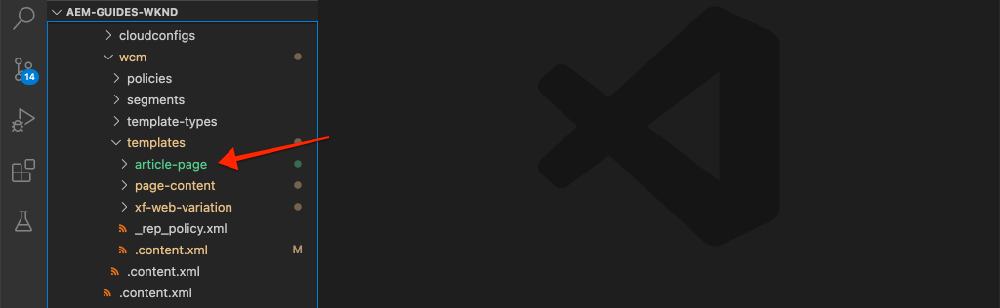

# Pages et modèles {#pages-and-template}

Dans ce chapitre, nous allons explorer la relation entre un composant de page de base et des modèles modifiables. Nous allons créer un modèle d&#39;article sans style basé sur des maquettes de [AdobeXD](https://www.adobe.com/products/xd.html). Lors du processus de création du modèle, les composants principaux et les configurations de stratégie avancées des modèles modifiables sont traités.

## Prérequis {#prerequisites}

Examinez les outils et les instructions requis pour configurer une [environnement de développement local](overview.md#local-dev-environment).

### Projet de démarrage

>[!NOTE]
>
> Si vous avez terminé avec succès le chapitre précédent, vous pouvez réutiliser le projet et ignorer les étapes d’extraction du projet de démarrage.

Consultez le code de ligne de base sur lequel le tutoriel s’appuie :

1. Consultez la section `tutorial/pages-templates-start` branche à partir de [GitHub](https://github.com/adobe/aem-guides-wknd)

   ```shell
   $ cd ~/code/aem-guides-wknd
   $ git checkout tutorial/pages-templates-start
   ```

1. Déployez la base de code sur une instance d’AEM locale à l’aide de vos compétences Maven :

   ```shell
   $ mvn clean install -PautoInstallSinglePackage
   ```

   >[!NOTE]
   >
   > Si vous utilisez AEM version 6.5 ou 6.4, ajoutez la variable `classic` profile à n’importe quelle commande Maven.

   ```shell
   $ mvn clean install -PautoInstallSinglePackage -Pclassic
   ```

Vous pouvez toujours afficher le code terminé sur [GitHub](https://github.com/adobe/aem-guides-wknd/tree/tutorial/pages-templates-solution) ou extraire le code localement en passant à la branche `tutorial/pages-templates-solution`.

## Objectif

1. Inspect une conception de page créée dans Adobe XD et la mappez aux composants principaux.
1. Découvrez les détails des modèles modifiables et comment les stratégies peuvent être utilisées pour appliquer un contrôle granulaire du contenu de la page.
1. Découvrez comment les modèles et les pages sont liés

## Ce que vous allez créer {#what-you-will-build}

Dans cette partie du tutoriel, vous allez créer un modèle de page d’article qui pourra être utilisé pour créer de nouvelles pages d’article et vous aligner sur une structure commune. Le modèle de page d’article sera basé sur des conceptions et un kit d’interface utilisateur produit dans Adobe XD. Ce chapitre se concentre uniquement sur la construction de la structure ou du squelette du modèle. Aucun style ne sera implémenté, mais le modèle et les pages seront fonctionnels.


## Planification de l’interface utilisateur avec Adobe XD {#adobexd}

Dans la plupart des cas, la planification d’un nouveau site web commence par des maquettes et des conceptions statiques. [Adobe XD](https://www.adobe.com/products/xd.html) est un outil de conception qui crée des expériences utilisateur. Ensuite, nous allons examiner un kit d’interface utilisateur et des maquettes pour planifier la structure du modèle de page d’article.

>[!VIDEO](https://video.tv.adobe.com/v/30214/?quality=12&learn=on)

**Téléchargez la [Fichier de conception d’article WKND](https://github.com/adobe/aem-guides-wknd/releases/download/aem-guides-wknd-0.0.2/AEM_UI-kit-WKND-article-design.xd)**.

>[!NOTE]
>
> Un générique [AEM Core Components UI Kit est également disponible](https://experienceleague.adobe.com/docs/experience-manager-learn/assets/AEM-CoreComponents-UI-Kit.xd) comme point de départ pour les projets personnalisés.

## Création du modèle de page d’article

Lors de la création d’une page, vous devez sélectionner un modèle. C’est la base pour la création de la page. Le modèle définit la structure de la page créée, le contenu initial et les composants autorisés.

Il existe 3 zones principales de [Modèles modifiables](https://experienceleague.adobe.com/docs/experience-manager-65/developing/platform/templates/page-templates-editable.html?lang=fr):

1. **Structure** - définit les composants qui font partie du modèle. Ils ne seront pas modifiables par les auteurs de contenu.
1. **Contenu initial** : définit les composants dont le modèle commencera, qui peuvent être modifiés et/ou supprimés par les auteurs de contenu.
1. **Stratégies** - définit les configurations sur le comportement des composants et les options disponibles pour les auteurs.

Créez ensuite un modèle dans AEM qui correspond à la structure des maquettes. Cela se produit dans une instance locale d’AEM. Suivez les étapes de la vidéo ci-dessous :

>[!VIDEO](https://video.tv.adobe.com/v/330991/?quality=12&learn=on)

Étapes de haut niveau pour la vidéo ci-dessous :

### Configurations de structure

1. Créez un modèle à l’aide du **Type de modèle de page**, nommé **Page Article**.
1. Basculer vers **Structure** mode .
1. Ajoutez un **Fragment d’expérience** pour agir comme le composant **En-tête** en haut du modèle.
   * Configuration du composant pour qu’il pointe vers `/content/experience-fragments/wknd/us/en/site/header/master`.
   * Définissez la stratégie sur **En-tête de page** et assurez-vous que la variable **Elément par défaut** est défini sur `header`. Le `header`sera ciblé avec CSS dans le chapitre suivant.
1. Ajoutez un **Fragment d’expérience** pour agir comme le composant **Pied de page** au bas du modèle.
   * Configuration du composant pour qu’il pointe vers `/content/experience-fragments/wknd/us/en/site/footer/master`.
   * Définissez la stratégie sur **Pied de page** et assurez-vous que la variable **Elément par défaut** est défini sur `footer`. Le `footer` sera ciblé avec CSS dans le chapitre suivant.
1. Verrouillez la variable **main** conteneur inclus lors de la création initiale du modèle.
   * Définissez la stratégie sur **Page principale** et assurez-vous que la variable **Elément par défaut** est défini sur `main`. Le `main` sera ciblé avec CSS dans le chapitre suivant.
1. Ajoutez un **Image** au composant **main** conteneur.
   * Déverrouillez la variable **Image** composant.
1. Ajouter un **Chemin de navigation** sous le composant **Image** dans le conteneur principal.
   * Créez une nouvelle stratégie pour le **Chemin de navigation** component nommé **Page Article - Chemin de navigation**. Définissez la variable **Niveau de départ de navigation** to **4**.
1. Ajouter un **Conteneur** sous le composant **Chemin de navigation** et à l’intérieur du composant **main** conteneur. Cela agit comme l’événement **Conteneur de contenu** pour le modèle.
   * Déverrouillez la variable **Contenu** conteneur.
   * Définissez la stratégie sur **Contenu de la page**.
1. Ajouter un autre **Conteneur** sous le composant **Conteneur de contenu**. Cela agit comme l’événement **Rail latéral** conteneur pour le modèle.
   * Déverrouillez la variable **Rail latéral** conteneur.
   * Création d’une stratégie nommée **Page Article - Rail latéral**.
   * Configurez la variable **Composants autorisés** under **Projet de sites WKND - Contenu** pour inclure : **Bouton**, **Télécharger**, **Image**, **Liste**, **Séparateur**, **Partage sur les réseaux sociaux**, **Texte**, et **Titre**.
1. Mettez à jour la stratégie du conteneur Racine de page. Il s’agit du conteneur le plus à l’extérieur du modèle. Définissez la stratégie sur **Racine de page**.
   * Sous **Paramètres du conteneur**, définissez la variable **Disposition** to **Grille réactive**.
1. Activation du mode Mise en page pour **Conteneur de contenu**. Faites glisser la poignée de droite à gauche et rétrécissez le conteneur pour qu’il s’étende à 8 colonnes.
1. Activation du mode Mise en page pour **Conteneur de rail latéral**. Faites glisser la poignée de droite à gauche et rétrécissez le conteneur pour obtenir 4 colonnes de large. Faites ensuite glisser la poignée de gauche vers la colonne de droite 1 pour large le conteneur 3 et laisser un espace d’une colonne entre les colonnes **Conteneur de contenu**.
1. Ouvrez l’émulateur mobile et passez à un point d’arrêt mobile. Relancez le mode de mise en page et effectuez l’opération **Conteneur de contenu** et le **Conteneur de rail latéral** la largeur complète de la page. Les conteneurs seront ainsi empilés verticalement dans le point d’arrêt mobile.
1. Mettez à jour la stratégie de la variable **Texte** du composant **Conteneur de contenu**.
   * Définissez la stratégie sur **Texte du contenu**.
   * Sous **Modules externes** > **Styles de paragraphe**, vérifier **Activation des styles de paragraphe** et assurez-vous que la variable **Bloc entre guillemets** est activée.

### Configurations initiales du contenu

1. Basculer vers **Contenu initial** mode .
1. Ajouter un **Titre** au composant **Conteneur de contenu**. Cela agit comme titre de l’article. Lorsqu’il est vide, il affiche automatiquement le titre de la page active.
1. Ajouter une seconde **Titre** composant sous le premier composant Titre.
   * Configurez le composant avec le texte : &quot;Par auteur&quot;. Il s’agit d’un espace réservé de texte.
   * Définissez le type à définir. `H4`.
1. Ajouter un **Texte** sous le composant **Par auteur** Composant du titre.
1. Ajouter un **Titre** au composant **Conteneur de rail latéral**.
   * Configurez le composant avec le texte : &quot;Partagez cette histoire&quot;.
   * Définissez le type à définir. `H5`.
1. Ajouter un **Partage sur les réseaux sociaux** sous le composant **Partager cet article** Composant du titre.
1. Ajouter un **Séparateur** sous le composant **Partage sur les réseaux sociaux** composant.
1. Ajouter un **Télécharger** sous le composant **Séparateur** composant.
1. Ajouter un **Liste** sous le composant **Télécharger** composant.
1. Mettez à jour le **Propriétés de page initiales** pour le modèle.
   * Sous **Réseaux sociaux** > **Partage sur les réseaux sociaux**, vérifier **Facebook** et **Pinterest**

### Activation du modèle et ajout d’une miniature

1. Affichez le modèle dans la console Modèle en accédant à [http://localhost:4502/libs/wcm/core/content/sites/templates.html/conf/wknd](http://localhost:4502/libs/wcm/core/content/sites/templates.html/conf/wknd)
1. **Activer** le modèle Page d’article .
1. Modifiez les propriétés du modèle Page d’article et téléchargez la miniature suivante afin d’identifier rapidement les pages créées à l’aide du modèle Page d’article :

   

## Mise à jour de l’en-tête et du pied de page avec les fragments d’expérience {#experience-fragments}

Une pratique courante lors de la création d’un contenu global, tel qu’un en-tête ou un pied de page, consiste à utiliser une [Fragment d’expérience](https://experienceleague.adobe.com/docs/experience-manager-learn/sites/experience-fragments/experience-fragments-feature-video-use.html). Les fragments d’expérience permettent aux utilisateurs de combiner plusieurs composants afin de créer un seul composant pouvant faire référence. Les fragments d’expérience ont l’avantage de prendre en charge la gestion multisite et [localisation](https://experienceleague.adobe.com/docs/experience-manager-core-components/using/components/experience-fragment.html?lang=en#localized-site-structure).

L’archétype de projet AEM a généré un en-tête et un pied de page. Ensuite, mettez à jour les fragments d’expérience pour qu’ils correspondent aux maquettes. Suivez les étapes de la vidéo ci-dessous :

>[!VIDEO](https://video.tv.adobe.com/v/330992/?quality=12&learn=on)

Étapes de haut niveau pour la vidéo ci-dessous :

1. Téléchargez l’exemple de module de contenu **[WKND-PagesTemplates-Content-Assets.zip](assets/pages-templates/WKND-PagesTemplates-Content-Assets-1.1.zip)**.
1. Téléchargez et installez le module de contenu à l’aide de Package Manager à l’adresse [http://localhost:4502/crx/packmgr/index.jsp](http://localhost:4502/crx/packmgr/index.jsp)
1. Mettez à jour le modèle de variation web, qui est utilisé pour les fragments d’expérience à l’adresse [http://localhost:4502/editor.html/conf/wknd/settings/wcm/templates/xf-web-variation/structure.html](http://localhost:4502/editor.html/conf/wknd/settings/wcm/templates/xf-web-variation/structure.html)
   * Mettez à jour la stratégie de la variable **Conteneur** sur le modèle.
   * Définissez la stratégie sur **Racine XF**.
   * Sous **Composants autorisés** sélectionner le groupe de composants ; **Projet de sites WKND - Structure** à inclure **Navigation par langue**, **Navigation**, et **Recherche rapide** composants.

### Mise à jour du fragment d’expérience d’en-tête

1. Ouvrez le fragment d’expérience qui effectue le rendu de l’en-tête à l’adresse [http://localhost:4502/editor.html/content/experience-fragments/wknd/us/en/site/header/master.html](http://localhost:4502/editor.html/content/experience-fragments/wknd/us/en/site/header/master.html)
1. Configuration de la racine **Conteneur** du fragment. C&#39;est l&#39;extérieur le plus éloigné **Conteneur**.
   * Définissez la variable **Disposition** to **Grille réactive**
1. Ajoutez la variable **Logo noir WKND** sous la forme d’une image dans la partie supérieure de l’objet **Conteneur**. Le logo a été inclus dans le package installé lors d’une étape précédente.
   * Modifiez la mise en page du **Logo noir WKND** to **2** en largeur. Faites glisser les poignées de droite à gauche.
   * Configurez le logo avec **Texte de remplacement** de &quot;Logo WKND&quot;.
   * Configurez le logo pour **Lien** to `/content/wknd/us/en` la page d’accueil.
1. Configurez la variable **Navigation** qui est déjà placé sur la page.
   * Définissez la variable **Exclure les niveaux racine** to **1**.
   * Définissez la variable **Profondeur de la structure de navigation** to **1**.
   * Modifiez la mise en page du **Navigation** composant à **8** en largeur. Faites glisser les poignées de droite à gauche.
1. Supprimez le **Navigation par langue** composant.
1. Modifiez la mise en page du **Rechercher** composant à **2** en largeur. Faites glisser les poignées de droite à gauche. Tous les composants doivent maintenant être alignés horizontalement sur une seule ligne.

### Mise à jour du fragment d’expérience de pied de page

1. Ouvrez le fragment d’expérience qui effectue le rendu du pied de page à l’adresse [http://localhost:4502/editor.html/content/experience-fragments/wknd/us/en/site/footer/master.html](http://localhost:4502/editor.html/content/experience-fragments/wknd/us/en/site/footer/master.html)
1. Configuration de la racine **Conteneur** du fragment. C&#39;est l&#39;extérieur le plus éloigné **Conteneur**.
   * Définissez la variable **Disposition** to **Grille réactive**
1. Ajoutez la variable **Logo léger WKND** sous la forme d’une image dans la partie supérieure de l’objet **Conteneur**. Le logo a été inclus dans le package installé lors d’une étape précédente.
   * Modifiez la mise en page du **Logo léger WKND** to **2** en largeur. Faites glisser les poignées de droite à gauche.
   * Configurez le logo avec **Texte de remplacement** de &quot;WKND Logo Light&quot;.
   * Configurez le logo pour **Lien** to `/content/wknd/us/en` la page d’accueil.
1. Ajouter un **Navigation** sous le logo. Configurez la variable **Navigation** component :
   * Définissez la variable **Exclure les niveaux racine** to **1**.
   * Décocher **Collecter toutes les pages enfants**.
   * Définissez la variable **Profondeur de la structure de navigation** to **1**.
   * Modifiez la mise en page du **Navigation** composant à **8** en largeur. Faites glisser les poignées de droite à gauche.

## Création d’une page d’article

Créez ensuite une page à l’aide du modèle Page d’article . Créez le contenu de la page pour qu’il corresponde aux maquettes du site. Suivez les étapes de la vidéo ci-dessous :

>[!VIDEO](https://video.tv.adobe.com/v/330993/?quality=12&learn=on)

Étapes de haut niveau pour la vidéo ci-dessous :

1. Accédez à la console Sites à l’adresse [http://localhost:4502/sites.html/content/wknd/us/en/magazine](http://localhost:4502/sites.html/content/wknd/us/en/magazine).
1. Créez une page sous **WKND** > **US** > **EN** > **Magazine**.
   * Choisissez la **Page Article** modèle.
   * Sous **Propriétés** définissez la variable **Titre** à &quot;Guide ultime pour les skateparks&quot;
   * Définissez la variable **Nom** à &quot;guide-la-skateparks&quot;
1. Remplacer **Par auteur** Titre avec le texte &quot;Par Stacey Roswells&quot;.
1. Mettez à jour le **Texte** pour inclure un paragraphe afin de renseigner l’article. Vous pouvez utiliser le fichier texte suivant comme copie : [la-skate-parks-copy.txt](assets/pages-templates/la-skateparks-copy.txt).
1. Ajouter un autre **Texte** composant.
   * Mettez à jour le composant pour inclure le guillemet : &quot;Il n&#39;y a pas de meilleur endroit pour se raser que Los Angeles.&quot;
   * Modifiez l’éditeur de texte enrichi en mode plein écran et modifiez le guillemet ci-dessus pour utiliser le **Bloc entre guillemets** élément .
1. Continuez à remplir le corps de l’article pour qu’il corresponde aux maquettes.
1. Configurez la variable **Télécharger** pour utiliser une version de PDF de l’article.
   * Sous **Télécharger** > **Propriétés**, cochez la case pour **Obtention du titre à partir de la ressource DAM**.
   * Définissez la variable **Description** à : &quot;Obtenez l&#39;histoire complète&quot;.
   * Définissez la variable **Texte de l’action** à : &quot;Télécharger le PDF&quot;.
1. Configurez la variable **Liste** composant.
   * Sous **Paramètres de liste** > **Créer la liste à l’aide de**, sélectionnez **Pages enfants**.
   * Définissez la variable **Page parente** to `/content/wknd/us/en/magazine`.
   * Sous **Paramètres d’élément** check **Éléments de lien** et vérifier **Afficher la date**.

## Inspect de la structure de noeud {#node-structure}

A ce stade, la page de l&#39;article est clairement déstylisée. Cependant, la structure de base est en place. Ensuite, examinez la structure de noeud de la page de l’article pour mieux comprendre le rôle du modèle, de la page et des composants.

Utilisez l’outil CRXDE-Lite sur une instance d’AEM locale pour afficher la structure de noeud sous-jacente.

1. Ouvrir [CRXDE-Lite](http://localhost:4502/crx/de/index.jsp#/content/wknd/us/en/magazine/guide-la-skateparks/jcr%3Acontent) et utilisez la navigation dans l’arborescence pour accéder à `/content/wknd/us/en/magazine/guide-la-skateparks`.

1. Cliquez sur le bouton `jcr:content` sous le noeud `la-skateparks` et affichez les propriétés :

   

   Notez la valeur de `cq:template`, qui pointe vers `/conf/wknd/settings/wcm/templates/article-page`, le modèle de page d’article que nous avons créé précédemment.

   Notez également la valeur de `sling:resourceType`, qui pointe vers `wknd/components/page`. Il s’agit du composant de page créé par l’archétype de projet AEM et responsable du rendu de la page en fonction du modèle.

1. Développez l’objet `jcr:content` noeud sous `/content/wknd/us/en/magazine/guide-la-skateparks/jcr:content` et affichez la hiérarchie des noeuds :

   

   Vous devriez être en mesure de mapper vaguement chacun des noeuds aux composants qui ont été créés. Découvrez si vous pouvez identifier les différents conteneurs de mise en page utilisés en examinant les noeuds dotés du préfixe `container`.

1. Examinez ensuite le composant de page à l’adresse `/apps/wknd/components/page`. Affichez les propriétés du composant dans CRXDE Lite :

   

   Notez qu’il n’existe que 2 scripts HTL, `customfooterlibs.html` et `customheaderlibs.html` sous le composant de page. *Alors, comment ce composant effectue-t-il le rendu de la page ?*

   Le `sling:resourceSuperType` pointe vers `core/wcm/components/page/v2/page`. Cette propriété permet au composant de page de WKND d’hériter **all** de la fonctionnalité du composant de page des composants principaux. Voici le premier exemple d’une chose appelée [Modèle de composant proxy](https://experienceleague.adobe.com/docs/experience-manager-core-components/using/developing/guidelines.html#ProxyComponentPattern). Vous trouverez plus d’informations[ ici.](https://experienceleague.adobe.com/docs/experience-manager-core-components/using/developing/guidelines.html).

1. Inspect d’un autre composant dans les composants WKND : `Breadcrumb` composant situé à l’emplacement : `/apps/wknd/components/breadcrumb`. Notez que la même `sling:resourceSuperType` est disponible, mais cette fois, il pointe vers `core/wcm/components/breadcrumb/v2/breadcrumb`. Voici un autre exemple d’utilisation du modèle de composant proxy pour inclure un composant principal. En fait, tous les composants de la base de code WKND sont des proxies des composants principaux d’AEM (à l’exception de notre célèbre composant HelloWorld). Il est recommandé d’essayer de réutiliser autant de fonctionnalités que possible des composants principaux. *before* écriture de code personnalisé.

1. Examinez ensuite la page des composants principaux à l’adresse `/libs/core/wcm/components/page/v2/page` en utilisant CRXDE Lite :

   >[!NOTE]
   >
   > Dans AEM 6.5/6.4, les composants principaux se trouvent sous `/apps/core/wcm/components`. Dans AEM as a Cloud Service, les composants principaux se trouvent sous `/libs` et sont automatiquement mis à jour.

   

   Notez que de nombreux autres scripts sont inclus sous cette page. La page des composants principaux contient de nombreuses fonctionnalités. Cette fonctionnalité est divisée en plusieurs scripts pour faciliter la maintenance et la lisibilité. Vous pouvez suivre l’inclusion des scripts HTL en ouvrant la `page.html` et rechercher `data-sly-include`:

   ```html
   <!--/* /libs/core/wcm/components/page/v2/page/page.html */-->
   <!DOCTYPE HTML>
   <html data-sly-use.page="com.adobe.cq.wcm.core.components.models.Page" lang="${page.language}"
       data-sly-use.head="head.html"
       data-sly-use.footer="footer.html"
       data-sly-use.redirect="redirect.html">
       <head data-sly-call="${head.head @ page = page}"></head>
       <body class="${page.cssClassNames}"
           id="${page.id}"
           data-cmp-data-layer-enabled="${page.data ? true : false}">
           <script data-sly-test.dataLayerEnabled="${page.data}">
           window.adobeDataLayer = window.adobeDataLayer || [];
           adobeDataLayer.push({
               page: JSON.parse("${page.data.json @ context='scriptString'}"),
               event:'cmp:show',
               eventInfo: {
                   path: 'page.${page.id @ context="scriptString"}'
               }
           });
           </script>
           <sly data-sly-test.isRedirectPage="${page.redirectTarget && (wcmmode.edit || wcmmode.preview)}"
               data-sly-call="${redirect.redirect @ redirectTarget = page.redirectTarget}"></sly>
           <sly data-sly-test="${!isRedirectPage}">
               <sly data-sly-include="body.skiptomaincontent.html"></sly>
               <sly data-sly-include="body.socialmedia_begin.html"></sly>
               <sly data-sly-include="body.html"></sly>
               <sly data-sly-call="${footer.footer @ page = page}"></sly>
               <sly data-sly-include="body.socialmedia_end.html"></sly>
           </sly>
       </body>
   </html>
   ```

   L’autre raison de diviser le HTL en plusieurs scripts est de permettre aux composants proxy de remplacer des scripts individuels pour implémenter une logique métier personnalisée. les scripts HTL, `customfooterlibs.html` et `customheaderlibs.html`, sont créées dans le but explicite d’être remplacées par l’implémentation de projets.

   Vous pouvez en savoir plus sur la manière dont le modèle modifiable prend en compte le rendu de la variable [page de contenu en lisant cet article](https://experienceleague.adobe.com/docs/experience-manager-65/developing/platform/templates/page-templates-editable.html).

1. Inspect est un autre composant principal, comme le chemin de navigation à l’adresse `/libs/core/wcm/components/breadcrumb/v2/breadcrumb`. Afficher la variable `breadcrumb.html` pour comprendre comment le balisage du composant de chemin de navigation est généré.

## Enregistrement des configurations dans le contrôle de code source {#configuration-persistence}

Dans de nombreux cas, en particulier au début d’un projet AEM, il est utile de conserver les configurations, comme les modèles et les stratégies de contenu associées, pour le contrôle de code source. Cela garantit que tous les développeurs travaillent sur le même ensemble de contenu et de configurations et peut garantir une cohérence supplémentaire entre les environnements. Une fois qu’un projet atteint un certain niveau de maturité, la pratique de gestion des modèles peut être transmise à un groupe spécial d’utilisateurs expérimentés.

Pour l’instant, nous allons traiter les modèles comme d’autres éléments de code et synchroniser la variable **Modèle de page d’article** dans le cadre du projet. Jusqu&#39;à maintenant nous avons **poussés** du code de notre projet AEM vers une instance locale d’AEM. Le **Modèle de page d’article** a été créé directement sur une instance locale d’AEM. Nous devons donc **import** le modèle dans notre projet AEM. Le **ui.content** est inclus dans le projet AEM à cet effet spécifique.

Les étapes suivantes se dérouleront à l’aide de l’IDE VSCode à l’aide de la méthode [Synchronisation des AEM VSCode](https://marketplace.visualstudio.com/items?itemName=yamato-ltd.vscode-aem-sync&amp;ssr=false#overview) mais peut utiliser n’importe quel IDE configuré pour **import** ou importer du contenu à partir d’une instance locale d’AEM.

1. Dans VSCode, ouvrez la variable `aem-guides-wknd` projet.

1. Développez l’objet **ui.content** dans l’explorateur de projets. Développez l’objet `src` et accédez à `/conf/wknd/settings/wcm/templates`.

1. [!UICONTROL Clic droit] la valeur `templates` et sélectionnez **Importation depuis AEM serveur**:

   

   Le `article-page` doit être importé, et la variable `page-content`, `xf-web-variation` les modèles doivent également être mis à jour.

   

1. Répétez les étapes pour importer du contenu, mais sélectionnez l’option **policies** dossier situé à l’emplacement `/conf/wknd/settings/wcm/policies`.

   

1. Inspect `filter.xml` fichier situé à l’emplacement `ui.content/src/main/content/META-INF/vault/filter.xml`.

   ```xml
   <!--ui.content filter.xml-->
   <?xml version="1.0" encoding="UTF-8"?>
   <workspaceFilter version="1.0">
       <filter root="/conf/wknd" mode="merge"/>
       <filter root="/content/wknd" mode="merge"/>
       <filter root="/content/dam/wknd" mode="merge"/>
       <filter root="/content/experience-fragments/wknd" mode="merge"/>
   </workspaceFilter>
   ```

   Le `filter.xml` est chargé d’identifier les chemins d’accès des noeuds qui seront installés avec le package. Remarquez la variable `mode="merge"` sur chacun des filtres qui indique que le contenu existant ne sera pas modifié, seul un nouveau contenu est ajouté. Étant donné que les auteurs de contenu peuvent mettre à jour ces chemins, il est important qu’un déploiement de code **not** remplacer le contenu. Voir [Documentation de FileVault](https://jackrabbit.apache.org/filevault/filter.html) pour plus d’informations sur l’utilisation des éléments de filtre.

   Comparer `ui.content/src/main/content/META-INF/vault/filter.xml` et `ui.apps/src/main/content/META-INF/vault/filter.xml` pour comprendre les différents noeuds gérés par chaque module.

   >[!WARNING]
   >
   > Afin d’assurer des déploiements cohérents pour le site de référence WKND, certaines branches du projet sont configurées de sorte que `ui.content` écrasera toute modification dans le JCR. C’est par conception, c’est-à-dire pour les branches de solution, puisque le code/les styles seront écrits pour des stratégies spécifiques.

## Félicitations ! {#congratulations}

Félicitations, vous venez de créer un modèle et une page avec Adobe Experience Manager Sites.

### Étapes suivantes {#next-steps}

A ce stade, la page de l&#39;article est clairement déstylisée. Suivez la [Bibliothèques côté client et processus front-end](client-side-libraries.md) tutoriel pour découvrir les bonnes pratiques d’inclusion de code CSS et JavaScript afin d’appliquer des styles globaux au site et d’intégrer une version front-end dédiée.

Afficher le code terminé sur [GitHub](https://github.com/adobe/aem-guides-wknd) ou passer en revue et déployer le code localement sur la branche Git `tutorial/pages-templates-solution`.

1. Cloner le [github.com/adobe/aem-wknd-guides](https://github.com/adobe/aem-guides-wknd) référentiel.
1. Consultez la section `tutorial/pages-templates-solution` branche.
