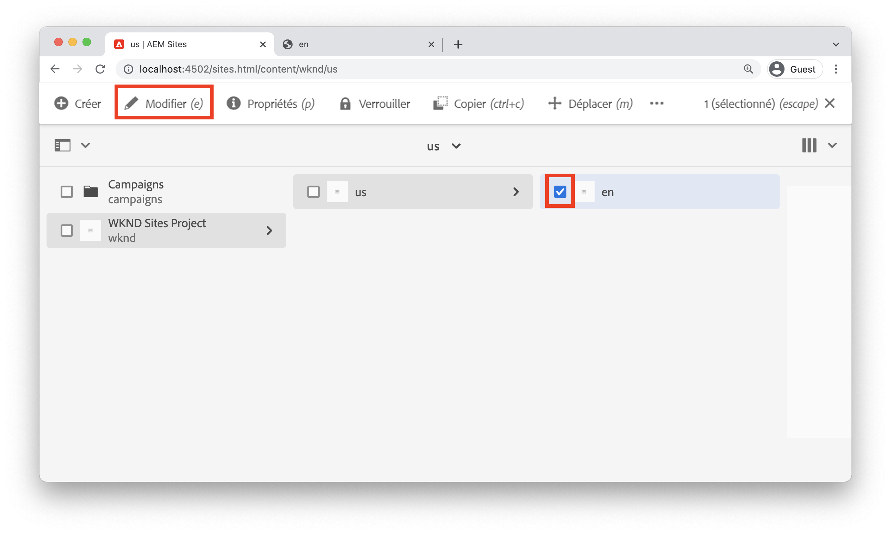
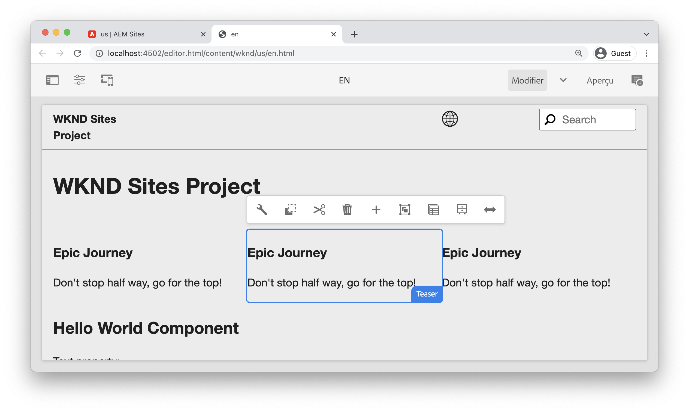
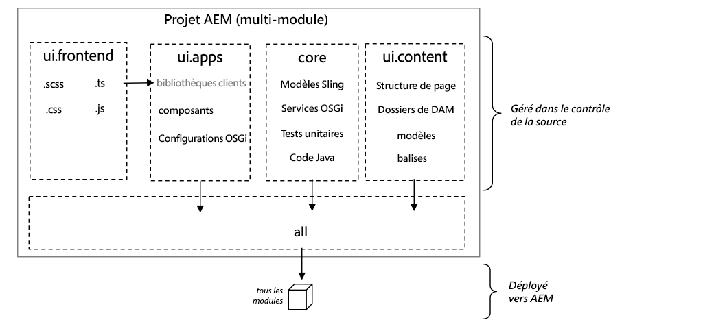
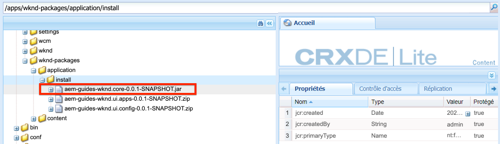
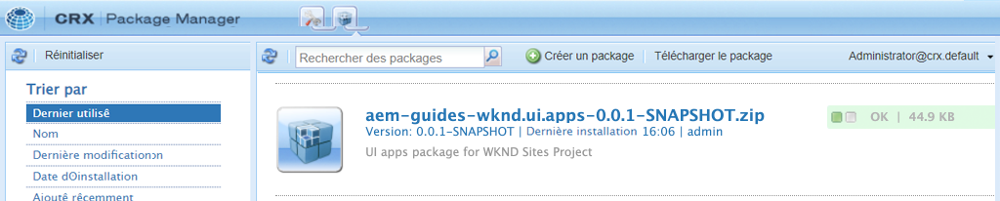

# Configuration du projet {#project-setup}

Ce tutoriel porte sur la création d’un projet Maven multi-module pour gérer le code et les configurations d’un site Adobe Experience Manager.

## Prérequis {#prerequisites}

Examinez les outils et les instructions nécessaires pour configurer un [environnement local de développement](./overview.md#local-dev-environment). Assurez-vous qu’une nouvelle instance d’Adobe Experience Manager est disponible localement et qu’aucun exemple/package de démonstration supplémentaire n’a été installé (hormis les Service Packs requis).

## Objectif {#objective}

1. Découvrez comment générer un nouveau projet AEM à l’aide d’un archétype Maven.
1. Découvrez les différents modules générés par l’archétype de projet AEM et comment ils fonctionnent ensemble.
1. Découvrez comment les composants principaux d’AEM sont inclus dans un projet AEM.

## Ce que vous allez créer {#what-build}

>[!VIDEO](https://video.tv.adobe.com/v/30152?quality=12&learn=on)

Dans ce chapitre, vous générez un nouveau projet Adobe Experience Manager à l’aide de l’[archétype de projet AEM](https://github.com/adobe/aem-project-archetype). Votre projet AEM contient l’intégralité du code, du contenu et des configurations utilisés pour une implémentation avec Sites. Le projet généré dans ce chapitre sert de base à une implémentation de WKND Site et est développé dans les prochains chapitres.

**Qu’est-ce qu’un projet Maven ?** - [Apache Maven](https://maven.apache.org/) est un outil de gestion logicielle permettant de créer des projets. *Toutes les implémentations d’Adobe Experience Manager* utilisent des projets Maven pour créer, gérer et déployer du code personnalisé supplémentaire sur AEM.

**Qu’est-ce qu’un archétype Maven ?** - Un [archétype Maven](https://maven.apache.org/archetype/index.html) est un modèle ou un patron permettant de générer de nouveaux projets. L’archétype de projet AEM permet de générer un nouveau projet avec un espace de noms personnalisé et d’inclure une structure de projet qui suit les bonnes pratiques, ce qui accélère considérablement le développement du projet.

## Créer le projet {#create}

Il existe plusieurs options pour créer un projet Maven multi-module pour AEM. Ce tutoriel utilise l’[archétype de projet Maven AEM **35**](https://github.com/adobe/aem-project-archetype). Cloud Manager [fournit également un assistant d’interface utilisateur](https://experienceleague.adobe.com/docs/experience-manager-cloud-manager/content/getting-started/project-creation/using-the-wizard.html?lang=fr) pour lancer la création d’un projet d’application AEM. Le projet sous-jacent généré par l’interface utilisateur de Cloud Manager aboutit à la même structure que l’utilisation directe de l’archétype.

>[!NOTE]
>
>Ce tutoriel utilise la version **35** de l’archétype. Il est toujours recommandé d’utiliser la **dernière** version de l’archétype pour générer un nouveau projet.

La prochaine série d’étapes s’effectuera à l’aide d’un terminal de ligne de commande basé sur UNIX®, mais devrait être similaire dans le cas de l’utilisation d’un terminal Windows.

1. Ouvrez un terminal de ligne de commande. Vérifiez que Maven est installé :

   ```shell
   $ mvn --version
   Apache Maven 3.6.2
   Maven home: /Library/apache-maven-3.6.2
   Java version: 11.0.4, vendor: Oracle Corporation, runtime: /Library/Java/JavaVirtualMachines/jdk-11.0.4.jdk/Contents/Home
   ```

1. Accédez au répertoire dans lequel vous souhaitez générer le projet AEM. Il peut s’agir de n’importe quel répertoire dans lequel vous souhaitez gérer le code source de votre projet. Par exemple, un répertoire nommé `code` sous le répertoire racine de l’utilisateur ou de l’utilisatrice :

   ```shell
   $ cd ~/code
   ```

1. Collez les éléments suivants dans la ligne de commande pour [générer le projet en mode batch](https://maven.apache.org/archetype/maven-archetype-plugin/examples/generate-batch.html) :

   ```shell
   mvn -B org.apache.maven.plugins:maven-archetype-plugin:3.2.1:generate \
       -D archetypeGroupId=com.adobe.aem \
       -D archetypeArtifactId=aem-project-archetype \
       -D archetypeVersion=39 \
       -D appTitle="WKND Sites Project" \
       -D appId="wknd" \
       -D groupId="com.adobe.aem.guides" \
       -D artifactId="aem-guides-wknd" \
       -D package="com.adobe.aem.guides.wknd" \
       -D version="0.0.1-SNAPSHOT" \
       -D aemVersion="cloud"
   ```

   >[!NOTE]
   >
   > Pour cibler AEM 6.5.14+, remplacez `aemVersion="cloud"` par `aemVersion="6.5.14"`.
   >
   > En outre, utilisez toujours la dernière version de `archetypeVersion` dans [Archétype de projet AEM > Utilisation](https://github.com/adobe/aem-project-archetype#usage).

   Une liste complète des propriétés disponibles pour la configuration d’un projet [peut être consultée ici](https://github.com/adobe/aem-project-archetype#available-properties).

1. La structure de dossiers et de fichiers suivante est générée par l’archétype Maven sur votre système de fichiers local :

   ```plain
    ~/code/
       |--- aem-guides-wknd/
           |--- all/
           |--- core/
           |--- ui.apps/
           |--- ui.apps.structure/
           |--- ui.config/
           |--- ui.content/
           |--- ui.frontend/
           |--- ui.tests /
           |--- it.tests/
           |--- dispatcher/
           |--- pom.xml
           |--- README.md
           |--- .gitignore
   ```

## Déployer et créer le projet {#build}

Créez et déployez le code du projet sur une instance locale d’AEM :

1. Vérifiez que vous disposez d’une instance de création AEM qui s’exécute localement sur le port **4502**.
1. À partir de la ligne de commande, accédez au répertoire du projet `aem-guides-wknd`.

   ```shell
   $ cd aem-guides-wknd
   ```

1. Exécutez la commande suivante pour créer et déployer l’ensemble du projet vers AEM :

   ```shell
   $ mvn clean install -PautoInstallSinglePackage
   ```

   La création prend environ une minute et doit se terminer par le message suivant :

   ```
   ...
   [INFO] ------------------------------------------------------------------------
   [INFO] Reactor Summary for WKND Sites Project 0.0.1-SNAPSHOT:
   [INFO] 
   [INFO] WKND Sites Project ................................. SUCCESS [  0.113 s]
   [INFO] WKND Sites Project - Core .......................... SUCCESS [  3.136 s]
   [INFO] WKND Sites Project - UI Frontend ................... SUCCESS [  4.461 s]
   [INFO] WKND Sites Project - Repository Structure Package .. SUCCESS [  0.359 s]
   [INFO] WKND Sites Project - UI apps ....................... SUCCESS [  1.732 s]
   [INFO] WKND Sites Project - UI content .................... SUCCESS [  0.956 s]
   [INFO] WKND Sites Project - UI config ..................... SUCCESS [  0.064 s]
   [INFO] WKND Sites Project - All ........................... SUCCESS [  8.229 s]
   [INFO] WKND Sites Project - Integration Tests ............. SUCCESS [  3.329 s]
   [INFO] WKND Sites Project - Dispatcher .................... SUCCESS [  0.027 s]
   [INFO] WKND Sites Project - UI Tests ...................... SUCCESS [  0.032 s]
   [INFO] ------------------------------------------------------------------------
   [INFO] BUILD SUCCESS
   [INFO] ------------------------------------------------------------------------
   [INFO] Total time:  23.189 s
   [INFO] Finished at: 2023-01-10T11:12:23-05:00
   [INFO] ------------------------------------------------------------------------    
   ```

   Le profil Maven `autoInstallSinglePackage` compile les modules individuels du projet et déploie un seul package sur l’instance AEM. Par défaut, ce package est déployé sur une instance AEM qui s’exécute localement sur le port **4502** et avec les informations d’identification `admin:admin`.

1. Accédez au gestionnaire de packages sur votre instance AEM locale : [http://localhost:4502/crx/packmgr/index.jsp](http://localhost:4502/crx/packmgr/index.jsp). Vous devriez voir des packages pour `aem-guides-wknd.ui.apps`, `aem-guides-wknd.ui.config`, `aem-guides-wknd.ui.content`, et `aem-guides-wknd.all`.

1. Accédez à la console Sites : [http://localhost:4502/sites.html/content](http://localhost:4502/sites.html/content). WKND Site constitue l’un des sites. Il comprend une structure de site avec une hiérarchie de gabarits de langue des États-Unis. Cette hiérarchie de site est basée sur les valeurs de `language_country` et `isSingleCountryWebsite` lors de la génération du projet à l’aide de l’archétype.

1. Ouvrez la page **Anglais** `>` **États-Unis** en sélectionnant la page et en cliquant sur l’icône **Modifier** dans la barre de menus :

   

1. Le contenu de démarrage a déjà été créé et plusieurs composants peuvent être ajoutés à une page. Testez ces composants pour vous faire une idée de leur fonctionnalité. Vous apprendrez les principes de base d’un composant dans le chapitre suivant.

   

   *Exemple de contenu généré par l’archétype*

## Examiner le projet {#project-structure}

Le projet AEM généré est constitué de modules Maven individuels, ayant chacun un rôle différent. Ce tutoriel et la plupart des développements se concentrent sur ces modules :

* [core](https://experienceleague.adobe.com/docs/experience-manager-core-components/using/developing/archetype/core.html?lang=fr) : code Java, principalement pour les développeurs et développeuses back-end.
* [ui.frontend](https://experienceleague.adobe.com/docs/experience-manager-core-components/using/developing/archetype/uifrontend.html?lang=fr) : contient le code source pour CSS, JavaScript, Sass, TypeScript, principalement pour les développeurs et développeuses front-end.
* [ui.apps](https://experienceleague.adobe.com/docs/experience-manager-core-components/using/developing/archetype/uiapps.html?lang=fr) : contient des définitions de composant et de boîte de dialogue, incorpore les codes CSS et JavaScript compilés en tant que bibliothèques clientes.
* [ui.content](https://experienceleague.adobe.com/docs/experience-manager-core-components/using/developing/archetype/uicontent.html?lang=fr) : contient du contenu structurel et des configurations telles que des modèles modifiables ou des schémas de métadonnées (/content, /conf).

* **all** : il s’agit d’un module Maven vide qui combine les modules ci-dessus dans un unique package qui peut être déployé dans un environnement AEM.



Consultez la [Documentation sur l’archétype de projet AEM](https://experienceleague.adobe.com/docs/experience-manager-core-components/using/developing/archetype/overview.html?lang=fr) pour en savoir plus sur **tous** les modules Maven.

### Intégration des composants principaux {#core-components}

Les [composants principaux AEM](https://experienceleague.adobe.com/docs/experience-manager-core-components/using/introduction.html?lang=fr) constituent un ensemble de composants de gestion de contenu web (Web Content Management, WCM) standardisés pour AEM. Ces composants fournissent un ensemble de fonctionnalités de base et sont stylisés, personnalisés et étendus pour des projets individuels.

L’environnement AEM as a Cloud Service inclut la dernière version des [composants principaux AEM](https://experienceleague.adobe.com/docs/experience-manager-core-components/using/introduction.html?lang=fr). Par conséquent, les projets générés pour AEM as a Cloud Service n’incluent **pas** de composants principaux AEM incorporés.

Pour les projets générés par AEM 6.5/6.4, l’archétype incorpore automatiquement les [composants principaux AEM](https://experienceleague.adobe.com/docs/experience-manager-core-components/using/introduction.html?lang=fr) dans le projet. Il est recommandé d’incorporer les composants principaux AEM dans AEM 6.5/6.4, afin de s’assurer que la dernière version est déployée avec votre projet. Vous trouverez des informations supplémentaires sur la façon dont les composants principaux sont [inclus dans le projet ici](https://experienceleague.adobe.com/docs/experience-manager-core-components/using/developing/archetype/using.html?lang=fr#core-components).

## Gestion du contrôle de code source {#source-control}

Il est toujours préférable d’utiliser une forme de contrôle de code source pour gérer le code dans votre application. Ce tutoriel utilise Git et GitHub. Il existe plusieurs fichiers générés par Maven et/ou l’IDE de votre choix qui doivent être ignorés par la gestion du contrôle de code source.

Maven crée un dossier cible chaque fois que vous créez et installez le package de code. Le dossier cible et son contenu doivent être exclus de la gestion du contrôle de code source.

Vérifiez que plusieurs fichiers `.content.xml` sont créés dans le module `ui.apps`. Ces fichiers XML mappent les types de nœuds et les propriétés du contenu installé dans le JCR. Ces fichiers sont critiques et ne **doivent pas** être ignorés.

L’archétype de projet AEM génère un exemple de fichier `.gitignore` qui peut être utilisé comme point de départ pour déterminer les fichiers qui peuvent être ignorés en toute sécurité. Le fichier est généré sur `<src>/aem-guides-wknd/.gitignore`.

## Félicitations. {#congratulations}

Félicitations, vous avez créé votre premier projet AEM.

### Étapes suivantes {#next-steps}

Découvrez la technologie sous-jacente d’un composant Adobe Experience Manager (AEM) Sites au moyen d’un simple exemple `HelloWorld` avec le tutoriel [Principes de base des composants](component-basics.md).

## Commandes Maven avancées (bonus) {#advanced-maven-commands}

Pendant le développement, vous pouvez travailler avec un seul des modules et éviter de créer l’ensemble du projet afin de gagner du temps. Vous pouvez également effectuer un déploiement direct sur une instance de publication AEM ou éventuellement sur une instance AEM qui ne s’exécute pas sur le port 4502.

Examinons ensuite quelques commandes et profils Maven supplémentaires que vous pouvez utiliser pour une plus grande flexibilité lors du développement.

### Module principal {#core-module}

Le module **[principal](https://experienceleague.adobe.com/docs/experience-manager-core-components/using/developing/archetype/core.html?lang=fr)** contient tout le code Java™ associé au projet. La création du module **principal** déploie un lot OSGi sur AEM. Pour créer uniquement ce module :

1. Accédez au dossier `core` (sous `aem-guides-wknd`) :

   ```shell
   $ cd core/
   ```

1. Exécutez la commande suivante :

   ```shell
   $ mvn clean install -PautoInstallBundle
   ...
   [INFO] --- sling-maven-plugin:2.4.0:install (install-bundle) @ aem-guides-wknd.core ---
   [INFO] Installing Bundle aem-guides-wknd.core(~/code/aem-guides-wknd/core/target/aem-guides-wknd.core-0.0.1-SNAPSHOT.jar) to http://localhost:4502/system/console via WebConsole
   [INFO] Bundle installed
   [INFO] ------------------------------------------------------------------------
   [INFO] BUILD SUCCESS
   [INFO] ------------------------------------------------------------------------
   [INFO] Total time:  8.558 s
   ```

1. Accédez à [http://localhost:4502/system/console/bundles](http://localhost:4502/system/console/bundles). Il s’agit de la console web OSGi qui contient des informations sur tous les lots installés sur l’instance AEM.

1. Utilisez le bouton (bascule) de la colonne de tri **Id**. Vous devriez voir le lot WKND installé et actif.

   

1. Vous pouvez voir l’emplacement « physique » du fichier jar dans [CRXDE-Lite](http://localhost:4502/crx/de/index.jsp#/apps/wknd-packages/application/install/aem-guides-wknd.core-1.0.0-SNAPSHOT.jar) :

   

### Modules ui.apps et ui.content {#apps-content-module}

Le module Maven **[ui.apps](https://experienceleague.adobe.com/docs/experience-manager-core-components/using/developing/archetype/uiapps.html?lang=fr)** comprend tout le code de rendu nécessaire pour le site situé sous `/apps`. Ce module inclut les éléments CSS/JS qui seront stockés au format AEM appelé [clientlibs](https://experienceleague.adobe.com/docs/experience-manager-65/developing/introduction/clientlibs.html?lang=fr). Cela inclut également les scripts [HTL](https://experienceleague.adobe.com/docs/experience-manager-htl/content/overview.html?lang=fr) pour le rendu du code HTML dynamique. Vous pouvez vous représenter le module **ui.apps** sous la forme d’un mappage vers la structure dans le JCR, mais dans un format pouvant être stocké dans un système de fichiers et validé dans le contrôle de code source. Le module **ui.apps** ne contient que du code.

Pour créer uniquement ce module :

1. Depuis la ligne de commande. Accédez au dossier `ui.apps` (sous `aem-guides-wknd`) :

   ```shell
   $ cd ../ui.apps
   ```

1. Exécutez la commande suivante :

   ```shell
   $ mvn clean install -PautoInstallPackage
   ...
   Package installed in 70ms.
   [INFO] ------------------------------------------------------------------------
   [INFO] BUILD SUCCESS
   [INFO] ------------------------------------------------------------------------
   [INFO] Total time:  2.987 s
   [INFO] Finished at: 2023-01-10T11:35:28-05:00
   [INFO] ------------------------------------------------------------------------
   ```

1. Accédez à [http://localhost:4502/crx/packmgr/index.jsp](http://localhost:4502/crx/packmgr/index.jsp). Vous devriez voir que le package `ui.apps` est le premier package installé. Son horodatage doit être plus récent que celui de tous les autres packages.

   

1. Revenez à la ligne de commande et exécutez la commande suivante (dans le dossier `ui.apps`) :

   ```shell
   $ mvn -PautoInstallPackagePublish clean install
   ...
   [INFO] --- content-package-maven-plugin:1.0.2:install (install-package-publish) @ aem-guides-wknd.ui.apps ---
   [INFO] Installing aem-guides-wknd.ui.apps (/Users/sachinmali/Desktop/code/wknd-tutorial/aem-guides-wknd/ui.apps/target/aem-guides-wknd.ui.apps-0.0.1-SNAPSHOT.zip) to http://localhost:4503/crx/packmgr/service.jsp
   [INFO] I/O exception (java.net.ConnectException) caught when processing request: Connection refused (Connection refused)
   [INFO] Retrying request
   [INFO] I/O exception (java.net.ConnectException) caught when processing request: Connection refused (Connection refused)
   [INFO] Retrying request
   [INFO] I/O exception (java.net.ConnectException) caught when processing request: Connection refused (Connection refused)
   [INFO] Retrying request
   [INFO] ------------------------------------------------------------------------
   [INFO] BUILD FAILURE
   [INFO] ------------------------------------------------------------------------
   [INFO] Total time:  2.812 s
   [INFO] Finished at: 2023-01-10T11:37:28-05:00
   [INFO] ------------------------------------------------------------------------
   [ERROR] Failed to execute goal com.day.jcr.vault:content-package-maven-plugin:1.0.2:install (install-package-publish) on project aem-guides-wknd.ui.apps: Connection refused (Connection refused) -> [Help 1]
   ```

   Le profil `autoInstallPackagePublish` est destiné à déployer le package dans un environnement de publication qui s’exécute sur le port **4503**. L’erreur ci-dessus est prévisible si une instance AEM qui s’exécute sur http://localhost:4503 est introuvable.

1. Enfin, exécutez la commande suivante pour déployer le package `ui.apps` sur le port **4504** :

   ```shell
   $ mvn -PautoInstallPackage clean install -Daem.port=4504
   ...
   [INFO] --- content-package-maven-plugin:1.0.2:install (install-package) @ aem-guides-wknd.ui.apps ---
   [INFO] Installing aem-guides-wknd.ui.apps (/Users/dgordon/code/aem-guides-wknd/ui.apps/target/aem-guides-wknd.ui.apps-0.0.1-SNAPSHOT.zip) to http://localhost:4504/crx/packmgr/service.jsp
   [INFO] I/O exception (java.net.ConnectException) caught when processing request: Connection refused (Connection refused)
   [INFO] Retrying request
   [INFO] I/O exception (java.net.ConnectException) caught when processing request: Connection refused (Connection refused)
   [INFO] Retrying request
   [INFO] I/O exception (java.net.ConnectException) caught when processing request: Connection refused (Connection refused)
   [INFO] Retrying request
   [INFO] ------------------------------------------------------------------------
   [INFO] BUILD FAILURE
   [INFO] --------------------------------------------------------------------
   ```

   Une nouvelle fois, un échec de création est prévisible si aucune instance AEM s’exécutant sur le port **4504** n’est disponible. Le paramètre `aem.port` est défini dans le fichier POM sur `aem-guides-wknd/pom.xml`.

Le module **[ui.content](https://experienceleague.adobe.com/docs/experience-manager-core-components/using/developing/archetype/uicontent.html?lang=fr)** est structuré de la même manière que le module **ui.apps**. La seule différence est que le module **ui.content** contient ce que l’on appelle du contenu **mutable**. Le contenu **mutable** fait essentiellement référence à des configurations non codées telles que des modèles, des stratégies ou des structures de dossiers stockées dans le contrôle de code source. **Toutefois**, ce contenu peut être modifié directement sur une instance AEM. Ce point est abordé plus en détail dans le chapitre Pages et modèles.

Pour créer le module **ui.content**, vous pouvez utiliser les mêmes commandes Maven que celles utilisées pour créer le module **ui.apps**. N’hésitez pas à répéter les étapes ci-dessus depuis le dossier **ui.content**.

## Résolution des problèmes

En cas de problème lors de la génération du projet à l’aide de l’archétype de projet AEM, consultez la liste des [problèmes connus](https://github.com/adobe/aem-project-archetype#known-issues) et la liste des [problèmes](https://github.com/adobe/aem-project-archetype/issues) en cours.

## Encore une fois, félicitations. {#congratulations-bonus}

Félicitations, vous avez terminé les ressources supplémentaires.

### Étapes suivantes {#next-steps-bonus}

Découvrez la technologie sous-jacente d’un composant Adobe Experience Manager (AEM) Sites au moyen d’un simple exemple `HelloWorld` avec le tutoriel [Principes de base des composants](component-basics.md).
