# Développement avec le système de style {#developing-with-the-style-system}

Découvrez comment mettre en oeuvre des styles individuels et réutiliser les composants principaux à l’aide du système de style du Experience Manager. Ce tutoriel décrit le développement pour le système de style afin d’étendre les composants principaux avec des CSS spécifiques à la marque et des configurations de stratégie avancées de l’éditeur de modèles.

## Prérequis {#prerequisites}

Examinez les outils et les instructions requis pour configurer une [environnement de développement local](overview.md#local-dev-environment).

Il est également recommandé de consulter la section [Bibliothèques côté client et processus front-end](client-side-libraries.md) tutoriel pour comprendre les principes de base des bibliothèques côté client et les différents outils front-end intégrés au projet AEM.

### Projet de démarrage

>[!NOTE]
>
> Si vous avez terminé avec succès le chapitre précédent, vous pouvez réutiliser le projet et ignorer les étapes d’extraction du projet de démarrage.

Consultez le code de ligne de base sur lequel le tutoriel s’appuie :

1. Consultez la section `tutorial/style-system-start` branche à partir de [GitHub](https://github.com/adobe/aem-guides-wknd)

   ```shell
   $ cd aem-guides-wknd
   $ git checkout tutorial/style-system-start
   ```

1. Déployez la base de code sur une instance d’AEM locale à l’aide de vos compétences Maven :

   ```shell
   $ mvn clean install -PautoInstallSinglePackage
   ```

   >[!NOTE]
   >
   > Si vous utilisez AEM version 6.5 ou 6.4, ajoutez la variable `classic` profile à n’importe quelle commande Maven.

   ```shell
   $ mvn clean install -PautoInstallSinglePackage -Pclassic
   ```

Vous pouvez toujours afficher le code terminé sur [GitHub](https://github.com/adobe/aem-guides-wknd/tree/tutorial/style-system-solution) ou extraire le code localement en passant à la branche `tutorial/style-system-solution`.

## Objectif

1. Découvrez comment utiliser le système de style pour appliquer une page CSS spécifique à la marque à AEM les composants principaux.
1. Découvrez la notation BEM et comment elle peut être utilisée pour définir soigneusement les styles.
1. Appliquez des configurations de stratégie avancées à l’aide de modèles modifiables.

## Ce que vous allez construire {#what-build}

Ce chapitre utilise la méthode [Système de style](https://experienceleague.adobe.com/docs/experience-manager-learn/sites/page-authoring/style-system-feature-video-use.html?lang=fr) pour créer des variantes de la variable **Titre** et **Texte** composants utilisés sur la page Article.

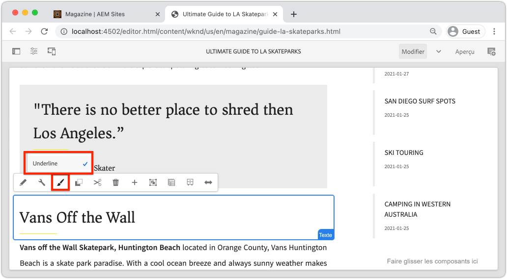

*Style de soulignement disponible à utiliser pour le composant Titre*

## Contexte {#background}

Le [Système de style](https://experienceleague.adobe.com/docs/experience-manager-65/authoring/siteandpage/style-system.html?lang=fr) permet aux développeurs et aux éditeurs de modèle de créer plusieurs variantes visuelles d’un composant. Les auteurs peuvent ensuite décider quel style utiliser lors de la composition d’une page. Le système de style est utilisé dans le reste du tutoriel pour obtenir plusieurs styles uniques tout en utilisant les composants principaux dans une approche à code faible.

L’idée générale du système de style est que les auteurs peuvent choisir différents styles de l’apparence d’un composant. Les &quot;styles&quot; sont pris en charge par des classes CSS supplémentaires qui sont injectées dans la balise div externe d’un composant. Dans les bibliothèques clientes, des règles CSS sont ajoutées en fonction de ces classes de style afin que le composant change d’aspect.

Vous pouvez trouver [documentation détaillée du système de style ici](https://experienceleague.adobe.com/docs/experience-manager-cloud-service/content/sites/authoring/features/style-system.html?lang=fr). Il y a aussi une grande [vidéo technique pour comprendre le système de style](https://experienceleague.adobe.com/docs/experience-manager-learn/sites/developing/style-system-technical-video-understand.html).

## Style de soulignement - Titre {#underline-style}

Le [Composant du titre](https://experienceleague.adobe.com/docs/experience-manager-core-components/using/wcm-components/title.html) a été ajouté par proxy au projet sous `/apps/wknd/components/title` dans le **ui.apps** module . Les styles par défaut des éléments d’en-tête (`H1`, `H2`, `H3`...) ont déjà été implémentés dans la variable **ui.frontend** module .

Le [Conceptions WKND Article](assets/pages-templates/wknd-article-design.xd) contiennent un style unique pour le composant Titre avec un trait de soulignement. Au lieu de créer deux composants ou de modifier la boîte de dialogue du composant, le système de style peut être utilisé pour permettre aux auteurs d’ajouter un style de soulignement.


### Ajout d’une stratégie de titre

Ajoutons une stratégie pour les composants Titre pour permettre aux auteurs de contenu de choisir le style Souligné à appliquer à des composants spécifiques. Pour ce faire, utilisez l’éditeur de modèles dans AEM.

1. Accédez au **Page Article** modèle à partir de : [http://localhost:4502/editor.html/conf/wknd/settings/wcm/templates/article-page/structure.html](http://localhost:4502/editor.html/conf/wknd/settings/wcm/templates/article-page/structure.html)

1. Dans **Structure** mode, dans la fenêtre principale **Conteneur de mises en page**, sélectionnez la variable **Stratégie** en regard de l’icône **Titre** composant répertorié sous *Composants autorisés*:

   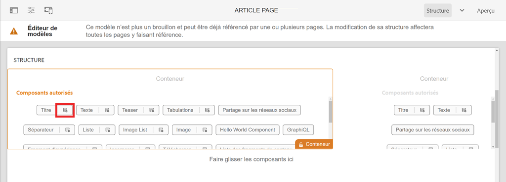

1. Créez une stratégie pour le composant Titre avec les valeurs suivantes :

   *Titre de la stratégie&#42;*: **Titre WKND**

   *Propriétés* > *Onglet Styles* > *Ajouter un nouveau style*

   **Souligner** : `cmp-title--underline`

   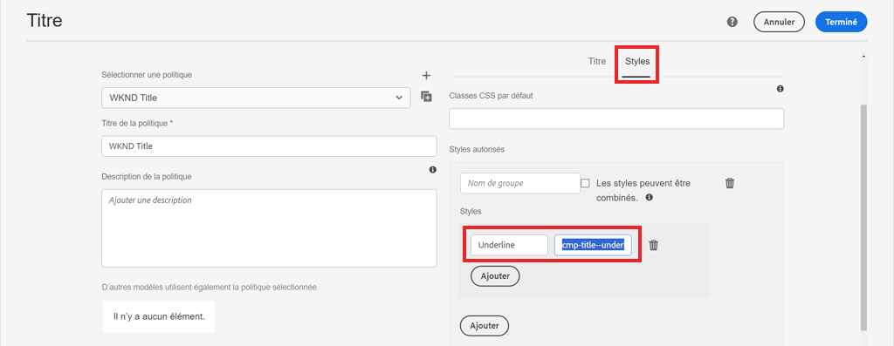

   Cliquez sur **Terminé** pour enregistrer les modifications apportées à la stratégie Titre.

   >[!NOTE]
   >
   > La valeur `cmp-title--underline` renseigne la classe CSS sur la balise div externe du balisage de HTML du composant.

### Appliquer le style de soulignement

En tant qu’auteur, appliquons le style souligné à certains composants du titre.

1. Accédez au **La Skateparks** article dans l’éditeur AEM Sites à l’adresse : [http://localhost:4502/editor.html/content/wknd/us/en/magazine/guide-la-skateparks.html](http://localhost:4502/editor.html/content/wknd/us/en/magazine/guide-la-skateparks.html)
1. Dans **Modifier** , choisissez un composant Titre . Cliquez sur le bouton **pinceau** et sélectionnez la variable **Souligner** style :

   

   >[!NOTE]
   >
   > À ce stade, aucune modification visible n’a lieu lorsque la variable `underline` style n’a pas été implémenté. Dans l’exercice suivant, ce style est implémenté.

1. Cliquez sur le bouton **Informations sur la page** icon > **Afficher comme publié(e)** pour inspecter la page en dehors de l’éditeur d’AEM.
1. Utilisez les outils de développement de votre navigateur pour vérifier que le balisage autour du composant Titre comporte la classe CSS. `cmp-title--underline` appliquée à la balise div externe.

   

   ```html
   <div class="title cmp-title--underline">
       <div data-cmp-data-layer="{&quot;title-b6450e9cab&quot;:{&quot;@type&quot;:&quot;wknd/components/title&quot;,&quot;repo:modifyDate&quot;:&quot;2022-02-23T17:34:42Z&quot;,&quot;dc:title&quot;:&quot;Vans Off the Wall Skatepark&quot;}}" 
       id="title-b6450e9cab" class="cmp-title">
           <h2 class="cmp-title__text">Vans Off the Wall Skatepark</h2>
       </div>
   </div>
   ```

### Mise en oeuvre du style souligné - ui.frontend

Implémentez ensuite le style Souligné à l’aide de la méthode **ui.frontend** du projet AEM. Le serveur de développement webpack fourni avec la variable **ui.frontend** pour prévisualiser les styles *before* Le déploiement sur une instance locale d’AEM est utilisé.

1. Démarrez le `watch` à partir de **ui.frontend** module :

   ```shell
   $ cd ~/code/aem-guides-wknd/ui.frontend/
   $ npm run watch
   ```

   Cela permet de lancer un processus qui surveille les modifications dans la `ui.frontend` et synchronisez les modifications sur l’instance AEM.


1. Renvoyer votre IDE et ouvrir le fichier `_title.scss` de : `ui.frontend/src/main/webpack/components/_title.scss`.
1. Introduisez une nouvelle règle ciblant la variable `cmp-title--underline` Classe :

   ```scss
   /* Default Title Styles */
   .cmp-title {}
   .cmp-title__text {}
   .cmp-title__link {}
   
   /* Add Title Underline Style */
   .cmp-title--underline {
       .cmp-title__text {
           &:after {
           display: block;
               width: 84px;
               padding-top: 8px;
               content: '';
               border-bottom: 2px solid $brand-primary;
           }
       }
   }
   ```

   >[!NOTE]
   >
   >Il est recommandé de toujours appliquer des styles de portée stricte au composant cible. Cela permet de s’assurer que les styles supplémentaires n’affectent pas d’autres zones de la page.
   >
   >Tous les composants principaux sont conformes à **[Notation BEM](https://github.com/adobe/aem-core-wcm-components/wiki/css-coding-conventions)**. Il est recommandé de cibler la classe CSS externe lors de la création d’un style par défaut pour un composant. Une autre bonne pratique consiste à cibler les noms de classe spécifiés par la notation BEM des composants principaux plutôt que les éléments de HTML.

1. Revenez au navigateur et à la page AEM. Le style Souligné doit être ajouté :

   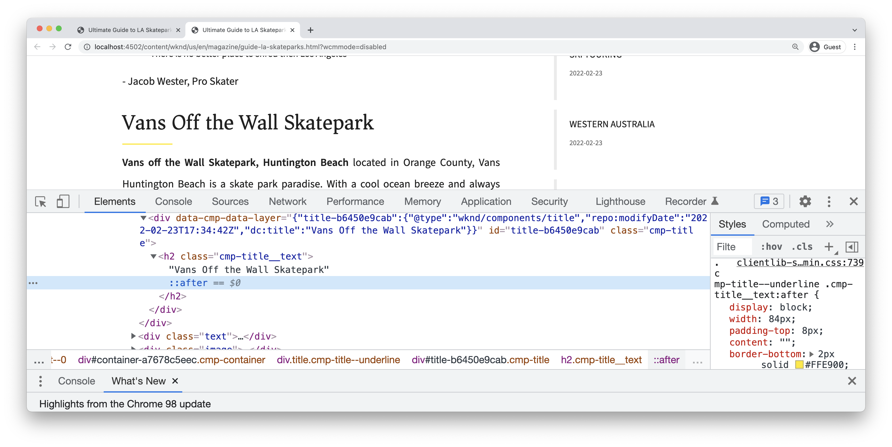

1. Dans l’éditeur d’AEM, vous devriez maintenant pouvoir activer et désactiver le **Souligner** et vérifiez que les modifications sont reflétées visuellement.

## Style de bloc de citations - Texte {#text-component}

Répétez ensuite les étapes similaires pour appliquer un style unique au [Composant textuel](https://experienceleague.adobe.com/docs/experience-manager-core-components/using/wcm-components/text.html). Le composant Texte a été ajouté par proxy au projet sous `/apps/wknd/components/text` dans le **ui.apps** module . Les styles par défaut des éléments de paragraphe ont déjà été implémentés dans la variable **ui.frontend**.

Le [Conceptions WKND Article](assets/pages-templates/wknd-article-design.xd) contiennent un style unique pour le composant Texte avec un bloc de guillemet :


### Ajout d’une stratégie de texte

Ajoutez ensuite une stratégie pour les composants Texte .

1. Accédez au **Modèle de page d’article** de : [http://localhost:4502/editor.html/conf/wknd/settings/wcm/templates/article-page/structure.html](http://localhost:4502/editor.html/conf/wknd/settings/wcm/templates/article-page/structure.html).

1. Dans **Structure** mode, dans la fenêtre principale **Conteneur de mises en page**, sélectionnez la variable **Stratégie** en regard de l’icône **Texte** composant répertorié sous *Composants autorisés*:

   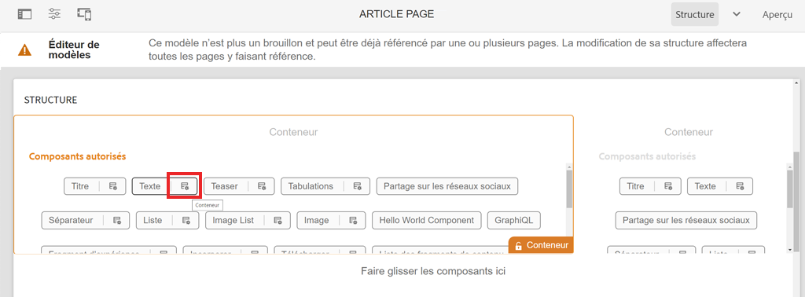

1. Mettez à jour la stratégie de composant Texte avec les valeurs suivantes :

   *Titre de la stratégie&#42;*: **Texte du contenu**

   *Modules externes* > *Styles de paragraphe* > *Activation des styles de paragraphe*

   *Onglet Styles* > *Ajouter un nouveau style*

   **Bloc entre guillemets** : `cmp-text--quote`

   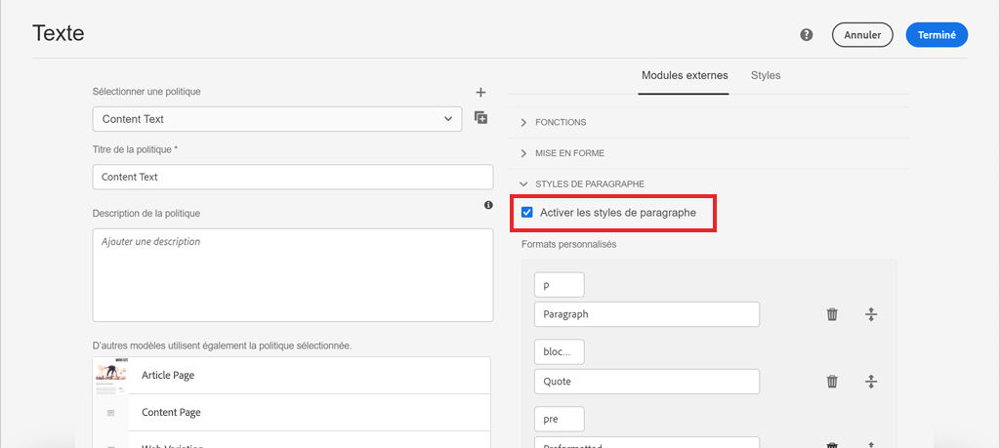

   

   Cliquez sur **Terminé** pour enregistrer les modifications apportées à la stratégie Texte.

### Application du style de bloc de citations

1. Accédez au **La Skateparks** article dans l’éditeur AEM Sites à l’adresse : [http://localhost:4502/editor.html/content/wknd/us/en/magazine/guide-la-skateparks.html](http://localhost:4502/editor.html/content/wknd/us/en/magazine/guide-la-skateparks.html)
1. Dans **Modifier** , choisissez un composant Texte . Modifiez le composant pour inclure un élément de guillemet :

   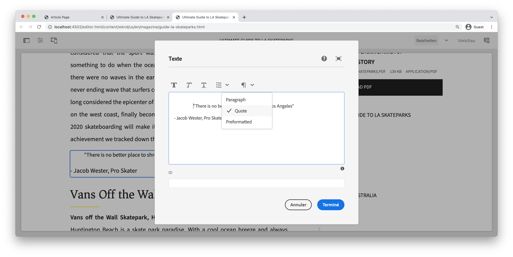

1. Sélectionnez le composant de texte et cliquez sur le bouton **pinceau** et sélectionnez la variable **Bloc entre guillemets** style :

   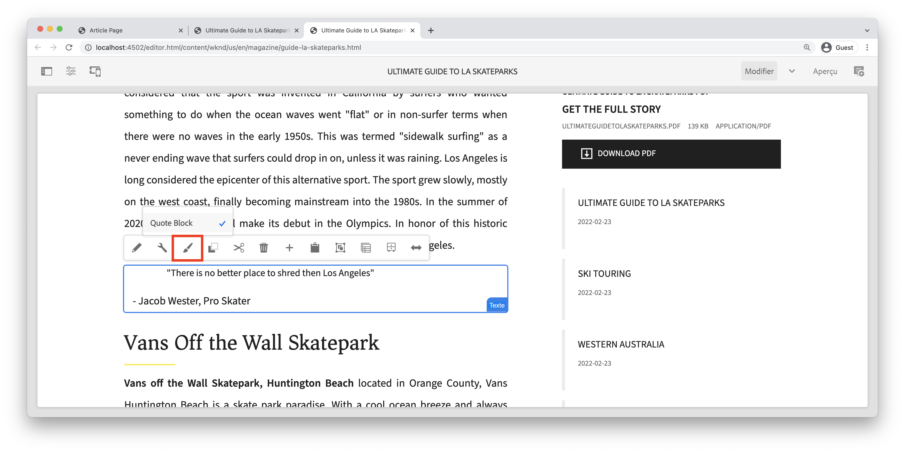

1. Utilisez les outils de développement du navigateur pour inspecter le balisage. Vous devriez voir le nom de la classe. `cmp-text--quote` a été ajouté à la balise div externe du composant :

   ```html
   <!-- Quote Block style class added -->
   <div class="text cmp-text--quote">
       <div data-cmp-data-layer="{&quot;text-60910f4b8d&quot;:{&quot;@type&quot;:&quot;wknd/components/text&quot;,&quot;repo:modifyDate&quot;:&quot;2022-02-24T00:55:26Z&quot;,&quot;xdm:text&quot;:&quot;<blockquote>&amp;nbsp; &amp;nbsp; &amp;nbsp;&amp;quot;There is no better place to shred then Los Angeles&amp;quot;</blockquote>\r\n<p>- Jacob Wester, Pro Skater</p>\r\n&quot;}}" id="text-60910f4b8d" class="cmp-text">
           <blockquote>&nbsp; &nbsp; &nbsp;"There is no better place to shred then Los Angeles"</blockquote>
           <p>- Jacob Wester, Pro Skater</p>
       </div>
   </div>
   ```

### Implémentation du style de bloc de citations - ui.frontend

Implémentons maintenant le style Bloc de citations à l’aide de la méthode **ui.frontend** du projet AEM.

1. Si ce n’est pas déjà fait, démarrez la variable `watch` à partir de **ui.frontend** module :

   ```shell
   $ npm run watch
   ```

1. Mettre à jour le fichier `text.scss` de : `ui.frontend/src/main/webpack/components/_text.scss`:

   ```css
   /* Default text style */
   .cmp-text {}
   .cmp-text__paragraph {}
   
   /* WKND Text Quote style */
   .cmp-text--quote {
       .cmp-text {
           background-color: $brand-third;
           margin: 1em 0em;
           padding: 1em;
   
           blockquote {
               border: none;
               font-size: $font-size-large;
               font-family: $font-family-serif;
               padding: 14px 14px;
               margin: 0;
               margin-bottom: 0.5em;
   
               &:after {
                   border-bottom: 2px solid $brand-primary; /*yellow border */
                   content: '';
                   display: block;
                   position: relative;
                   top: 0.25em;
                   width: 80px;
               }
           }
           p {
               font-family:  $font-family-serif;
           }
       }
   }
   ```

   >[!CAUTION]
   >
   > Dans ce cas, les éléments de HTML bruts sont ciblés par les styles. En effet, le composant Texte fournit un éditeur de texte enrichi pour les auteurs de contenu. La création de styles directement par rapport au contenu de l’éditeur de texte enrichi doit être effectuée avec soin et il est encore plus important d’étendre étroitement les styles.

1. Revenez à nouveau au navigateur et vous devriez constater que le style de bloc entre guillemets a été ajouté :

   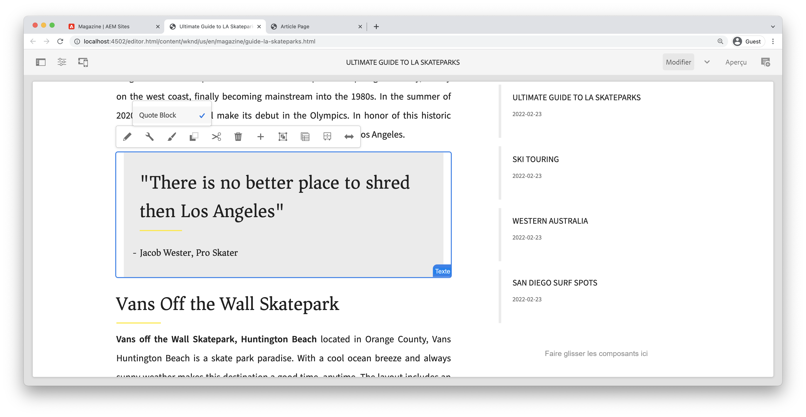

1. Arrêtez le serveur de développement Webpack.

## Largeur fixe - Conteneur (bonus) {#layout-container}

Les composants de conteneur ont été utilisés pour créer la structure de base du modèle de page d’article et fournir les zones de dépôt permettant aux auteurs de contenu d’ajouter du contenu sur une page. Les conteneurs peuvent également utiliser le système de style, offrant ainsi aux auteurs de contenu davantage d’options pour concevoir des mises en page.

Le **Conteneur principal** du modèle Page d’article contient les deux conteneurs pouvant être créés et d’une largeur fixe.

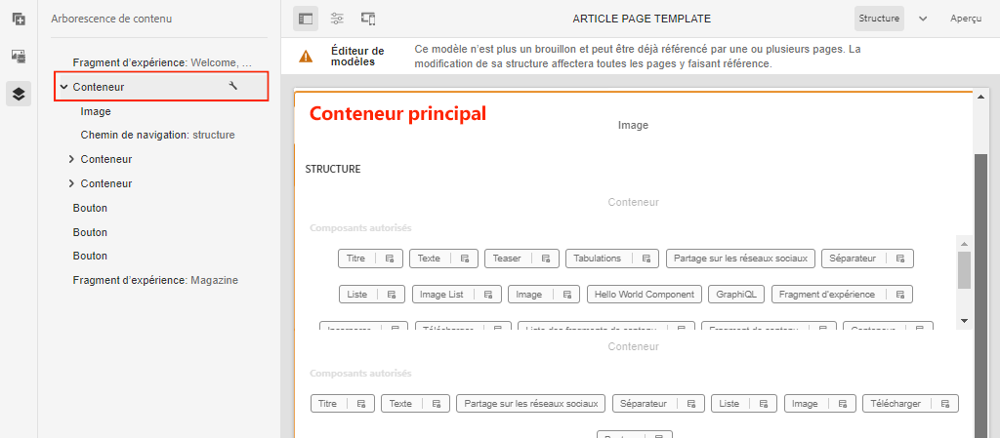

*Conteneur principal dans le modèle de page d’article*.

La politique de la variable **Conteneur principal** définit l’élément par défaut comme `main`:

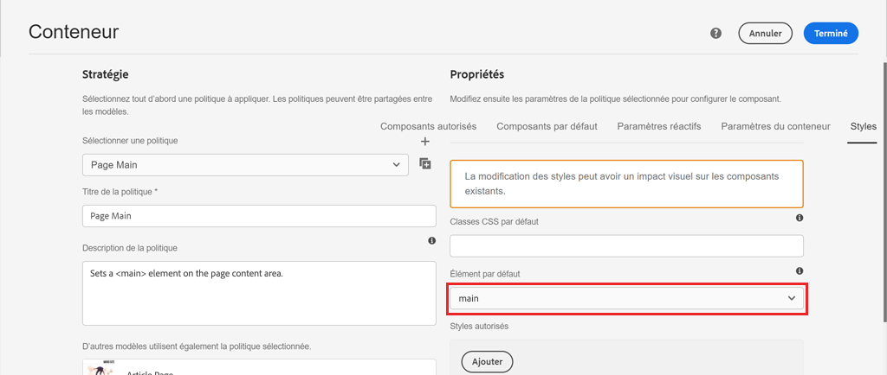

Le fichier CSS qui crée la variable **Conteneur principal** fixed est définie dans la variable **ui.frontend** module à `ui.frontend/src/main/webpack/site/styles/container_main.scss` :

```SCSS
main.container {
    padding: .5em 1em;
    max-width: $max-content-width;
    float: unset!important;
    margin: 0 auto!important;
    clear: both!important;
}
```

Au lieu de cibler la variable `main` Élément de HTML, le système de style peut être utilisé pour créer un **Largeur fixe** dans le cadre de la stratégie Container . Le système de style permet aux utilisateurs de basculer entre les **Largeur fixe** et **Largeur du flux** conteneurs.

1. **Défi bonus** - utiliser les leçons retenues des exercices précédents et utiliser le système de style pour mettre en oeuvre une **Largeur fixe** et **Largeur du flux** styles pour le composant Conteneur.

## Félicitations ! {#congratulations}

Félicitations, la page de l&#39;article est presque stylisée et vous avez acquis une expérience pratique en utilisant le système de style AEM.

### Étapes suivantes {#next-steps}

Découvrez les étapes de bout en bout pour créer une [Composant d’AEM personnalisé](custom-component.md) qui affiche le contenu créé dans une boîte de dialogue et explore le développement d’un modèle Sling pour encapsuler la logique commerciale qui renseigne le code HTL du composant.

Afficher le code terminé sur [GitHub](https://github.com/adobe/aem-guides-wknd) ou revoir et déployer le code localement sur la branche Git `tutorial/style-system-solution`.

1. Cloner le [github.com/adobe/aem-wknd-guides](https://github.com/adobe/aem-guides-wknd) référentiel.
1. Consultez la section `tutorial/style-system-solution` branche.
