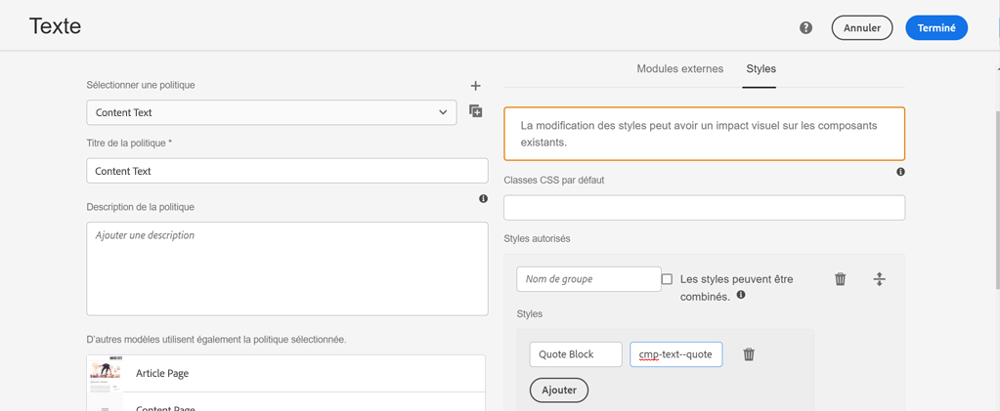

# Développer avec le système de style {#developing-with-the-style-system}

Découvrez comment mettre en œuvre des styles individuels et réutiliser les composants principaux à l’aide du système de style d’Experience Manager. Ce tutoriel détaille le développement du système de style pour étendre les composants principaux avec des configurations CSS et de stratégie avancées spécifiques à la marque de l’éditeur de modèles.

## Prérequis {#prerequisites}

Examinez les outils et les instructions nécessaires pour configurer un [environnement de développement local](overview.md#local-dev-environment).

Il est également recommandé de consulter le tutoriel [Bibliothèques côté client et workflow front-end](client-side-libraries.md) pour comprendre les principes de base des bibliothèques côté client et les différents outils front-end intégrés au projet AEM.

### Projet de démarrage

>[!NOTE]
>
> Si vous avez terminé avec succès le chapitre précédent, vous pouvez réutiliser le projet et ignorer les étapes de consultation du projet de démarrage.

Consultez le code de ligne de base sur lequel le tutoriel s’appuie :

1. Consultez la branche `tutorial/style-system-start` à partir de [GitHub](https://github.com/adobe/aem-guides-wknd).

   ```shell
   $ cd aem-guides-wknd
   $ git checkout tutorial/style-system-start
   ```

1. Déployez la base de code sur une instance locale d’AEM à l’aide de vos compétences Maven :

   ```shell
   $ mvn clean install -PautoInstallSinglePackage
   ```

   >[!NOTE]
   >
   > Si vous utilisez AEM 6.5 ou 6.4, ajoutez le profil `classic` à n’importe quelle commande Maven.

   ```shell
   $ mvn clean install -PautoInstallSinglePackage -Pclassic
   ```

Vous pouvez toujours afficher le code terminé sur [GitHub](https://github.com/adobe/aem-guides-wknd/tree/tutorial/style-system-solution) ou consulter le code localement en passant à la branche `tutorial/style-system-solution`.

## Objectif

1. Découvrez comment utiliser le système de style pour appliquer un CSS spécifique à la marque aux composants principaux d’AEM.
1. Découvrez la notation BEM et comment elle peut être utilisée pour définir soigneusement la portée des styles.
1. Appliquez des configurations de stratégie avancées à l’aide de modèles modifiables.

## Ce que vous allez créer {#what-build}

Ce chapitre utilise la [fonctionnalité de système de style](https://experienceleague.adobe.com/docs/experience-manager-learn/sites/page-authoring/style-system-feature-video-use.html?lang=fr) pour créer des variations des composants de **titre** et de **texte** utilisés dans la page de l’article.


*Style de soulignement disponible à utiliser pour le composant de titre.*

## Contexte {#background}

Le [système de style](https://experienceleague.adobe.com/docs/experience-manager-65/authoring/siteandpage/style-system.html?lang=fr) permet aux personnes développant et éditant des modèles de créer plusieurs variations visuelles d’un composant. Les créateurs et créatrices peuvent ensuite décider quel style utiliser lors de la composition d’une page. Le système de style est utilisé dans le reste du tutoriel pour obtenir plusieurs styles uniques tout en utilisant les composants principaux dans une approche low-code.

L’idée générale du système de style est que les créateurs et créatrices peuvent choisir différents styles déterminant l’apparence d’un composant. Les « styles » sont assistés par des classes CSS supplémentaires qui sont injectées dans la balise div externe d’un composant. Dans les bibliothèques clientes, des règles CSS sont ajoutées en fonction de ces classes de style, afin que le composant change d’aspect.

[La documentation détaillée sur le système de style se trouve ici](https://experienceleague.adobe.com/docs/experience-manager-cloud-service/content/sites/authoring/features/style-system.html?lang=fr). Nous vous invitons également à consulter l’excellente [vidéo technique pour comprendre le système de style](https://experienceleague.adobe.com/docs/experience-manager-learn/sites/developing/style-system-technical-video-understand.html?lang=fr).

## Style de soulignement - Titre {#underline-style}

Le [composant de titre](https://experienceleague.adobe.com/docs/experience-manager-core-components/using/wcm-components/title.html?lang=fr) a été ajouté par proxy au projet sous `/apps/wknd/components/title` dans le module **ui.apps**. Les styles par défaut des éléments d’en-tête (`H1`, `H2`, `H3`, etc.) ont déjà été implémentés dans le module **ui.frontend**.

Les [modèles d’articles WKND](assets/pages-templates/wknd-article-design.xd) contiennent un style unique pour le composant de titre, avec un soulignement. Au lieu de créer deux composants ou de modifier la boîte de dialogue du composant, le système de style peut être utilisé pour permettre aux créateurs et créatrices d’ajouter un style de soulignement.


### Ajouter une stratégie de titre

Ajoutons une stratégie pour les composants de titre, afin de permettre aux personnes créant du contenu de choisir le style de soulignement à appliquer à des composants spécifiques. Pour ce faire, utilisons l’éditeur de modèles dans AEM.

1. Accédez au modèle de **page d’article** à l’adresse [http://localhost:4502/editor.html/conf/wknd/settings/wcm/templates/article-page/structure.html](http://localhost:4502/editor.html/conf/wknd/settings/wcm/templates/article-page/structure.html).

1. En mode **Structure**, dans le **conteneur de disposition** principal, sélectionnez l’icône **Stratégie** en regard du composant **Titre** répertorié sous *Composants autorisés* :

   

1. Créez une stratégie pour le composant de titre avec les valeurs suivantes :

   *Titre de la stratégie&#42;* : **titre WKND**

   *Propriétés* > *Onglet Styles* > *Ajouter un nouveau style*

   **Soulignement** : `cmp-title--underline`

   

   Cliquez sur **Terminé** pour enregistrer les modifications apportées à la stratégie de titre.

   >[!NOTE]
   >
   > La valeur `cmp-title--underline` renseigne la classe CSS sur la balise div externe du balisage HTML du composant.

### Appliquer le style de soulignement

En tant que personne créatrice, appliquez le style de soulignement à certains composants du titre.

1. Accédez à l’article **LA Skateparks** dans l’éditeur AEM Sites à l’adresse : [http://localhost:4502/editor.html/content/wknd/us/en/magazine/guide-la-skateparks.html](http://localhost:4502/editor.html/content/wknd/us/en/magazine/guide-la-skateparks.html).
1. En mode **Modifier**, choisissez un composant de titre. Cliquez sur l’icône de **pinceau** et sélectionnez le style **Soulignement** :

   

   >[!NOTE]
   >
   > À ce stade, aucune modification visible n’a lieu car le style `underline` n’a pas été implémenté. Ce style est implémenté dans l’exercice suivant.

1. Cliquez sur l’icône **Informations sur la page** > **Afficher comme publié** pour examiner la page en dehors de l’éditeur d’AEM.
1. À l’aide des outils de développement de votre navigateur, vérifiez que la classe CSS `cmp-title--underline` est appliquée à l’élément div externe du composant de titre.

   

   ```html
   <div class="title cmp-title--underline">
       <div data-cmp-data-layer="{&quot;title-b6450e9cab&quot;:{&quot;@type&quot;:&quot;wknd/components/title&quot;,&quot;repo:modifyDate&quot;:&quot;2022-02-23T17:34:42Z&quot;,&quot;dc:title&quot;:&quot;Vans Off the Wall Skatepark&quot;}}" 
       id="title-b6450e9cab" class="cmp-title">
           <h2 class="cmp-title__text">Vans Off the Wall Skatepark</h2>
       </div>
   </div>
   ```

### Implémenter le style de soulignement - ui.frontend

Implémentez ensuite le style de soulignement à l’aide du module **ui.frontend** du projet AEM. Le serveur de développement webpack, fourni avec le module **ui.frontend** afin de prévisualiser les styles *avant* le déploiement sur une instance locale d’AEM, est utilisé.

1. Démarrez le processus `watch` à partir du module **ui.frontend** :

   ```shell
   $ cd ~/code/aem-guides-wknd/ui.frontend/
   $ npm run watch
   ```

   Ce processus permet de surveiller les modifications apportées au module `ui.frontend` et de synchroniser les modifications sur l’instance AEM.


1. Renvoyez votre IDE et ouvrez le fichier `_title.scss` à partir de l’emplacement suivant : `ui.frontend/src/main/webpack/components/_title.scss`.
1. Introduisez une nouvelle règle ciblant la classe `cmp-title--underline` :

   ```scss
   /* Default Title Styles */
   .cmp-title {}
   .cmp-title__text {}
   .cmp-title__link {}
   
   /* Add Title Underline Style */
   .cmp-title--underline {
       .cmp-title__text {
           &:after {
           display: block;
               width: 84px;
               padding-top: 8px;
               content: '';
               border-bottom: 2px solid $brand-primary;
           }
       }
   }
   ```

   >[!NOTE]
   >
   >Il est recommandé de toujours limiter le champ d’application des styles au composant cible. Cela permet de s’assurer que les styles supplémentaires n’affectent pas d’autres zones de la page.
   >
   >Tous les composants principaux sont conformes à la **[notation BEM](https://github.com/adobe/aem-core-wcm-components/wiki/css-coding-conventions)**. Il est recommandé de cibler la classe CSS externe lors de la création d’un style par défaut pour un composant. Une autre bonne pratique consiste à cibler les noms de classe spécifiés par la notation BEM des composants principaux plutôt que les éléments HTML.

1. Revenez au navigateur et à la page AEM. Le style de soulignement doit être ajouté :

   

1. Dans l’éditeur AEM, vous devriez être en mesure d’activer/désactiver le style de **soulignement**. Vérifiez que les modifications de style sont correctement répercutées sur la page.

## Style de citation en bloc - Texte {#text-component}

Procédez ensuite de la même façon pour appliquer un style unique au [composant de texte](https://experienceleague.adobe.com/docs/experience-manager-core-components/using/wcm-components/text.html?lang=fr). Le composant de texte a été ajouté par proxy au projet sous `/apps/wknd/components/text` dans le module **ui.apps**. Les styles par défaut des éléments de paragraphe ont déjà été implémentés dans le module **ui.frontend**.

Les [modèles d’articles WKND](assets/pages-templates/wknd-article-design.xd) contiennent un style unique pour le composant de texte avec une citation en bloc :


### Ajouter une stratégie de texte

Vous allez maintenant ajouter une stratégie pour les composants de texte.

1. Accédez au **Modèle de page d’article** à l’adresse : [http://localhost:4502/editor.html/conf/wknd/settings/wcm/templates/article-page/structure.html](http://localhost:4502/editor.html/conf/wknd/settings/wcm/templates/article-page/structure.html).

1. En mode **Structure**, dans le **Conteneur de disposition** principal, sélectionnez l’icône **Stratégie** en regard du composant **Texte** répertorié sous *Composants autorisés* :

   

1. Définissez la stratégie du composant de texte avec les valeurs suivantes :

   *Titre de la stratégie&#42;* : **texte du contenu**

   *Modules* > *Styles de paragraphe* > *Activer les styles de paragraphe*

   *Onglet Styles* > *Ajouter un nouveau style*

   **Citation en bloc** : `cmp-text--quote`

   

   

   Cliquez sur **Terminé** pour enregistrer les modifications apportées à la stratégie de texte.

### Appliquer le style de citation en bloc

1. Accédez à l’article **LA Skateparks** dans l’éditeur AEM Sites à l’adresse : [http://localhost:4502/editor.html/content/wknd/us/en/magazine/guide-la-skateparks.html](http://localhost:4502/editor.html/content/wknd/us/en/magazine/guide-la-skateparks.html).
1. En mode **Modifier**, choisissez un composant de texte. Modifiez le composant afin d’inclure un élément de citation :

   

1. Sélectionnez le composant de texte et cliquez sur l’icône **pinceau**, puis sélectionnez le style **Citation en bloc** :

   

1. Utilisez les outils de développement du navigateur pour inspecter le balisage. Le nom de la classe `cmp-text--quote` devrait avoir été ajouté à la balise div externe du composant :

   ```html
   <!-- Quote Block style class added -->
   <div class="text cmp-text--quote">
       <div data-cmp-data-layer="{&quot;text-60910f4b8d&quot;:{&quot;@type&quot;:&quot;wknd/components/text&quot;,&quot;repo:modifyDate&quot;:&quot;2022-02-24T00:55:26Z&quot;,&quot;xdm:text&quot;:&quot;<blockquote>&amp;nbsp; &amp;nbsp; &amp;nbsp;&amp;quot;There is no better place to shred then Los Angeles&amp;quot;</blockquote>\r\n<p>- Jacob Wester, Pro Skater</p>\r\n&quot;}}" id="text-60910f4b8d" class="cmp-text">
           <blockquote>&nbsp; &nbsp; &nbsp;"There is no better place to shred then Los Angeles"</blockquote>
           <p>- Jacob Wester, Pro Skater</p>
       </div>
   </div>
   ```

### Implémenter le style de citation en bloc - ui.frontend

Implémentons ensuite le style de citation en bloc à l’aide du module **ui.frontend** du projet AEM.

1. Si ce n’est pas déjà fait, démarrez le processus `watch` à partir du module **ui.frontend** :

   ```shell
   $ npm run watch
   ```

1. Mettez à jour le fichier `text.scss` depuis : `ui.frontend/src/main/webpack/components/_text.scss` :

   ```css
   /* Default text style */
   .cmp-text {}
   .cmp-text__paragraph {}
   
   /* WKND Text Quote style */
   .cmp-text--quote {
       .cmp-text {
           background-color: $brand-third;
           margin: 1em 0em;
           padding: 1em;
   
           blockquote {
               border: none;
               font-size: $font-size-large;
               font-family: $font-family-serif;
               padding: 14px 14px;
               margin: 0;
               margin-bottom: 0.5em;
   
               &:after {
                   border-bottom: 2px solid $brand-primary; /*yellow border */
                   content: '';
                   display: block;
                   position: relative;
                   top: 0.25em;
                   width: 80px;
               }
           }
           p {
               font-family:  $font-family-serif;
           }
       }
   }
   ```

   >[!CAUTION]
   >
   > Dans ce cas, les éléments de HTML bruts sont ciblés par les styles. En effet, le composant de texte fournit un éditeur de texte enrichi pour les personnes créant du contenu. La création de styles directement par rapport au contenu de l’éditeur de texte enrichi doit être effectuée avec soin et il est encore plus important de définir précisément la portée des styles.

1. Revenez à nouveau sur le navigateur pour constater que le style de citation en bloc a été ajouté :

   

1. Arrêtez le serveur de développement webpack.

## Largeur fixe - Conteneur (bonus) {#layout-container}

Les composants de conteneur ont été utilisés pour créer la structure de base du modèle de page d’article et fournir les zones de dépôt permettant aux personnes créant du contenu d’ajouter du contenu sur une page. Les conteneurs peuvent également utiliser le système de style, offrant ainsi aux personnes créant du contenu davantage d’options pour concevoir des mises en page.

Le **conteneur principal** du modèle de page d’article contient les deux conteneurs pouvant être créés et est d’une largeur fixe.


*Conteneur principal dans le modèle de page d’article*.

La stratégie du **conteneur principal** définit l’élément par défaut en tant que `main` :


Le CSS qui fixe le **conteneur principal** est défini dans le module **ui.frontend** à `ui.frontend/src/main/webpack/site/styles/container_main.scss` :

```SCSS
main.container {
    padding: .5em 1em;
    max-width: $max-content-width;
    float: unset!important;
    margin: 0 auto!important;
    clear: both!important;
}
```

Au lieu de cibler l’élément HTML `main`, le système de style peut être utilisé pour créer un style de **largeur fixe** dans le cadre de la stratégie du conteneur. Le système de style permet aux utilisateurs et utilisatrices de basculer entre les conteneurs de **largeur fixe** et de **largeur fluide**.

1. **Défi bonus** : utilisez les leçons retenues des exercices précédents et utilisez le système de style pour implémenter des styles de **largeur fixe** et de **largeur fluide** au composant de conteneur.

## Félicitations. {#congratulations}

Félicitations, la page de l’article est presque stylisée et vous avez acquis une expérience pratique en utilisant le système de style d’AEM.

### Étapes suivantes {#next-steps}

Découvrez les étapes de bout en bout pour créer un [composant AEM personnalisé](custom-component.md) qui affiche le contenu créé dans une boîte de dialogue et explore le développement d’un modèle Sling pour encapsuler la logique commerciale qui renseigne le HTL du composant.

Affichez le code terminé sur [GitHub](https://github.com/adobe/aem-guides-wknd) ou révisez et déployez le code localement sur la branche Git `tutorial/style-system-solution`.

1. Clonez le référentiel [github.com/adobe/aem-wknd-guides](https://github.com/adobe/aem-guides-wknd).
1. Consultez la branche `tutorial/style-system-solution`.
