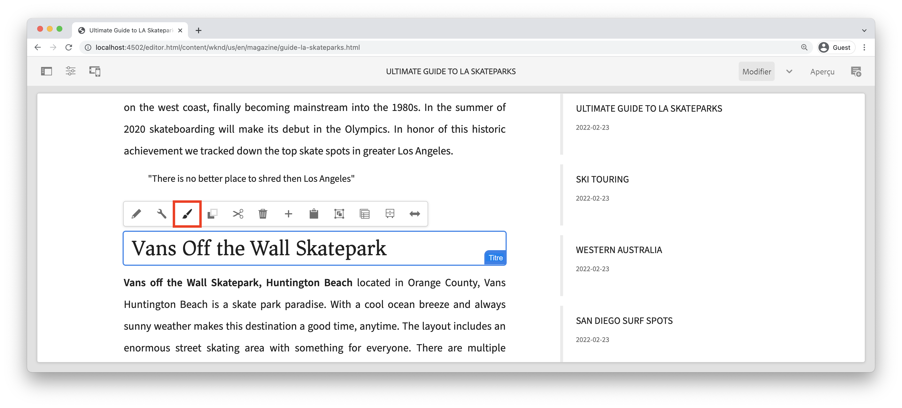

# Développement avec le système de style {#developing-with-the-style-system}

Découvrez comment mettre en oeuvre des styles individuels et réutiliser les composants principaux à l’aide du système de style du Experience Manager. Ce tutoriel décrit le développement pour le système de style afin d’étendre les composants principaux avec des CSS spécifiques à la marque et des configurations de stratégie avancées de l’éditeur de modèles.

## Prérequis {#prerequisites}

Examinez les outils et instructions requis pour configurer un [environnement de développement local](overview.md#local-dev-environment).

Il est également recommandé de consulter le tutoriel [Bibliothèques côté client et Processus front-end](client-side-libraries.md) pour comprendre les principes de base des bibliothèques côté client et les différents outils front-end intégrés au projet AEM.

### Projet de démarrage

>[!NOTE]
>
> Si vous avez terminé avec succès le chapitre précédent, vous pouvez réutiliser le projet et ignorer les étapes d’extraction du projet de démarrage.

Consultez le code de ligne de base sur lequel le tutoriel s’appuie :

1. Extrayez la branche `tutorial/style-system-start` à partir de [GitHub](https://github.com/adobe/aem-guides-wknd)

   ```shell
   $ cd aem-guides-wknd
   $ git checkout tutorial/style-system-start
   ```

1. Déployez la base de code sur une instance d’AEM locale à l’aide de vos compétences Maven :

   ```shell
   $ mvn clean install -PautoInstallSinglePackage
   ```

   >[!NOTE]
   >
   > Si vous utilisez AEM 6.5 ou 6.4, ajoutez le profil `classic` à toute commande Maven.

   ```shell
   $ mvn clean install -PautoInstallSinglePackage -Pclassic
   ```

Vous pouvez toujours afficher le code terminé sur [GitHub](https://github.com/adobe/aem-guides-wknd/tree/tutorial/style-system-solution) ou extraire le code localement en passant à la branche `tutorial/style-system-solution`.

## Objectif

1. Découvrez comment utiliser le système de style pour appliquer une page CSS spécifique à la marque à AEM les composants principaux.
1. Découvrez la notation BEM et comment elle peut être utilisée pour définir soigneusement les styles.
1. Appliquez des configurations de stratégie avancées à l’aide de modèles modifiables.

## Ce que vous allez créer {#what-you-will-build}

Dans ce chapitre, nous utiliserons la fonction [Système de style](https://experienceleague.adobe.com/docs/experience-manager-learn/sites/page-authoring/style-system-feature-video-use.html) pour créer des variantes des composants **Titre** et **Texte** utilisés sur la page Article.


*Style de soulignement disponible à utiliser pour le composant Titre*

## Arrière-plan {#background}

Le [système de style](https://experienceleague.adobe.com/docs/experience-manager-65/authoring/siteandpage/style-system.html) permet aux développeurs et aux éditeurs de modèle de créer plusieurs variantes visuelles d’un composant. Les auteurs peuvent ensuite décider quel style utiliser lors de la composition d’une page. Nous utiliserons le système de style tout le reste du tutoriel pour obtenir plusieurs styles uniques, tout en utilisant les composants principaux dans une approche à code faible.

L’idée générale du système de style est que les auteurs peuvent choisir différents styles de l’apparence d’un composant. Les &quot;styles&quot; sont pris en charge par des classes CSS supplémentaires qui sont injectées dans la balise div externe d’un composant. Dans les bibliothèques clientes, des règles CSS sont ajoutées en fonction de ces classes de style afin que le composant change d’aspect.

Vous trouverez [la documentation détaillée du système de style ici](https://experienceleague.adobe.com/docs/experience-manager-cloud-service/sites/authoring/features/style-system.html?lang=fr). Il existe également une excellente [vidéo technique pour comprendre le système de style](https://experienceleague.adobe.com/docs/experience-manager-learn/sites/developing/style-system-technical-video-understand.html).

## Style de soulignement - Titre {#underline-style}

Le [composant Titre](https://experienceleague.adobe.com/docs/experience-manager-core-components/using/components/title.html) a été ajouté par proxy au projet sous `/apps/wknd/components/title` dans le cadre du module **ui.apps**. Les styles par défaut des éléments d’en-tête (`H1`, `H2`, `H3`...) ont déjà été implémentés dans le module **ui.frontend**.

Les [conceptions de l’article WKND](assets/pages-templates/wknd-article-design.xd) contiennent un style unique pour le composant Titre avec un trait de soulignement. Au lieu de créer deux composants ou de modifier la boîte de dialogue du composant, le système de style peut être utilisé pour permettre aux auteurs d’ajouter un style de soulignement.


### Balisage du titre Inspect

En tant que développeur front-end, la première étape de la mise en forme d’un composant principal consiste à comprendre les balises générées par le composant.

1. Ouvrez un nouveau navigateur et affichez le composant Titre sur le site Bibliothèque de composants principaux d’AEM : [https://www.aemcomponents.dev/content/core-components-examples/library/page-authoring/title.html](https://www.aemcomponents.dev/content/core-components-examples/library/page-authoring/title.html)

1. Voici les balises du composant Titre :

   ```html
   <div class="cmp-title">
       <h1 class="cmp-title__text">Lorem Ipsum</h1>
   </div>
   ```

   La notation BEM du composant Titre :

   ```plain
   BLOCK cmp-title
       ELEMENT cmp-title__text
   ```

1. Le système Style ajoute une classe CSS à la balise div externe entourant le composant. Par conséquent, les balises que nous allons cibler ressembleront à ce qui suit :

   ```html
   <div class="STYLE-SYSTEM-CLASS-HERE"> <!-- Custom CSS class - implementation gets to define this -->
       <div class="cmp-title">
           <h1 class="cmp-title__text">Lorem Ipsum</h1>
       </div>
   </div>
   ```

### Mise en oeuvre du style souligné - ui.frontend

Implémentez ensuite le style Souligné à l’aide du module **ui.frontend** de notre projet. Nous utiliserons le serveur de développement webpack fourni avec le module **ui.frontend** pour prévisualiser les styles *avant* le déploiement sur une instance locale d’AEM.

1. Démarrez le serveur de développement webpack en exécutant la commande suivante à partir du module **ui.frontend** :

   ```shell
   $ cd ~/code/aem-guides-wknd/ui.frontend/
   $ npm start
   
   > aem-maven-archetype@1.0.0 start code/aem-guides-wknd/ui.frontend
   > webpack-dev-server --open --config ./webpack.dev.js
   ```

   Cela doit ouvrir un navigateur à l’adresse [http://localhost:8080](http://localhost:8080).

   >[!NOTE]
   >
   > Si les images apparaissent rompues, vérifiez que le projet de démarrage a été déployé sur une instance locale d’AEM (s’exécutant sur le port 4502) et que le navigateur utilisé a également été connecté à l’instance AEM locale.

   

1. Dans l’IDE, ouvrez le fichier `index.html` situé à l’adresse : `ui.frontend/src/main/webpack/static/index.html`. Il s’agit du balisage statique utilisé par le serveur de développement Webpack.
1. Dans `index.html`, recherchez une instance du composant Titre à laquelle ajouter le style souligné en recherchant *cmp-title* dans le document. Sélectionnez le composant Titre avec le texte *&quot;Vans off the Wall Skatepark&quot;* (ligne 218). Ajoutez la classe `cmp-title--underline` à la balise div environnante :

   ```diff
   - <div class="title aem-GridColumn--phone--12 aem-GridColumn aem-GridColumn--default--8">
   + <div class="cmp-title--underline title aem-GridColumn--phone--12 aem-GridColumn aem-GridColumn--default--8">
        <div data-cmp-data-layer="{&#34;title-8bea562fa0&#34;:{&#34;@type&#34;:&#34;wknd/components/title&#34;,&#34;repo:modifyDate&#34;:&#34;2021-01-22T18:54:20Z&#34;,&#34;dc:title&#34;:&#34;Vans Off the Wall&#34;}}" id="title-8bea562fa0" class="cmp-title">
            <h2 class="cmp-title__text">Vans Off the Wall</h2>
        </div>
    </div>
   ```

1. Revenez au navigateur et vérifiez que la classe supplémentaire est reflétée dans le balisage.
1. Revenez au module **ui.frontend** et mettez à jour le fichier `title.scss` situé à l’adresse : `ui.frontend/src/main/webpack/components/_title.scss` :

   ```css
   /* Add Title Underline Style */
   .cmp-title--underline {
       .cmp-title__text {
           &:after {
           display: block;
               width: 84px;
               padding-top: 8px;
               content: '';
               border-bottom: 2px solid $brand-primary;
           }
       }
   }
   ```

   >[!NOTE]
   >
   >Il est recommandé de toujours appliquer des styles de portée stricte au composant cible. Cela permet de s’assurer que les styles supplémentaires n’affectent pas d’autres zones de la page.
   >
   >Tous les composants principaux respectent la **[notation BEM](https://github.com/adobe/aem-core-wcm-components/wiki/css-coding-conventions)**. Il est recommandé de cibler la classe CSS externe lors de la création d’un style par défaut pour un composant. Une autre bonne pratique consiste à cibler les noms de classe spécifiés par la notation BEM des composants principaux plutôt que les éléments HTML.

1. Revenez à nouveau au navigateur et le style Souligné doit être ajouté :

   

1. Arrêtez le serveur de développement Webpack.

### Ajout d’une stratégie de titre

Nous devons ensuite ajouter une nouvelle stratégie pour les composants Titre afin que les auteurs de contenu puissent choisir le style Souligné à appliquer à des composants spécifiques. Pour ce faire, utilisez l’éditeur de modèles dans AEM.

1. Déployez la base de code sur une instance d’AEM locale à l’aide de vos compétences Maven :

   ```shell
   $ cd ~/code/aem-guides-wknd
   $ mvn clean install -PautoInstallSinglePackage
   ```

1. Accédez au modèle **Page d’article** situé à l’adresse : [http://localhost:4502/editor.html/conf/wknd/settings/wcm/templates/article-page/structure.html](http://localhost:4502/editor.html/conf/wknd/settings/wcm/templates/article-page/structure.html)

1. En mode **Structure**, dans le **Conteneur de mises en page** principal, sélectionnez l’icône **Stratégie** en regard du composant **Titre** répertorié sous *Composants autorisés* :

   

1. Créez une nouvelle stratégie pour le composant Titre avec les valeurs suivantes :

   *Titre de la stratégie ** :  **Titre WKND**

   *Propriétés*  > Onglet  *Styles*  >  *Ajouter un nouveau style*

   **Souligner**  :  `cmp-title--underline`

   

   Cliquez sur **Terminé** pour enregistrer les modifications apportées à la stratégie Titre.

   >[!NOTE]
   >
   > La valeur `cmp-title--underline` correspond à la classe CSS que nous avons ciblée précédemment lors du développement dans le module **ui.frontend**.

### Appliquer le style de soulignement

Enfin, en tant qu’auteur, nous pouvons choisir d’appliquer le style souligné à certains composants du titre.

1. Accédez à l’article **La Skateparks** dans l’éditeur AEM Sites à l’adresse : [http://localhost:4502/editor.html/content/wknd/us/en/magazine/guide-la-skateparks.html](http://localhost:4502/editor.html/content/wknd/us/en/magazine/guide-la-skateparks.html)
1. En mode **Édition**, choisissez un composant Titre. Cliquez sur l&#39;icône **pinceau** et sélectionnez le style **Souligné** :

   

   En tant qu’auteur, vous devriez pouvoir activer/désactiver le style.

1. Cliquez sur l’icône **Informations sur la page** > **Afficher comme publié** pour inspecter la page en dehors de l’éditeur d’AEM.

   

   Utilisez les outils de développement de votre navigateur pour vérifier que la classe CSS `cmp-title--underline` appliquée à la balise autour du composant Titre est appliquée à la balise div externe.

## Style de bloc de citations - Texte {#text-component}

Répétez ensuite les étapes similaires pour appliquer un style unique au [composant Texte](https://experienceleague.adobe.com/docs/experience-manager-core-components/using/components/text.html). Le composant Texte a été ajouté par proxy au projet sous `/apps/wknd/components/text` dans le cadre du module **ui.apps**. Les styles par défaut des éléments de paragraphe ont déjà été mis en oeuvre dans le **ui.frontend**.

Les [conceptions de l’article WKND](assets/pages-templates/wknd-article-design.xd) contiennent un style unique pour le composant Texte avec un bloc de guillemet :


### Balisage du composant de texte Inspect

Une fois de plus, nous examinerons le balisage du composant Texte.

1. Vérifiez les balises du composant Texte à l’adresse : [https://www.aemcomponents.dev/content/core-components-examples/library/page-authoring/text.html](https://www.aemcomponents.dev/content/core-components-examples/library/page-authoring/text.html)

1. Voici les balises du composant Texte :

   ```html
   <div class="text">
       <div class="cmp-text" data-cmp-data-layer="{&quot;text-2d9d50c5a7&quot;:{&quot;@type&quot;:&quot;core/wcm/components/text/v2/text&quot;,&quot;repo:modifyDate&quot;:&quot;2019-01-22T11:56:17Z&quot;,&quot;xdm:text&quot;:&quot;<p>Lorem ipsum dolor sit amet, consectetur adipiscing elit, sed do eiusmod tempor incididunt ut labore et dolore magna aliqua. Eu mi bibendum neque egestas congue quisque egestas. Varius morbi enim nunc faucibus a pellentesque. Scelerisque eleifend donec pretium vulputate sapien nec sagittis.</p>\n&quot;}}" id="text-2d9d50c5a7">
           <p>Lorem ipsum dolor sit amet, consectetur adipiscing elit, sed do eiusmod tempor incididunt ut labore et dolore magna aliqua. Eu mi bibendum neque egestas congue quisque egestas. Varius morbi enim nunc faucibus a pellentesque. Scelerisque eleifend donec pretium vulputate sapien nec sagittis.</p>
       </div>
   </div>
   ```

   La notation BEM du composant Texte :

   ```plain
   BLOCK cmp-text
       ELEMENT
   ```

1. Le système Style ajoute une classe CSS à la balise div externe entourant le composant. Par conséquent, les balises que nous allons cibler ressembleront à ce qui suit :

   ```html
   <div class="text STYLE-SYSTEM-CLASS-HERE"> <!-- Custom CSS class - implementation gets to define this -->
       <div class="cmp-text" data-cmp-data-layer="{&quot;text-2d9d50c5a7&quot;:{&quot;@type&quot;:&quot;core/wcm/components/text/v2/text&quot;,&quot;repo:modifyDate&quot;:&quot;2019-01-22T11:56:17Z&quot;,&quot;xdm:text&quot;:&quot;<p>Lorem ipsum dolor sit amet, consectetur adipiscing elit, sed do eiusmod tempor incididunt ut labore et dolore magna aliqua. Eu mi bibendum neque egestas congue quisque egestas. Varius morbi enim nunc faucibus a pellentesque. Scelerisque eleifend donec pretium vulputate sapien nec sagittis.</p>\n&quot;}}" id="text-2d9d50c5a7">
           <p>Lorem ipsum dolor sit amet, consectetur adipiscing elit, sed do eiusmod tempor incididunt ut labore et dolore magna aliqua. Eu mi bibendum neque egestas congue quisque egestas. Varius morbi enim nunc faucibus a pellentesque. Scelerisque eleifend donec pretium vulputate sapien nec sagittis.</p>
       </div>
   </div>
   ```

### Implémentation du style de bloc de citations - ui.frontend

Nous allons ensuite implémenter le style de bloc de citations à l’aide du module **ui.frontend** de notre projet.

1. Démarrez le serveur de développement webpack en exécutant la commande suivante à partir du module **ui.frontend** :

   ```shell
   $ cd ~/code/aem-guides-wknd/ui.frontend/
   $ npm start
   ```

1. Dans l’IDE, ouvrez le fichier `index.html` situé à l’adresse : `ui.frontend/src/main/webpack/static/index.html`.
1. Dans `index.html`, recherchez une instance du composant Texte en recherchant le texte *&quot;Jacob Wester&quot;* (ligne 210). Ajoutez la classe `cmp-text--quote` à la balise div environnante :

   ```diff
   - <div class="text aem-GridColumn--phone--12 aem-GridColumn aem-GridColumn--default--8">
   + <div class="cmp-text--quote text aem-GridColumn--phone--12 aem-GridColumn aem-GridColumn--default--8">
        <div data-cmp-data-layer="{&#34;text-a15f39a83a&#34;:{&#34;@type&#34;:&#34;wknd/components/text&#34;,&#34;repo:modifyDate&#34;:&#34;2021-01-22T00:23:27Z&#34;,&#34;xdm:text&#34;:&#34;&lt;blockquote>&amp;quot;There is no better place to shred then Los Angeles.”&lt;/blockquote>\r\n&lt;p>- Jacob Wester, Pro Skater&lt;/p>\r\n&#34;}}" id="text-a15f39a83a" class="cmp-text">
            <blockquote>&quot;There is no better place to shred then Los Angeles.”</blockquote>
            <p>- Jacob Wester, Pro Skater</p>
        </div>
    </div>
   ```

1. Mettez à jour le fichier `text.scss` situé à l’adresse : `ui.frontend/src/main/webpack/components/_text.scss` :

   ```css
   /* WKND Text Quote style */
   .cmp-text--quote {
       .cmp-text {
           background-color: $brand-third;
           margin: 1em 0em;
           padding: 1em;
   
           blockquote {
               border: none;
               font-size: $font-size-large;
               font-family: $font-family-serif;
               padding: 14px 14px;
               margin: 0;
               margin-bottom: 0.5em;
   
               &:after {
                   border-bottom: 2px solid $brand-primary; /*yellow border */
                   content: '';
                   display: block;
                   position: relative;
                   top: 0.25em;
                   width: 80px;
               }
           }
           p {
               font-family:  $font-family-serif;
           }
       }
   }
   ```

   >[!CAUTION]
   >
   > Dans ce cas, les éléments HTML bruts sont ciblés par les styles. En effet, le composant Texte fournit un éditeur de texte enrichi pour les auteurs de contenu. La création de styles directement par rapport au contenu de l’éditeur de texte enrichi doit être effectuée avec soin et il est encore plus important d’étendre étroitement les styles.

1. Revenez à nouveau au navigateur et le style de bloc Devis est ajouté :

   

1. Arrêtez le serveur de développement Webpack.

### Ajout d’une stratégie de texte

Ajoutez ensuite une nouvelle stratégie pour les composants Texte .

1. Déployez la base de code sur une instance d’AEM locale à l’aide de vos compétences Maven :

   ```shell
   $ cd ~/code/aem-guides-wknd
   $ mvn clean install -PautoInstallSinglePackage
   ```

1. Accédez au **Modèle de page d’article** situé à l’adresse : [http://localhost:4502/editor.html/conf/wknd/settings/wcm/templates/article-page/structure.html](http://localhost:4502/editor.html/conf/wknd/settings/wcm/templates/article-page/structure.html)).

1. En mode **Structure**, dans le **Conteneur de mises en page** principal, sélectionnez l’icône **Stratégie** en regard du composant **Texte** répertorié sous *Composants autorisés* :

   

1. Mettez à jour la stratégie de composant Texte avec les valeurs suivantes :

   *Titre de la stratégie ** :  **Texte du contenu**

   *Plugins*  > Styles de  *paragraphe*  >  *Activer les styles de paragraphe*

   *Onglet Styles*  >  *Ajouter un nouveau style*

   **Bloc de citations**  :  `cmp-text--quote`

   

   

   Cliquez sur **Terminé** pour enregistrer les modifications apportées à la stratégie Texte.

### Application du style de bloc de citations

1. Accédez à l’article **La Skateparks** dans l’éditeur AEM Sites à l’adresse : [http://localhost:4502/editor.html/content/wknd/us/en/magazine/guide-la-skateparks.html](http://localhost:4502/editor.html/content/wknd/us/en/magazine/guide-la-skateparks.html)
1. En mode **Modifier**, choisissez un composant Texte. Modifiez le composant pour inclure un élément de guillemet :

   

1. Sélectionnez le composant de texte, cliquez sur l’icône **pinceau** et sélectionnez le style **Bloc de citations** :

   

   En tant qu’auteur, vous devriez pouvoir activer/désactiver le style.

## Largeur fixe - Conteneur (bonus) {#layout-container}

Les composants de conteneur ont été utilisés pour créer la structure de base du modèle de page d’article et fournir les zones de dépôt permettant aux auteurs de contenu d’ajouter du contenu sur une page. Les conteneurs peuvent également tirer parti du système de style, offrant ainsi aux auteurs de contenu davantage d’options pour concevoir des mises en page.

Le **Conteneur principal** du modèle Page de l’article contient les deux conteneurs pouvant être créés et a une largeur fixe.


*Conteneur principal dans le modèle de page de l’article*.

La stratégie du **Conteneur principal** définit l’élément par défaut comme `main` :


Le CSS qui définit le **conteneur principal** est défini dans le module **ui.frontend** à `ui.frontend/src/main/webpack/site/styles/container_main.scss` :

```SCSS
main.container {
    padding: .5em 1em;
    max-width: $max-content-width;
    float: unset!important;
    margin: 0 auto!important;
    clear: both!important;
}
```

Au lieu de cibler l’élément HTML `main`, le système de style peut être utilisé pour créer un style **Largeur fixe** dans le cadre de la stratégie de conteneur. Le système de style permet aux utilisateurs de basculer entre les conteneurs **Largeur fixe** et **Largeur fluide**.

1. **Défi bonus**  : utilisez les leçons tirées des exercices précédents et utilisez le système de style pour mettre en oeuvre un  **style de largeur** fluide  **à** largeur fixe pour le composant Conteneur.

## Félicitations ! {#congratulations}

Félicitations, la page de l&#39;article est presque entièrement stylisée et vous avez acquis une expérience pratique en utilisant le système de style AEM.

### Étapes suivantes {#next-steps}

Découvrez les étapes de bout en bout pour créer un [composant d’AEM personnalisé](custom-component.md) qui affiche le contenu créé dans une boîte de dialogue et explore le développement d’un modèle Sling pour encapsuler la logique commerciale qui renseigne le code HTL du composant.

Affichez le code terminé sur [GitHub](https://github.com/adobe/aem-guides-wknd) ou passez en revue le code et déployez-le localement sur la branche Git `tutorial/style-system-solution`.

1. Cloner le référentiel [github.com/adobe/aem-wknd-guides](https://github.com/adobe/aem-guides-wknd).
1. Consultez la branche `tutorial/style-system-solution` .
