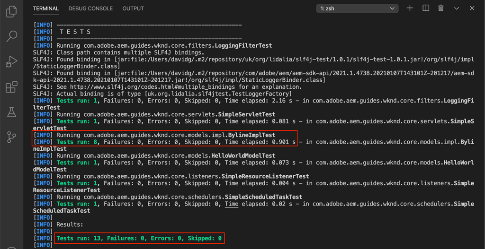

# Test unitaire {#unit-testing}

Ce tutoriel couvre l’implémentation d’un test unitaire qui valide le comportement du modèle Sling du composant Byline, créé dans la variable [Composant personnalisé](./custom-component.md) tutoriel .

## Prérequis {#prerequisites}

Examinez les outils et les instructions requis pour configurer une [environnement de développement local](overview.md#local-dev-environment).

_Si Java™ 8 et Java™ 11 sont installés sur le système, le programme d’exécution du test VS Code peut sélectionner le runtime Java™ inférieur lors de l’exécution des tests, ce qui entraîne des échecs de test. Si cela se produit, désinstallez Java™ 8._

### Projet de démarrage

>[!NOTE]
>
> Si vous avez terminé avec succès le chapitre précédent, vous pouvez réutiliser le projet et ignorer les étapes d’extraction du projet de démarrage.

Consultez le code de ligne de base sur lequel le tutoriel s’appuie :

1. Consultez la section `tutorial/unit-testing-start` branche à partir de [GitHub](https://github.com/adobe/aem-guides-wknd)

   ```shell
   $ cd aem-guides-wknd
   $ git checkout tutorial/unit-testing-start
   ```

1. Déployez la base de code sur une instance d’AEM locale à l’aide de vos compétences Maven :

   ```shell
   $ mvn clean install -PautoInstallSinglePackage
   ```

   >[!NOTE]
   >
   > Si vous utilisez AEM version 6.5 ou 6.4, ajoutez la variable `classic` profile à n’importe quelle commande Maven.

   ```shell
   $ mvn clean install -PautoInstallSinglePackage -Pclassic
   ```

Vous pouvez toujours afficher le code terminé sur [GitHub](https://github.com/adobe/aem-guides-wknd/tree/tutorial/unit-testing-start) ou extraire le code localement en passant à la branche `tutorial/unit-testing-start`.

## Objectif

1. Comprendre les principes de base des tests unitaires.
1. Découvrez les structures et les outils couramment utilisés pour tester AEM code.
1. Découvrez les options permettant de simuler ou de simuler des ressources AEM lors de l’écriture de tests unitaires.

## Contexte {#unit-testing-background}

Dans ce tutoriel, nous allons découvrir comment écrire. [Tests unitaires](https://en.wikipedia.org/wiki/Unit_testing) pour notre composant Byline [Modèle Sling](https://sling.apache.org/documentation/bundles/models.html) (créé dans le [Création d’un composant d’AEM personnalisé](custom-component.md)). Les tests unitaires sont des tests de génération écrits en Java™ qui vérifient le comportement attendu du code Java™. Chaque test unitaire est généralement petit et valide la sortie d’une méthode (ou d’une unité de travail) par rapport aux résultats attendus.

Nous utilisons AEM bonnes pratiques et employons les éléments suivants :

* [JUnit 5](https://junit.org/junit5/)
* [Structure de test Mockito](https://site.mockito.org/)
* [wcm.io Test Framework](https://wcm.io/testing/) (qui s’appuie sur [Masques Apache Sling](https://sling.apache.org/documentation/development/sling-mock.html))

## Test unitaire et Adobe de Cloud Manager {#unit-testing-and-adobe-cloud-manager}

[Adobe Cloud Manager](https://experienceleague.adobe.com/docs/experience-manager-cloud-manager/content/introduction.html?lang=fr) intègre l’exécution de test unitaire et [rapport de couverture du code](https://experienceleague.adobe.com/docs/experience-manager-cloud-manager/content/using/code-quality-testing.html) dans son pipeline CI/CD afin d’encourager et de promouvoir les bonnes pratiques en matière de AEM de test d’unité.

Bien que le code de test unitaire soit une bonne pratique pour n’importe quelle base de code, il est important, lors de l’utilisation de Cloud Manager, de tirer parti de ses fonctionnalités de test de qualité du code et de création de rapports en fournissant des tests unitaires pour que Cloud Manager s’exécute.

## Mise à jour des dépendances Maven de test {#inspect-the-test-maven-dependencies}

La première étape consiste à examiner les dépendances Maven pour prendre en charge l’écriture et l’exécution des tests. Quatre dépendances sont requises :

1. JUnit5
1. Structure de test Mockito
1. Masques Apache Sling
1. AEM Mocks Test Framework (par io.wcm)

Le **JUnit5**, **Mockito et **AEM de maquettes** les dépendances de test sont automatiquement ajoutées au projet lors de la configuration à l’aide de la fonction [AEM archétype Maven](project-setup.md).

1. Pour afficher ces dépendances, ouvrez le fichier POM du réacteur parent à l’adresse **aem-guides-wknd/pom.xml**, accédez au `<dependencies>..</dependencies>` et afficher les dépendances pour JUnit, Mockito, Apache Sling Mocks et AEM Mock Tests par io.wcm sous `<!-- Testing -->`.
1. Assurez-vous que `io.wcm.testing.aem-mock.junit5` est défini sur **4.1.0**:

   ```xml
   <dependency>
       <groupId>io.wcm</groupId>
       <artifactId>io.wcm.testing.aem-mock.junit5</artifactId>
       <version>4.1.0</version>
       <scope>test</scope>
   </dependency>
   ```

   >[!CAUTION]
   >
   > Archetype **35** génère le projet avec `io.wcm.testing.aem-mock.junit5` version **4.1.8**. Veuillez rétrograder vers **4.1.0** pour suivre le reste de ce chapitre.

1. Ouvrir **aem-guides-wknd/core/pom.xml** et vérifiez que les dépendances de test correspondantes sont disponibles.

   Un dossier source parallèle dans le **core** Le projet contiendra les tests unitaires et tous les fichiers de test annexes. Ceci **test** fournit une séparation des classes de test du code source, mais permet aux tests d’agir comme s’ils vivaient dans les mêmes modules que le code source.

## Création du test JUnit {#creating-the-junit-test}

Les tests unitaires mappent généralement 1 à 1 avec les classes Java™. Dans ce chapitre, nous allons écrire un test JUnit pour le **BylineImpl.java**, qui est le modèle Sling qui prend en charge le composant Byline.


*Emplacement de stockage des tests unitaires.*

1. Créez un test unitaire pour le `BylineImpl.java` en effectuant une nouvelle classe Java™ sous `src/test/java` dans une structure de dossiers de package Java™ qui reflète l’emplacement de la classe Java™ à tester.

   

   Puisque nous effectuons les tests

   * `src/main/java/com/adobe/aem/guides/wknd/core/models/impl/BylineImpl.java`

   créez une classe Java™ de test unitaire correspondante à l’adresse

   * `src/test/java/com/adobe/aem/guides/wknd/core/models/impl/BylineImplTest.java`

   Le `Test` suffixe sur le fichier de test unitaire, `BylineImplTest.java` est une convention, qui nous permet de

   1. Identifiez-le facilement en tant que fichier de test. _pour_ `BylineImpl.java`
   1. Mais aussi, différenciez le fichier de test. _de_ la classe en cours de test, `BylineImpl.java`


## Vérification de BylineImplTest.java {#reviewing-bylineimpltest-java}

À ce stade, le fichier de test JUnit est une classe Java™ vide.

1. Mettez à jour le fichier avec le code suivant :

   ```java
   package com.adobe.aem.guides.wknd.core.models.impl;
   
   import static org.junit.jupiter.api.Assertions.*;
   
   import org.junit.jupiter.api.BeforeEach;
   import org.junit.jupiter.api.Test;
   
   public class BylineImplTest {
   
       @BeforeEach
       void setUp() throws Exception {
   
       }
   
       @Test 
       void testGetName() { 
           fail("Not yet implemented");
       }
   
       @Test 
       void testGetOccupations() { 
           fail("Not yet implemented");
       }
   
       @Test 
       void testIsEmpty() { 
           fail("Not yet implemented");
       }
   }
   ```

1. Première méthode `public void setUp() { .. }` est annoté avec JUnit&#39;s `@BeforeEach`, qui indique à l’exécuteur de test JUnit d’exécuter cette méthode avant d’exécuter chaque méthode de test de cette classe. Vous bénéficiez ainsi d’un emplacement pratique pour initialiser l’état de test commun requis par tous les tests.

1. Les méthodes suivantes sont les méthodes de test dont les noms comportent le préfixe `test` par convention et marqué par la variable `@Test` annotation. Notez que par défaut, tous nos tests sont définis comme échoués, car nous ne les avons pas encore mis en oeuvre.

   Pour commencer, nous commençons par une méthode de test unique pour chaque méthode publique sur la classe que nous testons, de sorte que :

   | BylineImpl.java |  | BylineImplTest.java |
   | ------------------|--------------|---------------------|
   | getName() | est testé par | testGetName() |
   | getOccupations() | est testé par | testGetOccupations() |
   | isEmpty() | est testé par | testIsEmpty() |

   Ces méthodes peuvent être développées au besoin, comme nous le verrons plus loin dans ce chapitre.

   Lorsque cette classe de test JUnit (également appelée Cas de test JUnit) est exécutée, chaque méthode est marquée par la variable `@Test` s’exécute en tant que test pouvant réussir ou échouer.


*`core/src/test/java/com/adobe/aem/guides/wknd/core/models/impl/BylineImplTest.java`*

1. Exécutez le cas de test JUnit en cliquant avec le bouton droit sur la page `BylineImplTest.java` et en appuyant sur **Exécuter**.
Comme prévu, tous les tests échouent, car ils n’ont pas encore été mis en oeuvre.

   

   *Clic droit sur BylineImplTests.java > Exécuter*

## Vérification de BylineImpl.java {#reviewing-bylineimpl-java}

Lors de la rédaction de tests unitaires, deux approches Principales sont possibles :

* [TDD ou développement piloté par les tests](https://en.wikipedia.org/wiki/Test-driven_development), ce qui implique la rédaction progressive des tests unitaires, immédiatement avant le développement de la mise en oeuvre ; écrivez un test, écrivez l’implémentation pour que le test réussisse.
* Développement d’abord de la mise en oeuvre, qui implique d’abord le développement du code de travail, puis l’écriture de tests qui valident ce code.

Dans ce tutoriel, la dernière approche est utilisée (car nous avons déjà créé une **BylineImpl.java** dans un chapitre précédent). C&#39;est pourquoi nous devons examiner et comprendre le comportement de ses méthodes publiques, mais aussi certains détails de sa mise en oeuvre. Cela peut sembler contraire, car un bon test ne devrait se préoccuper que des intrants et des extrants. Toutefois, lorsque vous travaillez dans AEM, il existe diverses considérations de mise en oeuvre qui doivent être comprises pour construire des tests de travail.

Dans le contexte d’AEM, le TDD nécessite un niveau d’expertise et est mieux adopté par AEM développeurs maîtrisant le développement d’AEM et les tests unitaires du code d’.

## Configuration AEM contexte de test  {#setting-up-aem-test-context}

La plupart du code écrit pour les AEM repose sur les API JCR, Sling ou AEM, qui, à leur tour, nécessitent que le contexte d’une  en cours d’exécution s’exécute correctement.

Comme les tests unitaires sont exécutés lors de la génération, en dehors du contexte d’une instance AEM en cours d’exécution, il n’existe aucun contexte de ce type. Pour faciliter cette opération, [Mocks d&#39;AEM de wcm.io](https://wcm.io/testing/aem-mock/usage.html) crée un contexte fictif qui permet à ces API de _principalement_ agir comme s&#39;ils couraient dans AEM.

1. Création d’un contexte d’AEM à l’aide de **wcm.io&#39;s** `AemContext` in **BylineImplTest.java** en l’ajoutant en tant qu’extension JUnit décorée avec `@ExtendWith` au **BylineImplTest.java** fichier . L’extension s’occupe de toutes les tâches d’initialisation et de nettoyage requises. Création d’une variable de classe pour `AemContext` qui peut être utilisé pour toutes les méthodes de test.

   ```java
   import org.junit.jupiter.api.extension.ExtendWith;
   import io.wcm.testing.mock.aem.junit5.AemContext;
   import io.wcm.testing.mock.aem.junit5.AemContextExtension;
   ...
   
   @ExtendWith(AemContextExtension.class)
   class BylineImplTest {
   
       private final AemContext ctx = new AemContext();
   ```

   Cette variable, `ctx`, expose un contexte AEM fictif qui fournit des AEM et des abstractions Sling :

   * Le modèle Sling BylineImpl est enregistré dans ce contexte.
   * Les structures de contenu JCR de bloc sont créées dans ce contexte.
   * Les services OSGi personnalisés peuvent être enregistrés dans ce contexte.
   * Fournit divers objets de simulation et aides courants requis, tels que les objets SlingHttpServletRequest, divers services OSGi mock Sling et AEM tels que ModelFactory, PageManager, Page, Modèle, ComponentManager, Component, TagManager, TagManager, etc.
      * *Toutes les méthodes de ces objets ne sont pas implémentées !*
   * Et [beaucoup plus](https://wcm.io/testing/aem-mock/usage.html)!

   Le **`ctx`** agit comme point d’entrée pour la plupart de notre faux contexte.

1. Dans le `setUp(..)` , qui est exécutée avant chaque `@Test` , définissez un état de test simulé courant :

   ```java
   @BeforeEach
   public void setUp() throws Exception {
       ctx.addModelsForClasses(BylineImpl.class);
       ctx.load().json("/com/adobe/aem/guides/wknd/core/models/impl/BylineImplTest.json", "/content");
   }
   ```

   * **`addModelsForClasses`** enregistre le modèle Sling à tester, dans le contexte d’AEM simulé, afin qu’il puisse être instancié dans la variable `@Test` méthodes.
   * **`load().json`** charge les structures de ressources dans le contexte fictif, ce qui permet au code d’interagir avec ces ressources comme si elles étaient fournies par un référentiel réel. Définitions des ressources dans le fichier **`BylineImplTest.json`** sont chargés dans le contexte JCR fictif sous **/content**.
   * **`BylineImplTest.json`** n’existe pas encore, existent donc créons-le et définissez les structures de ressources JCR nécessaires au test.

1. Les fichiers JSON représentant les structures de ressources fictives sont stockés sous **core/src/test/resources** suivant le même cheminement de package que le fichier de test JUnit Java™.

   Créez un fichier JSON à l’adresse `core/test/resources/com/adobe/aem/guides/wknd/core/models/impl` named **BylineImplTest.json** avec le contenu suivant :

   ```json
   {
       "byline": {
       "jcr:primaryType": "nt:unstructured",
       "sling:resourceType": "wknd/components/content/byline"
       }
   }
   ```

   

   Ce fichier JSON définit une ressource de simulation (noeud JCR) pour le test unitaire du composant signature. À ce stade, le fichier JSON dispose de l’ensemble minimum de propriétés requises pour représenter une ressource de contenu de composant Byline, la propriété `jcr:primaryType` et `sling:resourceType`.

   Lors de l’utilisation de tests unitaires, une règle générale consiste à créer l’ensemble minimal de contenus fictifs, de contexte et de code requis pour satisfaire chaque test. Évitez la tentation de créer un contexte fictif complet avant d’écrire les tests, car cela génère souvent des artefacts inutiles.

   Maintenant avec l&#39;existence de **BylineImplTest.json**, lorsque `ctx.json("/com/adobe/aem/guides/wknd/core/models/impl/BylineImplTest.json", "/content")` est exécuté, les définitions de ressources fictives sont chargées dans le contexte au niveau du chemin d’accès. **/content.**

## Test de getName() {#testing-get-name}

Maintenant que nous avons une configuration de contexte fictive de base, écrivons notre premier test pour **BylineImpl&#39;s getName()**. Ce test doit s’assurer que la méthode **getName()** renvoie le nom créé correct stocké au niveau du &quot;**name&quot;** .

1. Mettez à jour le **testGetName**() dans **BylineImplTest.java** comme suit :

   ```java
   import com.adobe.aem.guides.wknd.core.models.Byline;
   ...
   @Test
   public void testGetName() {
       final String expected = "Jane Doe";
   
       ctx.currentResource("/content/byline");
       Byline byline = ctx.request().adaptTo(Byline.class);
   
       String actual = byline.getName();
   
       assertEquals(expected, actual);
   }
   ```

   * **`String expected`** définit la valeur attendue. Nous définirons cela sur &quot;**Jane Done**&quot;.
   * **`ctx.currentResource`** définit le contexte de la ressource de simulation pour évaluer le code ; cette option est donc définie sur **/content/byline** car c’est là que la ressource de contenu &quot;simulé par ligne&quot; est chargée.
   * **`Byline byline`** instancie le modèle Sling de signature en l’adaptant à partir de l’objet de demande simulée.
   * **`String actual`** appelle la méthode que nous testons, `getName()`, sur l’objet de modèle Sling signature.
   * **`assertEquals`** affirme que la valeur attendue correspond à la valeur renvoyée par l’objet de modèle Sling de signature. Si ces valeurs ne sont pas égales, le test échoue.

1. Exécutez le test... et il échoue avec un `NullPointerException`.

   Ce test N’échoue PAS, car nous n’avons jamais défini une `name` dans le fichier JSON de simulation, qui provoquera l’échec du test, mais l’exécution du test n’a pas atteint ce point ! Ce test échoue en raison d’un événement `NullPointerException` sur l’objet signature lui-même.

1. Dans le `BylineImpl.java`, si `@PostConstruct init()` renvoie une exception qui empêche le modèle Sling d’instancier et entraîne la valeur nulle de cet objet de modèle Sling.

   ```java
   @PostConstruct
   private void init() {
       image = modelFactory.getModelFromWrappedRequest(request, request.getResource(), Image.class);
   }
   ```

   Il s’avère que, tandis que le service ModelFactory OSGi est fourni via la variable `AemContext` (au moyen du contexte Apache Sling), toutes les méthodes ne sont pas implémentées, y compris `getModelFromWrappedRequest(...)` qui est appelé dans le fichier BylineImpl `init()` . Cela se traduit par une [AbstractMethodError](https://docs.oracle.com/en/java/javase/11/docs/api/java.base/java/lang/AbstractMethodError.html), les causes à terme `init()` échouer et l’adaptation qui en résulte de la variable `ctx.request().adaptTo(Byline.class)` est un objet nul.

   Comme les maquettes fournies ne peuvent pas prendre en charge notre code, nous devons mettre en oeuvre le contexte de simulation nous-mêmes Pour cela, nous pouvons utiliser Mockito pour créer un objet ModelFactory de simulation, qui renvoie un objet Image de simulation lorsque `getModelFromWrappedRequest(...)` est appelée dessus.

   Puisque, afin d’instancier le modèle Sling de signature, ce contexte fictif doit être en place, nous pouvons l’ajouter au `@Before setUp()` . Nous devons également ajouter la variable `MockitoExtension.class` au `@ExtendWith` annotation au-dessus de **BylineImplTest** classe .

   ```java
   package com.adobe.aem.guides.wknd.core.models.impl;
   
   import org.mockito.junit.jupiter.MockitoExtension;
   import org.mockito.Mock;
   
   import com.adobe.aem.guides.wknd.core.models.Byline;
   import com.adobe.cq.wcm.core.components.models.Image;
   
   import io.wcm.testing.mock.aem.junit5.AemContext;
   import io.wcm.testing.mock.aem.junit5.AemContextExtension;
   
   import org.apache.sling.models.factory.ModelFactory;
   import org.junit.jupiter.api.BeforeEach;
   import org.junit.jupiter.api.Test;
   import org.junit.jupiter.api.extension.ExtendWith;
   
   import static org.junit.jupiter.api.Assertions.*;
   import static org.mockito.Mockito.*;
   import org.apache.sling.api.resource.Resource;
   
   @ExtendWith({ AemContextExtension.class, MockitoExtension.class })
   public class BylineImplTest {
   
       private final AemContext ctx = new AemContext();
   
       @Mock
       private Image image;
   
       @Mock
       private ModelFactory modelFactory;
   
       @BeforeEach
       public void setUp() throws Exception {
           ctx.addModelsForClasses(BylineImpl.class);
   
           ctx.load().json("/com/adobe/aem/guides/wknd/core/models/impl/BylineImplTest.json", "/content");
   
           lenient().when(modelFactory.getModelFromWrappedRequest(eq(ctx.request()), any(Resource.class), eq(Image.class)))
                   .thenReturn(image);
   
           ctx.registerService(ModelFactory.class, modelFactory, org.osgi.framework.Constants.SERVICE_RANKING,
                   Integer.MAX_VALUE);
       }
   
       @Test
       void testGetName() { ...
   }
   ```

   * **`@ExtendWith({AemContextExtension.class, MockitoExtension.class})`** marque la classe de cas de test à exécuter avec le [Extension Mockito JUnit Jupiter](https://www.javadoc.io/static/org.mockito/mockito-junit-jupiter/4.11.0/org/mockito/junit/jupiter/MockitoExtension.html) qui permet l’utilisation des annotations @Mock pour définir des objets fictifs au niveau de la classe.
   * **`@Mock private Image`** crée un objet fictif de type `com.adobe.cq.wcm.core.components.models.Image`. Elle est définie au niveau de la classe de sorte que, si nécessaire, `@Test` peut modifier son comportement si nécessaire.
   * **`@Mock private ModelFactory`** crée un objet de simulation de type ModelFactory. Il s&#39;agit d&#39;une pure imposture de Mockito et ne comporte aucune méthode mise en oeuvre. Elle est définie au niveau de la classe de sorte que, si nécessaire, `@Test`peut modifier son comportement si nécessaire.
   * **`when(modelFactory.getModelFromWrappedRequest(..)`** enregistre le comportement fictif pour lorsque `getModelFromWrappedRequest(..)` est appelé sur l’objet mock ModelFactory . Le résultat défini dans `thenReturn (..)` est pour renvoyer l’objet image de simulation. Ce comportement n’est appelé que lorsque : le premier paramètre est égal à `ctx`Objet de requête de , le deuxième paramètre est n’importe quel objet de ressource et le troisième paramètre doit être la classe d’image Composants principaux. Nous acceptons n’importe quelle ressource car, tout au long de nos tests, nous définissons la variable `ctx.currentResource(...)` aux différentes ressources de simulation définies dans la variable **BylineImplTest.json**. Notez que nous ajoutons la variable **lenient()** est la plus stricte, car nous voulons par la suite remplacer ce comportement de ModelFactory.
   * **`ctx.registerService(..)`.** enregistre l’objet mock ModelFactory dans AemContext, avec le rang de service le plus élevé. Cela est requis, car ModelFactory utilisé dans la variable `init()` est injecté via la méthode `@OSGiService ModelFactory model` champ . Pour qu’AemContext s’injecte **our** objet mock, qui gère les appels à `getModelFromWrappedRequest(..)`, nous devons l’enregistrer en tant que service de rang le plus élevé de ce type (ModelFactory).

1. Réexécutez le test, puis une fois de plus, il échoue, mais cette fois le message est clair sur les raisons de son échec.

   

   *échec de testGetName() en raison de l’assertion*

   Nous recevons un **AssertionError** ce qui signifie que la condition d’insertion dans le test a échoué, et elle nous indique la valeur **la valeur attendue est &quot;Jane Doe&quot;** mais le **la valeur réelle est nulle**. Cela est logique, car le &quot;**name&quot;** n’a pas été ajoutée à mock **/content/byline** définition de ressource dans **BylineImplTest.json**, alors ajoutons-le :

1. Mettre à jour **BylineImplTest.json** définir `"name": "Jane Doe".`

   ```json
   {
       "byline": {
       "jcr:primaryType": "nt:unstructured",
       "sling:resourceType": "wknd/components/content/byline",
       "name": "Jane Doe"
       }
   }
   ```

1. Réexécutez le test, et **`testGetName()`** maintenant passe !

   


## Test de getOccupations() {#testing-get-occupations}

Super ! Le premier test a réussi ! Passons à l&#39;épreuve. `getOccupations()`. Depuis l’initialisation du contexte fictif dans la variable `@Before setUp()`, elle est disponible pour tous les `@Test` méthodes de ce cas de test, notamment `getOccupations()`.

Souvenez-vous que cette méthode doit renvoyer une liste triée alphabétiquement des occupations (décroissantes) stockées dans la propriété occupations.

1. Mettre à jour **`testGetOccupations()`** comme suit :

   ```java
   import java.util.List;
   import com.google.common.collect.ImmutableList;
   ...
   @Test
   public void testGetOccupations() {
       List<String> expected = new ImmutableList.Builder<String>()
                               .add("Blogger")
                               .add("Photographer")
                               .add("YouTuber")
                               .build();
   
       ctx.currentResource("/content/byline");
       Byline byline = ctx.request().adaptTo(Byline.class);
   
       List<String> actual = byline.getOccupations();
   
       assertEquals(expected, actual);
   }
   ```

   * **`List<String> expected`** définissez le résultat attendu.
   * **`ctx.currentResource`** définit la ressource actuelle pour évaluer le contexte par rapport à la définition de la ressource fictive à l’emplacement /content/byline. Ainsi, la variable **BylineImpl.java** s’exécute dans le contexte de notre fausse ressource.
   * **`ctx.request().adaptTo(Byline.class)`** instancie le modèle Sling de signature en l’adaptant à partir de l’objet de demande simulée.
   * **`byline.getOccupations()`** appelle la méthode que nous testons, `getOccupations()`, sur l’objet de modèle Sling signature.
   * **`assertEquals(expected, actual)`** affirme que la liste attendue est la même que la liste réelle.

1. Souvenez-vous, comme **`getName()`** ci-dessus, la variable **BylineImplTest.json** ne définit pas de métiers, donc ce test échouera si nous le faisons, puisque `byline.getOccupations()` renverra une liste vide.

   Mettre à jour **BylineImplTest.json** inclure une liste des groupes professionnels, et ils sont définis dans l&#39;ordre non alphabétique afin de s&#39;assurer que nos tests valident que les groupes sont triés par ordre alphabétique selon les **`getOccupations()`**.

   ```json
   {
       "byline": {
       "jcr:primaryType": "nt:unstructured",
       "sling:resourceType": "wknd/components/content/byline",
       "name": "Jane Doe",
       "occupations": ["Photographer", "Blogger", "YouTuber"]
       }
   }
   ```

1. Effectuez le test, et encore une fois nous réussissons ! On dirait que les métiers triés fonctionnent !

   

   *testGetOccupations() passe*

## Test de isEmpty() {#testing-is-empty}

Dernière méthode à tester **`isEmpty()`**.

Tests `isEmpty()` est intéressant, car il nécessite des tests pour différentes conditions. Vérification **BylineImpl.java**&#39;s `isEmpty()` Les conditions suivantes doivent être testées :

* Renvoie &quot;true&quot; lorsque le nom est vide
* Renvoie &quot;true&quot; lorsque les occupations sont nulles ou vides
* Renvoie &quot;true&quot; lorsque l’image est nulle ou n’a pas d’URL src
* Renvoie false lorsque le nom, les emplois et l’image (avec une URL src) sont présents

Pour ce faire, nous devons créer des méthodes de test, chacune testant une condition spécifique et de nouvelles structures de ressources fictives dans `BylineImplTest.json` pour effectuer ces tests.

Cette vérification nous a permis d’ignorer le test de quand `getName()`, `getOccupations()` et `getImage()` sont vides, car le comportement attendu de cet état est testé via `isEmpty()`.

1. Le premier test teste la condition d’un nouveau composant, qui ne comporte aucune propriété définie.

   Ajouter une nouvelle définition de ressource à `BylineImplTest.json`, lui donnant le nom sémantique &quot;**empty**&quot;

   ```json
   {
       "byline": {
           "jcr:primaryType": "nt:unstructured",
           "sling:resourceType": "wknd/components/content/byline",
           "name": "Jane Doe",
           "occupations": ["Photographer", "Blogger", "YouTuber"]
       },
       "empty": {
           "jcr:primaryType": "nt:unstructured",
           "sling:resourceType": "wknd/components/content/byline"
       }
   }
   ```

   **`"empty": {...}`** définir une nouvelle définition de ressource nommée &quot;vide&quot; qui ne comporte qu’une `jcr:primaryType` et `sling:resourceType`.

   Mémoriser le chargement `BylineImplTest.json` into `ctx` avant l’exécution de chaque méthode de test dans `@setUp`, cette nouvelle définition de ressource est donc immédiatement disponible dans les tests de **/content/empty.**

1. Mettre à jour `testIsEmpty()` comme suit, définissez la ressource actuelle sur le nouveau &quot;**empty**&quot; simuler la définition des ressources.

   ```java
   @Test
   public void testIsEmpty() {
       ctx.currentResource("/content/empty");
       Byline byline = ctx.request().adaptTo(Byline.class);
   
       assertTrue(byline.isEmpty());
   }
   ```

   Exécutez le test et vérifiez qu’il réussit.

1. Créez ensuite un ensemble de méthodes pour vous assurer que si l’un des points de données requis (nom, profession ou image) est vide, `isEmpty()` renvoie true.

   Pour chaque test, une définition de ressource fictive discrète est utilisée, mise à jour **BylineImplTest.json** avec les définitions de ressources supplémentaires pour **without-name** et **sans emploi**.

   ```json
   {
       "byline": {
           "jcr:primaryType": "nt:unstructured",
           "sling:resourceType": "wknd/components/content/byline",
           "name": "Jane Doe",
           "occupations": ["Photographer", "Blogger", "YouTuber"]
       },
       "empty": {
           "jcr:primaryType": "nt:unstructured",
           "sling:resourceType": "wknd/components/content/byline"
       },
       "without-name": {
           "jcr:primaryType": "nt:unstructured",
           "sling:resourceType": "wknd/components/content/byline",
           "occupations": "[Photographer, Blogger, YouTuber]"
       },
       "without-occupations": {
           "jcr:primaryType": "nt:unstructured",
           "sling:resourceType": "wknd/components/content/byline",
           "name": "Jane Doe"
       }
   }
   ```

   Créez les méthodes de test suivantes pour tester chacun de ces états.

   ```java
   @Test
   public void testIsEmpty() {
       ctx.currentResource("/content/empty");
   
       Byline byline = ctx.request().adaptTo(Byline.class);
   
       assertTrue(byline.isEmpty());
   }
   
   @Test
   public void testIsEmpty_WithoutName() {
       ctx.currentResource("/content/without-name");
   
       Byline byline = ctx.request().adaptTo(Byline.class);
   
       assertTrue(byline.isEmpty());
   }
   
   @Test
   public void testIsEmpty_WithoutOccupations() {
       ctx.currentResource("/content/without-occupations");
   
       Byline byline = ctx.request().adaptTo(Byline.class);
   
       assertTrue(byline.isEmpty());
   }
   
   @Test
   public void testIsEmpty_WithoutImage() {
       ctx.currentResource("/content/byline");
   
       lenient().when(modelFactory.getModelFromWrappedRequest(eq(ctx.request()),
           any(Resource.class),
           eq(Image.class))).thenReturn(null);
   
       Byline byline = ctx.request().adaptTo(Byline.class);
   
       assertTrue(byline.isEmpty());
   }
   
   @Test
   public void testIsEmpty_WithoutImageSrc() {
       ctx.currentResource("/content/byline");
   
       when(image.getSrc()).thenReturn("");
   
       Byline byline = ctx.request().adaptTo(Byline.class);
   
       assertTrue(byline.isEmpty());
   }
   ```

   **`testIsEmpty()`** teste la définition de la ressource fictive vide et affirme que `isEmpty()` est vrai.

   **`testIsEmpty_WithoutName()`** teste une définition de ressource fictive qui a des emplois mais pas de nom.

   **`testIsEmpty_WithoutOccupations()`** des tests par rapport à une définition de ressource fictive qui a un nom mais pas de profession.

   **`testIsEmpty_WithoutImage()`** teste une définition de ressource fictive avec un nom et des occupations, mais définit l’image fictive sur null. Notez que nous voulons remplacer la variable `modelFactory.getModelFromWrappedRequest(..)`comportement défini dans `setUp()` pour s’assurer que l’objet Image renvoyé par cet appel est nul. La fonction Boutons de Mockito est stricte et ne veut pas dupliquer le code. Par conséquent, nous définissons la simulation avec **`lenient`** pour indiquer explicitement que nous remplaçons le comportement dans la variable `setUp()` .

   **`testIsEmpty_WithoutImageSrc()`** teste une définition de ressource fictive avec un nom et des fonctions, mais définit l’image fictive de sorte qu’elle renvoie une chaîne vide lorsque `getSrc()` est appelée.

1. Enfin, écrivez un test pour vous assurer que **isEmpty()** renvoie false lorsque le composant est correctement configuré. Pour cette condition, nous pouvons réutiliser **/content/byline** qui représente un composant Byline entièrement configuré.

   ```java
   @Test
   public void testIsNotEmpty() {
       ctx.currentResource("/content/byline");
       when(image.getSrc()).thenReturn("/content/bio.png");
   
       Byline byline = ctx.request().adaptTo(Byline.class);
   
       assertFalse(byline.isEmpty());
   }
   ```

1. Exécutez maintenant tous les tests unitaires dans le fichier BylineImplTest.java et passez en revue la sortie du rapport de test Java™.


## Exécution de tests unitaires dans le cadre de la génération {#running-unit-tests-as-part-of-the-build}

Les tests unitaires sont exécutés et doivent être transmis dans le cadre de la version Maven. Cela garantit que tous les tests réussissent avant qu’une application ne soit déployée. L’exécution des objectifs Maven tels que le package ou l’installation appelle automatiquement et nécessite la réussite de tous les tests unitaires du projet.

```shell
$ mvn package
```



```shell
$ mvn package
```

De même, si nous modifions une méthode de test pour échouer, la version échoue et signale les tests échoués et pourquoi.


## Vérification du code {#review-the-code}

Afficher le code terminé sur [GitHub](https://github.com/adobe/aem-guides-wknd) ou revoir et déployer le code localement sur la branche Git `tutorial/unit-testing-solution`.
