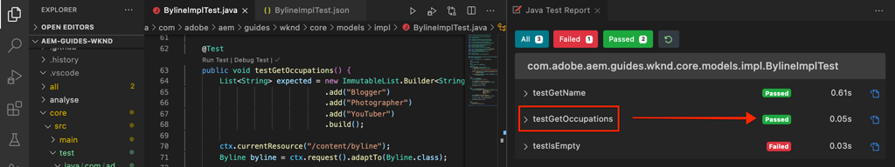

# Test unitaire {#unit-testing}

Ce tutoriel couvre l’implémentation d’un test unitaire qui valide le comportement du modèle Sling du composant de signature, créé dans le tutoriel sur le [composant personnalisé](./custom-component.md).

## Prérequis {#prerequisites}

Examinez les outils et les instructions nécessaires pour configurer un [environnement de développement local](overview.md#local-dev-environment).

_Si Java™ 8 et Java™ 11 sont tous deux installés sur le système, le programme d’exécution du test VS Code peut sélectionner le runtime Java™ de version antérieure lors de l’exécution des tests, ce qui entraîne des échecs de test. Si cela se produit, désinstallez Java™ 8._

### Projet de démarrage

>[!NOTE]
>
> Si vous avez terminé avec succès le chapitre précédent, vous pouvez réutiliser le projet et ignorer les étapes de consultation du projet de démarrage.

Consultez le code de ligne de base sur lequel le tutoriel s’appuie :

1. Consultez la branche `tutorial/unit-testing-start` à partir de [GitHub](https://github.com/adobe/aem-guides-wknd).

   ```shell
   $ cd aem-guides-wknd
   $ git checkout tutorial/unit-testing-start
   ```

1. Déployez la base de code sur une instance locale d’AEM à l’aide de vos compétences Maven :

   ```shell
   $ mvn clean install -PautoInstallSinglePackage
   ```

   >[!NOTE]
   >
   > Si vous utilisez AEM 6.5 ou 6.4, ajoutez le profil `classic` à n’importe quelle commande Maven.

   ```shell
   $ mvn clean install -PautoInstallSinglePackage -Pclassic
   ```

Vous pouvez toujours afficher le code terminé sur [GitHub](https://github.com/adobe/aem-guides-wknd/tree/tutorial/unit-testing-start) ou consulter le code localement en passant à la branche `tutorial/unit-testing-start`.

## Objectif

1. Comprendre les principes de base des tests unitaires.
1. Découvrir les frameworks et les outils couramment utilisés pour tester du code AEM.
1. Comprendre les options permettant de simuler des ressources AEM lors de l’écriture de tests unitaires.

## Contexte {#unit-testing-background}

Dans ce tutoriel, nous allons découvrir comment écrire des [tests unitaires](https://fr.wikipedia.org/wiki/Test_unitaire) pour le [modèle Sling](https://sling.apache.org/documentation/bundles/models.html) de notre composant de signature (créé dans la partie [Création d’un composant AEM personnalisé](custom-component.md)). Les tests unitaires sont des tests de création écrits en Java™ qui vérifient le comportement attendu du code Java™. Chaque test unitaire est généralement petit et valide la sortie d’une méthode (ou d’unités de travail) par rapport aux résultats attendus.

Nous suivons les bonnes pratiques d’AEM et utilisons :

* [JUnit 5](https://junit.org/junit5/)
* [Le framework de test Mockito](https://site.mockito.org/)
* [Le framework de test wcm.io](https://wcm.io/testing/) (qui s’appuie sur les [simulations Sling d’Apache](https://sling.apache.org/documentation/development/sling-mock.html))

## Test unitaire et Adobe Cloud Manager {#unit-testing-and-adobe-cloud-manager}

[Adobe Cloud Manager](https://experienceleague.adobe.com/docs/experience-manager-cloud-manager/content/introduction.html?lang=fr) intègre l’exécution de test unitaire et le [rapport de couverture de code](https://experienceleague.adobe.com/docs/experience-manager-cloud-manager/content/using/code-quality-testing.html?lang=fr) dans son pipeline CI/CD, afin d’encourager et de promouvoir les bonnes pratiques en matière de test unitaire de code d’AEM.

Bien que le code de test unitaire soit une bonne pratique de toute base de code, il s’avère important, lors de l’utilisation de Cloud Manager, de tirer parti de ses fonctionnalités de test de qualité du code et de création de rapports en fournissant des tests unitaires pour que Cloud Manager s’exécute.

## Mettre à jour les dépendances Maven de test {#inspect-the-test-maven-dependencies}

La première étape consiste à examiner les dépendances Maven pour prendre en charge l’écriture et l’exécution des tests. Quatre dépendances sont requises :

1. JUnit5
1. Le framework de test Mockito
1. Les simulations Sling d’Apache
1. Le framework de test de simulations d’AEM (par io.wcm)

Les dépendances de test **JUnit5**, Mockito et **de simulations d’AEM** sont automatiquement ajoutées au projet lors de la configuration à l’aide de l’[archétype Maven d’AEM](project-setup.md).

1. Pour afficher ces dépendances, ouvrez le fichier POM Reactor parent sur **aem-guides-wknd/pom.xml**, accédez aux `<dependencies>..</dependencies>` et affichez les dépendances de JUnit, de Mockito, des simulations Sling d’Apache et des tests de simulation d’AEM par io.wcm sous `<!-- Testing -->`.
1. Assurez-vous que `io.wcm.testing.aem-mock.junit5` est défini sur **4.1.0** :

   ```xml
   <dependency>
       <groupId>io.wcm</groupId>
       <artifactId>io.wcm.testing.aem-mock.junit5</artifactId>
       <version>4.1.0</version>
       <scope>test</scope>
   </dependency>
   ```

   >[!CAUTION]
   >
   > L’archétype **35** génère le projet avec la version **4.1.8** de `io.wcm.testing.aem-mock.junit5`. Veuillez rétrograder vers la version **4.1.0** pour suivre le reste de ce chapitre.

1. Ouvrez **aem-guides-wknd/core/pom.xml** et vérifiez que les dépendances de test correspondantes sont disponibles.

   Un dossier source parallèle dans le projet **principal** contiendra les tests unitaires et tous les fichiers de test annexes. Ce dossier de **test** offre une séparation entre les classes de test et le code source, mais permet aux tests d’agir comme s’ils résidaient dans les mêmes packages que le code source.

## Créer le test JUnit {#creating-the-junit-test}

Un test unitaire est généralement mappé à une classe Java™. Dans ce chapitre, nous allons écrire un test JUnit pour **BylineImpl.java**, qui est le modèle Sling qui soutient le composant de signature.


*Emplacement de stockage des tests unitaires.*

1. Créez un test unitaire pour `BylineImpl.java` en créant une nouvelle classe Java™ sous `src/test/java` dans une structure de dossiers de package Java™ qui reflète l’emplacement de la classe Java™ à tester.

   

   Puisque nous testons

   * `src/main/java/com/adobe/aem/guides/wknd/core/models/impl/BylineImpl.java`

   créez une classe Java™ de test unitaire correspondante à

   * `src/test/java/com/adobe/aem/guides/wknd/core/models/impl/BylineImplTest.java`

   Le suffixe `Test` sur le fichier de test unitaire, `BylineImplTest.java`, est une convention, qui nous permet de

   1. facilement l’identifier comme fichier de test _pour_ `BylineImpl.java`
   1. mais aussi de différencier le fichier de test _de_ la classe en cours de test, `BylineImpl.java`.

## Vérifier le fichier BylineImplTest.java {#reviewing-bylineimpltest-java}

À ce stade, le fichier de test JUnit est une classe Java™ vide.

1. Mettez à jour le fichier avec le code suivant :

   ```java
   package com.adobe.aem.guides.wknd.core.models.impl;
   
   import static org.junit.jupiter.api.Assertions.*;
   
   import org.junit.jupiter.api.BeforeEach;
   import org.junit.jupiter.api.Test;
   
   public class BylineImplTest {
   
       @BeforeEach
       void setUp() throws Exception {
   
       }
   
       @Test 
       void testGetName() { 
           fail("Not yet implemented");
       }
   
       @Test 
       void testGetOccupations() { 
           fail("Not yet implemented");
       }
   
       @Test 
       void testIsEmpty() { 
           fail("Not yet implemented");
       }
   }
   ```

1. La première méthode `public void setUp() { .. }` est annotée avec la fonction `@BeforeEach` de JUnit qui indique à l’exécuteur de test JUnit d’exécuter cette méthode avant l’exécution de chaque méthode de test de cette classe. Vous bénéficiez ainsi d’un emplacement pratique pour initialiser l’état de test commun requis par tous les tests.

1. Les méthodes suivantes sont les méthodes de test dont les noms comportent par convention le préfixe `test` et qui sont marquées avec l’annotation `@Test`. Notez que, par défaut, tous nos tests sont définis pour échouer, car nous ne les avons pas encore implémentés.

   Pour commencer, nous utilisons une méthode de test unique pour chaque méthode publique sur la classe que nous testons, de sorte que :

   | BylineImpl.java |              | BylineImplTest.java |
   | ------------------|--------------|---------------------|
   | getName() | est testée par | testGetName() |
   | getOccupations() | est testée par | testGetOccupations() |
   | isEmpty() | est testée par | testIsEmpty() |

   Ces méthodes peuvent être développées au besoin, comme nous le verrons plus loin dans ce chapitre.

   Lorsque cette classe de test JUnit (également appelée cas de test JUnit) est exécutée, chaque méthode marquée par `@Test` s’exécute en tant que test pouvant réussir ou échouer.


*`core/src/test/java/com/adobe/aem/guides/wknd/core/models/impl/BylineImplTest.java`*

1. Exécutez le cas de test JUnit en cliquant avec le bouton droit sur le fichier `BylineImplTest.java` et en appuyant sur **Exécuter**.
Comme prévu, tous les tests échouent, car ils n’ont pas encore été implémentés.

   

   *Cliquez avec le bouton droit sur BylineImplTests.java > Exécuter.*

## Vérifier BylineImpl.java {#reviewing-bylineimpl-java}

Lors de l’écriture de tests unitaires, deux approches principales sont possibles :

* Le [développement piloté par les tests (TDD)](https://fr.wikipedia.org/wiki/Test_driven_development), qui implique l’écriture progressive des tests unitaires immédiatement avant le développement de l’implémentation. Vous écrivez un test, puis vous écrivez l’implémentation pour que le test réussisse.
* La méthode de développement débutant par l’implémentation implique le développement du code de travail, puis l’écriture de tests qui valident ce code.

Dans ce tutoriel, la dernière approche est utilisée (car nous avons déjà créé un fichier **BylineImpl.java** dans un chapitre précédent). C’est pourquoi nous devons examiner et comprendre le comportement de ses méthodes publiques, mais aussi certains détails de son implémentation. Cela peut sembler contradictoire, car un bon test ne devrait s’intéresser qu’aux entrées et aux sorties. Lorsque vous travaillez dans AEM, plusieurs considérations d’implémentation doivent toutefois être comprises pour construire des tests efficaces.

Dans le contexte d’AEM, le développement piloté par les tests nécessite un certain niveau d’expertise. Il est adopté par les développeurs et développeuses AEM maîtrisant le développement d’AEM et les tests unitaires du code AEM.

## Configurer le contexte de test d’AEM  {#setting-up-aem-test-context}

La plupart du code écrit pour AEM repose sur les API JCR, Sling ou d’AEM qui, à leur tour, nécessitent que le contexte d’une instance AEM en cours d’exécution s’exécute correctement.

Comme les tests unitaires sont exécutés lors de la génération, en dehors du contexte d’une instance AEM en cours d’exécution, il n’existe aucun contexte de ce type. Pour palier ce manque de contexte, les [simulations AEM de wcm.io](https://wcm.io/testing/aem-mock/usage.html) créent un contexte simulé qui permet à ces API d’agir _essentiellement_ comme si elles s’exécutaient dans AEM.

1. Créez un contexte AEM à l’aide de `AemContext` de **wcm.io** dans **BylineImplTest.java** en l’ajoutant en tant qu’extension JUnit décorée avec `@ExtendWith` au fichier **BylineImplTest.java**. L’extension se charge de toutes les tâches d’initialisation et de nettoyage obligatoires. Créez une variable de classe pour `AemContext` qui peut être utilisée pour toutes les méthodes de test.

   ```java
   import org.junit.jupiter.api.extension.ExtendWith;
   import io.wcm.testing.mock.aem.junit5.AemContext;
   import io.wcm.testing.mock.aem.junit5.AemContextExtension;
   ...
   
   @ExtendWith(AemContextExtension.class)
   class BylineImplTest {
   
       private final AemContext ctx = new AemContext();
   ```

   Cette variable, `ctx`, expose un contexte AEM simulé qui fournit certaines abstraction d’AEM et Sling :

   * Le modèle Sling BylineImpl est enregistré dans ce contexte.
   * Les structures de contenu JCR simulées sont créées dans ce contexte.
   * Les services OSGi personnalisés peuvent être enregistrés dans ce contexte.
   * Elle fournit divers assistants et objets simulés, comme les objets SlingHttpServletRequest, et plusieurs services simulés Sling et OSGi d’AEM tels que ModelFactory, PageManager, Page, Modèle, ComponentManager, Composant, TagManager, Balise, etc.
      * *Toutes les méthodes de ces objets ne sont pas implémentées.*
   * Et [bien plus encore](https://wcm.io/testing/aem-mock/usage.html).

   L’objet **`ctx`** agit comme point d’entrée pour la plupart du contexte simulé.

1. Dans la méthode `setUp(..)`, qui est exécutée avant chaque méthode `@Test`, définissez un état de test simulé courant :

   ```java
   @BeforeEach
   public void setUp() throws Exception {
       ctx.addModelsForClasses(BylineImpl.class);
       ctx.load().json("/com/adobe/aem/guides/wknd/core/models/impl/BylineImplTest.json", "/content");
   }
   ```

   * **`addModelsForClasses`** enregistre le modèle Sling à tester, dans le contexte AEM simulé, afin qu’il puisse être instancié dans les méthodes `@Test`.
   * **`load().json`** charge les structures de ressources dans le contexte simulé, ce qui permet au code d’interagir avec ces ressources comme si elles étaient fournies par un référentiel réel. Les définitions des ressources du fichier **`BylineImplTest.json`** sont chargées dans le contexte JCR simulé sous **/content**.
   * **`BylineImplTest.json`** n’existe pas encore. Créons-le donc et définissons les structures de ressources JCR nécessaires au test.

1. Les fichiers JSON représentant les structures de ressources simulées sont stockés sous **core/src/test/resources** suivant le même cheminement de package que le fichier de test JUnit Java™.

   Créez un fichier JSON dans `core/test/resources/com/adobe/aem/guides/wknd/core/models/impl` appelé **BylineImplTest.json** avec le contenu suivant :

   ```json
   {
       "byline": {
       "jcr:primaryType": "nt:unstructured",
       "sling:resourceType": "wknd/components/content/byline"
       }
   }
   ```

   

   Ce JSON définit une ressource simulée (nœud JCR) pour le test unitaire du composant de signature. À ce stade, le fichier JSON dispose de l’ensemble minimum de propriétés requises pour représenter une ressource de contenu de composant de signature, le `jcr:primaryType` et le `sling:resourceType`.

   Lors de l’utilisation de tests unitaires, une règle générale consiste à créer l’ensemble minimal de contenu simulé, de contexte et de code requis pour satisfaire chaque test. Ne cédez pas à la tentation de créer un contexte simulé complet avant d’écrire les tests, car cela génère souvent des artefacts inutiles.

   Maintenant que **BylineImplTest.json** existe, lors de l’exécution de `ctx.json("/com/adobe/aem/guides/wknd/core/models/impl/BylineImplTest.json", "/content")`, les définitions de ressources simulées sont chargées dans le contexte au niveau du chemin d’accès **/content.**

## Test de getName() {#testing-get-name}

Maintenant que nous avons une configuration de contexte simulé de base, écrivons notre premier test pour la méthode **getName() de BylineImpl**. Ce test doit s’assurer que la méthode **getName()** renvoie le nom créé correct stocké dans la propriété **« nom »** de la ressource.

1. Mettez à jour la méthode **testGetName**() dans **BylineImplTest.java** comme suit :

   ```java
   import com.adobe.aem.guides.wknd.core.models.Byline;
   ...
   @Test
   public void testGetName() {
       final String expected = "Jane Doe";
   
       ctx.currentResource("/content/byline");
       Byline byline = ctx.request().adaptTo(Byline.class);
   
       String actual = byline.getName();
   
       assertEquals(expected, actual);
   }
   ```

   * **`String expected`** définit la valeur attendue. Nous définirons cette valeur sur « **Jane Doe** ».
   * **`ctx.currentResource`** définit le contexte de la ressource simulée pour évaluer le code ; cela est donc défini sur **/content/byline** car c’est là que la ressource de contenu de signature simulée est chargée.
   * **`Byline byline`** instancie le modèle Sling de signature en l’adaptant à partir de l’objet de requête simulée.
   * **`String actual`** appelle la méthode que nous testons, `getName()`, sur l’objet de modèle Sling de signature.
   * **`assertEquals`** déclare que la valeur attendue correspond à la valeur renvoyée par l’objet de modèle Sling de signature. Si ces valeurs ne sont pas égales, le test échoue.

1. Exécutez le test. Il échoue avec une exception `NullPointerException`.

   L’échec de ce test n’est PAS dû au fait que nous n’avons jamais défini une propriété `name` dans le JSON simulé qui provoque l’échec du test, car l’exécution du test n’a pas atteint ce point. Ce test échoue en raison d’une exception `NullPointerException` sur l’objet de signature lui-même.

1. Dans `BylineImpl.java`, si la méthode `@PostConstruct init()` renvoie une exception, elle empêche l’instantiation du modèle Sling ; cet objet de modèle Sling devient alors null.

   ```java
   @PostConstruct
   private void init() {
       image = modelFactory.getModelFromWrappedRequest(request, request.getResource(), Image.class);
   }
   ```

   Il s’avère que, tandis que le service OSGi ModelFactory est fourni via `AemContext` (au moyen du contexte Sling d’Apache), toutes les méthodes ne sont pas implémentées, y compris `getModelFromWrappedRequest(...)` qui est appelée dans la méthode `init()` de BylineImpl. Cela entraîne une erreur [AbstractMethodError](https://docs.oracle.com/en/java/javase/11/docs/api/java.base/java/lang/AbstractMethodError.html), qui à terme provoque l’échec de `init()`. L’adaptation obtenue de `ctx.request().adaptTo(Byline.class)` est un objet null.

   Comme les simulations fournies ne peuvent pas prendre en charge notre code, nous devons implémenter le contexte simulé nous-mêmes. Pour cela, nous pouvons utiliser Mockito pour créer un objet ModelFactory simulé, qui renvoie un objet Image simulé quand la méthode `getModelFromWrappedRequest(...)` est appelée dessus.

   Puisque ce contexte simulé doit être en place pour instancier le modèle Sling de signature, nous pouvons l’ajouter à la méthode `@Before setUp()`. Nous devons également ajouter `MockitoExtension.class` à l’annotation `@ExtendWith` au-dessus de la classe **BylineImplTest**.

   ```java
   package com.adobe.aem.guides.wknd.core.models.impl;
   
   import org.mockito.junit.jupiter.MockitoExtension;
   import org.mockito.Mock;
   
   import com.adobe.aem.guides.wknd.core.models.Byline;
   import com.adobe.cq.wcm.core.components.models.Image;
   
   import io.wcm.testing.mock.aem.junit5.AemContext;
   import io.wcm.testing.mock.aem.junit5.AemContextExtension;
   
   import org.apache.sling.models.factory.ModelFactory;
   import org.junit.jupiter.api.BeforeEach;
   import org.junit.jupiter.api.Test;
   import org.junit.jupiter.api.extension.ExtendWith;
   
   import static org.junit.jupiter.api.Assertions.*;
   import static org.mockito.Mockito.*;
   import org.apache.sling.api.resource.Resource;
   
   @ExtendWith({ AemContextExtension.class, MockitoExtension.class })
   public class BylineImplTest {
   
       private final AemContext ctx = new AemContext();
   
       @Mock
       private Image image;
   
       @Mock
       private ModelFactory modelFactory;
   
       @BeforeEach
       public void setUp() throws Exception {
           ctx.addModelsForClasses(BylineImpl.class);
   
           ctx.load().json("/com/adobe/aem/guides/wknd/core/models/impl/BylineImplTest.json", "/content");
   
           lenient().when(modelFactory.getModelFromWrappedRequest(eq(ctx.request()), any(Resource.class), eq(Image.class)))
                   .thenReturn(image);
   
           ctx.registerService(ModelFactory.class, modelFactory, org.osgi.framework.Constants.SERVICE_RANKING,
                   Integer.MAX_VALUE);
       }
   
       @Test
       void testGetName() { ...
   }
   ```

   * **`@ExtendWith({AemContextExtension.class, MockitoExtension.class})`** marque la classe de cas de test à exécuter avec l’[extension Jupiter JUnit de Mockito](https://www.javadoc.io/static/org.mockito/mockito-junit-jupiter/4.11.0/org/mockito/junit/jupiter/MockitoExtension.html) qui permet l’utilisation des annotations @Mock pour définir des objets simulés au niveau de la classe.
   * **`@Mock private Image`** crée un objet simulé de type `com.adobe.cq.wcm.core.components.models.Image`. Il est défini au niveau de la classe de sorte que, si nécessaire, les méthodes `@Test` peuvent modifier son comportement au besoin.
   * **`@Mock private ModelFactory`** crée un objet simulé de type ModelFactory. Il s’agit d’une pure simulation de Mockito qui ne comporte aucune méthode implémentée. Elle est définie au niveau de la classe de sorte que, si nécessaire, les `@Test` peuvent modifier son comportement au besoin.
   * **`when(modelFactory.getModelFromWrappedRequest(..)`** enregistre le comportement simulé pour le moment où la méthode `getModelFromWrappedRequest(..)` est appelée sur l’objet simulé ModelFactory. Le résultat défini dans `thenReturn (..)` permet de renvoyer l’objet Image simulé. Ce comportement est uniquement invoqué si : le premier paramètre est égal à l’objet de requête du `ctx`, le deuxième paramètre est un objet d’une ressource quelconque, et le troisième paramètre doit être la classe d’image des composants principaux. Nous acceptons n’importe quelle ressource car tout au long de nos tests, nous paramétrons la `ctx.currentResource(...)` sur différentes ressources fictives définies dans **BylineImplTest.json**. Notez que nous ajoutons le niveau de rigueur **lenient()**, car nous voulons par la suite remplacer ce comportement de ModelFactory.
   * **`ctx.registerService(..)`.** enregistre l’objet simulé ModelFactory dans AemContext, avec le rang de service le plus élevé. Cela est obligatoire, car le ModelFactory utilisé dans le `init()` de BylineImpl’s est injecté via le champ `@OSGiService ModelFactory model`. Pour qu’AemContext s’injecte dans **notre** objet simulé, qui gère les appels sur `getModelFromWrappedRequest(..)`, nous devons l’enregistrer avec le rang de service le plus élevé de ce type (ModelFactory).

1. Relancez le test. Il échoue à nouveau, mais cette fois, le message est clair et explique pourquoi il a échoué.

   

   *Échec de testGetName() en raison de l’assertion*

   Nous recevons une **AssertionError**, ce qui signifie que la condition d’assertion dans le test a échoué, et on nous indique que la **valeur attendue est « Jane Doe »** mais que la **valeur réelle est null**. Cela est logique, car la propriété **« nom »** n’a pas été ajoutée à la définition de ressource **/content/byline** simulée dans **BylineImplTest.json**, alors ajoutons-la :

1. Mettez à jour **BylineImplTest.json** pour définir `"name": "Jane Doe".`.

   ```json
   {
       "byline": {
       "jcr:primaryType": "nt:unstructured",
       "sling:resourceType": "wknd/components/content/byline",
       "name": "Jane Doe"
       }
   }
   ```

1. Réexécutez le test, et le **`testGetName()`** est maintenant un succès.

   


## Test de getOccupations() {#testing-get-occupations}

Très bien. Le premier test a réussi. Passons au test `getOccupations()`. Puisque l’initialisation du contexte simulé a été effectuée dans la méthode `@Before setUp()`, elle est disponible pour toutes les méthodes `@Test` de ce cas de test, notamment `getOccupations()`.

N’oubliez pas que cette méthode doit renvoyer une liste de professions triées par ordre alphabétique (descendant) et stockées dans la propriété Professions.

1. Mettez à jour **`testGetOccupations()`** comme suit :

   ```java
   import java.util.List;
   import com.google.common.collect.ImmutableList;
   ...
   @Test
   public void testGetOccupations() {
       List<String> expected = new ImmutableList.Builder<String>()
                               .add("Blogger")
                               .add("Photographer")
                               .add("YouTuber")
                               .build();
   
       ctx.currentResource("/content/byline");
       Byline byline = ctx.request().adaptTo(Byline.class);
   
       List<String> actual = byline.getOccupations();
   
       assertEquals(expected, actual);
   }
   ```

   * **`List<String> expected`** définit le résultat attendu.
   * **`ctx.currentResource`** définit la ressource actuelle pour évaluer le contexte par rapport à la définition de la ressource simulée à l’emplacement /content/byline. Cela permet de s’assurer que **BylineImpl.java** s’exécute dans le contexte de notre ressource simulée.
   * **`ctx.request().adaptTo(Byline.class)`** instancie le modèle Sling de signature en l’adaptant à partir de l’objet de requête simulée.
   * **`byline.getOccupations()`** appelle la méthode que nous testons, `getOccupations()`, sur l’objet de modèle Sling de signature.
   * **`assertEquals(expected, actual)`** affirme que la liste attendue est la même que la liste réelle.

1. Rappelez-vous, tout comme **`getName()`** ci-dessus, le fichier **BylineImplTest.json** ne définit pas les professions, ce test échouera donc si nous l’exécutons, puisque `byline.getOccupations()` renverra une liste vide.

   Mettez à jour **BylineImplTest.json** pour inclure une liste de professions. Ces dernières sont placées dans un ordre non alphabétique pour que nos tests puissent confirmer que les professions sont triées par ordre alphabétique par **`getOccupations()`**.

   ```json
   {
       "byline": {
       "jcr:primaryType": "nt:unstructured",
       "sling:resourceType": "wknd/components/content/byline",
       "name": "Jane Doe",
       "occupations": ["Photographer", "Blogger", "YouTuber"]
       }
   }
   ```

1. Exécutez le test, et encore une fois nous avons réussi. Il semblerait que le tri des professions fonctionne.

   

   *Le testGetOccupations() réussit.*

## Test de isEmpty() {#testing-is-empty}

La dernière méthode à tester est **`isEmpty()`**.

Le test de `isEmpty()` est intéressant, car il nécessite différentes conditions. En examinant la méthode `isEmpty()` de **BylineImpl.java**, les conditions suivantes doivent être testées :

* Renvoi d’une réponse « true » si le nom est vide
* Renvoi d’une réponse « true » si les professions sont null ou vides
* Renvoi d’une réponse « true » si l’image est null ou n’a pas d’URL src
* Renvoi d’une réponse « false » lorsque le nom, les professions et l’image (avec une URL src) sont présents

Pour cela, nous devons créer des méthodes de test, chacune testant une condition spécifique et de nouvelles structures de ressources simulées dans `BylineImplTest.json` pour effectuer ces tests.

Cette vérification nous a permis d’ignorer le test quand `getName()`, `getOccupations()` et `getImage()` sont vides, car le comportement attendu de cet état est testé via `isEmpty()`.

1. Le premier test porte sur l’état d’un tout nouveau composant qui n’a pas de propriétés définies.

   Ajoutez une nouvelle définition de ressource à `BylineImplTest.json`, en lui donnant le nom sémantique « **vide** ».

   ```json
   {
       "byline": {
           "jcr:primaryType": "nt:unstructured",
           "sling:resourceType": "wknd/components/content/byline",
           "name": "Jane Doe",
           "occupations": ["Photographer", "Blogger", "YouTuber"]
       },
       "empty": {
           "jcr:primaryType": "nt:unstructured",
           "sling:resourceType": "wknd/components/content/byline"
       }
   }
   ```

   **`"empty": {...}`** définit une nouvelle définition de ressource nommée « vide » qui ne comporte qu’un `jcr:primaryType` et un `sling:resourceType`.

   Rappelez-vous que nous chargeons `BylineImplTest.json` dans `ctx` avant l’exécution des méthodes de test dans `@setUp`. Cette nouvelle définition de ressource est donc immédiatement disponible pour nous dans les tests à **/content/empty.**.

1. Mettez à jour `testIsEmpty()` comme suit, en choisissant la nouvelle définition de ressource simulée « **vide** ».

   ```java
   @Test
   public void testIsEmpty() {
       ctx.currentResource("/content/empty");
       Byline byline = ctx.request().adaptTo(Byline.class);
   
       assertTrue(byline.isEmpty());
   }
   ```

   Exécutez le test et vérifiez qu’il réussit.

1. Créez ensuite un ensemble de méthodes pour vous assurer que si l’un des points de données requis (nom, profession ou image) est vide, `isEmpty()` renvoie « true ».

   Pour chaque test, une définition de ressource simulée discrète est utilisée. Mettez à jour **BylineImplTest.json** avec les définitions de ressources supplémentaires pour **without-name** et **without-occupations**.

   ```json
   {
       "byline": {
           "jcr:primaryType": "nt:unstructured",
           "sling:resourceType": "wknd/components/content/byline",
           "name": "Jane Doe",
           "occupations": ["Photographer", "Blogger", "YouTuber"]
       },
       "empty": {
           "jcr:primaryType": "nt:unstructured",
           "sling:resourceType": "wknd/components/content/byline"
       },
       "without-name": {
           "jcr:primaryType": "nt:unstructured",
           "sling:resourceType": "wknd/components/content/byline",
           "occupations": "[Photographer, Blogger, YouTuber]"
       },
       "without-occupations": {
           "jcr:primaryType": "nt:unstructured",
           "sling:resourceType": "wknd/components/content/byline",
           "name": "Jane Doe"
       }
   }
   ```

   Créez les méthodes de test suivantes pour tester chacun de ces états.

   ```java
   @Test
   public void testIsEmpty() {
       ctx.currentResource("/content/empty");
   
       Byline byline = ctx.request().adaptTo(Byline.class);
   
       assertTrue(byline.isEmpty());
   }
   
   @Test
   public void testIsEmpty_WithoutName() {
       ctx.currentResource("/content/without-name");
   
       Byline byline = ctx.request().adaptTo(Byline.class);
   
       assertTrue(byline.isEmpty());
   }
   
   @Test
   public void testIsEmpty_WithoutOccupations() {
       ctx.currentResource("/content/without-occupations");
   
       Byline byline = ctx.request().adaptTo(Byline.class);
   
       assertTrue(byline.isEmpty());
   }
   
   @Test
   public void testIsEmpty_WithoutImage() {
       ctx.currentResource("/content/byline");
   
       lenient().when(modelFactory.getModelFromWrappedRequest(eq(ctx.request()),
           any(Resource.class),
           eq(Image.class))).thenReturn(null);
   
       Byline byline = ctx.request().adaptTo(Byline.class);
   
       assertTrue(byline.isEmpty());
   }
   
   @Test
   public void testIsEmpty_WithoutImageSrc() {
       ctx.currentResource("/content/byline");
   
       when(image.getSrc()).thenReturn("");
   
       Byline byline = ctx.request().adaptTo(Byline.class);
   
       assertTrue(byline.isEmpty());
   }
   ```

   **`testIsEmpty()`** teste la définition de la ressource simulée vide et affirme que `isEmpty()` est « true ».

   **`testIsEmpty_WithoutName()`** teste une définition de ressource simulée qui a des professions mais pas de nom.

   **`testIsEmpty_WithoutOccupations()`** teste une définition de ressource simulée qui a un nom mais pas de profession.

   **`testIsEmpty_WithoutImage()`** teste une définition de ressource simulée avec un nom et des professions, mais définit l’image simulée sur null. Notez que nous voulons remplacer le comportement de `modelFactory.getModelFromWrappedRequest(..)` défini dans `setUp()` pour nous assurer que l’objet Image renvoyé par cet appel est null. La fonction de bouchon Mockito est stricte et refuse le code dupliqué. Par conséquent, nous définissons la simulation avec des paramètres **`lenient`** pour indiquer explicitement que nous remplaçons le comportement dans la méthode `setUp()`.

   **`testIsEmpty_WithoutImageSrc()`** teste une définition de ressource simulée avec un nom et des professions, mais définit l’image simulée de sorte qu’elle renvoie une chaîne vide lorsque la fonction `getSrc()` est appelée.

1. Enfin, écrivez un test pour vous assurer que la fonction **isEmpty()** renvoie « false » lorsque le composant est correctement configuré. Pour cette condition, nous pouvons réutiliser **/content/byline** qui représente un composant de signature entièrement configuré.

   ```java
   @Test
   public void testIsNotEmpty() {
       ctx.currentResource("/content/byline");
       when(image.getSrc()).thenReturn("/content/bio.png");
   
       Byline byline = ctx.request().adaptTo(Byline.class);
   
       assertFalse(byline.isEmpty());
   }
   ```

1. Exécutez maintenant tous les tests unitaires dans le fichier BylineImplTest.java et passez en revue la sortie du rapport de test Java™.


## Exécuter des tests unitaires dans le cadre de la création {#running-unit-tests-as-part-of-the-build}

Les tests unitaires sont exécutés et doivent réussir dans le cadre de la création Maven. Cela garantit que tous les tests réussissent avant qu’une application ne soit déployée. L’exécution des objectifs Maven relatifs au package ou à l’installation appelle automatiquement et nécessite la réussite de tous les tests unitaires du projet.

```shell
$ mvn package
```


```shell
$ mvn package
```

De même, si nous modifions une méthode de test sur Échec, la création échoue et signale les tests qui ont échoué, ainsi que le motif de l’échec.


## Vérifier le code {#review-the-code}

Affichez le code terminé sur [GitHub](https://github.com/adobe/aem-guides-wknd) ou passez en revue et déployez le code localement sur la branche Git `tutorial/unit-testing-solution`.
