# Création de contenu et publication de modifications {#author-content-publish}

>[!CAUTION]
>
> Les fonctions de création rapide du site présentées ici seront publiées au second semestre 2021. La documentation correspondante est disponible à des fins de prévisualisation.

Il est important de comprendre comment un utilisateur va mettre à jour le contenu du site Web. Dans ce chapitre, nous adopterons le personnage d&#39;un auteur de contenu **** et apporterons quelques mises à jour éditoriales au site généré dans le chapitre précédent. À la fin du chapitre, nous publierons les modifications afin de comprendre comment le site actif est mis à jour.

## Conditions préalables {#prerequisites}

Il s’agit d’un didacticiel en plusieurs parties et on suppose que les étapes décrites dans le chapitre [Créer un site](./create-site.md) sont terminées.

## Intention {#objective}

1. Comprendre les concepts de **Pages** et **Composants** en AEM Sites.
1. Découvrez comment mettre à jour le contenu du site Web.
1. Découvrez comment publier les modifications sur le site en direct.

## Créer une page {#create-page}

En règle générale, un site Web est fractionné en pages pour former une expérience de plusieurs pages. AEM structure le contenu de la même manière. Créez ensuite une nouvelle page pour le site.

1. Connectez-vous au service **Auteur** AEM utilisé dans le chapitre précédent.
1. Dans l’écran Début de l’AEM, cliquez sur **Sites** > **Site WKND** > **Anglais** > **Article**
1. Dans le coin supérieur droit, cliquez sur **Créer** > **Page**.

   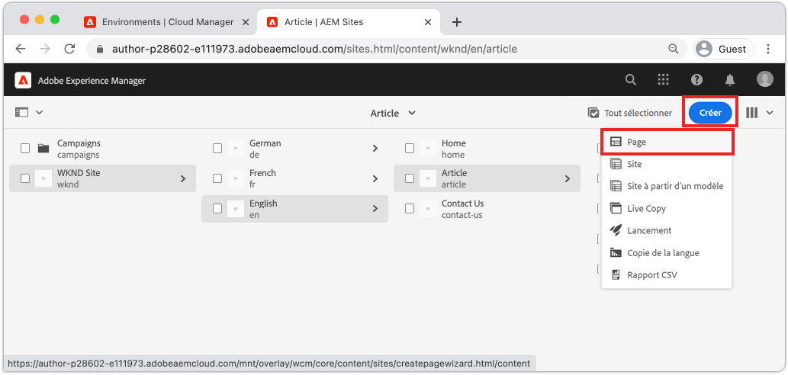

   L&#39;Assistant **Créer une page** s&#39;affiche.

1. Sélectionnez le modèle **Page d’article** et cliquez sur **Suivant**.

   Les pages des AEM sont créées à partir d&#39;un modèle de page. Les modèles de page seront examinés plus en détail dans le chapitre [Modèles de page](page-templates.md).

1. Sous **Propriétés**, entrez **Titre** de &quot;Bonjour le monde&quot;.
1. Définissez **Nom** sur `hello-world` et cliquez sur **Créer**.

   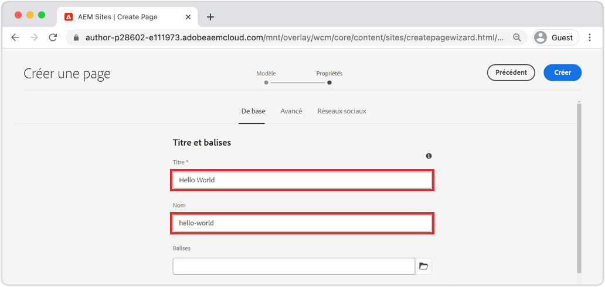

1. Dans la boîte de dialogue contextuelle, cliquez sur **Ouvrir** pour ouvrir la page nouvellement créée.

## Création d’un composant {#author-component}

Les composants AEM peuvent être considérés comme de petits blocs de construction modulaires d’une page Web. En divisant l’interface utilisateur en blocs logiques ou en composants, elle facilite la gestion. Pour réutiliser les composants, ceux-ci doivent pouvoir être configurés. Pour ce faire, ouvrez la boîte de dialogue de l’auteur.

AEM fournit un ensemble de [composants principaux](https://experienceleague.adobe.com/docs/experience-manager-core-components/using/introduction.html?lang=fr) prêts à être utilisés par la production. Les **composants principaux** vont des éléments de base tels que [Texte](https://experienceleague.adobe.com/docs/experience-manager-core-components/using/components/text.html) et [Image](https://experienceleague.adobe.com/docs/experience-manager-core-components/using/components/image.html) à des éléments d&#39;interface utilisateur plus complexes tels qu&#39;un [Carrousel](https://experienceleague.adobe.com/docs/experience-manager-core-components/using/components/carousel.html).

Ensuite, créons quelques composants à l’aide de AEM Éditeur de page.

1. Accédez à la page **Hello World** créée lors de l’exercice précédent.
1. Vérifiez que vous êtes en mode **Modifier** et dans le rail latéral gauche, cliquez sur l&#39;icône **Composants**.

   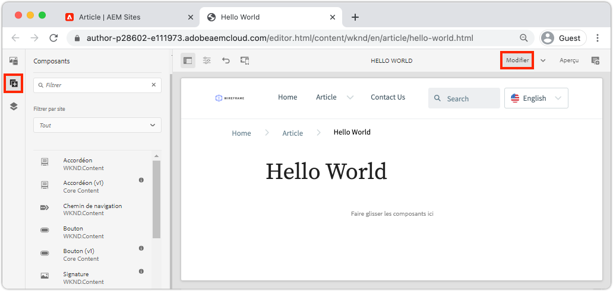

   Cette opération ouvre la bibliothèque de composants et liste les composants disponibles qui peuvent être utilisés sur la page.

1. Faites défiler la page vers le bas et **Faites glisser+Déposez** un composant **Texte (v2)** vers la région principale modifiable de la page.

   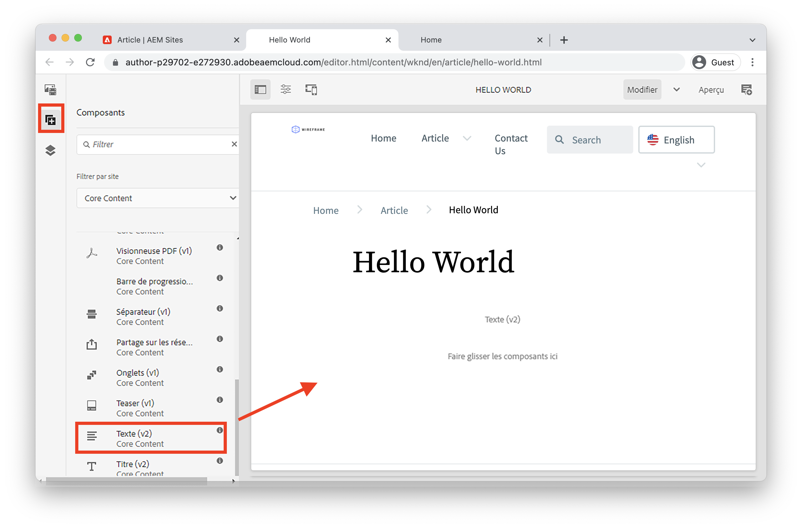

1. Cliquez sur le composant **Texte** pour le mettre en surbrillance, puis sur l&#39;icône **clé à molette**  pour ouvrir la boîte de dialogue du composant. Saisissez du texte et enregistrez les modifications dans la boîte de dialogue.

   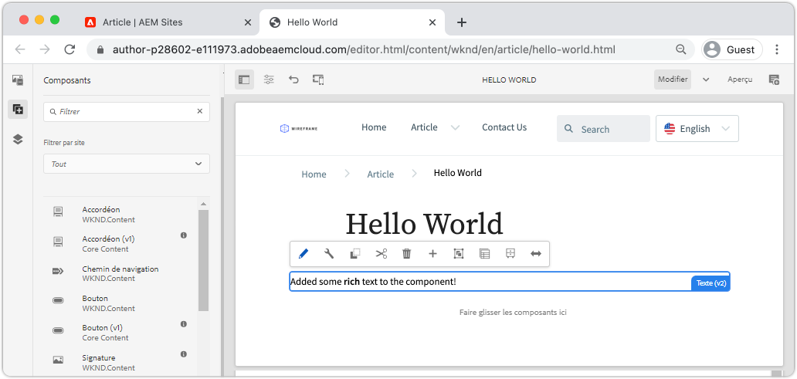

   Le composant **Texte** doit maintenant afficher le texte enrichi sur la page.

1. Répétez les étapes ci-dessus, sauf faites glisser une instance du composant **Image(v2)** sur la page. Ouvrez la boîte de dialogue du composant **Image**.

1. Dans le rail de gauche, passez à l&#39;outil de recherche de ressources **en cliquant sur l&#39;icône** Ressources **.**
1. **Faites glisser+** Déposer l’image dans la boîte de dialogue du composant et cliquez sur  **** Ne pas faire pour enregistrer les modifications.

   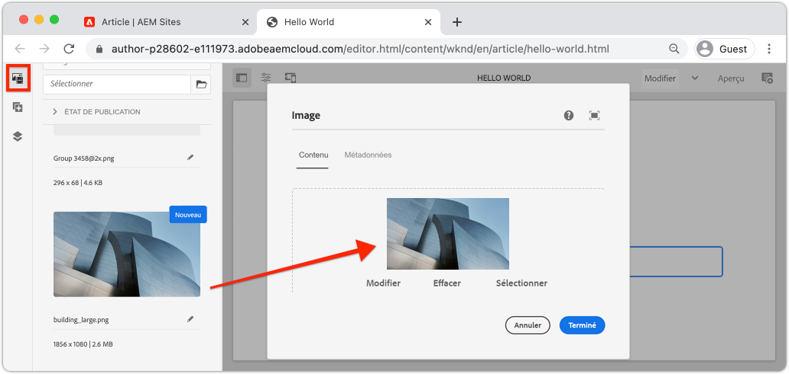

1. Observez qu’il existe des composants sur la page, tels que **Titre**, **Navigation**, **Recherche** qui sont corrigés. Ces zones sont configurées dans le cadre du modèle de page et ne peuvent pas être modifiées sur une page individuelle. Cette question sera examinée plus en détail dans le prochain chapitre.

N&#39;hésitez pas à expérimenter avec certains des autres composants. Vous trouverez la documentation de chaque [composant principal ici](https://experienceleague.adobe.com/docs/experience-manager-core-components/using/introduction.html). Une série vidéo détaillée sur la création de [pages est disponible ici](https://experienceleague.adobe.com/docs/experience-manager-learn/sites/page-authoring/aem-sites-authoring-overview.html).

## Publier les mises à jour {#publish-updates}

AEM environnements sont répartis entre un **service d’auteur** et un **service de publication**. Dans ce chapitre, nous avons apporté plusieurs modifications au site sur le **service d&#39;auteur**. Pour que les visiteurs du site vue les modifications, nous devons les publier dans le **service de publication**.

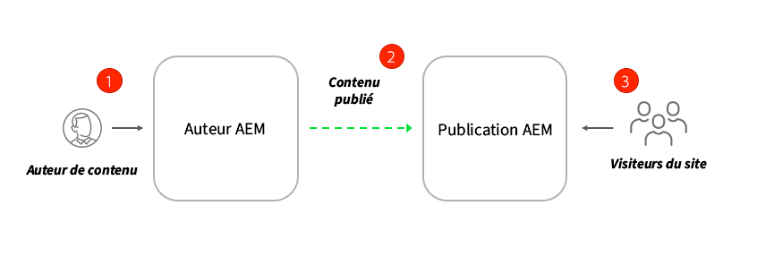

*Flux de contenu de haut niveau de l’auteur à la publication*

**1.** Les auteurs de contenu effectuent des mises à jour du contenu du site. Les mises à jour peuvent être prévisualisées, revues et approuvées pour être publiées.

**2.** Le contenu est publié. La publication peut être effectuée à la demande ou programmée pour une date ultérieure.

**3.** Les visiteurs du site verront les modifications répercutées sur le service de publication.

### Publication des modifications

Ensuite, publions les modifications.

1. Dans l’écran Début de l’AEM, accédez à **Sites** et sélectionnez le **site WKND**.
1. Cliquez sur **Gérer la publication** dans la barre de menus.

   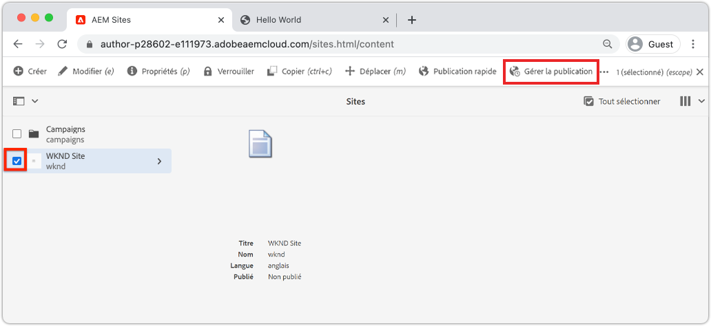

   Comme il s’agit d’un tout nouveau site, nous voulons publier toutes les pages et nous pouvons utiliser l’assistant Gérer les publications pour définir exactement ce qui doit être publié.

1. Sous **Options**, laissez les paramètres par défaut sur **Publier** et planifiez-les pour **Maintenant**. Cliquez sur **Next** (Suivant).
1. Sous **Portée**, sélectionnez le **site WKND** et cliquez sur **Inclure les enfants**. Dans la boîte de dialogue, décochez toutes les cases. Nous voulons publier le site complet.

   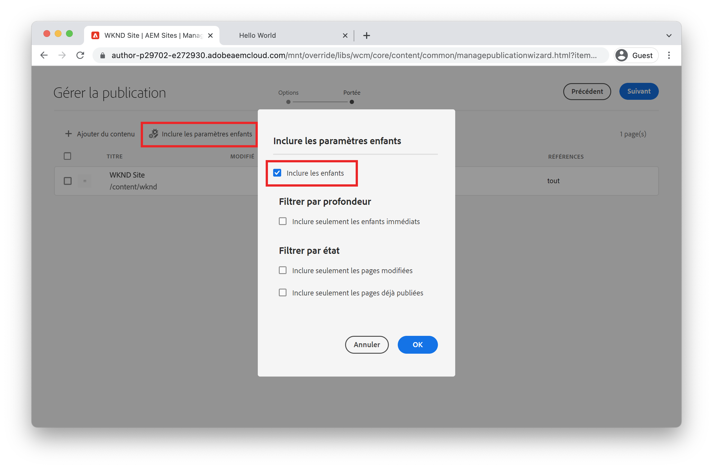

1. Cliquez sur le bouton **Références publiées**. Dans la boîte de dialogue, vérifiez que tout est vérifié. Cela inclut le **modèle de site de base de l&#39;AEM** et plusieurs configurations générées par le modèle de site. Cliquez sur **Terminé** pour mettre à jour.

   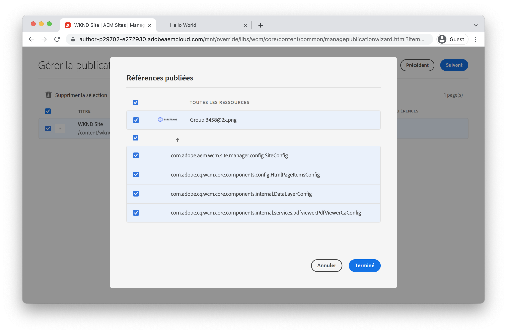

1. Enfin, cliquez sur **Publier** dans le coin supérieur droit pour publier le contenu.

## Vue du contenu publié {#publish}

Accédez ensuite au service de publication pour vue les modifications.

1. Pour obtenir facilement l’URL du service de publication, copiez l’URL d’auteur et remplacez le mot `author` par `publish`. Par exemple :

   * **URL de l&#39;auteur** - `https://author-pYYYY-eXXXX.adobeaemcloud.com/`
   * **URL**  de publication -  `https://publish-pYYYY-eXXXX.adobeaemcloud.com/`

1. Ajoutez `/content/wknd.html` sur l’URL de publication afin que l’URL finale ressemble à : `https://publish-pYYYY-eXXXX.adobeaemcloud.com/content/wknd.html`.

   >[!NOTE]
   >
   > Modifiez `wknd.html` pour qu’il corresponde au nom de votre site, si vous avez fourni un nom unique lors de la création du site .

1. En accédant à l’URL de publication, vous devriez voir le site, sans aucune des fonctionnalités de création AEM.

   

1. A l’aide du menu **Navigation**, cliquez sur **Article** > **Hello World** pour accéder à la page Hello World créée précédemment.
1. Revenez au **service d’auteur AEM** et apportez d’autres modifications au contenu dans l’éditeur de page.
1. Publiez ces modifications directement dans l’éditeur de page en cliquant sur l’icône **Propriétés de la page** > **Publier la page**.

   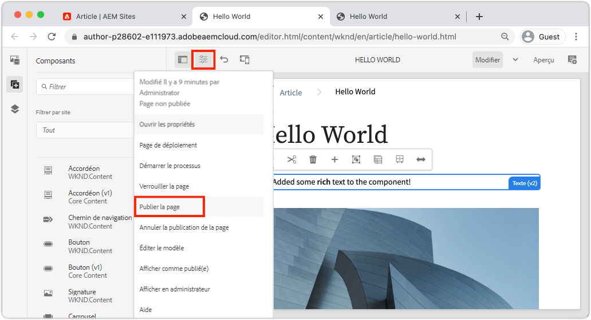

1. Revenez à **Service de publication AEM** pour vue les modifications. Il est probable que **not** ne visualise pas immédiatement les mises à jour. En effet, le **service de publication AEM** comprend [la mise en cache via un serveur Web Apache et CDN](https://experienceleague.adobe.com/docs/experience-manager-cloud-service/implementing/content-delivery/caching.html). Par défaut, le contenu HTML est mis en cache pendant environ 5 minutes.

1. Pour contourner le cache à des fins de test/débogage, ajoutez simplement un paramètre de requête tel que `?nocache=true`. L’URL ressemblerait à `https://publish-pYYYY-eXXXX.adobeaemcloud.com/content/wknd/en/article/hello-world.html?nocache=true`. Vous trouverez plus de détails sur la stratégie de mise en cache et les configurations disponibles [ici](https://experienceleague.adobe.com/docs/experience-manager-cloud-service/implementing/content-delivery/overview.html).

1. Vous pouvez également trouver l’URL d’accès au service de publication dans Cloud Manager. Accédez au **Programme Cloud Manager** > **Environnements** > **Environnement**.

   

   Sous **Segments d’Environnement**, vous trouverez des liens vers les services **Auteur** et **Publier**.

## Félicitations! {#congratulations}

Félicitations, vous venez de rédiger et de publier des modifications à votre site AEM !

### Étapes suivantes {#next-steps}

Découvrez comment créer et modifier [Modèles de page](./page-templates.md). Comprendre la relation entre un modèle de page et une page. Découvrez comment configurer les stratégies d&#39;un modèle de page afin de fournir une gouvernance granulaire et une cohérence de marque pour le contenu.  Un modèle d&#39;article de magazine bien structuré sera créé à partir d&#39;une maquette d&#39;Adobe XD.
