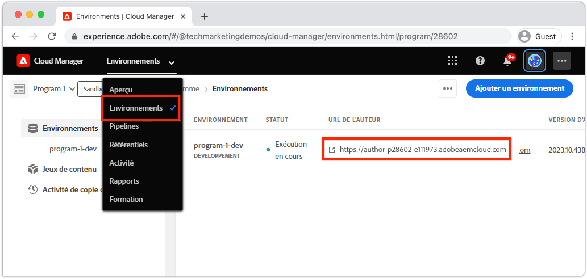
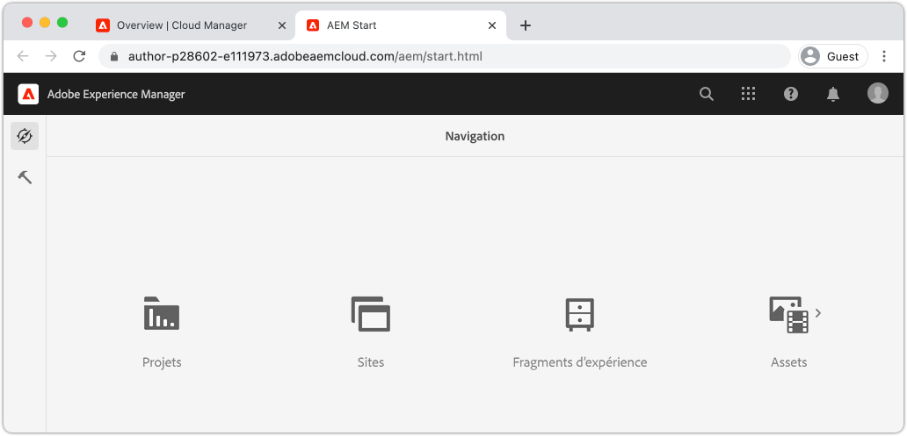
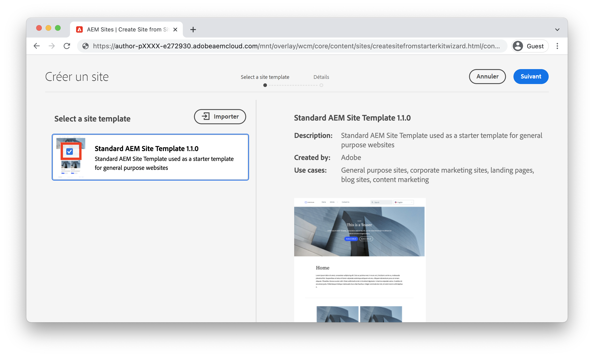
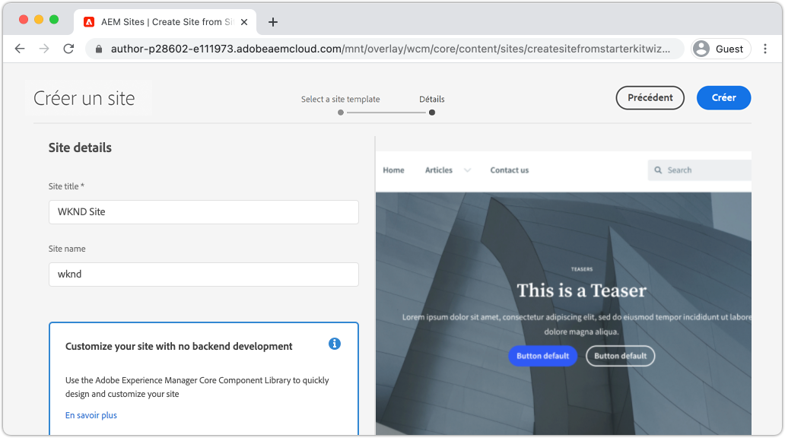
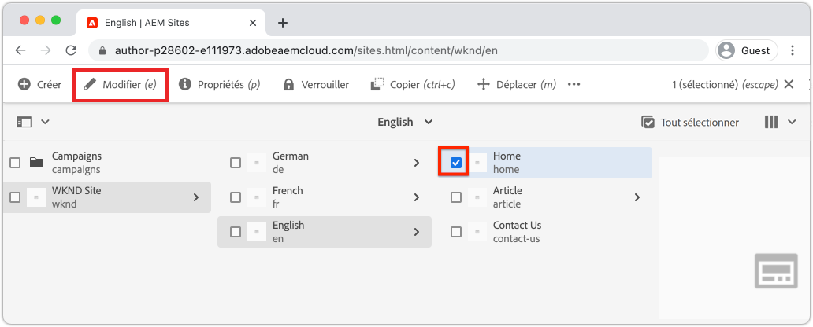
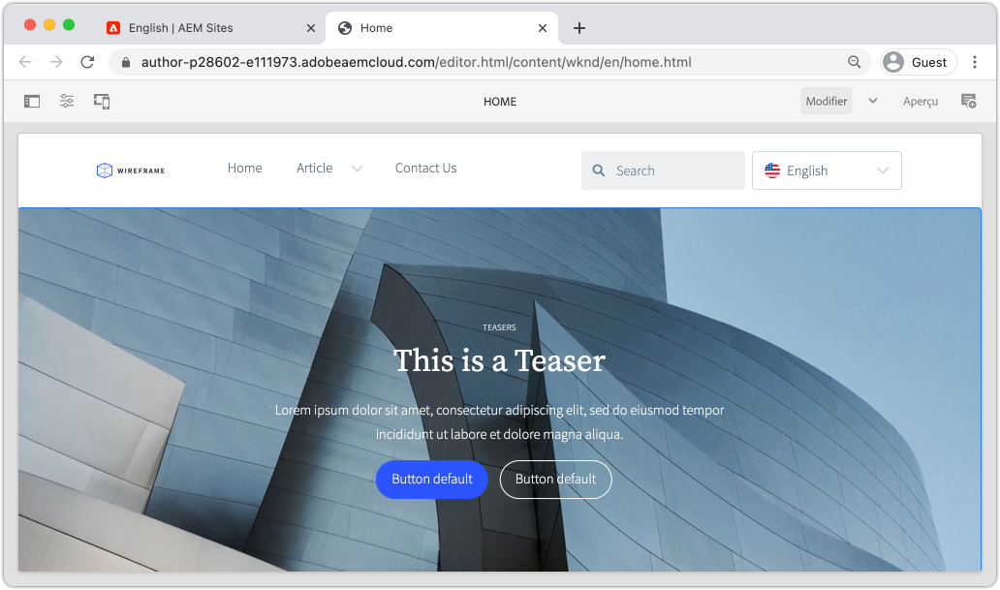

# Créer un site {#create-site}

>[!CAUTION]
>
> Les fonctions de création rapide du site présentées ici seront publiées au second semestre 2021. La documentation correspondante est disponible à des fins de prévisualisation.

Ce chapitre porte sur la création d&#39;un nouveau site à Adobe Experience Manager. Le modèle de site standard, fourni par Adobe, est utilisé comme point de départ.

## Conditions préalables {#prerequisites}

Les étapes de ce chapitre se dérouleront dans un Adobe Experience Manager en tant qu&#39;environnement Cloud Service. Assurez-vous que vous disposez d’un accès administratif à l’environnement AEM. Il est recommandé d’utiliser un [programme Sandbox](https://experienceleague.adobe.com/docs/experience-manager-cloud-service/onboarding/getting-access/sandbox-programs/introduction-sandbox-programs.html) et un [environnement de développement](https://experienceleague.adobe.com/docs/experience-manager-cloud-service/implementing/using-cloud-manager/manage-environments.html?lang=fr) pour compléter ce didacticiel.

Consultez la [documentation sur l’intégration](https://experienceleague.adobe.com/docs/experience-manager-cloud-service/onboarding/home.html) pour plus de détails.

## Intention {#objective}

1. Découvrez comment utiliser l&#39;Assistant Création de site pour générer un nouveau site.
1. Comprendre le rôle des modèles de site.
1. Explorez le site AEM généré.

## Connectez-vous à Adobe Experience Manager Author {#author}

Pour commencer, connectez-vous à votre AEM en tant qu’environnement Cloud Service. AEM environnements sont répartis entre un **service d’auteur** et un **service de publication**.

* **Service**  Auteur : où le contenu du site est créé, géré et mis à jour. En règle générale, seuls les utilisateurs internes ont accès au **service d’auteur** et se trouvent derrière un écran de connexion.
* **Service**  de publication : héberge le site Web actif. Il s’agit du service que les utilisateurs finaux verront et qui est généralement accessible au public.

La majorité du didacticiel aura lieu à l&#39;aide du **service d&#39;auteur**.

1. Accédez à Adobe Experience Cloud [https://experience.adobe.com/](https://experience.adobe.com/). Connectez-vous à l’aide de votre compte personnel ou d’un compte Société/école.
1. Assurez-vous que l’organisation appropriée est sélectionnée dans le menu et cliquez sur **Experience Manager**.

   

1. Sous **Cloud Manager**, cliquez sur **Lancer**.
1. Passez la souris sur le Programme que vous souhaitez utiliser et cliquez sur l’icône **Programme Cloud Manager**.

   

1. Dans le menu supérieur, cliquez sur **Environnements** pour vue des environnements configurés.

1. Recherchez l’environnement que vous souhaitez utiliser et cliquez sur **URL de l’auteur**.

   

   >[!NOTE]
   >
   >Il est recommandé d’utiliser un environnement **Développement** pour ce didacticiel.

1. Un nouvel onglet sera lancé sur l&#39;AEM **Service d&#39;auteur**. Cliquez sur **Se connecter avec Adobe** et vous devez être connecté automatiquement avec les mêmes informations d’identification d’Experience Cloud.

1. Après avoir été redirigé et authentifié, vous devriez maintenant voir l’écran début AEM.

   

>[!NOTE]
>
> Vous rencontrez des difficultés pour accéder au Experience Manager ? Consultez la [documentation sur l’intégration](https://experienceleague.adobe.com/docs/experience-manager-cloud-service/onboarding/home.html)

## Téléchargement du modèle de site de base

Un modèle de site fournit un point de départ pour un nouveau site. Un modèle de site comprend des thèmes de base, des modèles de page, des configurations et des exemples de contenu. Il appartient au développeur de déterminer exactement ce qui est inclus dans le modèle de site. Adobe fournit un **modèle de site de base** pour accélérer les nouvelles mises en oeuvre.

1. Ouvrez un nouvel onglet de navigateur et accédez au projet Modèle de site de base sur GitHub : [https://github.com/adobe/aem-site-template-basic](https://github.com/adobe/aem-site-template-basic). Le projet est open-source et sous licence pour être utilisé par n&#39;importe qui.
1. Cliquez sur **Versions** et accédez à la [dernière version](https://github.com/adobe/aem-site-template-basic/releases/latest).
1. Développez la liste déroulante **Ressources** et téléchargez le fichier compressé du modèle :

   

   Ce fichier zip sera utilisé dans l&#39;exercice suivant.

   >[!NOTE]
   >
   > Ce didacticiel est écrit à l’aide de la version **5.0.0** du modèle de site de base. Si vous démarrez un nouveau projet, il est toujours recommandé d’utiliser la dernière version.

## Créer un site

Ensuite, générez un nouveau site à l’aide du modèle de site de l’exercice précédent.

1. Revenez à l&#39;environnement AEM. Dans l&#39;écran Début de l&#39;AEM, accédez à **Sites**.
1. Dans le coin supérieur droit, cliquez sur **Créer** > **Site (Modèle)**. L&#39;**Assistant Créer un site** est alors affiché.
1. Sous **Sélectionner un modèle de site**, cliquez sur le bouton **Importer**.

   Téléchargez le fichier de modèle **.zip** téléchargé depuis l’exercice précédent.

1. Sélectionnez le **modèle de site de base de l&#39;AEM** et cliquez sur **Suivant**.

   

1. Sous **Détails du site** > **Titre du site**, entrez `WKND Site`.
1. Sous **Nom du site**, saisissez `wknd`.

   

   >[!NOTE]
   >
   > Si vous utilisez un environnement d&#39;AEM partagé, ajoutez un identifiant unique au **nom du site**. Par exemple `wknd-johndoe`. Ainsi, plusieurs utilisateurs pourront suivre le même didacticiel, sans aucune collision.

1. Cliquez sur **Créer** pour générer le site. Cliquez sur **Terminé** dans la boîte de dialogue **Succès** une fois AEM création du site Web terminée.

## Explorez le nouveau site

1. Accédez à la console AEM Sites, si ce n’est déjà fait.
1. Un nouveau **site WKND** a été généré. Il comprendra une structure de site avec une hiérarchie multilingue.
1. Ouvrez la page **Anglais** > **Accueil** en la sélectionnant et en cliquant sur le bouton **Modifier** dans la barre de menus :

   

1. Le contenu de démarrage a déjà été créé et plusieurs composants peuvent être ajoutés à une page. Testez ces composants pour avoir une idée de la fonctionnalité. Vous apprendrez les bases d’un composant dans le chapitre suivant.

   

   *Exemple de contenu fourni par le modèle de site*

## Félicitations! {#congratulations}

Félicitations, vous venez de créer votre premier site AEM !

### Étapes suivantes {#next-steps}

Utilisez l’éditeur de page de Adobe Experience Manager, AEM, pour mettre à jour le contenu du site dans le chapitre [Création du contenu et publication](author-content-publish.md). Découvrez comment les composants atomiques peuvent être configurés pour mettre à jour le contenu. Comprenez la différence entre un auteur AEM et des environnements de publication et apprenez à publier des mises à jour sur le site en direct.
