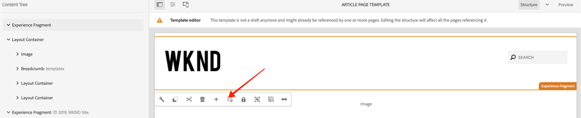

# Développer avec le système de style {#developing-with-the-style-system}

Découvrez comment mettre en oeuvre des styles individuels et réutiliser les composants principaux à l’aide de Experience Manager Style System. Ce didacticiel porte sur le développement du système de style afin d’étendre les composants principaux à l’aide de CSS propres à la marque et de configurations de stratégie avancées de l’éditeur de modèles.

## Conditions préalables {#prerequisites}

Examiner les outils et les instructions nécessaires pour la mise en place d&#39;un environnement [de développement](overview.md#local-dev-environment)local.

Il est également recommandé de consulter le didacticiel sur les bibliothèques côté [client et le flux de travail](client-side-libraries.md) frontal afin de comprendre les fondamentaux des bibliothèques côté client et les divers outils frontaux intégrés au projet AEM.

### Projet de démarrage

Consultez le code de ligne de base sur lequel le didacticiel s&#39;appuie :

1. Clonez le référentiel [github.com/adobe/aem-guides-wknd](https://github.com/adobe/aem-guides-wknd) .
1. Consulter la `style-system/start` branche

   ```shell
   $ git clone git@github.com:adobe/aem-guides-wknd.git ~/code/aem-guides-wknd
   $ cd ~/code/aem-guides-wknd
   $ git checkout style-system/start
   ```

1. Déployez la base de code sur une instance AEM locale en utilisant vos compétences Maven :

   ```shell
   $ cd ~/code/aem-guides-wknd
   $ mvn clean install -PautoInstallSinglePackage
   ```

Vous pouvez toujours vue le code fini sur [GitHub](https://github.com/adobe/aem-guides-wknd/tree/style-system/solution) ou le retirer localement en passant à la branche `style-system/solution`.

## Intention

1. Découvrez comment utiliser le système de style pour appliquer une page CSS spécifique à la marque à AEM composants principaux.
1. Découvrez la notation BEM et comment elle peut être utilisée pour définir soigneusement les styles.
1. Appliquez des configurations de stratégie avancées avec des modèles modifiables.

## Ce que vous allez construire {#what-you-will-build}

Dans ce chapitre, nous utiliserons la fonction [Système de](https://docs.adobe.com/content/help/en/experience-manager-learn/sites/page-authoring/style-system-feature-video-use.html) style pour créer plusieurs variantes de composants utilisés sur la page Article. Nous utiliserons également le système de style pour créer des variations pour les éléments structuraux tels que l’en-tête/pied de page et le Conteneur de mise en page.

>[!VIDEO](https://video.tv.adobe.com/v/30386/?quality=12&learn=on)

## Arrière-plan {#background}

Le système [](https://docs.adobe.com/content/help/fr-FR/experience-manager-65/developing/components/style-system.html) Style permet aux développeurs et aux éditeurs de modèles de créer plusieurs variantes visuelles d’un composant. Les auteurs peuvent ensuite décider quel style utiliser lors de la composition d’une page. Nous utiliserons le système de style tout au long du reste du didacticiel pour obtenir plusieurs styles uniques, tout en exploitant les composants de base dans une approche à code faible.

L&#39;idée générale avec le système de style est que les auteurs peuvent choisir différents styles de l&#39;aspect d&#39;un composant. Les &quot;styles&quot; sont soutenus par des classes CSS supplémentaires qui sont injectées dans la balise div externe d’un composant. Dans les bibliothèques clientes, les règles CSS sont ajoutées en fonction de ces classes de style afin que le composant change d’aspect.

Vous trouverez ici [la documentation](https://docs.adobe.com/content/help/fr-FR/experience-manager-65/developing/components/style-system.html)détaillée de Style System. Il y a aussi une grande vidéo [technique pour comprendre le système](https://docs.adobe.com/content/help/en/experience-manager-learn/sites/developing/style-system-technical-video-understand.html)de style.

## Style du composant de titre {#title-component}

A ce stade, le composant [](https://docs.adobe.com/content/help/en/experience-manager-core-components/using/components/title.html) Titre a été ajouté par proxy au projet dans le cadre `/apps/wknd/components/content/title` du module **ui.apps** . Les styles par défaut des éléments d’en-tête (`H1`, `H2`, `H3`..) ont déjà été implémentés dans le module **ui.frontend** du `_elements.scss` fichier sous `ui.frontend/src/main/webpack/base/sass/_elements.scss`.

### Style de soulignement

Les conceptions [d’article](assets/pages-templates/wknd-article-design.xd) WKND contiennent un style unique pour le composant Titre avec un trait de soulignement. Au lieu de créer deux composants ou de modifier la boîte de dialogue du composant, le système de style permet aux auteurs d’ajouter un style de soulignement.


### inspect Title Component Markup

En tant que développeur frontal, la première étape pour mettre en forme un composant principal consiste à comprendre les balises générées par le composant.

Dans le cadre du projet généré, l&#39;archétype intégré aux exemples **de composants** principaux. Pour les développeurs et les auteurs de contenu, cette section contient une référence facile pour comprendre toutes les fonctionnalités disponibles avec les composants principaux. Une version en direct est également [disponible](https://opensource.adobe.com/aem-core-wcm-components/library.html).

1. Ouvrez un nouveau navigateur et vue le composant Titre :

   Instance AEM locale : [http://localhost:4502/editor.html/content/core-components-examples/library/title.html](http://localhost:4502/editor.html/content/core-components-examples/library/title.html)

   Exemple en direct : [https://opensource.adobe.com/aem-core-wcm-components/library/title.html](https://opensource.adobe.com/aem-core-wcm-components/library/title.html)

1. Vous trouverez ci-dessous l’annotation du composant Titre :

   ```html
   <div class="cmp-title">
       <h1 class="cmp-title__text">Lorem Ipsum</h1>
   </div>
   ```

   Notation BEM du composant de titre :

   ```plain
   BLOCK cmp-title
       ELEMENT cmp-title__text
   ```

1. Le système Style ajoute une classe CSS à la balise div externe entourant le composant. Par conséquent, les balises que nous ciblerons ressembleront à ce qui suit :

   ```html
   <div class="STYLE-SYSTEM-CLASS-HERE"> <!-- Custom CSS class - implementation gets to define this -->
       <div class="cmp-title">
           <h1 class="cmp-title__text">Lorem Ipsum</h1>
       </div>
   </div>
   ```

### Mise en oeuvre du style de soulignement - ui.frontend

Ensuite, nous allons mettre en oeuvre le style Souligné en utilisant le module **ui.frontend** de notre projet. Nous utiliserons le serveur de développement webpack fourni avec le module **ui.frontend** pour prévisualisation des styles *avant* le déploiement sur une instance locale d’AEM.

1. Début du serveur de développement webpack en exécutant la commande suivante depuis le module **ui.frontend** :

   ```shell
   $ cd ~/code/aem-guides-wknd/ui.frontend/
   $ npm start
   
   > aem-maven-archetype@1.0.0 start code/aem-guides-wknd/ui.frontend
   > webpack-dev-server --open --config ./webpack.dev.js
   ```

   Vous devez ouvrir un navigateur à l’adresse [http://localhost:8080](http://localhost:8080).

   >[!NOTE]
   >
   > Si les images apparaissent rompues, vérifiez que le projet de démarrage a été déployé sur une instance locale d’AEM (s’exécutant sur le port 4502) et que le navigateur utilisé s’est également connecté à l’instance AEM locale.

   

1. Dans Eclipse ou l&#39;IDE de votre choix, ouvrez le fichier `index.html` situé dans : `ui.frontend/src/main/webpack/static/index.html`. Il s’agit du balisage statique utilisé par le serveur de développement webpack.
1. Dans `index.html` recherchez une instance du composant de titre à laquelle ajouter le style de soulignement en recherchant dans le document *cmp-title*. Choisissez le composant Titre avec le texte *&quot;Vans off the Wall Skatepark&quot;* (ligne 218). ajoutez la classe `cmp-title--underline` à la div environnante :

   ```html
    <!-- before -->
    <div class="title aem-GridColumn aem-GridColumn--default--8">
        <div class="cmp-title">
            <h2 class="cmp-title__text">Vans off the Wall Skatepark</h2>
        </div>
    </div>
   ```

   ```html
    <!-- After -->
    <div class="cmp-title--underline title aem-GridColumn aem-GridColumn--default--8">
        <div class="cmp-title">
            <h2 class="cmp-title__text">Vans off the Wall Skatepark</h2>
        </div>
    </div>
   ```

1. Revenez au navigateur et vérifiez que la classe supplémentaire est reflétée dans l’annotation.
1. Revenez au module **ui.frontend** et mettez à jour le fichier `title.scss` situé à l’emplacement suivant : `ui.frontend/src/main/webpack/components/content/title/scss/title.scss`:

   ```css
   /* Add Title Underline Style */
   .cmp-title--underline {
   
       .cmp-title {
       }
   
       .cmp-title__text {
           &:after {
           display: block;
               width: 84px;
               padding-top: 8px;
               content: '';
               border-bottom: 2px solid $brand-primary;
           }
       }
   }
   ```

   >[!NOTE]
   >
   >Il est recommandé de toujours lier étroitement les styles de portée au composant de cible. Ainsi, les styles supplémentaires n’affectent pas les autres zones de la page.
   >
   >Tous les composants principaux adhèrent à la notation **[](https://github.com/adobe/aem-core-wcm-components/wiki/css-coding-conventions)** BEM. Il est recommandé de cible de la classe CSS externe lors de la création d’un style par défaut pour un composant. Une autre bonne pratique consiste à cible les noms de classe spécifiés par la notation BEM du composant principal plutôt que par les éléments HTML.

1. Revenez à nouveau au navigateur et le style Souligné doit être ajouté :

   

1. Arrêtez le serveur de développement webpack.

### ajouter une stratégie de titre

Ensuite, nous devons ajouter une nouvelle stratégie pour les composants Titre pour permettre aux auteurs de contenu de choisir le style Souligné à appliquer à des composants spécifiques. Pour ce faire, utilisez l’éditeur de modèles dans AEM.

1. Déployez la base de code sur une instance AEM locale en utilisant vos compétences Maven :

   ```shell
   $ cd ~/code/aem-guides-wknd
   $ mvn clean install -PautoInstallSinglePackage
   ```

1. Accédez au modèle **de page de l’** article situé à l’emplacement suivant : [http://localhost:4502/editor.html/conf/wknd/settings/wcm/templates/article-page-template/structure.html](http://localhost:4502/editor.html/conf/wknd/settings/wcm/templates/article-page-template/structure.html).

1. En mode **Structure** , dans le Conteneur **de** mise en page principal, sélectionnez l’icône **Stratégie** en regard du composant **Titre répertorié sous Composants autorisés :****

   

1. Créez une nouvelle stratégie pour le composant Titre avec les valeurs suivantes :

   *Titre de la politique **: **Titre WKND**

   *Propriétés* > Onglet ** Styles > *Ajouter un nouveau style*

   **Souligner** : `cmp-title--underline`

   

   Cliquez sur **Terminé** pour enregistrer les modifications apportées à la stratégie Titre.

   >[!NOTE]
   >
   > La valeur `cmp-title--underline` correspond à la classe CSS ciblée précédemment lors du développement dans le module **ui.frontend** .

### Appliquer le style de soulignement

Enfin, en tant qu’auteur, nous pouvons choisir d’appliquer le style Souligné à certains composants de titre.

1. Accédez à l&#39;article **La Skateparks** dans l&#39;éditeur AEM Sites à l&#39;adresse : [http://localhost:4502/editor.html/content/wknd/us/en/magazine/guide-la-skateparks.html](http://localhost:4502/editor.html/content/wknd/us/en/magazine/guide-la-skateparks.html)
1. En mode **Edition** , choisissez un composant Titre. Cliquez sur l’icône **pinceau** et sélectionnez le style **Souligné** :

   

   En tant qu’auteur, vous devez pouvoir activer/désactiver le style.

1. Cliquez sur l’icône Informations **sur la** page > **Vue telle que publiée** pour examiner la page en dehors de AEM éditeur.

   

   Utilisez les outils de développement de votre navigateur pour vérifier que la classe CSS `cmp-title--underline` est appliquée à la balise autour du composant Title.

## Style du composant de texte {#text-component}

Ensuite, nous répétons des étapes similaires pour appliquer un style unique au composant [de](https://docs.adobe.com/content/help/fr-FR/experience-manager-core-components/using/components/text.html)texte. Le composant Texte a été ajouté par proxy au projet sous `/apps/wknd/components/content/text` le module **ui.apps** . Les styles par défaut des éléments de paragraphe ont déjà été implémentés dans le module **ui.frontend** du `_elements.scss` fichier sous `ui.frontend/src/main/webpack/base/sass/_elements.scss`.

### Style de bloc de devis

Les conceptions [d’article](assets/pages-templates/wknd-article-design.xd) WKND contiennent un style unique pour le composant Texte avec un bloc de guillemets :


### inspect Text Component Markup

Une fois de plus, nous examinerons l&#39;annotation du composant de texte.

1. Ouvrez un nouveau navigateur et vue le composant de texte dans la bibliothèque de composants principaux :
Instance AEM locale : [http://localhost:4502/editor.html/content/core-components-examples/library/text.html](http://localhost:4502/editor.html/content/core-components-examples/library/text.html)

   Exemple en direct : [https://opensource.adobe.com/aem-core-wcm-components/library/text.html](https://opensource.adobe.com/aem-core-wcm-components/library/text.html)

1. Voici le balisage du composant Texte :

   ```html
   <div class="cmp-text">
       <p><b>Bold </b>can be used to emphasize a word or phrase, as can <u>underline</u> and <i>italics.&nbsp;</i><sup>Superscript</sup> and <sub>subscript</sub> are useful for mathematical (E = mc<sup>2</sup>) or scientific (h<sub>2</sub>O) expressions. Paragraph styles can provide alternative renderings, such as quote sections:</p>
       <blockquote>"<i>Be yourself; everyone else is already taken"</i></blockquote>
       <b>- Oscar Wilde</b>
   </div>
   ```

   Notation BEM du composant de titre :

   ```plain
   BLOCK cmp-text
       ELEMENT
   ```

1. Le système Style ajoute une classe CSS à la balise div externe entourant le composant. Par conséquent, les balises que nous ciblerons ressembleront à ce qui suit :

   ```html
   <div class="STYLE-SYSTEM-CLASS-HERE"> <!-- Custom CSS class - implementation gets to define this -->
       <div class="cmp-text">
           <p><b>Bold </b>can be used to emphasize a word or phrase, as can <u>underline</u> and <i>italics.&nbsp;</i><sup>Superscript</sup> and <sub>subscript</sub> are useful for mathematical (E = mc<sup>2</sup>) or scientific (h<sub>2</sub>O) expressions. Paragraph styles can provide alternative renderings, such as quote sections:</p>
           <blockquote>"<i>Be yourself; everyone else is already taken"</i></blockquote>
           <b>- Oscar Wilde</b>
       </div>
   </div>
   ```

### Mise en oeuvre du style de bloc de devis - ui.frontend

Nous allons ensuite mettre en oeuvre le style Bloc de devis en utilisant le module **ui.frontend** de notre projet.

1. Début du serveur de développement webpack en exécutant la commande suivante depuis le module **ui.frontend** :

   ```shell
   $ cd ~/code/aem-guides-wknd/ui.frontend/
   $ npm start
   
   > aem-maven-archetype@1.0.0 start code/aem-guides-wknd/ui.frontend
   > webpack-dev-server --open --config ./webpack.dev.js
   ```

1. Dans Eclipse ou l&#39;IDE de votre choix, ouvrez le fichier `index.html` situé dans : `ui.frontend/src/main/webpack/static/index.html`. Il s’agit du balisage statique utilisé par le serveur de développement webpack.
1. Recherchez `index.html` une instance du composant de texte en recherchant le texte *&quot;Jacob Wester&quot;* (ligne 210). ajoutez la classe `cmp-text--quote` à la div environnante :

   ```html
    <!-- before -->
    <div class="text aem-GridColumn aem-GridColumn--default--8">
        <div class="cmp-text">
            <blockquote>"There is no better place to shred then Los Angeles"</blockquote>
            <p>Jacob Wester - Pro Skater</p>
        </div>
    </div>
   ```

   ```html
    <!-- After -->
    <div class="cmp-text--quote text aem-GridColumn aem-GridColumn--default--8">
        <div class="cmp-text">
            <blockquote>"There is no better place to shred then Los Angeles"</blockquote>
            <p>Jacob Wester - Pro Skater</p>
        </div>
    </div>
   ```

1. Revenez au navigateur et vérifiez que la classe supplémentaire est reflétée dans l’annotation.
1. Revenez au module **ui.frontend** et mettez à jour le fichier `text.scss` situé à l’emplacement suivant : `ui.frontend/src/main/webpack/components/content/text/scss/text.scss`:

   ```css
   /* WKND Text Quote style */
   
   .cmp-text--quote {
   
       .cmp-text {
           background-color: $brand-third;
           margin: 1em 0em;
           padding: 1em;
   
           blockquote {
               border: none;
               font-size: $font-size-h2;
               font-family: $font-family-serif;
               padding: 14px 14px;
               margin: 0;
               margin-bottom: 0.5em;
   
               &:after {
                   border-bottom: 2px solid $brand-primary; /*yellow border */
                   content: '';
                   display: block;
                   position: relative;
                   top: 0.25em;
                   width: 80px;
               }
           }
   
           p {
               font-size:    $font-size-large;
               font-family:  $font-family-serif;
           }
       }
   }
   ```

   >[!CAUTION]
   >
   > Dans ce cas, les éléments HTML bruts sont ciblés par les styles. En effet, le composant Texte fournit un éditeur de texte enrichi aux auteurs de contenu. La création de styles directement par rapport au contenu RTE doit être faite avec soin et il est encore plus important de définir les styles de manière stricte.

1. Revenez à nouveau au navigateur et le style de bloc Devis doit être ajouté :

   

1. Arrêtez le serveur de développement webpack.

### ajouter une stratégie de texte

Ajoutez ensuite une nouvelle stratégie pour les composants de texte.

1. Déployez la base de code sur une instance AEM locale en utilisant vos compétences Maven :

   ```shell
   $ cd ~/code/aem-guides-wknd
   $ mvn clean install -PautoInstallSinglePackage
   ```

1. Accédez au modèle **de page de l’** article situé à l’emplacement suivant : [http://localhost:4502/editor.html/conf/wknd/settings/wcm/templates/article-page-template/structure.html](http://localhost:4502/editor.html/conf/wknd/settings/wcm/templates/article-page-template/structure.html).

1. En mode **Structure** , dans le Conteneur **de** mise en page principal, sélectionnez l’icône **Stratégie** en regard du composant **Texte répertorié sous Composants autorisés :****

   

1. Créez une nouvelle stratégie pour le composant Texte avec les valeurs suivantes :

   *Titre de la politique **: **Texte WKND**

   *Plug-ins* > Styles *de* paragraphe > *Activer les styles de paragraphe*

   *Onglet* Styles > *Ajouter un nouveau style*

   **Bloc** de devis : `cmp-text--quote`

   

   

   Cliquez sur **Terminé** pour enregistrer les modifications apportées à la stratégie Texte.

### Appliquer le style de bloc de devis

1. Accédez à l&#39;article **La Skateparks** dans l&#39;éditeur AEM Sites à l&#39;adresse : [http://localhost:4502/editor.html/content/wknd/us/en/magazine/guide-la-skateparks.html](http://localhost:4502/editor.html/content/wknd/us/en/magazine/guide-la-skateparks.html)
1. En mode **Edition** , choisissez un composant Texte. Modifiez le composant pour inclure un élément de devis :

   

1. Sélectionnez le composant de texte, cliquez sur l’icône **pinceau** et sélectionnez le style Bloc **de** devis :

   

   En tant qu’auteur, vous devez pouvoir activer/désactiver le style.

## Conteneur de mises en page {#layout-container}

Les Conteneurs de mise en page ont été utilisés pour créer la structure de base du modèle de page d’article et fournir les zones de dépôt aux auteurs de contenu pour ajouter du contenu sur une page. Les Conteneurs de mise en page peuvent également tirer parti du système de style, offrant aux créateurs de contenu davantage d’options pour la conception de mises en page.

Actuellement, une règle CSS est appliquée à la page entière en appliquant une largeur fixe. Au lieu de cela, une approche plus souple consiste à créer un style de largeur **** fixe que les auteurs de contenu peuvent activer/désactiver.

### Mise en oeuvre du style de largeur fixe - ui.frontend

Nous allons début de mettre en oeuvre le style Largeur fixe dans le module **ui.frontend** de notre projet.

1. Début du serveur de développement webpack en exécutant la commande suivante depuis le module **ui.frontend** :

   ```shell
   $ cd ~/code/aem-guides-wknd/ui.frontend/
   $ npm start
   ```

1. Open the file `index.html` located at: `ui.frontend/src/main/webpack/static/index.html`.
1. Nous voulons que le corps de notre modèle de page d’article soit doté d’une largeur fixe, ce qui laisse l’en-tête et le pied de page libres pour s’élargir. Par conséquent, nous voulons cible le 2e `<div class='responsivegrid aem-GridColumn aem-GridColumn--default--12'` (Conteneur de mise en page) entre les deux fragments d’expérience (ligne 136)

   

1. ajoutez la classe `cmp-layout-container--fixed` à celle `div` identifiée lors de l&#39;étape précédente.

   ```html
   <!-- Experience Fragment Header -->
   <div class="experiencefragment aem-GridColumn aem-GridColumn--default--12">
       ...
   </div>
   <!-- Main body Layout Container -->
   <div class="responsivegrid cmp-layout-container--fixed aem-GridColumn aem-GridColumn--default--12">
       ...
   </div>
   <!-- Experience Fragment Footer -->
   <div class="experiencefragment aem-GridColumn aem-GridColumn--default--12">
       ...
   </div>
   ```

1. Mettez à jour le fichier `container.scss` situé dans : `ui.frontend/src/main/webpack/components/content/container/scss/container.scss`:

   ```css
   /* WKND Layout Container - Fixed Width */
   
   .cmp-layout-container--fixed {
       @media (min-width: $screen-medium + 1) {
           display:block;
           max-width:  $max-width !important;
           float: unset !important;
           margin: 0 auto !important;
           padding: 0 $gutter-padding;
           clear: both !important;
       }
   }
   ```

1. Mettez à jour le fichier `_elements.scss` situé dans : `ui.frontend/src/main/webpack/base/sass/_elements.scss` et modifiez la `.root` règle pour que la nouvelle largeur maximale soit définie sur la variable `$max-body-width`.

   ```css
    /* Before */
    body {
        ...
   
        .root {
            max-width: $max-width;
            margin: 0 auto;
            padding-top: 12px;
        }
    }
   ```

   ```css
    /* After */
    body {
        ...
   
        .root {
            max-width: $max-body-width;
            margin: 0 auto;
            padding-top: 12px;
        }
    }
   ```

   >[!NOTE]
   >
   > La liste complète des variables et des valeurs se trouve à l’adresse suivante : `ui.frontend/src/main/webpack/base/sass/_variables.scss`.

1. Pour revenir au navigateur, vous devriez voir que le contenu principal de la page est identique, mais que l’en-tête et le pied de page s’étendent beaucoup plus loin. On s&#39;y attend.

   

### Mettre à jour la stratégie de Conteneur de mise en page

Ensuite, nous allons ajouter le style Largeur fixe en mettant à jour les stratégies de Conteneur de mise en page dans AEM.

1. Déployez la base de code sur une instance AEM locale en utilisant vos compétences Maven :

   ```shell
   $ cd ~/code/aem-guides-wknd
   $ mvn clean install -PautoInstallSinglePackage
   ```

1. Accédez au modèle **de page de l’** article situé à l’emplacement suivant : [http://localhost:4502/editor.html/conf/wknd/settings/wcm/templates/article-page-template/structure.html](http://localhost:4502/editor.html/conf/wknd/settings/wcm/templates/article-page-template/structure.html).

1. En mode **Structure** , sélectionnez le Conteneur **de** mise en page principal (entre l’en-tête et le pied de page du fragment d’expérience), puis sélectionnez l’icône **Stratégie** .

   

1. Mettez à jour la stratégie **WKND Site Default** pour inclure un style supplémentaire pour la largeur **** fixe avec une valeur de `cmp-layout-container--fixed`:

   

   Enregistrez vos modifications et référencez la page Modèle de page d’article.

1. Sélectionnez à nouveau le Conteneur **principal de** mise en page (entre l’en-tête et le pied de page du fragment d’expérience). Cette fois, l’icône **pinceau** doit apparaître et vous pouvez sélectionner **Largeur fixe** dans la liste déroulante des styles.

   

   Vous devez être en mesure d’activer/désactiver les styles.

1. Accédez à l&#39;article **La Skateparks** dans l&#39;éditeur AEM Sites à l&#39;adresse : [http://localhost:4502/editor.html/content/wknd/us/en/magazine/guide-la-skateparks.html](http://localhost:4502/editor.html/content/wknd/us/en/magazine/guide-la-skateparks.html). Le conteneur de largeur fixe doit s’afficher en action.

## Header/Footer - Experience Fragment {#experience-fragment}

Ensuite, nous allons ajouter des styles à l’en-tête et au pied de page pour terminer le modèle de page d’article. L’en-tête et le pied de page ont été mis en oeuvre en tant que fragment d’expérience, qui est un regroupement de composants au sein d’un conteneur. Nous pouvons appliquer une classe CSS unique aux composants du fragment d’expérience, tout comme les autres composants principaux du système de style.

### Mise en oeuvre du style d’en-tête - ui.frontend

Les composants du composant d’en-tête sont déjà mis en forme pour correspondre aux conceptions [](assets/pages-templates/wknd-article-design.xd)AdobeXD. Seules quelques petites modifications de mise en page sont nécessaires.

1. Début du serveur de développement webpack en exécutant la commande suivante depuis le module **ui.frontend** :

   ```shell
   $ cd ~/code/aem-guides-wknd/ui.frontend/
   $ npm start
   ```

1. Open the file `index.html` located at: `ui.frontend/src/main/webpack/static/index.html`.
1. Recherchez la **première** instance du composant Fragment d’expérience en recherchant *class=&quot;experiencefragment* (ligne 48).
1. ajoutez la classe `cmp-experiencefragment--header` à celle `div` identifiée lors de l&#39;étape précédente.

   ```html
       ...
       <div class="root responsivegrid">
           <div class="aem-Grid aem-Grid--12 aem-Grid--default--12 ">
   
           <!-- add cmp-experiencefragment--header -->
           <div class="experiencefragment cmp-experiencefragment--header aem-GridColumn aem-GridColumn--default--12">
               ...
   ```

1. Open the file `experiencefragment.scss` located at: `ui.frontend/src/main/webpack/components/content/experiencefragment/scss/experiencefragment.scss`. Ajoutez les styles suivants au fichier :

   ```css
   /* Header Style */
   .cmp-experiencefragment--header {
   
       .cmp-experiencefragment {
           max-width: $max-width;
           margin: 0 auto;
       }
   
       /* Logo Image */
       .cmp-image__image {
           max-width: 8rem;
           margin-top: $gutter-padding / 2;
           margin-bottom: $gutter-padding / 2;
       }
   
       @media (max-width: $screen-medium) {
   
           .cmp-experiencefragment {
               padding-top: 1rem;
               padding-bottom: 1rem;
           }
           /* Logo Image */
           .cmp-image__image {
               max-width: 6rem;
               margin-top: .75rem;
           }
       }
   }
   ```

   >[!CAUTION]
   >
   > Nous prenons un raccourci ici pour mettre en forme le logo dans l&#39;en-tête. Le logo n’est en fait qu’un composant Image qui se trouve être dans le fragment d’expérience. Disons plus tard, nous avions besoin d&#39;ajouter une autre image à l&#39;en-tête, nous ne serions pas en mesure de différencier les deux. Si nécessaire, une classe &quot;logo&quot; peut toujours être ajoutée au composant Image ici.

1. Revenez au navigateur et vue du serveur de développement webpack. Les styles d’en-tête doivent être mis à jour pour être davantage alignés sur le reste du contenu. Lors de la réduction de la largeur du navigateur sur une tablette ou un périphérique mobile, notez également que le logo est dimensionné de manière plus appropriée.

   

### Mise en oeuvre du style de pied de page - ui.frontend

Le pied de page dans les conceptions [](assets/pages-templates/wknd-article-design.xd) AdobeXD comprend un arrière-plan noir avec du texte clair. Nous devrons mettre en forme le contenu dans notre Pied de page du fragment d’expérience pour refléter cette situation.

1. Open the file `index.html` located at: `ui.frontend/src/main/webpack/static/index.html`.

1. Recherchez la **deuxième** instance du composant Fragment d’expérience en recherchant *class=&quot;experience fragment* (ligne 385).

1. ajoutez la classe `cmp-experiencefragment--footer` à celle `div` identifiée lors de l&#39;étape précédente.

   ```html
   <!-- add cmp-experiencefragment--footer -->
   <div class="experiencefragment cmp-experiencefragment--footer aem-GridColumn aem-GridColumn--default--12">
   ```

1. Ouvrez de nouveau le fichier `experiencefragment.scss` situé à l’emplacement suivant : `ui.frontend/src/main/webpack/components/content/experiencefragment/scss/experiencefragment.scss`. **Ajoutez** les styles suivants au fichier :

   ```css
   /* Footer Style */
   .cmp-experiencefragment--footer {
   
       background-color: $black;
       color: $gray-light;
       margin-top: 5rem;
   
       p {
           font-size: $font-size-small;
       }
   
       .cmp-experiencefragment {
           max-width: $max-width;
           margin: 0 auto;
           padding-bottom: 0rem;
       }
   
       /* Separator */
       .cmp-separator {
           margin-top: 2rem;
           margin-bottom: 2rem;
       }
   
       .cmp-separator__horizontal-rule {
           border: 0;
       }
   
       /* Navigation */
       .cmp-navigation__item-link {
           color: $nav-link-inverse;
           &:hover,
           &:focus {
               background-color: unset;
               text-decoration: underline;
           }
       }
   
       .cmp-navigation__item--level-1.cmp-navigation__item--active .cmp-navigation__item-link {
           background-color: unset;
           color: $gray-lighter;
           text-decoration: underline;
       }
   
   }
   ```

   >[!CAUTION]
   >
   > Là encore, nous prenons un raccourci en remplaçant les styles par défaut du composant Navigation dans le pied de page CSS du fragment d’expérience. Il est peu probable qu’il y ait plusieurs composants Navigation dans le pied de page et également peu probable qu’un auteur de contenu veuille changer de style de navigation. Il est recommandé de créer un style de pied de page réservé au composant Navigation.

1. Revenez au navigateur et au serveur de développement webpack. Les styles de pied de page doivent être mis à jour pour correspondre plus étroitement aux conceptions de XD.

   

1. Arrêtez le serveur de développement webpack.

### Mettre à jour la stratégie de fragment d’expérience

Ensuite, nous allons ajouter les styles En-tête et Pied de page en mettant à jour la stratégie du composant Fragment d’expérience dans AEM.

1. Déployez la base de code sur une instance AEM locale en utilisant vos compétences Maven :

   ```shell
   $ cd ~/code/aem-guides-wknd
   $ mvn clean install -PautoInstallSinglePackage
   ```

1. Accédez au modèle **de page de l’** article situé à l’emplacement suivant : [http://localhost:4502/editor.html/conf/wknd/settings/wcm/templates/article-page-template/structure.html](http://localhost:4502/editor.html/conf/wknd/settings/wcm/templates/article-page-template/structure.html).

1. En mode **Structure** , sélectionnez Fragment **d’** expérience d’en-tête et sélectionnez l’icône **Stratégie** .

   

1. Mettez à jour la stratégie Fragment d’expérience de site **WKND - En-tête** pour ajouter une classe **CSS** par défaut avec une valeur `cmp-experiencefragment--header`:

   

   Enregistrez vos modifications et vous devriez maintenant voir les styles CSS d’en-tête appropriés appliqués.

   >[!NOTE]
   >
   > Puisqu’il n’est pas nécessaire de basculer le style En-tête autre que sur le modèle, nous pouvons simplement le définir comme style CSS par défaut.

1. Sélectionnez ensuite le fragment **d’** expérience de pied de page et cliquez sur son icône **Stratégie** pour ouvrir la configuration Stratégie.

1. Mettez à jour la stratégie **WKND Site Experience Fragment - Pied de page** pour ajouter une classe **CSS** par défaut avec une valeur `cmp-experiencefragment--footer`:

   

   Enregistrez vos modifications et vous devriez voir les styles CSS de pied de page appliqués.

   

1. Accédez à l&#39;article **La Skateparks** dans l&#39;éditeur AEM Sites à l&#39;adresse : [http://localhost:4502/editor.html/content/wknd/us/en/magazine/guide-la-skateparks.html](http://localhost:4502/editor.html/content/wknd/us/en/magazine/guide-la-skateparks.html). Vous devriez voir l’en-tête et le pied de page mis à jour appliqués.

## Réviser {#review}

Examinez les styles et les fonctionnalités mis en oeuvre dans le cadre du chapitre.

>[!VIDEO](https://video.tv.adobe.com/v/30378/?quality=12&learn=on)

## Félicitations ! {#congratulations}

Félicitations, la page d&#39;article est presque entièrement stylisée et vous avez acquis une expérience pratique en utilisant le système de style AEM.

### Étapes suivantes {#next-steps}

Découvrez les étapes de bout en bout pour créer un composant [AEM](custom-component.md) personnalisé qui affiche le contenu créé dans une boîte de dialogue et explore le développement d&#39;un modèle Sling pour encapsuler la logique métier qui remplit le code HTML du composant.

Vue le code terminé sur [GitHub](https://github.com/adobe/aem-guides-wknd) ou passez en revue et déployez le code localement sur l&#39;embrayage Git `style-system/solution`.

1. Clonez le référentiel [github.com/adobe/aem-wknd-guides](https://github.com/adobe/aem-guides-wknd) .
1. Regardez la `style-system/solution` branche.
