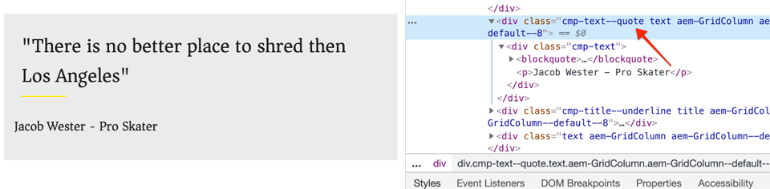
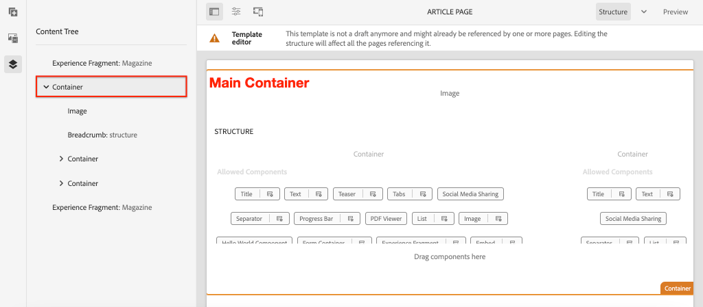

# Développement avec le système de style {#developing-with-the-style-system}

Découvrez comment mettre en oeuvre des styles individuels et réutiliser les composants principaux à l’aide de Experience Manager Style System. Ce didacticiel porte sur le développement du système de style afin d’étendre les composants principaux à l’aide de CSS propres à la marque et de configurations de stratégie avancées de l’éditeur de modèles.

## Conditions préalables {#prerequisites}

Examinez les outils et les instructions nécessaires pour configurer un [environnement de développement local](overview.md#local-dev-environment).

Il est également recommandé de consulter le didacticiel [Bibliothèques côté client et Flux de travaux frontaux](client-side-libraries.md) afin de comprendre les fondamentaux des bibliothèques côté client et les divers outils frontaux intégrés au projet AEM.

### Projet de démarrage

>[!NOTE]
>
> Si vous avez terminé avec succès le chapitre précédent, vous pouvez réutiliser le projet et ignorer les étapes permettant d&#39;extraire le projet de démarrage.

Consultez le code de ligne de base sur lequel le didacticiel s&#39;appuie :

1. Consultez la branche `tutorial/style-system-start` de [GitHub](https://github.com/adobe/aem-guides-wknd).

   ```shell
   $ cd aem-guides-wknd
   $ git checkout tutorial/style-system-start
   ```

1. Déployez la base de code sur une instance AEM locale en utilisant vos compétences Maven :

   ```shell
   $ mvn clean install -PautoInstallSinglePackage
   ```

   >[!NOTE]
   >
   > Si vous utilisez AEM 6.5 ou 6.4, ajoutez le profil `classic` aux commandes Maven.

   ```shell
   $ mvn clean install -PautoInstallSinglePackage -Pclassic
   ```

Vous pouvez toujours vue le code terminé sur [GitHub](https://github.com/adobe/aem-guides-wknd/tree/tutorial/style-system-solution) ou vérifier le code localement en passant à la branche `tutorial/style-system-solution`.

## Intention

1. Découvrez comment utiliser le système de style pour appliquer une page CSS spécifique à la marque à AEM composants principaux.
1. Découvrez la notation BEM et comment elle peut être utilisée pour définir soigneusement les styles.
1. Appliquez des configurations de stratégie avancées avec des modèles modifiables.

## Ce que vous allez créer {#what-you-will-build}

Dans ce chapitre, nous utiliserons la fonction [Système de style](https://docs.adobe.com/content/help/fr-FR/experience-manager-learn/sites/page-authoring/style-system-feature-video-use.html) pour créer des variantes des composants **Titre** et **Texte** utilisés sur la page Article.


*Style de soulignement disponible à utiliser pour le composant Titre*

## Arrière-plan {#background}

[Style System](https://docs.adobe.com/content/help/fr-FR/experience-manager-65/developing/components/style-system.html) permet aux développeurs et éditeurs de modèles de créer plusieurs variantes visuelles d&#39;un composant. Les auteurs peuvent ensuite décider quel style utiliser lors de la composition d’une page. Nous utiliserons le système de style tout au long du reste du didacticiel pour obtenir plusieurs styles uniques, tout en exploitant les composants de base dans une approche à code faible.

L&#39;idée générale avec le système de style est que les auteurs peuvent choisir différents styles de l&#39;aspect d&#39;un composant. Les &quot;styles&quot; sont soutenus par des classes CSS supplémentaires qui sont injectées dans la balise div externe d’un composant. Dans les bibliothèques clientes, les règles CSS sont ajoutées en fonction de ces classes de style afin que le composant change d’aspect.

Vous trouverez [la documentation détaillée de Style System ici](https://experienceleague.adobe.com/docs/experience-manager-cloud-service/sites/authoring/features/style-system.html). Il existe également une excellente [vidéo technique pour comprendre le système de style](https://experienceleague.adobe.com/docs/experience-manager-learn/sites/developing/style-system-technical-video-understand.html).

## Style de soulignement - Titre {#underline-style}

Le [composant Titre](https://experienceleague.adobe.com/docs/experience-manager-core-components/using/components/title.html) a été ajouté par proxy au projet sous `/apps/wknd/components/title` dans le cadre du module **ui.apps**. Les styles par défaut des éléments d&#39;en-tête (`H1`, `H2`, `H3`...) ont déjà été implémentés dans le module **ui.frontend**.

Les [conceptions d’article WKND](assets/pages-templates/wknd-article-design.xd) contiennent un style unique pour le composant Titre avec un trait de soulignement. Au lieu de créer deux composants ou de modifier la boîte de dialogue du composant, le système de style permet aux auteurs d’ajouter un style de soulignement.


### Annotation Titre Inspect

En tant que développeur frontal, la première étape pour mettre en forme un composant principal consiste à comprendre les balises générées par le composant.

1. Ouvrez un nouveau navigateur et vue le composant Titre sur le site AEM Core Component Library (Bibliothèque de composants principaux) : [https://www.aemcomponents.dev/content/core-components-examples/library/page-authoring/title.html](https://www.aemcomponents.dev/content/core-components-examples/library/page-authoring/title.html)

1. Vous trouverez ci-dessous l’annotation du composant Titre :

   ```html
   <div class="cmp-title">
       <h1 class="cmp-title__text">Lorem Ipsum</h1>
   </div>
   ```

   Notation BEM du composant de titre :

   ```plain
   BLOCK cmp-title
       ELEMENT cmp-title__text
   ```

1. Le système Style ajoute une classe CSS à la balise div externe entourant le composant. Par conséquent, les balises que nous ciblerons ressembleront à ce qui suit :

   ```html
   <div class="STYLE-SYSTEM-CLASS-HERE"> <!-- Custom CSS class - implementation gets to define this -->
       <div class="cmp-title">
           <h1 class="cmp-title__text">Lorem Ipsum</h1>
       </div>
   </div>
   ```

### Mise en oeuvre du style de soulignement - ui.frontend

Ensuite, implémentez le style Souligné en utilisant le module **ui.frontend** de notre projet. Nous utiliserons le serveur de développement webpack fourni avec le module **ui.frontend** pour prévisualisation les styles *avant* déploiement sur une instance locale d&#39;AEM.

1. Début du serveur de développement webpack en exécutant la commande suivante à partir du module **ui.frontend** :

   ```shell
   $ cd ~/code/aem-guides-wknd/ui.frontend/
   $ npm start
   
   > aem-maven-archetype@1.0.0 start code/aem-guides-wknd/ui.frontend
   > webpack-dev-server --open --config ./webpack.dev.js
   ```

   Vous devez ouvrir un navigateur à l’adresse [http://localhost:8080](http://localhost:8080).

   >[!NOTE]
   >
   > Si les images apparaissent rompues, vérifiez que le projet de démarrage a été déployé sur une instance locale d’AEM (s’exécutant sur le port 4502) et que le navigateur utilisé s’est également connecté à l’instance AEM locale.

   

1. Dans l&#39;IDE, ouvrez le fichier `index.html` situé à l&#39;emplacement suivant : `ui.frontend/src/main/webpack/static/index.html`. Il s’agit du balisage statique utilisé par le serveur de développement webpack.
1. Dans `index.html`, recherchez une instance du composant de titre à laquelle ajouter le style de soulignement en recherchant *cmp-title* dans le document. Choisissez le composant Titre avec le texte *&quot;Vans off the Wall Skatepark&quot;* (ligne 218). Ajoutez la classe `cmp-title--underline` à la balise div environnante :

   ```diff
   - <div class="title aem-GridColumn--phone--12 aem-GridColumn aem-GridColumn--default--8">
   + <div class="cmp-title--underline title aem-GridColumn--phone--12 aem-GridColumn aem-GridColumn--default--8">
        <div data-cmp-data-layer="{&#34;title-8bea562fa0&#34;:{&#34;@type&#34;:&#34;wknd/components/title&#34;,&#34;repo:modifyDate&#34;:&#34;2021-01-22T18:54:20Z&#34;,&#34;dc:title&#34;:&#34;Vans Off the Wall&#34;}}" id="title-8bea562fa0" class="cmp-title">
            <h2 class="cmp-title__text">Vans Off the Wall</h2>
        </div>
    </div>
   ```

1. Revenez au navigateur et vérifiez que la classe supplémentaire est reflétée dans l’annotation.
1. Revenez au module **ui.frontend** et mettez à jour le fichier `title.scss` situé à l&#39;emplacement suivant : `ui.frontend/src/main/webpack/components/_title.scss` :

   ```css
   /* Add Title Underline Style */
   .cmp-title--underline {
       .cmp-title__text {
           &:after {
           display: block;
               width: 84px;
               padding-top: 8px;
               content: '';
               border-bottom: 2px solid $brand-primary;
           }
       }
   }
   ```

   >[!NOTE]
   >
   >Il est recommandé de toujours lier étroitement les styles de portée au composant de cible. Ainsi, les styles supplémentaires n’affectent pas les autres zones de la page.
   >
   >Tous les composants principaux adhèrent à la notation **[BEM](https://github.com/adobe/aem-core-wcm-components/wiki/css-coding-conventions)**. Il est recommandé de cible de la classe CSS externe lors de la création d’un style par défaut pour un composant. Une autre bonne pratique consiste à cible les noms de classe spécifiés par la notation BEM du composant principal plutôt que par les éléments HTML.

1. Revenez à nouveau au navigateur et le style Souligné doit être ajouté :

   

1. Arrêtez le serveur de développement webpack.

### Ajouter une stratégie de titre

Ensuite, nous devons ajouter une nouvelle stratégie pour les composants Titre pour permettre aux auteurs de contenu de choisir le style Souligné à appliquer à des composants spécifiques. Pour ce faire, utilisez l’éditeur de modèles dans AEM.

1. Déployez la base de code sur une instance AEM locale à l’aide de vos compétences Maven :

   ```shell
   $ cd ~/code/aem-guides-wknd
   $ mvn clean install -PautoInstallSinglePackage
   ```

1. Accédez au modèle **Page de l&#39;article** situé à l&#39;adresse : [http://localhost:4502/editor.html/conf/wknd/settings/wcm/templates/article-page/structure.html](http://localhost:4502/editor.html/conf/wknd/settings/wcm/templates/article-page/structure.html)

1. En mode **Structure**, dans le Conteneur principal **Mise en page**, sélectionnez l&#39;icône **Stratégie** en regard du composant **Titre** répertorié sous *Composants autorisés* :

   

1. Créez une nouvelle stratégie pour le composant Titre avec les valeurs suivantes :

   *Titre de la politique ** :  **Titre WKND**

   *Propriétés*  > Onglet ** Styles >  *Ajouter un nouveau style*

   **Souligner**  :  `cmp-title--underline`

   

   Cliquez sur **Terminé** pour enregistrer les modifications apportées à la stratégie Titre.

   >[!NOTE]
   >
   > La valeur `cmp-title--underline` correspond à la classe CSS ciblée précédemment lors du développement dans le module **ui.frontend**.

### Appliquer le style de soulignement

Enfin, en tant qu’auteur, nous pouvons choisir d’appliquer le style Souligné à certains composants de titre.

1. Accédez à l&#39;article **La Skateparks** dans l&#39;éditeur AEM Sites à l&#39;adresse : [http://localhost:4502/editor.html/content/wknd/us/en/magazine/guide-la-skateparks.html](http://localhost:4502/editor.html/content/wknd/us/en/magazine/guide-la-skateparks.html)
1. En mode **Modifier**, choisissez un composant Titre. Cliquez sur l&#39;icône **pinceau** et sélectionnez le style **Souligné** :

   

   En tant qu’auteur, vous devez pouvoir activer/désactiver le style.

1. Cliquez sur l’icône **Informations sur la page** > **Vue telle que Publiée** pour inspecter la page en dehors de l’éditeur AEM.

   

   Utilisez les outils de développement de votre navigateur pour vérifier que la classe CSS `cmp-title--underline` appliquée à la balise externe div est affectée à la classe CSS du composant Title.

## Style de bloc de devis - Texte {#text-component}

Ensuite, répétez les étapes similaires pour appliquer un style unique au [composant de texte](https://experienceleague.adobe.com/docs/experience-manager-core-components/using/components/text.html). Le composant Text a été ajouté par proxy au projet sous `/apps/wknd/components/text` dans le cadre du module **ui.apps**. Les styles par défaut des éléments de paragraphe ont déjà été implémentés dans le fichier **ui.frontend**.

Les conceptions d’article [WKND](assets/pages-templates/wknd-article-design.xd) contiennent un style unique pour le composant Texte avec un bloc de guillemets :


### Inspect Text Component Markup

Une fois de plus, nous examinerons l&#39;annotation du composant de texte.

1. Vérifiez l’annotation du composant Texte à l’adresse suivante : [https://www.aemcomponents.dev/content/core-components-examples/library/page-authoring/text.html](https://www.aemcomponents.dev/content/core-components-examples/library/page-authoring/text.html)

1. Voici le balisage du composant Texte :

   ```html
   <div class="text">
       <div class="cmp-text" data-cmp-data-layer="{&quot;text-2d9d50c5a7&quot;:{&quot;@type&quot;:&quot;core/wcm/components/text/v2/text&quot;,&quot;repo:modifyDate&quot;:&quot;2019-01-22T11:56:17Z&quot;,&quot;xdm:text&quot;:&quot;<p>Lorem ipsum dolor sit amet, consectetur adipiscing elit, sed do eiusmod tempor incididunt ut labore et dolore magna aliqua. Eu mi bibendum neque egestas congue quisque egestas. Varius morbi enim nunc faucibus a pellentesque. Scelerisque eleifend donec pretium vulputate sapien nec sagittis.</p>\n&quot;}}" id="text-2d9d50c5a7">
           <p>Lorem ipsum dolor sit amet, consectetur adipiscing elit, sed do eiusmod tempor incididunt ut labore et dolore magna aliqua. Eu mi bibendum neque egestas congue quisque egestas. Varius morbi enim nunc faucibus a pellentesque. Scelerisque eleifend donec pretium vulputate sapien nec sagittis.</p>
       </div>
   </div>
   ```

   Notation BEM du composant de texte :

   ```plain
   BLOCK cmp-text
       ELEMENT
   ```

1. Le système Style ajoute une classe CSS à la balise div externe entourant le composant. Par conséquent, les balises que nous ciblerons ressembleront à ce qui suit :

   ```html
   <div class="text STYLE-SYSTEM-CLASS-HERE"> <!-- Custom CSS class - implementation gets to define this -->
       <div class="cmp-text" data-cmp-data-layer="{&quot;text-2d9d50c5a7&quot;:{&quot;@type&quot;:&quot;core/wcm/components/text/v2/text&quot;,&quot;repo:modifyDate&quot;:&quot;2019-01-22T11:56:17Z&quot;,&quot;xdm:text&quot;:&quot;<p>Lorem ipsum dolor sit amet, consectetur adipiscing elit, sed do eiusmod tempor incididunt ut labore et dolore magna aliqua. Eu mi bibendum neque egestas congue quisque egestas. Varius morbi enim nunc faucibus a pellentesque. Scelerisque eleifend donec pretium vulputate sapien nec sagittis.</p>\n&quot;}}" id="text-2d9d50c5a7">
           <p>Lorem ipsum dolor sit amet, consectetur adipiscing elit, sed do eiusmod tempor incididunt ut labore et dolore magna aliqua. Eu mi bibendum neque egestas congue quisque egestas. Varius morbi enim nunc faucibus a pellentesque. Scelerisque eleifend donec pretium vulputate sapien nec sagittis.</p>
       </div>
   </div>
   ```

### Mise en oeuvre du style de bloc de devis - ui.frontend

Nous allons ensuite mettre en oeuvre le style Bloc de devis en utilisant le module **ui.frontend** de notre projet.

1. Début du serveur de développement webpack en exécutant la commande suivante à partir du module **ui.frontend** :

   ```shell
   $ cd ~/code/aem-guides-wknd/ui.frontend/
   $ npm start
   ```

1. Dans l&#39;IDE, ouvrez le fichier `index.html` situé à l&#39;emplacement suivant : `ui.frontend/src/main/webpack/static/index.html`.
1. Dans `index.html`, recherchez une instance du composant de texte en recherchant le texte *&quot;Jacob Wester&quot;* (ligne 210). Ajoutez la classe `cmp-text--quote` à la balise div environnante :

   ```diff
   - <div class="text aem-GridColumn--phone--12 aem-GridColumn aem-GridColumn--default--8">
   + <div class="cmp-text--quote text aem-GridColumn--phone--12 aem-GridColumn aem-GridColumn--default--8">
        <div data-cmp-data-layer="{&#34;text-a15f39a83a&#34;:{&#34;@type&#34;:&#34;wknd/components/text&#34;,&#34;repo:modifyDate&#34;:&#34;2021-01-22T00:23:27Z&#34;,&#34;xdm:text&#34;:&#34;&lt;blockquote>&amp;quot;There is no better place to shred then Los Angeles.”&lt;/blockquote>\r\n&lt;p>- Jacob Wester, Pro Skater&lt;/p>\r\n&#34;}}" id="text-a15f39a83a" class="cmp-text">
            <blockquote>&quot;There is no better place to shred then Los Angeles.”</blockquote>
            <p>- Jacob Wester, Pro Skater</p>
        </div>
    </div>
   ```

1. Mettez à jour le fichier `text.scss` situé à l&#39;adresse : `ui.frontend/src/main/webpack/components/_text.scss` :

   ```css
   /* WKND Text Quote style */
   .cmp-text--quote {
       .cmp-text {
           background-color: $brand-third;
           margin: 1em 0em;
           padding: 1em;
   
           blockquote {
               border: none;
               font-size: $font-size-large;
               font-family: $font-family-serif;
               padding: 14px 14px;
               margin: 0;
               margin-bottom: 0.5em;
   
               &:after {
                   border-bottom: 2px solid $brand-primary; /*yellow border */
                   content: '';
                   display: block;
                   position: relative;
                   top: 0.25em;
                   width: 80px;
               }
           }
           p {
               font-family:  $font-family-serif;
           }
       }
   }
   ```

   >[!CAUTION]
   >
   > Dans ce cas, les éléments HTML bruts sont ciblés par les styles. En effet, le composant Texte fournit un éditeur de texte enrichi aux auteurs de contenu. La création de styles directement par rapport au contenu RTE doit être faite avec soin et il est encore plus important de définir les styles de manière stricte.

1. Revenez à nouveau au navigateur et le style de bloc Devis doit être ajouté :

   

1. Arrêtez le serveur de développement webpack.

### Ajouter une stratégie de texte

Ajoutez ensuite une nouvelle stratégie pour les composants de texte.

1. Déployez la base de code sur une instance AEM locale en utilisant vos compétences Maven :

   ```shell
   $ cd ~/code/aem-guides-wknd
   $ mvn clean install -PautoInstallSinglePackage
   ```

1. Accédez au **Modèle de page d’article** situé à l’adresse : [http://localhost:4502/editor.html/conf/wknd/settings/wcm/templates/article-page/structure.html](http://localhost:4502/editor.html/conf/wknd/settings/wcm/templates/article-page/structure.html)).

1. En mode **Structure**, dans le Conteneur principal **Mise en page**, sélectionnez l&#39;icône **Stratégie** en regard du composant **Texte** répertorié sous *Composants autorisés* :

   

1. Mettez à jour la stratégie du composant de texte avec les valeurs suivantes :

   *Titre de la politique ** :  **Texte du contenu**

   *Plugins* > Styles *de* paragraphe>  *Activer les styles de paragraphe*

   *Onglet*  Styles >  *Ajouter un nouveau style*

   **Bloc**  de devis :  `cmp-text--quote`

   

   

   Cliquez sur **Terminé** pour enregistrer les modifications apportées à la stratégie Texte.

### Appliquer le style de bloc de devis

1. Accédez à l&#39;article **La Skateparks** dans l&#39;éditeur AEM Sites à l&#39;adresse : [http://localhost:4502/editor.html/content/wknd/us/en/magazine/guide-la-skateparks.html](http://localhost:4502/editor.html/content/wknd/us/en/magazine/guide-la-skateparks.html)
1. En mode **Modifier**, choisissez un composant Texte. Modifiez le composant pour inclure un élément de devis :

   

1. Sélectionnez le composant de texte, cliquez sur l&#39;icône **pinceau** et sélectionnez le style **Bloc de devis** :

   

   En tant qu’auteur, vous devez pouvoir activer/désactiver le style.

## Largeur fixe - Conteneur (Bonus) {#layout-container}

Les composants de conteneur ont été utilisés pour créer la structure de base du modèle de page d’article et fournir les zones de dépôt aux auteurs de contenu pour ajouter du contenu sur une page. Les conteneurs peuvent également tirer parti du système de style, offrant aux créateurs de contenu davantage d’options pour la conception de mises en page.

Le **Conteneur principal** du modèle Page de l’article contient les deux conteneurs pouvant être créés et a une largeur fixe.



*Conteneur principal dans le modèle* de page d’article.

La stratégie du **Conteneur principal** définit l&#39;élément par défaut comme `main` :


Le CSS qui fixe le **Conteneur principal** est défini dans le module **ui.frontend** à `ui.frontend/src/main/webpack/site/styles/container_main.scss` :

```SCSS
main.container {
    padding: .5em 1em;
    max-width: $max-content-width;
    float: unset!important;
    margin: 0 auto!important;
    clear: both!important;
}
```

Au lieu de cibler l’élément HTML `main`, le système de style peut être utilisé pour créer un style **Largeur fixe** dans le cadre de la stratégie de Conteneur. Le système de style permet aux utilisateurs de basculer entre les conteneurs **Largeur fixe** et **Largeur fluide**.

1. **Défi**  Bonus : utilisez les leçons tirées des exercices précédents et utilisez le Système de style pour mettre en oeuvre un  **modèle de** largeur de  **fluide** fixe pour le composant Conteneur.

## Félicitations! {#congratulations}

Félicitations, la page d&#39;article est presque entièrement stylisée et vous avez acquis une expérience pratique en utilisant le système de style AEM.

### Étapes suivantes {#next-steps}

Découvrez les étapes de bout en bout pour créer un [composant d&#39;AEM personnalisé](custom-component.md) qui affiche le contenu créé dans une boîte de dialogue et explore le développement d&#39;un modèle Sling pour encapsuler la logique métier qui renseigne le code HTML du composant.

Vue le code terminé sur [GitHub](https://github.com/adobe/aem-guides-wknd) ou passez en revue et déployez le code localement sur la brach Git `tutorial/style-system-solution`.

1. Cloner le référentiel [github.com/adobe/aem-wknd-guides](https://github.com/adobe/aem-guides-wknd).
1. Consultez la branche `tutorial/style-system-solution`.
