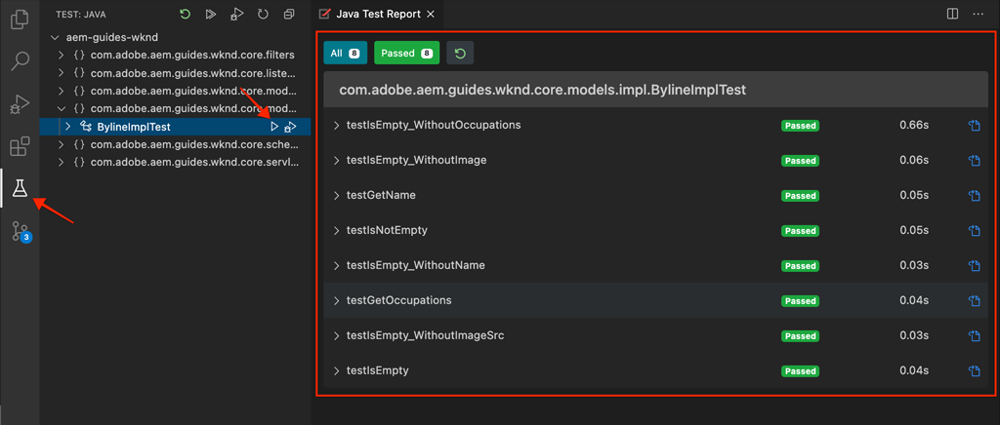

# Test unitaire {#unit-testing}

Ce didacticiel porte sur l&#39;implémentation d&#39;un test unitaire qui valide le comportement du modèle Sling du composant Byline, créé dans le [composant personnalisé](./custom-component.md) didacticiel.

## Conditions préalables {#prerequisites}

Examinez les outils et les instructions nécessaires pour configurer un [environnement de développement local](overview.md#local-dev-environment).

_Si Java 8 et Java 11 sont tous deux installés sur le système, le programme d&#39;exécution du test VS Code peut choisir le moins d&#39;exécution Java lors de l&#39;exécution des tests, ce qui entraîne des échecs de test. Si cela se produit, désinstallez Java 8._

### Projet de démarrage

>[!NOTE]
>
> Si vous avez terminé avec succès le chapitre précédent, vous pouvez réutiliser le projet et ignorer les étapes permettant d&#39;extraire le projet de démarrage.

Consultez le code de ligne de base sur lequel le didacticiel s&#39;appuie :

1. Consultez la branche `tutorial/unit-testing-start` de [GitHub](https://github.com/adobe/aem-guides-wknd).

   ```shell
   $ cd aem-guides-wknd
   $ git checkout tutorial/unit-testing-start
   ```

1. Déployez la base de code sur une instance AEM locale en utilisant vos compétences Maven :

   ```shell
   $ mvn clean install -PautoInstallSinglePackage
   ```

   >[!NOTE]
   >
   > Si vous utilisez AEM 6.5 ou 6.4, ajoutez le profil `classic` aux commandes Maven.

   ```shell
   $ mvn clean install -PautoInstallSinglePackage -Pclassic
   ```

Vous pouvez toujours vue le code terminé sur [GitHub](https://github.com/adobe/aem-guides-wknd/tree/tutorial/unit-testing-start) ou vérifier le code localement en passant à la branche `tutorial/unit-testing-start`.

## Intention

1. Comprendre les principes de base des tests unitaires.
1. Découvrez les structures et les outils couramment utilisés pour tester AEM code.
1. Comprendre les options permettant de simuler ou de moquer les ressources AEM lors de la rédaction de tests unitaires.

## Arrière-plan {#unit-testing-background}

Dans ce didacticiel, nous allons explorer comment écrire [Tests d&#39;unité](https://en.wikipedia.org/wiki/Unit_testing) pour le [modèle Sling](https://sling.apache.org/documentation/bundles/models.html) de notre composant Byline (créé dans le [Création d&#39;un composant d&#39;AEM personnalisé](custom-component.md)). Les tests unitaires sont des tests de génération écrits en Java qui vérifient le comportement attendu du code Java. Chaque unité de test est généralement petite et valide la sortie d&#39;une méthode (ou d&#39;unités de travail) par rapport aux résultats attendus.

Nous utiliserons AEM pratiques exemplaires et utiliserons :

* [JUnit 5](https://junit.org/junit5/)
* [Cadre de test de Mockito](https://site.mockito.org/)
* [wcm.io Test Framework](https://wcm.io/testing/)  (qui s&#39;appuie sur  [Apache Sling Mocks](https://sling.apache.org/documentation/development/sling-mock.html))

## Gestion des tests unitaires et de l’Adobe Cloud Manager {#unit-testing-and-adobe-cloud-manager}

[Adobe Cloud ](https://docs.adobe.com/content/help/fr-FR/experience-manager-cloud-manager/using/introduction-to-cloud-manager.html) Manager intègre l’exécution de tests unitaires et la couverture de  [code ](https://docs.adobe.com/content/help/en/experience-manager-cloud-manager/using/how-to-use/understand-your-test-results.html#code-quality-testing) dans son pipeline CI/CD afin d’encourager et de promouvoir les meilleures pratiques de l’AEM de test unitaire.

Bien que le code de test d’unité soit une bonne pratique pour toute base de code, il est important, lors de l’utilisation de Cloud Manager, de tirer parti de ses fonctionnalités de test de qualité de code et de rapports en fournissant des tests d’unité à exécuter par Cloud Manager.

## Inspect : dépendances du test Maven {#inspect-the-test-maven-dependencies}

La première étape est d&#39;inspecter les dépendances de Maven pour prendre en charge l&#39;écriture et l&#39;exécution des tests. Quatre dépendances sont requises :

1. JUnit5
1. Cadre de test de Mockito
1. Apache Sling Mocks
1. Cadre de test de AEM Mocks (par io.wcm)

Les dépendances de test **JUnit5**, **Mockito** et **AEM Mocks** sont automatiquement ajoutées au projet lors de la configuration à l&#39;aide de l&#39;archétype [AEM Maven](project-setup.md).

1. Pour vue de ces dépendances, ouvrez le POM du réacteur parent à l&#39;adresse **aem-guides-wknd/pom.xml**, accédez à `<dependencies>..</dependencies>` et assurez-vous que les dépendances suivantes sont définies :

   ```xml
   <dependencies>
       ...       
       <!-- Testing -->
       <dependency>
           <groupId>org.junit</groupId>
           <artifactId>junit-bom</artifactId>
           <version>5.6.2</version>
           <type>pom</type>
           <scope>import</scope>
       </dependency>
       <dependency>
           <groupId>org.mockito</groupId>
           <artifactId>mockito-core</artifactId>
           <version>3.3.3</version>
           <scope>test</scope>
       </dependency>
       <dependency>
           <groupId>org.mockito</groupId>
           <artifactId>mockito-junit-jupiter</artifactId>
           <version>3.3.3</version>
           <scope>test</scope>
       </dependency>
       <dependency>
           <groupId>junit-addons</groupId>
           <artifactId>junit-addons</artifactId>
           <version>1.4</version>
           <scope>test</scope>
       </dependency>
       <dependency>
           <groupId>io.wcm</groupId>
           <artifactId>io.wcm.testing.aem-mock.junit5</artifactId>
           <!-- Prefer the latest version of AEM Mock Junit5 dependency -->
           <version>3.0.2</version>
           <scope>test</scope>
       </dependency>        
       ...
   </dependencies>
   ```

1. Ouvrez **aem-guides-wknd/core/pom.xml** et vue que les dépendances de test correspondantes sont disponibles :

   ```xml
   ...
   <!-- Testing -->
   <dependency>
       <groupId>org.junit.jupiter</groupId>
       <artifactId>junit-jupiter</artifactId>
       <scope>test</scope>
   </dependency>
   <dependency>
       <groupId>org.mockito</groupId>
       <artifactId>mockito-core</artifactId>
       <scope>test</scope>
   </dependency>
   <dependency>
       <groupId>org.mockito</groupId>
       <artifactId>mockito-junit-jupiter</artifactId>
       <scope>test</scope>
   </dependency>
   <dependency>
       <groupId>junit-addons</groupId>
       <artifactId>junit-addons</artifactId>
       <scope>test</scope>
   </dependency>
   <dependency>
       <groupId>io.wcm</groupId>
       <artifactId>io.wcm.testing.aem-mock.junit5</artifactId>
       <exclusions>
           <exclusion>
               <groupId>org.apache.sling</groupId>
               <artifactId>org.apache.sling.models.impl</artifactId>
           </exclusion>
           <exclusion>
               <groupId>org.slf4j</groupId>
               <artifactId>slf4j-simple</artifactId>
           </exclusion>
       </exclusions>
       <scope>test</scope>
   </dependency>
   <!-- Required to be able to support injection with @Self and @Via -->
   <dependency>
       <groupId>org.apache.sling</groupId>
       <artifactId>org.apache.sling.models.impl</artifactId>
       <version>1.4.4</version>
       <scope>test</scope>
   </dependency>
   ...
   ```

   Un dossier source parallèle dans le projet **core** contiendra les tests unitaires et les fichiers de test pris en charge. Ce dossier **test** permet de séparer les classes de test du code source, mais permet aux tests d&#39;agir comme s&#39;ils vivaient dans les mêmes packages que le code source.

## Création du test JUnit {#creating-the-junit-test}

Les tests unitaires font généralement correspondre 1 à 1 avec les classes Java. Dans ce chapitre, nous allons écrire un test JUnit pour le **BylineImpl.java**, qui est le modèle Sling qui prend en charge le composant Byline.


*Emplacement de stockage des tests unitaires.*

1. Créez un test unitaire pour `BylineImpl.java` en créant une nouvelle classe Java sous `src/test/java` dans une structure de dossiers de package Java qui reflète l&#39;emplacement de la classe Java à tester.

   

   Puisque nous testons

   * `src/main/java/com/adobe/aem/guides/wknd/core/models/impl/BylineImpl.java`

   créer la classe Java de test unitaire correspondante à

   * `src/test/java/com/adobe/aem/guides/wknd/core/models/impl/BylineImplTest.java`

2. Mais aussi, différencier le fichier d&#39;essai    Le suffixe `Test` du fichier de test unitaire, `BylineImplTest.java` est une convention qui nous permet de
1. Identifiez-le facilement en tant que fichier de test _pour_ `BylineImpl.java`
2. Mais aussi, différencier le fichier de test _de_ la classe testée, `BylineImpl.java`

## Vérification de BylineImplTest.java {#reviewing-bylineimpltest-java}

A ce stade, le fichier de test JUnit est une classe Java vide. Mettez à jour le fichier avec le code suivant :

```java
package com.adobe.aem.guides.wknd.core.models.impl;

import static org.junit.jupiter.api.Assertions.*;

import org.junit.jupiter.api.BeforeEach;
import org.junit.jupiter.api.Test;

public class BylineImplTest {

    @BeforeEach
    void setUp() throws Exception {

    }

    @Test 
    void testGetName() { 
        fail("Not yet implemented");
    }
    
    @Test 
    void testGetOccupations() { 
        fail("Not yet implemented");
    }

    @Test 
    void testIsEmpty() { 
        fail("Not yet implemented");
    }
}
```

1. La première méthode `public void setUp() { .. }` est annotée avec l&#39;élément `@BeforeEach` de JUnit, qui demande au programme d&#39;exécution de test de JUnit d&#39;exécuter cette méthode avant d&#39;exécuter chaque méthode de test de cette classe. Vous disposez ainsi d’un emplacement pratique pour initialiser l’état de test commun requis par tous les tests.

2. Les méthodes suivantes sont les méthodes de test, dont les noms sont précédés de `test` par convention et marqués de l&#39;annotation `@Test`. Notez que par défaut, tous nos tests sont définis pour échouer, car nous ne les avons pas encore mis en oeuvre.

   Pour commencer, nous avons début avec une méthode de test unique pour chaque méthode publique sur la classe que nous testons, de sorte que :

   | BylineImpl.java |  | BylineImplTest.java |
   | ------------------|--------------|---------------------|
   | getName() | est testé par | testGetName() |
   | getOccupations() | est testé par | testGetOccupations() |
   | isEmpty() | est testé par | testIsEmpty() |

   Ces méthodes peuvent être développées au besoin, comme nous le verrons plus loin dans ce chapitre.

   Lorsque cette classe de test JUnit (également appelée Cas de test JUnit) est exécutée, chaque méthode marquée par le `@Test` s&#39;exécute comme un test qui peut réussir ou échouer.


*`core/src/test/java/com/adobe/aem/guides/wknd/core/models/impl/BylineImplTest.java`*

1. Exécutez la boîte de test JUnit en cliquant avec le bouton droit sur le fichier `BylineImplTest.java` et en appuyant sur **Exécuter**.
Comme prévu, tous les tests échouent, car ils n&#39;ont pas encore été mis en oeuvre.

   

   *Cliquez avec le bouton droit sur BylineImplTests.java > Exécuter.*

## Révision de BylineImpl.java {#reviewing-bylineimpl-java}

Lors de la rédaction de tests unitaires, il existe deux approches Principales :

* [TDD ou Test Driven Development](https://en.wikipedia.org/wiki/Test-driven_development), qui implique la rédaction progressive des tests unitaires, immédiatement avant l&#39;élaboration de la mise en oeuvre ; écrivez un test, écrivez la mise en oeuvre pour réussir le test.
* Développement de la mise en oeuvre d&#39;abord, ce qui implique de développer d&#39;abord le code de travail, puis d&#39;écrire des tests qui valident ledit code.

Dans ce didacticiel, la dernière approche est utilisée (puisque nous avons déjà créé un **BylineImpl.java** fonctionnel dans un chapitre précédent). C&#39;est pourquoi nous devons examiner et comprendre le comportement de ses méthodes publiques, mais aussi certains détails de sa mise en oeuvre. Cela peut sembler contraire, puisqu&#39;un bon test ne devrait se préoccuper que des intrants et des extrants, mais lorsqu&#39;on travaille en AEM, il y a toute une gamme de considérations d&#39;implémentation qui doivent être comprises pour construire des tests de travail.

Dans le contexte de l&#39;AEM, la TDD exige un niveau d&#39;expertise et est mieux adoptée par AEM développeurs compétents en développement de l&#39;AEM et des tests unitaires du code .

## Configuration du contexte de test AEM {#setting-up-aem-test-context}

La plupart du code écrit pour l’AEM repose sur les API JCR, Sling ou AEM, ce qui nécessite à son tour le contexte d’un  en cours d’exécution pour s’exécuter correctement.

Les tests unitaires étant exécutés lors de la création, en dehors du contexte d’une instance AEM en cours d’exécution, il n’existe aucun contexte de ce type. Pour faciliter cela, les AEM Mocks](https://wcm.io/testing/aem-mock/usage.html) de [wcm.io créent un contexte fictif qui permet à ces API d&#39;_agir en grande partie_ comme si elles s&#39;exécutaient en AEM.

1. Créez un contexte AEM à l&#39;aide de **wcm.io&#39;s** `AemContext` dans **BylineImplTest.java** en l&#39;ajoutant en tant qu&#39;extension JUnit décorée de `@ExtendWith` au fichier **BylineImplTest.java**. L&#39;extension prend en charge toutes les tâches d&#39;initialisation et de nettoyage requises. Créez une variable de classe pour `AemContext` qui peut être utilisée pour toutes les méthodes de test.

   ```java
   import org.junit.jupiter.api.extension.ExtendWith;
   import io.wcm.testing.mock.aem.junit5.AemContext;
   import io.wcm.testing.mock.aem.junit5.AemContextExtension;
   ...
   
   @ExtendWith(AemContextExtension.class)
   class BylineImplTest {
   
       private final AemContext ctx = new AemContext();
   ```

   Cette variable, `ctx`, expose un contexte AEM fictif qui fournit un certain nombre d’abstractions AEM et Sling :

   * Le modèle BylineImpl Sling sera enregistré dans ce contexte
   * Les structures de contenu JCR fictives sont créées dans ce contexte.
   * Les services OSGi personnalisés peuvent être enregistrés dans ce contexte
   * Fournit une variété d’objets fictifs et d’assistants courants requis tels que des objets SlingHttpServletRequest, une variété de services Sling et OSGi AEM tels que ModelFactory, PageManager, Page, Template, ComponentManager, Component, TagManager, TagManager, etc.
      * *Notez que toutes les méthodes de ces objets ne sont pas implémentées !*
   * Et [beaucoup plus](https://wcm.io/testing/aem-mock/usage.html) !

   L&#39;objet **`ctx`** servira de point d&#39;entrée pour la majeure partie de notre simulacre de contexte.

1. Dans la méthode `setUp(..)`, exécutée avant chaque méthode `@Test`, définissez un état de test fictif commun :

   ```java
   @BeforeEach
   public void setUp() throws Exception {
       ctx.addModelsForClasses(BylineImpl.class);
       ctx.load().json("/com/adobe/aem/guides/wknd/core/models/impl/BylineImplTest.json", "/content");
   }
   ```

   * **`addModelsForClasses`** enregistre le modèle Sling à tester, dans le contexte AEM fictif, afin qu’il puisse être instancié dans les  `@Test` méthodes.
   * **`load().json`** charge les structures de ressources dans le contexte fictif, ce qui permet au code d&#39;interagir avec ces ressources comme si elles étaient fournies par un référentiel réel. Les définitions de ressources dans le fichier **`BylineImplTest.json`** sont chargées dans le contexte simulé du JCR sous **/content**.
   * **`BylineImplTest.json`** n&#39;existe pas encore, existe, alors créons-le et définissons les structures de ressources JCR nécessaires pour le test.

1. Les fichiers JSON qui représentent les structures de ressources fictives sont stockés sous **core/src/test/resources** après le même cheminement de package que le fichier de test Java JUnit.

   Créez un fichier JSON à l’adresse **core/test/resources/com/adobe/aem/guides/wknd/core/models/impl** nommé **BylineImplTest.json** avec le contenu suivant :

   ```json
   {
       "byline": {
       "jcr:primaryType": "nt:unstructured",
       "sling:resourceType": "wknd/components/content/byline"
       }
   }
   ```

   

   Ce JSON définit une ressource fictive (noeud JCR) pour le test d’unité du composant Byline. À ce stade, le JSON dispose du jeu minimum de propriétés nécessaires pour représenter une ressource de contenu de composant Byline, les `jcr:primaryType` et `sling:resourceType`.

   Lors de l’utilisation de tests unitaires, une règle générale consiste à créer l’ensemble minimal de contenus fictifs, de contexte et de code requis pour satisfaire chaque test. Evitez la tentation de créer un contexte fictif complet avant d&#39;écrire les tests, car cela donne souvent des artefacts inutiles.

   Maintenant que **BylineImplTest.json** existe, lorsque `ctx.json("/com/adobe/aem/guides/wknd/core/models/impl/BylineImplTest.json", "/content")` est exécuté, les définitions de ressources fictives sont chargées dans le contexte à l&#39;emplacement **/content.**

## Test de getName() {#testing-get-name}

Maintenant que nous disposons d&#39;une configuration de contexte fictive de base, écrivons notre premier test pour **getName()** de BylineImpl. Ce test doit s&#39;assurer que la méthode **getName()** renvoie le nom écrit correct stocké à la propriété &quot;**name&quot;** de la ressource.

1. Mettez à jour la méthode **testGetName**() dans **BylineImplTest.java** comme suit :

   ```java
   import com.adobe.aem.guides.wknd.core.components.Byline;
   ...
   @Test
   public void testGetName() {
       final String expected = "Jane Doe";
   
       ctx.currentResource("/content/byline");
       Byline byline = ctx.request().adaptTo(Byline.class);
   
       String actual = byline.getName();
   
       assertEquals(expected, actual);
   }
   ```

   * **`String expected`** définit la valeur attendue. Nous allons définir cette valeur sur &quot;**Jane Done**&quot;.
   * **`ctx.currentResource`** définit le contexte de la ressource fictive pour évaluer le code par rapport à, de sorte qu&#39;elle soit définie sur  **/content/** bylineas où la ressource de contenu fictive est chargée.
   * **`Byline byline`** instancie le modèle Sling de signature en l’adaptant à partir de l’objet Request simulé.
   * **`String actual`** invoque la méthode que nous testons,  `getName()`sur l’objet Modèle Sling de signature.
   * **`assertEquals`** affirme que la valeur attendue correspond à la valeur renvoyée par l’objet de modèle Sling de signature. Si ces valeurs ne sont pas égales, le test échoue.

1. Exécutez le test... et échoue avec un `NullPointerException`.

   Notez que ce test n’échoue PAS car nous n’avons jamais défini de propriété `name` dans le simulateur JSON, qui provoquera l’échec du test, mais l’exécution du test n’est pas arrivée à ce point ! Ce test échoue en raison d&#39;un `NullPointerException` sur l&#39;objet de ligne jaune lui-même.

1. Dans `BylineImpl.java`, si `@PostConstruct init()` renvoie une exception, le modèle Sling n’est pas instancié et l’objet de modèle Sling est nul.

   ```java
   @PostConstruct
   private void init() {
       image = modelFactory.getModelFromWrappedRequest(request, request.getResource(), Image.class);
   }
   ```

   Il s&#39;avère que bien que le service OSGi ModelFactory soit fourni via `AemContext` (par le contexte Apache Sling), toutes les méthodes ne sont pas implémentées, y compris `getModelFromWrappedRequest(...)` qui est appelé dans la méthode `init()` de BylineImpl. Ceci provoque l’échec de [AbstractMethodError](https://docs.oracle.com/en/java/javase/11/docs/api/java.base/java/lang/AbstractMethodError.html), ce qui entraîne l’échec de `init()` dans le terme, et l’adaptation résultante de `ctx.request().adaptTo(Byline.class)` est un objet null.

   Puisque les moquettes fournies ne peuvent pas s&#39;adapter à notre code, nous devons mettre en oeuvre le contexte fictif nous-mêmes Pour cela, nous pouvons utiliser Mockito pour créer un objet ModelFactory fictif, qui renvoie un objet Image fictif lorsque `getModelFromWrappedRequest(...)` est appelé dessus.

   Puisque pour pouvoir instancier le modèle Byline Sling, ce contexte fictif doit être en place, nous pouvons l&#39;ajouter à la méthode `@Before setUp()`. Nous devons également ajouter `MockitoExtension.class` à l&#39;annotation `@ExtendWith` au-dessus de la classe **BylineImplTest**.

   ```java
   package com.adobe.aem.guides.wknd.core.models.impl;
   
   import org.mockito.junit.jupiter.MockitoExtension;
   import org.mockito.Mock;
   
   import com.adobe.aem.guides.wknd.core.models.Byline;
   import com.adobe.cq.wcm.core.components.models.Image;
   
   import io.wcm.testing.mock.aem.junit5.AemContext;
   import io.wcm.testing.mock.aem.junit5.AemContextExtension;
   
   import org.apache.sling.models.factory.ModelFactory;
   import org.junit.jupiter.api.BeforeEach;
   import org.junit.jupiter.api.Test;
   import org.junit.jupiter.api.extension.ExtendWith;
   
   import static org.junit.jupiter.api.Assertions.*;
   import static org.mockito.Mockito.*;
   import org.apache.sling.api.resource.Resource;
   
   @ExtendWith({ AemContextExtension.class, MockitoExtension.class })
   public class BylineImplTest {
   
       private final AemContext ctx = new AemContext();
   
       @Mock
       private Image image;
   
       @Mock
       private ModelFactory modelFactory;
   
       @BeforeEach
       public void setUp() throws Exception {
           ctx.addModelsForClasses(BylineImpl.class);
   
           ctx.load().json("/com/adobe/aem/guides/wknd/core/models/impl/BylineImplTest.json", "/content");
   
           lenient().when(modelFactory.getModelFromWrappedRequest(eq(ctx.request()), any(Resource.class), eq(Image.class)))
                   .thenReturn(image);
   
           ctx.registerService(ModelFactory.class, modelFactory, org.osgi.framework.Constants.SERVICE_RANKING,
                   Integer.MAX_VALUE);
       }
   
       @Test
       void testGetName() { ...
   }
   ```

   * **`@ExtendWith({AemContextExtension.class, MockitoExtension.class})`** marque la classe de cas de test à exécuter avec l&#39; [extension JUnit Jupiter de ](https://www.javadoc.io/page/org.mockito/mockito-junit-jupiter/latest/org/mockito/junit/jupiter/MockitoExtension.html) Mockito qui permet l&#39;utilisation des annotations @Mock pour définir des objets fictifs au niveau de la classe.
   * **`@Mock private Image`** crée un objet fictif de type  `com.adobe.cq.wcm.core.components.models.Image`. Notez que cette variable est définie au niveau de la classe afin que, si nécessaire, les méthodes `@Test` puissent modifier son comportement en fonction des besoins.
   * **`@Mock private ModelFactory`** crée un objet fictif de type ModelFactory. Notez qu&#39;il s&#39;agit d&#39;une pure imposture de Mockito et qu&#39;aucune méthode n&#39;y est appliquée. Notez que cette variable est définie au niveau de la classe afin que, si nécessaire, les méthodes `@Test`puissent modifier son comportement en fonction des besoins.
   * **`when(modelFactory.getModelFromWrappedRequest(..)`** enregistre le comportement fictif pour le moment  `getModelFromWrappedRequest(..)` d&#39;appel sur l&#39;objet modelFactory. Le résultat défini dans `thenReturn (..)` est de renvoyer l’objet image simulé. Notez que ce comportement n’est invoqué que lorsque : le premier paramètre est égal à l&#39;objet de requête de `ctx`, le deuxième paramètre est tout objet Resource et le troisième paramètre doit être la classe Image des composants principaux. Nous acceptons toute ressource car, tout au long de nos tests, nous allons définir `ctx.currentResource(...)` sur diverses ressources fictives définies dans le **BylineImplTest.json**. Notez que nous ajoutons la rigueur **clémence()** parce que nous voudrons plus tard remplacer ce comportement de ModelFactory.
   * **`ctx.registerService(..)`.** enregistre l’objet modelFactory dans AemContext, avec le meilleur classement de service. Cela est nécessaire, car le ModelFactory utilisé dans le champ `init()` de BylineImpl est injecté via le champ `@OSGiService ModelFactory model`. Pour qu&#39;AemContext puisse injecter **notre** objet simulé, qui gère les appels à `getModelFromWrappedRequest(..)`, nous devons l&#39;enregistrer comme le service de rang le plus élevé de ce type (ModelFactory).

1. Réexécutez le test, et une fois de plus il échoue, mais cette fois le message est clair pourquoi il a échoué.

   

   *échec de testGetName() en raison d&#39;une assertion*

   Nous recevons une erreur **AssertionError**, ce qui signifie que la condition d&#39;affirmation dans le test a échoué, et elle nous indique que la valeur **attendue est &quot;Jane Doe&quot;** mais que la valeur **réelle est nulle**. Cela est logique, car la propriété &quot;**name&quot;** n&#39;a pas été ajoutée à la définition de ressource mock **/content/byline** dans **BylineImplTest.json**, alors ajoutons-la :

1. Mettre à jour **BylineImplTest.json** pour définir `"name": "Jane Doe".`

   ```json
   {
       "byline": {
       "jcr:primaryType": "nt:unstructured",
       "sling:resourceType": "wknd/components/content/byline",
       "name": "Jane Doe"
       }
   }
   ```

1. Réexécutez le test et **`testGetName()`** réussit maintenant !

   


## Test de getOccupations() {#testing-get-occupations}

Très bien ! Notre premier test a réussi ! Passons à l&#39;étape suivante et testons `getOccupations()`. Puisque l&#39;initialisation du contexte fictif a été effectuée dans la méthode `@Before setUp()`, elle sera disponible pour toutes les méthodes `@Test` dans cette affaire de test, y compris `getOccupations()`.

Rappelez-vous que cette méthode doit renvoyer une liste triée par ordre alphabétique des professions (décroissantes) stockées dans la propriété des professions.

1. Mettez à jour **`testGetOccupations()`** comme suit :

   ```java
   import java.util.List;
   import com.google.common.collect.ImmutableList;
   ...
   @Test
   public void testGetOccupations() {
       List<String> expected = new ImmutableList.Builder<String>()
                               .add("Blogger")
                               .add("Photographer")
                               .add("YouTuber")
                               .build();
   
       ctx.currentResource("/content/byline");
       Byline byline = ctx.request().adaptTo(Byline.class);
   
       List<String> actual = byline.getOccupations();
   
       assertEquals(expected, actual);
   }
   ```

   * **`List<String> expected`** définissez le résultat attendu.
   * **`ctx.currentResource`** définit la ressource actuelle pour évaluer le contexte par rapport à la définition de la ressource fictive dans /content/byline. Ceci garantit que le **BylineImpl.java** s&#39;exécute dans le contexte de notre fausse ressource.
   * **`ctx.request().adaptTo(Byline.class)`** instancie le modèle Sling de signature en l’adaptant à partir de l’objet Request simulé.
   * **`byline.getOccupations()`** invoque la méthode que nous testons,  `getOccupations()`sur l’objet Modèle Sling de signature.
   * **`assertEquals(expected, actual)`** affirme que la liste attendue est la même que la liste réelle.

1. N&#39;oubliez pas que, tout comme **`getName()`** ci-dessus, le **BylineImplTest.json** ne définit pas les professions, de sorte que ce test échouera si nous l&#39;exécutons, puisque `byline.getOccupations()` retournera une liste vide.

   Mettez à jour **BylineImplTest.json** pour inclure une liste de professions, et elles seront définies dans un ordre non alphabétique pour s&#39;assurer que nos tests valident que les professions sont triées par ordre alphabétique par **`getOccupations()`**.

   ```json
   {
       "byline": {
       "jcr:primaryType": "nt:unstructured",
       "sling:resourceType": "wknd/components/content/byline",
       "name": "Jane Doe",
       "occupations": ["Photographer", "Blogger", "YouTuber"]
       }
   }
   ```

1. Exécutez le test, et encore une fois nous réussissons ! On dirait que les emplois triés fonctionnent !

   

   *testGetOccupations() réussit*

## Test de isEmpty() {#testing-is-empty}

Dernière méthode à tester **`isEmpty()`**.

Le test `isEmpty()` est intéressant car il nécessite des tests pour diverses conditions. En examinant la méthode `isEmpty()` de **BylineImpl.java**, les conditions suivantes doivent être testées :

* Renvoyer true si le nom est vide
* Renvoyer vrai lorsque les emplois sont nuls ou vides
* Renvoie true si l’image est nulle ou n’a pas d’URL src.
* Renvoie false lorsque le nom, les professions et l’image (avec une URL src) sont présents.

Pour ce faire, nous devons créer de nouvelles méthodes de test, chacune testant une condition spécifique ainsi que de nouvelles structures de ressources fictives dans `BylineImplTest.json` pour piloter ces tests.

Notez que cette vérification nous a permis d&#39;ignorer les tests pour déterminer si `getName()`, `getOccupations()` et `getImage()` sont vides puisque le comportement attendu de cet état est testé via `isEmpty()`.

1. Le premier test testera la condition d&#39;un composant tout nouveau, qui n&#39;a aucune propriété définie.

   Ajouter une nouvelle définition de ressource à `BylineImplTest.json`, en lui attribuant le nom sémantique &quot;**empty**&quot;

   ```json
   {
       "byline": {
           "jcr:primaryType": "nt:unstructured",
           "sling:resourceType": "wknd/components/content/byline",
           "name": "Jane Doe",
           "occupations": ["Photographer", "Blogger", "YouTuber"]
       },
       "empty": {
           "jcr:primaryType": "nt:unstructured",
           "sling:resourceType": "wknd/components/content/byline"
       }
   }
   ```

   **`"empty": {...}`** définissez une nouvelle définition de ressource nommée &quot;vide&quot; qui ne comporte qu’un  `jcr:primaryType` et  `sling:resourceType`.

   Souvenez-vous que nous chargeons `BylineImplTest.json` dans `ctx` avant l&#39;exécution de chaque méthode de test dans `@setUp`. Cette nouvelle définition de ressource est donc immédiatement disponible dans les tests à **/content/empty.**

1. Mettez à jour `testIsEmpty()` comme suit, en définissant la ressource actuelle sur la nouvelle définition de ressource fictive &quot;**vide**&quot;.

   ```java
   @Test
   public void testIsEmpty() {
       ctx.currentResource("/content/empty");
       Byline byline = ctx.request().adaptTo(Byline.class);
   
       assertTrue(byline.isEmpty());
   }
   ```

   Exécutez le test et assurez-vous qu’il réussit.

1. Ensuite, créez un ensemble de méthodes pour vous assurer que si l&#39;un des points de données requis (nom, profession ou image) est vide, `isEmpty()` renvoie true.

   Pour chaque test, une définition de ressource fictive distincte est utilisée, mettez à jour **BylineImplTest.json** avec les définitions de ressources supplémentaires pour **sans nom** et **sans occupation**.

   ```json
   {
       "byline": {
           "jcr:primaryType": "nt:unstructured",
           "sling:resourceType": "wknd/components/content/byline",
           "name": "Jane Doe",
           "occupations": ["Photographer", "Blogger", "YouTuber"]
       },
       "empty": {
           "jcr:primaryType": "nt:unstructured",
           "sling:resourceType": "wknd/components/content/byline"
       },
       "without-name": {
           "jcr:primaryType": "nt:unstructured",
           "sling:resourceType": "wknd/components/content/byline",
           "occupations": "[Photographer, Blogger, YouTuber]"
       },
       "without-occupations": {
           "jcr:primaryType": "nt:unstructured",
           "sling:resourceType": "wknd/components/content/byline",
           "name": "Jane Doe"
       }
   }
   ```

   Créez les méthodes de test suivantes pour tester chacun de ces états.

   ```java
   @Test
   public void testIsEmpty() {
       ctx.currentResource("/content/empty");
   
       Byline byline = ctx.request().adaptTo(Byline.class);
   
       assertTrue(byline.isEmpty());
   }
   
   @Test
   public void testIsEmpty_WithoutName() {
       ctx.currentResource("/content/without-name");
   
       Byline byline = ctx.request().adaptTo(Byline.class);
   
       assertTrue(byline.isEmpty());
   }
   
   @Test
   public void testIsEmpty_WithoutOccupations() {
       ctx.currentResource("/content/without-occupations");
   
       Byline byline = ctx.request().adaptTo(Byline.class);
   
       assertTrue(byline.isEmpty());
   }
   
   @Test
   public void testIsEmpty_WithoutImage() {
       ctx.currentResource("/content/byline");
   
       lenient().when(modelFactory.getModelFromWrappedRequest(eq(ctx.request()),
           any(Resource.class),
           eq(Image.class))).thenReturn(null);
   
       Byline byline = ctx.request().adaptTo(Byline.class);
   
       assertTrue(byline.isEmpty());
   }
   
   @Test
   public void testIsEmpty_WithoutImageSrc() {
       ctx.currentResource("/content/byline");
   
       when(image.getSrc()).thenReturn("");
   
       Byline byline = ctx.request().adaptTo(Byline.class);
   
       assertTrue(byline.isEmpty());
   }
   ```

   **`testIsEmpty()`** teste la définition vide de la ressource fictive et affirme que  `isEmpty()` c&#39;est vrai.

   **`testIsEmpty_WithoutName()`** il s&#39;agit d&#39;un simulacre de définition des ressources qui a des emplois mais pas de nom.

   **`testIsEmpty_WithoutOccupations()`** il s&#39;agit d&#39;un simulacre de définition des ressources qui a un nom mais qui n&#39;a pas de profession.

   **`testIsEmpty_WithoutImage()`** teste une définition de ressource fictive avec un nom et des professions, mais définit la fausse image pour qu&#39;elle retourne à zéro. Notez que nous voulons remplacer le comportement `modelFactory.getModelFromWrappedRequest(..)`défini dans `setUp()` pour nous assurer que l&#39;objet Image renvoyé par cet appel est nul. La fonction des stubs Mockito est stricte et ne veut pas de code dupliqué. Par conséquent, nous avons défini la simulation avec les paramètres **`lenient`** pour noter explicitement que nous remplaçons le comportement dans la méthode `setUp()`.

   **`testIsEmpty_WithoutImageSrc()`** teste une définition de ressource fictive avec un nom et des professions, mais définit l’image fictive pour qu’elle renvoie une chaîne vide lorsqu’ `getSrc()` elle est appelée.

1. Enfin, écrivez un test pour vous assurer que **isEmpty()** renvoie false lorsque le composant est correctement configuré. Pour cette condition, nous pouvons réutiliser **/content/byline** qui représente un composant Byline entièrement configuré.

   ```java
   @Test
   public void testIsNotEmpty() {
       ctx.currentResource("/content/byline");
       when(image.getSrc()).thenReturn("/content/bio.png");
   
       Byline byline = ctx.request().adaptTo(Byline.class);
   
       assertFalse(byline.isEmpty());
   }
   ```

1. Exécutez maintenant tous les tests unitaires dans le fichier BylineImplTest.java et vérifiez la sortie du rapport de test Java.



## Exécution de tests unitaires dans le cadre de la génération {#running-unit-tests-as-part-of-the-build}

Les tests unitaires sont exécutés pour réussir dans le cadre de la création de l’expert. Cela permet de s’assurer que tous les tests réussissent avant le déploiement d’une application. L&#39;exécution des objectifs Maven, tels que le package ou l&#39;installation, appelle automatiquement et nécessite la réussite de tous les tests unitaires du projet.

```shell
$ mvn package
```


```shell
$ mvn package
```

De même, si nous modifions une méthode de test pour échouer, la génération échoue et signale les échecs de test et pourquoi.


## Examiner le code {#review-the-code}

Vue le code terminé sur [GitHub](https://github.com/adobe/aem-guides-wknd) ou passez en revue et déployez le code localement sur la brach Git `tutorial/unit-testing-solution`.
