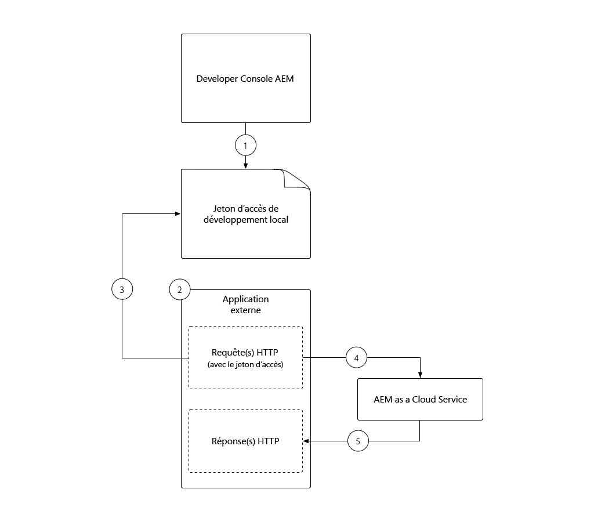
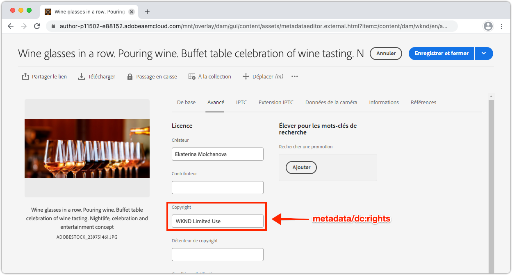

# Jeton d&#39;accès de développement local

Les développeurs qui construisent des intégrations nécessitant un accès programmatique à l&#39;AEM en tant que Cloud Service ont besoin d&#39;un moyen simple et rapide d&#39;obtenir des jetons d&#39;accès temporaires pour l&#39;AEM afin de faciliter les activités de développement local. AEM Developer Console permet aux développeurs de générer eux-mêmes des jetons d&#39;accès temporaires qui peuvent être utilisés pour accéder par programmation aux AEM.

>[!VIDEO](https://video.tv.adobe.com/v/330477/?quality=12&learn=on)

## Générer un Jeton d&#39;accès de développement local


Le Jeton d&#39;accès de développement local permet d’accéder aux services d’auteur et de publication AEM en tant qu’utilisateur ayant généré le jeton, ainsi que leurs autorisations. Bien qu’il s’agisse d’un jeton de développement, ne partagez pas ce jeton ou ne stockez pas ce dernier dans le contrôle de code source.

1. Dans [Adobe Admin Console](https://adminconsole.adobe.com/), vérifiez que vous, développeur, êtes membre de :
   + __Cloud Manager - Profil produit__ DeveloperIMS (accorde l’accès à AEM Developer Console)
   + Le __AEM Administrateurs__ ou __AEM Utilisateurs__ Profil de produit IMS pour le service de l&#39;environnement de l&#39; de l&#39; de l&#39;jeton d&#39;accès s&#39;intégrera à
   + L’AEM de sandbox en tant qu’environnements Cloud Service ne nécessite l’adhésion qu’aux __AEM Administrateurs__ ou __Utilisateurs__ du Profil de produits.
1. Connectez-vous à [Adobe Cloud Manager](https://my.cloudmanager.adobe.com)
1. Ouvrez le Programme contenant l’AEM en tant qu’environnement Cloud Service à intégrer à
1. Appuyez sur les __points de suspension__ en regard de l’environnement dans la section __Environnements__, puis sélectionnez __Console développeur__.
1. Appuyez sur l’onglet __Intégrations__.
1. Appuyez sur le bouton __Obtenir le jeton de développement local__.
1. Appuyez sur le __bouton de téléchargement__ dans le coin supérieur gauche pour télécharger le fichier JSON contenant la valeur `accessToken`, puis enregistrez le fichier JSON à un emplacement sécurisé sur votre machine de développement.
   + C&#39;est votre jeton d&#39;accès de développement de 24 heures à l&#39;AEM en tant qu&#39;environnement Cloud Service.


## Utilisé le Jeton d&#39;accès de développement local {#use-local-development-access-token}



1. Téléchargez le Jeton d&#39;accès de développement local temporaire depuis AEM Developer Console.
   + Le Jeton d&#39;accès de développement local expire toutes les 24 heures, les développeurs devront donc télécharger de nouveaux jetons d&#39;accès tous les jours.
1. Une application externe est en cours de développement qui interagit par programmation avec AEM en tant que Cloud Service.
1. L&#39;application externe se lit dans le Jeton d&#39;accès de développement local
1. L’application externe crée des requêtes HTTP pour AEM en tant que Cloud Service, ajoutant le Jeton d&#39;accès de développement local en tant que jeton de garde à l’en-tête Autorisation des requêtes HTTP.
1. AEM en tant que Cloud Service reçoit la requête HTTP, authentifie la requête et effectue le travail demandé par la requête HTTP, puis renvoie une réponse HTTP à l’application externe.

### Exemple d’application externe

Nous allons créer une application JavaScript externe simple pour illustrer comment accéder par programmation à l&#39;AEM en tant que Cloud Service via HTTPS à l&#39;aide du jeton d&#39;accès de développement local. Cela illustre comment _toute application ou système_ s&#39;exécutant en dehors de l&#39;AEM, quelle que soit la structure ou la langue, peut utiliser le jeton d&#39;accès pour s&#39;authentifier et accéder par programmation à l&#39;AEM en tant que Cloud Service. Dans la section [suivante](./service-credentials.md), nous mettrons à jour ce code d&#39;application afin de prendre en charge l&#39;approche de génération d&#39;un jeton à des fins de production.

Cet exemple d’application est exécuté à partir de la ligne de commande et met à jour AEM métadonnées de fichier à l’aide des API HTTP AEM Assets, en suivant le flux suivant :

1. Lit les paramètres de la ligne de commande (`getCommandLineParams()`)
1. Obtient le jeton d&#39;accès utilisé pour s’authentifier auprès de AEM en tant que Cloud Service (`getAccessToken(...)`)
1. Liste tous les fichiers d’un dossier AEM de fichiers spécifié dans des paramètres de ligne de commande (`listAssetsByFolder(...)`).
1. Mettez à jour les métadonnées des ressources répertoriées avec les valeurs spécifiées dans les paramètres de ligne de commande (`updateMetadata(...)`).

L’élément clé de l’authentification programmée pour AEM à l’aide du jeton d&#39;accès est l’ajout d’un en-tête de requête HTTP d’autorisation à toutes les requêtes HTTP envoyées à AEM, au format suivant :

+ `Authorization: Bearer ACCESS_TOKEN`

## Exécution de l’application externe

1. Assurez-vous que [Node.js](/help/cloud-service/local-development-environment/development-tools.md?lang=en#node-js) est installé sur votre ordinateur de développement local, qui sera utilisé pour exécuter l&#39;application externe.
1. Téléchargez et décompressez l&#39;[exemple d&#39;application externe](./assets/aem-guides_token-authentication-external-application.zip).
1. Dans la ligne de commande, dans le dossier de ce projet, exécutez `npm install`
1. Copiez le [Jeton d&#39;accès de développement local](#download-local-development-access-token) téléchargé dans un fichier nommé `local_development_token.json` à la racine du projet.
   + Mais rappelez-vous, n&#39;engagez jamais de références à Git !
1. Ouvrez `index.js` et passez en revue le code et les commentaires de l&#39;application externe.

   ```javascript
   const fetch = require('node-fetch');
   const fs = require('fs');
   const auth = require('@adobe/jwt-auth');
   
   // The root context of the Assets HTTP API
   const ASSETS_HTTP_API = '/api/assets';
   
   // Command line parameters
   let params = { };
   
   /**
   * Application entry point function
   */
   (async () => {
       console.log('Example usage: node index.js aem=https://author-p1234-e5678.adobeaemcloud.com propertyName=metadata/dc:rights "propertyValue=WKND Limited Use" folder=/wknd/en/adventures/napa-wine-tasting file=credentials-file.json' );
   
       // Parse the command line parameters
       params = getCommandLineParams();
   
       // Set the access token to be used in the HTTP requests to be local development access token
       params.accessToken = await getAccessToken(params.developerConsoleCredentials);
   
       // Get a list of all the assets in the specified assets folder
       let assets = await listAssetsByFolder(params.folder);
   
       // For each asset, update it's metadata
       await assets.forEach(asset => updateMetadata(asset, { 
           [params.propertyName]: params.propertyValue 
       }));
   })();
   
   /**
   * Returns a list of Assets HTTP API asset URLs that reference the assets in the specified folder.
   * 
   * https://experienceleague.adobe.com/docs/experience-manager-cloud-service/assets/admin/mac-api-assets.html?lang=en#retrieve-a-folder-listing
   * 
   * @param {*} folder the Assets HTTP API folder path (less the /content/dam path prefix)
   */
   async function listAssetsByFolder(folder) {
       return fetch(`${params.aem}${ASSETS_HTTP_API}${folder}.json`, {
               method: 'get',
               headers: { 
                   'Content-Type': 'application/json',
                   'Authorization': 'Bearer ' + params.accessToken // Provide the AEM access token in the Authorization header
               },
           })
           .then(res => {
               console.log(`${res.status} - ${res.statusText} @ ${params.aem}${ASSETS_HTTP_API}${folder}.json`);
   
               // If success, return the JSON listing assets, otherwise return empty results
               return res.status === 200 ? res.json() : { entities: [] };
           })
           .then(json => { 
               // Returns a list of all URIs for each non-content fragment asset in the folder
               return json.entities
                   .filter((entity) => entity['class'].indexOf('asset/asset') === -1 && !entity.properties.contentFragment)
                   .map(asset => asset.links.find(link => link.rel.find(r => r === 'self')).href);
           });
   }
   
   /**
   * Update the metadata of an asset in AEM
   * 
   * https://experienceleague.adobe.com/docs/experience-manager-cloud-service/assets/admin/mac-api-assets.html?lang=en#update-asset-metadata
   * 
   * @param {*} asset the Assets HTTP API asset URL to update
   * @param {*} metadata the metadata to update the asset with
   */
   async function updateMetadata(asset, metadata) {        
       await fetch(`${asset}`, {
               method: 'put',
               headers: { 
                   'Content-Type': 'application/json',
                   'Authorization': 'Bearer ' + params.accessToken // Provide the AEM access token in the Authorization header
               },
               body: JSON.stringify({
                   class: 'asset',
                   properties: metadata
               })
           })
           .then(res => { 
               console.log(`${res.status} - ${res.statusText} @ ${asset}`);
           });
   }
   
   /**
   * Parse and return the command line parameters. Expected params are:
   * 
   * - aem = The AEM as a Cloud Service hostname to connect to.
   *              Example: https://author-p12345-e67890.adobeaemcloud.com
   * - folder = The asset folder to update assets in. Note that the Assets HTTP API do NOT use the JCR `/content/dam` path prefix.
   *              Example: '/wknd/en/adventures/napa-wine-tasting'
   * - propertyName = The asset property name to update. Note this is relative to the [dam:Asset]/jcr:content node of the asset.
   *              Example: metadata/dc:rights
   * - propertyValue = The value to update the asset property (specified by propertyName) with.
   *              Example: "WKND Free Use"
   * - file = The path to the JSON file that contains the credentials downloaded from AEM Developer Console
   *              Example: local_development_token_cm_p1234-e5678.json 
   */
   function getCommandLineParams() {
       let parameters = {};
   
       // Parse the command line params, splitting on the = delimiter
       for (let i = 2; i < process.argv.length; i++) {
           let key = process.argv[i].split('=')[0];
           let value = process.argv[i].split('=')[1];
   
           parameters[key] = value;
       };
   
       // Read in the credentials from the provided JSON file
       if (parameters.file) {
           parameters.developerConsoleCredentials = JSON.parse(fs.readFileSync(parameters.file));
       }
   
       console.log(parameters);
   
       return parameters;
   }
   
   async function getAccessToken(developerConsoleCredentials) {s
       if (developerConsoleCredentials.accessToken) {
           // This is a Local Development access token
           return developerConsoleCredentials.accessToken;
       } 
   }
   ```

   Examinez les appels `fetch(..)` dans `listAssetsByFolder(...)` et `updateMetadata(...)` et notez `headers` que l&#39;en-tête de requête HTTP `Authorization` est défini avec la valeur `Bearer ACCESS_TOKEN`. C’est ainsi que la requête HTTP provenant de l’application externe s’authentifie auprès de l’AEM en tant que Cloud Service.

   ```javascript
   ...
   return fetch(`${params.aem}${ASSETS_HTTP_API}${folder}.json`, {
               method: 'get',
               headers: { 
                   'Content-Type': 'application/json',
                   'Authorization': 'Bearer ' + params.accessToken // Provide the AEM access token in the Authorization header
               },
   })...
   ```

   Toute requête HTTP adressée à AEM en tant que Cloud Service doit définir le jeton d&#39;accès du porteur dans l’en-tête Autorisation. N&#39;oubliez pas que chaque AEM en tant qu&#39;environnement Cloud Service nécessite son propre jeton d&#39;accès. Le jeton d&#39;accès de développement ne fonctionnera pas sur l&#39;état ou la production, celui de l&#39;état ne fonctionnera pas sur le développement ou la production, et celui de la production ne fonctionnera pas sur le développement ou l&#39;état !

1. A l’aide de la ligne de commande, à partir de la racine du projet, exécutez l’application en transmettant les paramètres suivants :

   ```shell
   $ node index.js \
       aem=https://author-p1234-e5678.adobeaemcloud.com \
       folder=/wknd/en/adventures/napa-wine-tasting \
       propertyName=metadata/dc:rights \
       propertyValue="WKND Limited Use" \
       file=local_development_token.json
   ```

   Les paramètres suivants sont transmis dans :

   + `aem`: Le schéma et le nom d&#39;hôte de l&#39;AEM en tant qu&#39;environnement Cloud Service avec lequel l&#39;application interagira (ex.  `https://author-p1234-e5678.adobeaemcloud.com`).
   + `folder`: chemin d’accès du dossier de ressources dont les ressources seront mises à jour avec  `propertyValue`; n&#39;ajoutez PAS le  `/content/dam` préfixe (ex.  `/wknd/en/adventures/napa-wine-tasting`)
   + `propertyName`: Nom de la propriété de ressource à mettre à jour, par rapport à  `[dam:Asset]/jcr:content` (ex.  `metadata/dc:rights`).
   + `propertyValue`: La valeur à définir  `propertyName` sur ; les valeurs avec espaces doivent être encapsulées avec  `"` (ex.  `"WKND Limited Use"`)
   + `file`: Chemin d’accès relatif au fichier JSON téléchargé depuis AEM Console développeur.

   Une exécution réussie de la sortie des résultats de l’application pour chaque ressource mise à jour :

   ```shell
   200 - OK @ https://author-p1234-e5678.adobeaemcloud.com/api/assets/wknd/en/adventures/napa-wine-tasting.json
   200 - OK @ https://author-p1234-e5678.adobeaemcloud.com/api/assets/wknd/en/adventures/napa-wine-tasting/AdobeStock_277654931.jpg.json
   200 - OK @ https://author-p1234-e5678.adobeaemcloud.com/api/assets/wknd/en/adventures/napa-wine-tasting/AdobeStock_239751461.jpg.json
   200 - OK @ https://author-p1234-e5678.adobeaemcloud.com/api/assets/wknd/en/adventures/napa-wine-tasting/AdobeStock_280313729.jpg.json
   200 - OK @ https://author-p1234-e5678.adobeaemcloud.com/api/assets/wknd/en/adventures/napa-wine-tasting/AdobeStock_286664352.jpg.json
   ```

### Vérification de la mise à jour des métadonnées dans AEM

Vérifiez que les métadonnées ont été mises à jour en vous connectant à l&#39;AEM en tant qu&#39;environnement Cloud Service (assurez-vous que le même hôte transmis au paramètre de ligne de commande `aem` est accessible).

1. Connectez-vous à l&#39;AEM en tant qu&#39;environnement Cloud Service avec lequel l&#39;application externe a interagi (utilisez le même hôte fourni dans le paramètre de ligne de commande `aem`).
1. Accédez à __Ressources__ > __Fichiers__
1. Accédez au dossier de ressources spécifié par le paramètre de ligne de commande `folder`, par exemple __WKND__ > __Anglais__ > __Aventures__ > __Goûts du vin de Napa__
1. Ouvrez les __Propriétés__ pour tout fichier (autre que Fragment de contenu) du dossier.
1. Appuyez sur l’onglet __Advanced__.
1. Examinez la valeur de la propriété mise à jour, par exemple __Copyright__ mappé à la propriété JCR `metadata/dc:rights` mise à jour, qui reflète la valeur fournie dans le paramètre `propertyValue`, par exemple __WKND Limited Use__



## Étapes suivantes

Maintenant que nous avons accédé par programmation à AEM en tant que Cloud Service à l’aide du jeton de développement local, nous devons mettre à jour l’application afin de la gérer à l’aide des informations d’identification du service, afin que cette application puisse être utilisée dans un contexte de production.

+ [Utilisation des informations d’identification du service](./service-credentials.md)
