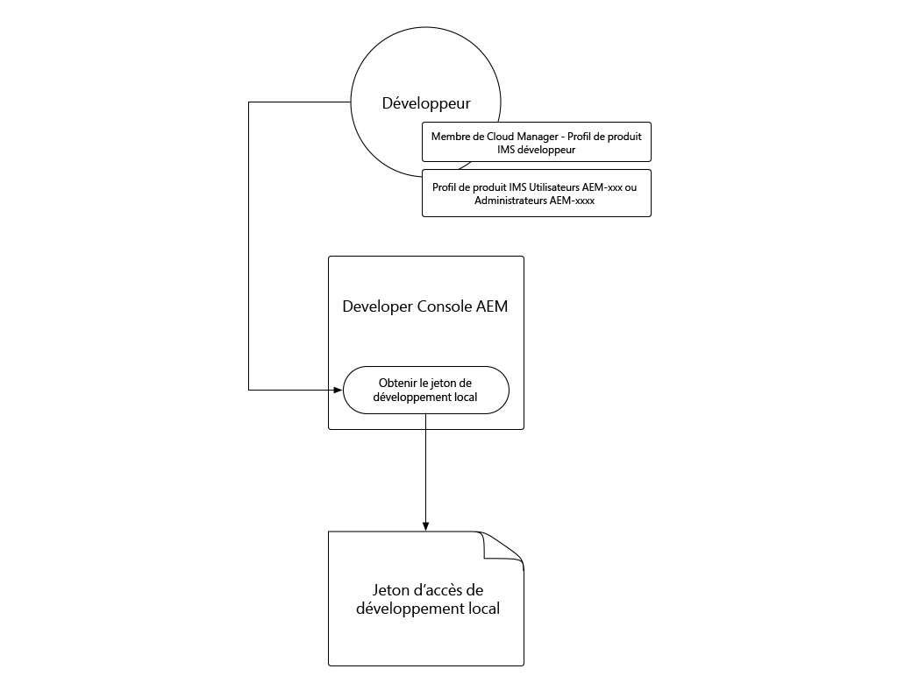

# Jeton d’accès au développement local

Les développeurs qui créent des intégrations nécessitant un accès programmatique à AEM as a Cloud Service ont besoin d’un moyen simple et rapide d’obtenir des jetons d’accès temporaires pour AEM afin de faciliter les activités de développement local. Pour répondre à ce besoin, AEM Developer Console permet aux développeurs de générer eux-mêmes des jetons d’accès temporaires qui peuvent être utilisés pour accéder par programmation à AEM.

>[!VIDEO](https://video.tv.adobe.com/v/330477/?quality=12&learn=on)

## Génération d’un jeton d’accès au développement local



Le jeton d’accès au développement local permet d’accéder aux services AEM Author et Publish en tant qu’utilisateur ayant généré le jeton, ainsi que ses autorisations. Bien qu’il s’agisse d’un jeton de développement, ne partagez pas ce jeton, ni ne le stockez dans le contrôle de code source.

1. Dans [Adobe Admin Console](https://adminconsole.adobe.com/) assurez-vous, en tant que développeur, que vous êtes membre de :
   + __Cloud Manager - Développeur__ Profil de produit IMS (accorde l’accès à AEM Developer Console)
   + Soit le __Administrateurs AEM__ ou __Utilisateurs AEM__ Profil de produit IMS pour le service de l’environnement AEM auquel le jeton d’accès s’intègre
   + Les environnements Sandbox AEM as a Cloud Service ne nécessitent qu’une adhésion à l’une ou l’autre des __Administrateurs AEM__ ou __Utilisateurs AEM__ Profil de produits
1. Connectez-vous à [Adobe Cloud Manager](https://my.cloudmanager.adobe.com)
1. Ouvrez le programme contenant l’environnement as a Cloud Service AEM à intégrer à
1. Appuyez sur le bouton __ellipse__ en regard de l’environnement dans la variable __Environnements__ et sélectionnez __Developer Console__
1. Appuyez sur __Intégrations__ tab
1. Appuyer __Obtention du jeton de développement local__ button
1. Appuyez sur le __bouton de téléchargement__ dans le coin supérieur gauche pour télécharger le fichier JSON contenant `accessToken` et enregistrez le fichier JSON à un emplacement sécurisé sur votre ordinateur de développement.
   + Il s’agit de votre jeton d’accès développeur 24 heures sur 24 à l’environnement as a Cloud Service AEM.


## Utilisation du jeton d’accès au développement local{#use-local-development-access-token}


1. Téléchargez le jeton d’accès au développement local temporaire depuis AEM Developer Console
   + Le jeton d’accès au développement local expire toutes les 24 heures. Les développeurs doivent donc télécharger de nouveaux jetons d’accès tous les jours.
1. Une application externe est en cours de développement qui interagit par programmation avec AEM as a Cloud Service
1. L’application externe se lit dans le jeton d’accès au développement local.
1. L’application externe crée des requêtes HTTP pour AEM as a Cloud Service, en ajoutant le jeton d’accès au développement local en tant que jeton porteur à l’en-tête d’autorisation des requêtes HTTP.
1. AEM as a Cloud Service reçoit la requête HTTP, authentifie la requête et effectue le travail demandé par la requête HTTP, puis renvoie une réponse HTTP à l’application externe.

### Exemple d’application externe

Nous allons créer une application JavaScript externe simple pour illustrer comment accéder par programmation à AEM as a Cloud Service via HTTPS à l’aide du jeton d’accès du développeur local. Cela illustre la manière dont _any_ l’application ou le système s’exécutant en dehors d’AEM, indépendamment de la structure ou de la langue, peut utiliser le jeton d’accès pour s’authentifier par programmation et y accéder AEM as a Cloud Service. Dans le [section suivante](./service-credentials.md), nous mettrons à jour ce code d’application afin de prendre en charge l’approche de génération d’un jeton en vue d’une utilisation en production.

Cet exemple d’application est exécuté à partir de la ligne de commande et met à jour AEM métadonnées des ressources à l’aide des API HTTP AEM Assets, à l’aide du flux suivant :

1. Lit les paramètres de la ligne de commande (`getCommandLineParams()`)
1. Obtient le jeton d’accès utilisé pour s’authentifier sur AEM as a Cloud Service (`getAccessToken(...)`)
1. Répertorie toutes les ressources d’un dossier de ressources AEM spécifié dans des paramètres de ligne de commande (`listAssetsByFolder(...)`)
1. Mise à jour des métadonnées des ressources répertoriées avec les valeurs spécifiées dans les paramètres de ligne de commande (`updateMetadata(...)`)

L’élément clé de l’authentification par programmation pour AEM à l’aide du jeton d’accès est l’ajout d’un en-tête de requête HTTP d’autorisation à toutes les requêtes HTTP envoyées à AEM, au format suivant :

+ `Authorization: Bearer ACCESS_TOKEN`

## Exécution de l’application externe

1. Assurez-vous que [Node.js](/help/cloud-service/local-development-environment/development-tools.md?lang=en#node-js) est installé sur votre machine de développement locale, qui est utilisée pour exécuter l’application externe.
1. Téléchargez et décompressez le fichier [exemple d’application externe](./assets/aem-guides_token-authentication-external-application.zip)
1. Sur la ligne de commande, dans le dossier de ce projet, exécutez `npm install`
1. Copiez le [téléchargé le jeton d’accès au développement local.](#download-local-development-access-token) dans un fichier nommé `local_development_token.json` à la racine du projet
   + Mais rappelez-vous, ne validez jamais vos identifiants à Git !
1. Ouvrir `index.js` et passez en revue le code et les commentaires de l’application externe.

   ```javascript
   const fetch = require('node-fetch');
   const fs = require('fs');
   const auth = require('@adobe/jwt-auth');
   
   // The root context of the Assets HTTP API
   const ASSETS_HTTP_API = '/api/assets';
   
   // Command line parameters
   let params = { };
   
   /**
   * Application entry point function
   */
   (async () => {
       console.log('Example usage: node index.js aem=https://author-p1234-e5678.adobeaemcloud.com propertyName=metadata/dc:rights "propertyValue=WKND Limited Use" folder=/wknd-shared/en/adventures/napa-wine-tasting file=credentials-file.json' );
   
       // Parse the command line parameters
       params = getCommandLineParams();
   
       // Set the access token to be used in the HTTP requests to be local development access token
       params.accessToken = await getAccessToken(params.developerConsoleCredentials);
   
       // Get a list of all the assets in the specified assets folder
       let assets = await listAssetsByFolder(params.folder);
   
       // For each asset, update it's metadata
       await assets.forEach(asset => updateMetadata(asset, { 
           [params.propertyName]: params.propertyValue 
       }));
   })();
   
   /**
   * Returns a list of Assets HTTP API asset URLs that reference the assets in the specified folder.
   * 
   * https://experienceleague.adobe.com/docs/experience-manager-cloud-service/assets/admin/mac-api-assets.html?lang=en#retrieve-a-folder-listing
   * 
   * @param {*} folder the Assets HTTP API folder path (less the /content/dam path prefix)
   */
   async function listAssetsByFolder(folder) {
       return fetch(`${params.aem}${ASSETS_HTTP_API}${folder}.json`, {
               method: 'get',
               headers: { 
                   'Content-Type': 'application/json',
                   'Authorization': 'Bearer ' + params.accessToken // Provide the AEM access token in the Authorization header
               },
           })
           .then(res => {
               console.log(`${res.status} - ${res.statusText} @ ${params.aem}${ASSETS_HTTP_API}${folder}.json`);
   
               // If success, return the JSON listing assets, otherwise return empty results
               return res.status === 200 ? res.json() : { entities: [] };
           })
           .then(json => { 
               // Returns a list of all URIs for each non-content fragment asset in the folder
               return json.entities
                   .filter((entity) => entity['class'].indexOf('asset/asset') === -1 && !entity.properties.contentFragment)
                   .map(asset => asset.links.find(link => link.rel.find(r => r === 'self')).href);
           });
   }
   
   /**
   * Update the metadata of an asset in AEM
   * 
   * https://experienceleague.adobe.com/docs/experience-manager-cloud-service/assets/admin/mac-api-assets.html?lang=en#update-asset-metadata
   * 
   * @param {*} asset the Assets HTTP API asset URL to update
   * @param {*} metadata the metadata to update the asset with
   */
   async function updateMetadata(asset, metadata) {        
       await fetch(`${asset}`, {
               method: 'put',
               headers: { 
                   'Content-Type': 'application/json',
                   'Authorization': 'Bearer ' + params.accessToken // Provide the AEM access token in the Authorization header
               },
               body: JSON.stringify({
                   class: 'asset',
                   properties: metadata
               })
           })
           .then(res => { 
               console.log(`${res.status} - ${res.statusText} @ ${asset}`);
           });
   }
   
   /**
   * Parse and return the command line parameters. Expected params are:
   * 
   * - aem = The AEM as a Cloud Service hostname to connect to.
   *              Example: https://author-p12345-e67890.adobeaemcloud.com
   * - folder = The asset folder to update assets in. Note that the Assets HTTP API do NOT use the JCR `/content/dam` path prefix.
   *              Example: '/wknd-shared/en/adventures/napa-wine-tasting'
   * - propertyName = The asset property name to update. Note this is relative to the [dam:Asset]/jcr:content node of the asset.
   *              Example: metadata/dc:rights
   * - propertyValue = The value to update the asset property (specified by propertyName) with.
   *              Example: "WKND Free Use"
   * - file = The path to the JSON file that contains the credentials downloaded from AEM Developer Console
   *              Example: local_development_token_cm_p1234-e5678.json 
   */
   function getCommandLineParams() {
       let parameters = {};
   
       // Parse the command line params, splitting on the = delimiter
       for (let i = 2; i < process.argv.length; i++) {
           let key = process.argv[i].split('=')[0];
           let value = process.argv[i].split('=')[1];
   
           parameters[key] = value;
       };
   
       // Read in the credentials from the provided JSON file
       if (parameters.file) {
           parameters.developerConsoleCredentials = JSON.parse(fs.readFileSync(parameters.file));
       }
   
       console.log(parameters);
   
       return parameters;
   }
   
   async function getAccessToken(developerConsoleCredentials) {s
       if (developerConsoleCredentials.accessToken) {
           // This is a Local Development access token
           return developerConsoleCredentials.accessToken;
       } 
   }
   ```

   Consultez la section `fetch(..)` les appels dans la variable `listAssetsByFolder(...)` et `updateMetadata(...)`, et notez `headers` définir la variable `Authorization` En-tête de requête HTTP avec la valeur `Bearer ACCESS_TOKEN`. C’est de cette manière que la requête HTTP provenant de l’application externe s’authentifie auprès d’AEM as a Cloud Service.

   ```javascript
   ...
   return fetch(`${params.aem}${ASSETS_HTTP_API}${folder}.json`, {
               method: 'get',
               headers: { 
                   'Content-Type': 'application/json',
                   'Authorization': 'Bearer ' + params.accessToken // Provide the AEM access token in the Authorization header
               },
   })...
   ```

   Toute requête HTTP à AEM as a Cloud Service doit définir le jeton d’accès du porteur dans l’en-tête Authorization. Souvenez-vous que chaque environnement as a Cloud Service AEM nécessite son propre jeton d’accès. Le jeton d’accès du développement ne fonctionne pas sur l’environnement d’évaluation ou de production, l’environnement d’évaluation ne fonctionne pas sur le développement ou la production et celui de la production ne fonctionne pas sur l’environnement de développement ou d’évaluation.

1. A l’aide de la ligne de commande, à partir de la racine du projet, exécutez l’application, en transmettant les paramètres suivants :

   ```shell
   $ node index.js \
       aem=https://author-p1234-e5678.adobeaemcloud.com \
       folder=/wknd-shared/en/adventures/napa-wine-tasting \
       propertyName=metadata/dc:rights \
       propertyValue="WKND Limited Use" \
       file=local_development_token.json
   ```

   Les paramètres suivants sont transmis :

   + `aem`: Le schéma et le nom d’hôte de l’environnement as a Cloud Service AEM avec lequel l’application interagit (ex. `https://author-p1234-e5678.adobeaemcloud.com`).
   + `folder`: Chemin d’accès au dossier de ressources dont les ressources sont mises à jour avec la variable `propertyValue`; n’ajoutez PAS la variable `/content/dam` préfixe (ex. `/wknd-shared/en/adventures/napa-wine-tasting`)
   + `propertyName`: Nom de la propriété de ressource à mettre à jour, par rapport à `[dam:Asset]/jcr:content` (ex. `metadata/dc:rights`).
   + `propertyValue`: La valeur pour définir la variable `propertyName` à; Les valeurs avec espaces doivent être encapsulées avec `"` (ex. `"WKND Limited Use"`)
   + `file`: Chemin d’accès au fichier JSON téléchargé depuis AEM Developer Console.

   Une exécution réussie de l’application donne des résultats pour chaque ressource mise à jour :

   ```shell
   200 - OK @ https://author-p1234-e5678.adobeaemcloud.com/api/assets/wknd-shared/en/adventures/napa-wine-tasting.json
   200 - OK @ https://author-p1234-e5678.adobeaemcloud.com/api/assets/wknd-shared/en/adventures/napa-wine-tasting/AdobeStock_277654931.jpg.json
   200 - OK @ https://author-p1234-e5678.adobeaemcloud.com/api/assets/wknd-shared/en/adventures/napa-wine-tasting/AdobeStock_239751461.jpg.json
   200 - OK @ https://author-p1234-e5678.adobeaemcloud.com/api/assets/wknd-shared/en/adventures/napa-wine-tasting/AdobeStock_280313729.jpg.json
   200 - OK @ https://author-p1234-e5678.adobeaemcloud.com/api/assets/wknd-shared/en/adventures/napa-wine-tasting/AdobeStock_286664352.jpg.json
   ```

### Vérification de la mise à jour des métadonnées dans AEM

Vérifiez que les métadonnées ont été mises à jour en vous connectant à l’environnement as a Cloud Service AEM (assurez-vous que le même hôte a été transmis dans la variable `aem` le paramètre de ligne de commande est accessible).

1. Connectez-vous à l’environnement as a Cloud Service AEM avec lequel l’application externe a interagi (utilisez le même hôte fourni dans la variable `aem` paramètre de ligne de commande)
1. Accédez au __Ressources__ > __Fichiers__
1. Accédez au dossier de ressources spécifié par la propriété `folder` paramètre de ligne de commande, par exemple __WKND__ > __Anglais__ > __Aventures__ > __Goûts du vin de Napa__
1. Ouvrez le __Propriétés__ pour toute ressource (autre que le fragment de contenu) dans le dossier
1. Appuyez sur le bouton __Avancé__ tab
1. Vérifiez la valeur de la propriété mise à jour, par exemple __Copyright__ qui est mappé à la mise à jour `metadata/dc:rights` Propriété JCR, qui reflète la valeur fournie dans la propriété `propertyValue` par exemple, __Utilisation limitée WKND__


## Étapes suivantes

Maintenant que nous avons accédé par programmation à AEM as a Cloud Service à l’aide du jeton de développement local. Ensuite, nous devons mettre à jour l’application pour gérer l’utilisation des informations d’identification du service, afin que cette application puisse être utilisée dans un contexte de production.

+ [Utilisation des informations d’identification du service](./service-credentials.md)
