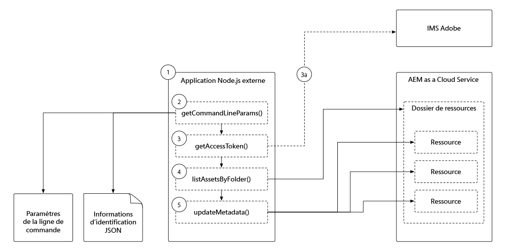

# Authentification basée sur un jeton à AEM en tant que Cloud Service

Dans ce didacticiel, vous allez découvrir comment une application externe peut s’authentifier et interagir avec l’AEM par programmation en tant que Cloud Service via HTTP à l’aide de jetons d&#39;accès.

>[!VIDEO](https://video.tv.adobe.com/v/330460/?quality=12&learn=on)

## Conditions préalables

Assurez-vous que les éléments suivants sont en place avant de suivre ce didacticiel :

1. L&#39;accès à l&#39;AEM en tant qu&#39;environnement Cloud Service (de préférence un environnement de développement ou un programme Sandbox)
1. Adhésion à l&#39;AEM en tant qu&#39;environnement Cloud Service Auteur ou services AEM Administrateur de produits Profil
1. Adhésion ou accès à votre administrateur d&#39;organisation IMS Adobe (il devra initialiser une seule fois les [informations d&#39;identification du service](./service-credentials.md))
1. Dernier [site WKND](https://github.com/adobe/aem-guides-wknd) déployé sur votre environnement Cloud Service

## Présentation des applications externes

Ce didacticiel utilise une application [simple Node.js](./assets/aem-guides_token-authentication-external-application.zip) exécutée à partir de la ligne de commande pour mettre à jour les métadonnées de fichier sur AEM en tant que Cloud Service à l’aide de l’API HTTP [Assets](https://experienceleague.adobe.com/docs/experience-manager-cloud-service/assets/admin/mac-api-assets.html?lang=fr).

Le flux d’exécution de l’application Node.js se présente comme suit :

1. L’application Node.js est appelée à partir de la ligne de commande.
1. Les paramètres de ligne de commande définissent :
   + L’AEM en tant qu’hôte de service Auteur Cloud Service auquel se connecter (`aem`)
   + Dossier de ressources AEM dont les ressources seront mises à jour (`folder`)
   + La propriété et la valeur de métadonnées à mettre à jour (`propertyName` et `propertyValue`)
   + Chemin d’accès local au fichier fournissant les informations d’identification requises pour accéder à AEM en tant que Cloud Service (`file`)
1. Le jeton d&#39;accès utilisé pour s&#39;authentifier auprès de AEM est dérivé du fichier JSON fourni via le paramètre de ligne de commande `file`

   a. Si les informations d’identification de service utilisées pour le développement non local sont fournies dans le fichier JSON (`file`), le jeton d&#39;accès est récupéré à partir des API IMS d’Adobe.
1. L’application utilise le jeton d&#39;accès pour accéder à AEM et à la liste de tous les actifs du dossier spécifié dans le paramètre de ligne de commande `folder`.
1. Pour chaque fichier du dossier, l’application met à jour ses métadonnées en fonction du nom de propriété et de la valeur spécifiés dans les paramètres de ligne de commande `propertyName` et `propertyValue`.

Bien que cette application exemple soit Node.js, ces interactions peuvent être développées à l’aide de différents langages de programmation et exécutées à partir d’autres systèmes externes.

## Jeton d&#39;accès de développement local

Des Jetons d&#39;accès de développement local sont générés pour un AEM spécifique en tant qu’environnement Cloud Service et permettent d’accéder aux services d’auteur et de publication.  Ces jetons d&#39;accès sont temporaires et ne doivent être utilisés que lors du développement d&#39;applications ou de systèmes externes qui interagissent avec les AEM via HTTP. Au lieu d&#39;un développeur qui doit obtenir et gérer des informations d&#39;identification de service fiables, il peut rapidement et facilement générer automatiquement un jeton d&#39;accès temporaire qui lui permet de développer son intégration.

+ [Utilisation du Jeton d&#39;accès de développement local](./local-development-access-token.md)

## Informations d’identification du service

Les informations d’identification de service sont les informations d’identification de base utilisées dans tous les scénarios autres que le développement - la production la plus évidente - qui facilitent l’authentification d’une application externe ou la capacité d’un système à s’authentifier et à interagir avec l’AEM en tant que Cloud Service sur HTTP. Les informations d&#39;identification de service elles-mêmes ne sont pas envoyées à AEM pour authentification, mais l&#39;application externe les utilise pour générer un JWT, qui est échangé avec les API _de l&#39;Adobe IMS pour_ un jeton d&#39;accès, qui peut ensuite être utilisé pour authentifier les requêtes HTTP auprès AEM en tant que Cloud Service.

+ [Utilisation des informations d’identification du service](./service-credentials.md)

## Ressources supplémentaires

+ [Téléchargement de l’application d’exemple](./assets/aem-guides_token-authentication-external-application.zip)
+ Autres exemples de code de création et d&#39;échange de JWT
   + [Exemples de code Node.js, Java, Python, C#.NET et PHP](https://www.adobe.io/authentication/auth-methods.html#!AdobeDocs/adobeio-auth/master/JWT/samples/samples.md)
   + [Exemple de code basé sur JavaScript/Axios](https://github.com/adobe/aemcs-api-client-lib)
