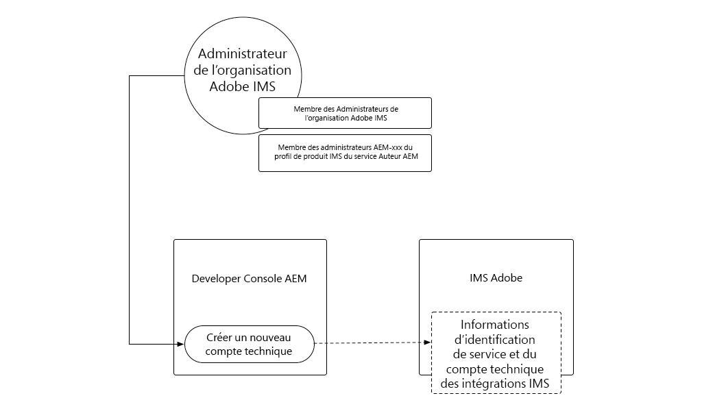
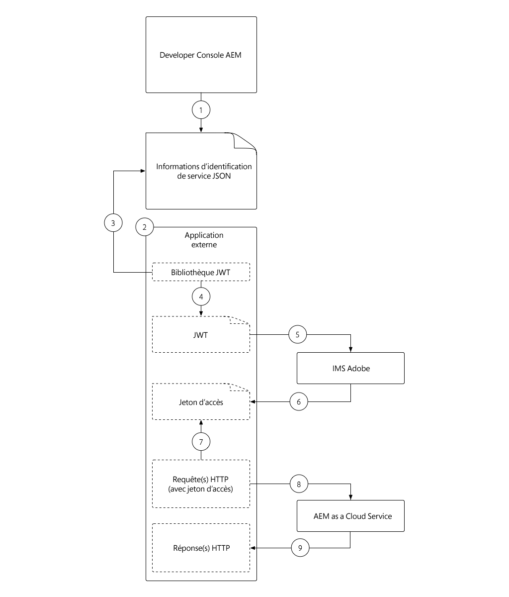
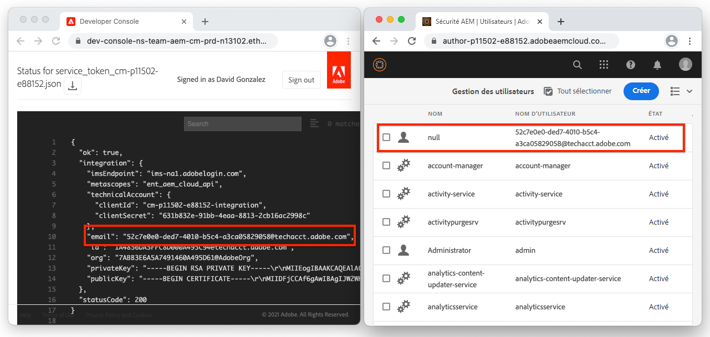
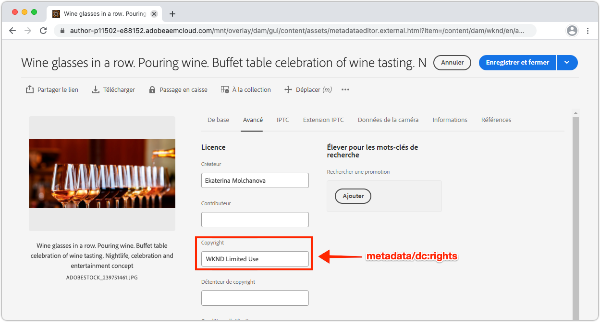

# Informations d’identification du service

Les intégrations à l&#39;AEM en tant que Cloud Service doivent être en mesure de s&#39;authentifier en toute sécurité auprès de l&#39;AEM. AEM Developer Console accorde l’accès aux informations d’identification du service, qui sont utilisées pour faciliter les applications, systèmes et services externes à interagir par programmation avec les services Auteur ou Publication AEM via HTTP.

>[!VIDEO](https://video.tv.adobe.com/v/330519/?quality=12&learn=on)

Les informations d’identification des services peuvent sembler similaires [Jetons d&#39;accès de développement local](./local-development-access-token.md) mais sont différentes de plusieurs manières clés :

+ Les informations d’identification de service sont _non_ jetons d&#39;accès, mais elles sont utilisées pour _obtenir_ jetons d&#39;accès.
+ Les informations d’identification du service sont plus permanentes (expirent tous les 365 jours) et ne changent pas à moins d’être révoquées, tandis que les Jetons d&#39;accès de développement local expirent tous les jours.
+ Informations d’identification de service pour un AEM en tant que mappage d’environnement Cloud Service pour un utilisateur de compte technique unique AEM, tandis que les Jetons d&#39;accès de développement local s’authentifient en tant qu’utilisateur AEM qui a généré le jeton d&#39;accès.

Les informations d&#39;identification des services et les jetons d&#39;accès qu&#39;ils génèrent, ainsi que les Jetons d&#39;accès de développement local, doivent être gardés secrets, car les trois peuvent être utilisés pour obtenir l&#39;accès à leurs AEM respectives en tant qu&#39;environnements Cloud Service.

## Générer les informations d’identification du service

La génération des informations d’identification du service est divisée en deux étapes :

1. Initialisation ponctuelle des informations d’identification du service par un administrateur d’entreprise IMS Adobe
1. Téléchargement et utilisation de l’identifiant JSON d’identification du service

### Initialisation des informations d’identification du service

Contrairement aux Jetons d&#39;accès de développement local, les informations d’identification des services nécessitent une initialisation _unique_ de votre administrateur IMS d’organisation d’Adobes avant de pouvoir être téléchargées.



__Il s’agit d’une initialisation unique par AEM en tant qu’environnement Cloud Service.__

1. Vérifiez que vous êtes connecté en tant qu&#39;administrateur de l&#39;organisation IMS Adobe.
1. Connectez-vous à [Adobe Cloud Manager](https://my.cloudmanager.adobe.com)
1. Ouvrez le Programme contenant l’AEM en tant qu’environnement Cloud Service pour intégrer la configuration des informations d’identification du service pour
1. Appuyez sur les points de suspension en regard de l’environnement dans la section __Environnements__, puis sélectionnez __Console développeur__.
1. Appuyez sur l’onglet __Intégrations__.
1. Appuyez sur le bouton __Obtenir les informations d&#39;identification de service__.
1. Les informations d’identification du service seront initialisées et affichées en tant que JSON.


Une fois que l&#39;AEM en tant qu&#39;informations d&#39;identification du service d&#39;environnement Cloud Service a été initialisée, d&#39;autres développeurs AEM de votre Adobe IMS Org peuvent les télécharger.

### Télécharger les informations d’identification du service


Le téléchargement des informations d’identification du service suit les mêmes étapes que l’initialisation. Si l&#39;initialisation n&#39;a pas encore eu lieu, une erreur s&#39;affichera à l&#39;utilisateur en appuyant sur le bouton __Obtenir les informations d&#39;identification du service__.

1. Assurez-vous d’être membre du __Profil produit Cloud Manager - Developer__ IMS (qui permet d’accéder à AEM Developer Console).
   + L’AEM de sandbox en tant qu’environnements Cloud Service ne nécessite l’adhésion qu’aux __AEM Administrateurs__ ou __Utilisateurs__ du Profil de produits.
1. Connectez-vous à [Adobe Cloud Manager](https://my.cloudmanager.adobe.com)
1. Ouvrez le Programme contenant l’AEM en tant qu’environnement Cloud Service à intégrer à
1. Appuyez sur les points de suspension en regard de l’environnement dans la section __Environnements__, puis sélectionnez __Console développeur__.
1. Appuyez sur l’onglet __Intégrations__.
1. Appuyez sur le bouton __Obtenir les informations d&#39;identification de service__.
1. Appuyez sur le bouton de téléchargement dans le coin supérieur gauche pour télécharger le fichier JSON contenant la valeur Informations d’identification du service, puis enregistrez le fichier dans un emplacement sécurisé.
   + _Si les informations d’identification du service sont compromises, demandez immédiatement au service d’assistance Adobe de les révoquer._

## Installation des informations d’identification du service

Les informations d’identification du service fournissent les détails nécessaires à la génération d’un JWT, qui est échangé pour un jeton d&#39;accès utilisé pour s’authentifier avec AEM en tant que Cloud Service. Les informations d&#39;identification du service doivent être stockées dans un emplacement sécurisé accessible par les applications, systèmes ou services externes qui les utilisent pour accéder à l&#39;AEM. Le mode et l’emplacement de gestion des informations d’identification du service seront uniques par client.

Pour simplifier, ce didacticiel transmet les informations d’identification du service par le biais de la ligne de commande. Toutefois, demandez à votre équipe de sécurité informatique de comprendre comment stocker ces informations d’identification et y accéder, conformément aux directives de sécurité de votre entreprise.

1. Copiez le fichier [JSON d’identification du service](#download-service-credentials) téléchargé dans un fichier nommé `service_token.json` à la racine du projet.
   + Mais rappelez-vous, n&#39;engagez jamais de références à Git !

## Utiliser les informations d’identification du service

Les informations d’identification du service, un objet JSON entièrement formé, ne sont pas identiques à celles du JWT ni du jeton d&#39;accès. Au lieu de cela, les informations d’identification de service (qui contiennent une clé privée) sont utilisées pour générer un JWT, qui est échangé avec les API IMS d’Adobe pour un jeton d&#39;accès.



1. Téléchargez les informations d’identification du service depuis AEM Developer Console vers un emplacement sécurisé.
1. Une application externe doit interagir par programmation avec AEM en tant qu&#39;environnement Cloud Service
1. L&#39;application externe lit les informations d&#39;identification du service à partir d&#39;un emplacement sécurisé
1. L&#39;application externe utilise les informations d&#39;identification du service pour construire un jeton JWT.
1. Le jeton JWT est envoyé à l&#39;Adobe IMS pour échanger contre un jeton d&#39;accès.
1. Adobe IMS renvoie un jeton d&#39;accès qui peut être utilisé pour accéder à AEM en tant que Cloud Service
   + Un jeton d&#39;accès peut demander une expiration. Il est préférable de ne pas prolonger la durée de vie du jeton d&#39;accès et de le rafraîchir au besoin.
1. L’application externe envoie des requêtes HTTP à AEM en tant que Cloud Service, ajoutant le jeton d&#39;accès en tant que jeton de garde à l’en-tête Autorisation des requêtes HTTP.
1. AEM en tant que Cloud Service reçoit la requête HTTP, authentifie la requête et effectue le travail demandé par la requête HTTP, puis renvoie une réponse HTTP à l’application externe.

### Mises à jour de l’application externe

Pour accéder à l&#39;AEM en tant que Cloud Service à l&#39;aide des informations d&#39;identification du service, notre application externe doit être mise à jour de 3 manières :

1. Lire dans les informations d’identification du service
   + Pour simplifier, nous lirons ces informations à partir du fichier JSON téléchargé. Toutefois, dans les scénarios d’utilisation réelle, les informations d’identification du service doivent être stockées en toute sécurité conformément aux directives de sécurité de votre entreprise.
1. Générer un JWT à partir des informations d’identification du service
1. Échanger le JWT pour un jeton d&#39;accès
   + Lorsque les informations d’identification de service sont présentes, notre application externe utilise ce jeton d&#39;accès au lieu du Jeton d&#39;accès de développement local, lorsqu’elle accède à l’AEM en tant que Cloud Service.

Dans ce tutoriel, le module Adobe `@adobe/jwt-auth` npm est utilisé pour les deux, (1) générer le JWT à partir des informations d&#39;identification du service et (2) l&#39;échanger pour un jeton d&#39;accès, dans un seul appel de fonction. Si votre application n&#39;est pas basée sur JavaScript, consultez l&#39;[exemple de code dans d&#39;autres langues](https://www.adobe.io/authentication/auth-methods.html#!AdobeDocs/adobeio-auth/master/JWT/samples/samples.md) pour savoir comment créer un JWT à partir des informations d&#39;identification du service et échangez-le pour un jeton d&#39;accès avec un Adobe IMS.

## Lire les informations d’identification du service

Examinez `getCommandLineParams()` et constatez que nous pouvons lire les fichiers JSON d’informations d’identification du service en utilisant le même code que celui utilisé dans le fichier JSON du Jeton d&#39;accès de développement local.

```javascript
function getCommandLineParams() {
    ...

    // Read in the credentials from the provided JSON file
    // Since both the Local Development Access Token and Service Credentials files are JSON, this same approach can be re-used
    if (parameters.file) {
        parameters.developerConsoleCredentials = JSON.parse(fs.readFileSync(parameters.file));
    }

    ...
    return parameters;
}
```

## Créer un JWT et échanger pour un Jeton d&#39;accès

Une fois les informations d’identification de service lues, elles sont utilisées pour générer un JWT qui est ensuite échangé avec les API IMS d’Adobe pour un jeton d&#39;accès, qui peut ensuite être utilisé pour accéder à l’AEM en tant que Cloud Service.

Cet exemple d’application est basé sur Node.js. Il est donc préférable d’utiliser le module [@adobe/jwt-auth](https://www.npmjs.com/package/@adobe/jwt-auth) npm pour faciliter la génération (1) JWT et (20 échanges avec l’Adobe IMS. Si votre application est développée en utilisant une autre langue, veuillez [examiner les exemples de code appropriés](https://www.adobe.io/authentication/auth-methods.html#!AdobeDocs/adobeio-auth/master/JWT/samples/samples.md) sur la façon de construire la requête HTTP à l&#39;Adobe IMS en utilisant d&#39;autres langages de programmation.

1. Mettez à jour `getAccessToken(..)` pour examiner le contenu du fichier JSON et déterminer s’il représente un Jeton d&#39;accès de développement local ou des informations d’identification de service. Pour ce faire, il suffit de vérifier l&#39;existence de la propriété `.accessToken`, qui n&#39;existe que pour le Jeton d&#39;accès de développement local JSON.

   Si des informations d’identification de service sont fournies, l’application génère un JWT et l’échange avec un Adobe IMS pour un jeton d&#39;accès. Nous utiliserons la fonction [@adobe/jwt-auth](https://www.npmjs.com/package/@adobe/jwt-auth) de `auth(...)` qui génère toutes deux un JWT et l&#39;échange pour un jeton d&#39;accès dans un appel de fonction unique.  Les paramètres de `auth(..)` sont un objet [JSON constitué d&#39;informations spécifiques](https://www.npmjs.com/package/@adobe/jwt-auth#config-object) disponibles à partir du JSON d&#39;informations d&#39;identification du service, comme décrit ci-dessous dans le code.

   ```javascript
    async function getAccessToken(developerConsoleCredentials) {
   
        if (developerConsoleCredentials.accessToken) {
            // This is a Local Development access token
            return developerConsoleCredentials.accessToken;
        } else {
            // This is the Service Credentials JSON object that must be exchanged with Adobe IMS for an access token
            let serviceCredentials = developerConsoleCredentials.integration;
   
            // Use the @adobe/jwt-auth library to pass the service credentials generated a JWT and exchange that with Adobe IMS for an access token.
            // If other programming languages are used, please see these code samples: https://www.adobe.io/authentication/auth-methods.html#!AdobeDocs/adobeio-auth/master/JWT/samples/samples.md
            let { access_token } = await auth({
                clientId: serviceCredentials.technicalAccount.clientId, // Client Id
                technicalAccountId: serviceCredentials.id,              // Technical Account Id
                orgId: serviceCredentials.org,                          // Adobe IMS Org Id
                clientSecret: serviceCredentials.technicalAccount.clientSecret, // Client Secret
                privateKey: serviceCredentials.privateKey,              // Private Key to sign the JWT
                metaScopes: serviceCredentials.metascopes.split(','),   // Meta Scopes defining level of access the access token should provide
                ims: `https://${serviceCredentials.imsEndpoint}`,       // IMS endpoint used to obtain the access token from
            });
   
            return access_token;
        }
    }
   ```

   Désormais, selon le fichier JSON transmis par le biais de ce paramètre de ligne de commande `file`, que ce soit le JSON du Jeton d&#39;accès de développement local ou le JSON des informations d’identification du service, l’application dérive un jeton d&#39;accès.

   N’oubliez pas que, même si les informations d’identification du service n’expirent pas, le JWT et le jeton d&#39;accès correspondant le font et doivent être actualisés avant leur expiration. Pour ce faire, vous pouvez utiliser un `refresh_token` [fourni par l&#39;Adobe IMS](https://www.adobe.io/authentication/auth-methods.html#!AdobeDocs/adobeio-auth/master/OAuth/OAuth.md#access-tokens).

1. Une fois ces modifications en place et le JSON d&#39;identification du service téléchargé depuis la Console AEM Developer Console (et, pour des raisons de simplicité, enregistré sous `service_token.json` le même dossier que ce `index.js`), exécutez l&#39;application en remplaçant le paramètre de ligne de commande `file` par `service_token.json`, puis mettez à jour `propertyValue` vers une nouvelle valeur afin que les effets soient visibles dans AEM.

   ```shell
   $ node index.js \
       aem=https://author-p1234-e5678.adobeaemcloud.com \
       folder=/wknd/en/adventures/napa-wine-tasting \
       propertyName=metadata/dc:rights \
       propertyValue="WKND Restricted Use" \
       file=service_token.json
   ```

   La sortie au terminal ressemblera à :

   ```shell
   200 - OK @ https://author-p1234-e5678.adobeaemcloud.com/api/assets/wknd/en/adventures/napa-wine-tasting.json
   403 - Forbidden @ https://author-p1234-e5678.adobeaemcloud.com/api/assets/wknd/en/adventures/napa-wine-tasting/AdobeStock_277654931.jpg.json
   403 - Forbidden @ https://author-p1234-e5678.adobeaemcloud.com/api/assets/wknd/en/adventures/napa-wine-tasting/AdobeStock_239751461.jpg.json
   403 - Forbidden @ https://author-p1234-e5678.adobeaemcloud.com/api/assets/wknd/en/adventures/napa-wine-tasting/AdobeStock_280313729.jpg.json
   403 - Forbidden @ https://author-p1234-e5678.adobeaemcloud.com/api/assets/wknd/en/adventures/napa-wine-tasting/AdobeStock_286664352.jpg.json
   ```

   Les lignes __403 - Interdit__ indiquent des erreurs dans les appels d&#39;API HTTP à AEM en tant que Cloud Service. Ces erreurs 403 interdites se produisent lors de la tentative de mise à jour des métadonnées des ressources.

   La raison en est que le jeton d&#39;accès dérivé des informations d’identification du service authentifie la demande auprès d’AEM à l’aide d’un utilisateur d’AEM de compte technique créé automatiquement, qui, par défaut, n’a qu’un accès en lecture. Pour permettre à l&#39;utilisateur de l&#39;AEM de compte technique associé au jeton d&#39;accès d&#39;accéder en écriture à l&#39;AEM, l&#39;autorisation doit être accordée à l&#39;utilisateur de l&#39;AEM de compte technique associé au .

## Configuration de l’accès dans AEM

Le jeton d&#39;accès dérivé des informations d’identification du service utilise un utilisateur AEM compte technique qui est membre du groupe d’utilisateurs AEM des contributeurs.



Une fois que l&#39;utilisateur AEM compte technique existe dans AEM (après la première demande HTTP avec le jeton d&#39;accès), les autorisations de cet utilisateur peuvent être gérées de la même manière que les autres utilisateurs .

1. Tout d&#39;abord, recherchez le nom de connexion AEM compte technique en ouvrant le fichier JSON d&#39;informations d&#39;identification du service téléchargé depuis AEM Developer Console, puis recherchez la valeur `integration.email`, qui doit ressembler à : `12345678-abcd-9000-efgh-0987654321c@techacct.adobe.com`.
1. Connectez-vous au service ou à l’auteur de l’environnement AEM correspondant en tant qu’administrateur AEM.
1. Accédez à __Outils__ > __Sécurité__ > __Utilisateurs__
1. Localisez l’utilisateur AEM avec le __nom de connexion__ identifié à l’étape 1, puis ouvrez ses __propriétés__.
1. Accédez à l&#39;onglet __Groupes__, puis ajoutez le groupe __Utilisateurs de DAM__ (qui, en tant qu&#39;accès en écriture aux ressources).
1. Appuyez sur __Enregistrer et fermer__

Une fois le compte technique autorisé dans AEM à disposer d’autorisations d’écriture sur les ressources, réexécutez l’application :

```shell
$ node index.js \
    aem=https://author-p1234-e5678.adobeaemcloud.com \
    folder=/wknd/en/adventures/napa-wine-tasting \
    propertyName=metadata/dc:rights \
    propertyValue="WKND Restricted Use" \
    file=service_token.json
```

La sortie au terminal ressemblera à :

```
200 - OK @ https://author-p1234-e5678.adobeaemcloud.com/api/assets/wknd/en/adventures/napa-wine-tasting.json
200 - OK @ https://author-p1234-e5678.adobeaemcloud.com/api/assets/wknd/en/adventures/napa-wine-tasting/AdobeStock_277654931.jpg.json
200 - OK @ https://author-p1234-e5678.adobeaemcloud.com/api/assets/wknd/en/adventures/napa-wine-tasting/AdobeStock_286664352.jpg.json
200 - OK @ https://author-p1234-e5678.adobeaemcloud.com/api/assets/wknd/en/adventures/napa-wine-tasting/AdobeStock_239751461.jpg.json
200 - OK @ https://author-p1234-e5678.adobeaemcloud.com/api/assets/wknd/en/adventures/napa-wine-tasting/AdobeStock_280313729.jpg.json
```

## Vérifier les modifications

1. Connectez-vous à l&#39;AEM en tant qu&#39;environnement Cloud Service mis à jour (en utilisant le même nom d&#39;hôte que celui fourni dans le paramètre de ligne de commande `aem`).
1. Accédez à __Ressources__ > __Fichiers__
1. Accédez au dossier de ressources spécifié par le paramètre de ligne de commande `folder`, par exemple __WKND__ > __Anglais__ > __Aventures__ > __Goûts du vin de Napa__
1. Ouvrez les __Propriétés__ pour tout fichier du dossier.
1. Accédez à l&#39;onglet __Advanced__
1. Examinez la valeur de la propriété mise à jour, par exemple __Copyright__ mappé à la propriété JCR `metadata/dc:rights` mise à jour, qui reflète désormais la valeur fournie dans le paramètre `propertyValue`, par exemple __Utilisation restreinte WKND__.



## Félicitations ! 

Maintenant que nous avons accédé par programmation à AEM en tant que Cloud Service à l&#39;aide d&#39;un jeton d&#39;accès de développement local, ainsi que d&#39;un jeton d&#39;accès de service à service prêt à la production !

