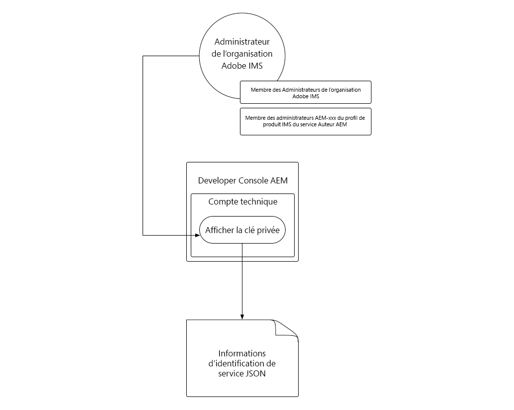

# Informations d’identification de service

Les intégrations à Adobe Experience Manager (AEM) as a Cloud Service doivent pouvoir s’authentifier en toute sécurité auprès du service AEM. La Developer Console d’AEM accorde l’accès aux informations d’identification de service, qui sont utilisées pour aider les applications, systèmes et services externes à interagir par programmation avec les services de création et de publication via HTTP.

>[!VIDEO](https://video.tv.adobe.com/v/330519?quality=12&learn=on)

Bien que les informations d’identification de service puissent apparaître similaires aux [jetons d’accès au développement local](./local-development-access-token.md), elles sont différentes de plusieurs manières importantes :

+ Les informations d’identification de service sont associées aux comptes techniques. Plusieurs informations d’identification de service peuvent être actives pour un seul et même compte technique.
+ Les informations d’identification de service _ne sont pas_ des jetons d’accès, mais plutôt des informations d’identification utilisées pour _obtenir_ des jetons d’accès.
+ Les informations d’identification de service sont plus permanentes (leur certificat expire tous les 365 jours) et ne changent pas à moins d’être révoquées, tandis que les jetons d’accès au développement local expirent tous les jours.
+ Les informations d’identification de service pour un environnement AEM as a Cloud Service sont mappées à une personne utilisatrice de compte technique AEM unique, tandis que les jetons d’accès au développement local s’authentifient en tant que personne utilisatrice ayant généré le jeton d’accès.
+ Un environnement AEM as a Cloud Service peut comporter jusqu’à dix comptes techniques, chacun disposant de ses propres informations d’identification de service, chacun étant associé à une personne utilisatrice de compte technique AEM distincte.

Les informations d’identification de service et les jetons d’accès qu’elles génèrent, ainsi que les jetons d’accès au développement local, doivent être gardés secrets. En effet, les trois peuvent être utilisés pour obtenir l’accès à leur environnement AEM as a Cloud Service respectif.

## Généer des informations d’identification de service

La génération des informations d’identification de service est divisée en deux étapes :

1. La création ponctuelle d’un compte technique par l’administration de l’organisation Adobe IMS.
1. Le téléchargement et l’utilisation du JSON des informations d’identification de service du compte technique.

### Créer un compte technique

Contrairement aux jetons d’accès au développement local, les informations d’identification de service requièrent la création d’un compte technique par l’administration de l’organisation Adobe IMS avant de pouvoir être téléchargées. Des comptes techniques distincts doivent être créés pour chaque client ou cliente qui nécessite un accès programmatique à AEM.


Les comptes techniques sont créés une seule fois, mais les clés privées utilisées pour gérer les informations d’identification de service associées au compte technique peuvent être gérées au fil du temps. Par exemple, les nouvelles informations d’identification de service ou de clé privée doivent être générées avant l’expiration de la clé privée actuelle, afin de permettre un accès ininterrompu à une personne utilisatrice des informations d’identification de service.

1. Vérifiez votre connexion en tant que :
   + __Personne de l’administration système de l’organisation Adobe IMS__
   + membre du profil de produit IMS de l’__administration AEM__ sur l’__instance de création AEM__.
1. Connectez-vous à [Adobe Cloud Manager](https://my.cloudmanager.adobe.com).
1. Ouvrez le programme contenant l’environnement AEM as a Cloud Service pour intégrer la configuration des informations d’identification de service.
1. Appuyez sur les points de suspension en regard de l’environnement dans la section __Environnements__ et sélectionnez __Developer Console__.
1. Appuyez sur l’onglet __Intégrations__.
1. Appuyez sur l’onglet __Comptes techniques__.
1. Appuyez sur le bouton __Créer un compte technique__.
1. Les informations d’identification du service de compte technique sont initialisées et affichées au format JSON.


Une fois les informations d’identification de service de l’environnement AEM as a Cloud Service initialisées, d’autres personnes développeuses d’AEM de votre organisation Adobe IMS peuvent les télécharger.

### Télécharger les informations d’identification de service



Le téléchargement des informations d’identification de service suit des étapes similaires à l’initialisation.

1. Vérifiez votre connexion en tant que :
   + __personne de l’administration de l’organisation Adobe IMS__ ;
   + membre du profil de produit IMS de l’__administration AEM__ sur l’__instance de création AEM__.
1. Connectez-vous à [Adobe Cloud Manager](https://my.cloudmanager.adobe.com).
1. Ouvrez le programme contenant l’environnement AEM as a Cloud Service auquel s’intégrer.
1. Appuyez sur les points de suspension en regard de l’environnement dans la section __Environnements__ et sélectionnez __Developer Console__.
1. Appuyez sur l’onglet __Intégrations__.
1. Appuyez sur l’onglet __Comptes techniques__.
1. Développez le __Compte technique__ à utiliser.
1. Développez la __Clé privée__ dont les informations d’identification de service seront téléchargées et vérifiez que le statut est __Actif__.
1. Appuyez sur __…__ > __Affichage__ pour accéder à l’affichage associé à la __Clé privée__, qui affiche le fchier JSON des informations d’identification de service.
1. Appuyez sur le bouton de téléchargement dans le coin supérieur gauche pour télécharger le fichier JSON contenant la valeur des informations d’identification de service, et enregistrez le fichier à un emplacement sécurisé.

## Installer les informations d’identification de service

Les informations d’identification de service fournissent les détails nécessaires à la génération d’un jeton JWT, qui est échangé contre un jeton d’accès utilisé pour s’authentifier avec AEM as a Cloud Service. Les informations d’identification de service doivent être stockées dans un emplacement sécurisé accessible par les systèmes, services ou applications externes qui les utilisent pour accéder à AEM. Le mode et l’emplacement de gestion des informations d’identification du service sont uniques pour chaque personne cliente.

Pour plus de simplicité, ce tutoriel transmet les informations d’identification de service via la ligne de commande. Toutefois, travaillez avec votre équipe de sécurité informatique pour comprendre comment stocker ces informations d’identification et y accéder conformément aux directives de sécurité de votre organisation.

1. Copiez le [JSON d’informations d’identification de service téléchargé](#download-service-credentials) dans un fichier nommé `service_token.json` à la racine du projet.
   + Souvenez-vous de ne jamais enregistrer _d’informations d’identification_ sur Git.

## Utiliser les informations d’identification de service

Les informations d’identification de service consistent en un objet JSON entièrement formé et diffèrent du jeton JWT et du jeton d’accès. Les informations d’identification de service (qui contiennent une clé privée) sont plutôt utilisées pour générer un jeton JWT qui est échangé avec les API d’Adobe IMS contre un jeton d’accès.


1. Téléchargez les informations d’identification de service depuis la Developer Console d’AEM vers un emplacement sécurisé.
1. L’application externe doit interagir par programmation avec l’environnement AEM as a Cloud Service.
1. L’application externe lit les informations d’identification de service à partir d’un emplacement sécurisé.
1. L’application externe utilise les informations d’identification de service pour créer un jeton JWT.
1. Le jeton JWT est envoyé à Adobe IMS pour être échangé contre un jeton d’accès.
1. Adobe IMS renvoie un jeton d’accès qui peut être utilisé pour accéder à AEM as a Cloud Service.
   + Les jetons d’accès ne peuvent pas modifier un délai d’expiration.
1. L’application externe effectue des requêtes HTTP à AEM as a Cloud Service, en ajoutant le jeton d’accès en tant que jeton porteur à l’en-tête d’autorisation des requêtes HTTP.
1. AEM as a Cloud Service reçoit la requête HTTP, authentifie la requête et effectue le travail demandé par la requête HTTP, puis renvoie une réponse HTTP à l’application externe.

### Mises à jour de l’application externe

Pour accéder à AEM as a Cloud Service à l’aide des informations d’identification de service, l’application externe doit être mise à jour de trois façons :

1. Lecture dans les informations d’identification de service

+ Pour plus de simplicité, les informations d’identification de service sont lues à partir du fichier JSON téléchargé. Toutefois, dans les scénarios d’utilisation réelle, les informations d’identification de service doivent être stockées en toute sécurité conformément aux directives de sécurité de votre organisation.

1. Génération d’un jeton JWT à partir des informations d’identification de service
1. Échange du jeton JWT contre un jeton d’accès

+ Lorsque les informations d’identification de service sont présentes, l’application externe utilise ce jeton d’accès au lieu du jeton d’accès au développement local lors de l’accès à AEM as a Cloud Service.

Dans ce tutoriel, le module npm `@adobe/jwt-auth` d’Adobe est utilisé pour 1), générer le jeton JWT à partir des informations d’identification de service et 2), l’échanger contre un jeton d’accès, dans un seul appel de fonction. Si votre application n’est pas basée sur JavaScript, consultez l’[exemple de code dans d’autres langages](https://developer.adobe.com/developer-console/docs/guides/authentication/JWT/samples/) pour savoir comment créer un jeton JWT à partir des informations d’identification de service et l’échanger contre un jeton d’accès avec Adobe IMS.

## Lire les informations d’identification de service

Consultez `getCommandLineParams()` pour savoir comment le fichier JSON d’informations d’identification de service est lu à l’aide du même code que celui utilisé pour lire dans le JSON du jeton d’accès au développement local.

```javascript
function getCommandLineParams() {
    ...

    // Read in the credentials from the provided JSON file
    // Since both the Local Development Access Token and Service Credentials files are JSON, this same approach can be re-used
    if (parameters.file) {
        parameters.developerConsoleCredentials = JSON.parse(fs.readFileSync(parameters.file));
    }

    ...
    return parameters;
}
```

## Créer un jeton JWT et l’échanger contre un jeton d’accès

Une fois les informations d’identification de service lues, elles sont utilisées pour générer un jeton JWT qui est ensuite échangé avec les API d’Adobe IMS contre un jeton d’accès. Ce jeton d’accès peut ensuite être utilisé pour accéder à AEM as a Cloud Service.

Cet exemple d’application est basé sur Node.js. Il est donc préférable d’utiliser le module npm [@adobe/jwt-auth](https://www.npmjs.com/package/@adobe/jwt-auth) pour faciliter 1), la génération du jeton JWT et 2), l’échange avec Adobe IMS. Si votre application est développée à l’aide d’un autre langage, consultez [les exemples de code appropriés](https://developer.adobe.com/developer-console/docs/guides/authentication/JWT/samples/) sur la manière de créer la requête HTTP à Adobe IMS à l’aide d’autres langages de programmation.

1. Mettez à jour le `getAccessToken(..)` pour examiner le contenu du fichier JSON et déterminer s’il représente un jeton d’accès au développement local ou des informations d’identification de service. Pour ce faire, il suffit de vérifier l’existence de la propriété du `.accessToken`, qui n’existe que pour le JSON du jeton d’accès au développement local.

   Si les informations d’identification de service sont fournies, l’application génère un jeton JWT et l’échange avec Adobe IMS contre un jeton d’accès. Utilisez la fonction `auth(...)` de [@adobe/jwt-auth](https://www.npmjs.com/package/@adobe/jwt-auth) qui génère un jeton JWT et l’échange contre un jeton d’accès dans un appel de fonction unique. Les paramètres de la méthode `auth(..)` sont un [objet JSON composé d’informations spécifiques](https://www.npmjs.com/package/@adobe/jwt-auth#config-object) disponible dans le fichier JSON des informations d’identification du service, comme indiqué ci-dessous dans le code.

```javascript
 async function getAccessToken(developerConsoleCredentials) {

     if (developerConsoleCredentials.accessToken) {
         // This is a Local Development access token
         return developerConsoleCredentials.accessToken;
     } else {
         // This is the Service Credentials JSON object that must be exchanged with Adobe IMS for an access token
         let serviceCredentials = developerConsoleCredentials.integration;

         // Use the @adobe/jwt-auth library to pass the service credentials generated a JWT and exchange that with Adobe IMS for an access token.
         // If other programming languages are used, please see these code samples: https://www.adobe.io/authentication/auth-methods.html#!AdobeDocs/adobeio-auth/master/JWT/samples/samples.md
         let { access_token } = await auth({
             clientId: serviceCredentials.technicalAccount.clientId, // Client Id
             technicalAccountId: serviceCredentials.id,              // Technical Account Id
             orgId: serviceCredentials.org,                          // Adobe IMS Org Id
             clientSecret: serviceCredentials.technicalAccount.clientSecret, // Client Secret
             privateKey: serviceCredentials.privateKey,              // Private Key to sign the JWT
             metaScopes: serviceCredentials.metascopes.split(','),   // Meta Scopes defining level of access the access token should provide
             ims: `https://${serviceCredentials.imsEndpoint}`,       // IMS endpoint used to obtain the access token from
         });

         return access_token;
     }
 }
```

    En fonction du fichier JSON transmis par le biais du paramètre de ligne de commande « file » (le fichier JSON du jeton d’accès au développement local ou le fichier JSON des informations d’identification du service), l’application obtient un jeton d’accès.
    
    N’oubliez pas que même si les informations d’identification du service expirent tous les 365 jours, le jeton JWT et le jeton d’accès correspondant expirent fréquemment et doivent être actualisés avant leur expiration. Pour ce faire, utilisez la commande « refresh_token » [fournie par Adobe IMS](https://www.adobe.io/authentication/auth-methods.html#!AdobeDocs/adobeio-auth/master/OAuth/OAuth.md#access-tokens).

1. Une fois ces modifications en place, le fichier JSON des informations d’identification du service est téléchargé depuis la Developer Console d’AEM et, pour plus de simplicité, enregistré sous `service_token.json` dans le même dossier que `index.js`. À présent, exécutez l’application en remplaçant le paramètre de ligne de commande `file` par `service_token.json` et en mettant à jour la `propertyValue` vers une nouvelle valeur afin que les effets soient visibles dans AEM.

   ```shell
   $ node index.js \
       aem=https://author-p1234-e5678.adobeaemcloud.com \
       folder=/wknd-shared/en/adventures/napa-wine-tasting \
       propertyName=metadata/dc:rights \
       propertyValue="WKND Restricted Use" \
       file=service_token.json
   ```

   La sortie vers le terminal ressemble à ce qui suit :

   ```shell
   200 - OK @ https://author-p1234-e5678.adobeaemcloud.com/api/assets/wknd-shared/en/adventures/napa-wine-tasting.json
   403 - Forbidden @ https://author-p1234-e5678.adobeaemcloud.com/api/assets/wknd-shared/en/adventures/napa-wine-tasting/AdobeStock_277654931.jpg.json
   403 - Forbidden @ https://author-p1234-e5678.adobeaemcloud.com/api/assets/wknd-shared/en/adventures/napa-wine-tasting/AdobeStock_239751461.jpg.json
   403 - Forbidden @ https://author-p1234-e5678.adobeaemcloud.com/api/assets/wknd-shared/en/adventures/napa-wine-tasting/AdobeStock_280313729.jpg.json
   403 - Forbidden @ https://author-p1234-e5678.adobeaemcloud.com/api/assets/wknd-shared/en/adventures/napa-wine-tasting/AdobeStock_286664352.jpg.json
   ```

   Les lignes __403 Interdit__ signalent les erreurs dans les appels d’API HTTP vers AEM as a Cloud Service. Ces erreurs 403 d’interdiction se produisent lors de la tentative de mise à jour des métadonnées des ressources.

   Cela s’explique par le fait que le jeton d’accès dérivé des informations d’identification du service authentifie la demande d’AEM à l’aide d’un profil d’utilisation de compte technique AEM créé automatiquement qui, par défaut, dispose uniquement d’un accès en lecture seule. Pour permettre l’accès en écriture de l’application à AEM, le profil d’utilisation du compte technique AEM associé au jeton d’accès doit bénéficier de l’autorisation dans AEM.

## Configurer l’accès dans AEM

Le jeton d’accès dérivé des informations d’identification du service utilise un profil d’utilisation de compte technique AEM membre du groupe d’utilisateurs __Contributeurs__ d’AEM.


Une fois que le profil d’utilisation de compte technique AEM existe dans AEM (après la première requête HTTP avec le jeton d’accès), les autorisations d’utilisation peuvent être gérées de la même manière que celles des autres utilisateurs et utilisatrices d’AEM.

1. Tout d’abord, recherchez l’identifiant de connexion AEM du compte technique en ouvrant le fichier JSON des informations d’identification du service téléchargé depuis la Developer Console d’AEM, puis recherchez la valeur `integration.email` qui doit ressembler à : `12345678-abcd-9000-efgh-0987654321c@techacct.adobe.com`.
1. Connectez-vous au service de création de l’environnement AEM correspondant en tant que personne administratrice d’AEM.
1. Accédez à __Outils__ > __Sécurité__ > __Utilisateurs__.
1. Localisez la personne utilisatrice d’AEM à l’aide de l’__identifiant de connexion__ identifié à l’étape 1 et ouvrez ses __Propriétés__.
1. Accédez à l’onglet __Groupes__ et ajoutez le groupe d’__utilisation de gestion des ressources numériques (DAM)__ (dont les membres bénéficient de l’accès en écriture aux ressources).
   + [Consultez la liste des groupes d’utilisateurs et d’utilisatrices AEM fournis](https://experienceleague.adobe.com/docs/experience-manager-65/administering/security/security.html?lang=fr#built-in-users-and-groups) pour ajouter l’utilisateur ou l’utilisatrice de service afin d’obtenir les autorisations optimales. Si aucun groupe d’utilisateurs et d’utilisatrices AEM fourni n’est suffisant, créez le vôtre et ajoutez les autorisations appropriées.
1. Appuyez sur __Enregistrer et fermer__.

Maintenant que le compte technique dispose des autorisations d’écriture sur les ressources dans AEM, réexécutez l’application :

```shell
$ node index.js \
    aem=https://author-p1234-e5678.adobeaemcloud.com \
    folder=/wknd-shared/en/adventures/napa-wine-tasting \
    propertyName=metadata/dc:rights \
    propertyValue="WKND Restricted Use" \
    file=service_token.json
```

La sortie vers le terminal ressemble à ce qui suit :

```
200 - OK @ https://author-p1234-e5678.adobeaemcloud.com/api/assets/wknd-shared/en/adventures/napa-wine-tasting.json
200 - OK @ https://author-p1234-e5678.adobeaemcloud.com/api/assets/wknd-shared/en/adventures/napa-wine-tasting/AdobeStock_277654931.jpg.json
200 - OK @ https://author-p1234-e5678.adobeaemcloud.com/api/assets/wknd-shared/en/adventures/napa-wine-tasting/AdobeStock_286664352.jpg.json
200 - OK @ https://author-p1234-e5678.adobeaemcloud.com/api/assets/wknd-shared/en/adventures/napa-wine-tasting/AdobeStock_239751461.jpg.json
200 - OK @ https://author-p1234-e5678.adobeaemcloud.com/api/assets/wknd-shared/en/adventures/napa-wine-tasting/AdobeStock_280313729.jpg.json
```

## Vérifiez les modifications

1. Connectez-vous à l’environnement AEM as a Cloud Service mis à jour (en utilisant le même nom d’hôte que celui fourni dans le paramètre de ligne de commande `aem`).
1. Accédez à __Ressources__ > __Fichiers__.
1. Accédez au dossier de ressources spécifié par le paramètre de ligne de commande `folder`, par exemple __WKND__ > __English__ > __Adventures__ > __Napa Wine Tasting__.
1. Ouvrez les __Propriétés__ de n’importe quelle ressource du dossier.
1. Accédez à l’onglet __Avancé__.
1. Vérifiez la valeur de la propriété mise à jour, par exemple __Copyright__, qui est mappée à la propriété JCR `metadata/dc:rights` mise à jour. Elle reflète désormais la valeur fournie dans le paramètre `propertyValue`, par exemple, __Utilisation restreinte de WKND__.


## Félicitations.

Vous venez d’accéder par programmation à AEM as a Cloud Service à l’aide d’un jeton d’accès au développement local et d’un jeton d’accès service à service pour la production.
