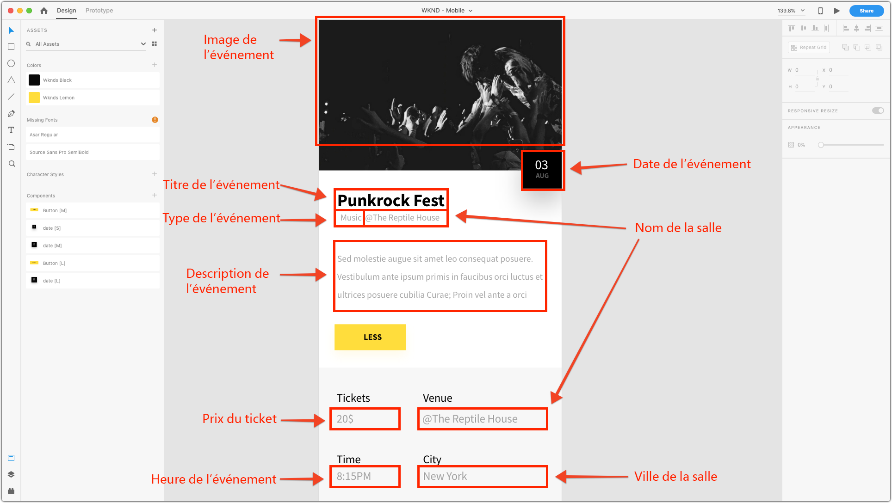
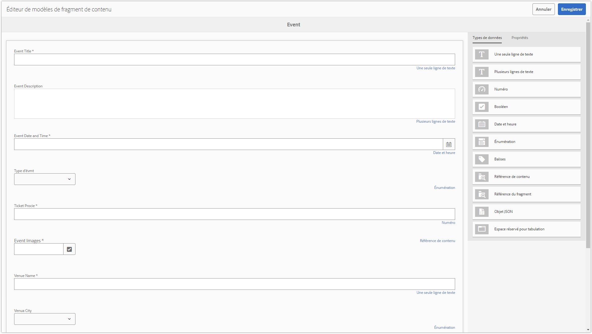

# Chapitre 2 - Utilisation de modèles de fragments de contenu

Les modèles AEM de fragments de contenu définissent des schémas de contenu qui peuvent être utilisés pour modéliser la création de contenu brut par les auteurs AEM. Cette approche est similaire à l’échafaudage ou à la création basée sur des formulaires. Le concept clé avec les fragments de contenu est que le contenu créé est indépendant de la présentation, c’est-à-dire qu’il est destiné à une utilisation à plusieurs canaux où l’application consommatrice, que ce soit AEM, une application d’une seule page ou une application mobile, contrôle la manière dont le contenu est affiché à l’utilisateur.

La Principale préoccupation du fragment de contenu est de veiller à ce que :

1. Le contenu correct est collecté auprès de l’auteur.
2. Le contenu peut être exposé dans un format structuré et bien compris aux applications consommatrices.

Ce chapitre porte sur l’activation et la définition des modèles de fragments de contenu utilisés pour définir une structure de données normalisée et une interface de création pour la modélisation et la création de &quot;Événements&quot;.

## Activation des modèles de fragment de contenu  

Les modèles de fragment de contenu **doivent être activés via**[ AEM [!UICONTROL Navigateur de configuration]](https://docs.adobe.com/content/help/fr-FR/experience-manager-cloud-service/implementing/developing/configurations.html)**.**

Si les modèles de fragment de contenu **ne sont pas** activés pour une configuration, le bouton **[!UICONTROL Créer] > [!UICONTROL Fragment de contenu]** n’apparaît pas pour la configuration AEM appropriée.

>[!NOTE]
>
>Les configurations AEM représentent un ensemble de [configurations locataires tenant compte du contexte](https://sling.apache.org/documentation/bundles/context-aware-configuration/context-aware-configuration.html) stockées sous `/conf`. En règle générale, les configurations AEM sont corrélées avec un site Web particulier géré à AEM Sites ou avec une unité opérationnelle responsable d&#39;un sous-ensemble de contenu (ressources, pages, etc.) en AEM.
>
>Pour qu&#39;une configuration affecte une hiérarchie de contenu, la configuration doit être référencée via la propriété `cq:conf` de cette hiérarchie de contenu. (Ceci est réalisé pour la configuration [!DNL WKND Mobile] dans **Étape 5** ci-dessous).
>
>Lorsque la configuration `global` est utilisée, elle s&#39;applique à tout le contenu et `cq:conf` n&#39;a pas besoin d&#39;être définie.
>
>Pour plus d’informations, consultez la [[!UICONTROL documentation du navigateur de configuration]](https://docs.adobe.com/content/help/en/experience-manager-cloud-service/implementing/developing/configurations.html).

1. Connectez-vous à AEM Author en tant qu’utilisateur disposant des autorisations appropriées pour modifier la configuration appropriée.
   * Pour ce didacticiel, l&#39;utilisateur **admin** peut être utilisé.
1. Accédez à **[!UICONTROL Outil] > [!UICONTROL Général] > [!UICONTROL Navigateur de configuration]**
1. Appuyez sur l&#39;icône **dossier** en regard de **[!DNL WKND Mobile]** pour sélectionner, puis appuyez sur le bouton **[!UICONTROL Modifier]** en haut à gauche.
1. Sélectionnez **[!UICONTROL Modèles de fragment de contenu]**, puis appuyez sur **[!UICONTROL Enregistrer et fermer]** dans le coin supérieur droit.

   Cela permet d’utiliser les modèles de fragments de contenu dans les arborescences de contenu des dossiers d’actifs pour lesquelles la configuration [!DNL WKND Mobile] est appliquée.

   >[!NOTE]
   >
   >Cette modification de configuration n&#39;est pas réversible à partir de l&#39;interface utilisateur Web [!UICONTROL AEM Configuration]. Pour annuler cette configuration :
   >    
   >    1. Ouvrir [CRXDE Lite](http://localhost:4502/crx/de)
   >    1. Accédez à `/conf/wknd-mobile/settings/dam/cfm`.
   >    1. Supprimer le noeud `models`

   >    
   >Tout modèle de fragment de contenu existant créé dans cette configuration sera supprimé, ainsi que leurs définitions stockées sous `/conf/wknd-mobile/settings/dam/cfm/models`.

1. Appliquez la configuration **[!DNL WKND Mobile]** au dossier **[!DNL WKND Mobile]Ressources** pour permettre la création de fragments de contenu à partir de modèles de fragments de contenu dans cette hiérarchie de dossiers Ressources :

   1. Accédez à **[!UICONTROL AEM] > [!UICONTROL Ressources] > [!UICONTROL Fichiers]**
   1. Sélectionnez le dossier **[!UICONTROL WKND Mobile]**.
   1. Appuyez sur le bouton **[!UICONTROL Propriétés]** dans la barre d’actions supérieure pour ouvrir [!UICONTROL Propriétés du dossier].
   1. Dans [!UICONTROL Propriétés du dossier], appuyez sur l&#39;onglet **[!UICONTROL Cloud Services]**.
   1. Vérifiez que le champ **[!UICONTROL Cloud Configuration]** est défini sur **/conf/wknd-mobile**.
   1. Appuyez sur **[!UICONTROL Enregistrer et fermer]** dans l’angle supérieur droit pour conserver les modifications.

>[!VIDEO](https://video.tv.adobe.com/v/28336/?quality=12&learn=on)

## Présentation du modèle de fragment de contenu à créer

Avant de définir le modèle de fragment de contenu, examinons l’expérience que nous allons mener pour nous assurer que nous capturons tous les points de données nécessaires. Pour ce faire, nous allons examiner la conception des applications mobiles et mapper les éléments de conception au contenu à collecter.

Nous pouvons ventiler les points de données qui définissent un Événement comme suit :

Armé de la mise en correspondance, nous pouvons définir le fragment de contenu qui sera utilisé pour collecter et, en fin de compte, exposer les données du Événement.

## Création du modèle de fragment de contenu

1. Accédez à **[!UICONTROL Outils] > [!UICONTROL Ressources] > [!UICONTROL Modèles de fragments de contenu]**.
1. Appuyez sur le dossier **[!DNL WKND Mobile]** pour l’ouvrir.
1. Appuyez sur **[!UICONTROL Créer]** pour ouvrir l’assistant de création de modèle de fragment de contenu.
1. Saisissez **[!DNL Event]** en tant que **[!UICONTROL Titre du modèle]** *(la description est facultative)* et appuyez sur **[!UICONTROL Créer]** pour enregistrer.

>[!VIDEO](https://video.tv.adobe.com/v/28337/?quality=12&learn=on)

## Définition de la structure du modèle de fragment de contenu

1. Accédez à **[!UICONTROL Outils] > [!UICONTROL Ressources] > [!UICONTROL Modèles de fragments de contenu] >[!DNL WKND]**.
1. Sélectionnez le **[!DNL Event]** modèle de fragment de contenu et appuyez sur **[!UICONTROL Modifier]** dans la barre d’actions supérieure.
1. A partir de l&#39;onglet **[!UICONTROL Types de données]** sur la droite, faites glisser la **[!UICONTROL saisie de texte sur une seule ligne]** dans la zone de dépôt de gauche pour définir le champ **[!DNL Question]**.
1. Assurez-vous que le nouveau **[!UICONTROL saisie de texte sur une seule ligne]** est sélectionné à gauche et que l&#39;onglet **[!UICONTROL Propriétés]** est sélectionné à droite. Renseignez les champs Propriétés comme suit :

   * [!UICONTROL Afficher comme] : `textfield`
   * [!UICONTROL Libellé du champ] : `Event Title`
   * [!UICONTROL Nom de la propriété] : `eventTitle`
   * [!UICONTROL Longueur]  max. : 25
   * [!UICONTROL Obligatoire]  :  `Yes`

Répétez ces étapes en utilisant les définitions d’entrée définies ci-dessous pour créer le reste du modèle de fragment de contenu de Événement.

>[!NOTE]
>
> Les champs **Nom de la propriété** DOIVENT correspondre exactement, car l&#39;application Android est programmée pour la clé de ces noms.

### Description d’événement

* [!UICONTROL Type de données] : `Multi-line text`
* [!UICONTROL Libellé du champ] : `Event Description`
* [!UICONTROL Nom de la propriété] : `eventDescription`
* [!UICONTROL Type par défaut] : `Rich text`

### Date et heure du événement

* [!UICONTROL Type de données] : `Date and time`
* [!UICONTROL Libellé du champ] : `Event Date and Time`
* [!UICONTROL Nom de la propriété] : `eventDateAndTime`
* [!UICONTROL Obligatoire]  :  `Yes`

### Type d&#39;évmt

* [!UICONTROL Type de données] : `Enumeration`
* [!UICONTROL Libellé du champ] : `Event Type`
* [!UICONTROL Nom de la propriété] : `eventType`
* [!UICONTROL Options] : `Art,Music,Performance,Photography`

### Prix du billet

* [!UICONTROL Type de données] : `Number`
* [!UICONTROL Afficher comme] : `numberfield`
* [!UICONTROL Libellé du champ] : `Ticket Price`
* [!UICONTROL Nom de la propriété] : `eventPrice`
* [!UICONTROL Type] : `Integer`
* [!UICONTROL Obligatoire]  :  `Yes`

### Image événement

* [!UICONTROL Type de données] : `Content Reference`
* [!UICONTROL Afficher comme] : `contentreference`
* [!UICONTROL Libellé du champ] : `Event Image`
* [!UICONTROL Nom de la propriété] : `eventImage`
* [!UICONTROL Chemin racine] : `/content/dam/wknd-mobile/images`
* [!UICONTROL Obligatoire]  :  `Yes`

### Nom du lieu

* [!UICONTROL Type de données] : `Single-line text`
* [!UICONTROL Afficher comme] : `textfield`
* [!UICONTROL Libellé du champ] : `Venue Name`
* [!UICONTROL Nom de la propriété] : `venueName`
* [!UICONTROL Longueur]  max. : 20
* [!UICONTROL Obligatoire]  :  `Yes`

### Ville du lieu

* [!UICONTROL Type de données] : `Enumeration`
* [!UICONTROL Libellé du champ] : `Venue City`
* [!UICONTROL Nom de la propriété] : `venueCity`
* [!UICONTROL Options]  :  `Basel,London,Los Angeles,Paris,New York,Tokyo`

>[!VIDEO](https://video.tv.adobe.com/v/28335/?quality=12&learn=on)

>[!NOTE]
>
>Le **[!UICONTROL nom de la propriété]** indique **à la fois** le nom de la propriété JCR où cette valeur sera stockée, ainsi que la clé du fichier JSON. Il doit s’agir d’un nom sémantique qui ne changera pas au cours de la vie du modèle de fragment de contenu.

Après avoir créé le modèle de fragment de contenu, vous devez obtenir une définition qui ressemble à ce qui suit :

## Étape suivante

Vous pouvez éventuellement installer le [com.adobe.aem.guides.wknd-mobile.content.chapter-2.zip](https://github.com/adobe/aem-guides-wknd-mobile/releases/latest) package de contenu sur AEM Author via [AEM Package Manager](http://localhost:4502/crx/packmgr/index.jsp). Ce package contient les configurations et le contenu décrits dans cette partie du didacticiel.

* [Chapitre 3 - Création de fragments de contenu de Événement](./chapter-3.md)
