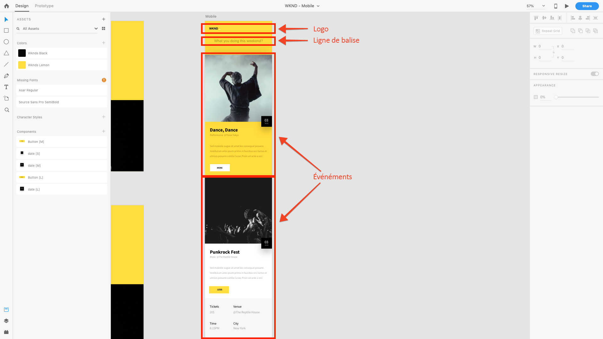

# Chapitre 4 - Définition des modèles Content Services

Le chapitre 4 du didacticiel AEM sans en-tête traite du rôle des AEM Modèles modifiables dans le contexte de AEM Content Services. Les modèles modifiables sont utilisés pour définir la structure de contenu JSON AEM que Content Services expose aux clients via la composition des AEM Composants activés pour Content Services.

## Comprendre le rôle des modèles dans AEM Content Services

AEM Modèles modifiables sont utilisés pour définir les points de terminaison HTTP qui seront utilisés pour exposer le contenu du Événement au format JSON.

Les modèles modifiables AEM traditionnellement sont utilisés pour définir des pages Web, mais cette utilisation est simplement une convention. Les modèles modifiables peuvent être utilisés pour composer **tout** ensemble de contenu ; mode d’accès à ce contenu : en tant que code HTML dans un navigateur, en tant que code JSON utilisé par JavaScript (AEM SPA Editor) ou une application mobile est une fonction de la manière dont cette page est demandée.

Dans AEM Content Services, les modèles modifiables sont utilisés pour définir la manière dont les données JSON sont exposées.

Pour l&#39;application [!DNL WKND Mobile], nous allons créer un modèle modifiable unique qui sera utilisé pour générer un point de terminaison d&#39;API unique. Bien que cet exemple soit simple pour illustrer les concepts de AEM sans en-tête, vous pouvez créer plusieurs pages (ou points de terminaison) exposant chacune différents ensembles de contenu afin de créer une API plus complexe et mieux organisée.

## Présentation du point de terminaison de l’API

Pour comprendre comment composer notre point de terminaison API et comprendre quel contenu doit être exposé à notre [!DNL WKND Mobile] application, nous allons revoir la conception.

Comme nous le voyons, nous avons trois jeux logiques de contenu à fournir à l&#39;application mobile.

1. **Logo**
2. Ligne de balise ****
3. Liste des **Événements**

Pour ce faire, nous pouvons associer ces exigences à AEM Composants (et dans notre cas, à AEM Composants principaux de WCM) afin d’exposer le contenu requis sous la forme JSON.

1. Le **logo** sera affiché via un composant **Image**
2. La **ligne de balise** sera affichée via un composant **Texte**
3. La liste de **Événements** sera affichée via un composant de Liste de fragment de contenu **** qui, à son tour, fait référence à un ensemble de fragments de contenu de Événement.

>[!NOTE]
>
>Pour prendre en charge l’exportation JSON de pages et de composants par AEM Content Service, les pages et les composants doivent **dériver des composants principaux AEM WCM**.
>
>[Les ](https://github.com/Adobe-Marketing-Cloud/aem-core-wcm-components) composants principaux de gestion de contenu Web AEM disposent d’une fonctionnalité intégrée pour prendre en charge un schéma JSON normalisé de pages et de composants exportés. Tous les composants WKND Mobile utilisés dans ce didacticiel (Liste de fragments de page, d’image, de texte et de contenu) proviennent des composants principaux de AEM WCM.

## Définition du modèle d&#39;API Événements

1. Accédez à **[!UICONTROL Outils] > [!UICONTROL Général] > [!UICONTROL Modèles] >[!DNL WKND Mobile]**.

1. Créez le modèle **[!DNL Events API]** :

   1. Appuyez sur **[!UICONTROL Créer]** dans la barre d’actions supérieure.
   1. Sélectionnez le modèle **[!DNL WKND Mobile - Empty Page]**
   1. Appuyez sur **[!UICONTROL Suivant]** dans la barre d’actions supérieure.
   1. Saisissez **[!DNL Events API]** dans le champ [!UICONTROL Titre du modèle].
   1. Appuyez sur **[!UICONTROL Créer]** dans la barre d’actions supérieure.
   1. Appuyez sur **[!UICONTROL Ouvrir]** pour ouvrir le nouveau modèle à modifier.

1. Tout d&#39;abord, nous permettons aux trois composants AEM identifiés de modéliser le contenu en modifiant la [!UICONTROL Stratégie] du Conteneur de mise en page racine . Assurez-vous que le mode **[!UICONTROL Structure]** est principal, sélectionnez **[!DNL Layout Container \[Root\]]**, puis appuyez sur le bouton **[!UICONTROL Stratégie]**.
1. Sous **[!UICONTROL Propriétés] > [!UICONTROL Composants autorisés]** recherchez **[!DNL WKND Mobile]**. Autorisez les composants suivants du groupe de composants [!DNL WKND Mobile] afin qu&#39;ils puissent être utilisés sur la page de l&#39;API [!DNL Events].

   * **[!DNL WKND Mobile > Image]**

      * Le logo de l’application
   * **[!DNL WKND Mobile > Text]**

      * Texte d’introduction de l’application
   * **[!DNL WKND Mobile > Content Fragment List]**

      * Liste des catégories de Événement disponibles pour l’affichage dans l’application

1. Appuyez sur la coche **[!UICONTROL Terminé]** dans le coin supérieur droit une fois terminé.
1. **** Actualisez la fenêtre du navigateur pour afficher la liste des  [!UICONTROL composants nouvellement ] autorisés dans le rail de gauche.
1. Dans l’outil de recherche des composants du rail de gauche, faites glisser les composants AEM suivants :
   1. **[!DNL Image]** pour le logo
   2. **[!DNL Text]** pour la ligne de balise
   3. **[!DNL Content Fragment List]** pour les événements
1. **Pour chacun des composants** ci-dessus, sélectionnez-les et appuyez sur le  **** bouton de déverrouillage.
1. Toutefois, assurez-vous que le **conteneur de mise en page** est **verrouillé** pour empêcher l&#39;ajout d&#39;autres composants ou la suppression de ces trois composants.
1. Appuyez sur **[!UICONTROL Informations sur la page] > [!UICONTROL Vue dans Admin]** pour revenir à la liste des modèles [!DNL WKND Mobile]. Sélectionnez le nouveau modèle **[!DNL Events API]** et appuyez sur **[!UICONTROL Activer]** dans la barre d’actions supérieure.

>[!VIDEO](https://video.tv.adobe.com/v/28342/?quality=12&learn=on)

>[!NOTE]
>
> Notez que les composants utilisés pour redimensionner le contenu sont ajoutés au modèle lui-même et verrouillés. Cela permet aux auteurs de modifier les composants prédéfinis, mais pas d’ajouter ou de supprimer arbitrairement des composants, car la modification de l’API elle-même peut rompre les hypothèses autour de la structure JSON et rompre les applications consommatrices. Toutes les API doivent être stables.

## Étapes suivantes

Vous pouvez éventuellement installer le [com.adobe.aem.guides.wknd-mobile.content.chapter-4.zip](https://github.com/adobe/aem-guides-wknd-mobile/releases/latest) package de contenu sur AEM Author via [AEM Package Manager](http://localhost:4502/crx/packmgr/index.jsp). Ce package contient les configurations et le contenu décrits dans ce didacticiel et les chapitres précédents.

* [Chapitre 5 - Création de pages Content Services](./chapter-5.md)
