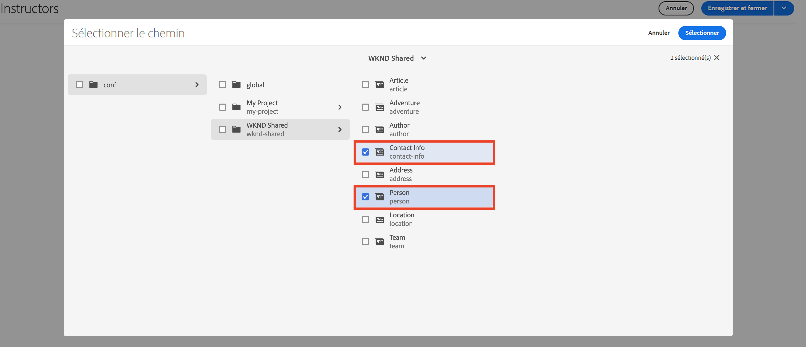
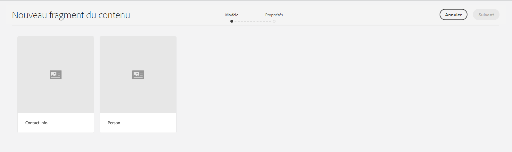
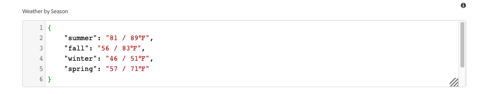
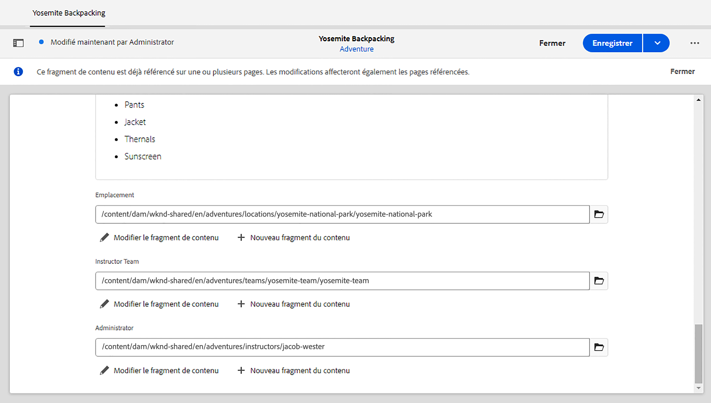

# Créer des fragments de contenu

Dans le [chapitre précédent](/help/headless-tutorial/graphql/advanced-graphql/create-content-fragment-models.md), vous avez créé cinq modèles de fragment de contenu : personne, équipe, emplacement, adresse et informations de contact. Ce chapitre décrit les étapes à suivre pour créer des fragments de contenu basés sur ces modèles. Il explique également comment créer des stratégies de dossier pour limiter les modèles de fragment de contenu pouvant être utilisés dans le dossier.

## Prérequis {#prerequisites}

Ce document fait partie d’un tutoriel en plusieurs parties. Assurez-vous que le [chapitre précédent](create-content-fragment-models.md) est terminé avant de passer à ce chapitre.

## Objectifs {#objectives}

Dans ce chapitre, découvrez comment :

* Créer des dossiers et définir des limites à l’aide de stratégies de dossier
* Créer des références de fragment directement à partir de l’éditeur de fragments de contenu
* Utiliser l’onglet, la date et les types de données d’objet JSON
* Insérer du contenu et des références de fragment dans l’éditeur de texte multiligne
* Ajouter plusieurs références de fragment
* Imbriquer des fragments de contenu

## Installer un exemple de contenu {#sample-content}

Installez un package AEM contenant plusieurs dossiers et exemples d’image utilisés pour accélérer le tutoriel.

1. Téléchargez [Advanced-GraphQL-Tutorial-Starter-Package-1.1.zip](/help/headless-tutorial/graphql/advanced-graphql/assets/tutorial-files/Advanced-GraphQL-Tutorial-Starter-Package-1.1.zip).
1. Dans AEM, accédez à **Outils** > **Déploiement** > **Packages** pour accéder au **Gestionnaire de packages**.
1. Téléchargez et installez le package (fichier zip) téléchargé à l’étape précédente.

   

## Créer des dossiers et définir des limites à l’aide de stratégies de dossier

Sur la page d’accueil AEM, sélectionnez **Ressources** > **Fichiers** > **WKND Shared** > **Anglais**. Vous trouverez ici les différentes catégories de fragments de contenu, y compris les Adventures et les contributeurs ou contributrices.

### Créer des dossiers {#create-folders}

Accédez au dossier **Adventures**. Vous pouvez constater que des dossiers pour les équipes et les emplacements ont déjà été créés pour stocker les fragments de contenu d’équipes et d’emplacements.

Créez un dossier pour les fragments de contenu d’instructeurs ou d’instructrices basés sur le modèle de fragment de contenu de personne.

1. Sur la page Adventures, sélectionnez **Créer** > **Dossier** dans le coin supérieur droit.

   

1. Dans la boîte de dialogue modale Créer un dossier qui s’affiche, saisissez « Instructeurs » ou « Instructrices » dans le champ **Titre**. Notez le « s » à la fin. Les titres des dossiers contenant de nombreux fragments doivent être au pluriel. Sélectionnez **Créer**.

   

   Vous avez maintenant créé un dossier pour stocker les instructeurs et instructrices d’Adventure.

### Définir des limites à l’aide de stratégies de dossier

AEM vous permet de définir des autorisations et des stratégies pour les dossiers de fragments de contenu. En utilisant des autorisations, vous pouvez n’accorder l’accès à certains dossiers qu’à certaines personnes chargées de la création ou à certains groupes de personnes chargées de la création. En utilisant des stratégies de dossier, vous pouvez limiter les modèles de fragment de contenu que les auteurs ou autrices peuvent utiliser dans ces dossiers. Dans cet exemple, limitons un dossier aux modèles de personne et d’informations de contact. Pour configurer une stratégie de dossier :

1. Sélectionnez le dossier **Instructeurs ou Intructrices** que vous avez créé, puis sélectionnez **Propriétés** dans la barre de navigation supérieure.

   

1. Sélectionnez l’onglet **Stratégies**, puis désélectionnez **Hérité de /content/dam/wknd-shared**. Dans le champ **Modèles de fragment de contenu autorisés par chemin d’accès**, sélectionnez l’icône de dossier.

   

1. Dans la boîte de dialogue Sélectionner le chemin d’accès qui s’ouvre, suivez le chemin **conf** > **WKND Shared**. Le modèle de fragment de contenu de personne, créé dans le chapitre précédent, contient une référence au modèle de fragment de contenu d’informations de contact. Les modèles de personne et d’informations de contact doivent être autorisés dans le dossier Instructeurs ou Instructrices pour créer un fragment de contenu Instructeur ou Instructrice. Sélectionnez **Personne** et **Informations de contact**, puis appuyez sur **Sélectionner** pour fermer la boîte de dialogue.

   .

1. Sélectionnez **Enregistrer et fermer**, puis sélectionnez **OK** dans la boîte de dialogue qui s’affiche.

1. Vous avez maintenant configuré une stratégie de dossier pour le dossier Instructeurs ou Instructrices. Accédez au dossier **Instructeurs ou Instructrices** et sélectionnez **Créer** > **Fragment de contenu**. Les seuls modèles que vous pouvez désormais sélectionner sont : **Personne** et **Informations de contact**.

   

## Créer des fragments de contenu pour les instructeurs et instructrices

Accédez au dossier **Instructeurs ou Instructrices**. À partir de là, créez un dossier imbriqué pour stocker les informations de contact des instructeurs ou instructrices.

Suivez les étapes décrites dans la section sur la [création de dossiers](#create-folders) pour créer un dossier intitulé « Informations de contact ». Le dossier imbriqué hérite des stratégies de dossier du dossier parent. N’hésitez pas à configurer des stratégies plus spécifiques afin que le dossier nouvellement créé autorise uniquement l’utilisation du modèle d’informations de contact.

### Créer un fragment de contenu d’instructeur ou d’instructrice

Créez quatre personnes qui peuvent être ajoutées à une équipe d’instructeurs ou d’instructrices d’Adventure.

1. Dans le dossier Instructeurs ou instructrices, créez un fragment de contenu basé sur le modèle de fragment de contenu Personne et donnez-lui le titre « Jacob Wester ».

   Le fragment de contenu nouvellement créé se présente comme suit :

   

1. Renseignez le contenu suivant dans les champs :

   * **Nom complet** : Jacob Wester
   * **Biographie** : Jacob Wester est instructeur de randonnée depuis dix ans et adore son métier. Jacob est un aventurier avec un talent pour l’escalade et la randonnée. Jacob a gagné des compétitions d’escalade, y compris la compétition d’escalade de bloc Battle of the Bay. Jacob vit actuellement en Californie.
   * **Niveau d’expérience de l’instructeur ou instructrice** : expert
   * **Compétences** : Rock Climbing, Surfing, Backpacking
   * **Détails d’administration** : Jacob Wester coordonne les aventures de randonnée depuis trois ans.

1. Dans le champ **Image de profil**, ajoutez une référence de contenu à une image. Accédez à **WKND Shared** > **Anglais** > **Contributeurs ou contributrices** > **jacob_wester.jpg** pour créer un chemin d’accès à l’image.

### Créer une référence de fragment à partir de l’éditeur de fragment de contenu {#fragment-reference-from-editor}

AEM vous permet de créer une référence de fragment directement à partir de l’éditeur de fragment de contenu. Créons une référence aux informations de contact de Jacob.

1. Sélectionnez **Nouveau fragment de contenu** sous le champ **Informations de contact**.

   

1. La boîte de dialogue modale Nouveau fragment de contenu s’ouvre. Sous l’onglet Sélectionner la destination, suivez le chemin **Adventures** > **Instructeurs ou instructrices** et cochez la case en regard du dossier **Informations de contact**. Sélectionnez **Suivant** pour accéder à l’onglet Propriétés.

   

1. Sous l’onglet Propriétés, saisissez « Informations de contact de Jacob Wester » dans le champ **Titre**. Sélectionnez **Créer**, puis appuyez sur **Ouvrir** dans la boîte de dialogue qui s’affiche.

   

   De nouveaux champs s’affichent pour vous permettre de modifier le fragment de contenu d’informations de contact.

   

1. Renseignez le contenu suivant dans les champs :

   * **Téléphone** : 209 888 0000
   * **E-mail** : jwester@wknd.com

   Une fois l’opération terminée, sélectionnez **Enregistrer**. Vous avez maintenant créé un fragment de contenu d’informations de contact.

1. Pour revenir au fragment de contenu de l’instructeur, sélectionnez **Jacob Wester** dans le coin supérieur gauche de l’éditeur.

   

   Le champ **Informations de contact** contient maintenant le chemin d’accès au fragment Informations de contact référencé. Il s’agit d’une référence de fragment imbriqué. Le fragment de contenu de l’instructeur terminé ressemble à ceci :

   

1. Sélectionnez **Enregistrer et fermer** pour enregistrer le fragment de contenu. Vous disposez désormais d’un nouveau fragment de contenu d’instructeur ou d’instructrice.

### Créer des fragments supplémentaires

Suivez le même processus que celui décrit dans la [section précédente](#fragment-reference-from-editor) pour créer trois fragments de contenu d’instructeur ou d’instructrice et trois fragments de contenu d’informations de contact supplémentaires pour ces instructeurs ou instructrices. Ajoutez le contenu suivant dans les fragments d’instructeur ou d’instructrice :

**Stacey Roswells**

| Champs | Valeurs |
| --- | --- |
| Titre du fragment de contenu | Stacey Roswells |
| Nom complet | Stacey Roswells |
| Informations de contact | /content/dam/wknd-shared/en/adventures/instructors/contact-info/stacey-roswells-contact-info |
| Photo de profil | /content/dam/wknd-shared/en/contributors/stacey-roswells.jpg |
| Biographie | Stacey Roswells est une grimpeuse accomplie et une alpiniste aventurière. Née à Baltimore, dans le Maryland, Stacey est la cadette de six enfants. Le père de Stacey était lieutenant-colonel dans la marine américaine et sa mère était professeure de danse moderne. La famille de Stacey a déménagé fréquemment selon les affectations de son père, et a pris ses premières photos lorsque ce dernier était posté en Thaïlande. C’est à cet endroit que Stacey a appris à faire de l’escalade. |
| Niveau d’expérience de l’instructeur ou instructrice | Avancé |
| Compétences | Rock Climbing | Skiing | Backpacking |

**Kumar Selvaraj**

| Champs | Valeurs |
| --- | --- |
| Titre du fragment de contenu | Kumar Selvaraj |
| Nom complet | Kumar Selvaraj |
| Informations de contact | /content/dam/wknd-shared/en/adventures/instructors/contact-info/kumar-selvaraj-contact-info |
| Photo de profil | /content/dam/wknd-shared/en/contributors/kumar-selvaraj.jpg |
| Biographie | Kumar Selvaraj est un instructeur professionnel expérimenté et certifié AMGA dont le principal objectif est d’aider les étudiantes et étudiants à améliorer leurs compétences en escalade et en randonnée. |
| Niveau d’expérience de l’instructeur ou instructrice | Avancé |
| Compétences | Rock Climbing | Backpacking |

**Ayo Ogunseinde**

| Champs | Valeurs |
| --- | --- |
| Titre du fragment de contenu | Ayo Ogunseinde |
| Nom complet | Ayo Ogunseinde |
| Informations de contact | /content/dam/wknd-shared/en/adventures/instructors/contact-info/ayo-ogunseinde-contact-info |
| Photo de profil | /content/dam/wknd-shared/en/contributors/ayo-ogunseinde-237739.jpg |
| Biographie | Ayo Ogunseinde est grimpeur professionnel et instructeur de randonnée qui vit à Fresno, en Californie centrale. Le but d’Ayo est de guider les randonneurs et randonneuses dans leurs aventures les plus épiques dans les parcs nationaux. |
| Niveau d’expérience de l’instructeur ou instructrice | Avancé |
| Compétences | Rock Climbing | Cycling | Backpacking |

Laissez le champ **Informations supplémentaires** vide.

Ajoutez les informations suivantes dans les fragments d’Informations de contact :

| Titre du fragment de contenu | Téléphone | E-mail |
| ------- | -------- | -------- |
| Informations de contact de Stacey Roswells | 209 888 0011 | sroswells@wknd.com |
| Informations de contact de Kumar Selvaraj | 209 888 0002 | kselvaraj@wknd.com |
| Informations de contact d’Ayo Ogunseinde | 209 888 0304 | aogunseinde@wknd.com |

Vous êtes maintenant en mesure de créer une équipe.

## Créer des fragments de contenu pour les emplacements

Accédez au dossier **Emplacements**. Vous voyez ici que deux dossiers imbriqués ont déjà été créés : Yosemite National Park, et Yosemite Valley Lodge.


Ignorez le dossier Yosemite Valley lodge pour l’instant. Nous y reviendrons ultérieurement dans cette section lorsque nous créerons un emplacement qui servira de base d’accueil à notre équipe d’instruction.

Accédez au dossier **Yosemite National Park**. Actuellement, il ne contient qu’une photo du Yosemite National Park. Créons un fragment de contenu à l’aide du modèle de fragment de contenu d’emplacement et nommons-le « Yosemite National Park ».

### Espaces réservés d’onglet

AEM vous permet d’utiliser des espaces réservés d’onglet pour regrouper différents types de contenu et faciliter la lecture et la gestion de vos fragments de contenu. Dans le chapitre précédent, vous avez ajouté des espaces réservés d’onglet au modèle d’emplacement. Par conséquent, le fragment de contenu Emplacement comporte désormais deux sections d’onglet : **Détails de l’emplacement** et **Adresse de l’emplacement**.


L’onglet **Détails de l’emplacement** contient les champs **Nom**, **Description**, **Informations de contact**, **Image de l’emplacement**, et **Météo par saison**, tandis que l’onglet **Adresse de l’emplacement** contient une référence à un fragment de contenu d’adresse. Les onglets permettent de déterminer clairement les types de contenu à renseigner, ce qui facilite la gestion de la création de contenu.

### Type de données d’objet JSON

Le champ **Météo par saison** est un type de données d’objet JSON, ce qui signifie qu’il accepte les données au format JSON. Ce type de données est flexible et peut être utilisé pour toutes les données que vous souhaitez inclure dans votre contenu.

Vous pouvez voir la description du champ qui a été créée dans le chapitre précédent en pointant la souris sur l’icône d’informations située à droite du champ.


Dans ce cas, nous devons fournir la météo générale pour l’emplacement. Saisissez les données suivantes :

```json
{
    "summer": "81 / 89°F",
    "fall": "56 / 83°F",
    "winter": "46 / 51°F",
    "spring": "57 / 71°F"
}
```

Le champ **Météo par saison** doit maintenant ressembler à ceci :



### Ajouter du contenu

Ajoutons le reste du contenu au fragment de contenu de l’emplacement afin d’interroger les informations avec GraphQL dans le chapitre suivant.

1. Dans l’onglet **Détails de l’emplacement**, renseignez les informations suivantes dans les champs :

   * **Nom** : Yosemite National Park
   * **Description** : le Yosemite National Park se trouve dans la chaîne de montagnes Sierra Nevada en Californie. Il est célèbre pour ses magnifiques cascades, ses séquoias géants et ses vues emblématiques des falaises El Capitan et Half Dome. La randonnée et le camping constituent les meilleurs moyens de découvrir Yosemite. De nombreux sentiers offrent d’innombrables possibilités d’aventure et d’exploration.

1. Dans le champ **Informations de contact**, créez un fragment de contenu basé sur le modèle d’informations de contact et nommez-le « Yosemite National Park Contact Info ». Suivez la même procédure que celle décrite dans la section précédente sur la [création d’une référence à un fragment à partir de l’éditeur](#fragment-reference-from-editor) et saisissez les données suivantes dans les champs :

   * **Téléphone** : 209 999 0000
   * **E-mail** : yosemite@wknd.com

1. Dans le champ **Image de l’emplacement**, accédez à **Adventures** > **Emplacements** > **Yosemite National Park** > **yosemite-national-park.jpeg** pour créer un chemin d’accès à l’image.

   N’oubliez pas que, dans le chapitre précédent, vous avez configuré la validation de l’image. Par conséquent, les dimensions de l’image de l’emplacement doivent être inférieures à 2 560 x 1 800 px, et la taille du fichier doit être inférieure à 3 Mo.

1. Après avoir ajouté toutes les informations, l’onglet **Détails de l’emplacement** ressemble désormais à ceci :

   

1. Accédez à l’onglet **Adresse de l’emplacement**. Dans le champ **Adresse**, créez un fragment de contenu intitulé « Yosemite National Park Address » à l’aide du modèle de fragment de contenu d’adresse que vous avez créé dans le chapitre précédent. Suivez la même procédure que celle décrite dans la section sur la [création d’une référence à un fragment à partir de l’éditeur](#fragment-reference-from-editor) et saisissez les données suivantes dans les champs :

   * **Adresse postale** : 9010 Curry Village Drive
   * **Ville** : Yosemite Valley
   * **État** : CA
   * **Code postal** : 95389
   * **Pays** : États-Unis

1. L’onglet **Adresse de l’emplacement** terminé du fragment Yosemite National Park ressemble à ceci :

   

1. Sélectionnez **Enregistrer et fermer**.

### Créer un fragment supplémentaire

1. Accédez au dossier **Yosemite Valley Lodge**. Créez un fragment de contenu à l’aide du modèle de fragment de contenu de l’emplacement et nommez-le « Yosemite Valley Lodge ».

1. Dans l’onglet **Détails de l’emplacement**, renseignez les informations suivantes dans les champs :

   * **Nom** : Yosemite Valley Lodge
   * **Description** : Yosemite Valley Lodge est un lieu de rencontres de groupe et d’activités de toutes sortes, telles que le shopping, la restauration, la pêche, la randonnée et bien d’autres activités.

1. Dans le champ **Informations de contact**, créez un fragment de contenu basé sur le modèle d’informations de contact et donnez-lui le titre « Yosemite Valley Lodge Contact Info ». Suivez la même procédure que celle décrite dans la section sur la [création d’une référence à un fragment à partir de l’éditeur](#fragment-reference-from-editor) et saisissez les données suivantes dans les champs du nouveau fragment de contenu :

   * **Téléphone** : 209 992 0000
   * **E-mail** : yosemitelodge@wknd.com

   Enregistrez le fragment de contenu que vous venez de créer.

1. Revenez à **Yosemite Valley Lodge** et accédez à l’onglet **Adresse de l’emplacement**. Dans le champ **Adresse**, créez un fragment de contenu intitulé « Yosemite Valley Lodge Address » à l’aide du modèle de fragment de contenu d’adresse que vous avez créé dans le chapitre précédent. Suivez la même procédure que celle décrite dans la section sur la [création d’une référence à un fragment à partir de l’éditeur](#fragment-reference-from-editor) et saisissez les données suivantes dans les champs :

   * **Adresse postale** : 9006 Yosemite Lodge Drive
   * **Ville** : Yosemite National Park
   * **État** : CA
   * **Code postal** : 95389
   * **Pays** : États-Unis

   Enregistrez le fragment de contenu que vous venez de créer.

1. Revenez à **Yosemite Valley Lodge**, puis sélectionnez **Enregistrer et fermer**. Le dossier **Yosemite Valley Lodge** contient maintenant trois fragments de contenu : Yosemite Valley lodge, Yosemite Valley Lodge Contact Info et Yosemite Valley Lodge Address.

   

## Créer un fragment de contenu d’équipe

Parcourir les dossiers jusqu’à **Équipes** > **Équipe Yosemite**. Vous pouvez constater que le dossier Équipe Yosemite ne contient actuellement que le logo de l’équipe.


Créons un fragment de contenu à l’aide du modèle de fragment de contenu d’équipe et nommons-le « Équipe Yosemite ».

### Références à des fragments et du contenu dans l’éditeur de texte multiligne

AEM vous permet d’ajouter des références à des fragments et du contenu directement dans l’éditeur de texte multiligne et de les récupérer ultérieurement à l’aide de requêtes GraphQL. Ajoutons des références à des fragments et à du contenu dans le champ **Description**.

1. Tout d’abord, ajoutez le texte suivant dans le champ **Description** : « L’équipe aventurière professionnelle chargée de vous guider en randonnée dans le Yosemite National Park ».

1. Pour ajouter une référence au contenu, sélectionnez l’icône **Insérer une ressource** dans la barre d’outils de l’éditeur de texte multiligne.

   

1. Dans la boîte de dialogue modale qui s’affiche, sélectionnez **team-yosemite-logo.png** et cliquez sur **Sélectionner**.

   

   La référence au contenu a été ajoutée dans le champ **Description**.

N’oubliez pas que dans le chapitre précédent, vous avez autorisé l’ajout de références à des fragments au champ **Description**. Ajoutons-en une ici.

1. Sélectionnez l’icône **Insérer un fragment de contenu** dans la barre d’outils de l’éditeur de texte multiligne.

   

1. Accédez à **WKND Shared** > **Anglais** > **Adventures** > **Emplacements** > **Yosemite Valley Lodge** > **Yosemite Valley Lodge**. Cliquez sur **Sélectionner** pour insérer le fragment de contenu.

   

   Le champ **Description** se présente désormais comme suit :

   

Vous avez ajouté le contenu et les références aux fragments directement dans l’éditeur de texte multiligne.

### Type de données Date et heure

Examinons le type de données Date et heure. Sélectionnez l’icône **Calendrier** sur le côté droit du champ **Date de création de l’équipe** pour ouvrir la vue Calendrier.


Les dates passées ou futures peuvent être définies à l’aide des flèches suivant et précédent situées de chaque côté du mois. Disons que l’équipe Yosemite a été fondée le 24 mai 2016, nous allons donc définir cette date.

### Ajouter plusieurs références de fragment

Ajoutons des instructeurs ou intructrices à la référence de fragment Membres de l’équipe.

1. Sélectionnez **Ajouter** dans le champ **Membres de l’équipe**.

   

1. Dans le nouveau champ qui s’affiche, sélectionnez l’icône de dossier pour ouvrir la boîte de dialogue modale de Sélection du chemin d’accès. Parcourez les dossiers dans **WKND Shared** > **Anglais** > **Adventures** > **Instructeurs ou Instructrices**, puis cochez la case en regard de **jacob-wester**. Appuyez sur **Sélectionner** pour enregistrer le chemin d’accès.

   

1. Sélectionnez le bouton **Ajouter** trois fois de plus. Utilisez les nouveaux champs pour ajouter les trois autres instructeurs ou instructrices à l’équipe. Le champ **Membres de l’équipe** ressemble désormais à ceci :

   

1. Sélectionnez **Enregistrer et fermer** pour enregistrer le fragment de contenu d’équipe.

### Ajouter des références de fragment à un fragment de contenu d’Adventure

Enfin, ajoutons nos nouveaux fragments de contenu à une Adventure.

1. Accédez à **Adventures** > **Yosemite Backpacking** et ouvrez le fragment de contenu Yosemite Backpacking. Au bas du formulaire, vous pouvez voir les trois champs que vous avez créés dans le chapitre précédent : **Emplacement**, **Équipe d’instructeurs et d’instructrices**, et **Administrateur ou Administratrice**.

1. Ajoutez la référence au fragment dans le champ **Emplacement**. Le chemin d’accès de l’emplacement doit faire référence au fragment de contenu Yosemite National Park que vous avez créé : `/content/dam/wknd-shared/en/adventures/locations/yosemite-national-park/yosemite-national-park`.

1. Ajoutez la référence de fragment dans le champ **Équipe d’instructeurs et d’instructrices**. Le chemin d’accès pour l’équipe doit faire référence au fragment de contenu d’équipe Yosemite que vous avez créé : `/content/dam/wknd-shared/en/adventures/teams/yosemite-team/yosemite-team`. Il s’agit d’une référence de fragment imbriqué. Le fragment de contenu d’équipe contient une référence au modèle de personne qui fait référence aux modèles d’informations de contact et d’adresse. Par conséquent, vous avez des fragments de contenu imbriqués sur trois niveaux vers le bas.

1. Ajoutez la référence de fragment dans le champ **Administrateur ou administratrice**. Disons que Jacob Wester est administrateur de l’Adventure Yosemite Backpacking. Le chemin d’accès doit mener au fragment de contenu Jacob Wester et ressembler à ceci : `/content/dam/wknd-shared/en/adventures/instructors/jacob-wester`.

1. Vous avez maintenant ajouté trois références de fragment à un fragement de contenu d’Adventure. Les champs se présentent comme suit :

   

1. Sélectionnez **Enregistrer et fermer** pour enregistrer votre contenu.

## Félicitations.

Félicitations. Vous avez maintenant créé des fragments de contenu à partir des modèles de fragments de contenu avancés créés dans le chapitre précédent. Vous avez également créé une stratégie de dossier pour limiter les modèles de fragment de contenu pouvant être sélectionnés dans un dossier.

## Étapes suivantes

Dans le [chapitre suivant](/help/headless-tutorial/graphql/advanced-graphql/explore-graphql-api.md), vous découvrez comment envoyer des requêtes GraphQL avancées à l’aide de l’environnement de développement intégré (IDE) GraphiQL. Ces requêtes nous permettent de visualiser les données créées dans ce chapitre, puis d’ajouter ces requêtes à l’application WKND.
