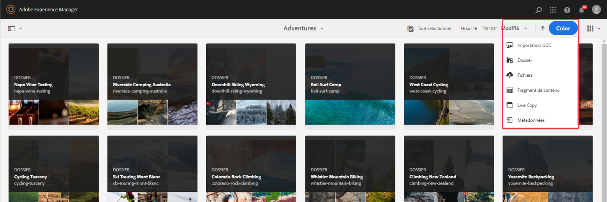

# Création de fragments de contenu

Dans le [chapitre précédent](/help/headless-tutorial/graphql/advanced-graphql/create-content-fragment-models.md), vous avez créé cinq modèles de fragment de contenu : Personne, équipe, emplacement, adresse et coordonnées. Ce chapitre décrit les étapes à suivre pour créer des fragments de contenu en fonction de ces modèles. Il explique également comment créer des stratégies de dossier pour limiter l’utilisation des modèles de fragment de contenu dans le dossier.

## Prérequis {#prerequisites}

Ce document fait partie d’un tutoriel en plusieurs parties. Assurez-vous que la variable [chapitre précédent](create-content-fragment-models.md) a été terminé avant de poursuivre ce chapitre.

## Objectifs {#objectives}

Dans ce chapitre, découvrez comment :

* Création de dossiers et définition de limites à l’aide de stratégies de dossiers
* Création de références à des fragments directement à partir de l’éditeur de fragments de contenu
* Utiliser les types de données d’objet Tab, Date et JSON
* Insérer du contenu et des références à des fragments dans l’éditeur de texte multiligne
* Ajout de plusieurs références à des fragments
* Imbrication de fragments de contenu

## Installer un exemple de contenu {#sample-content}

Installez un module d’AEM qui contient plusieurs dossiers et exemples d’images utilisés pour accélérer le tutoriel.

1. Télécharger [Advanced-GraphQL-Tutorial-Starter-Package-1.1.zip](/help/headless-tutorial/graphql/advanced-graphql/assets/tutorial-files/Advanced-GraphQL-Tutorial-Starter-Package-1.1.zip)
1. Dans AEM, accédez à **Outils** > **Déploiement** > **Packages** accès **Gestionnaire de modules**.
1. Téléchargez et installez le package (fichier zip) téléchargé à l’étape précédente.

   

## Création de dossiers et définition de limites à l’aide de stratégies de dossiers

Sur la page d’accueil AEM, sélectionnez **Ressources** > **Fichiers** > **WKND partagé** > **Anglais**. Vous trouverez ici les différentes catégories de fragments de contenu, y compris les avantages et les contributeurs.

### Créer des dossiers {#create-folders}

Accédez au **Aventures** dossier. Vous pouvez constater que des dossiers pour les équipes et les emplacements ont déjà été créés pour stocker les équipes et les emplacements dans les fragments de contenu.

Créez un dossier pour les fragments de contenu d’instructeurs basés sur le modèle de fragment de contenu de personne.

1. Sur la page Aventures, sélectionnez **Créer** > **Dossier** dans le coin supérieur droit.

   

1. Dans le modal Create Folder (Créer un dossier) qui s’affiche, saisissez &quot;Instructions&quot; dans le champ **Titre** champ . Notez le &quot;s&quot; à la fin. Les titres des dossiers contenant de nombreux fragments doivent être pluriels. Sélectionnez **Créer**.

   

   Vous avez maintenant créé un dossier pour stocker les instructeurs d’aventure.

### Définition de limites à l’aide de stratégies de dossier

AEM vous permet de définir des autorisations et des stratégies pour les dossiers de fragments de contenu. En utilisant des autorisations, vous ne pouvez accorder à certains utilisateurs (auteurs) ou groupes d’auteurs que l’accès à certains dossiers. En utilisant des stratégies de dossier, vous pouvez limiter les modèles de fragment de contenu que les auteurs peuvent utiliser dans ces dossiers. Dans cet exemple, limitons un dossier aux modèles Personne et Infos contact . Pour configurer une stratégie de dossier :

1. Sélectionnez la **Instructions** dossier que vous avez créé, puis sélectionnez **Propriétés** dans la barre de navigation supérieure.

   

1. Sélectionnez la **Stratégies** , puis dé-sélectionner **Hérité de /content/dam/wknd-shared**. Dans le **Modèles de fragment de contenu autorisés par chemin** , sélectionnez l’icône de dossier.

   

1. Dans la boîte de dialogue Sélectionner le chemin qui s’ouvre, suivez le chemin **conf** > **WKND partagé**. Le modèle de fragment de contenu Personne, créé dans le chapitre précédent, contient une référence au modèle de fragment de contenu Coordonnées. Les modèles Person et Contact Info doivent être autorisés dans le dossier Instructions pour créer un fragment de contenu instructeur. Sélectionner **Personne** et **Coordonnées**, puis appuyez sur **Sélectionner** pour fermer la boîte de dialogue.

   

1. Sélectionner **Enregistrer et fermer** et sélectionnez **OK** dans la boîte de dialogue de réussite qui s’affiche.

1. Vous avez maintenant configuré une stratégie de dossier pour le dossier Instructions. Accédez au **Instructions** et sélectionnez **Créer** > **Fragment de contenu**. Les seuls modèles que vous pouvez désormais sélectionner sont : **Personne** et **Coordonnées**.

   

## Création de fragments de contenu pour les instructeurs

Accédez au **Instructions** dossier. À partir de là, créons un dossier imbriqué pour stocker les coordonnées des instructeurs.

Suivez les étapes décrites dans la section sur [création de dossiers](#create-folders) pour créer un dossier intitulé &quot;Contact Info&quot;. Le dossier imbriqué hérite des stratégies de dossier du dossier parent. N’hésitez pas à configurer des stratégies plus spécifiques afin que le dossier nouvellement créé autorise uniquement l’utilisation du modèle Coordonnées .

### Création d’un fragment de contenu instructeur

Créons quatre personnes qui peuvent être ajoutées à une équipe d&#39;instructeurs d&#39;aventure.

1. Dans le dossier Instructions, créez un fragment de contenu basé sur le modèle de fragment de contenu Personne et donnez-lui le titre &quot;Jacob Wester&quot;.

   Le fragment de contenu nouvellement créé se présente comme suit :

   

1. Renseignez les champs suivants :

   * **Nom complet**: Jacob Wester
   * **Biographie**: Jacob Wester est instructeur de randonnée depuis dix ans et a adoré chaque minute ! Jacob est un chercheur d&#39;aventure avec un talent pour l&#39;escalade et la randonnée. Jacob est le gagnant des compétitions d&#39;escalade, y compris la compétition Battle of the Bay bouldering. Jacob vit actuellement en Californie.
   * **Niveau d’expérience de l’instructeur**: Expert
   * **Compétences**: Escalade, surf, randonnée
   * **Détails de l’administrateur**: Jacob Wester coordonne les aventures de randonnée depuis trois ans.

1. Dans le **Image de profil** , ajoutez une référence de contenu à une image. Accédez à **WKND partagé** > **Anglais** > **Contributeurs** > **jacob_wester.jpg** pour créer un chemin d’accès à l’image.

### Création d’une référence à un fragment à partir de l’éditeur de fragment de contenu {#fragment-reference-from-editor}

AEM vous permet de créer une référence à un fragment directement à partir de l’éditeur de fragment de contenu. Créons une référence aux coordonnées de Jacob.

1. Sélectionner **Nouveau fragment de contenu** below the **Coordonnées** champ .

   

1. Le modal Nouveau fragment de contenu s’ouvre. Sous l’onglet Sélectionner la destination , suivez le chemin **Aventures** > **Instructions** et cochez la case en regard de l’option **Coordonnées** dossier. Sélectionner **Suivant** pour accéder à l’onglet Propriétés .

   

1. Sous l’onglet Propriétés , saisissez &quot;Jacob Wester Contact Info&quot; dans la variable **Titre** champ . Sélectionner **Créer**, puis appuyez sur **Ouvrir** dans la boîte de dialogue de réussite qui s’affiche.

   

   De nouveaux champs s’affichent pour vous permettre de modifier le fragment de contenu des informations de contact.

   

1. Renseignez les champs suivants :

   * **Téléphone**: 209-888-0000
   * **Email**: jwester@wknd.com

   Une fois l’opération terminée, sélectionnez **Enregistrer**. Vous avez maintenant créé un fragment de contenu Contact Info.

1. Pour revenir au fragment de contenu de l’instructeur, sélectionnez **Jacob Wester** dans le coin supérieur gauche de l’éditeur.

   

   Le **Coordonnées** contient maintenant le chemin d’accès au fragment Coordonnées référencé. Il s’agit d’une référence à un fragment imbriqué. Le fragment de contenu instructeur terminé ressemble à ceci :

   

1. Sélectionner **Enregistrer et fermer** pour enregistrer le fragment de contenu. Vous disposez désormais d’un nouveau fragment de contenu instructeur.

### Créer des fragments supplémentaires

Suivez le même processus que décrit dans la section [section précédente](#fragment-reference-from-editor) créer trois autres fragments de contenu instructeurs et trois fragments de contenu Contact Info pour ces instructeurs. Ajoutez le contenu suivant dans les fragments Instructions :

**Stacey Roswells**

| Champs | Valeurs |
| --- | --- |
| Titre du fragment de contenu | Stacey Roswells |
| Nom complet | Stacey Roswells |
| Informations de contact | /content/dam/wknd-shared/fr/aventures/instructors/contact-info/stacey-roswells-contact-info |
| Image de profil | /content/dam/wknd-shared/en/contributors/stacey-roswells.jpg |
| Biographie | Stacey Roswells est un alpiniste accompli et un aventurier alpin. Né à Baltimore, dans le Maryland, Stacey est le plus jeune des six enfants. Le père de Stacey était lieutenant-colonel dans la marine américaine et mère était enseignante de danse moderne. La famille de Stacey a déménagé fréquemment avec les devoirs de son père, et a pris les premières photos quand son père était en poste en Thaïlande. C&#39;est aussi là que Stacey a appris à faire de l&#39;escalade. |
| Niveau d’expérience de l’instructeur | Avancé |
| Compétences | Escalade | Skier | Remplir |

**Kumar Selvaraj**

| Champs | Valeurs |
| --- | --- |
| Titre du fragment de contenu | Kumar Selvaraj |
| Nom complet | Kumar Selvaraj |
| Informations de contact | /content/dam/wknd-shared/fr/aventures/instructors/contact-info/kumar-selvaraj-contact-info |
| Image de profil | /content/dam/wknd-shared/en/contributors/kumar-selvaraj.jpg |
| Biographie | Kumar Selvaraj est une professeure professionnelle expérimentée certifiée AMGA dont le principal objectif est d&#39;aider les étudiants à améliorer leurs compétences en escalade et randonnée. |
| Niveau d’expérience de l’instructeur | Avancé |
| Compétences | Escalade | Remplir |

**Ayo Ogunseinde**

| Champs | Valeurs |
| --- | --- |
| Titre du fragment de contenu | Ayo Ogunseinde |
| Nom complet | Ayo Ogunseinde |
| Informations de contact | /content/dam/wknd-shared/fr/aventures/instructors/contact-info/ayo-ogunseinde-contact-info |
| Image de profil | /content/dam/wknd-shared/en/contributors/ayo-ogunseinde-237739.jpg |
| Biographie | Ayo Ogunseinde est un grimpeur professionnel et instructeur de randonnée vivant à Fresno, en Californie centrale. Le but d&#39;Ayo est de guider les randonneurs dans leurs aventures les plus épopées du parc national. |
| Niveau d’expérience de l’instructeur | Avancé |
| Compétences | Escalade | Cyclisme | Remplir |

Laissez le champ **Informations supplémentaires** champ vide.

Ajoutez les informations suivantes dans les fragments Contact Info :

| Titre du fragment de contenu | Téléphone | E-mail |
| ------- | -------- | -------- |
| Informations de contact de Stacey Roswells | 209-888-0011 | sroswells@wknd.com |
| Informations de contact Kumar Selvaraj | 209-888-0002 | kselvaraj@wknd.com |
| Informations de contact sur Ayo Ogunseinde | 209-888-0304 | aogunseinde@wknd.com |

Vous êtes maintenant prêt à créer une équipe !

## Création de fragments de contenu pour les emplacements

Accédez au **Emplacements** dossier. Vous voyez ici deux dossiers imbriqués qui ont déjà été créés : Le parc national de Yosemite et le pavillon de la vallée de Yosemite.


Ignorez le dossier Yosemite Valley lodge pour l’instant. Nous y reviendrons ultérieurement dans cette section lorsque nous créerons un emplacement qui servira de base d’accueil à notre équipe d’instructeurs.

Accédez au **Parc national de Yosemite** dossier. Actuellement, il ne contient qu&#39;une photo du parc national de Yosemite. Créons un fragment de contenu à l’aide du modèle de fragment de contenu de l’emplacement et nommons-le &quot;Parc national Yosemite&quot;.

### Espaces réservés à l’onglet

AEM vous permet d’utiliser des espaces réservés d’onglets pour regrouper différents types de contenu et faciliter la lecture et la gestion de vos fragments de contenu. Dans le chapitre précédent, vous avez ajouté des espaces réservés d’onglet au modèle Emplacement. Par conséquent, le fragment de contenu d’emplacement comporte désormais deux sections d’onglets : **Détails de l’emplacement** et **Adresse de l’emplacement**.


Le **Détails de l’emplacement** contient le **Nom**, **Description**, **Coordonnées**, **Image de l’emplacement**, et **La météo par saison** , tandis que la variable **Adresse de l’emplacement** contient une référence à un fragment de contenu d’adresse. Les onglets permettent de déterminer clairement les types de contenu à renseigner, de sorte que la création de contenu est plus facile à gérer.

### Type de données d’objet JSON

Le **La météo par saison** est un type de données d’objet JSON, ce qui signifie qu’il accepte les données au format JSON. Ce type de données est flexible et peut être utilisé pour toutes les données que vous souhaitez inclure dans votre contenu.

Vous pouvez voir la description du champ qui a été créée dans le chapitre précédent en pointant la souris sur l’icône d’information située à droite du champ.


Dans ce cas, nous devons fournir la météo moyenne pour l&#39;emplacement. Saisissez les données suivantes :

```json
{
    "summer": "81 / 89°F",
    "fall": "56 / 83°F",
    "winter": "46 / 51°F",
    "spring": "57 / 71°F"
}
```

Le **La météo par saison** doit maintenant ressembler à ceci :


### Ajouter du contenu

Ajoutons le reste du contenu au fragment de contenu de l’emplacement afin d’interroger les informations avec GraphQL dans le chapitre suivant.

1. Dans le **Détails de l’emplacement** , renseignez les informations suivantes dans les champs :

   * **Nom**: Parc national de Yosemite
   * **Description**: Le parc national de Yosemite se trouve dans les montagnes de la Sierra Nevada en Californie. Elle est célèbre pour ses magnifiques chutes d&#39;eau, ses séquoias géants et ses vues emblématiques des falaises d&#39;El Capitan et du Half Dome. La randonnée et le camping sont les meilleurs moyens de vivre Yosemite. De nombreux sentiers offrent d&#39;innombrables possibilités d&#39;aventure et d&#39;exploration.

1. Dans la **Coordonnées** , créez un fragment de contenu basé sur le modèle Contact Info et donnez-lui le titre &quot;Yosemite National Park Contact Info&quot;. Suivez la même procédure que celle décrite dans la section précédente sur [création d’une référence à un fragment à partir de l’éditeur](#fragment-reference-from-editor) et saisissez les données suivantes dans les champs :

   * **Téléphone**: 209-999-0000
   * **Email**: yosemite@wknd.com

1. Dans la **Image de l’emplacement** champ, accédez à **Aventures** > **Emplacements** > **Parc national de Yosemite** > **yosemite-national-park.jpeg** pour créer un chemin d’accès à l’image.

   N’oubliez pas que, dans le chapitre précédent, vous avez configuré la validation de l’image. Par conséquent, les dimensions de l’image d’emplacement doivent être inférieures à 2 560 x 1 800, et sa taille de fichier doit être inférieure à 3 Mo.

1. Avec toutes les informations ajoutées, la variable **Détails de l’emplacement** se présente désormais comme suit :

   

1. Accédez au **Adresse de l’emplacement** . Dans la **Adresse** créez un fragment de contenu intitulé &quot;Adresse du parc national de Yosemite&quot; à l’aide du modèle de fragment de contenu d’adresse que vous avez créé dans le chapitre précédent. Suivez la même procédure que celle décrite dans la section sur [création d’une référence à un fragment à partir de l’éditeur](#fragment-reference-from-editor) et saisissez les données suivantes dans les champs :

   * **Adresse postale**: 9010 Curry Village Drive
   * **Ville**: Vallée de Yosemite
   * **État**: CA
   * **Code postal**: 95389
   * **Pays**: États-Unis

1. Terminé **Adresse de l’emplacement** de l&#39;onglet du fragment Parc National Yosemite ressemble à ceci :

   

1. Sélectionnez **Enregistrer et fermer**.

### Créer un fragment supplémentaire

1. Accédez au **Logement de la vallée de Yosemite** dossier. Créez un fragment de contenu à l’aide du modèle de fragment de contenu de l’emplacement et nommez-le &quot;Yosemite Valley lodge&quot;.

1. Dans le **Détails de l’emplacement** , renseignez les informations suivantes dans les champs :

   * **Nom**: Logement de la vallée de Yosemite
   * **Description**: Le Yosemite Valley lodge est un centre de rencontres de groupe et d&#39;activités de toutes sortes, telles que le shopping, la restauration, la pêche, la randonnée et bien d&#39;autres activités.

1. Dans la **Coordonnées** créez un fragment de contenu basé sur le modèle Contact Info et donnez-lui le titre &quot;Yosemite Valley Log Contact Info&quot;. Suivez la même procédure que celle décrite dans la section sur [création d’une référence à un fragment à partir de l’éditeur](#fragment-reference-from-editor) et saisissez les données suivantes dans les champs du nouveau fragment de contenu :

   * **Téléphone**: 209-992-0000
   * **Email**: yosemitelodge@wknd.com

   Enregistrez le fragment de contenu nouvellement créé.

1. Revenez à **Logement de la vallée de Yosemite** et accédez au **Adresse de l’emplacement** . Dans la **Adresse** créez un fragment de contenu intitulé &quot;Adresse de la villa de la vallée de Yosemite&quot; à l’aide du modèle de fragment de contenu d’adresse que vous avez créé dans le chapitre précédent. Suivez la même procédure que celle décrite dans la section sur [création d’une référence à un fragment à partir de l’éditeur](#fragment-reference-from-editor) et saisissez les données suivantes dans les champs :

   * **Adresse postale**: 9006, rue Yosemite
   * **Ville**: Parc national de Yosemite
   * **État**: CA
   * **Code postal**: 95389
   * **Pays**: États-Unis

   Enregistrez le fragment de contenu nouvellement créé.

1. Revenez à **Logement de la vallée de Yosemite**, puis sélectionnez **Enregistrer et fermer**. Le **Logement de la vallée de Yosemite** contient maintenant trois fragments de contenu : Yosemite Valley lodge, Yosemite Valley lodge Contact Info et Yosemite Valley lodge Address.

   

## Création d’un fragment de contenu d’équipe

Parcourir les dossiers vers **Équipes** > **Equipe Yosemite**. Vous pouvez constater que le dossier Equipe Yosemite ne contient actuellement que le logo de l’équipe.


Créons un fragment de contenu à l’aide du modèle de fragment de contenu de l’équipe et nommons-le &quot;Équipe Yosemite&quot;.

### Références à des fragments et du contenu dans l’éditeur de texte multiligne

AEM vous permet d’ajouter du contenu et des références à des fragments directement dans l’éditeur de texte multiligne et de les récupérer ultérieurement à l’aide de requêtes GraphQL. Ajoutons du contenu et des références à des fragments dans le **Description** champ .

1. Tout d’abord, ajoutez le texte suivant dans la **Description** field : &quot;L&#39;équipe d&#39;aventuriers professionnels et d&#39;instructeurs de randonnée travaillant dans le parc national de Yosemite.&quot;

1. Pour ajouter une référence au contenu, sélectionnez l’option **Insérer une ressource** dans la barre d’outils de l’éditeur de texte multiligne.

   

1. Dans le modal qui s’affiche, sélectionnez **Team-yosemite-logo.png** et presse **Sélectionner**.

   

   La référence de contenu est maintenant ajoutée dans la **Description** champ .

N’oubliez pas que dans le chapitre précédent, vous avez autorisé l’ajout de références à des fragments au **Description** champ . Ajoutons-en un ici.

1. Sélectionnez la **Insérer un fragment de contenu** dans la barre d’outils de l’éditeur de texte multiligne.

   

1. Accédez à **WKND partagé** > **Anglais** > **Aventures** > **Emplacements** > **Logement de la vallée de Yosemite** > **Logement de la vallée de Yosemite**. Press **Sélectionner** pour insérer le fragment de contenu.

   

   Le **Description** se présente désormais comme suit :

   

Vous avez maintenant ajouté le contenu et les références aux fragments directement dans l’éditeur de texte multiligne.

### Type de données Date et heure

Examinons le type de données Date et heure. Sélectionnez la **Calendrier** sur le côté droit de la **Date de création de l’équipe** pour ouvrir la vue Calendrier.


Les dates antérieures ou futures peuvent être définies à l’aide des flèches avant et arrière situées de chaque côté du mois. Disons que l&#39;équipe de Yosemite a été fondée le 24 mai 2016, nous allons donc fixer la date pour cette date.

### Ajout de plusieurs références à des fragments

Ajoutons des instructeurs à la référence de fragment Membres de l’équipe.

1. Sélectionner **Ajouter** dans le **Membres de l’équipe** champ .

   

1. Dans le nouveau champ qui s’affiche, sélectionnez l’icône de dossier pour ouvrir le modal Sélectionner le chemin . Parcourir les dossiers pour **WKND partagé** > **Anglais** > **Aventures** > **Instructions**, puis cochez la case en regard de . **jacob-wester**. Press **Sélectionner** pour enregistrer le chemin.

   

1. Sélectionnez la **Ajouter** trois fois de plus. Utilisez les nouveaux champs pour ajouter les trois instructeurs restants à l’équipe. Le **Membres de l’équipe** se présente désormais comme suit :

   

1. Sélectionner **Enregistrer et fermer** pour enregistrer le fragment de contenu d’équipe.

### Ajout de références à un fragment de contenu d’aventure

Enfin, ajoutons nos nouveaux fragments de contenu à une aventure.

1. Accédez à **Aventures** > **Yosemite Backpackaging** et ouvrez le fragment de contenu de déconditionnement Yosemite. Au bas du formulaire, vous pouvez voir les trois champs que vous avez créés dans le chapitre précédent : **Emplacement**, **Équipe d’instructeurs**, et **Administrateur**.

1. Ajoutez la référence au fragment dans le **Emplacement** champ . Le chemin d’accès à l’emplacement doit faire référence au fragment de contenu du parc national Yosemite que vous avez créé : `/content/dam/wknd-shared/en/adventures/locations/yosemite-national-park/yosemite-national-park`.

1. Ajoutez la référence au fragment dans le **Équipe d’instructeurs** champ . Le chemin de l’équipe doit faire référence au fragment de contenu de l’équipe Yosemite que vous avez créé : `/content/dam/wknd-shared/en/adventures/teams/yosemite-team/yosemite-team`. Il s’agit d’une référence à un fragment imbriqué. Le fragment de contenu d’équipe contient une référence au modèle Personne qui fait référence aux modèles Coordonnées et Adresse. Par conséquent, vous avez des fragments de contenu imbriqués à trois niveaux vers le bas.

1. Ajoutez la référence au fragment dans le **Administrateur** champ . Disons que Jacob Wester est administrateur de Yosemite Backpack Adventure. Le chemin d’accès doit mener au fragment de contenu Jacob Wester et se présenter comme suit : `/content/dam/wknd-shared/en/adventures/instructors/jacob-wester`.

1. Vous avez maintenant ajouté trois références à un fragment de contenu aventure. Les champs se présentent comme suit :

   

1. Sélectionner **Enregistrer et fermer** pour enregistrer votre contenu.

## Félicitations !

Félicitations ! Vous avez maintenant créé des fragments de contenu à partir des modèles de fragments de contenu avancés créés dans le chapitre précédent. Vous avez également créé une stratégie de dossier pour limiter les modèles de fragment de contenu pouvant être sélectionnés dans un dossier.

## Étapes suivantes

Dans le [chapitre suivant](/help/headless-tutorial/graphql/advanced-graphql/explore-graphql-api.md), vous découvrez comment envoyer des requêtes GraphQL avancées à l’aide de l’environnement de développement intégré GraphiQL (IDE). Ces requêtes nous permettent de visualiser les données créées dans ce chapitre, puis d’ajouter ces requêtes à l’application WKND.
