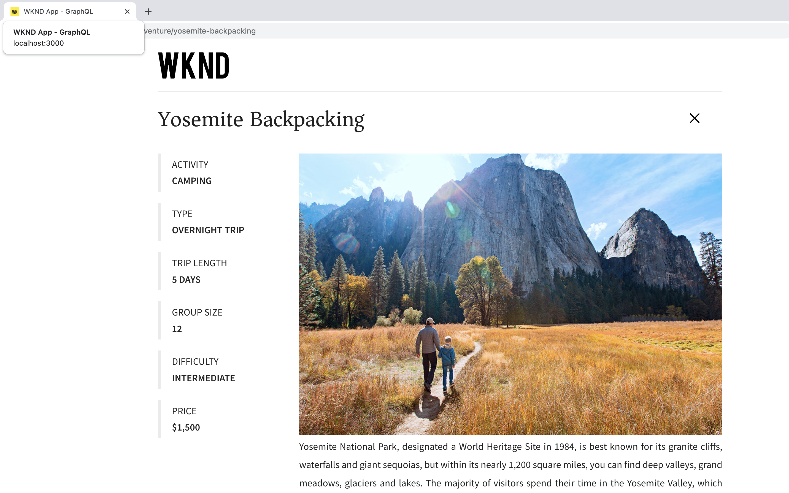

# Intégration d’applications client

Dans le chapitre précédent, vous avez créé et mis à jour des requêtes persistantes à l’aide de l’explorateur GraphiQL.

Ce chapitre décrit les étapes à suivre pour intégrer les requêtes persistantes à l’application cliente WKND (ou application WKND) à l’aide de requêtes de GET HTTP dans les **Composants React**. Il offre également un défi facultatif pour appliquer vos connaissances AEM sans affichage et votre expertise en codage afin d’améliorer l’application cliente WKND.

## Prérequis {#prerequisites}

Ce document fait partie d’un tutoriel en plusieurs parties. Assurez-vous que les chapitres précédents ont été terminés avant de poursuivre ce chapitre. L’application cliente WKND se connecte à AEM service de publication. Il est donc important que vous **publié le code suivant sur le service de publication AEM**.

* Configurations de projet
* Points d’entrée GraphQL
* Modèles de fragment de contenu
* Fragments de contenu créés
* Requêtes persistantes GraphQL

Le _Les captures d’écran IDE de ce chapitre proviennent de [Visual Studio Code](https://code.visualstudio.com/)_

### Package de solution Chapitre 1-4 (facultatif) {#solution-package}

Un module de solution est disponible pour être installé. Il exécute les étapes de l’interface utilisateur AEM pour les chapitres 1 à 4. Ce module est **non requis** si les chapitres précédents sont terminés.

1. Télécharger [Advanced-GraphQL-Tutorial-Solution-Package-1.2.zip](/help/headless-tutorial/graphql/advanced-graphql/assets/tutorial-files/Advanced-GraphQL-Tutorial-Solution-Package-1.2.zip).
1. Dans AEM, accédez à **Outils** > **Déploiement** > **Packages** accès **Gestionnaire de modules**.
1. Téléchargez et installez le package (fichier zip) téléchargé à l’étape précédente.
1. Répliquez le module au service AEM Publish

## Objectifs {#objectives}

Dans ce tutoriel, vous apprenez à intégrer les requêtes de requêtes persistantes dans l’exemple d’application WKND GraphQL React à l’aide de la fonction [AEM client sans affichage pour JavaScript](https://github.com/adobe/aem-headless-client-js).

## Cloner et exécuter l’exemple d’application cliente {#clone-client-app}

Pour accélérer le tutoriel, une application React JS de démarrage est fournie.

1. Cloner le [adobe/aem-guides-wknd-graphql](https://github.com/adobe/aem-guides-wknd-graphql) référentiel :

   ```shell
   $ git clone git@github.com:adobe/aem-guides-wknd-graphql.git
   ```

1. Modifiez la variable `aem-guides-wknd-graphql/advanced-tutorial/.env.development` fichier et définition `REACT_APP_HOST_URI` pour pointer vers votre service de publication AEM cible.

   Mettez à jour la méthode d’authentification lors de la connexion à une instance d’auteur.

   ```plain
   # Server namespace
   REACT_APP_HOST_URI=https://publish-pxx-eyy.adobeaemcloud.com
   
   #AUTH (Choose one method)
   # Authentication methods: 'service-token', 'dev-token', 'basic' or leave blank to use no authentication
   REACT_APP_AUTH_METHOD=
   
   # For Bearer auth, use DEV token (dev-token) from Cloud console
   REACT_APP_DEV_TOKEN=
   
   # For Service toke auth, provide path to service token file (download file from Cloud console)
   REACT_APP_SERVICE_TOKEN=auth/service-token.json
   
   # For Basic auth, use AEM ['user','pass'] pair (eg for Local AEM Author instance)
   REACT_APP_BASIC_AUTH_USER=
   REACT_APP_BASIC_AUTH_PASS=
   ```

   


   >[!NOTE]
   > 
   > Les instructions ci-dessus sont de connecter l’application React à la variable **Service de publication AEM**, mais pour se connecter au **Service AEM Author** obtenir un jeton de développement local pour votre environnement cible AEM as a Cloud Service.
   >
   > Il est également possible de connecter l’application à une [instance d’auteur locale à l’aide du SDK AEMaaCS](/help/headless-tutorial/graphql/quick-setup/local-sdk.md) utilisation de l’authentification de base.


1. Ouvrez un terminal et exécutez les commandes :

   ```shell
   $ cd aem-guides-wknd-graphql/advanced-tutorial
   $ npm install
   $ npm start
   ```

1. Une nouvelle fenêtre de navigateur doit s’afficher [http://localhost:3000](http://localhost:3000)


1. Appuyer **Camping** > **Yosemite Backpackaging** pour consulter les détails de l’aventure Yosemite Backpack.

   

1. Ouvrez les outils de développement du navigateur et examinez la variable `XHR` requête

   

   Vous devriez voir `GET` demande au point d’entrée GraphQL avec le nom de configuration du projet (`wknd-shared`), nom de requête persistant (`adventure-by-slug`), nom de variable (`slug`), valeur (`yosemite-backpacking`) et les encodages de caractères spéciaux.

>[!IMPORTANT]
>
>    Si vous vous demandez pourquoi la requête de l’API GraphQL est envoyée à l’adresse `http://localhost:3000` et NON pas par rapport au domaine du service de publication AEM, passez en revue [Sous la porte](../multi-step/graphql-and-react-app.md#under-the-hood) du tutoriel de base.


## Vérification du code

Dans le [Tutoriel de base - Création d’une application React qui utilise AEM API GraphQL](https://experienceleague.adobe.com/docs/experience-manager-learn/getting-started-with-aem-headless/graphql/multi-step/graphql-and-react-app.html#review-the-aemheadless-object) étape que nous avons passée en revue et amélioré quelques dossiers clés pour obtenir une expertise pratique. Avant d’améliorer l’application WKND, passez en revue les fichiers clés.

* [Vérification de l’objet AEMHeadless](https://experienceleague.adobe.com/docs/experience-manager-learn/getting-started-with-aem-headless/graphql/multi-step/graphql-and-react-app.html#review-the-aemheadless-object)

* [Mise en oeuvre pour exécuter AEM requêtes persistantes GraphQL](https://experienceleague.adobe.com/docs/experience-manager-learn/getting-started-with-aem-headless/graphql/multi-step/graphql-and-react-app.html#implement-to-run-aem-graphql-persisted-queries)

### Réviser `Adventures` Composant React

La vue principale de l’application WKND React est la liste de toutes les aventures et vous pouvez filtrer ces aventures en fonction du type d’activité comme _Camping, vélo_. Cette vue est générée par la variable `Adventures` composant. Vous trouverez ci-dessous les principaux détails de mise en oeuvre :

* Le `src/components/Adventures.js` calls `useAllAdventures(adventureActivity)` hook et here `adventureActivity` est de type d’activité.

* Le `useAllAdventures(adventureActivity)` est défini dans la variable `src/api/usePersistedQueries.js` fichier . Basé sur `adventureActivity` , il détermine la requête persistante à appeler. Si la valeur n’est pas nulle, il appelle `wknd-shared/adventures-by-activity`, sinon, toutes les aventures disponibles `wknd-shared/adventures-all`.

* Le point d’extension utilise l’extension principale `fetchPersistedQuery(..)` qui délègue l’exécution de la requête à `AEMHeadless` via `aemHeadlessClient.js`.

* Le point d’extension renvoie également uniquement les données appropriées de la réponse GraphQL AEM à l’adresse `response.data?.adventureList?.items`, ce qui permet à la variable `Adventures` Réagissez aux composants d’affichage pour être indépendant des structures JSON parentes.

* Une fois la requête exécutée, la variable `AdventureListItem(..)` fonction de rendu à partir de `Adventures.js` ajoute un élément de HTML pour afficher la variable _Image, Durée du voyage, Prix et Titre_ informations.

### Réviser `AdventureDetail` Composant React

Le `AdventureDetail` React effectue le rendu des détails de l’aventure. Vous trouverez ci-dessous les principaux détails de mise en oeuvre :

* Le `src/components/AdventureDetail.js` calls `useAdventureBySlug(slug)` hook et here `slug` L’argument est un paramètre de requête.

* Comme ci-dessus, la fonction `useAdventureBySlug(slug)` est défini dans la variable `src/api/usePersistedQueries.js` fichier . Elle appelle `wknd-shared/adventure-by-slug` requête persistante en déléguant à `AEMHeadless` via `aemHeadlessClient.js`.

* Une fois la requête exécutée, la variable `AdventureDetailRender(..)` fonction de rendu à partir de `AdventureDetail.js` ajoute un élément HTML pour afficher les détails de l’aventure.


## Amélioration du code

### Utilisation `adventure-details-by-slug` requête persistante

Dans le chapitre précédent, nous avons créé la variable `adventure-details-by-slug` requête persistante, il fournit des informations supplémentaires telles que _location, instructorTeam et administrator_. Remplaçons-nous `adventure-by-slug` avec `adventure-details-by-slug` requête persistante pour effectuer le rendu de ces informations supplémentaires.

1. Ouvrez `src/api/usePersistedQueries.js`.

1. Localisation de la fonction `useAdventureBySlug()` et mettre à jour la requête en tant que

```javascript
 ...

 // Call the AEM GraphQL persisted query named "wknd-shared/adventure-details-by-slug" with parameters
 response = await fetchPersistedQuery(
 "wknd-shared/adventure-details-by-slug",
 queryParameters
 );

 ...
```

### Afficher des informations supplémentaires

1. Pour afficher d’autres informations sur l’aventure, ouvrez `src/components/AdventureDetail.js`

1. Localisation de la fonction `AdventureDetailRender(..)` et mettre à jour la fonction de retour en tant que

   ```javascript
   ...
   
   return (<>
       <h1 className="adventure-detail-title">{title}</h1>
       <div className="adventure-detail-info">
   
           <LocationInfo {...location} />
   
           ...
   
           <Location {...location} />
   
           <Administrator {...administrator} />
   
           <InstructorTeam {...instructorTeam} />
   
       </div>
   </>); 
   
   ...
   ```

1. Définissez également les fonctions de rendu correspondantes :

   **LocationInfo**

   ```javascript
   function LocationInfo({name}) {
   
       if (!name) {
           return null;
       }
   
       return (
           <>
               <div className="adventure-detail-info-label">Location</div>
               <div className="adventure-detail-info-description">{name}</div>
           </>
       );
   
   }
   ```

   **Emplacement**

   ```javascript
   function Location({ contactInfo }) {
   
       if (!contactInfo) {
           return null;
       }
   
       return (
           <>
               <div className='adventure-detail-location'>
                   <h2>Where we meet</h2>
                   <hr />
                   <div className="adventure-detail-addtional-info">Phone:{contactInfo.phone}</div>
                   <div className="adventure-detail-addtional-info">Email:{contactInfo.email}</div>
               </div>
           </>);
   }
   ```

   **DescripteurTeam**

   ```javascript
   function InstructorTeam({ _metadata }) {
   
       if (!_metadata) {
           return null;
       }
   
       return (
           <>
               <div className='adventure-detail-team'>
                   <h2>Instruction Team</h2>
                   <hr />
                   <div className="adventure-detail-addtional-info">Team Name: {_metadata.stringMetadata[0].value}</div>
               </div>
           </>);
   }
   ```

   **Administrateur**

   ```javascript
   function Administrator({ fullName, contactInfo }) {
   
       if (!fullName || !contactInfo) {
           return null;
       }
   
       return (
           <>
               <div className='adventure-detail-administrator'>
                   <h2>Administrator</h2>
                   <hr />
                   <div className="adventure-detail-addtional-info">Name: {fullName}</div>
                   <div className="adventure-detail-addtional-info">Phone: {contactInfo.phone}</div>
                   <div className="adventure-detail-addtional-info">Email: {contactInfo.email}</div>
               </div>
           </>);
   }
   ```

### Définition de nouveaux styles

1. Ouvrir `src/components/AdventureDetail.scss` et ajouter les définitions de classe suivantes

   ```CSS
   .adventure-detail-administrator,
   .adventure-detail-team,
   .adventure-detail-location {
   margin-top: 1em;
   width: 100%;
   float: right;
   }
   
   .adventure-detail-addtional-info {
   padding: 10px 0px 5px 0px;
   text-transform: uppercase;
   }
   ```

>[!TIP]
>
>Les fichiers mis à jour sont disponibles sous **AEM Guides WKND - GraphQL** projet, voir [Tutoriel avancé](https://github.com/adobe/aem-guides-wknd-graphql/tree/main/advanced-tutorial) .


Après avoir terminé les améliorations ci-dessus, l’application WKND ressemble à ce qui suit et les outils de développement du navigateur s’affichent `adventure-details-by-slug` appel de requête persistant.


## Défi d’amélioration (facultatif)

La vue principale de l’application WKND React vous permet de filtrer ces aventures en fonction du type d’activité comme _Camping, vélo_. Cependant, l’équipe d’entreprise WKND souhaite disposer d’un _Emplacement_ fonctionnalité de filtrage basée sur . Les exigences sont les suivantes :

* Sur la vue principale de l’application WKND, dans le coin supérieur gauche ou droit, ajoutez _Emplacement_ icône de filtrage.
* Cliquer _Emplacement_ l’icône de filtrage doit afficher la liste des emplacements.
* Cliquez sur l’option d’emplacement de votre choix dans la liste pour afficher uniquement les aventures correspondantes.
* Si une seule aventure correspond, la vue Détails de l’aventure s’affiche.

## Félicitations

Félicitations ! Vous avez maintenant terminé l’intégration et l’implémentation des requêtes conservées dans l’exemple d’application WKND.
