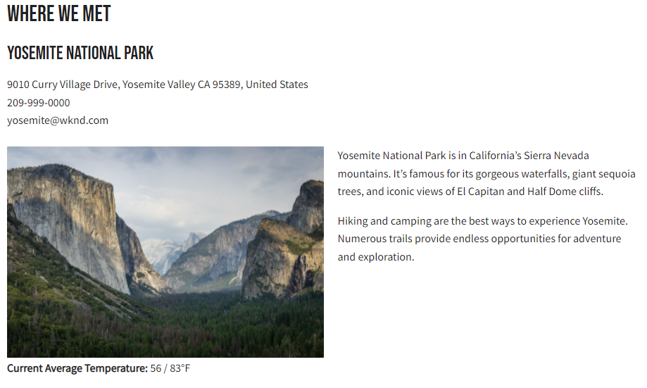

# Intégration d’applications client

Dans le chapitre précédent, vous avez créé et mis à jour des requêtes persistantes à l’aide de requêtes HTTP PUT et POST.

Ce chapitre décrit les étapes à suivre pour intégrer ces requêtes persistantes à l’application WKND à l’aide de requêtes de GET HTTP dans cinq composants React :

* Emplacement
* Adresse
* Instructions
* Administrateur
* Équipe

## Prérequis {#prerequisites}

Ce document fait partie d’un tutoriel en plusieurs parties. Assurez-vous que les chapitres précédents ont été terminés avant de poursuivre ce chapitre. Fin de la [tutoriel de base](/help/headless-tutorial/graphql/multi-step/overview.md) est recommandé.

_Les captures d’écran IDE de ce chapitre proviennent de [Visual Studio Code](https://code.visualstudio.com/)_

### Package de solution Chapitre 1-4 (facultatif) {#solution-package}

Un module de solution est disponible pour être installé. Il exécute les étapes de l’interface utilisateur AEM pour les chapitres 1 à 4. Ce module est **non requis** si les chapitres précédents sont terminés.

1. Télécharger [Advanced-GraphQL-Tutorial-Solution-Package-1.1.zip](/help/headless-tutorial/graphql/advanced-graphql/assets/tutorial-files/Advanced-GraphQL-Tutorial-Solution-Package-1.1.zip).
1. Dans AEM, accédez à **Outils** > **Déploiement** > **Packages** accès **Gestionnaire de modules**.
1. Téléchargez et installez le package (fichier zip) téléchargé à l’étape précédente.

## Objectifs {#objectives}

Dans ce tutoriel, vous apprenez à intégrer les requêtes de requêtes persistantes dans l’exemple d’application WKND GraphQl React à l’aide du code JavaScript sans affichage AEM [SDK](https://github.com/adobe/aem-headless-client-js).

## Installation et exécution de l’exemple d’application cliente {#install-client-app}

Pour accélérer le tutoriel, une application React JS de démarrage est fournie.

>[!NOTE]
> 
> Vous trouverez ci-dessous les instructions pour connecter l’application React à une **Auteur** dans AEM as a Cloud Service à l’aide d’un [jeton d’accès au développement local](/help/headless-tutorial/authentication/local-development-access-token.md). Il est également possible de connecter l’application à une [instance d’auteur locale à l’aide du SDK AEMaaCS](/help/headless-tutorial/graphql/quick-setup/local-sdk.md) utilisation de l’authentification de base.

1. Télécharger **[aem-guides-wknd-headless-start-tutorial.zip](/help/headless-tutorial/graphql/advanced-graphql/assets/tutorial-files/aem-guides-wknd-headless-start-tutorial.zip)**.
1. Décompressez le fichier et ouvrez le projet dans votre IDE.
1. Obtention d’un [jeton de développement local](/help/headless-tutorial/authentication/local-development-access-token.md) pour votre environnement AEM cible.
1. Dans le projet, ouvrez le fichier . `.env.development`.
   1. Définir `REACT_APP_DEV_TOKEN` égal à `accessToken` à partir du jeton de développement local. (Pas l’intégralité du fichier JSON)
   1. Définir `REACT_APP_HOST_URI` à l’url de votre AEM **Auteur** environnement.

   
1. Ouvrez un nouveau terminal et accédez au dossier du projet. Exécutez les commandes suivantes :

   ```shell
   $ npm install
   $ npm start
   ```

1. Un nouveau navigateur doit s’ouvrir à l’adresse `http://localhost:3000/aem-guides-wknd-pwa`.
1. Appuyer **Camping** > **Yosemite Backpackaging** pour consulter les détails de l’aventure Yosemite Backpack.

   

1. Ouvrez les outils de développement du navigateur et examinez la variable `XHR` requête

   

   Vous devriez voir une `POST` au point d’entrée GraphQL. Affichage de la variable `Payload`, vous pouvez voir la requête GraphQL complète qui a été envoyée. Dans les sections suivantes, l’application sera mise à jour afin d’utiliser **persistant** requêtes.


## Prise en main

Dans le tutoriel de base, une requête GraphQl paramétrée est utilisée pour demander un fragment de contenu unique et générer les détails de l’aventure. Mettez ensuite à jour la variable `adventureDetailQuery` pour inclure de nouveaux champs et utiliser les requêtes persistantes créées dans le chapitre précédent.

Cinq composants sont créés :

| Composant React | Emplacement |
|-------|------|
| Administrateur | `src/components/Administrator.js` |
| Équipe | `src/components/Team.js` |
| Emplacement | `src/components/Location.js` |
| Instructions | `src/components/Instructors.js` |
| Adresse | `src/components/Address.js` |

## Mise à jour du crochet useGraphQL

Une [React Effet Hook](https://reactjs.org/docs/hooks-overview.html#effect-hook) a été créé pour écouter les modifications apportées au `query`, et lors de la modification, envoie une requête de POST HTTP au point de terminaison AEM GraphQL et renvoie la réponse JSON à l’application.

Créer un crochet à utiliser **persistant** requêtes. L’application peut alors envoyer des requêtes de GET HTTP pour les détails Adventure. Le `runPersistedQuery` de [AEM SDK client sans affichage](https://github.com/adobe/aem-headless-client-js) est utilisé pour faciliter l’exécution d’une requête persistante.

1. Ouvrez le fichier `src/api/useGraphQL.js`
1. Ajouter un nouveau crochet pour `useGraphQLPersisted`:

   ```javascript
   /**
   * Custom React Hook to perform a GraphQL query to a persisted query endpoint
   * @param persistedPath - the short path to the persisted query
   * @param fragmentPathParam - optional parameters object that can be passed in for parameterized persistent queries
   */
   export function useGraphQLPersisted(persistedPath, fragmentPathVariable) {
       let [data, setData] = useState(null);
       let [errors, setErrors] = useState(null);
   
       useEffect(() => {
           let queryVariables = {};
   
           // we pass in a primitive fragmentPathVariable (String) and then construct the object {fragmentPath: fragmentPathParam} to pass as query params to the persisted query
           // It is simpler to pass a primitive into a React hooks, as comparing the state of a dependent object can be difficult. see https://reactjs.org/docs/hooks-faq.html#can-i-skip-an-effect-on-updates
           if(fragmentPathVariable) {
               queryVariables = {fragmentPath: fragmentPathVariable};
           }
   
           // execute a persisted query using the given path and pass in variables (if needed)
           sdk.runPersistedQuery(persistedPath, queryVariables)
               .then(({ data, errors }) => {
               if (errors) setErrors(mapErrors(errors));
               if (data) setData(data);
           })
           .catch((error) => {
           setErrors(error);
           });
   }, [persistedPath, fragmentPathVariable]);
   
   return { data, errors }
   }
   ```
1. Enregistrez les modifications apportées au fichier.

## Mettre à jour le composant Détails de l’aventure

Le fichier `src/api/queries.js` contient les requêtes GraphQL utilisées pour alimenter l’application. `adventureDetailQuery` renvoie les détails d’une aventure individuelle à l’aide de la requête GraphQL de POST standard. Mettez ensuite à jour la variable `AdventureDetail` pour utiliser le composant persistant `wknd/all-adventure-details` requête.

1. Ouvrez `src/screens/AdventureDetail.js`.
1. Commencez par ajouter la ligne suivante :

   ```javascript
   export default function AdventureDetail() {
   
       ...
   
       //const { data, errors } = useGraphQL(adventureDetailQuery(adventureFragmentPath));
   ```

   Le code ci-dessus utilise le POST GraphQL standard pour récupérer les détails de l’aventure en fonction d’une `adventureFragmentPath`

1. Pour utiliser la variable `useGraphQLPersisted` hook, ajoutez la ligne suivante :

   ```javascript
   export default function AdventureDetail() {
   
      //const { data, errors } = useGraphQL(adventureDetailQuery(adventureFragmentPath));
       const {data, errors} = useGraphQLPersisted("wknd/all-adventure-details", adventureFragmentPath);
   ```

   Observez le chemin. `wknd/all-adventure-details` est le chemin d’accès à la requête conservée créée dans le chapitre précédent.

   >[!CAUTION]
   >
   > Pour que la requête mise à jour fonctionne, la fonction `wknd/all-adventure-details` doit être conservé dans l’environnement AEM cible. Passez en revue les étapes de la section [Requêtes GraphQL persistantes](/help/headless-tutorial/graphql/advanced-graphql/graphql-persisted-queries.md#cache-control-all-adventures) ou installez le [Package de solution AEM](/help/headless-tutorial/graphql/advanced-graphql/assets/tutorial-files/Advanced-GraphQL-Tutorial-Solution-Package-1.1.zip)

1. Revenez à l’application qui s’exécute dans le navigateur et utilisez les outils de développement de votre navigateur pour examiner la demande après avoir accédé à un **Détails de l’aventure** page.

   

   ```
   http://localhost:3000/graphql/execute.json/wknd/all-adventure-details;fragmentPath=/content/dam/wknd/en/adventures/yosemite-backpacking/yosemite-backpacking
   ```

   Vous devriez maintenant voir une `GET` qui utilise la requête conservée à l’adresse `wknd/all-adventure-details`.

1. Accédez à d’autres détails sur l’aventure et observez que la même `GET` est effectuée avec différents chemins d’accès aux fragments. L’application doit continuer à fonctionner comme auparavant.

Voir `AdventureDetail.js` dans le [aem-guides-wknd-headless-solution-tutorial.zip](/help/headless-tutorial/graphql/advanced-graphql/assets/tutorial-files/aem-guides-wknd-headless-solution-tutorial.zip) pour obtenir un exemple complet du composant mis à jour.

Créez ensuite le **Emplacement**, **Administrateur**, et **Instructions** composants pour effectuer le rendu des données d’emplacement. Le **Adresse** est référencé dans la variable **Équipe** composant.

## Développement du composant Emplacement

1. Dans le `AdventureDetail.js` , ajoutez une référence au fichier `<Location>` transmission des données d’emplacement à partir du composant `adventure` objet de données :

   ```javascript
   export default function AdventureDetail() {
       ...
   
       return (
           ...
   
           <Location data={adventure.location} />
   ```

1. Consultez le fichier à l’adresse `src/components/Location.js`. Le `Location` Le composant effectue le rendu des données pour le lieu de rencontre, les informations de contact, les informations sur la météo et une image d’emplacement du **Emplacement** Modèle de fragment de contenu. Au minimum, la variable `Location` attend une `address` à transmettre.
1. Voir `Location.js` dans le [aem-guides-wknd-headless-solution-tutorial.zip](/help/headless-tutorial/graphql/advanced-graphql/assets/tutorial-files/aem-guides-wknd-headless-solution-tutorial.zip) pour obtenir un exemple complet du composant mis à jour.

Une fois les mises à jour effectuées, la page des détails rendus doit se présenter comme suit :



## Développement du composant Équipe

1. Dans le `AdventureDetail.js` , ajoutez une référence au fichier `<Team>` (sous le composant `<Location>` (transmission du composant) `instructorTeam` des `adventure` objet de données :

   ```javascript
   <Location data={adventure.location} />
   <Team data={adventure.instructorTeam} />
   ```

1. Consultez le fichier à l’adresse `src/components/Team.js`. Le `Team` effectue le rendu des données sur la date de création de l’équipe, l’image et la description du **Équipe** Fragment de contenu.

1. Dans `Team.js` notez l’inclusion de la variable `Address` composant.

   ```javascript
   export default function Team({data}) {
       ...
       {teamPath && <Address _path={teamPath}/>}
   ```

   Ici, un chemin d’accès à l’équipe actuelle est transmis dans la variable `Address` , qui exécute à son tour une requête pour obtenir l’adresse en fonction de l’équipe.

1. Voir `Team.js` dans le [aem-guides-wknd-headless-solution-tutorial.zip](/help/headless-tutorial/graphql/advanced-graphql/assets/tutorial-files/aem-guides-wknd-headless-solution-tutorial.zip) pour obtenir un exemple complet du composant.

Une fois la requête intégrée, elle doit se présenter comme suit :


## Développement du composant Adresse

1. Consultez le fichier à l’adresse `src/components/Address.js`. Le `Address` Le composant effectue le rendu des informations sur l’adresse, telles que l’adresse de la rue, la ville, l’état, le code postal, le pays du **Adresse** Fragment de contenu, téléphone et courrier électronique du **Coordonnées** référence au fragment.
1. Le `Address` est similaire au composant `AdventureDetails` en ce sens qu’il effectue un appel persistant pour récupérer les données en fonction d’un chemin d’accès. La différence réside dans le fait qu’il utilise des `/wknd/team-location-by-location-path` pour effectuer la requête.
1. Voir `Address.js` dans le [aem-guides-wknd-headless-solution-tutorial.zip](/help/headless-tutorial/graphql/advanced-graphql/assets/tutorial-files/aem-guides-wknd-headless-solution-tutorial.zip) pour obtenir un exemple complet du composant.

## Développement du composant Administrateur

1. Dans le `AdventureDetail.js` , ajoutez une référence au fichier `<Adminstrator>` (sous le composant `<Team>` (transmission du composant) `administrator` des `adventure` objet de données :

   ```javascript
   <Location data={adventure.location} />
   <Team data={adventure.instructorTeam} />
   <Administrator data={adventure.administrator} /> 
   ```

1. Consultez le fichier à l’adresse `src/components/Administrator.js`. Le `Administrator` Le composant effectue le rendu des détails, tels que leur nom complet depuis le **Administrateur** Fragment de contenu et rendu du téléphone et de l’e-mail à partir du **Coordonnées** référence au fragment.
1. Voir `Administrator.js` in [aem-guides-wknd-headless-solution-tutorial.zip](/help/headless-tutorial/graphql/advanced-graphql/assets/tutorial-files/aem-guides-wknd-headless-solution-tutorial.zip) pour obtenir un exemple complet du composant.

Après avoir créé le composant Administrateur, vous êtes prêt à effectuer le rendu de l’application. La sortie doit correspondre à l’image ci-dessous :


## Développement du composant Instructions

1. Dans le `AdventureDetail.js` , ajoutez une référence au fichier `<Instructors>` (sous le composant `<Administrator>` (transmission du composant) `instructorTeam` des `adventure` objet de données :

   ```javascript
   <Location data={adventure.location} />
   <Team data={adventure.instructorTeam}/>
   <Administrator data={adventure.administrator} />             
   <Instructors data={adventure.instructorTeam} />
   ```

1. Consultez le fichier à l’adresse `src/components/Instructors.js`. Le `Instructors` Le composant effectue le rendu des données sur chacun des membres de l’équipe, y compris le nom complet, la biographie, l’image, le numéro de téléphone, le niveau d’expérience et les compétences. Le composant effectue une itération sur un tableau pour afficher chaque membre.
1. Voir `Instructors.js` in [aem-guides-wknd-headless-solution-tutorial.zip](/help/headless-tutorial/graphql/advanced-graphql/assets/tutorial-files/aem-guides-wknd-headless-solution-tutorial.zip) pour obtenir un exemple complet du composant.

Une fois que vous avez rendu l’application, la sortie doit correspondre à l’image ci-dessous :


## Exemple d’application WKND terminé

L’application terminée doit ressembler à ceci :


### Application client finale

La version finale de l’application peut être téléchargée et utilisée :
**[aem-guides-wknd-headless-solution-tutorial.zip](/help/headless-tutorial/graphql/advanced-graphql/assets/tutorial-files/aem-guides-wknd-headless-solution-tutorial.zip)**

## Félicitations

Félicitations ! Vous avez maintenant terminé l’intégration et l’implémentation des requêtes conservées dans l’exemple d’application WKND.