# Créer des modèles de fragment de contenu {#create-content-fragment-models}

Ce chapitre décrit les étapes à suivre pour créer cinq modèles de fragment de contenu :

* **Informations de contact**
* **Adresse**
* **Personne**
* **Emplacement**
* **Équipe**

Les modèles de fragment de contenu permettent de définir des relations entre les types de contenu et de conserver des relations telles que des schémas. Utilisez les références aux fragments imbriqués, divers types de données de contenu et le type d’onglet pour l’organisation du contenu visuel. Types de données plus avancés tels que les espaces réservés d’onglets, les références aux fragments, les objets JSON et le type de données de date et heure.

Ce chapitre traite également de l’amélioration des règles de validation pour les références de contenu telles que les images.

## Prérequis {#prerequisites}

Il s’agit d’un tutoriel avancé. Avant de poursuivre ce chapitre, assurez-vous d’avoir terminé la [configuration rapide](../quick-setup/cloud-service.md). Assurez-vous que vous avez également lu la section précédente [aperçu](../overview.md) pour plus d’informations sur la configuration du tutoriel avancé.

## Objectifs {#objectives}

* Créer des modèles de fragment de contenu.
* Ajoutez des espaces réservés d’onglet, la date et l’heure, des objets JSON, des références à des fragments et des références de contenu aux modèles.
* Ajoutez la validation aux références de contenu.

## Présentation du modèle de fragment de contenu {#content-fragment-model-overview}

La vidéo suivante présente brièvement les modèles de fragment de contenu et leur utilisation dans ce tutoriel.

>[!VIDEO](https://video.tv.adobe.com/v/340037?quality=12&learn=on)

## Créer des modèles de fragment de contenu {#create-models}

Créons des modèles de fragment de contenu pour l’application WKND. Si vous avez besoin d’une introduction de base à la création de modèles de fragment de contenu, reportez-vous au chapitre approprié dans la section [tutoriel de base](../multi-step/content-fragment-models.md).

1. Accédez à **Outils** > **Général** > **Modèles de fragment de contenu**.

   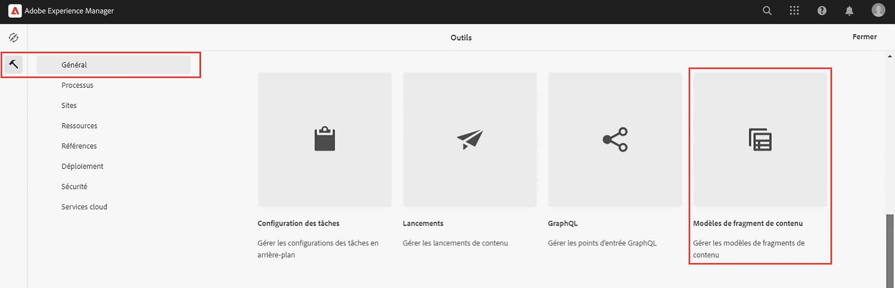

1. Sélectionner **WKND partagé** pour afficher la liste des modèles de fragment de contenu existants pour le site.

### Modèle Contact Info {#contact-info-model}

Créez ensuite un modèle contenant les coordonnées d’une personne ou d’un emplacement.

1. Sélectionner **Créer** dans le coin supérieur droit.

1. Attribuez au modèle le titre &quot;Contact Info&quot;, puis sélectionnez **Créer**. Dans le modal de succès qui s’affiche, sélectionnez **Ouvrir** pour modifier le modèle nouvellement créé.

1. Commencez par faire glisser un **Texte sur une seule ligne** sur le modèle. Donnez-lui **Libellé du champ** de &quot;Phone&quot; dans la variable **Propriétés** . Le nom de la propriété est automatiquement renseigné sous la forme `phone`. Cochez la case pour que le champ soit **Obligatoire**.

1. Accédez au **Types de données** , puis ajoutez un autre **Texte sur une seule ligne** sous le champ &quot;Téléphone&quot;. Donnez-lui **Libellé du champ** de &quot;Email&quot; et définissez-le également sur **Obligatoire**.

Adobe Experience Manager est fourni avec certaines méthodes de validation intégrées. Ces méthodes de validation vous permettent d’ajouter des règles de gouvernance à des champs spécifiques de vos modèles de fragment de contenu. Dans ce cas, ajoutons une règle de validation afin de nous assurer que les utilisateurs ne peuvent saisir que des adresses électroniques valides lorsqu’ils remplissent ce champ. Sous , **Type de validation** menu déroulant, sélectionnez **Courrier électronique**.

Votre modèle de fragment de contenu complété doit ressembler à ceci :

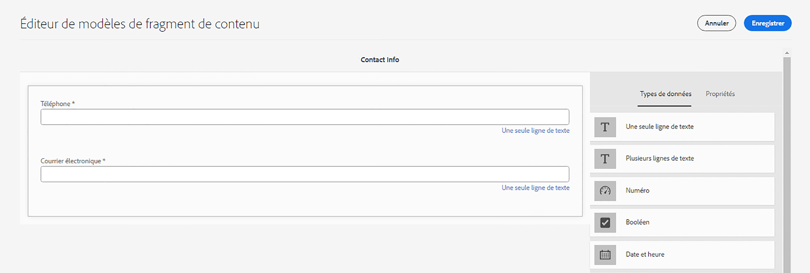

Une fois l’opération terminée, sélectionnez **Enregistrer** pour confirmer vos modifications et fermer l’éditeur de modèle de fragment de contenu.

### Modèle d’adresse {#address-model}

Créez ensuite un modèle pour une adresse.

1. Dans la **WKND partagé**, sélectionnez **Créer** dans le coin supérieur droit.

1. Saisissez le titre &quot;Adresse&quot;, puis sélectionnez **Créer**. Dans le modal de succès qui s’affiche, sélectionnez **Ouvrir** pour modifier le modèle nouvellement créé.

1. Faites glisser et déposez un **Texte sur une seule ligne** sur le modèle et lui donnez un **Libellé du champ** de &quot;Adresse de la rue&quot;. Le nom de la propriété est ensuite renseigné en tant que `streetAddress`. Sélectionnez la **Obligatoire** .

1. Répétez les étapes ci-dessus et ajoutez quatre champs &quot;Une seule ligne de texte&quot; supplémentaires au modèle. Utilisez les libellés suivants :

   * Ville
   * État
   * Code postal
   * Pays

1. Sélectionner **Enregistrer** pour enregistrer les modifications apportées au modèle Address.

   Le modèle de fragment &quot;Adresse&quot; complété doit ressembler à ceci :
   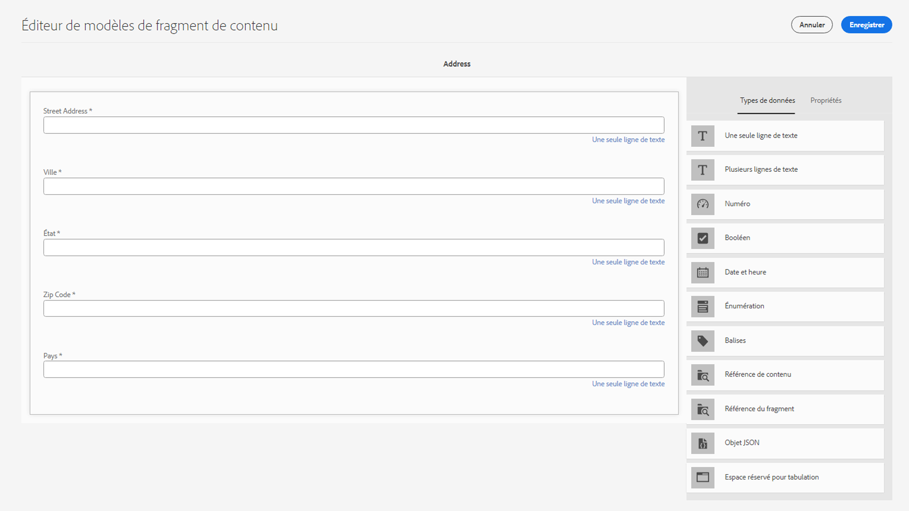

### Modèle Personne {#person-model}

Créez ensuite un modèle contenant des informations sur une personne.

1. Dans le coin supérieur droit, sélectionnez **Créer**.

1. Donnez au modèle le titre &quot;Personne&quot;, puis sélectionnez **Créer**. Dans le modal de succès qui s’affiche, sélectionnez **Ouvrir** pour modifier le modèle nouvellement créé.

1. Commencez par faire glisser un **Texte sur une seule ligne** sur le modèle. Donnez-lui **Libellé du champ** de &quot;Nom complet&quot;. Le nom de la propriété est automatiquement renseigné sous la forme `fullName`. Cochez la case pour que le champ soit **Obligatoire**.

   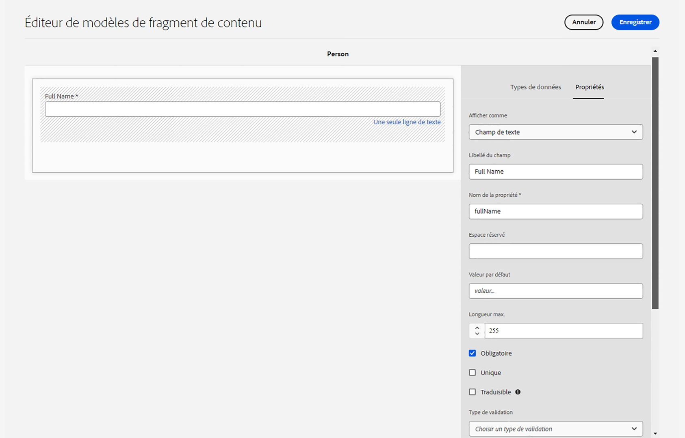

1. Les modèles de fragment de contenu peuvent être référencés dans d’autres modèles. Accédez au **Types de données** puis effectuez un glisser-déposer de l’élément **Référence de fragment** et donnez-lui le libellé &quot;Contact Info&quot;.

1. Dans le **Propriétés** sous l’onglet **Modèles de fragment de contenu autorisés** , sélectionnez l’icône de dossier, puis choisissez l’option **Coordonnées** modèle de fragment créé précédemment.

1. Ajouter un **Référence de contenu** et lui donner un **Libellé du champ** de &quot;Profile Picture&quot;. Sélectionnez l’icône de dossier sous **Chemin racine** pour ouvrir le modal de sélection de chemin. Sélectionnez un chemin racine en sélectionnant **content** > **Ressources**, puis en cochant la case pour **WKND partagé**. Utilisez la variable **Sélectionner** en haut à droite pour enregistrer le chemin d’accès. Le chemin de texte final doit être lu `/content/dam/wknd-shared`.

   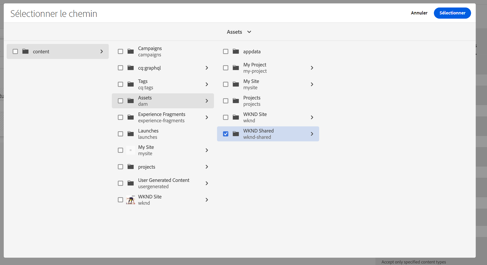

1. Sous **Accepter uniquement les types de contenu spécifiés**, sélectionnez &quot;Image&quot;.

   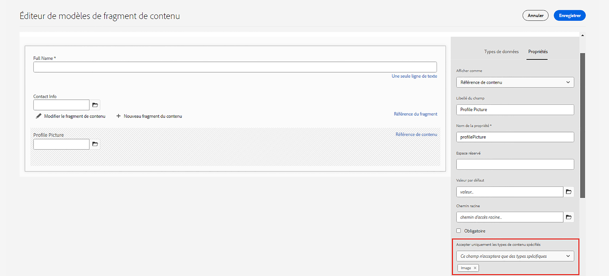

1. Pour limiter la taille et les dimensions du fichier image, examinons certaines options de validation pour le champ de référence du contenu.

   Sous **Accepter uniquement la taille de fichier spécifiée**, sélectionnez &quot;Inférieur ou égal à&quot;, et des champs supplémentaires apparaissent ci-dessous.
   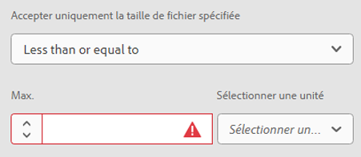

1. Pour **Max**, saisissez &quot;5&quot; et pour **Sélectionner une unité**, sélectionnez &quot;Mégaoctets (Mo)&quot;. Cette validation permet uniquement de sélectionner les images de la taille spécifiée.

1. Sous **Accepter uniquement la largeur d’image spécifiée**, sélectionnez &quot;Largeur maximale&quot;. Dans le **Max (pixels)** qui apparaît, saisissez &quot;10000&quot;. Sélectionnez les mêmes options pour **Accepter uniquement une hauteur d’image spécifiée**.

   Ces validations garantissent que les images ajoutées ne dépassent pas les valeurs spécifiées. Les règles de validation doivent maintenant se présenter comme suit :

   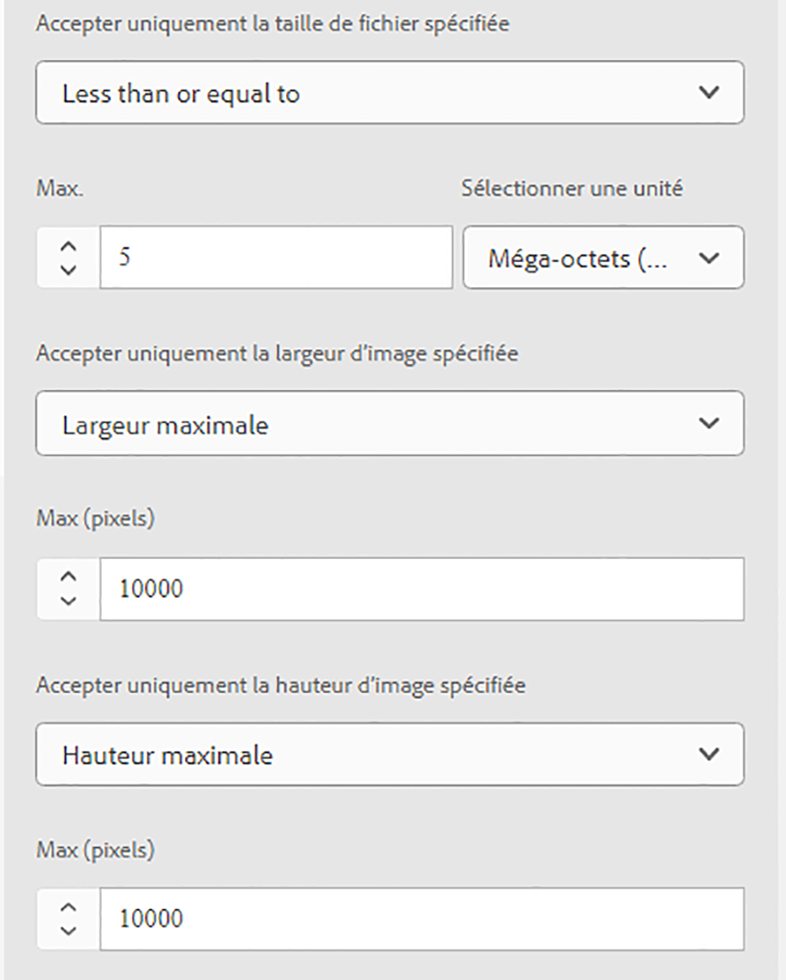

1. Ajouter un **Texte multi-lignes** et lui donner un **Libellé du champ** de &quot;Biographie&quot;. Laissez le champ **Type par défaut** comme option par défaut &quot;Texte enrichi&quot;.

   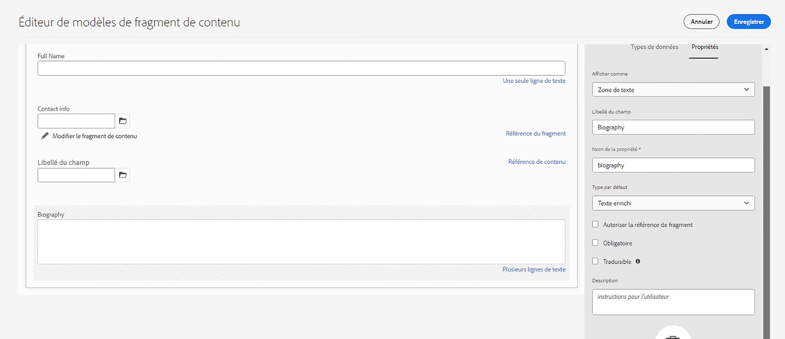

1. Accédez au **Types de données** puis faites glisser un **Énumération** sous &quot;Biographie&quot;. Au lieu de la valeur par défaut **Render As** option, sélectionnez **Liste déroulante** et donnez-lui un **Libellé du champ** de &quot;Niveau d’expérience de l’instructeur&quot;. Saisissez une sélection d’options de niveau d’expérience instructeur, telles que _Expert, Avancé, Intermédiaire_.

1. Faites ensuite glisser un autre **Énumération** sous &quot;Niveau d’expérience de l’instructeur&quot; et cochez les &quot;cases&quot; sous **Render As** . Donnez-lui **Libellé du champ** de &quot;Compétences&quot;. Entrer dans des domaines tels que l&#39;escalade, le surf, le cyclisme, le ski et le randonnée. Le libellé de l’option et la valeur de l’option doivent correspondre comme ci-dessous :

   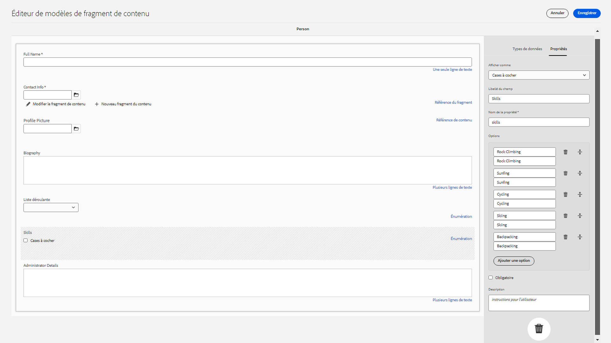

1. Enfin, créez un libellé de champ &quot;Détails de l’administrateur&quot; à l’aide d’un **Texte multi-lignes** champ .

Sélectionner **Enregistrer** pour confirmer vos modifications et fermer l’éditeur de modèle de fragment de contenu.

### Modèle d’emplacement {#location-model}

Le modèle de fragment de contenu suivant décrit un emplacement physique. Ce modèle utilise des espaces réservés d’onglet. Les espaces réservés d’onglets permettent d’organiser les types de données dans l’éditeur de modèles et le contenu dans l’éditeur de fragments, respectivement, en catégorisant le contenu. Chaque espace réservé crée un onglet, semblable à un onglet dans un navigateur Internet, dans l’éditeur de fragments de contenu. Le modèle Emplacement doit comporter deux onglets : Détails de l’emplacement et adresse de l’emplacement.

1. Comme précédemment, sélectionnez **Créer** pour créer un autre modèle de fragment de contenu. Pour le titre du modèle, saisissez &quot;Emplacement&quot;. Sélectionner **Créer** suivie de **Ouvrir** dans le modal success qui s’affiche.

1. Ajouter un **Espace réservé de tabulation** sur le modèle et étiquetez-le &quot;Détails de l’emplacement&quot;.

1. Faites glisser et déposez un **Une seule ligne de texte** et étiquetez-le &quot;Nom&quot;. Sous ce libellé de champ, ajoutez une **texte multiligne** et étiquetez-le &quot;Description&quot;.

1. Ajoutez ensuite une **Référence de fragment** et étiquetez-le &quot;Contact Info&quot;. Dans l’onglet Propriétés, sous **Modèles de fragment de contenu autorisés**, sélectionnez la variable **Icône Dossier** et sélectionnez le modèle de fragment &quot;Contact Info&quot; créé précédemment.

1. Ajouter un **Référence de contenu** sous &quot;Contact Info&quot;. Nommez-le &quot;Image de l’emplacement&quot;. Le **Chemin racine** should `/content/dam/wknd-shared.` Sous **Accepter uniquement les types de contenu spécifiés**, sélectionnez &quot;Image&quot;.

1. Ajoutons également un **Objet JSON** sous &quot;Image de l’emplacement&quot;. Ce type de données étant flexible, il peut être utilisé pour afficher toutes les données que vous souhaitez inclure dans votre contenu. Dans ce cas, l’objet JSON est utilisé pour afficher des informations sur la météo. Étiqueter l’objet JSON &quot;Météo par saison&quot;. Dans le **Propriétés** , ajoutez une **Description** il est donc clair pour l&#39;utilisateur quelles données doivent être entrées ici : &quot;Données JSON concernant la météo de l’emplacement de l’événement par saison (printemps, été, automne, hiver).&quot;

   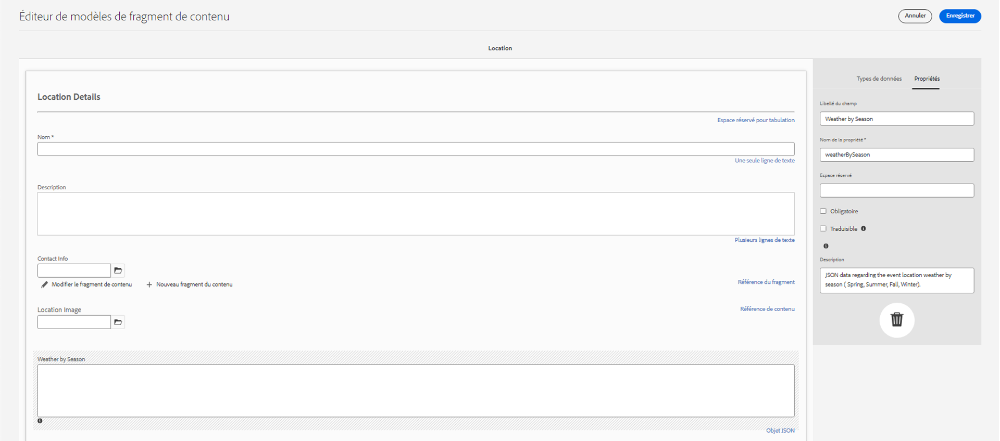

1. Pour créer l’onglet Adresse de l’emplacement, ajoutez une **Espace réservé de tabulation** sur le modèle et étiquetez-le &quot;Adresse de l’emplacement&quot;.

1. Faites glisser et déposez un **Référence de fragment** et dans l’onglet Propriétés, étiquetez-le comme &quot;Adresse&quot;, sous **Modèles de fragment de contenu autorisés**, sélectionnez la variable **Adresse** modèle.

1. Sélectionner **Enregistrer** pour confirmer vos modifications et fermer l’éditeur de modèle de fragment de contenu. Le modèle d’emplacement complété doit apparaître comme suit :

   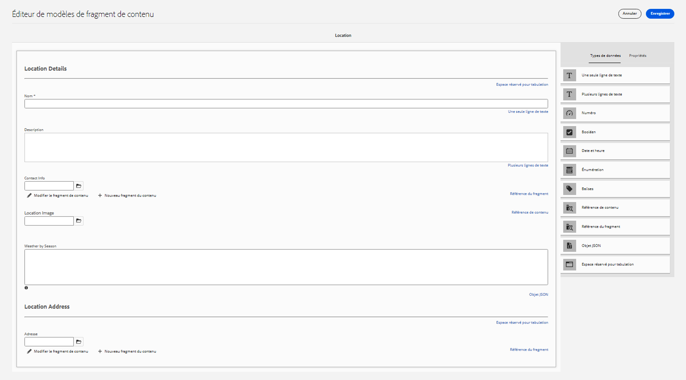

### Modèle d’équipe {#team-model}

Enfin, créez un modèle qui décrit une équipe de personnes.

1. Dans la **WKND partagé** page, sélectionnez **Créer** pour créer un autre modèle de fragment de contenu. Pour le titre du modèle, saisissez &quot;Équipe&quot;. Comme précédemment, sélectionnez **Créer** suivie de **Ouvrir** dans le modal success qui s’affiche.

1. Ajouter un **Texte multi-lignes** au formulaire. Sous **Libellé du champ**, saisissez &quot;Description&quot;.

1. Ajouter un **Date et heure** sur le modèle et étiquetez-le &quot;Date de création de l’équipe&quot;. Dans ce cas, conservez la valeur par défaut **Type** sur &quot;Date&quot;, mais notez qu’il est également possible d’utiliser &quot;Date et heure&quot; ou &quot;Heure&quot;.

   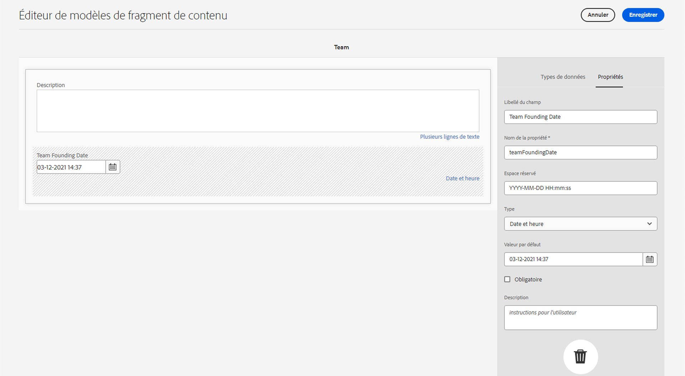

1. Accédez au **Types de données** . Sous &quot;Date de création de l’équipe&quot;, ajoutez une **Référence de fragment**. Dans le **Render As** , sélectionnez &quot;multifield&quot;. Pour **Libellé du champ**, saisissez &quot;Membres de l’équipe&quot;. Ce champ est lié au champ _Personne_ modèle créé précédemment. Le type de données étant un champ multiple, plusieurs fragments de personne peuvent être ajoutés, ce qui permet de créer une équipe de personnes.

   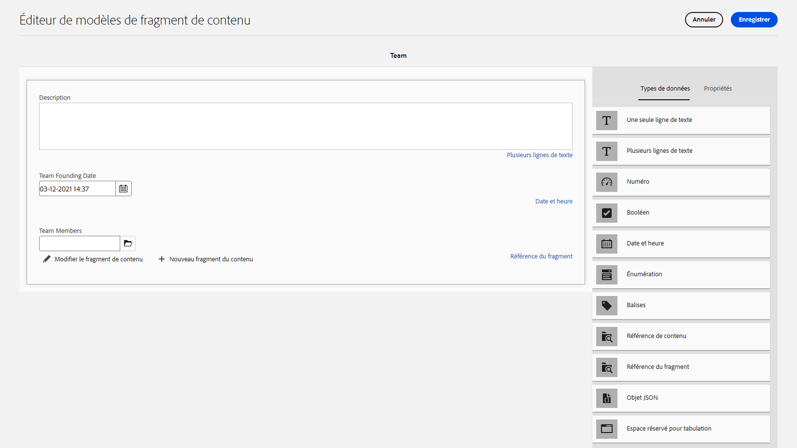

1. Sous **Modèles de fragment de contenu autorisés**, utilisez l’icône de dossier pour ouvrir le modal Sélectionner le chemin , puis sélectionnez l’option **Personne** modèle. Utilisez la variable **Sélectionner** pour enregistrer le chemin.

   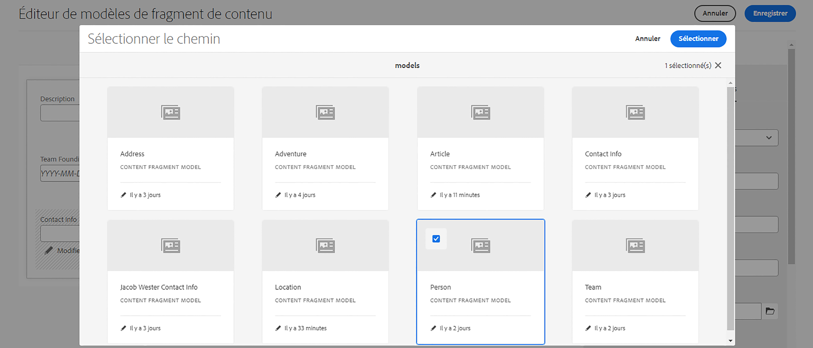

1. Sélectionner **Enregistrer** pour confirmer vos modifications et fermer l’éditeur de modèle de fragment de contenu.

## Ajouter des références de fragments au modèle d’aventure {#fragment-references}

Tout comme le modèle Équipe comporte une référence de fragment au modèle Personne, les modèles Équipe et Emplacement doivent être référencés à partir du modèle Adventure pour afficher ces nouveaux modèles dans l’application WKND.

1. Dans la **WKND partagé** , sélectionnez **Adventure** modèle, puis sélectionnez **Modifier** dans la barre de navigation supérieure.

   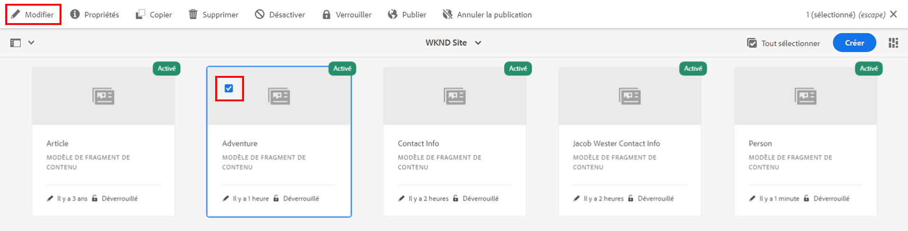

1. Au bas du formulaire, sous &quot;Que nous amener&quot;, ajoutez une **Référence de fragment** champ . Saisissez un **Libellé du champ** de &quot;Emplacement&quot;. Sous **Modèles de fragment de contenu autorisés**, sélectionnez la variable **Emplacement** modèle.

   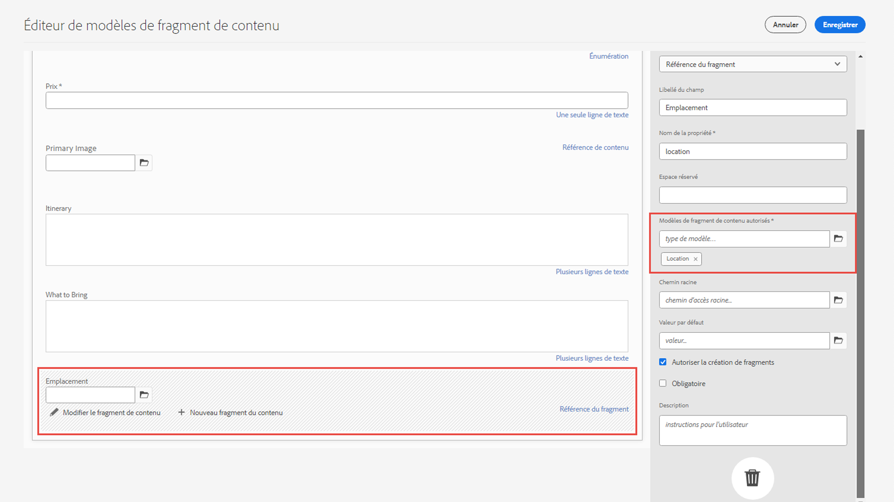

1. Ajouter un **Référence de fragment** et étiquetez-le &quot;Équipe instructrice&quot;. Sous **Modèles de fragment de contenu autorisés**, sélectionnez la variable **Équipe** modèle.

   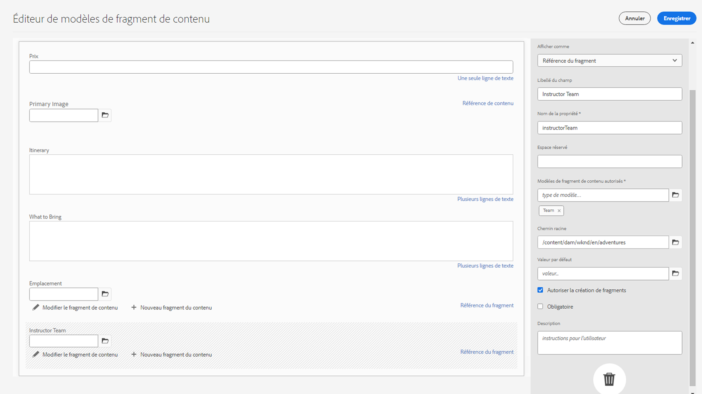

1. Ajouter un autre **Référence de fragment** et étiquetez-le &quot;Administrateur&quot;.

   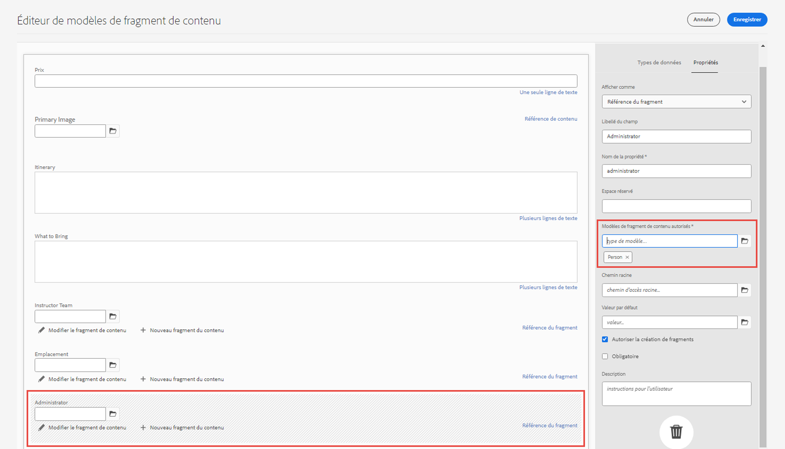

1. Sélectionner **Enregistrer** pour confirmer vos modifications et fermer l’éditeur de modèle de fragment de contenu.

## Bonnes pratiques {#best-practices}

Il existe quelques bonnes pratiques relatives à la création de modèles de fragment de contenu :

* Créez des modèles qui mappent les composants UX. Par exemple, l’application WKND dispose de modèles de fragment de contenu pour les aventures, les articles et l’emplacement. Vous pouvez également ajouter des en-têtes, des promotions ou des clauses de non-responsabilité. Chacun de ces exemples constitue un composant UX spécifique.

* Créez autant de modèles que possible. Limiter le nombre de modèles permet d’optimiser la réutilisation et de simplifier la gestion du contenu.

* Imbriquez les modèles de fragment de contenu aussi profondément que nécessaire, mais uniquement si nécessaire. Rappelez-vous que l’imbrication s’effectue avec des références de fragment ou de contenu. Envisagez un maximum de cinq niveaux d’imbrication.

## Félicitations ! {#congratulations}

Félicitations ! Vous avez maintenant ajouté des onglets, utilisé les types de données d’objet Date et Heure et JSON, et en savoir plus sur les fragments et les références de contenu. Vous avez également ajouté des règles de validation de référence de contenu.

## Étapes suivantes {#next-steps}

Le chapitre suivant de cette série couvre : [création de fragments de contenu](/help/headless-tutorial/graphql/advanced-graphql/author-content-fragments.md) des modèles que vous avez créés dans ce chapitre. Découvrez comment utiliser les types de données introduits dans ce chapitre et créer des stratégies de dossier pour limiter les modèles de fragment de contenu pouvant être créés dans un dossier de ressources.

Bien qu’il soit facultatif pour ce tutoriel, veillez à publier tout le contenu dans des situations de production réelles. Pour une révision des environnements de création et de publication dans AEM, reportez-vous à la section
[Série vidéo AEM sans affichage et GraphQL](/help/headless-tutorial/graphql/video-series/author-publish-architecture.md).
