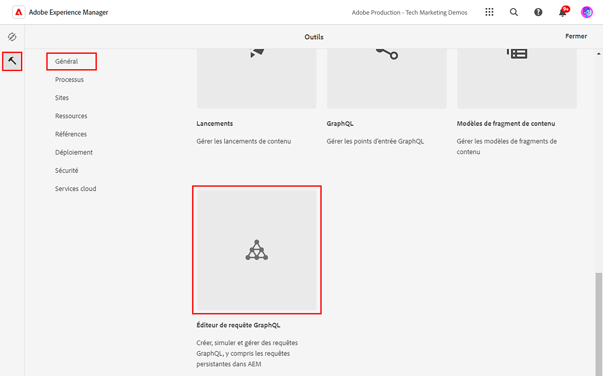
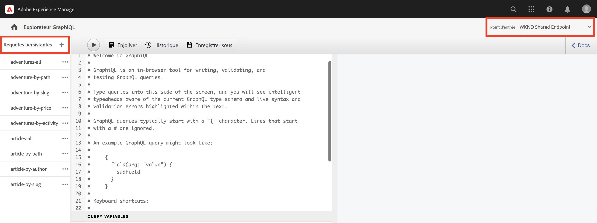
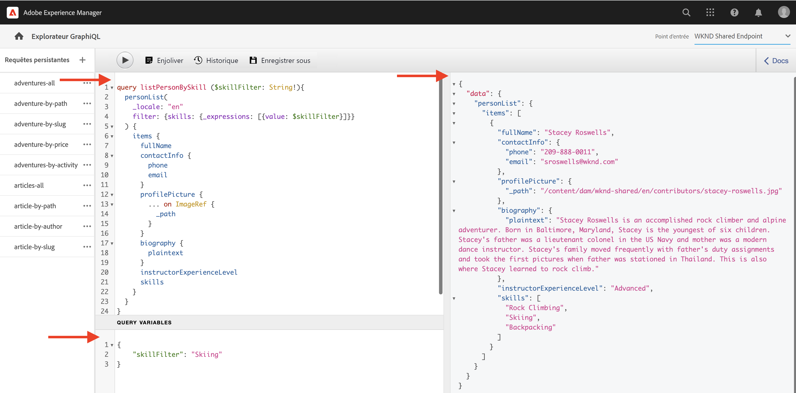

# Explorer l’API GraphQL d’AEM

L’API GraphQL d’AEM vous permet d’exposer les données de fragments de contenu aux applications en aval. Dans le tutoriel de base [tutoriel GraphQL en plusieurs étapes](../multi-step/explore-graphql-api.md), vous avez utilisé l’explorateur GraphiQL pour tester et affiner les requêtes GraphQL.

Dans ce chapitre, vous utilisez l’explorateur GraphiQL pour définir des requêtes plus avancées afin de rassembler les données des fragments de contenu que vous avez créés dans le [chapitre précédent](../advanced-graphql/author-content-fragments.md).

## Prérequis {#prerequisites}

Ce document fait partie d’un tutoriel en plusieurs parties. Assurez-vous que les chapitres précédents ont été terminés avant de poursuivre ce chapitre.

## Objectifs {#objectives}

Dans ce chapitre, vous apprenez à :

* Filtrer une liste de fragments de contenu avec des références à l’aide de variables de requête
* Filtrer du contenu dans une référence de fragment
* Effectuer des requêtes pour le contenu intégré et les références de fragment à partir d’un champ de texte multiligne
* Effectuer des requêtes à l’aide de directives
* Effectuer des requêtes pour le type de contenu de l’objet JSON

## Utiliser l’explorateur GraphiQL


L’outil [explorateur GraphiQL](https://experienceleague.adobe.com/docs/experience-manager-cloud-service/content/headless/graphql-api/graphiql-ide.html?lang=fr) permet aux développeurs et développeuses de créer et de tester des requêtes par rapport au contenu de l’environnement AEM actuel. L’outil GraphiQL permet également aux utilisateurs et utilisatrices de **conserver ou enregistrer** les requêtes à utiliser par les applications clientes dans un paramètre de production.

Ensuite, explorez la puissance de l’API GraphQL d’AEM à l’aide de l’explorateur GraphiQL intégré.

1. Dans l’écran de démarrage AEM, accédez à **Outils** > **Général** > **Éditeur de requêtes GraphQL**.

   

>[!IMPORTANT]
>
>Dans certaines versions d’AEM (6.X.X) l’outil explorateur GraphiQL (ou IDE GraphiQL) doit être installé manuellement, suivez les [instructions ici](../how-to/install-graphiql-aem-6-5.md).

1. Dans le coin supérieur droit, assurez-vous que le point d’entrée est défini sur **Point d’entrée WKND Shared**. Lorsque la valeur de menu déroulant du _point d’entrée_ est modifiée ici, les _requêtes persistantes_ existantes s’affichent dans le coin supérieur gauche.

   

Cela permettra d’identifier toutes les requêtes avec les modèles créés dans le projet **WKND Shared**.


## Filtrer une liste de fragments de contenu à l’aide de variables de requête

Dans le précédent [tutoriel GraphQL en plusieurs étapes](../multi-step/explore-graphql-api.md), vous avez défini et utilisé des requêtes persistantes de base pour obtenir des données de fragments de contenu. Ici, vous développez ces connaissances et filtrez les données de fragments de contenu en transmettant des variables aux requêtes persistantes.

Lors du développement d’applications clientes, vous devez généralement filtrer les fragments de contenu en fonction d’arguments dynamiques. L’API GraphQL d’AEM vous permet de transmettre ces arguments en tant que variables dans une requête afin d’éviter la construction de chaînes du côté client au moment de l’exécution. Pour plus d’informations sur les variables GraphQL, consultez la [documentation GraphQL](https://graphql.org/learn/queries/#variables).

Pour cet exemple, interrogez les instructeurs et instructrices ayant une compétence particulière.

1. Dans l’IDE GraphiQL, collez la requête suivante dans le panneau de gauche :

   ```graphql
   query listPersonBySkill ($skillFilter: String!){
     personList(
       _locale: "en"
       filter: {skills: {_expressions: [{value: $skillFilter}]}}
     ) {
       items {
         fullName
         contactInfo {
           phone
           email
         }
         profilePicture {
           ... on ImageRef {
             _path
           }
         }
         biography {
           plaintext
         }
         instructorExperienceLevel
         skills
       }
     }
   }
   ```

   La requête `listPersonBySkill` ci-dessus accepte une variable (`skillFilter`) qui est une `String` obligatoire. Cette requête effectue une recherche par rapport à tous les fragments de contenu de personne et les filtre en fonction du champ `skills` et de la chaîne transmise dans `skillFilter`.

   La requête `listPersonBySkill` inclut la propriété `contactInfo`, qui est une référence de fragment au modèle d’informations de contact défini dans les chapitres précédents. Le modèle d’informations de contact contient les champs `phone` et `email`. Au moins un de ces champs de la requête doit être présent pour qu’elle s’exécute correctement.

   ```graphql
   contactInfo {
           phone
           email
         }
   ```

1. Ensuite, définissez `skillFilter` et obtenez les instructeurs et instructrices qui maîtrisent Skiing. Collez la chaîne JSON suivante dans le panneau Variables de requête de l’IDE GraphiQL :

   ```json
   {
       "skillFilter": "Skiing"
   }
   ```

1. Exécutez la requête. Le résultat devrait ressembler à ceci :

   ```json
   {
     "data": {
       "personList": {
         "items": [
           {
             "fullName": "Stacey Roswells",
             "contactInfo": {
               "phone": "209-888-0011",
               "email": "sroswells@wknd.com"
             },
             "profilePicture": {
               "_path": "/content/dam/wknd-shared/en/contributors/stacey-roswells.jpg"
             },
             "biography": {
               "plaintext": "Stacey Roswells is an accomplished rock climber and alpine adventurer. Born in Baltimore, Maryland, Stacey is the youngest of six children. Stacey's father was a lieutenant colonel in the US Navy and mother was a modern dance instructor. Stacey's family moved frequently with father's duty assignments and took the first pictures when father was stationed in Thailand. This is also where Stacey learned to rock climb."
             },
             "instructorExperienceLevel": "Advanced",
             "skills": [
               "Rock Climbing",
               "Skiing",
               "Backpacking"
             ]
           }
         ]
       }
     }
   }
   ```

Appuyez sur le bouton **Lire** dans le menu supérieur pour exécuter la requête. Vous devriez voir les résultats des fragments de contenu du chapitre précédent :



## Filtrer du contenu dans une référence de fragment

L’API GraphQL d’AEM vous permet d’interroger des fragments de contenu imbriqués. Dans le chapitre précédent, vous avez ajouté trois nouvelles références de fragment à un fragment de contenu Adventure : `location`, `instructorTeam` et `administrator`. Désormais, filtrons toutes les Adventures pour tout administrateur ou administratrice portant un nom particulier.

>[!CAUTION]
>
>Un seul modèle doit être autorisé comme référence pour que cette requête s’exécute correctement.

1. Dans l’IDE GraphiQL, collez la requête suivante dans le panneau de gauche :

   ```graphql
   query getAdventureAdministratorDetailsByAdministratorName ($name: String!){
     adventureList(
     _locale: "en"
       filter: {administrator: {fullName: {_expressions: [{value: $name}]}}}
     ) {
       items {
         title
         administrator {
           fullName
           contactInfo {
             phone
             email
           }
           administratorDetails {
             json
           }
         }
       }
     }
   }
   ```

1. Ensuite, collez la chaîne JSON suivante dans le panneau Variables de requête :

   ```json
   {
       "name": "Jacob Wester"
   }
   ```

   La requête `getAdventureAdministratorDetailsByAdministratorName` filtre toutes les Adventures pour tout `administrator` au `fullName` de « Jacob Wester », renvoyant des informations provenant de deux fragments de contenu imbriqués : Adventure et instructeur.

1. Exécutez la requête. Le résultat devrait ressembler à ceci :

   ```json
   {
     "data": {
       "adventureList": {
         "items": [
           {
             "title": "Yosemite Backpacking",
             "administrator": {
               "fullName": "Jacob Wester",
               "contactInfo": {
                 "phone": "209-888-0000",
                 "email": "jwester@wknd.com"
               },
               "administratorDetails": {
                 "json": [
                   {
                     "nodeType": "paragraph",
                     "content": [
                       {
                         "nodeType": "text",
                         "value": "Jacob Wester has been coordinating backpacking adventures for three years."
                       }
                     ]
                   }
                 ]
               }
             }
           }
         ]
       }
     }
   }
   ```

## Rechercher des références intégrées dans un champ de texte multiligne {#query-rte-reference}

L’API GraphQL d’AEM vous permet de rechercher du contenu et des références à des fragments dans des champs de texte multiligne. Dans le chapitre précédent, vous avez ajouté les deux types de référence dans le champ **Description** du fragment de contenu de l’équipe Yosemite. Maintenant, récupérons ces références.

1. Dans l’IDE GraphiQL, collez la requête suivante dans le panneau de gauche :

   ```graphql
   query getTeamByAdventurePath ($fragmentPath: String!){
     adventureByPath (_path: $fragmentPath) {
       item {
         instructorTeam {
           _metadata {
             stringMetadata {
               name
               value
             }
         }
           teamFoundingDate
           description {
             plaintext
           }
         }
       }
       _references {
         ... on ImageRef {
           __typename
           _path
         }
         ... on LocationModel {
           __typename
           _path
           name
           address {
             streetAddress
             city
             zipCode
             country
           }
           contactInfo {
             phone
             email
           }
         }
       }
     }
   }
   ```

   La requête `getTeamByAdventurePath` filtre toutes les Adventures par chemin et renvoie les données pour la référence de fragment `instructorTeam` d’une Adventure spécifique.

   `_references` est un champ généré par le système utilisé pour afficher les références, y compris celles insérées dans des champs de texte multiligne.

   La requête `getTeamByAdventurePath` récupère plusieurs références. Tout d’abord, elle utilise l’objet `ImageRef` intégré pour récupérer le `_path` et le `__typename` des images insérées en tant que références de contenu dans le champ de texte multiligne. Ensuite, elle utilise `LocationModel` pour récupérer les données du fragment de contenu d’emplacement inséré dans le même champ.

   La requête inclut également le champ `_metadata`. Vous pouvez ainsi récupérer le nom du fragment de contenu d’équipe et l’afficher ultérieurement dans l’application WKND.

1. Ensuite, collez la chaîne JSON suivante dans le panneau Variables de requête pour obtenir l’Adventure Yosemite Backpacking :

   ```json
   {
       "fragmentPath": "/content/dam/wknd-shared/en/adventures/yosemite-backpacking/yosemite-backpacking"
   }
   ```

1. Exécutez la requête. Le résultat devrait ressembler à ceci :

   ```json
   {
     "data": {
       "adventureByPath": {
         "item": {
           "instructorTeam": {
             "_metadata": {
               "stringMetadata": [
                 {
                   "name": "title",
                   "value": "Yosemite Team"
                 },
                 {
                   "name": "description",
                   "value": ""
                 }
               ]
             },
             "teamFoundingDate": "2016-05-24",
             "description": {
               "plaintext": "\n\nThe team of professional adventurers and hiking instructors working in Yosemite National Park.\n\nYosemite Valley Lodge"
             }
           }
         },
         "_references": [
           {
             "__typename": "LocationModel",
             "_path": "/content/dam/wknd-shared/en/adventures/locations/yosemite-valley-lodge/yosemite-valley-lodge",
             "name": "Yosemite Valley Lodge",
             "address": {
               "streetAddress": "9006 Yosemite Lodge Drive",
               "city": "Yosemite National Park",
               "zipCode": "95389",
               "country": "United States"
             },
             "contactInfo": {
               "phone": "209-992-0000",
               "email": "yosemitelodge@wknd.com"
             }
           },
           {
             "__typename": "ImageRef",
             "_path": "/content/dam/wknd-shared/en/adventures/teams/yosemite-team/team-yosemite-logo.png"
           }
         ]
       }
     }
   }
   ```

   Le champ `_references` affiche à la fois l’image du logo et le fragment de contenu Yosemite Valley Lodge qui a été inséré dans le champ **Description**.


## Effectuer des requêtes à l’aide de directives

Parfois, lorsque vous développez des applications clientes, vous devez modifier de manière conditionnelle la structure de vos requêtes. Dans ce cas, l’API GraphQL d’AEM vous permet d’utiliser les directives GraphQL afin de modifier le comportement de vos requêtes en fonction des critères fournis. Pour plus d’informations sur les directives GraphQL, consultez la [documentation GraphQL](https://graphql.org/learn/queries/#directives).

Dans la [section précédente](#query-rte-reference), vous avez appris à rechercher des références intégrées dans des champs de texte multiligne. Le contenu a été récupéré à partir du champ `description` au format `plaintext`. Maintenant, étendons cette requête et utilisons une directive pour récupérer de manière conditionnelle `description` au format `json` également.

1. Dans l’IDE GraphiQL, collez la requête suivante dans le panneau de gauche :

   ```graphql
   query getTeamByAdventurePath ($fragmentPath: String!, $includeJson: Boolean!){
     adventureByPath(_path: $fragmentPath) {
       item {
         instructorTeam {
           _metadata{
             stringMetadata{
               name
               value
             }
           }
           teamFoundingDate
           description {
             plaintext
             json @include(if: $includeJson)
           }
         }
       }
       _references {
         ... on ImageRef {
           __typename
           _path
         }
         ... on LocationModel {
           __typename
           _path
           name
           address {
             streetAddress
             city
             zipCode
             country
           }
           contactInfo {
             phone
             email
           }
         }
       }
     }
   }
   ```

   La requête ci-dessus accepte une variable supplémentaire (`includeJson`) qui est une valeur `Boolean` obligatoire, également appelée directive de la requête. Une directive peut être utilisée pour inclure de manière conditionnelle des données du champ `description` au format `json` basé sur la valeur booléenne transmise dans `includeJson`.

1. Ensuite, collez la chaîne JSON suivante dans le panneau Variables de requête :

   ```json
   {
     "fragmentPath": "/content/dam/wknd-shared/en/adventures/yosemite-backpacking/yosemite-backpacking",
     "includeJson": false
   }
   ```

1. Exécutez la requête. Vous devriez obtenir le même résultat que dans la section précédente sur [la façon de rechercher des références intégrées dans des champs de texte multiligne](#query-rte-reference).

1. Mettez à jour la directive `includeJson` sur `true` et exécutez à nouveau la requête. Le résultat devrait ressembler à ceci :

   ```json
   {
     "data": {
       "adventureByPath": {
         "item": {
           "instructorTeam": {
             "_metadata": {
               "stringMetadata": [
                 {
                   "name": "title",
                   "value": "Yosemite Team"
                 },
                 {
                   "name": "description",
                   "value": ""
                 }
               ]
             },
             "teamFoundingDate": "2016-05-24",
             "description": {
               "plaintext": "\n\nThe team of professional adventurers and hiking instructors working in Yosemite National Park.\n\nYosemite Valley Lodge",
               "json": [
                 {
                   "nodeType": "paragraph",
                   "content": [
                     {
                       "nodeType": "reference",
                       "data": {
                         "path": "/content/dam/wknd-shared/en/adventures/teams/yosemite-team/team-yosemite-logo.png",
                         "mimetype": "image/png"
                       }
                     }
                   ]
                 },
                 {
                   "nodeType": "paragraph",
                   "content": [
                     {
                       "nodeType": "text",
                       "value": "The team of professional adventurers and hiking instructors working in Yosemite National Park."
                     }
                   ]
                 },
                 {
                   "nodeType": "paragraph",
                   "content": [
                     {
                       "nodeType": "reference",
                       "data": {
                         "href": "/content/dam/wknd-shared/en/adventures/locations/yosemite-valley-lodge/yosemite-valley-lodge",
                         "type": "fragment"
                       },
                       "value": "Yosemite Valley Lodge"
                     }
                   ]
                 }
               ]
             }
           }
         },
         "_references": [
           {
             "__typename": "LocationModel",
             "_path": "/content/dam/wknd-shared/en/adventures/locations/yosemite-valley-lodge/yosemite-valley-lodge",
             "name": "Yosemite Valley Lodge",
             "address": {
               "streetAddress": "9006 Yosemite Lodge Drive",
               "city": "Yosemite National Park",
               "zipCode": "95389",
               "country": "United States"
             },
             "contactInfo": {
               "phone": "209-992-0000",
               "email": "yosemitelodge@wknd.com"
             }
           },
           {
             "__typename": "ImageRef",
             "_path": "/content/dam/wknd-shared/en/adventures/teams/yosemite-team/team-yosemite-logo.png"
           }
         ]
       }
     }
   }
   ```

## Effectuer des requêtes pour le type de contenu de l’objet JSON

N’oubliez pas que dans le chapitre précédent sur la création de fragments de contenu, vous avez ajouté un objet JSON dans le champ **Météo par saison**. Maintenant, récupérons ces données dans le fragment de contenu de l’emplacement.

1. Dans l’IDE GraphiQL, collez la requête suivante dans le panneau de gauche :

   ```graphql
   query getLocationDetailsByLocationPath ($fragmentPath: String!) {
     locationByPath(_path: $fragmentPath) {
       item {
         name
         description {
           json
         }
         contactInfo {
           phone
           email
         }
         locationImage {
           ... on ImageRef {
             _path
           }
         }
         weatherBySeason
         address {
           streetAddress
           city
           state
           zipCode
           country
         }
       }
     }
   }
   ```

1. Ensuite, collez la chaîne JSON suivante dans le panneau Variables de requête :

   ```json
   {
     "fragmentPath": "/content/dam/wknd-shared/en/adventures/locations/yosemite-national-park/yosemite-national-park"
   }
   ```

1. Exécutez la requête. Le résultat devrait ressembler à ceci :

   ```json
   {
     "data": {
       "locationByPath": {
         "item": {
           "name": "Yosemite National Park",
           "description": {
             "json": [
               {
                 "nodeType": "paragraph",
                 "content": [
                   {
                     "nodeType": "text",
                     "value": "Yosemite National Park is in California's Sierra Nevada mountains. It's famous for its gorgeous waterfalls, giant sequoia trees, and iconic views of El Capitan and Half Dome cliffs."
                   }
                 ]
               },
               {
                 "nodeType": "paragraph",
                 "content": [
                   {
                     "nodeType": "text",
                     "value": "Hiking and camping are the best ways to experience Yosemite. Numerous trails provide endless opportunities for adventure and exploration."
                   }
                 ]
               }
             ]
           },
           "contactInfo": {
             "phone": "209-999-0000",
             "email": "yosemite@wknd.com"
           },
           "locationImage": {
             "_path": "/content/dam/wknd-shared/en/adventures/locations/yosemite-national-park/yosemite-national-park.jpeg"
           },
           "weatherBySeason": {
             "summer": "81 / 89°F",
             "fall": "56 / 83°F",
             "winter": "46 / 51°F",
             "spring": "57 / 71°F"
           },
           "address": {
             "streetAddress": "9010 Curry Village Drive",
             "city": "Yosemite Valley",
             "state": "CA",
             "zipCode": "95389",
             "country": "United States"
           }
         }
       }
     }
   }
   ```

   Le champ `weatherBySeason` contient l’objet JSON ajouté au chapitre précédent.

## Effectuer une requête pour obtenir tout le contenu à la fois

Jusqu’à présent, plusieurs requêtes ont été exécutées pour illustrer les fonctionnalités de l’API GraphQL d’AEM.

Les mêmes données peuvent être récupérées avec une seule requête et cette requête est ensuite utilisée dans l’application cliente pour récupérer des informations supplémentaires telles que l’emplacement, le nom de l’équipe et les membres de l’équipe d’une Adventure :

```graphql
query getAdventureDetailsBySlug($slug: String!) {
  adventureList(filter: {slug: {_expressions: [{value: $slug}]}}) {
    items {
      _path
      title
      activity
      adventureType
      price
      tripLength
      groupSize
      difficulty
      primaryImage {
        ... on ImageRef {
          _path
          mimeType
          width
          height
        }
      }
      description {
        html
        json
      }
      itinerary {
        html
        json
      }
      location {
        _path
        name
        description {
          html
          json
        }
        contactInfo {
          phone
          email
        }
        locationImage {
          ... on ImageRef {
            _path
          }
        }
        weatherBySeason
        address {
          streetAddress
          city
          state
          zipCode
          country
        }
      }
      instructorTeam {
        _metadata {
          stringMetadata {
            name
            value
          }
        }
        teamFoundingDate
        description {
          json
        }
        teamMembers {
          fullName
          contactInfo {
            phone
            email
          }
          profilePicture {
            ... on ImageRef {
              _path
            }
          }
          instructorExperienceLevel
          skills
          biography {
            html
          }
        }
      }
      administrator {
        fullName
        contactInfo {
          phone
          email
        }
        biography {
          html
        }
      }
    }
    _references {
      ... on ImageRef {
        _path
        mimeType
      }
      ... on LocationModel {
        _path
        __typename
      }
    }
  }
}


# in Query Variables
{
  "slug": "yosemite-backpacking"
}
```

## Félicitations.

Félicitations. Vous avez maintenant testé des requêtes avancées afin de collecter les données des fragments de contenu que vous avez créés dans le chapitre précédent.

## Étapes suivantes

Dans le [chapitre suivant](/help/headless-tutorial/graphql/advanced-graphql/graphql-persisted-queries.md), vous apprendrez comment rendre les requêtes GraphQL persistantes et pourquoi il est recommandé d’utiliser les requêtes persistantes dans vos applications.
