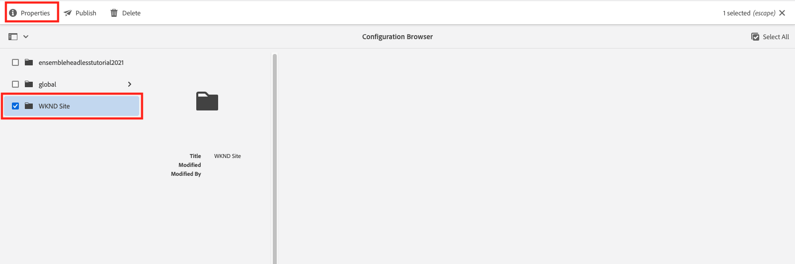

# Requêtes GraphQL persistantes

Les requêtes persistantes sont des requêtes stockées sur le serveur Adobe Experience Manager (AEM). Les clients peuvent envoyer une requête de GET HTTP avec le nom de la requête pour l’exécuter. L’avantage de cette approche est la mise en cache. Bien que les requêtes GraphQL côté client puissent également être exécutées à l’aide de requêtes de POST HTTP, qui ne peuvent pas être mises en cache, les requêtes persistantes peuvent être mises en cache par des caches HTTP ou un réseau de diffusion de contenu, ce qui améliore les performances. Les requêtes persistantes vous permettent de simplifier vos requêtes et d’améliorer la sécurité, car vos requêtes sont encapsulées sur le serveur et l’administrateur AEM en a le contrôle total. Il est recommandé d’utiliser des requêtes persistantes lors de l’utilisation de l’API GraphQL AEM.

Dans le chapitre précédent, vous avez exploré certaines requêtes GraphQL avancées afin de collecter des données pour l’application WKND. Dans ce chapitre, vous allez conserver ces requêtes pour les AEM, les mettre à jour et apprendre à utiliser le contrôle du cache sur les requêtes persistantes.

## Prérequis {#prerequisites}

Ce document fait partie d’un tutoriel en plusieurs parties. Assurez-vous que les chapitres précédents ont été terminés avant de poursuivre ce chapitre.

Ce tutoriel utilise [Postman](https://www.postman.com/) pour exécuter des requêtes HTTP. Assurez-vous d&#39;être inscrit au service avant de commencer ce chapitre. Ce tutoriel nécessite également des connaissances opérationnelles de l’application Postman, telles que la configuration d’une collection, la création de variables et l’exécution de requêtes. Consultez la documentation Postman sur [création de requêtes](https://learning.postman.com/docs/sending-requests/requests/) et [envoi de votre première requête](https://learning.postman.com/docs/getting-started/sending-the-first-request/) pour plus d’informations sur la manière d’effectuer des requêtes d’API dans l’application.

Dans ce chapitre, les requêtes explorées dans le chapitre précédent sont conservées dans AEM. Vous pouvez télécharger un fichier texte avec ces requêtes GraphQL standard. [here](assets/graphql-persisted-queries/advanced-concepts-aem-headless-graphql-queries.txt) pour une référence facile.

## Objectifs {#objectives}

Dans ce chapitre, découvrez comment :

* Persistance des requêtes GraphQL avec des paramètres
* Mise à jour des requêtes persistantes
* Utilisation des paramètres de contrôle du cache avec des requêtes persistantes

## Présentation des requêtes persistantes

Cette vidéo fournit un aperçu de la manière de conserver les requêtes GraphQL, de les mettre à jour et d’utiliser le contrôle du cache.

>[!VIDEO](https://video.tv.adobe.com/v/340036/?quality=12&learn=on)

## Activation des requêtes persistantes

Tout d’abord, assurez-vous que les requêtes persistantes sont activées pour le projet WKND Site dans votre instance AEM.

1. Accédez à **Outils** > **Général** > **Explorateur de configuration**.

1. Sélectionner **Site WKND**, puis sélectionnez **Propriétés** dans la barre de navigation supérieure pour ouvrir les propriétés de configuration.

   

   Sur la page Propriétés de configuration, vous devriez voir que la variable **Requêtes persistantes GraphQL** l’autorisation est activée.

   

## Importation d’une collection Postman

Pour faciliter le suivi du tutoriel, une collection Postman est fournie. Vous pouvez également utiliser des outils de ligne de commande tels que `curl` peut être utilisé.

1. Télécharger et installer [Postman](https://www.postman.com/)
1. Téléchargez la [Concepts avancés d’AEMHeadless.postman_collection.json](/help/headless-tutorial/graphql/advanced-graphql/assets/tutorial-files/AdvancedConceptsofAEMHeadless.postman_collection.json)
1. Ouverture de l’application Postman
1. Sélectionner **Fichier** > **Importer** > **Télécharger le fichier** et choisissez `AdvancedConceptsofAEMHeadless.postman_collection.json` pour importer la collection.

   

### Authentification

L’authentification est requise pour envoyer des requêtes par rapport à une instance d’auteur AEM. Ce tutoriel est basé sur l’environnement as a Cloud Service AEM et utilise l’authentification du porteur avec un jeton de développement. Pour configurer l’authentification de votre collection Postman, procédez comme suit :

1. Pour obtenir un jeton de développement, accédez à Cloud Developer Console, ouvrez la **Intégrations** et sélectionnez **Obtention du jeton de développement local**.

   

1. Dans votre collection Postman, accédez au **Authentification** et sélectionnez **Jeton porteur** dans le **Type** menu déroulant.

   

1. Saisissez le jeton de développement dans la propriété **Jeton** champ . Vous pouvez transmettre le jeton par le biais d’une variable, comme expliqué dans la section suivante.

   

### Variables {#variables}

Vous pouvez transmettre des valeurs telles que des jetons d’authentification et des composants URI par le biais de variables dans votre collection Postman afin de simplifier le processus. Pour ce tutoriel, procédez comme suit pour créer des variables :

1. Accédez au **Variables** dans votre collection Postman et créez les variables suivantes :

   | Variable | Valeur |
   | --- | --- |
   | `AEM_SCHEME` | `https` |
   | `AEM_AUTH_TOKEN` | (Votre jeton de développement) |
   | `AEM_HOST` | (Nom d’hôte de votre instance AEM) |
   | `AEM_PROJECT` | `wknd` |

1. Vous pouvez également ajouter des variables pour chaque requête conservée à créer. Pour ce tutoriel, conservez les requêtes suivantes : `getAdventureAdministratorDetailsByAdministratorName`, `getTeamByAdventurePath`, `getLocationDetailsByLocationPath`, `getTeamMembersByAdventurePath`, `getLocationPathByAdventurePath`, et `getTeamLocationByLocationPath`.

   Créez les variables suivantes :

   * `AEM_GET_ADVENTURE_ADMINISTRATOR_DETAILS_BY_ADMINISTRATOR_NAME` : `adventure-administrator-details-by-administrator-name`
   * `AEM_GET_ADVENTURE_ADMINISTRATOR_DETAILS_BY_ADMINISTRATOR_NAME` : `adventure-administrator-details-by-administrator-name`
   * `AEM_GET_TEAM_LOCATION_BY_LOCATION_PATH` : `team-location-by-location-path`
   * `AEM_GET_TEAM_MEMBERS_BY_ADVENTURE_PATH` : `team-members-by-adventure-path`
   * `AEM_GET_LOCATION_DETAILS_BY_LOCATION_PATH` : `location-details-by-location-path`
   * `AEM_GET_LOCATION_PATH_BY_ADVENTURE_PATH` : `location-path-by-adventure-path`
   * `AEM_GET_TEAM_BY_ADVENTURE_PATH` : `team-by-adventure-path`

   Une fois l’opération terminée, la variable **Variables** dans votre collection Postman doit ressembler à ce qui suit :

   

## Persistance des requêtes GraphQL avec des paramètres

Dans le [Série vidéo AEM sans affichage et GraphQL](../video-series/graphql-persisted-queries.md), vous avez appris à créer des requêtes GraphQL persistantes. Dans cette section, conservons et exécutons une requête GraphQL avec un paramètre .

### Créer une requête persistante {#create-persisted-query}

Dans cet exemple, conservons la variable `getAdventureAdministratorDetailsByAdministratorName` requête créée dans le chapitre précédent.

>[!NOTE]
>
>La méthode du PUT HTTP est utilisée pour créer une requête persistante et la méthode du POST HTTP est utilisée pour la mettre à jour.

1. Tout d’abord, ajoutez une nouvelle requête dans votre collection Postman. Sélectionnez la méthode de PUT HTTP pour créer une requête persistante et utilisez l’URI de requête suivante :

   ```plaintext
   {{AEM_SCHEME}}://{{AEM_HOST}}/graphql/persist.json/{{AEM_PROJECT}}/{{AEM_GET_ADVENTURE_ADMINISTRATOR_DETAILS_BY_ADMINISTRATOR_NAME}}
   ```

   Notez que l’URI utilise la variable `/graphql/persist.json` action.

1. Collez le `getAdventureAdministratorDetailsByAdministratorName` Requête GraphQL dans le corps de la requête. Notez qu’il s’agit de la requête GraphQL standard avec une variable . `name` qui nécessite une `String`.

   

1. Exécutez la requête. Vous devriez recevoir la réponse suivante :

   

   Vous avez créé avec succès une requête conservée nommée `adventure-administrator-details-by-administrator-name`.

### Exécution d’une requête conservée

Exécutons la requête persistante que vous avez créée.

1. Créez une requête de GET dans votre collection Postman, à l’aide de l’URI de requête suivant :

   ```plaintext
   {{AEM_SCHEME}}://{{AEM_HOST}}/graphql/execute.json/{{AEM_PROJECT}}/{{AEM_GET_ADVENTURE_ADMINISTRATOR_DETAILS_BY_ADMINISTRATOR_NAME}}
   ```

   Notez que l’URI de demande inclut désormais la variable `execute.json` action.

   Si vous exécutez cette requête en l’état, une erreur est générée, car la requête nécessite une variable . `name`. Vous devez transmettre cette variable en tant que paramètre dans l’URI de requête.

   

1. Ensuite, récupérez un administrateur nommé Jacob Wester. Les paramètres des requêtes GraphQL persistantes doivent être séparés des composants URI précédents par `;` et codés avant de les transmettre à l’URI de requête. Dans la console du navigateur, exécutez la commande suivante :

   ```js
   encodeURIComponent(";name=Jacob Wester")
   ```

   

1. Copiez le résultat de la console et collez-le à la fin de l’URI de demande dans Postman. Vous devez disposer de l’URI de requête suivant :

   ```plaintext
   {{AEM_SCHEME}}://{{AEM_HOST}}/graphql/execute.json/{{AEM_PROJECT}}/{{AEM_GET_ADVENTURE_ADMINISTRATOR_DETAILS_BY_ADMINISTRATOR_NAME}}%3Bname%3DJacob%20Wester
   ```

1. Exécutez la requête de GET. Vous devriez recevoir la réponse suivante :

   

Vous avez maintenant créé et exécuté une requête GraphQL persistante avec un paramètre .

Vous pouvez suivre les étapes décrites ci-dessus pour conserver le reste des requêtes GraphQL de la [fichier texte](assets/graphql-persisted-queries/advanced-concepts-aem-headless-graphql-queries.txt) à l’aide des variables que vous avez créées dans la variable [début de ce chapitre](#variables).

L&#39;intégralité [Collection Postman](/help/headless-tutorial/graphql/advanced-graphql/assets/tutorial-files/AdvancedConceptsofAEMHeadless.postman_collection.json) est également disponible pour le téléchargement et l’importation.

## Mise à jour des requêtes persistantes

Bien que les requêtes persistantes soient créées à l’aide d’une requête de PUT, vous devez utiliser une requête de POST pour mettre à jour une requête persistante existante. Pour ce tutoriel, mettons à jour la requête conservée nommée `adventure-administrator-details-by-administrator-name` que vous avez créé dans le [section précédente](#create-persisted-query).

1. Dupliquez l’onglet utilisé pour la requête du PUT dans la section précédente. Dans la copie, remplacez la méthode HTTP par POST.

1. Dans la requête GraphQL, supprimons la variable `plaintext` à partir du `administratorDetails` champ .

   

1. Exécutez la requête. Vous devriez obtenir la réponse suivante :

   

Vous avez maintenant mis à jour la variable `adventure-administrator-details-by-administrator-name` requête persistante. Il est important de toujours mettre à jour vos requêtes GraphQL dans AEM si des modifications sont effectuées.

## Transfert de paramètres de contrôle du cache dans les requêtes persistantes {#cache-control-all-adventures}

L’API GraphQL AEM vous permet d’ajouter des paramètres de contrôle du cache à vos requêtes afin d’améliorer les performances.

Utilisez la variable `getAllAdventureDetails` requête créée dans le chapitre précédent. La réponse de la requête est volumineuse et utile pour contrôler ses `age` dans le cache.

Cette requête persistante est utilisée ultérieurement pour mettre à jour la variable [application cliente](/help/headless-tutorial/graphql/advanced-graphql/client-application-integration.md).

1. Dans votre collection Postman, créez une variable :

   ```plaintext
   AEM_GET_ALL_AT_ONCE: all-adventure-details
   ```

1. Créez une requête de PUT pour conserver cette requête.

1. Dans le **Corps** de votre requête, sélectionnez l’onglet **raw** type de données.

   

1. Pour utiliser le contrôle du cache dans une requête, vous devez encapsuler la requête dans une structure JSON et ajouter des paramètres de contrôle du cache à la fin. Copiez et collez la requête suivante dans le corps de votre requête :

   ```json
   {
   "query": " query getAllAdventureDetails($fragmentPath: String!) { adventureByPath(_path: $fragmentPath){ item { _path adventureTitle adventureActivity adventureType adventurePrice adventureTripLength adventureGroupSize adventureDifficulty adventurePrice adventurePrimaryImage{ ...on ImageRef{ _path mimeType width height } } adventureDescription { html json } adventureItinerary { html json } location { _path name description { html json } contactInfo{ phone email } locationImage{ ...on ImageRef{ _path } } weatherBySeason address{ streetAddress city state zipCode country } } instructorTeam { _metadata{ stringMetadata{ name value } } teamFoundingDate description { json } teamMembers { fullName contactInfo { phone email } profilePicture{ ...on ImageRef { _path } } instructorExperienceLevel skills biography { html } } } administrator { fullName contactInfo { phone email } biography { html } } } _references { ...on ImageRef { _path mimeType } ...on LocationModel { _path __typename } } } }", 
   "cache-control": { "max-age": 300 }
   }
   ```

   >[!CAUTION]
   >
   >La requête encapsulée ne doit pas contenir de sauts de ligne.

   Votre requête doit maintenant se présenter comme suit :

   

1. Exécutez la requête. Vous devriez recevoir la réponse indiquant que la variable `all-adventure-details` la requête persistante a été créée.

   

## Félicitations !

Félicitations ! Vous avez maintenant appris à conserver les requêtes GraphQL avec des paramètres, à mettre à jour les requêtes persistantes et à utiliser des paramètres de contrôle du cache avec des requêtes persistantes.

## Étapes suivantes

Dans le [chapitre suivant](/help/headless-tutorial/graphql/advanced-graphql/client-application-integration.md), vous implémenterez les requêtes de requêtes persistantes dans l’application WKND.

Bien qu’il soit facultatif pour ce tutoriel, veillez à publier tout le contenu dans des situations de production réelles. Pour une révision des environnements de création et de publication dans AEM, reportez-vous à la section [Série vidéo AEM sans affichage et GraphQL](../video-series/author-publish-architecture.md).