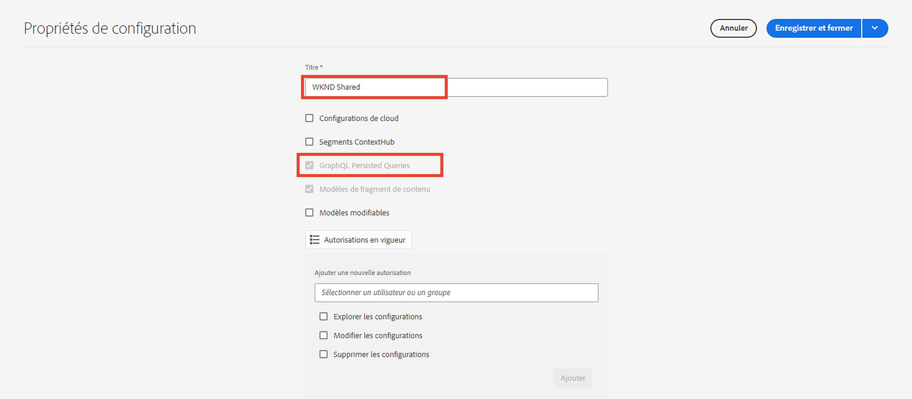
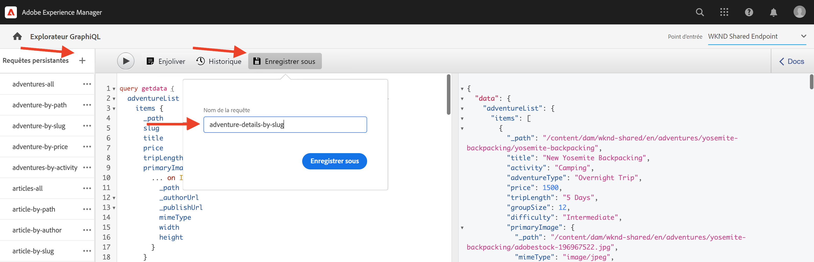
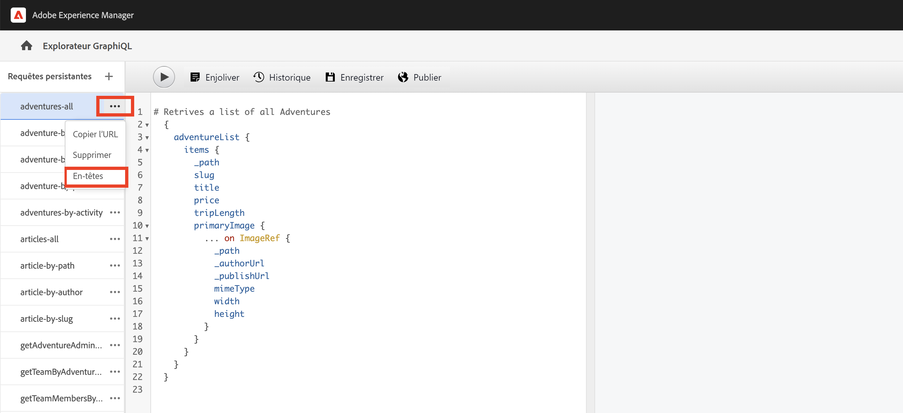
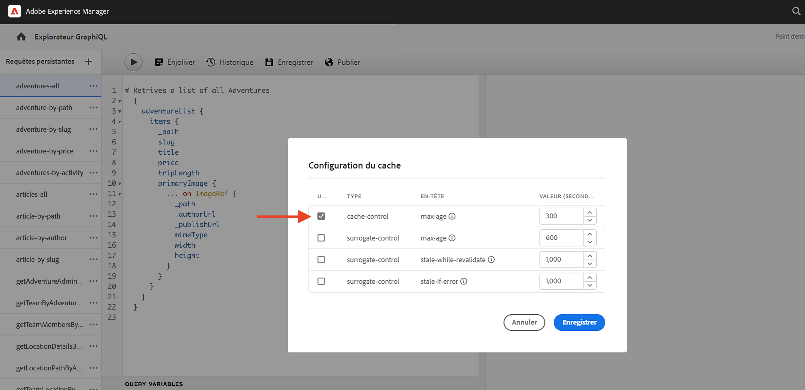

# Requêtes GraphQL persistantes

Les requêtes persistantes sont des requêtes qui sont stockées sur le serveur Adobe Experience Manager (AEM). Les clients et clientes peuvent envoyer une requête HTTP GET avec le nom de la requête pour l’exécuter. L’avantage de cette approche est la possibilité de mise en cache. Bien que les requêtes GraphQL côté client puissent également être exécutées à l’aide de requêtes HTTP POST, qui ne peuvent pas être mises en cache, les requêtes persistantes peuvent être mises en cache par des caches HTTP ou un réseau CDN, ce qui améliore les performances. Les requêtes persistantes vous permettent de simplifier vos requêtes et d’améliorer la sécurité, car vos requêtes sont encapsulées sur le serveur et l’administrateur ou l’administratrice AEM en a le contrôle total. L’utilisation de requêtes persistantes lorsque vous travaillez avec l’API GraphQL d’AEM est une **bonne pratique fortement recommandée**.

Dans le chapitre précédent, vous avez exploré certaines requêtes GraphQL avancées afin de recueillir des données pour l’application WKND. Dans ce chapitre, vous allez conserver les requêtes dans AEM et apprendre à utiliser le contrôle du cache sur les requêtes persistantes.

## Prérequis {#prerequisites}

Ce document fait partie d’un tutoriel en plusieurs parties. Assurez-vous que le [chapitre précédent](explore-graphql-api.md) est terminé avant de passer à ce chapitre.

## Objectifs {#objectives}

Dans ce chapitre, découvrez comment :

* Conserver des requêtes GraphQL avec des paramètres.
* Utiliser les paramètres de contrôle du cache avec les requêtes persistantes.

## Revoir la configuration des _requêtes persistantes GraphQL_

Rappelons que les _requêtes persistantes GraphQL_ sont activées pour le projet WKND Site dans votre instance AEM.

1. Accédez à **Outils** > **Général** > **Navigateur de configurations**.

1. Sélectionnez **WKND Shared**, puis sélectionnez **Propriétés** dans la barre de navigation supérieure pour ouvrir les propriétés de configuration. Sur la page des propriétés de configuration, vous devriez voir que la permission **Requêtes persistantes GraphQL** est activée.

   

## Conserver des requêtes GraphQL à l’aide de l’outil explorateur GraphiQL intégré

Dans cette section, nous allons conserver la requête GraphQL qui sera ensuite utilisée dans l’application cliente pour récupérer et rendre les données du fragment de contenu d’Adventure.

1. Saisissez la requête suivante dans l’explorateur GraphiQL :

   ```graphql
   query getAdventureDetailsBySlug($slug: String!) {
   adventureList(filter: {slug: {_expressions: [{value: $slug}]}}) {
       items {
       _path
       title
       activity
       adventureType
       price
       tripLength
       groupSize
       difficulty
       primaryImage {
           ... on ImageRef {
           _path
           mimeType
           width
           height
           }
       }
       description {
           html
           json
       }
       itinerary {
           html
           json
       }
       location {
           _path
           name
           description {
           html
           json
           }
           contactInfo {
           phone
           email
           }
           locationImage {
           ... on ImageRef {
               _path
           }
           }
           weatherBySeason
           address {
           streetAddress
           city
           state
           zipCode
           country
           }
       }
       instructorTeam {
           _metadata {
           stringMetadata {
               name
               value
           }
           }
           teamFoundingDate
           description {
           json
           }
           teamMembers {
           fullName
           contactInfo {
               phone
               email
           }
           profilePicture {
               ... on ImageRef {
               _path
               }
           }
           instructorExperienceLevel
           skills
           biography {
               html
           }
           }
       }
       administrator {
           fullName
           contactInfo {
           phone
           email
           }
           biography {
           html
           }
       }
       }
       _references {
       ... on ImageRef {
           _path
           mimeType
       }
       ... on LocationModel {
           _path
           __typename
       }
       }
   }
   }
   ```

   Vérifiez que la requête fonctionne avant de l’enregistrer.

1. Appuyez ensuite sur Enregistrer sous et saisissez `adventure-details-by-slug` comme nom de requête.

   

## Exécuter une requête persistante avec des variables en encodant des caractères spéciaux

Nous allons expliquer comment les requêtes persistantes avec des variables sont exécutées par l’application côté client en codant les caractères spéciaux.

Pour exécuter une requête persistante, l’application cliente effectue une requête GET en utilisant la syntaxe suivante :

```
GET <AEM_HOST>/graphql/execute.json/<Project-Config-Name>/<Persisted-Query-Name>
```

Pour exécuter une requête persistante _avec une variable_, la syntaxe ci-dessus devient :

```
GET <AEM_HOST>/graphql/execute.json/<Project-Config-Name>/<Persisted-Query-Name>;variable1=value1;variable2=value2
```

Les caractères spéciaux tels que le point-virgule (;), le signe égal (=), la barre oblique (/) et l’espace doivent être convertis pour utiliser le codage UTF-8 correspondant.

En exécutant la requête `getAllAdventureDetailsBySlug` à partir du terminal de ligne de commande, nous allons examiner ces concepts en action.

1. Ouvrez l’explorateur GraphiQL et cliquez sur les **points de suspension** (...) à côté de la requête persistante `getAllAdventureDetailsBySlug`, puis cliquez sur **Copier l’URL**. Collez l’URL copiée dans un éditeur de texte comme suit :

   ```code
       http://<AEM_HOST>/graphql/execute.json/wknd-shared/getAllAdventureDetailsBySlug;slug=
   ```

1. Ajoutez `yosemite-backpacking` comme valeur de variable.

   ```code
       http://<AEM_HOST>/graphql/execute.json/wknd-shared/getAllAdventureDetailsBySlug;slug=yosemite-backpacking
   ```

1. Encodez les caractères spéciaux point-virgule (;) et signe égal (=).

   ```code
       http://<AEM_HOST>/graphql/execute.json/wknd-shared/getAllAdventureDetailsBySlug%3Bslug%3Dyosemite-backpacking
   ```

1. Ouvrez un terminal de ligne de commande et utilisez [Curl](https://curl.se/) pour exécuter la requête.

   ```shell
   $ curl -X GET http://<AEM_HOST>/graphql/execute.json/wknd-shared/getAllAdventureDetailsBySlug%3Bslug%3Dyosemite-backpacking
   ```

>[!TIP]
>
>    Si vous exécutez la requête ci-dessus dans l’environnement de création AEM, vous devez envoyer les informations d’identification. Voir la rubrique [Jeton d’accès au développement local](https://experienceleague.adobe.com/docs/experience-manager-learn/getting-started-with-aem-headless/authentication/local-development-access-token.html?lang=fr) pour en avoir la démonstration et [Appeler l’API AEM](https://experienceleague.adobe.com/docs/experience-manager-cloud-service/content/implementing/developing/generating-access-tokens-for-server-side-apis.html?lang=fr#calling-the-aem-api) pour les détails de la documentation.

Consultez également [Comment exécuter une requête persistante](https://experienceleague.adobe.com/docs/experience-manager-cloud-service/content/headless/graphql-api/persisted-queries.html?lang=fr#execute-persisted-query), [Utiliser des variables de requête](https://experienceleague.adobe.com/docs/experience-manager-cloud-service/content/headless/graphql-api/persisted-queries.html?lang=fr#query-variables) et [Encoder l’URL de la requête pour son utilisation par une application](https://experienceleague.adobe.com/docs/experience-manager-cloud-service/content/headless/graphql-api/persisted-queries.html?lang=fr#encoding-query-url) pour apprendre l’exécution de requêtes persistantes par des applications clientes.

## Mettre à jour les paramètres de contrôle de cache dans les requêtes persistantes {#cache-control-all-adventures}

L’API GraphQL d’AEM vous permet de mettre à jour les paramètres de contrôle de cache par défaut de vos requêtes afin d’améliorer les performances. Les valeurs par défaut du contrôle de cache sont :

* Le TTL par défaut (maxage=60) pour le client (par exemple, un navigateur) est de 60 secondes.

* Le TTL par défaut est de 7 200 secondes (s-maxage=7200) pour le Dispatcher et le réseau CDN, également connus sous le nom de caches partagés.

Utilisez la requête `adventures-all` pour mettre à jour les paramètres du contrôle de cache. La réponse à la requête est volumineuse et il est utile de contrôler son `age` dans le cache. Cette requête persistante est utilisée ultérieurement pour mettre à jour l’[application cliente](/help/headless-tutorial/graphql/advanced-graphql/client-application-integration.md).

1. Ouvrez l’explorateur GraphiQL et cliquez sur les **points de suspension** (...) à côté de la requête persistante, puis cliquez sur **En-têtes** pour ouvrir la boîte de dialogue modale **Configuration du cache**.

   


1. Dans la boîte de dialogue modale **Configuration du cache**, mettez à jour la valeur de l’en-tête `max-age` sur `600 ` secondes (10 min), puis cliquez sur **Enregistrer**.

   


Consultez la [Mise en cache de vos requêtes persistantes](https://experienceleague.adobe.com/docs/experience-manager-cloud-service/content/headless/graphql-api/persisted-queries.html?lang=fr#caching-persisted-queries) pour plus d’informations sur les paramètres de contrôle de cache par défaut.


## Félicitations.

Félicitations. Vous savez maintenant comment conserver des requêtes GraphQL avec des paramètres, mettre à jour des requêtes persistantes et utiliser des paramètres de contrôle de cache avec des requêtes persistantes.

## Étapes suivantes

Dans le [prochain chapitre](/help/headless-tutorial/graphql/advanced-graphql/client-application-integration.md), vous implémenterez les demandes de requêtes persistantes dans l’application WKND.
