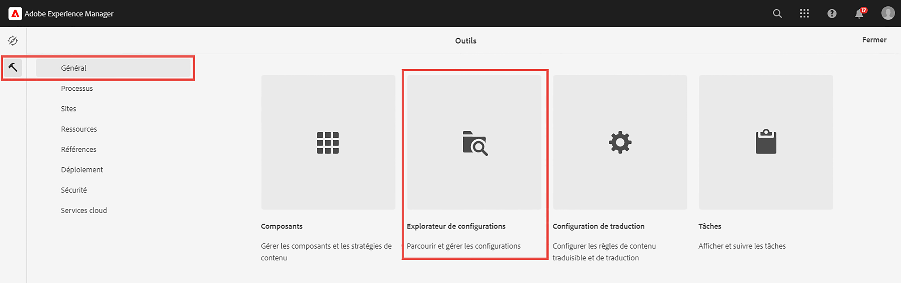
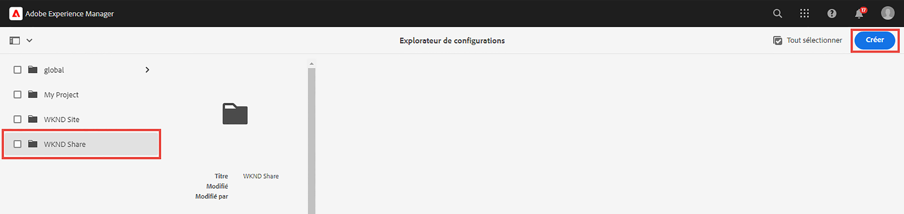
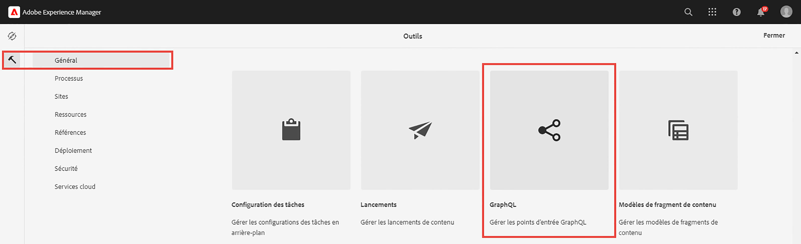
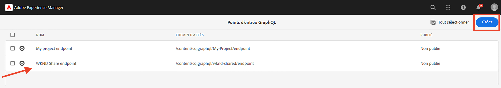
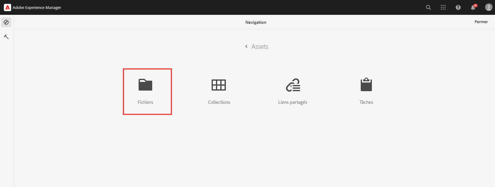
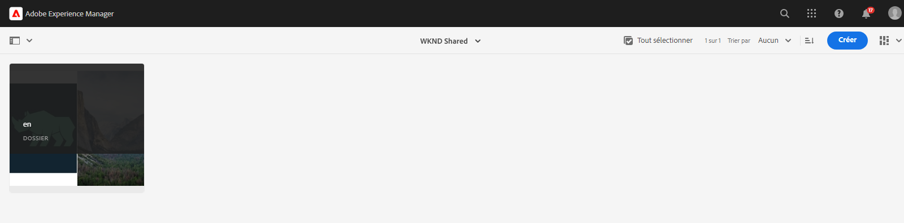
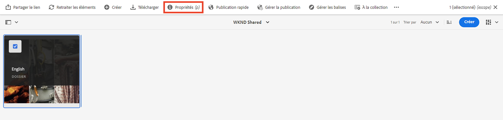
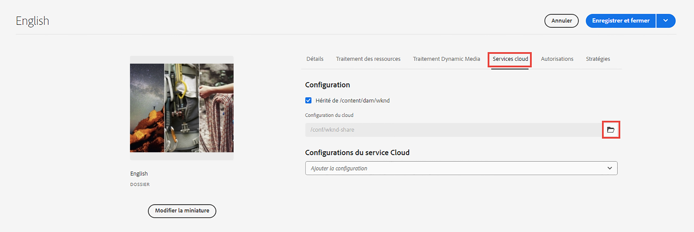

# Concepts avancés d’AEM Headless

{{aem-headless-trials-promo}}

Ce tutoriel complet poursuit le [tutoriel de base](../multi-step/overview.md) qui couvrait les principes de base d’Adobe Experience Manager (AEM) Headless et de GraphQL. Le tutoriel avancé illustre des aspects détaillés de l’utilisation des modèles de fragment de contenu, des fragments de contenu et des requêtes persistantes GraphQL d’AEM, y compris l’utilisation des requêtes persistantes GraphQL dans une application cliente.

## Prérequis

Procédez à la [configuration rapide d’AEM as a Cloud Service](../quick-setup/cloud-service.md) pour configurer votre environnement AEM as a Cloud Service.

Il est vivement recommandé d’effectuer le [tutoriel de base](../multi-step/overview.md) précédent et les [tutoriels vidéo](../video-series/modeling-basics.md) avant de poursuivre ce tutoriel avancé. Bien que vous puissiez suivre le tutoriel à l’aide d’un environnement AEM local, ce tutoriel ne couvre que le workflow pour AEM as a Cloud Service.

>[!CAUTION]
>
>Si vous n’avez pas accès à un environnement AEM as a Cloud Service, vous pouvez effectuer la [configuration rapide d’AEM Headlesss à l’aide du SDK local](https://experienceleague.adobe.com/docs/experience-manager-learn/getting-started-with-aem-headless/graphql/quick-setup/local-sdk.html?lang=fr). Toutefois, il est important de noter que certaines pages de l’interface utilisateur de produit, telles que la navigation des fragments de contenu, sont différentes.

## Objectifs

Ce tutoriel couvre les sujets suivants :

* Créez des modèles de fragment de contenu à l’aide de règles de validation et de types de données plus avancés tels que des espaces réservés d’onglet, des références de fragments imbriqués, des objets JSON et des types de données Date et heure.
* Créez des fragments de contenu lorsque vous utilisez des références de fragments et du contenu imbriqués, et configurez des stratégies de dossier pour la gouvernance de création de fragments de contenu.
* Explorez les fonctionnalités de l’API GraphQL d’AEM à l’aide de requêtes GraphQL avec des variables et des directives.
* Conservez les requêtes GraphQL avec des paramètres dans AEM et découvrez comment utiliser les paramètres de contrôle du cache avec les requêtes persistantes.
* Intégrez les requêtes de requêtes persistantes dans l’exemple d’application React GraphQL WKND à l’aide du SDK JavaScript d’AEM Headless.

## Présentation des concepts avancés d’AEM Headless

La vidéo suivante présente un aperçu général des concepts abordés dans ce tutoriel. Le tutoriel comprend la définition de modèles de fragment de contenu avec des types de données plus avancés, l’imbrication de fragments de contenu et la conservation de requêtes GraphQL dans AEM.

>[!VIDEO](https://video.tv.adobe.com/v/340035?quality=12&learn=on)

>[!CAUTION]
>
>Cette vidéo (à 2:25) mentionne l’installation de l’éditeur de requêtes GraphiQL via le gestionnaire de packages pour explorer les requêtes GraphQL. Cependant, dans les versions plus récentes d’AEM as a Cloud Service, une version intégrée de l’**explorateur GraphiQL** est fournie, l’installation du package n’est donc pas requise. Consultez [Utilisation de l’IDE GraphiQL](https://experienceleague.adobe.com/docs/experience-manager-cloud-service/content/headless/graphql-api/graphiql-ide.html?lang=fr) pour plus d’informations.

## Configuration du projet

Le projet de WKND Site comporte toutes les configurations nécessaires pour que vous puissiez commencer le tutoriel juste après avoir terminé la [configuration rapide](../quick-setup/cloud-service.md). Cette section ne met en évidence que certaines étapes importantes que vous pouvez utiliser lors de la création de votre propre projet AEM Headless.

### Vérifier la configuration existante

La première étape pour démarrer un nouveau projet dans AEM consiste à créer sa configuration en tant qu’espace de travail et à créer des points d’entrée d’API GraphQL. Pour vérifier ou créer une configuration, accédez à **Outils** > **Général** > **Explorateur de configurations**.

Notez que la configuration du site `WKND Shared` a déjà été créée pour le tutoriel. Pour créer une configuration pour votre propre projet, sélectionnez **Créer** dans le coin supérieur droit et remplissez le formulaire dans la boîte de dialogue modale Créer une configuration qui s’affiche.

### Vérifier les points d’entrée de l’API GraphQL

Ensuite, vous devez configurer les points d’entrée de l’API auxquels envoyer des requêtes GraphQL. Pour passer en revue les points d’entrée existants ou en créer un, accédez à **Outils** > **Général** > **GraphQL**.

Notez que le `WKND Shared Endpoint` a déjà été créé. Pour créer un point d’entrée pour votre projet, sélectionnez **Créer** dans le coin supérieur droit et suivez le workflow.

>[!NOTE]
>
> Après avoir enregistré le point d’entrée, une boîte de dialogue modale s’affiche pour vous rendre dans la console de sécurité, ce qui vous permet d’ajuster les paramètres de sécurité si vous souhaitez configurer l’accès au point d’entrée. Toutefois, les autorisations de sécurité elles-mêmes ne font pas partie de ce tutoriel. Pour en savoir plus, consultez la [documentation AEM](https://experienceleague.adobe.com/docs/experience-manager-65/administering/security/security.html?lang=fr).

### Vérifier la structure de contenu et le dossier racine de langue de WKND

Une structure de contenu bien définie est essentielle au succès de l’implémentation d’AEM Headless. Elle est utile pour la gestion de l’évolutivité, de la convivialité et des autorisations de votre contenu.

Un dossier racine de langue est un dossier dont le nom contient un code de langue ISO, tel que EN ou FR. Le système de gestion de traduction d’AEM utilise ces dossiers pour définir la langue principale de votre contenu et les langues de traduction du contenu.

Accédez à **Navigation** > **Ressources** > **Fichiers**.

Accédez au dossier **WKND Shared**. Observez le dossier dont le titre est « English » et le nom « EN ». Ce dossier est le dossier racine de langue du projet WKND Site.

Pour votre propre projet, créez un dossier racine de langue dans votre configuration. Voir la section sur la [création de dossiers](/help/headless-tutorial/graphql/advanced-graphql/author-content-fragments.md#create-folders) pour plus d’informations.

### Attribuer une configuration au dossier imbriqué

Enfin, vous devez attribuer la configuration de votre projet au dossier racine de langue. Cette attribution permet la création de fragments de contenu en fonction de modèles de fragment de contenu définis dans la configuration de votre projet.

Pour attribuer le dossier racine de langue à la configuration, sélectionnez le dossier, puis sélectionnez **Propriétés** dans la barre de navigation supérieure.

Ensuite, accédez à l’onglet **Cloud Services** et sélectionnez l’icône de dossier dans le champ **Configuration du cloud**.

Dans la boîte de dialogue modale qui s’affiche, sélectionnez la configuration précédemment créée pour lui affecter le dossier racine de langue.

### Bonnes pratiques

Voici les bonnes pratiques à appliquer lors de la création de votre propre projet dans AEM :

* La hiérarchie de dossiers doit être modélisée en tenant compte de la localisation et de la traduction. En d’autres termes, les dossiers de langue doivent être imbriqués dans des dossiers de configuration, ce qui permet une traduction facile du contenu dans ces mêmes dossiers.
* La hiérarchie des dossiers doit être plate et simple. Évitez de déplacer ou de renommer des dossiers et des fragments ultérieurement, en particulier après publication pour une utilisation en direct, car cela modifie les chemins d’accès pouvant affecter les références aux fragments et les requêtes GraphQL.

## Packages de démarrage et de solution

Deux **packages** AEM sont disponibles et peuvent être installés via le [Gestionnaire de packages](/help/headless-tutorial/graphql/advanced-graphql/author-content-fragments.md#sample-content).

* [Advanced-GraphQL-Tutorial-Starter-Package-1.1.zip](/help/headless-tutorial/graphql/advanced-graphql/assets/tutorial-files/Advanced-GraphQL-Tutorial-Starter-Package-1.1.zip), qui sera utilisé ultérieurement dans le tutoriel, contient des exemples d’images et de dossiers.
* [Advanced-GraphQL-Tutorial-Solution-Package-1.2.zip](/help/headless-tutorial/graphql/advanced-graphql/assets/tutorial-files/Advanced-GraphQL-Tutorial-Solution-Package-1.2.zip) contient la solution terminée pour les chapitres 1 à 4, y compris les nouveaux modèles de fragment de contenu, fragments de contenu et requêtes GraphQL persistantes. Ce dernier est utile pour ceux qui souhaitent passer directement au chapitre [Intégration d’applications client](/help/headless-tutorial/graphql/advanced-graphql/client-application-integration.md).

Le projet [Application React - Tutoriel avancé - WKND Adventures](https://github.com/adobe/aem-guides-wknd-graphql/blob/main/advanced-tutorial/README.md) vous permet de consulter et d’explorer l’exemple d’application. Cet exemple d’application récupère le contenu d’AEM en appelant les requêtes GraphQL persistantes et le transforme en une expérience immersive.

## Prise en main

Pour commencer à utiliser ce tutoriel avancé, procédez comme suit :

1. Configurez un environnement de développement à l’aide d’[AEM as a Cloud Service](../quick-setup/cloud-service.md).
1. Commencez par le chapitre du tutoriel [Créer des modèles de fragment de contenu](/help/headless-tutorial/graphql/advanced-graphql/create-content-fragment-models.md).
