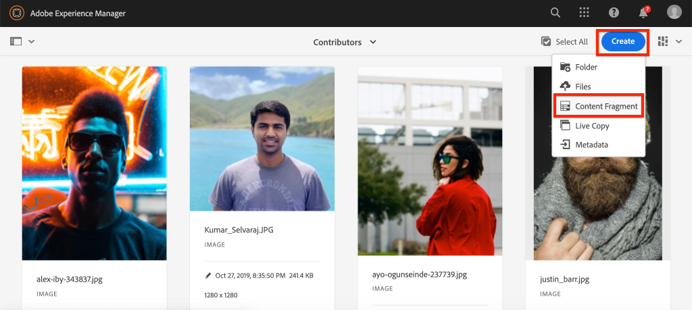
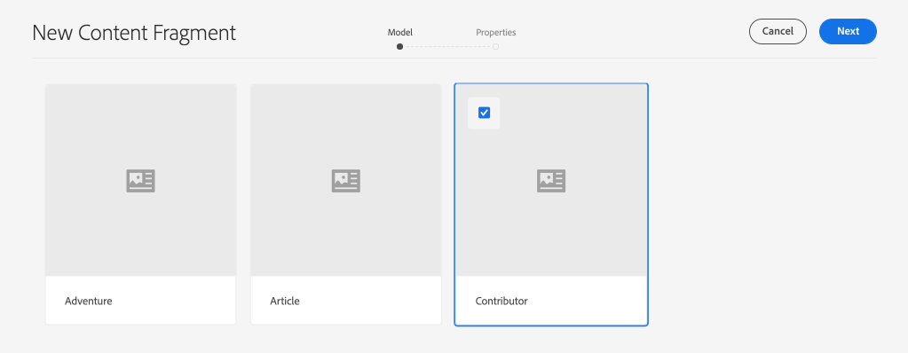

# Création d’un fragment de contenu {#authoring-content-fragments}

Dans ce chapitre, vous allez créer et modifier un fragment de contenu en fonction du [nouveau modèle de fragment de contenu du contributeur](./content-fragment-models.md). Vous apprendrez également à créer des variantes de fragments de contenu.

## Conditions préalables {#prerequisites}

Il s’agit d’un didacticiel en plusieurs parties et on suppose que les étapes décrites dans la section [Définition des modèles de fragments de contenu](./content-fragment-models.md) ont été terminées.

## Objectifs {#objectives}

* Création d’un fragment de contenu basé sur un modèle de fragment de contenu
* Création d’une variation de fragment de contenu

## Présentation de la création de fragments de contenu {#overview}

>[!VIDEO](https://video.tv.adobe.com/v/22451/?quality=12&learn=on)

La vidéo ci-dessus présente un aperçu général de la création de fragments de contenu.

## Créer un fragment de contenu {#create-content-fragment}

Dans le chapitre précédent, [Définir des modèles de fragments de contenu](./content-fragment-models.md), un modèle **Contributeur** a été créé. Créez un fragment de contenu à l’aide de ce modèle.

1. Dans le menu **AEM Début**, accédez à **Ressources** > **Fichiers**.
1. Cliquez sur les dossiers pour accéder au **site WKND** > **anglais** > **contributeurs**. Ce dossier contient une liste de captures d’écran pour les contributeurs de la marque WKND.

1. Cliquez sur **Créer** dans l’angle supérieur droit et sélectionnez **Fragment de contenu** :

   

1. Sélectionnez le modèle **Contributeur** et cliquez sur **Suivant**.

   

   Il s’agit du même modèle **Contributeur** qui a été créé dans le chapitre précédent.

1. Saisissez **Stacey Roswells** pour le titre et cliquez sur **Créer**.
1. Cliquez sur **Ouvrir** dans la boîte de dialogue **Succès** pour ouvrir le fragment nouvellement créé.

   

   Observez que les champs définis par le modèle sont désormais disponibles pour créer cette instance de Fragment de contenu.

1. Pour **Nom complet**, entrez : **Stacey Roswells**.
1. Pour **Biographie**, entrez une brève biographie. Besoin d&#39;inspiration ? N&#39;hésitez pas à réutiliser ce [fichier texte](assets/author-content-fragments/stacey-roswells-bio.txt).
1. Pour **Référence d&#39;image** cliquez sur l&#39;icône **dossier** et accédez à **Site WKND** > **Anglais** > **Contributeurs** > **stacey-roswells.jpg**. L&#39;évaluation porte sur le chemin d&#39;accès : `/content/dam/wknd/en/contributors/stacey-roswells.jpg`.
1. Pour **Occupation**, choisissez **Photographe**.

   

1. Cliquez sur **Enregistrer** pour enregistrer les modifications.

## Création d’une variante de fragment de contenu

Tous les fragments de contenu commencent par une variation **Master**. La variation **Master** peut être considérée comme le contenu *par défaut* du fragment et est automatiquement utilisée lorsque le contenu est exposé via les API GraphQL. Il est également possible de créer des variantes d’un fragment de contenu. Cette fonctionnalité offre une plus grande souplesse pour la conception et la mise en oeuvre.

Des variantes peuvent être utilisées pour cibler des canaux spécifiques. Par exemple, une variante **mobile** peut être créée qui contient une plus petite quantité de texte ou fait référence à une image spécifique à une couche. La façon dont les variations sont utilisées dépend vraiment de la mise en oeuvre. Comme toute fonctionnalité, une planification minutieuse doit être effectuée avant l’utilisation.

Créez ensuite une nouvelle variante pour vous faire une idée des capacités disponibles.

1. Ouvrez à nouveau le fragment de contenu **Stacey Roswells**.
1. Dans le rail latéral gauche, cliquez sur **Créer une variante**.
1. Dans la boîte de dialogue modale **Nouvelle variante**, entrez un titre de **Résumé**.

   

1. Cliquez dans le champ **Biographie** multiligne et cliquez sur le bouton **Développer** pour accéder à la vue plein écran du champ multiligne.

   

1. Cliquez sur **Synthèse du texte** dans le menu supérieur droit.

1. Entrez un **mot** de **50** et cliquez sur **Démarrer**.

   

   Un aperçu de synthèse s’ouvre alors. aem processeur de langue de machine tente de résumer le texte en fonction du nombre de mots cible. Vous pouvez également sélectionner différentes phrases à supprimer.

1. Cliquez sur **Résumer** lorsque vous êtes satisfait de la synthèse. Cliquez dans le champ de texte multiligne et basculez le bouton **Développer** pour revenir à la vue principale.

1. Cliquez sur **Enregistrer** pour enregistrer les modifications.

## Création d’un fragment de contenu supplémentaire

Répétez les étapes décrites dans [Créer un fragment de contenu](#create-content-fragment) pour créer un **Contributeur** supplémentaire. Cette option sera utilisée dans le chapitre suivant comme exemple de requête de plusieurs fragments.

1. Dans le dossier **Contributeurs**, cliquez sur **Créer** en haut à droite et sélectionnez **Fragment de contenu** :
1. Sélectionnez le modèle **Contributeur** et cliquez sur **Suivant**.
1. Saisissez **Jacob Wester** pour le titre et cliquez sur **Créer**.
1. Cliquez sur **Ouvrir** dans la boîte de dialogue **Succès** pour ouvrir le fragment nouvellement créé.
1. Pour **Nom complet**, entrez : **Jacob Wester**.
1. Pour **Biographie**, entrez une brève biographie. Besoin d&#39;inspiration ? N&#39;hésitez pas à réutiliser ce [fichier texte](assets/author-content-fragments/jacob-wester.txt).
1. Pour **Référence d&#39;image** cliquez sur l&#39;icône **dossier** et accédez à **Site WKND** > **Anglais** > **Contributeurs** > **jacob_wester.jpg**. L&#39;évaluation porte sur le chemin d&#39;accès : `/content/dam/wknd/en/contributors/jacob_wester.jpg`.
1. Pour **Occupation**, choisissez **Auteur**.
1. Cliquez sur **Enregistrer** pour enregistrer les modifications. Il n’est pas nécessaire de créer une variation, sauf si vous le souhaitez !

   

   Vous devez maintenant avoir deux fragments **Contributeurs**.

## Félicitations! {#congratulations}

Félicitations, vous venez de créer plusieurs fragments de contenu et d’en créer une variante.

## Étapes suivantes {#next-steps}

Dans le chapitre suivant, [Explorer les API GraphQL](explore-graphql-api.md), vous allez explorer AEM API GraphQL à l&#39;aide de l&#39;outil GraphQL intégré. Découvrez comment AEM génère automatiquement un schéma GraphQL basé sur un modèle Fragment de contenu. Vous allez expérimenter la construction de requêtes de base à l&#39;aide de la syntaxe GraphQL.