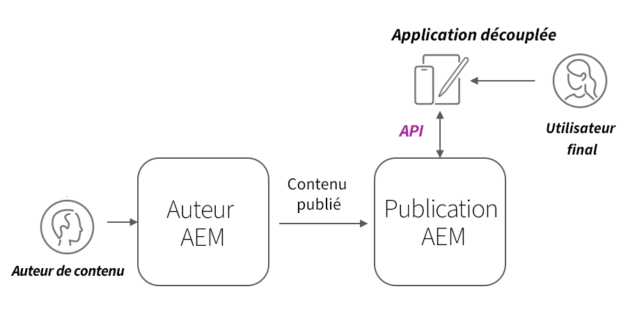

# AEM Déploiements sans affichage

AEM les déploiements de clients sans affichage prennent de nombreuses formes ; SPA hébergé AEM, site Web, application mobile ou même processus serveur à serveur.

En fonction du client et de la manière dont il est déployé, AEM déploiements sans affichage ont des considérations différentes.

## Architecture AEM service

Avant d’explorer les considérations liées au déploiement, il est impératif de comprendre AEM architecture logique, ainsi que la séparation et les rôles des niveaux de service d’AEM as a Cloud Service. AEM as a Cloud Service comprend deux services logiques :

+ __Auteur AEM__ est le service vers lequel les équipes créent, collaborent et publient des fragments de contenu (et d’autres ressources).
+ __Publication AEM__ est le service qui a été publié ; les fragments de contenu (et d’autres ressources) sont répliqués pour une utilisation générale.
+ __Aperçu AEM__ est le service qui imite AEM Publish dans le comportement, mais qui contient du contenu publié à des fins de prévisualisation ou de révision. AEM Aperçu est destiné aux audiences internes et non à la diffusion générale de contenu. L’utilisation de l’aperçu AEM est facultative, selon le workflow souhaité.

Architecture de déploiement as a Cloud Service sans tête standard AEM

AEM clients sans affichage opérant dans une capacité de production interagissent généralement avec AEM Publish, qui contient le contenu approuvé et publié. Les clients qui interagissent avec l’auteur AEM doivent faire preuve d’une attention particulière, car l’auteur AEM est sécurisé par défaut, ce qui nécessite une autorisation pour toutes les requêtes. Il peut également contenir du travail en cours ou du contenu non approuvé.

## Déploiements de clients sans affichage

    <!-- Single-page App (SPA) -->
    

       

           

               <figure class="image is-16by9">
                   
               </figure>
           

           

               

                   
<a href="./spa.md" title="Application d’une seule page (SPA)">Application d’une seule page (SPA)</a>

                   
Découvrez les considérations relatives au déploiement pour les applications d’une seule page (SPA).

                   <a href="./spa.md" class="spectrum-Button spectrum-Button--outline spectrum-Button--primary spectrum-Button--sizeM">
                       En savoir plus
                   </a>
               

           

       

    

<!-- Web component/JS -->

   

       

           <figure class="image is-16by9">
               
           </figure>
       

       

           

               
<a href="./web-component.md" title="Composant Web/JS">Composant Web/JS</a>

               
Découvrez les points à prendre en compte concernant le déploiement des composants web et des clients JavaScript sans interface utilisateur de navigateur.

               <a href="./web-component.md" class="spectrum-Button spectrum-Button--outline spectrum-Button--primary spectrum-Button--sizeM">
                   En savoir plus
               </a>
           

       

   

<!-- Mobile apps -->

   

       

           <figure class="image is-16by9">
               
           </figure>
       

       

           

               
<a href="./mobile.md" title="Applications mobiles">Application mobile</a>

               
Découvrez les considérations relatives au déploiement pour les applications mobiles.

               <a href="./mobile.md" class="spectrum-Button spectrum-Button--outline spectrum-Button--primary spectrum-Button--sizeM">
                   En savoir plus
               </a>
           

       

   

<!-- Server-to-server apps -->

   

       

           <figure class="image is-16by9">
               
           </figure>
       

       

           

               
<a href="./server-to-server.md" title="Applications serveur à serveur">Application serveur à serveur</a>

               
En savoir plus sur les considérations de déploiement pour les applications serveur à serveur

               <a href="./server-to-server.md" class="spectrum-Button spectrum-Button--outline spectrum-Button--primary spectrum-Button--sizeM">
                   En savoir plus
               </a>
           

       

   

