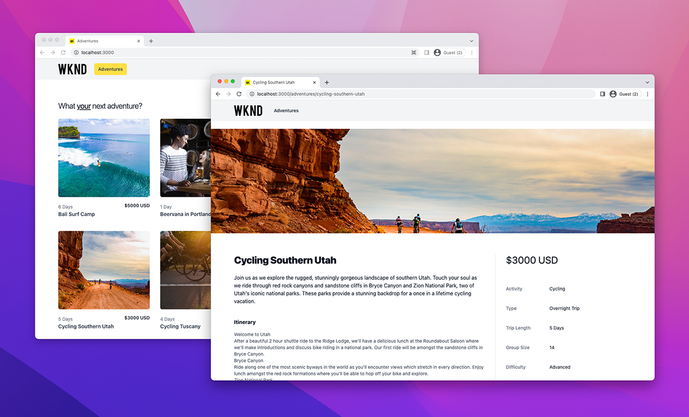

# Déploiements de SPA AEM Headless

Les déploiements d’applications sur une seule page (SPA) AEM Headless impliquent des applications JavaScript conçues à l’aide de frameworks tels que React ou Vue, qui consultent et interagissent avec le contenu d’AEM de manière découplée.

Pour déployer une SPA qui interagit avec AEM de façon découplée, la SPA doit être hébergée et accessible dans un navigateur web.

## Héberger la SPA

Une SPA est constituée d’un ensemble de ressources web natives : **HTML, CSS et JavaScript**. Ces ressources sont générées au cours du processus de _création_ (par exemple, `npm run build`) et déployées sur un hôte pour leur consultation par les utilisateurs finaux et utilisatrices finales.

Plusieurs solutions d’**hébergement** sont proposées pour répondre aux besoins de votre entreprise :

1. **Fournisseurs cloud**, par exemple **Azure** ou **AWS**.

2. Hébergement **On-Premise** dans un **centre de données** d’entreprise.

3. **Plateformes d’hébergement front-end**, par exemple **AWS Amplify**, **Azure App Service**, **Netlify**, **Heroku**, **Vercel**, etc.

## Configurations de déploiement

Le principal élément à prendre en compte lors de l’hébergement d’une SPA qui interagit avec AEM de manière découplée est de déterminer si l’accès à la SPA est réalisé via le domaine (ou l’hôte) AEM ou un autre domaine.  En effet, les SPA sont des applications web qui s’exécutent dans des navigateurs web et sont donc soumises aux politiques de sécurité de ceux-ci.

### Domaine partagé

Les domaines partagés de la SPA et d’AEM sont identiques si les utilisateurs finaux et utilisatrices finales y accèdent via le même domaine. Par exemple :

+ AEM est accessible via : `https://wknd.site/`
+ La SPA est accessible via : `https://wknd.site/spa`

Comme l’accès à AEM et à la SPA est réalisé via le même domaine, les navigateurs web permettent à la SPA d’envoyer des requêtes XHR aux points d’entréee AEM Headless, sans avoir à utiliser de configuration CORS. Ils autorisent également le partage de cookies HTTP (tel que le cookie `login-token` d’AEM).

Vous pouvez décider de la façon dont le trafic SPA et AEM est acheminé sur le domaine partagé : réseau CDN avec plusieurs origines, serveur HTTP avec proxy inverse, hébergement de la SPA directement dans AEM, etc.

Vous trouverez ci-dessous les configurations de déploiement requises pour le déploiement de la SPA dans l’instance de production, lorsqu’elles sont hébergées sur le même domaine qu’AEM.

| La SPA se connecte à | l’instance de création AEM, | Publication AEM | Prévisualisation AEM |
|---------------------------------------------------:|:----------:|:-----------:|:-----------:|
| [Filtres Dispatcher.](./configurations/dispatcher-filters.md) | ✘ | ✔ | ✔ |
| Partage de ressources entre origines multiples (CORS) | ✘ | ✘ | ✘ |
| Hôtes AEM | ✘ | ✘ | ✘ |

### Différents domaines

Une SPA et AEM ont des domaines différents lorsque les utilisateurs finaux et utilisatrices finales y accèdent via des domaines différents. Par exemple :

+ AEM est accessible via : `https://wknd.site/`
+ La SPA est accessible via : `https://wknd-app.site/`

Comme l’accès à AEM et à la SPA est réalisé via des domaines différents, les navigateurs web appliquent des politiques de sécurité, telles que le [partage de ressources cross-origin (CORS)](./configurations/cors.md) et empêchent le partage de cookies HTTP (par exemple, le cookie `login-token` d’AEM).

Vous trouverez ci-dessous les configurations de déploiement requises pour le déploiement de la SPA dans l’instance de production, lorsqu’elles sont hébergées sur un domaine autre qu’AEM.

| La SPA se connecte à | l’instance de création AEM, | Publication AEM | Prévisualisation AEM |
|---------------------------------------------------:|:----------:|:-----------:|:-----------:|
| [Filtres Dispatcher.](./configurations/dispatcher-filters.md) | ✘ | ✔ | ✔ |
| [Partage de ressources entre origines multiples (CORS).](./configurations/cors.md) | ✔ | ✔ | ✔ |
| [Hôtes AEM.](./configurations/aem-hosts.md) | ✔ | ✔ | ✔ |

#### Exemple de déploiement d’une SPA sur différents domaines

Dans cet exemple, la SPA est déployée sur un domaine Netlify (`https://main--sparkly-marzipan-b20bf8.netlify.app/`) et elle utilise les API AEM GraphQL du domaine de publication AEM (`https://publish-p65804-e666805.adobeaemcloud.com`). Les captures d’écran ci-dessous mettent en évidence les exigences CORS.

1. La SPA est hébergée sur un domaine Netlify, mais effectue un appel XHR aux API GraphQL d’AEM sur un autre domaine. Cette requête multisite nécessite la configuration de la politique [CORS](./configurations/cors.md) sur AEM afin de permettre au domaine Netlify d’accéder à son contenu.

   

2. L’en-tête `Access-Control-Allow-Origin` est présent dans la requête XHR vers l’API AEM GraphQL, ce qui indique au navigateur web qu’AEM autorise les demandes provenant de ce domaine Netlify à accéder à son contenu.

   Si la politique [CORS](./configurations/cors.md) AEM est absente ou n’inclut pas le domaine Netlify, la requête XHR est refusée par le navigateur web qui indique une erreur CORS.

   

## Exemple d’application sur une seule page

Adobe fournit un exemple d’application sur une seule page codée dans React.

<!-- React app -->

   

       

           <figure class="image is-16by9">
               
           </figure>
       

       

           

               
<a href="../example-apps/react-app.md" title="Application React">Application React</a>

               
Exemple d’application sur seule page, écrite dans React, qui consomme du contenu des API GraphQL d’AEM Headless.

               <a href="../example-apps/react-app.md" class="spectrum-Button spectrum-Button--outline spectrum-Button--primary spectrum-Button--sizeM">
                   Afficher l’exemple
               </a>
           

       

   

<!-- Next.js app -->

   

       

           <figure class="image is-16by9">
               
           </figure>
       

       

           

               
<a href="../example-apps/next-js.md" title="Application Next.js">Application Next.js</a>

               
Exemple d’application sur une seule page, écrite dans Next.js, qui consomme du contenu des API GraphQL d’AEM Headless.

               <a href="../example-apps/next-js.md" class="spectrum-Button spectrum-Button--outline spectrum-Button--primary spectrum-Button--sizeM">
                   Afficher l’exemple
               </a>
           

       

   

