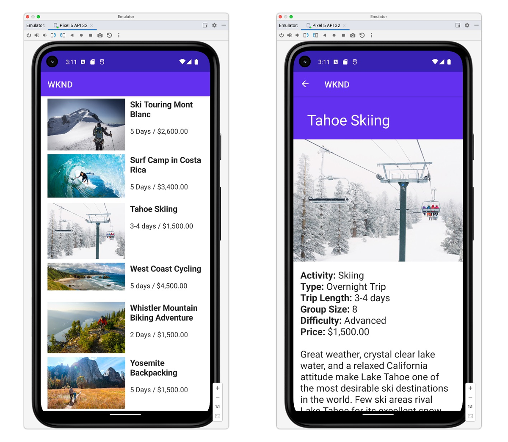

# Application Android

Découvrez les fonctionnalités découplées d’Adobe Experience Manager (AEM) grâce aux exemples d’applications. Cette application Android explique comment interroger du contenu à l’aide des API GraphQL d’AEM. Le [client AEM Headless pour Java](https://github.com/adobe/aem-headless-client-java) est utilisé pour exécuter les requêtes GraphQL et mapper les données aux objets Java afin d’alimenter l’application.




Afficher le [code source sur GitHub](https://github.com/adobe/aem-guides-wknd-graphql/tree/main/android-app)

## Prérequis {#prerequisites}

Les outils suivants doivent être installés localement :

+ [Android Studio](https://developer.android.com/studio)
+ [Git](https://git-scm.com/)

## Configuration requise d’AEM

L’application Android fonctionne avec les options de déploiement AEM suivantes. Tous les déploiements nécessitent que la version [v3.0.0 ou supérieure du site WKND](https://github.com/adobe/aem-guides-wknd/releases/latest) soit installée.

+ [AEM as a Cloud Service](https://experienceleague.adobe.com/docs/experience-manager-cloud-service/content/implementing/deploying/overview.html?lang=fr)

L’application Android est conçue pour se connecter à un environnement de __publication AEM__. Toutefois, elle peut extraire du contenu à partir de l’instance de création AEM si l’authentification est fournie dans la configuration de l’application Android.

## Utilisation

1. Clonez le référentiel `adobe/aem-guides-wknd-graphql` :

   ```shell
   $ git clone git@github.com:adobe/aem-guides-wknd-graphql.git
   ```

1. Lancez [Android Studio](https://developer.android.com/studio) et ouvrez le dossier `android-app`
1. Modifiez le fichier `config.properties` sous `app/src/main/assets/config.properties` et mettez à jour `contentApi.endpoint` pour qu’il corresponde à votre environnement AEM cible :

   ```plain
   contentApi.endpoint=https://publish-p123-e456.adobeaemcloud.com
   ```

   __Authentification de base__

   `contentApi.user` et `contentApi.password` authentifient un utilisateur ou une utilisatrice AEM local ayant accès au contenu GraphQL de WKND.

   ```plain
   contentApi.endpoint=https://author-p123-e456.adobeaemcloud.com
   contentApi.user=admin
   contentApi.password=admin
   ```

1. Téléchargez un [appareil virtuel Android](https://developer.android.com/studio/run/managing-avds) (API minimale 28).
1. Créez et déployez l’application à l’aide de l’émulateur Android.


### Se connecter à des environnements AEM

Si vous vous connectez à un environnement de création AEM, une [autorisation](https://github.com/adobe/aem-headless-client-java#using-authorization) est obligatoire. L’[AEMHeadlessClientBuilder](https://github.com/adobe/aem-headless-client-java/blob/main/client/src/main/java/com/adobe/aem/graphql/client/AEMHeadlessClientBuilder.java) permet d’utiliser des [authentifications par jeton](https://experienceleague.adobe.com/docs/experience-manager-learn/getting-started-with-aem-headless/authentication/overview.html?lang=fr). Pour utiliser l’authentification par jeton, mettez à jour le générateur de client dans `AdventureLoader.java` et `AdventuresLoader.java` :

```java
/* Comment out basicAuth
 if (user != null && password != null) {
   builder.basicAuth(user, password);
 }
*/

// use token-authentication where `token` is a String representing the token
builder.tokenAuth(token)
```

## Le code

Vous trouverez ci-dessous un bref résumé des fichiers et du code importants utilisés pour alimenter l’application. Le code complet se trouve sur [GitHub](https://github.com/adobe/aem-guides-wknd-graphql/tree/main/android-app).

### Requêtes persistantes

En suivant les bonnes pratiques d’AEM Headless, l’application iOS utilise les requêtes persistantes GraphQL d’AEM pour interroger les données d’Adventure. L’application utilise deux requêtes persistantes :

+ La requête persistante `wknd/adventures-all`, qui renvoie toutes les Adventures dans AEM avec un ensemble abrégé de propriétés. Cette requête persistante génère la liste des Adventures de la vue initiale.

```
# Retrieves a list of all adventures
{
    adventureList {
        items {
            _path
            slug
            title
            price
            tripLength
            primaryImage {
                ... on ImageRef {
                _dynamicUrl
                _path
                }
            }
        }
    }
}
```

+ La requête persistante `wknd/adventure-by-slug`, qui renvoie une seule Adventure par `slug` (propriété personnalisée qui identifie de manière unique une Adventure) avec un ensemble complet de propriétés. Cette requête persistante alimente les vues détaillées de l’Adventure.

```
# Retrieves an adventure Content Fragment based on it's slug
# Example query variables: 
# {"slug": "bali-surf-camp"} 
# Technically returns an adventure list but since the the slug 
# property is set to be unique in the CF Model, only a single CF is expected

query($slug: String!) {
  adventureList(filter: {
        slug: {
          _expressions: [ { value: $slug } ]
        }
      }) {
    items {
      _path
      title
      slug
      activity
      adventureType
      price
      tripLength
      groupSize
      difficulty
      price
      primaryImage {
        ... on ImageRef {
          _dynamicUrl
          _path
        }
      }
      description {
        json
        plaintext
      }
      itinerary {
        json
        plaintext
      }
    }
    _references {
      ...on AdventureModel {
        _path
        slug
        title
        price
        __typename
      }
    }
  }
}
```

### Exécuter la requête persistante GraphQL

Les requêtes persistantes AEM sont exécutées sur GET HTTP. Par conséquent, la variable [Client AEM Headless pour Java](https://github.com/adobe/aem-headless-client-java) est utilisée pour exécuter les requêtes GraphQL persistantes sur AEM et charger le contenu de l’Adventure dans l’application.

Chaque requête conservée possède une classe « loader » correspondante, qui appelle de manière asynchrone le point d’entrée AEM HTTP GET et renvoie les données de l’Adventure à l’aide du [modèle de données](#data-models) défini.

+ `loader/AdventuresLoader.java`

  Récupère la liste des Adventures sur l’écran d’accueil de l’application à l’aide de la requête persistante `wknd-shared/adventures-all`.

+ `loader/AdventureLoader.java`

  Récupère une seule Adventure en la sélectionnant via le paramètre `slug`, à l’aide de la requête persistante `wknd-shared/adventure-by-slug`.

```java
//AdventuresLoader.java

public static final String PERSISTED_QUERY_NAME = "/wknd-shared/adventures-all";
...
AEMHeadlessClientBuilder builder = AEMHeadlessClient.builder().endpoint(config.getContentApiEndpoint());

// Optional authentication for basic auth
String user = config.getContentApiUser();
String password = config.getContentApiPassword();

if (user != null && password != null) {
    builder.basicAuth(user, password);
}

AEMHeadlessClient client = builder.build();
// run a persistent query and get a response
GraphQlResponse response = client.runPersistedQuery(PERSISTED_QUERY_NAME);
```

### Modèles de données de réponse GraphQL{#data-models}

`Adventure.java` est un POJO Java initialisé avec les données JSON de la requête GraphQL. Il modélise une Adventure à utiliser dans les vues de l’application Android.

### Vues

L’application Android utilise deux vues pour présenter les données des Adventures dans l’expérience mobile.

+ `AdventureListFragment.java`

  Appelle `AdventuresLoader` et affiche les Adventures renvoyées dans une liste.

+ `AdventureDetailFragment.java`

  Appelle `AdventureLoader` en utilisant le paramètre `slug` transmis via la sélection des Adventures sur la vue `AdventureListFragment` et affiche les détails d’une seule Adventure.

### Images distantes

`loader/RemoteImagesCache.java` est une classe d’utilitaire qui permet de préparer des images distantes dans un cache afin qu’elles puissent être utilisées avec les éléments de l’interface utilisateur Android. Le contenu des Adventures référence des images dans AEM Assets via une URL et cette classe est utilisée pour afficher ce contenu.

## Ressources supplémentaires

+ [Prise en main d’AEM Headless - Tutoriel GraphQL](https://experienceleague.adobe.com/docs/experience-manager-learn/getting-started-with-aem-headless/graphql/multi-step/overview.html?lang=fr)
+ [Client AEM Headless pour Java](https://github.com/adobe/aem-headless-client-java)
