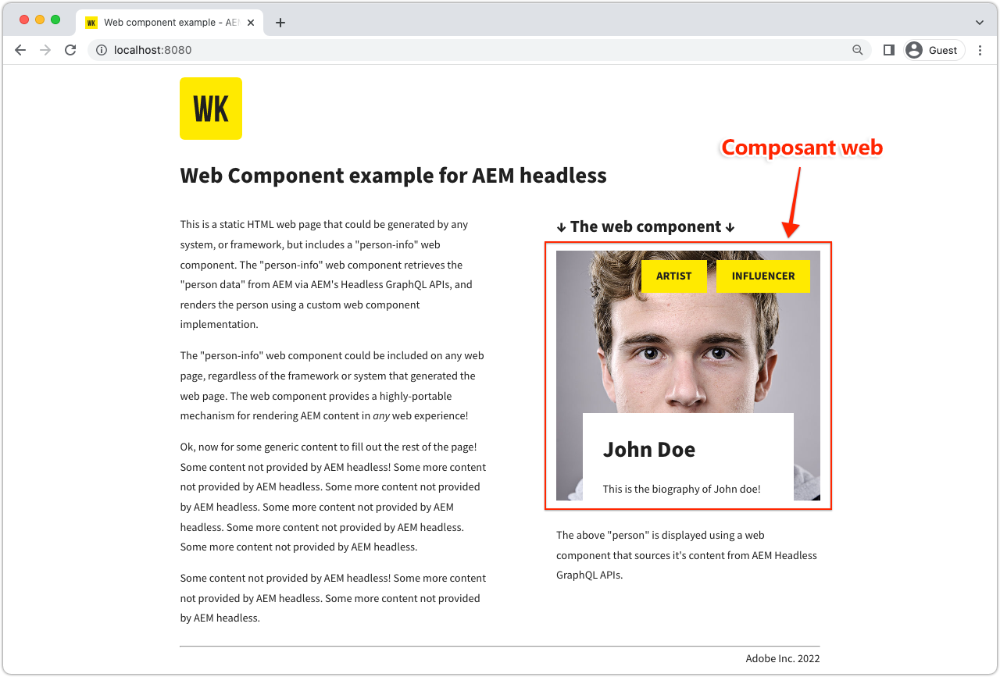

# Composant web

Découvrez les fonctionnalités découplées d’Adobe Experience Manager (AEM) grâce aux exemples d’applications. Cette application de composant web explique comment interroger le contenu à l’aide des API GraphQL d’AEM et de requêtes persistantes et effectuer le rendu d’une partie de l’interface utilisateur en utilisant du code JavaScript pur.



Afficher le [code source sur GitHub](https://github.com/adobe/aem-guides-wknd-graphql/tree/main/web-component)

## Prérequis {#prerequisites}

Les outils suivants doivent être installés localement :

+ [Node.js v18](https://nodejs.org/fr/)
+ [Git](https://git-scm.com/)

## Configuration requise d’AEM

Le composant web fonctionne avec les options de déploiement d’AEM ci-après.

+ [AEM as a Cloud Service](https://experienceleague.adobe.com/docs/experience-manager-cloud-service/content/implementing/deploying/overview.html?lang=fr)
+ Configuration locale à l’aide du [SDK AEM Cloud Service](https://experienceleague.adobe.com/docs/experience-manager-learn/cloud-service/local-development-environment-set-up/overview.html?lang=fr)
   + Nécessite [JDK 11](https://experience.adobe.com/#/downloads/content/software-distribution/en/general.html?1_group.propertyvalues.property=.%2Fjcr%3Acontent%2Fmetadata%2Fdc%3AsoftwareType&amp;1_group.propertyvalues.operation=equals&amp;1_group.propertyvalues.0_values=software-type%3Atooling&amp;fulltext=Oracle%7E+JDK%7E+11%7E&amp;orderby=%40jcr%3Acontent%2Fjcr%3AlastModified&amp;orderby.sort=desc&amp;layout=list&amp;p.offset=0&amp;p.limit=14) (si vous vous connectez au SDK local AEM 6.5 ou AEM)

Cet exemple d’application repose sur [basic-tutorial-solution.content.zip](../multi-step/assets/explore-graphql-api/basic-tutorial-solution.content.zip) à installer et les [configurations de déploiement](../deployment/web-component.md) sont en place.


>[!IMPORTANT]
>
>Le composant web est conçu pour se connecter à un environnement de __Publication AEM__, mais il peut récupérer du contenu à partir de l’environnement de création AEM si l’authentification est fournie dans le fichier [`person.js`](https://github.com/adobe/aem-guides-wknd-graphql/blob/main/web-component/src/person.js#L11) du composant.

## Utilisation

1. Clonez le référentiel `adobe/aem-guides-wknd-graphql` :

   ```shell
   $ git clone git@github.com:adobe/aem-guides-wknd-graphql.git
   ```

1. Accédez au sous-répertoire `web-component`.

   ```shell
   $ cd aem-guides-wknd-graphql/web-component
   ```

1. Modifiez le fichier `.../src/person.js` afin d’inclure les détails de connexion AEM :

   Dans l’objet `aemHeadlessService`, mettez à jour l’`aemHost` pour pointer vers votre service de publication AEM.

   ```plain
   # AEM Server namespace
   aemHost=https://publish-p123-e456.adobeaemcloud.com
   
   # AEM GraphQL API and Persisted Query Details
   graphqlAPIEndpoint=graphql/execute.json
   projectName=my-project
   persistedQueryName=person-by-name
   queryParamName=name
   ```

   Si vous vous connectez à un service de création AEM, dans l’objet `aemCredentials`, fournissez les informations d’identification de la personne utilisatrice locale d’AEM.

   ```plain
   # For Basic auth, use AEM ['user','pass'] pair (for example, when connecting to local AEM Author instance)
   username=admin
   password=admin
   ```

1. Ouvrez un terminal et exécutez les commandes depuis `aem-guides-wknd-graphql/web-component` :

   ```shell
   $ npm install
   $ npm start
   ```

1. Une nouvelle fenêtre de navigateur ouvre la page HTML statique qui incorpore le composant web à l’adresse [http://localhost:8080](http://localhost:8080).
1. Le composant web d’_informations sur la personne_ s’affiche sur la page web.

## Le code

Vous trouverez ci-dessous un résumé de la création du composant web, de la manière dont il se connecte à AEM Headless pour récupérer du contenu à l’aide des requêtes persistantes de GraphQL, et de la manière dont ces données sont présentées. Le code complet se trouve sur [GitHub](https://github.com/adobe/aem-guides-wknd-graphql/tree/main/web-component).

### Balise HTML du composant web

Un composant web réutilisable (ou élément personnalisé) `<person-info>` est ajouté à la page HTML `../src/assets/aem-headless.html`. Il prend en charge les attributs `host` et `query-param-value` pour piloter le comportement du composant. La valeur de l’attribut `host` remplace la valeur `aemHost` de l’objet `aemHeadlessService` dans `person.js`, et `query-param-value` est utilisée pour sélectionner la personne à afficher.

```html
    <person-info 
        host="https://publish-p123-e456.adobeaemcloud.com"
        query-param-value="John Doe">
    </person-info>
```

### Implémentation du composant web

La `person.js` définit la fonctionnalité du composant web. Vous trouverez ci-dessous les principales fonctions.

#### Implémentation de l’élément PersonInfo

L’objet de classe de l’élément personnalisé `<person-info>` définit la fonctionnalité en utilisant les méthodes de cycle de vie `connectedCallback()`, en attachant une racine fantôme, en récupérant la requête GraphQL persistante et en manipulant le modèle DOM pour créer la structure DOM fantôme interne de l’élément personnalisé.

```javascript
// Create a Class for our Custom Element (person-info)
class PersonInfo extends HTMLElement {

    constructor() {
        ...
        // Create a shadow root
        const shadowRoot = this.attachShadow({ mode: "open" });
        ...
    }

    ...

    // lifecycle callback :: When custom element is appended to document
    connectedCallback() {
        ...
        // Fetch GraphQL persisted query
        this.fetchPersonByNamePersistedQuery(headlessAPIURL, queryParamValue).then(
            ({ data, err }) => {
                if (err) {
                    console.log("Error while fetching data");
                } else if (data?.personList?.items.length === 1) {
                    // DOM manipulation
                    this.renderPersonInfoViaTemplate(data.personList.items[0], host);
                } else {
                    console.log(`Cannot find person with name: ${queryParamValue}`);
                }
            }
        );
    }

    ...

    //Fetch API makes HTTP GET to AEM GraphQL persisted query
    async fetchPersonByNamePersistedQuery(headlessAPIURL, queryParamValue) {
        ...
        const response = await fetch(
            `${headlessAPIURL}/${aemHeadlessService.persistedQueryName}${encodedParam}`,
            fetchOptions
        );
        ...
    }

    // DOM manipulation to create the custom element's internal shadow DOM structure
    renderPersonInfoViaTemplate(person, host){
        ...
        const personTemplateElement = document.getElementById('person-template');
        const templateContent = personTemplateElement.content;
        const personImgElement = templateContent.querySelector('.person_image');
        personImgElement.setAttribute('src',
            host + (person.profilePicture._dynamicUrl || person.profilePicture._path));
        personImgElement.setAttribute('alt', person.fullName);
        ...
        this.shadowRoot.appendChild(templateContent.cloneNode(true));
    }
}
```

#### Enregistrer l’élément `<person-info>`

```javascript
    // Define the person-info element
    customElements.define("person-info", PersonInfo);
```

### Partage de ressources entre origines multiples (CORS)

Ce composant Web repose sur une configuration CORS basée sur AEM s’exécutant sur l’environnement AEM cible et suppose que la page hôte s’exécute sur `http://localhost:8080` en mode de développement. Vous trouverez ci-dessous un exemple de configuration OSGi CORS pour le service de création AEM local.

Veuillez consulter les [configurations de déploiement](../deployment/web-component.md) du service AEM correspondant.
