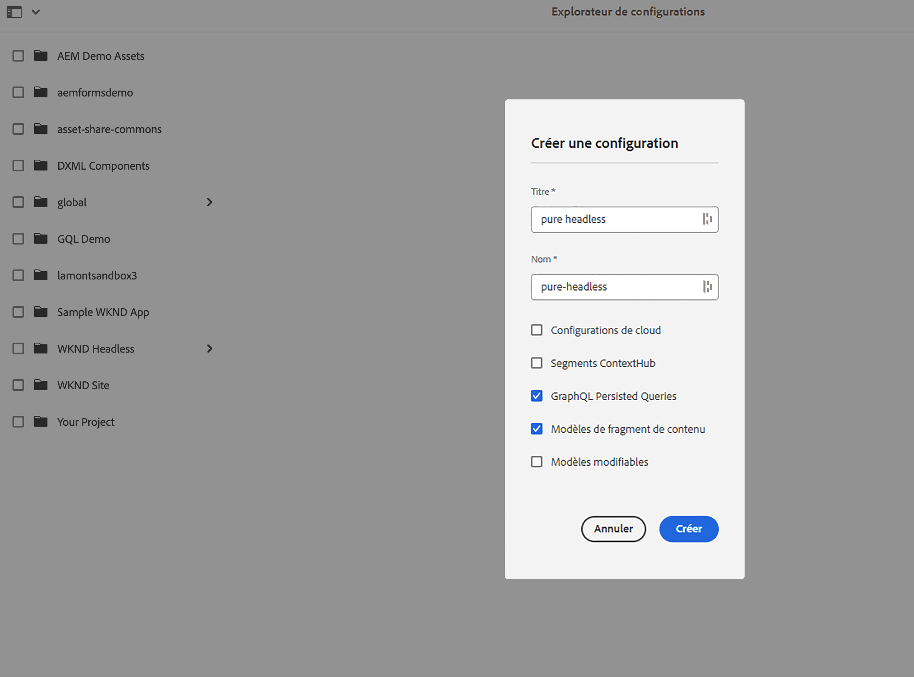
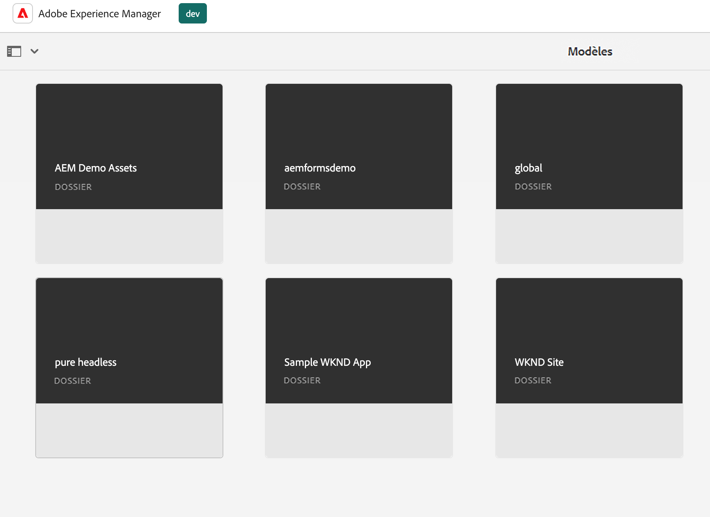
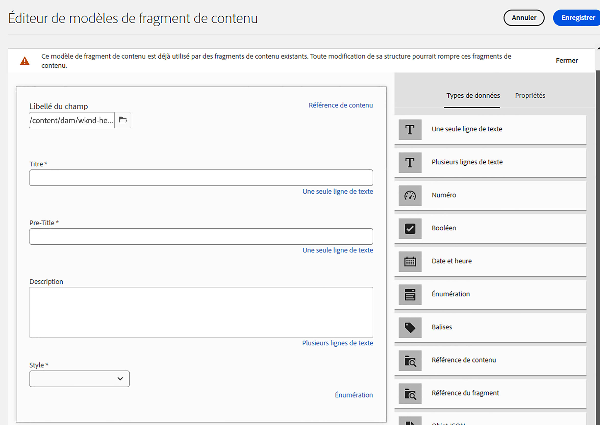
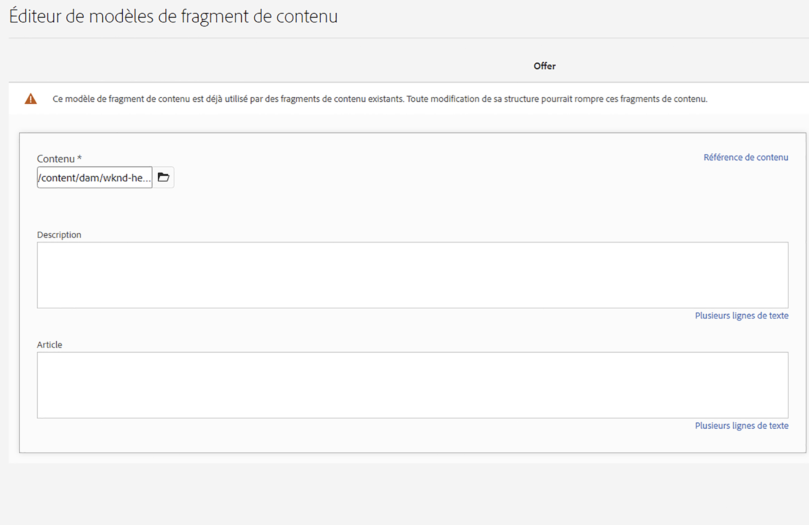
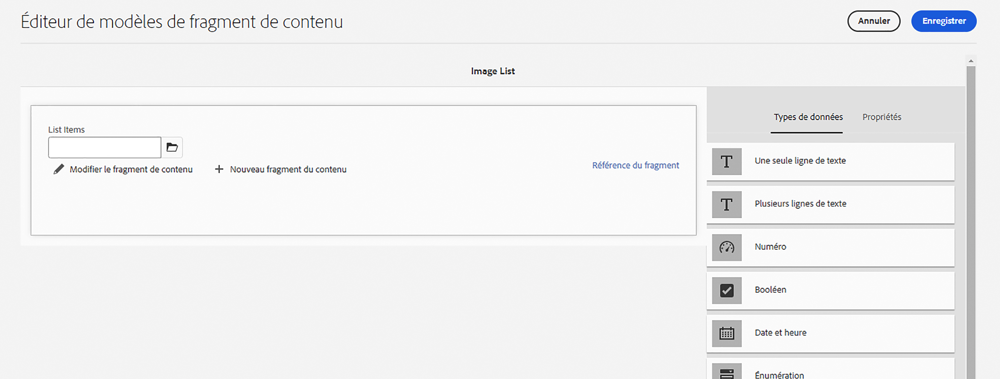
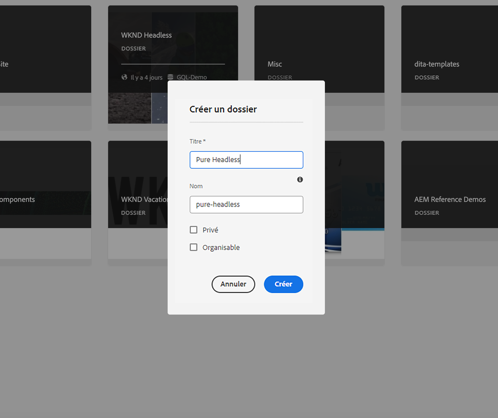
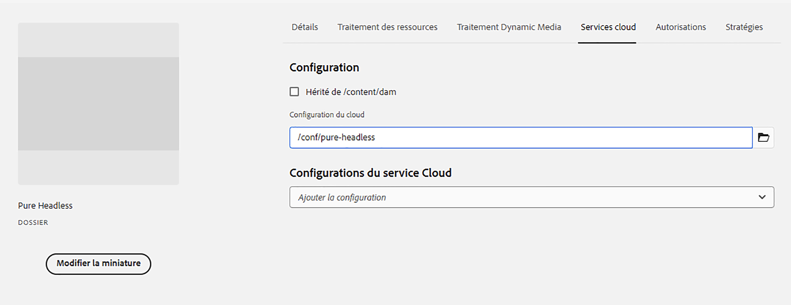
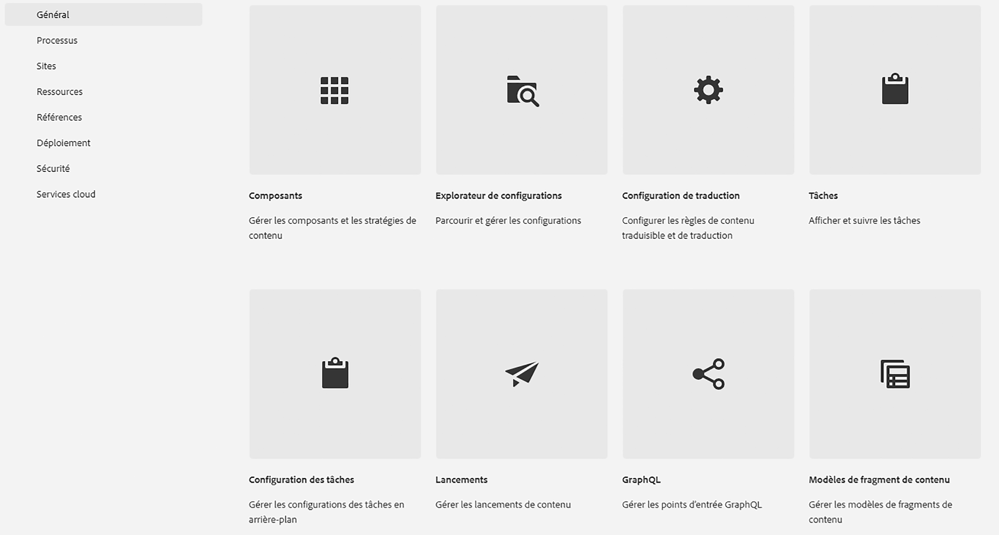
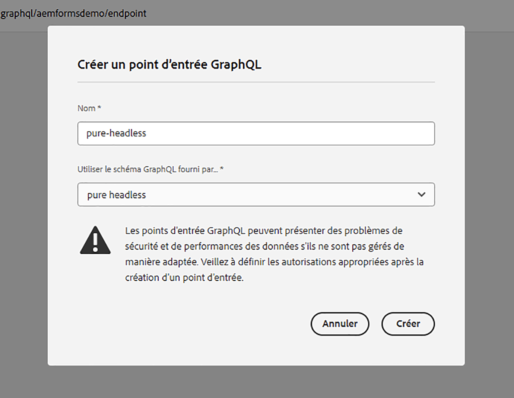

# Modélisation de contenu

Bienvenue dans le chapitre du tutoriel sur les fragments de contenu et les points de terminaison GraphQL dans Adobe Experience Manager (AEM). Nous aborderons l’utilisation de fragments de contenu, la création de modèles de fragment et l’utilisation de points de terminaison GraphQL dans AEM.

Les fragments de contenu offrent une approche structurée de la gestion du contenu sur tous les canaux, offrant ainsi flexibilité et réutilisation. L’activation des fragments de contenu dans AEM permet la création de contenu modulaire, ce qui améliore la cohérence et l’adaptabilité.

Tout d’abord, nous vous guiderons tout au long de l’activation des fragments de contenu dans AEM, en couvrant les configurations et paramètres nécessaires à une intégration transparente.

Nous allons ensuite aborder la création de modèles de fragment, qui définissent la structure et les attributs. Découvrez comment concevoir des modèles conformes à vos exigences en matière de contenu et les gérer efficacement.

Ensuite, nous allons démontrer la création de fragments de contenu à partir des modèles, en fournissant des conseils détaillés sur la création et la publication.

En outre, nous allons explorer la définition AEM points de terminaison GraphQL. GraphQL récupère efficacement les données d’AEM et nous allons configurer et configurer des points de terminaison pour exposer les données souhaitées. Les requêtes persistantes optimisent les performances et la mise en cache.

Tout au long du tutoriel, nous proposons des explications, des exemples de code et des conseils pratiques. D’ici la fin, vous disposerez des compétences nécessaires pour activer les fragments de contenu, créer des modèles de fragment, générer des fragments et définir des points de terminaison GraphQL AEM et des requêtes persistantes. Commençons !

## Configuration contextuelle

1. Accédez à __Outils > Explorateur de configurations__ pour créer une configuration pour l’expérience sans tête.

   

   Fournissez une __title__ et __name__ et cochez __Requêtes persistantes GraphQL__ et __Modèles de fragment de contenu__.


## Modèles de fragment de contenu

1. Accédez à __Outils > Modèles de fragment de contenu__ et sélectionnez le dossier avec le nom de la configuration créée à l&#39;étape 1.

   

1. Dans le dossier, sélectionnez __Créer__ et donnez au modèle le nom __Teaser__. Ajoutez les types de données suivants au __Teaser__ modèle.

   | Type de données | Nom | Requise | Options |
   |----------|------|----------|---------|
   | Référence de contenu | Asset | oui | Ajoutez une image par défaut si vous le souhaitez. Ex : /content/dam/wknd-headless/assets/AdobeStock_307513975.mp4 |
   | Une seule ligne de texte | Titre | oui |
   | Une seule ligne de texte | Pre-Title | non |
   | Plusieurs lignes de texte | Description | non | Assurez-vous que le type par défaut est de texte enrichi |
   | Énumération | Style | oui | Effectuez le rendu sous forme de liste déroulante. Les options sont Hero -> hero et Featured -> featored |

   

1. Dans le dossier, créez un deuxième modèle nommé __Offre__. Cliquez sur Créer et donnez au modèle le nom &quot;Offre&quot; et ajoutez les types de données suivants :

   | Type de données | Nom | Requise | Options |
   |----------|------|----------|---------|
   | Référence de contenu | Asset | oui | Ajoutez une image par défaut. Ex. : `/content/dam/wknd-headless/assets/AdobeStock_238607111.jpeg` |
   | Plusieurs lignes de texte | Description | non |  |
   | Plusieurs lignes de texte | Article | non |  |

   

1. Dans le dossier, créez un troisième modèle nommé __Liste des images__. Cliquez sur Créer et donnez au modèle le nom &quot;Liste des images&quot; et ajoutez les types de données suivants :

   | Type de données | Nom | Requise | Options |
   |----------|------|----------|---------|
   | Référence du fragment | Énumérer les éléments | oui | Rendu en tant que champ multiple. Le modèle de fragment de contenu autorisé est Offre. |

   

## Fragments de contenu

1. Accédez maintenant à Ressources et créez un dossier pour le nouveau site. Cliquez sur créer et nommez le dossier.

   

1. Une fois le dossier créé, sélectionnez-le et ouvrez-le. __Propriétés__.
1. Dans le dossier __Configurations du cloud__ , sélectionnez la configuration [créé précédemment](#enable-content-fragments-and-graphql).

   

   Cliquez dans le nouveau dossier et créez un teaser. Cliquez sur __Créer__ et __Fragment de contenu__ et sélectionnez la variable __Teaser__ modèle. Nommer le modèle __Hero__ et cliquez sur __Créer__.

   | Nom | Remarques |
   |----------|------|
   | Asset | Laissez comme valeur par défaut ou choisissez une autre ressource (vidéo ou image). |
   | Titre | `Explore. Discover. Live.` |
   | Pre-Title | `Join use for your next adventure.` |
   | Description | Laissez vide |
   | Style | `Hero` |

   

## Points d’entrée GraphQL

1. Accédez à __Outils > GraphQL__

   

1. Cliquez sur __Créer__ et donnez un nom au nouveau point de terminaison et choisissez la configuration nouvellement créée.

   

## Requêtes persistantes GraphQL

1. Testons le nouveau point de terminaison. Accédez à __Outils > GraphQL Query Editor__ et sélectionnez notre point de terminaison pour la liste déroulante en haut à droite de la fenêtre.

1. Dans l&#39;éditeur de requêtes, créez quelques requêtes différentes.


   ```graphql
   {
       teaserList {
           items {
           title
           }
       }
   }
   ```

   Vous devriez obtenir une liste contenant le fragment unique créé. [above](#create-content).

   Pour cet exercice, créez une requête complète que l’application AEM sans interface utilisateur. Créez une requête qui renvoie un seul teaser par chemin. Dans l&#39;éditeur de requêtes, saisissez la requête suivante :

   ```graphql
   query TeaserByPath($path: String!) {
   component: teaserByPath(_path: $path) {
       item {
       __typename
       _path
       _metadata {
           stringMetadata {
           name
           value
           }
       }
       title
       preTitle
       style
       asset {
           ... on MultimediaRef {
           __typename
           _authorUrl
           _publishUrl
           format
           }
           ... on ImageRef {
           __typename
           _authorUrl
           _publishUrl
           mimeType
           width
           height
           }
       }
       description {
           html
           plaintext
       }
       }
   }
   }
   ```

   Dans le __variables de requête__ en bas, saisissez :

   ```json
   {
       "path": "/content/dam/pure-headless/hero"
   }
   ```

   >[!NOTE]
   >
   > Vous devrez peut-être ajuster la variable de requête. `path` en fonction des noms des dossiers et des fragments.


   Exécutez la requête pour recevoir les résultats du fragment de contenu créé précédemment.

1. Cliquez sur __Enregistrer__  pour conserver (enregistrer) la requête et la nommer __teaser__. Cela nous permet de référencer la requête par nom dans l’application.

## Étapes suivantes

Félicitations. Vous avez correctement configuré AEM as a Cloud Service pour permettre la création de fragments de contenu et de points de terminaison GraphQL. Vous avez également créé un modèle de fragment de contenu et un fragment de contenu, défini un point de terminaison GraphQL et une requête persistante. Vous êtes maintenant prêt à passer au chapitre suivant du tutoriel, où vous apprendrez à créer une application React sans affichage AEM qui consomme les fragments de contenu et le point de terminaison GraphQL que vous avez créés dans ce chapitre.

[Chapitre suivant : AEM API sans affichage et React](./2-aem-headless-apis-and-react.md)