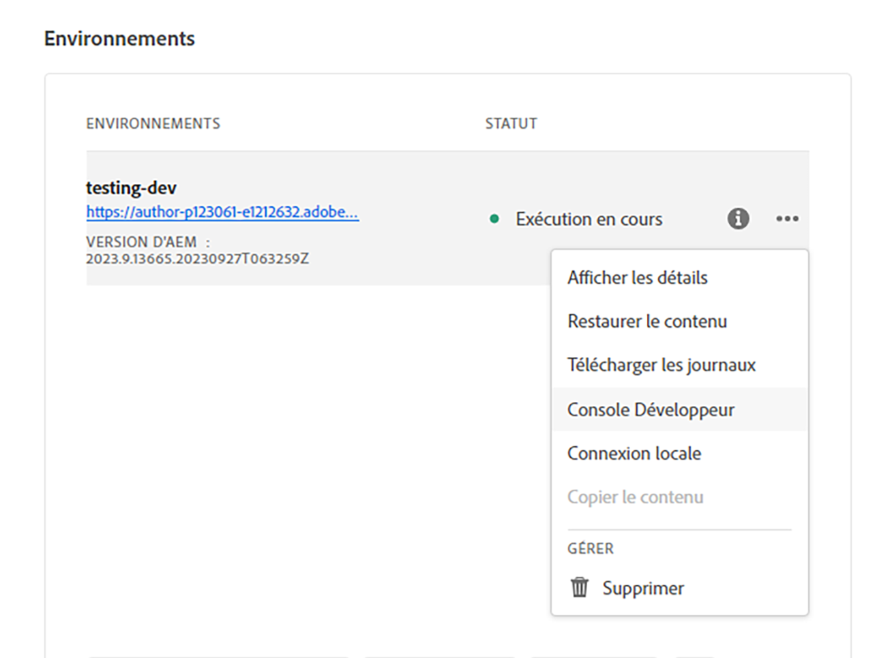

# AEM API sans affichage et React

Bienvenue dans ce chapitre de tutoriel où nous allons explorer la configuration d’une application React pour établir une connexion avec les API Adobe Experience Manager (AEM) sans affichage à l’aide du SDK AEM sans affichage. Nous allons passer en revue la récupération des données de fragments de contenu des API GraphQL d’AEM et leur affichage dans l’application React.

Les API AEM sans affichage permettent d’accéder au contenu AEM à partir de n’importe quelle application cliente. Nous vous guiderons tout au long de la configuration de votre application React pour vous connecter aux API AEM sans affichage à l’aide du SDK AEM sans affichage. Cette configuration établit un canal de communication réutilisable entre votre application React et AEM.

Ensuite, nous utiliserons le SDK AEM sans affichage pour récupérer les données de fragments de contenu des API GraphQL d’AEM. Les fragments de contenu dans AEM fournissent une gestion de contenu structurée. En utilisant le SDK AEM sans affichage, vous pouvez facilement interroger et récupérer des données de fragments de contenu à l’aide de GraphQL.

Une fois que nous aurons les données de fragment de contenu, nous les intégrerons à votre application React. Vous apprendrez à formater et afficher les données de manière attrayante. Nous aborderons les bonnes pratiques relatives à la gestion et au rendu des données de fragments de contenu dans les composants React, afin d’assurer une intégration transparente à l’interface utilisateur de votre application.

Tout au long du tutoriel, nous proposons des explications, des exemples de code et des conseils pratiques. D’ici la fin, vous pourrez configurer votre application React pour vous connecter aux API AEM sans affichage, récupérer les données de fragments de contenu à l’aide du SDK AEM sans affichage et les afficher facilement dans votre application React. Commençons !


## Clonage de l’application React

1. Cloner l’application depuis [Github](https://github.com/lamontacrook/headless-first/tree/main) en exécutant la commande suivante sur la ligne de commande.

   ```
   $ git clone git@github.com:lamontacrook/headless-first.git
   ```

1. Changez dans le `headless-first` et installez les dépendances.

   ```
   $ cd headless-first
   $ npm ci
   ```

## Configuration de l’application React

1. Créez un fichier nommé `.env` à la racine du projet. Dans `.env` définissez les valeurs suivantes :

   ```
   REACT_APP_AEM=<URL of the AEM instance>
   REACT_APP_ENDPOINT=<the name of the endpoint>
   REACT_APP_PROJECT=<the name of the folder with Content Fragments>
   REACT_APP_TOKEN=<developer token>
   ```

1. Vous pouvez récupérer un jeton de développeur dans Cloud Manager. Connectez-vous à [Adobe Cloud Manager](https://experience.adobe.com/). Cliquez sur __Experience Manager > Cloud Manager__. Sélectionnez le Programme approprié, puis cliquez sur les ellipses en regard de l’environnement.

   

   1. Cliquez sur dans le __Intégrations__ tab
   1. Cliquez sur __Onglet Jeton local et Obtenir un jeton de développement local__ button
   1. Copiez le jeton d’accès commençant après le guillemet ouvert jusqu’à ce qu’il soit avant le guillemet de fermeture.
   1. Collez le jeton copié comme valeur pour `REACT_APP_TOKEN` dans le `.env` fichier .
   1. Créons maintenant l’application en exécutant `npm ci` sur la ligne de commande.
   1. Maintenant, démarrez l’application React et en exécutant `npm run start` sur la ligne de commande.
   1. Dans [./src/utils](https://github.com/lamontacrook/headless-first/tree/main/src/utils) un fichier nommé `context.js`  inclut le code permettant de définir les valeurs dans la variable `.env` dans le contexte de l’application.

## Exécution de l’application React

1. Démarrez l’application React en exécutant `npm run start` sur la ligne de commande.

   ```
   $ npm run start
   ```

   L’application React démarre et ouvre une fenêtre de navigateur pour `http://localhost:3000`. Les modifications apportées à l’application React seront automatiquement rechargées dans le navigateur.

## Connexion aux API AEM sans affichage

1. Pour connecter l’application React à AEM as a Cloud Service, ajoutons quelques éléments à la variable `App.js`. Dans le `React` import, ajout `useContext`.

   ```javascript
   import React, {useContext} from 'react';
   ```

   Importer `AppContext` de la `context.js` fichier .

   ```javascript
   import { AppContext } from './utils/context';
   ```

   Désormais, dans le code de l’application, définissez une variable contextuelle.

   ```javascript
   const context = useContext(AppContext);
   ```

   Enfin, placez le code de retour dans `<AppContext.Provider> ... </AppContext.Provider>`.

   ```javascript
   ...
   return(<div className='App'>
       <AppContext.Provider value={context}>
           ...
       </AppContext.Provider>
   </div>);
   ```

   À titre de référence, le `App.js` devrait maintenant être comme ça.

   ```javascript
   import React, {useContext} from 'react';
   import './App.css';
   import { BrowserRouter, Routes, Route } from 'react-router-dom';
   import Home from './screens/home/home';
   import { AppContext } from './utils/context';
   
   const App = () => {
   const context = useContext(AppContext);
   return (
       <div className='App'>
       <AppContext.Provider value={context}>
           <BrowserRouter>
           <Routes>
               <Route exact={true} path={'/'} element={<Home />} />
           </Routes>
           </BrowserRouter>
       </AppContext.Provider>
       </div>
   );
   };
   
   export default App;
   ```

1. Importez la variable `AEMHeadless` SDK. Ce SDK est une bibliothèque d’assistance utilisée par l’application pour interagir avec AEM API sans affichage.

   Ajoutez cette instruction d’importation à la variable `home.js`.

   ```javascript
   import AEMHeadless from '@adobe/aem-headless-client-js';
   ```

   Ajoutez ce qui suit : `{ useContext, useEffect, useState }` au` React` instruction d’importation.

   ```javascript
   import React, { useContext, useEffect, useState } from 'react';
   ```

   Importez la variable `AppContext`.

   ```javascript
   import { AppContext } from '../../utils/context';
   ```

   Dans le `Home` , obtenez la variable `context` de la variable `AppContext`.

   ```javascript
   const Home = () => {
   const context = useContext(AppContext);
   ...
   }
   ```

1. Initialisation du SDK AEM sans affichage dans une  `useEffect()`, puisque le SDK AEM sans affichage doit changer lorsque la variable  `context` change.

   ```javascript
   useEffect(() => {
   const sdk = new AEMHeadless({
       serviceURL: context.url,
       endpoint: context.endpoint,
       auth: context.token
   });
   }, [context]);  
   ```

   >[!NOTE]
   >
   > Il existe une `context.js` fichier sous `/utils` qui lit des éléments de la fonction `.env` fichier . À titre de référence, le `context.url` est l’URL de l’environnement as a Cloud Service AEM. Le `context.endpoint` est le chemin d’accès complet au point de terminaison créé dans la leçon précédente. Enfin, la variable `context.token` est le jeton développeur.


1. Créez un état React qui expose le contenu provenant du SDK AEM sans affichage.

   ```javascript
   const Home = () => {
   const [content, setContent] = useState({});
   ...
   }
   ```

1. Connectez l’application à AEM. Utilisez la requête persistante créée dans la leçon précédente. Ajoutons le code suivant dans la fonction `useEffect` une fois le SDK AEM sans affichage initialisé. Faites en sorte que la variable `useEffect` dépend de la variable  `context` comme illustré ci-dessous.


   ```javascript
   useEffect(() => {
   ...
   sdk.runPersistedQuery('<name of the endpoint>/<name of the persisted query>', { path: `/content/dam/${context.project}/<name of the teaser fragment>` })
       .then(({ data }) => {
       if (data) {
           setContent(data);
       }
       })
       .catch((error) => {
       console.log(`Error with pure-headless/teaser. ${error.message}`);
       });
   }, [context]);
   ```

1. Ouvrez la vue Réseau des outils de développement pour examiner la requête GraphQL.

   `<url to environment>/graphql/execute.json/pure-headless/teaser%3Bpath%3D%2Fcontent%2Fdam%2Fpure-headless%2Fhero`

   

   Le SDK AEM sans affichage code la requête pour GraphQL et ajoute les paramètres fournis. Vous pouvez ouvrir la requête dans le navigateur.

   >[!NOTE]
   >
   > Puisque la demande est envoyée à l’environnement de création, vous devez être connecté à l’environnement dans un autre onglet du même navigateur.


## Rendu du contenu de fragment de contenu

1. Affichage des fragments de contenu dans l’application. Renvoie une `<div>` avec le titre du teaser.

   ```javascript
   return (
   <div className='main-body'>
       <div>{content.component && (content.component.item.title)}</div>
   </div>
   );
   ```

   Le champ titre du teaser doit s’afficher à l’écran.

1. La dernière étape consiste à ajouter le teaser à la page. Un composant de teaser React est inclus dans le module. Tout d’abord, incluons l’importation. En haut de la `home.js` ajoutez la ligne :

   `import Teaser from '../../components/teaser/teaser';`

   Mettez à jour l’instruction de retour :

   ```javascript
   return (
   <div className='main-body'>
       <div>{content.component && <Teaser content={content.component.item} />}</div>
   </div>
   );
   ```

   Vous devriez maintenant voir le teaser avec le contenu inclus dans le fragment.


## Étapes suivantes

Félicitations. Vous avez correctement mis à jour l’application React afin de l’intégrer aux API AEM sans affichage à l’aide du SDK AEM sans affichage !

Créez ensuite un composant de liste d’images plus complexe qui effectue dynamiquement le rendu des fragments de contenu référencés à partir d’AEM.

[Chapitre suivant : Création d’un composant Liste d’images](./3-complex-components.md)