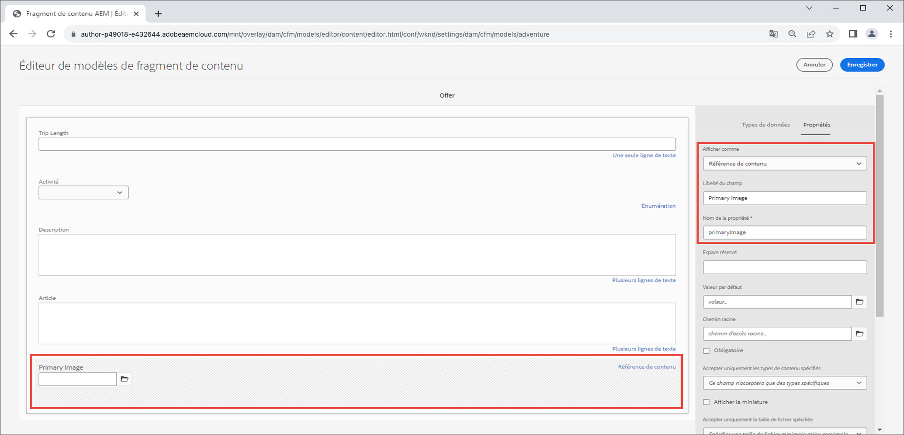

# Images optimisées avec AEM Headless {#images-with-aem-headless}

Les images sont un aspect essentiel permettant de [développer des expériences AEM Headless riches et attrayantes](https://experienceleague.adobe.com/docs/experience-manager-learn/getting-started-with-aem-headless/graphql/multi-step/overview.html?lang=fr). AEM Headless prend en charge la gestion des ressources d’image et leur diffusion optimisée.

Les fragments de contenu utilisés dans la modélisation de contenu d’AEM Headless font souvent référence à des ressources d’image destinées à être affichées dans l’expérience découplée. Les requêtes GraphQL d’AEM peuvent être écrites afin de fournir des URL aux images en fonction de l’emplacement de référence de l’image.

Le type `ImageRef` comporte quatre options d’URL pour les références de contenu :

+ `_path` est le chemin d’accès référencé dans AEM et n’inclut pas l’origine AEM (nom d’hôte).
+ `_dynamicUrl` est l’URL complète de la ressource d’image préférée et optimisée pour le web.
   + `_dynamicUrl` n’inclut pas d’origine d’AEM. Par conséquent, le domaine (instance de création AEM ou service de publication AEM) doit être fourni par l’application cliente.
+ `_authorUrl` est l’URL complète de la ressource d’image sur l’instance de création AEM
   + L’[instance de création AEM](https://experienceleague.adobe.com/docs/experience-manager-learn/cloud-service/underlying-technology/introduction-author-publish.html?lang=fr) peut être utilisée pour fournir un aperçu de l’application découplée.
+ `_publishUrl` est l’URL complète de la ressource d’image sur l’instance de publication AEM
   + L’[instance de publication AEM](https://experienceleague.adobe.com/docs/experience-manager-learn/cloud-service/underlying-technology/introduction-author-publish.html?lang=fr) est généralement l’emplacement depuis lequel le déploiement en production de l’application découplée affiche les images.

`_dynamicUrl` est l’URL préférée à utiliser pour les ressources d’image et doit remplacer l’utilisation de `_path`, `_authorUrl`, et `_publishUrl` dans la mesure du possible.

|                                | AEM as a Cloud Service | RDE d’AEM as a Cloud Service | SDK AEM | AEM 6.5 |
| ------------------------------ |:----------------------:|:--------------------------:|:-------:|:-------:|
| Prend-il en charge les images optimisées pour le web ? | ✔ | ✔ | ✘ | ✘ |


>[!CONTEXTUALHELP]
>id="aemcloud_learn_headless_graphql_images"
>title="Images avec AEM Headless"
>abstract="Découvrez comment AEM Headless prend en charge la gestion des ressources d’image et leur diffusion optimisée."

## Modèle de fragment de contenu

Assurez-vous que le champ Fragment de contenu contenant la référence d’image est du type de données __référence de contenu__.

Les types de champ sont examinés dans le [modèle de fragment de contenu](https://experienceleague.adobe.com/docs/experience-manager-cloud-service/content/assets/content-fragments/content-fragments-models.html?lang=fr), en sélectionnant le champ et en inspectant l’onglet __Propriétés__ à droite.



## Requête persistante GraphQL

Dans la requête GraphQL, renvoyez le champ en tant que type `ImageRef` et demandez le champ `_dynamicUrl`. Par exemple, vous pouvez interroger une Adventure dans le [projet WKND Site](https://github.com/adobe/aem-guides-wknd) et inclure l’URL de l’image pour les références de ressources d’image dans son champ `primaryImage` à l’aide une nouvelle requête persistante `wknd-shared/adventure-image-by-path` définie ainsi :

```graphql {highlight="11"}
query($path: String!, $imageFormat: AssetTransformFormat=JPG, $imageSeoName: String, $imageWidth: Int, $imageQuality: Int) {
  adventureByPath(
    _path: $path
    _assetTransform: {
      format: $imageFormat
      width: $imageWidth
      quality: $imageQuality
      preferWebp: true
    }
  ) {
    item {
      _path
      title
      primaryImage {
        ... on ImageRef {
          _dynamicUrl
        }
      }
    }
  }
}
```

### Variables de requête

```json
{ 
  "path": "/content/dam/wknd-shared/en/adventures/bali-surf-camp/bali-surf-camp",
  "imageFormat": "JPG",
  "imageWidth": 1000,
}
```

La variable `$path` utilisée dans le filtre `_path` nécessite le chemin d’accès complet au fragment de contenu (par exemple, `/content/dam/wknd-shared/en/adventures/bali-surf-camp/bali-surf-camp`).

`_assetTransform` définit la manière dont l’`_dynamicUrl` est construite pour optimiser le rendu d’image servi. Les URL des images optimisées pour le web peuvent également être ajustées sur le client ou la cliente en modifiant les paramètres de requête de l’URL.

| Paramètre GraphQL | Paramètre d’URL : | Description | Requis | Valeurs de variable GraphQL | Valeurs des paramètres d’URL | Exemple de paramètre d’URL |
|:---------|:----------|:-------------------------------|:--:|:--------------------------|:---|:--|
| `format` | S/O | Format de la ressource image. | ✔ | `GIF`, `PNG`, `PNG8`, `JPG`, `PJPG`, `BJPG`, `WEBP`, `WEBPLL`, `WEBPLY` | S/O | S/O |
| `seoName` | S/O | Nom du segment de fichier dans l’URL. Si aucun nom n’est fourni, le nom de la ressource image est utilisé. | ✘ | Alphanumérique, `-`, ou `_` | S/O | S/O |
| `crop` | `crop` | Image de recadrage extraite de l’image, doit être de la taille de l’image | ✘ | Entiers positifs définissant une zone de recadrage dans les limites des dimensions de l’image d’origine | Chaîne de coordonnées numériques délimitée par des virgules `<X_ORIGIN>,<Y_ORIGIN>,<CROP_WIDTH>,<CROP_HEIGHT>` | `?crop=10,20,300,400` |
| `size` | `size` | Taille de l’image de sortie (hauteur et largeur) en pixels. | ✘ | Entiers positifs | Entiers positifs délimités par des virgules dans l’ordre `<WIDTH>,<HEIGHT>` | `?size=1200,800` |
| `rotation` | `rotate` | Rotation de l’image en degrés. | ✘ | `R90`, `R180`, `R270` | `90`, `180`, `270` | `?rotate=90` |
| `flip` | `flip` | Retournement de l’image. | ✘ | `HORIZONTAL`, `VERTICAL`, `HORIZONTAL_AND_VERTICAL` | `h`, `v`, `hv` | `?flip=h` |
| `quality` | `quality` | Qualité de l’image en pourcentage de la qualité originale. | ✘ | 1-100 | 1-100 | `?quality=80` |
| `width` | `width` | Largeur de l’image de sortie en pixels. Lorsque `size` est fourni, `width` est ignoré. | ✘ | Entier positif | Entier positif | `?width=1600` |
| `preferWebP` | `preferwebp` | Si sa valeur est `true` et qu’AEM sert un WebP et si le navigateur le prend en charge, quel que soit le `format`. | ✘ | `true`, `false` | `true`, `false` | `?preferwebp=true` |

## Réponse GraphQL

La réponse JSON obtenue contient les champs demandés, avec l’URL optimisée pour le web des ressources d’image.

```json {highlight="8"}
{
  "data": {
    "adventureByPath": {
      "item": {
        "_path": "/content/dam/wknd-shared/en/adventures/bali-surf-camp/bali-surf-camp",
        "title": "Bali Surf Camp",
        "primaryImage": {
          "_dynamicUrl": "/adobe/dynamicmedia/deliver/dm-aid--a38886f7-4537-4791-aa20-3f6ef0ac3fcd/adobestock_175749320.jpg?preferwebp=true&width=1000&quality=80"
        }
      }
    }
  }
}
```

Pour charger l’image optimisée pour le web de l’image référencée dans votre application, utilisez l’`_dynamicUrl` de l’`primaryImage` comme URL source de l’image.

Dans React, l’affichage de l’image optimisée pour le web à partir de l’instance de publication AEM ressemble à ceci :

```jsx
const AEM_HOST = "https://publish-p123-e456.adobeaemcloud.com";
...
let dynamicUrl = AEM_HOST + data.adventureByPath.item.primaryImage._dynamicUrl;
...

```

Souvenez-vous, `_dynamicUrl` n’inclut pas le domaine AEM. Vous devez donc fournir l’origine souhaitée de l’URL de l’image à résoudre.

## URL réactives

L’exemple ci-dessus illustre l’utilisation d’une image à taille unique. Toutefois, dans les expériences web, des visionneuses d’images réactives sont souvent requises. Les images réactives peuvent être implémentées à l’aide de [img srcsets](https://css-tricks.com/a-guide-to-the-responsive-images-syntax-in-html/#using-srcset) ou d’[éléments d’image](https://css-tricks.com/a-guide-to-the-responsive-images-syntax-in-html/#using-srcset). L’extrait de code suivant montre comment utiliser l’`_dynamicUrl` en tant que base et en ajoutant différents paramètres de largeur pour alimenter différentes vues réactives. Non seulement le paramètre de requête `width` peut être utilisé, mais d’autres paramètres de requête peuvent être ajoutés par le client ou la cliente pour optimiser davantage la ressource image en fonction de ses besoins.

```javascript
const AEM_HOST = "https://publish-p123-e456.adobeaemcloud.com";
...
// Read the data from GraphQL response
let dynamicUrl = AEM_HOST + data.adventureByPath.item.primaryImage._dynamicUrl;
let alt = data.adventureByPath.item.title;
...
{/*-- Example img srcset --*/}
document.body.innerHTML=`
    alt="${alt}"
    src="${dynamicUrl}&width=1000}"
    srcset="`
      ${dynamicUrl}&width=1000 1000w,
      ${dynamicUrl}&width=1600 1600w,
      ${dynamicUrl}&width=2000 2000w,
      `"
    sizes="calc(100vw - 10rem)"/>`;
...
{/*-- Example picture --*/}
document.body.innerHTML=`<picture>
      <source srcset="${dynamicUrl}&width=2600" media="(min-width: 2001px)"/>
      <source srcset="${dynamicUrl}&width=2000" media="(min-width: 1000px)"/>
      
    </picture>`;
```

## Exemple pour React

Créons une application React simple qui affiche des images optimisées pour le web selon les [modèles d’images réactives](https://css-tricks.com/a-guide-to-the-responsive-images-syntax-in-html/). Il existe deux modèles principaux pour les images réactives :

+ [Élément image avec srcset](https://css-tricks.com/a-guide-to-the-responsive-images-syntax-in-html/#using-srcset) pour des performances accrues
+ [Élément image](https://css-tricks.com/a-guide-to-the-responsive-images-syntax-in-html/#using-picture) pour le contrôle de la conception

### Élément image avec srcset

>[!VIDEO](https://video.tv.adobe.com/v/3418556/?quality=12&learn=on)

Les [éléments image avec srcset](https://css-tricks.com/a-guide-to-the-responsive-images-syntax-in-html/#using-srcset) sont utilisés avec l’attribut `sizes` pour fournir différentes ressources d’image pour différentes tailles d’écran. Les Img srcsets sont utiles lorsque vous fournissez des ressources d’image différentes pour des tailles d’écran différentes.

### Élément d’image

Les [éléments d’image](https://css-tricks.com/a-guide-to-the-responsive-images-syntax-in-html/#using-picture) sont utilisés avec plusieurs éléments `source` afin de fournir différentes ressources d’image pour différentes tailles d’écran. Les éléments d’image sont utiles pour assurer des rendus d’image différents sur des formats d’écran différents.

>[!VIDEO](https://video.tv.adobe.com/v/3418555/?quality=12&learn=on)

### Exemple de code

Cette application React simple utilise le [SDK AEM Headless](./aem-headless-sdk.md) pour interroger les API AEM Headless afin d’obtenir un contenu Adventure, et affiche l’image optimisée pour le web à l’aide de [l’élément image avec srcset](#img-element-with-srcset) et de [l’élément d’image](#picture-element). Les éléments `srcset` et `sources` utilisent une fonction `setParams` personnalisée pour ajouter le paramètre de requête de diffusion optimisé pour le web à l’élément `_dynamicUrl` de l’image. Vous devez donc modifier le rendu d’image diffusé en fonction des besoins du client web.

La requête à AEM est effectuée dans le hook React personnalisé [useAdventureByPath qui utilise le SDK d’AEM Headless](./aem-headless-sdk.md#graphql-persisted-queries).

```javascript
// src/App.js

import "./App.css";
import { useAdventureByPath } from './api/persistedQueries'

const AEM_HOST = process.env.AEM_HOST;

function App() {

  /**
   * Update the dynamic URL with client-specific query parameters
   * @param {*} imageUrl the image URL
   * @param {*} params the AEM web-optimized image query parameters
   * @returns the dynamic URL with the query parameters
   */
  function setOptimizedImageUrlParams(imageUrl, params) {
    let url = new URL(imageUrl);
    Object.keys(params).forEach(key => {
      url.searchParams.set(key, params[key]);
    });
    return url.toString();
  }

  // Get data from AEM using GraphQL persisted query as defined above 
  // The details of defining a React useEffect hook are explored in How to > AEM Headless SDK
  // The 2nd parameter define the base GraphQL query parameters used to request the web-optimized image
  let { data, error } = useAdventureByPath(
        "/content/dam/wknd-shared/en/adventures/bali-surf-camp/bali-surf-camp", 
        { imageFormat: "JPG" }
      );

  // Wait for AEM Headless APIs to provide data
  if (!data) { return <></> }

  const alt = data.adventureByPath.item.title;
  const imageUrl =  AEM_HOST + data.adventureByPath.item.primaryImage._dynamicUrl;

  return (
    <div className="app">
      
      <h1>Web-optimized images</h1>

      {/* Render the web-optimized image img with srcset for the Adventure Primary Image */}
      <h2>Img srcset</h2>

      

       {/* Render the web-optimized picture for the Adventure Primary Image */}
        <h2>Picture element</h2>

        <picture>
          {/* When viewport width is greater than 2001px */}
          <source srcSet={setOptimizedImageUrlParams(imageUrl, { width : 2600 })} media="(min-width: 2001px)"/>        
          {/* When viewport width is between 1000px and 2000px */}
          <source srcSet={setOptimizedImageUrlParams(imageUrl, { width : 2000})} media="(min-width: 1000px)"/>
          {/* When viewport width is less than 799px */}
          
        </picture>
    </div>
  );
}

export default App;
```
