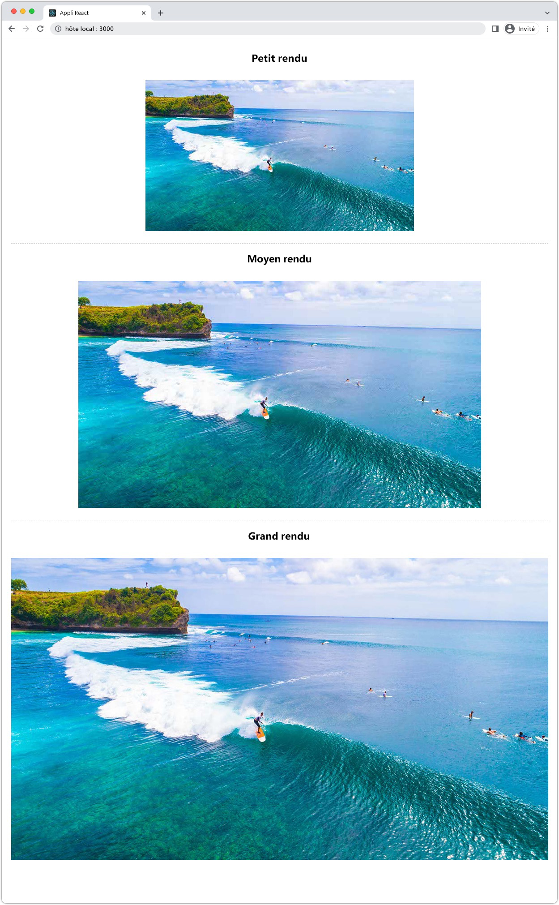

# Images sans AEM

Les images sont un aspect essentiel de [développer des expériences riches et attrayantes AEM sans tête](https://experienceleague.adobe.com/docs/experience-manager-learn/getting-started-with-aem-headless/graphql/multi-step/overview.html?lang=fr). AEM Headless prend en charge la gestion des ressources d’image et leur diffusion optimisée.

Les fragments de contenu utilisés dans AEM modélisation de contenu sans affichage font souvent référence à des ressources d’image destinées à être affichées dans l’expérience sans affichage. AEM requêtes GraphQL peuvent être écrites afin de fournir des URL aux images en fonction de l’emplacement de référence de l’image.

Le `ImageRef` type comporte trois options d’URL pour les références de contenu :

+ `_path` est le chemin référencé dans AEM et n’inclut pas d’AEM origine (nom d’hôte).
+ `_authorUrl` est l’URL complète de la ressource image sur l’auteur AEM.
   + [Auteur AEM](https://experienceleague.adobe.com/docs/experience-manager-learn/cloud-service/underlying-technology/introduction-author-publish.html) peut être utilisé pour fournir un aperçu de l’application sans interface utilisateur.
+ `_publishUrl` est l’URL complète de la ressource image sur AEM Publish
   + [Publication AEM](https://experienceleague.adobe.com/docs/experience-manager-learn/cloud-service/underlying-technology/introduction-author-publish.html) est généralement l’emplacement d’où le déploiement en production de l’application sans interface utilisateur graphique affiche les images.

Il est préférable d’utiliser les champs selon les critères suivants :

| Champs ImageRef | Application web cliente diffusée à partir d’AEM | L’application cliente interroge l’auteur AEM | L’application cliente interroge AEM Publish |
|--------------------|:------------------------------:|:-----------------------------:|:------------------------------:|
| `_path` | ✔ | ✘ | ✘ |
| `_authorUrl` | ✘ | ✔ | ✘ |
| `_publishUrl` | ✘ | ✘ | ✔ |

Utilisation de `_authorUrl` et `_publishUrl` doit s’aligner sur le point d’entrée GraphQL AEM utilisé pour générer la réponse GraphQL.

## Modèle de fragment de contenu 

Assurez-vous que le champ Fragment de contenu contenant la référence d’image est de la propriété __référence de contenu__ type de données.

Les types de champ sont examinés dans la section [Modèle de fragment de contenu](https://experienceleague.adobe.com/docs/experience-manager-cloud-service/content/assets/content-fragments/content-fragments-models.html), en sélectionnant le champ et en inspectant la variable __Propriétés__ à droite.


## Requête GraphQL

Dans la requête GraphQL, renvoie le champ en tant que `ImageRef` saisissez et demandez les champs appropriés. `_path`, `_authorUrl`ou `_publishUrl` requis par votre application.

```javascript
{
  adventureByPath(_path: "/content/dam/wknd/en/adventures/bali-surf-camp/bali-surf-camp") {
    item {
      adventurePrimaryImage {
        ... on ImageRef {
          _path,
          _authorUrl,
          _publishUrl
        }
      }
    }
  }  
}
```

## Réponse GraphQL

La réponse JSON obtenue contient les champs demandés contenant les URL des ressources d’image.

```json
{
  "data": {
    "adventureByPath": {
      "item": {
        "adventurePrimaryImage": {
          "_path": "/content/dam/wknd/en/adventures/bali-surf-camp/AdobeStock_175749320.jpg",
          "_authorUrl": "https://author-p123-e456.adobeaemcloud.com/content/dam/wknd/en/adventures/bali-surf-camp/AdobeStock_175749320.jpg",
          "_publishUrl": "https://publish-p123-e789.adobeaemcloud.com/content/dam/wknd/en/adventures/bali-surf-camp/AdobeStock_175749320.jpg"
        }
      }
    }
  }
}
```

Pour charger l’image référencée dans votre application, utilisez le champ approprié, `_path`, `_authorUrl`ou `_publishUrl` de `adventurePrimaryImage` comme URL source de l’image.

Les domaines de la variable `_authorUrl` et `_publishUrl` sont automatiquement définis par AEM as a Cloud Service à l’aide de la fonction [Externaliser](https://experienceleague.adobe.com/docs/experience-manager-cloud-service/content/implementing/developer-tools/externalizer.htmli).

Dans React, l’affichage de l’image à partir de la publication AEM ressemble à ceci :

```html

```

## Rendus d’image

Les ressources d’image prennent en charge la personnalisation. [rendus](../../../assets/authoring/renditions.md), qui sont des représentations alternatives de la ressource d’origine. Les rendus personnalisés peuvent faciliter l’optimisation d’une expérience sans tête. Au lieu de demander la ressource image d’origine, qui est souvent un fichier haute résolution volumineux, les rendus optimisés peuvent être demandés par l’application sans interface utilisateur.

### Création de rendus

Les administrateurs AEM Assets définissent les rendus personnalisés à l’aide des profils de traitement. Les profils de traitement peuvent ensuite être appliqués à des arborescences de dossiers ou à des ressources spécifiques afin de générer les rendus pour ces ressources.

#### Profils de traitement

Les spécifications des rendus de ressources sont définies dans [Profils de traitement](../../../assets/configuring//processing-profiles.md) par les administrateurs AEM Assets.

Créez ou mettez à jour un profil de traitement et ajoutez des définitions de rendu pour les tailles d’image requises par l’application sans en-tête. Les rendus peuvent être nommés de n’importe quel type, mais doivent l’être sémantiquement.


Dans cet exemple, trois rendus sont créés :

| Nom du rendu | Extension | Largeur maximale |
|----------------|:---------:|----------:|
| grand | jpeg | 1200px |
| moyenne | jpeg | 900px |
| petit | jpeg | 600px |

Les attributs décrits dans le tableau ci-dessus sont importants :

+ __Nom du rendu__ est utilisé pour demander le rendu.
+ __Extension__ est l’extension utilisée pour demander la variable __nom du rendu__.
+ __Largeur maximale__ sert à indiquer au développeur quel rendu doit être utilisé en fonction de son utilisation dans l’application sans interface utilisateur.

Les définitions de rendu dépendent des besoins de votre application sans interface utilisateur graphique. Veillez donc à définir le jeu de rendu optimal pour votre cas d’utilisation et nommez-les sémantiquement en fonction de leur utilisation.

#### Retraiter les ressources {#reprocess-assets}

Une fois le profil de traitement créé (ou mis à jour), retraitez les ressources pour générer les nouveaux rendus définis dans le profil de traitement. Si les ressources ne sont pas traitées avec les nouveaux rendus n’existent pas.

+ de préférence, [affectation du profil de traitement à un dossier](../../../assets/configuring//processing-profiles.md) ainsi, toutes les nouvelles ressources chargées dans ce dossier génèrent automatiquement les rendus. Les ressources existantes doivent être retraitées à l’aide de l’approche ad hoc ci-dessous.

+ Ou, ad hoc, en sélectionnant un dossier ou une ressource, en sélectionnant __Retraiter les ressources__, puis en sélectionnant le nouveau nom de profil de traitement.

   

#### Vérification des rendus

Les rendus peuvent être validés par [ouverture de l’affichage des rendus d’une ressource](../../../assets/authoring/renditions.md), puis en sélectionnant les nouveaux rendus à prévisualiser dans le rail de rendus. Si les rendus sont manquants, [s’assurer que les ressources sont traitées à l’aide du profil de traitement.](#reprocess-assets).


#### Publier des ressources

Assurez-vous que les ressources comportant les nouveaux rendus sont [(re) publié](../../../assets/sharing/publish.md) de sorte que les nouveaux rendus soient accessibles sur AEM Publish.

### Accès aux rendus

Vous pouvez accéder directement aux rendus en ajoutant le __noms de rendu__ et __extensions de rendu__ défini dans le profil de traitement sur l’URL de la ressource.

| URL d’élément | Sous-chemin d’accès aux rendus | Nom du rendu | Extension de rendu |  | URL de rendu |
|-----------|:------------------:|:--------------:|--------------------:|:--:|---|
| https://publish-p123-e789.adobeaemcloud.com/content/dam/example.jpg | /_jcr_content/renditions/ | grand | .jpeg | → | https://publish-p123-e789.adobeaemcloud.com/content/dam/example.jpg/_jcr_content/renditions/large.jpeg |
| https://publish-p123-e789.adobeaemcloud.com/content/dam/example.jpg | /_jcr_content/renditions/ | moyenne | .jpeg | → | https://publish-p123-e789.adobeaemcloud.com/content/dam/example.jpg/_jcr_content/renditions/medium.jpeg |
| https://publish-p123-e789.adobeaemcloud.com/content/dam/example.jpg | /_jcr_content/renditions/ | petit | .jpeg | → | https://publish-p123-e789.adobeaemcloud.com/content/dam/example.jpg/_jcr_content/renditions/small.jpeg |

{style=&quot;table-layout:auto&quot;}

### Requête GraphQL{#renditions-graphl-query}

AEM GraphQL nécessite une syntaxe supplémentaire pour demander des rendus d’image. Au lieu de [les images sont interrogées](#images-graphql-query) de la manière habituelle, et le rendu souhaité est spécifié dans le code. Il est important de [s’assurer que les ressources d’image utilisées par l’application sans interface utilisateur graphique possèdent les mêmes rendus nommés.](#reprocess-assets).

### Exemple React

Créons une application React simple qui affiche trois rendus, petits, moyens et grands, d’une seule ressource d’image.



#### Créer un composant Image{#react-example-image-component}

Créez un composant React qui effectue le rendu des images. Ce composant accepte quatre propriétés :

+ `assetUrl`: URL de la ressource image fournie par le biais de la réponse de la requête GraphQL.
+ `renditionName`: Nom du rendu à charger.
+ `renditionExtension`: Extension du rendu à charger.
+ `alt`: Texte secondaire de l’image ; l’accessibilité est importante !

Ce composant construit la variable [URL du rendu selon le format indiqué dans __Accès aux rendus__](#access-renditions). Un `onError` Le gestionnaire est défini pour afficher la ressource d’origine dans le cas où le rendu est manquant.

Cet exemple utilise l’URL de la ressource d’origine comme solution de secours dans la variable `onError` gestionnaire, dans l’événement , un rendu est manquant.

```javascript
// src/Image.js

export default function Image({ assetUrl, renditionName, renditionExtension, alt }) {
  // Construct the rendition Url in the format:
  //   <ASSET URL>/_jcr_content/renditions<RENDITION NAME>.<RENDITION EXTENSION>
  const renditionUrl = `${assetUrl}/_jcr_content/renditions/${renditionName}.${renditionExtension}`;

  // Load the original image asset in the event the named rendition is missing
  const handleOnError = (e) => { e.target.src = assetUrl; }

  return (
    <>
      
    </>
  );
}
```

#### Définissez la variable `App.js`{#app-js}

Ce simple `App.js` interroge AEM une image Adventure, puis affiche les trois rendus de cette image : petit, moyen et grand.

La requête contre AEM est effectuée dans le crochet React personnalisé. [useGraphQL qui utilise le SDK AEM sans affichage](./aem-headless-sdk.md#graphql-queries).

Les résultats de la requête et les paramètres de rendu spécifiques sont transmis au [Composant Image React](#react-example-image-component).

```javascript
// src/App.js

import "./App.css";
import { useGraphQL } from "./useGraphQL";
import Image from "./Image";

function App() {

  // The GraphQL that returns an image
  const adventureQuery = `{
        adventureByPath(_path: "/content/dam/wknd/en/adventures/bali-surf-camp/bali-surf-camp") {
          item {
            adventureTitle,
            adventurePrimaryImage {
              ... on ImageRef {
                _path,
                _authorUrl,
                _publishUrl
              }
            }
          }
        }  
    }`;

  // Get data from AEM using GraphQL
  let { data } = useGraphQL(adventureQuery);

  // Wait for GraphQL to provide data
  if (!data) { return <></> }

  return (
    <div className="app">
      
      <h2>Small rendition</h2>
      {/* Render the small rendition for the Adventure Primary Image */}
      <Image
        assetUrl={data.adventureByPath.item.adventurePrimaryImage._publishUrl}
        renditionName="small"
        renditionExtension="jpeg"
        alt={data.adventureByPath.item.adventureTitle}
      />

      <hr />

      <h2>Medium rendition</h2>
      {/* Render the medium rendition for the Adventure Primary Image */}
      <Image
        assetUrl={data.adventureByPath.item.adventurePrimaryImage._publishUrl}
        renditionName="medium"
        renditionExtension="jpeg"
        alt={data.adventureByPath.item.adventureTitle}
      />

      <hr />

      <h2>Large rendition</h2>
      {/* Render the large rendition for the Adventure Primary Image */}
      <Image
        assetUrl={data.adventureByPath.item.adventurePrimaryImage._publishUrl}
        renditionName="large"
        renditionExtension="jpeg"
        alt={data.adventureByPath.item.adventureTitle}
      />
    </div>
  );
}

export default App;
```
