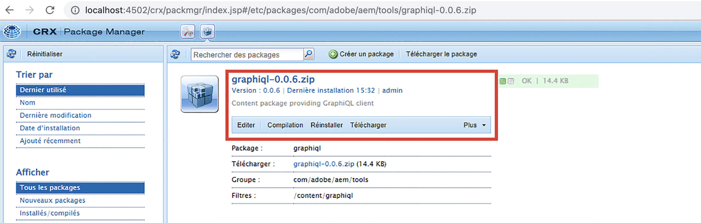
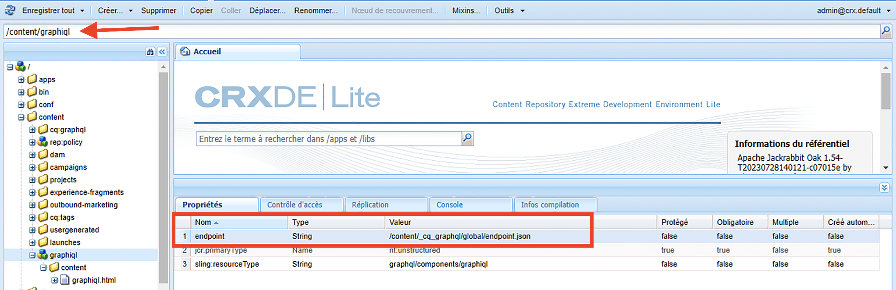

# Installer IDE GraphiQL sur AEM 6.5

Dans AEM 6.5, l’outil IDE GraphiQL doit être installé manuellement.

1. Accédez au **[Portail de distribution de logiciels](https://experience.adobe.com/#/downloads/content/software-distribution/en/aemcloud.html?lang=fr)** > **AEM as a Cloud Service**.
1. Recherchez « GraphiQL » (veillez à inclure le **i** dans **GraphiQL**).
1. Télécharger la dernière version du **Package de contenu GraphiQL v.x.x.x**.

   

   Le fichier zip est un package AEM qui peut être installé directement.

1. Dans le menu Accueil AEM, accédez à **Outils** > **Déploiement** > **Packages**
1. Cliquez sur **Télécharger le package** et sélectionnez le package téléchargé à l’étape précédente. Cliquez sur **Installer** pour installer le package.

   

1. Accédez à **CRXDE Lite** > **Panneau Référentiel** > sélectionnez le nœud `/content/graphiql` (par exemple, <http://localhost:4502/crx/de/index.jsp#/content/graphiql>).
1. Sous l’onglet **Propriétés**, modifiez la valeur de la propriété `endpoint` sur `/content/_cq_graphql/wknd-shared/endpoint.json`.
   

1. Accédez à l’interface utilisateur de la **Configuration de la console web** et recherchez la configuration du **Filtre CSRF** (par exemple, <http://localhost:4502/system/console/configMgr/com.adobe.granite.csrf.impl.CSRFFilter)>
1. Dans le champ du nom de la propriété `Excluded Paths`, ajoutez le chemin du point d’entrée GraphQL WKND suivant : `/content/cq:graphql/wknd-shared/endpoint`.

1. Accédez à l’éditeur GraphiQL via l’adresse `//HOST:PORT/content/graphiql.html` et vérifiez que vous pouvez créer une requête ou exécuter une requête existante. (par exemple, <http://localhost:4502/content/graphiql.html>).

>[!TIP]
>
>Pour prendre en charge l’exécution des requêtes et du schéma GraphQL spécifiques à votre projet, vous devez apporter les modifications correspondantes au `endpoint` et `Excluded Paths` dans les étapes ci-dessus.
