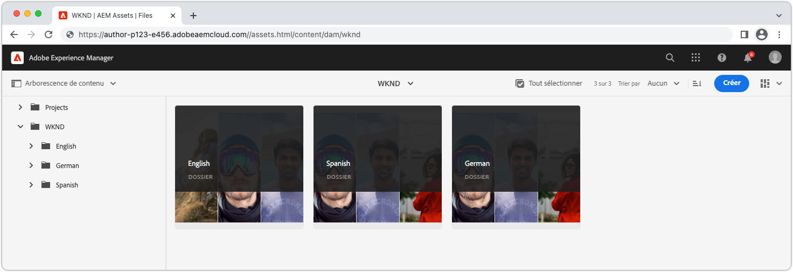

# Contenu localisé avec AEM sans affichage

AEM fournit une [Structure d’intégration de traduction](https://experienceleague.adobe.com/docs/experience-manager-cloud-service/content/sites/administering/reusing-content/translation/integration-framework.html) pour le contenu sans interface utilisateur, ce qui permet aux fragments de contenu et aux ressources de prise en charge d’être facilement traduits pour une utilisation dans tous les paramètres régionaux. Il s’agit de la même structure que celle utilisée pour traduire d’autres contenus AEM, tels que Pages, Fragments d’expérience, Ressources et Forms. Une fois [la traduction du contenu sans tête](https://experienceleague.adobe.com/docs/experience-manager-cloud-service/content/headless/journeys/translation/overview.html?lang=fr), puis publié, il est prêt à être utilisé par les applications sans interface utilisateur graphique.

## Structure des dossiers de ressources{#assets-folder-structure}

Assurez-vous que les fragments de contenu localisés dans AEM suivent le [structure de localisation recommandée](https://experienceleague.adobe.com/docs/experience-manager-cloud-service/content/headless/journeys/translation/getting-started.html#recommended-structure).



Les dossiers de paramètres régionaux doivent être des frères, et le nom du dossier, plutôt que le titre, doit être valide. [Code ISO 639-1](https://en.wikipedia.org/wiki/List_of_ISO_639-1_codes) représentant les paramètres régionaux du contenu contenu contenu dans le dossier.

Le code de paramètres régionaux est également la valeur utilisée pour filtrer les fragments de contenu renvoyés par la requête GraphQL.

| Code de paramètre régional | Chemin AEM | Paramètres régionaux du contenu |
|--------------------------------|----------|----------|
| de | /content/dam/.../**de**/... | Contenu allemand |
| en | /content/dam/.../**en**/... | Contenu en anglais |
| es | /content/dam/.../**es**/... | Contenu espagnol |

## Requête persistante GraphQL

AEM fournit une `_locale` Filtre GraphQL qui filtre automatiquement le contenu par code de paramètres régionaux . Par exemple, en interrogeant toutes les aventures anglaises dans la [Projet de site WKND](https://github.com/adobe/aem-guides-wknd) peut être effectué avec une nouvelle requête conservée. `wknd-shared/adventures-by-locale` défini comme :

```graphql
query($locale: String!) {
  adventureList(_locale: $locale) {
    items {      
      _path
      title
    }
  }
}
```

Le `$locale` utilisée dans la variable `_locale` filtre nécessite le code de paramètres régionaux (par exemple `en`, `en_us`ou `de`), comme indiqué dans [AEM convention de localisation de base de dossiers de ressources](#assets-folder-structure).

## Exemple React

Créons une application React simple qui contrôle le contenu Adventure à interroger à partir d’AEM en fonction d’un sélecteur de paramètres régionaux à l’aide de la fonction `_locale` filtre.

When __Anglais__ est sélectionné dans le sélecteur de paramètres régionaux, puis dans les fragments de contenu English Adventure sous `/content/dam/wknd/en` sont renvoyés, lorsque __Espagnol__ est sélectionné, puis Fragments de contenu en espagnol sous `/content/dam/wknd/es`, etc.


### Créez un `LocaleContext`{#locale-context}

Tout d’abord, créez un [Contexte React](https://reactjs.org/docs/context.html) pour permettre l’utilisation des paramètres régionaux dans les composants de l’application React.

```javascript
// src/LocaleContext.js

import React from 'react'

const DEFAULT_LOCALE = 'en';

const LocaleContext = React.createContext({
    locale: DEFAULT_LOCALE, 
    setLocale: () => {}
});

export default LocaleContext;
```

### Créez un `LocaleSwitcher` Composant React{#locale-switcher}

Ensuite, créez un composant React du sélecteur de paramètres régionaux qui définit comme [LocaleContext](#locale-context) de la sélection de l’utilisateur.

Cette valeur locale est utilisée pour piloter les requêtes GraphQL, en s’assurant qu’elles renvoient uniquement le contenu correspondant au paramètre régional sélectionné.

```javascript
// src/LocaleSwitcher.js

import { useContext } from "react";
import LocaleContext from "./LocaleContext";

export default function LocaleSwitcher() {
  const { locale, setLocale } = useContext(LocaleContext);

  return (
    <select value={locale}
            onChange={e => setLocale(e.target.value)}>
      <option value="de">Deutsch</option>
      <option value="en">English</option>
      <option value="es">Español</option>
    </select>
  );
}
```

### Interrogez le contenu à l’aide de la méthode `_locale` filter{#adventures}

Le composant Aventures interroge AEM toutes les aventures par langue et répertorie leurs titres. Pour ce faire, transmettez la valeur du paramètre régional stockée dans le contexte React à la requête à l’aide de la variable `_locale` filtre.

Cette approche peut être étendue à d’autres requêtes de votre application, en s’assurant que toutes les requêtes incluent uniquement le contenu spécifié par la sélection des paramètres régionaux d’un utilisateur.

L’interrogation de l’AEM est effectuée dans le crochet React personnalisé. [getAdventuresByLocale, décrit plus en détail dans la documentation Query AEM GraphQL](./aem-headless-sdk.md).

```javascript
// src/Adventures.js

import { useContext } from "react"
import { useAdventuresByLocale } from './api/persistedQueries'
import LocaleContext from './LocaleContext'

export default function Adventures() {
    const { locale } = useContext(LocaleContext);

    // Get data from AEM using GraphQL persisted query as defined above 
    // The details of defining a React useEffect hook are explored in How to > AEM Headless SDK
    let { data, error } = useAdventuresByLocale(locale);

    return (
        <ul>
            {data?.adventureList?.items?.map((adventure, index) => { 
                return <li key={index}>{adventure.title}</li>
            })}
        </ul>
    )
}
```

### Définissez la variable `App.js`{#app-js}

Enfin, liez l’ensemble en encapsulant l’application React avec l’objet `LanguageContext.Provider` et de définir la valeur du paramètre régional. Cela permet aux autres composants React, [LocaleSwitcher](#locale-switcher), et [Aventures](#adventures) pour partager l’état de sélection des paramètres régionaux.

```javascript
// src/App.js

import { useState, useContext } from "react";
import LocaleContext from "./LocaleContext";
import LocaleSwitcher from "./LocaleSwitcher";
import Adventures from "./Adventures";

export default function App() {
  const [locale, setLocale] = useState(useContext(LocaleContext).locale);

  return (
    <LocaleContext.Provider value={{locale, setLocale}}>
      <LocaleSwitcher />
      <Adventures />
    </LocaleContext.Provider>
  );
}
```
