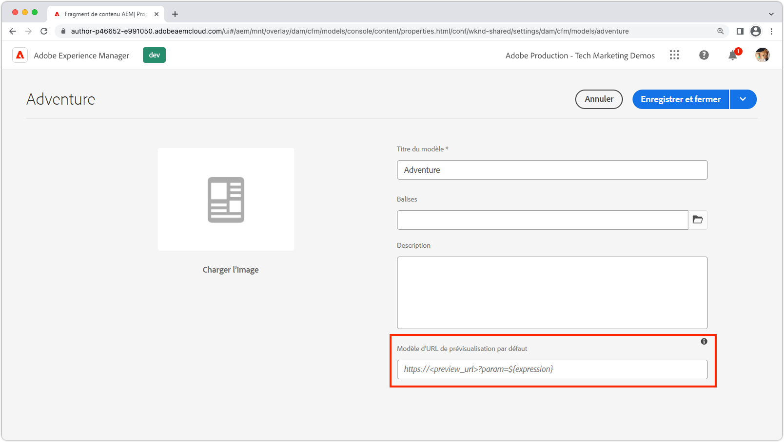
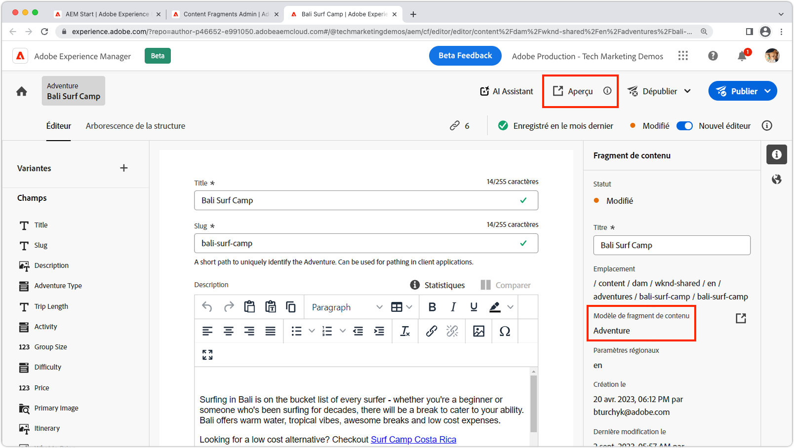

# Prévisualiser le fragment de contenu

Les applications AEM Headless prennent en charge la prévisualisation de création intégrée. L’expérience de prévisualisation relie l’éditeur de fragment de contenu de l’instance de création d’AEM à votre application personnalisée (adressable via HTTP), ce qui permet d’insérer un lien profond dans l’application qui effectue le rendu du fragment de contenu en cours de prévisualisation.

>[!VIDEO](https://video.tv.adobe.com/v/3416906?quality=12&learn=on)

Pour utiliser la prévisualisation du fragment de contenu, plusieurs conditions doivent être remplies :

1. L’application doit être déployée vers une URL accessible aux auteurs et autrices.
1. L’application doit être configurée pour se connecter au service de création AEM (plutôt qu’au service de publication AEM).
1. L’application doit être conçue avec des URL ou des itinéraires pouvant utiliser [un chemin ou un identifiant du fragment de contenu](#url-expressions) pour sélectionner les fragments de contenu à afficher en vue d’une prévisualisation dans l’expérience de l’application.

## URL de prévisualisation

Les URL de prévisualisation, à l’aide des [expressions d’URL](#url-expressions), sont définies sur les propriétés du modèle de fragment de contenu.



1. Connectez-vous au service de création AEM en tant qu’administrateur ou administratrice.
1. Accédez à __Outils > Général > Modèles de fragment de contenu__.
1. Sélectionnez le __modèle de fragment de contenu__ et sélectionnez __Propriétés__ dans la barre d’action supérieure.
1. Saisissez l’URL de prévisualisation du modèle de fragment de contenu à l’aide des [expressions d’URL](#url-expressions).
   + L’URL de prévisualisation doit pointer vers un déploiement de l’application qui se connecte au service de création AEM.

### Expressions d’URL

Une URL de prévisualisation peut être définie pour chaque modèle de fragment de contenu. L’URL de prévisualisation peut être paramétrée par fragment de contenu à l’aide des expressions d’URL répertoriées dans le tableau ci-dessous. Plusieurs expressions d’URL peuvent être utilisées dans une seule URL de prévisualisation.

|                                         | Expression d’URL | Valeur |
| --------------------------------------- | ----------------------------------- | ----------- |
| Chemin du fragment de contenu | `${contentFragment.path}` | `/content/dam/wknd-shared/en/adventures/surf-camp-bali/surf-camp-bali` |
| Identifiant du fragment de contenu | `${contentFragment.id}` | `12c34567-8901-2aa3-45b6-d7890aa1c23c` |
| Variation de fragment de contenu | `${contentFragment.variation}` | `main` |
| Chemin de modèle de fragment de contenu | `${contentFragment.model.path}` | `/conf/wknd-shared/settings/dam/cfm/models/adventure` |
| Nom de modèle de fragment de contenu | `${contentFragment.model.name}` | `adventure` |

Exemples d’URL de prévisualisation :

+ Une URL de prévisualisation sur le modèle __Adventure__ pourrait ressembler à `https://preview.app.wknd.site/adventure${contentFragment.path}` qui se résout en `https://preview.app.wknd.site/adventure/content/dam/wknd-shared/en/adventures/surf-camp-bali/surf-camp-bali`.
+ Une URL de prévisualisation sur le modèle __Article__ pourrait ressembler à `https://preview.news.wknd.site/${contentFragment.model.name}/${contentFragment.id}.html?variation=${contentFragment.variation}` qui se résout en `https://preview.news.wknd.site/article/99c34317-1901-2ab3-35b6-d7890aa1c23c.html?variation=main`.

## Prévisualisation in-app

Tout fragment de contenu utilisant le modèle de fragment de contenu configuré comporte un bouton Prévisualisation. Le bouton Prévisualisation ouvre l’URL de prévisualisation du modèle de fragment de contenu et injecte les valeurs du fragment de contenu ouvert dans les [expressions d’URL](#url-expressions).



Effectuez une actualisation stricte (qui efface le cache local du navigateur) lors de la prévisualisation des modifications du fragment de contenu dans l’application.

## Exemple pour React

Explorons l’application WKND, une application React simple qui présente les aventures d’AEM en utilisant des API GraphQL AEM Headless.

L’exemple de code est disponible sur [Github.com](https://github.com/adobe/aem-guides-wknd-graphql/tree/main/preview-tutorial).

## URL et itinéraires

Les URL ou les itinéraires utilisés pour prévisualiser un fragment de contenu doivent pouvoir être composables à l’aide des [expressions d’URL](#url-expressions). Dans cette version avec prévisualisation de l’application WKND, les fragments de contenu d’aventure s’affichent via le composant `AdventureDetail` lié à l’itinéraire `/adventure<CONTENT FRAGMENT PATH>`. Par conséquent, l’URL de prévisualisation du modèle WKND Adventure doit être définie sur `https://preview.app.wknd.site:3000/adventure${contentFragment.path}` pour résoudre cet itinéraire.

La prévisualisation de fragment de contenu ne fonctionne que si l’application dispose d’un itinéraire adressable pouvant être renseigné par des [expressions d’URL](#url-expressions) qui effectuent le rendu de ce fragment de contenu dans l’application d’une manière prévisualisable.

+ `src/App.js`

```javascript
...
function App() {
  return (
    <Router>
      <div className="App">
        <header>
            <Link to={"/"}>
                
            </Link>        
            <hr />
        </header>
        <Routes>
          {/* The route's path must match the Adventure Model's Preview URL expression. In React since the path has `/` you must use wildcards to match instead of the usual `:path` */}
          <Route path='/adventure/*' element={<AdventureDetail />}/>
          <Route path="/" element={<Home />}/>
        </Routes>
      </div>
    </Router>
  );
}

export default App;
```

### Afficher le contenu créé

Le composant `AdventureDetail` analyse simplement le chemin d’accès au fragment de contenu, injecté dans l’URL de prévisualisation via l’[expression d’URL](#url-expressions) `${contentFragment.path}`, à partir de l’URL de l’itinéraire, et l’utilise pour collecter et effectuer le rendu de WKND Adventure.

+ `src/components/AdventureDetail.js`

```javascript
...
function AdventureDetail() {

    // Read the `path` value which is the parameter used to query for the adventure's details
    // since the params value captures the `*` wildcard in `/adventure/*`, or everything after the first `/` in the Content Fragment path.
    const params = useParams();
    const pathParam = params["*"];

    // Add the leading '/' back on 
    const path = '/' + pathParam;
    
    // Query AEM for the Adventures's details, using the Content Fragment's `path`
    const { adventure, references, error } = useAdventureByPath(path);

    // Handle error and loading conditions
    if (error) {
        return <Error errorMessage={error} />;
    } else if (!adventure) {
        return <Loading />;
    }

    return (<div className="adventure-detail">
        ...
        <AdventureDetailRender {...adventure} references={references} />
    </div>);
}
...
```
