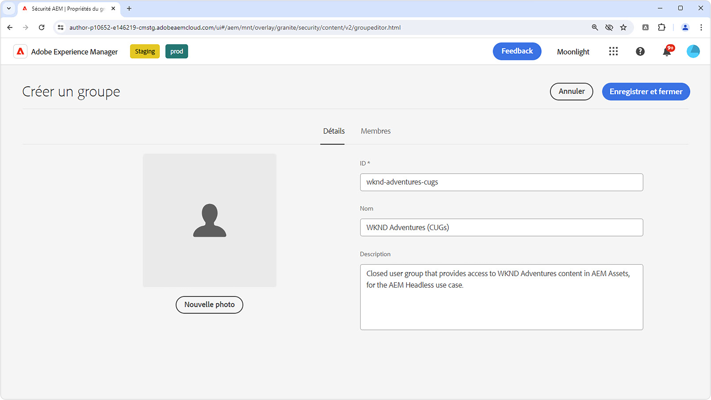

# Protéger le contenu dans AEM Headless

Il est essentiel d’assurer l’intégrité et la sécurité de vos données lors de la diffusion de contenu AEM Headless à partir de l’instance de publication AEM lors de la diffusion de contenu sensible. Cette procédure explique comment sécuriser le contenu fourni par les points d’entrée de l’API GraphQL AEM Headless.

Les conseils de ce tutoriel portent sur les exigences strictes que le contenu doit être accessible exclusivement à des utilisateurs ou à des groupes d’utilisateurs spécifiques. Il est impératif de faire la distinction entre le contenu marketing personnalisé et le contenu privé, tel que les informations d’identification personnelle ou les données financières personnelles, afin d’éviter toute confusion et résultats inattendus. Ce tutoriel porte sur la protection du contenu privé.

Lors de la discussion de contenu marketing, nous faisons référence à un contenu adapté à des utilisateurs ou à des groupes individuels, qui n’est pas destiné à une consommation générale. Cependant, il est essentiel de comprendre que, bien que ce contenu puisse être ciblé pour certains utilisateurs, son exposition en dehors du contexte prévu (par exemple, par la manipulation de requêtes HTTP) ne pose pas de risque sur la sécurité, la légalité ou la réputation.

Il est souligné que tout le contenu traité dans cet article est supposé être privé et ne peut être visualisé que par des utilisateurs ou des groupes désignés. Le contenu marketing ne nécessite souvent pas de protection, mais sa diffusion à des utilisateurs spécifiques peut être gérée par l’application et mise en cache pour des raisons de performances.

Ces instructions ne couvrent pas les éléments suivants :

- La sécurisation directe des points d’entrée (elle se concentre plutôt sur la sécurisation du contenu qu’ils diffusent).
- L’authentification pour l’instance de publication AEM ou l’obtention de jetons de connexion. Les méthodes d’authentification et la transmission des informations d’identification dépendent d’implémentations et de cas d’utilisation individuels.

## Groupes d’utilisateurs et d’utilisatrices

Tout d&#39;abord, nous devons définir un [groupe d’utilisateurs et d’utilisatrices](https://experienceleague.adobe.com/fr/docs/experience-manager-learn/cloud-service/accessing/aem-users-groups-and-permissions) contenant les personnes qui doivent avoir accès au contenu protégé.

{align="center"}

Les groupes d’utilisateurs et d’utilisatrices attribuent l’accès au contenu AEM Headless, y compris aux fragments de contenu ou à d’autres ressources référencées.

1. Connectez-vous à l’instance de création AEM en tant qu’**administrateur ou administratrice**.
1. Accédez à **Outils** > **Sécurité** > **Groupes**.
1. Sélectionnez **Créer** dans le coin supérieur droit.
1. Dans l’onglet **Détails**, spécifiez l’**ID de groupe** et le **Nom de groupe**.
   - L’ID de groupe et le nom de groupe peuvent être de n’importe quel type. Dans cet exemple, le nom utilisé est **Utilisateurs et utilisatrices d’API AEM Headless**.
1. Sélectionnez **Enregistrer et fermer**.
1. Sélectionnez le groupe nouvellement créé, puis choisissez **Activer** dans la barre d’actions.

Si plusieurs niveaux d’accès sont requis, créez plusieurs groupes d’utilisateurs et utilisatrices pouvant être associés à un contenu différent.

### Ajouter des personnes aux groupes d’utilisateurs et d’utilisatrices

Pour accorder l’accès au contenu protégé aux demandes d’API GraphQL AEM Headless, vous pouvez associer la demande découplée à une personne appartenant à un groupe spécifique. Voici deux approches courantes :

1. **[comptes techniques](https://experienceleague.adobe.com/fr/docs/experience-manager-learn/getting-started-with-aem-headless/authentication/service-credentials) AEM as a Cloud Service :**
   - Créez un compte technique dans la Developer Console AEM as a Cloud Service.
   - Connectez-vous une fois à l’instance de création AEM avec le compte technique.
   - Ajoutez le compte technique au groupe de personnes via **Outils > Sécurité > Groupes > Utilisateurs et utilisatrices AEM Headless > Membres**.
   - **Activez** l’utilisateur ou l’utilisatrice du compte technique et le groupe sur l’instance de publication AEM.
   - Cette méthode nécessite que le client découplé n’expose pas les informations d’identification du service à l’utilisateur ou à l’utilisatrice, car il s’agit d’informations d’identification spécifiques à une personne qui ne doivent pas être partagées.

   {align="center"}

2. **Personnes nommées :**
   - Authentifiez les personnes nommées et ajoutez-les directement au groupe de personnes sur l’instance de publication AEM.
   - Cette méthode nécessite que le client découplé authentifie les informations d’identification de la personne auprès de l’instance de publication AEM, obtienne un jeton de connexion ou d’accès AEM et utilise ce jeton pour les demandes ultérieures à AEM. Les détails de cette procédure ne sont pas abordés dans cette section pratique et dépendent de l’implémentation.

## Protéger les fragments de contenu

La protection des fragments de contenu, essentielle pour la sauvegarde de votre contenu AEM Headless, est réalisée en associant le contenu à un groupe d’utilisateurs et d’utilisatrices fermé. Lorsqu’une personne envoie une requête à l’API GraphQL AEM Headless, le contenu renvoyé est filtré en fonction des groupes fermés de la personne.

{align="center"}

Pour ce faire, procédez comme suit via [Groupes d’utilisateurs et d’utilisatrices fermés](https://experienceleague.adobe.com/fr/docs/experience-manager-learn/assets/advanced/closed-user-groups).

1. Connectez-vous à l’instance de création AEM en tant qu’**utilisateur ou utilisatrice de gestion des ressources numériques**.
2. Accédez à **Ressources > Fichiers** et sélectionnez le **dossier** contenant les fragments de contenu à protéger. Les groupes fermés sont appliqués de manière hiérarchique et affectent les sous-dossiers sauf s’ils sont remplacés par un autre groupe.
   - Assurez-vous que les personnes appartenant à d’autres canaux utilisant le contenu des dossiers sont incluses dans ce groupe d’utilisateurs et d’utilisatrices. Vous pouvez également inclure les groupes associés à ces canaux dans la liste des groupes fermés. Dans le cas contraire, le contenu ne sera pas accessible pour ces canaux.
3. Sélectionnez la tâche et cliquez sur **Propriétés** dans la barre d’outils.
4. Sélectionnez l’onglet **Autorisations**.
5. Saisissez le **Nom du groupe**, puis sélectionnez le bouton **Ajouter** pour ajouter le nouveau groupe fermé.
6. **Enregistrez** pour appliquer le groupe fermé.
7. **Sélectionnez** le dossier de ressources et sélectionnez **Publier** pour envoyer le dossier avec les groupes fermés appliqués à l’instance de publication AEM, où il sera évalué en tant qu’autorisation.

Effectuez les mêmes étapes pour tous les dossiers contenant des fragments de contenu qui doivent être protégés, en appliquant les groupes fermés corrects à chaque dossier.

Désormais, lorsqu’une requête HTTP est envoyée au point d’entrée de l’API GraphQL AEM Headless, seuls les fragments de contenu accessibles par les groupes d’utilisateurs et d’utilisatrices fermés spécifiés de la personne requérante sont inclus dans le résultat. Si la personne n’a pas accès à un fragment de contenu, le résultat sera vide, mais renverra un code d’état HTTP 200.

### Protection du contenu référencé

Les fragments de contenu font souvent référence à d’autres contenus AEM tels que des images. Pour sécuriser ce contenu référencé, appliquez des groupes fermés aux dossiers de ressources dans lesquels les ressources référencées sont stockées. Notez que les ressources référencées sont généralement demandées à l’aide de méthodes différentes de celles des API GraphQL AEM Headless. Par conséquent, la manière dont les jetons d’accès sont transmis dans les requêtes à ces ressources référencées peut différer.

Selon l’architecture du contenu, il peut être nécessaire d’appliquer des groupes fermés à plusieurs dossiers pour s’assurer que tout le contenu référencé est protégé.

## Empêcher la mise en cache du contenu protégé

AEM as a Cloud Service [met en cache les réponses HTTP par défaut](https://experienceleague.adobe.com/fr/docs/experience-manager-learn/cloud-service/caching/publish) pour améliorer les performances. Cela peut toutefois entraîner des problèmes lors de la diffusion de contenu protégé. Pour empêcher la mise en cache de ce contenu, [supprimez des en-têtes de cache pour des points d’entrée spécifiques](https://experienceleague.adobe.com/fr/docs/experience-manager-learn/cloud-service/caching/publish#how-to-customize-cache-rules-1) dans la configuration Apache de l’instance de publication AEM.

Ajoutez la règle suivante au fichier de configuration Apache de votre projet Dispatcher afin de supprimer les en-têtes de cache pour des points d’entrée spécifiques :

```xml
# dispatcher/src/conf.d/available_vhosts/example.vhost

<VirtualHost *:80>
    ...
    # Replace `example` with the name of your GraphQL endpoint's configuration name.
    <LocationMatch "^/graphql/execute.json/example/.*$">
        # Remove cache headers for protected endpoints so they are not cached
        Header unset Cache-Control
        Header unset Surrogate-Control
        Header set Age 0
    </LocationMatch>
    ...
</VirtualHost>
```

Notez que cela entraîne une pénalité de performances, car le contenu ne sera pas mis en cache par le Dispatcher ou le réseau de diffusion de contenu. Il s’agit d’un compromis entre performance et sécurité.

## Protection des points d’entrée de l’API GraphQL AEM Headless

Ce guide ne traite pas de la protection des [points d’entrée de l’API GraphQL AEM Headless](https://experienceleague.adobe.com/fr/docs/experience-manager-cloud-service/content/headless/graphql-api/graphql-endpoint), mais se concentre plutôt sur la sécurisation du contenu qu’ils diffusent. L’ensemble des personnes, y compris les anonymes, peuvent accéder aux points d’entrée contenant du contenu protégé. Seul le contenu accessible par les groupes fermés de la personne est renvoyé. Si aucun contenu n’est accessible, la réponse de l’API AEM Headless comporte toujours un code d’état de réponse HTTP 200, mais les résultats seront vides. En règle générale, la sécurisation du contenu est suffisante, car les points d’entrée eux-mêmes n’exposent pas par nature les données sensibles. Si vous devez sécuriser les points d’entrée, appliquez-leur des listes de contrôle d’accès dans l’instance de publication AEM via les [Scripts sur l’initialisation du référentiel Sling (repoinit)](https://sling.apache.org/documentation/bundles/repository-initialization.html#repoinit-parser-test-scenarios).
