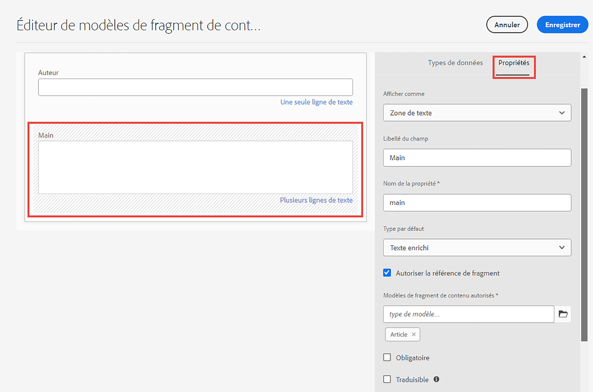
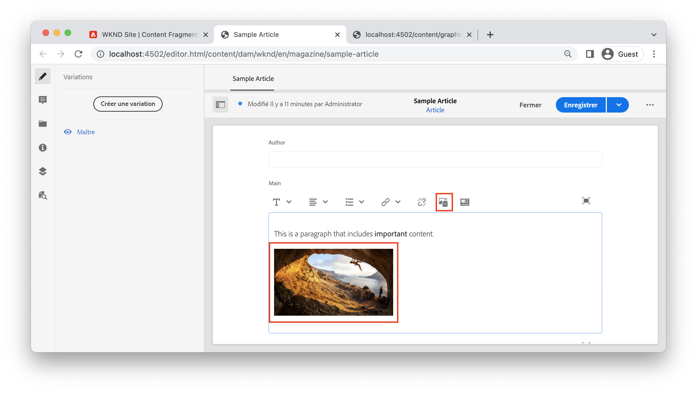
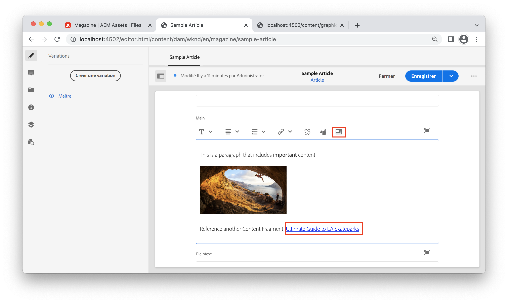

# Texte enrichi avec AEM sans affichage

Le champ de texte multiligne est un type de données de fragments de contenu qui permet aux auteurs de créer du contenu de texte enrichi. Les références à d’autres contenus, tels que des images ou d’autres fragments de contenu, peuvent être insérées dynamiquement dans la ligne au sein du flux du texte. Le champ de texte Une seule ligne est un autre type de données de fragments de contenu qui doit être utilisé pour les éléments de texte simples.

L’API GraphQL d’AEM offre une fonctionnalité robuste pour renvoyer du texte enrichi en tant que HTML, texte brut ou format JSON pur. La représentation JSON est puissante, car elle donne à l’application cliente un contrôle total sur la manière de générer le contenu.

## Éditeur multi-lignes

>[!VIDEO](https://video.tv.adobe.com/v/342104/?quality=12&learn=on)

Dans l’éditeur de fragment de contenu, la barre de menu du champ de texte multiligne fournit aux auteurs des fonctionnalités standard de mise en forme de texte enrichi, telles que : **gras**, *italique* et soulignez. L’ouverture d’un champ multiligne en mode plein écran active la fonction [d’autres outils de mise en forme tels que le type Paragraphe, la recherche et le remplacement, la vérification orthographique, etc.](https://experienceleague.adobe.com/docs/experience-manager-cloud-service/content/assets/content-fragments/content-fragments-variations.html).

>[!NOTE]
>
> Les modules externes de texte enrichi de l’éditeur multiligne ne peuvent pas être personnalisés.

## Type de données de texte multiligne {#multi-line-data-type}

Utilisez la variable **Texte multi-lignes** type de données lors de la définition de votre modèle de fragment de contenu pour activer la création de texte enrichi.



Plusieurs propriétés du champ multiligne peuvent être configurées.

Le **Rendu en tant que** peut être définie sur :

* Zone de texte : effectue le rendu d’un seul champ multiligne.
* Multiple Field : effectue le rendu de plusieurs champs de ligne multiples


Le **Type par défaut** peut être défini sur :

* Texte enrichi
* Texte (Markdown)
* Texte brut

Le **Type par défaut** influence directement l’expérience de modification et détermine si les outils de texte enrichi sont présents.

Vous pouvez également [activation des références en ligne](#insert-fragment-references) à d’autres fragments de contenu en vérifiant la variable **Autoriser la référence du fragment** et de la configuration du **Modèles de fragment de contenu autorisés**.

Vérifiez les **Traductible** , si le contenu doit être localisé. Seuls le texte enrichi et le texte brut peuvent être localisés. Voir [utilisation de contenu localisé pour plus d’informations](./localized-content.md).

## Réponse de texte enrichi avec l’API GraphQL

Lors de la création d’une requête GraphQL, les développeurs peuvent choisir différents types de réponse parmi `html`, `plaintext`, `markdown`, et `json` à partir d’un champ multiligne.

Les développeurs peuvent utiliser la variable [Aperçu JSON](https://experienceleague.adobe.com/docs/experience-manager-cloud-service/content/assets/content-fragments/content-fragments-json-preview.html) dans l’éditeur de fragment de contenu pour afficher toutes les valeurs du fragment de contenu actuel qui peuvent être renvoyées à l’aide de l’API GraphQL.

## Requête persistante GraphQL

En sélectionnant le `json` le format de réponse du champ multiligne offre la plus grande flexibilité lorsque vous utilisez du contenu de texte enrichi. Le contenu en texte enrichi est diffusé sous la forme d’un tableau de types de noeuds JSON qui peuvent être traités de manière unique en fonction de la plateforme client.

Vous trouverez ci-dessous un type de réponse JSON d’un champ à plusieurs lignes nommé `main` qui contient un paragraphe : &quot;*Il s’agit d’un paragraphe qui comprend **important**contenu.*&quot;où &quot;important&quot; est marqué comme **gras**.

```graphql
query ($path: String!) {
  articleByPath(_path: $path)
  {
    item {
      _path
      main {
        json
      }
    }
  }
}
```

Le `$path` utilisée dans la variable `_path` Le filtre nécessite le chemin d’accès complet au fragment de contenu (par exemple `/content/dam/wknd/en/magazine/sample-article`).

**Réponse GraphQL :**

```json
{
  "data": {
    "articleByPath": {
      "item": {
        "_path": "/content/dam/wknd/en/magazine/sample-article",
        "main": {
          "json": [
            {
              "nodeType": "paragraph",
              "content": [
                {
                  "nodeType": "text",
                  "value": "This is a paragraph that includes "
                },
                {
                  "nodeType": "text",
                  "value": "important",
                  "format": {
                    "variants": [
                      "bold"
                    ]
                  }
                },
                {
                  "nodeType": "text",
                  "value": " content. "
                }
              ]
            }
          ]
        }
      }
    }
  }
}
```

### Autres exemples

Vous trouverez ci-dessous plusieurs exemples de types de réponse d’un champ à plusieurs lignes nommé `main` qui contient un paragraphe : &quot;Il s’agit d’un paragraphe qui comprend **important** contenu.&quot; où &quot;important&quot; est marqué comme **gras**.

Exemple de +++HTML

**Requête persistante GraphQL :**

```graphql
query ($path: String!) {
  articleByPath(_path: $path)
  {
    item {
      _path
      main {
        html
      }
    }
  }
}
```

**Réponse GraphQL :**

```json
{
  "data": {
    "articleByPath": {
      "item": {
        "_path": "/content/dam/wknd/en/magazine/sample-article",
        "main": {
            "html": "<p>This is a paragraph that includes <b>important</b> content.&nbsp;</p>\n"
        }
      }
    }
  }
}
```

+++

Exemple +++Markdown

**Requête persistante GraphQL :**

```graphql
query ($path: String!) {
  articleByPath(_path: $path)
  {
    item {
      _path
      main {
        markdown
      }
    }
  }
}
```

**Réponse GraphQL :**

```json
{
  "data": {
    "articleByPath": {
      "item": {
        "_path": "/content/dam/wknd/en/magazine/sample-article",
        "main": {
            "markdown": "This is a paragraph that includes **important** content. \n\n ",
        }
      }
    }
  }
}
```

+++

+++Exemple de texte d’accompagnement

**Requête persistante GraphQL :**

```graphql
query ($path: String!) {
  articleByPath(_path: $path)
  {
    item {
      _path
      main {
        plaintext
      }
    }
  }
}
```

**Réponse GraphQL :**

```json
{
  "data": {
    "articleByPath": {
      "item": {
        "_path": "/content/dam/wknd/en/magazine/sample-article",
        "main": {
            "plaintext": "This is a paragraph that includes important content. ",
        }
      }
    }
  }
}
```

Le `plaintext` l’option de rendu supprime toute mise en forme.

+++


## Rendu d’une réponse JSON de texte enrichi {#render-multiline-json-richtext}

La réponse JSON en texte enrichi du champ multiligne est structurée sous la forme d’une arborescence hiérarchique. Chaque objet ou noeud représente un bloc de HTML différent du texte enrichi.

Vous trouverez ci-dessous un exemple de réponse JSON d’un champ de texte multiligne. Notez que chaque objet, ou noeud, comprend une `nodeType` qui représente le bloc de HTML du texte enrichi comme `paragraph`, `link`, et `text`. Chaque noeud peut contenir `content` qui est un sous-tableau contenant tous les enfants du noeud actif.

```json
"json": [// root "content" or child nodes
            {
                "nodeType": "paragraph", // node for a paragraph
                "content": [ // children of current node
                {
                    "nodeType": "text", // node for a text
                    "value": "This is the first paragraph. "
                },
                {
                    "nodeType": "link",
                    "data": {
                        "href": "http://www.adobe.com"
                    },
                    "value": "An external link"
                }
                ],
            },
            {
                "nodeType": "paragraph",
                "content": [
                {
                    "nodeType": "text",
                    "value": "This is the second paragraph."
                },
                ],
            },
]
```

Méthode la plus simple pour effectuer le rendu de plusieurs lignes `json` La réponse consiste à traiter chaque objet, ou noeud, dans la réponse, puis à traiter tous les enfants du noeud actif. Une fonction récursive peut être utilisée pour parcourir l’arborescence JSON.

Vous trouverez ci-dessous un exemple de code qui illustre une approche transversale récursive. Les exemples sont basés sur JavaScript et utilisent React’s [JSX](https://reactjs.org/docs/introducing-jsx.html), cependant, les concepts de programmation peuvent être appliqués à n’importe quel langage.

```javascript
// renderNodeList - renders a list of nodes
function renderNodeList(childNodes) {
    
    if(!childNodes) {
        // null check
        return null;
    }

    return childNodes.map(node, index) => {
        return renderNode(node);
    }
}
```

`renderNodeList` est une fonction récursive qui utilise un tableau de `childNodes`. Chaque noeud du tableau est ensuite transmis à une fonction. `renderNode`, qui à son tour appelle `renderNodeList` si le noeud a des enfants.

```javascript
// renderNode - renders an individual node
function renderNode(node) {

    // if the current node has children, recursively process them
    const children = node.content ? renderNodeList(node.content) : null;

    // use a map to render the current node based on its nodeType
    return nodeMap[node.nodeType]?.(node, children);
}
```

Le `renderNode` exige un objet unique nommé `node`. Un noeud peut avoir des enfants qui sont traités de manière récursive à l’aide de la variable `renderNodeList` fonction décrite ci-dessus. Enfin, une `nodeMap` est utilisé pour effectuer le rendu du contenu du noeud en fonction de ses `nodeType`.

```javascript
// nodeMap - object literal that maps a JSX response based on a given key (nodeType)
const nodeMap = {
    'paragraph': (node, children) => <p>{children}</p>,
    'link': node => <a href={node.data.href} target={node.data.target}>{node.value}</a>,
    'text': node => node.value,
    'unordered-list': (node, children) => <ul>{children}</ul>,
    'ordered-list': (node, children) => <ol>{children}</ol>,
    'list-item': (node, children) => <li>{children}</li>,
    ...
}
```

Le `nodeMap` est un littéral d’objet JavaScript utilisé comme map. Chacune des &quot;clés&quot; représente une `nodeType`. Paramètres de `node` et `children` peut être transmis aux fonctions résultantes qui effectuent le rendu du noeud. Le type de retour utilisé dans cet exemple est JSX, mais l’approche peut être adaptée pour créer un littéral de chaîne représentant le contenu du HTML.

### Exemple de code complet

Vous trouverez un utilitaire de rendu de texte enrichi réutilisable dans la variable [Exemple WKND GraphQL React](https://github.com/adobe/aem-guides-wknd-graphql/tree/main/react-app).

* [renderRichText.js](https://github.com/adobe/aem-guides-wknd-graphql/blob/main/react-app/src/utils/renderRichText.js) - Utilitaire réutilisable exposant une fonction `mapJsonRichText`. Cet utilitaire peut être utilisé par les composants qui souhaitent effectuer le rendu d’une réponse JSON de texte enrichi en tant que JSX React.
* [AdventureDetail.js](https://github.com/adobe/aem-guides-wknd-graphql/blob/main/react-app/src/components/AdventureDetail.js) - Exemple de composant qui émet une requête GraphQL contenant du texte enrichi. Le composant utilise la variable `mapJsonRichText` pour effectuer le rendu du texte enrichi et des références.


## Ajout de références intégrées au texte enrichi {#insert-fragment-references}

Le champ Ligne commutée permet aux auteurs d’insérer des images ou d’autres ressources numériques d’AEM Assets dans le flux du texte enrichi.



La capture d’écran ci-dessus illustre une image insérée dans le champ multiligne à l’aide de la propriété **Insérer une ressource** bouton .

Les références à d’autres fragments de contenu peuvent également être liées ou insérées dans le champ multiligne à l’aide du **Insérer un fragment de contenu** bouton .



La capture d&#39;écran ci-dessus montre un autre fragment de contenu, Guide Ultimate de La Skate Parks, inséré dans le champ multiligne. Les types de fragments de contenu qui peuvent être insérés dans le champ sont contrôlés par la variable **Modèles de fragment de contenu autorisés** dans la [type de données multiligne](#multi-line-data-type) dans le modèle de fragment de contenu.

## Requête de références en ligne avec GraphQL

L’API GraphQL permet aux développeurs de créer une requête qui inclut des propriétés supplémentaires sur les références insérées dans un champ multiligne. La réponse JSON comprend une `_references` qui répertorie ces propriétés supplémentaires. La réponse JSON permet aux développeurs de contrôler pleinement la manière de générer les références ou les liens au lieu d’avoir à gérer les HTMLS avec opinion.

Par exemple, vous pouvez :

* Inclure une logique de routage personnalisée pour la gestion des liens vers d’autres fragments de contenu lors de l’implémentation d’une application d’une seule page, comme l’utilisation du routeur React ou du fichier Next.js
* Rendu d’une image intégrée à l’aide du chemin absolu vers un environnement de publication AEM en tant que `src` .
* Déterminez comment rendre une référence incorporée à un autre fragment de contenu avec des propriétés personnalisées supplémentaires.

Utilisez la variable `json` type de retour et inclusion de la variable `_references` lors de la création d’une requête GraphQL :

**Requête persistante GraphQL :**

```graphql
query ($path: String!) {
  articleByPath(_path: $path)
  {
    item {
      _path
      main {
        json
      }
    }
    _references {
      ...on ImageRef {
        _path
        _publishUrl
        width
        __typename
      }
      ...on ArticleModel {
        _path
        author
        __typename
      }
      
    }
  }
}
```

Dans la requête ci-dessus, la variable `main` est renvoyé en tant que JSON. Le `_references` inclut des fragments pour gérer les références de type `ImageRef` ou de type `ArticleModel`.

**Réponse JSON :**

```json
{
  "data": {
    "articleByPath": {
      "item": {
        "_path": "/content/dam/wknd/en/magazine/sample-article",
        "main": {
          "json": [
            {
              "nodeType": "paragraph",
              "content": [
                {
                  "nodeType": "text",
                  "value": "This is a paragraph that includes "
                },
                {
                  "nodeType": "text",
                  "value": "important",
                  "format": {
                    "variants": [
                      "bold"
                    ]
                  }
                },
                {
                  "nodeType": "text",
                  "value": " content. "
                }
              ]
            },
            {
              "nodeType": "paragraph",
              "content": [
                {
                  "nodeType": "reference",
                  "data": {
                    "path": "/content/dam/wknd/en/activities/climbing/sport-climbing.jpg",
                    "mimetype": "image/jpeg"
                  }
                }
              ]
            },
            {
              "nodeType": "paragraph",
              "content": [
                {
                  "nodeType": "text",
                  "value": "Reference another Content Fragment: "
                },
                {
                  "nodeType": "reference",
                  "data": {
                    "href": "/content/dam/wknd/en/magazine/la-skateparks/ultimate-guide-to-la-skateparks",
                    "type": "fragment"
                  },
                  "value": "Ultimate Guide to LA Skateparks"
                }
              ]
            }
          ]
        }
      },
      "_references": [
        {
          "_path": "/content/dam/wknd/en/activities/climbing/sport-climbing.jpg",
          "_publishUrl": "http://publish-p123-e456.adobeaemcloud.com/content/dam/wknd/en/activities/climbing/sport-climbing.jpg",
          "width": 1920,
          "__typename": "ImageRef"
        },
        {
          "_path": "/content/dam/wknd/en/magazine/la-skateparks/ultimate-guide-to-la-skateparks",
          "author": "Stacey Roswells",
          "__typename": "ArticleModel"
        }
      ]
    }
  }
}
```

La réponse JSON inclut l’emplacement où la référence a été insérée dans le texte enrichi avec la variable `"nodeType": "reference"`. Le `_references` inclut ensuite chaque référence avec les propriétés supplémentaires demandées. Par exemple, la variable `ImageRef` renvoie la variable `width` de l’image référencée dans l’article.

## Rendu de références en ligne dans du texte enrichi

Pour effectuer le rendu des références en ligne, l’approche récursive décrite à la section [Rendu d’une réponse JSON à plusieurs lignes](#render-multiline-json-richtext) peut être développé.

Où `nodeMap` est le mappage qui effectue le rendu des noeuds JSON.

```javascript
const nodeMap = {
        'reference': (node, children) => {

            // variable for reference in _references object
            let reference;
            
            // asset reference
            if(node.data.path) {
                // find reference based on path
                reference = references.find( ref => ref._path === node.data.path);
            }
            // Fragment Reference
            if(node.data.href) {
                // find in-line reference within _references array based on href and _path properties
                reference = references.find( ref => ref._path === node.data.href);
            }

            // if reference found, merge properties of reference and current node, then return render method of it using __typename property
            return reference ? renderReference[reference.__typename]({...reference, ...node}) : null;
        }
    }
```

L’approche de haut niveau consiste à examiner chaque fois qu’une `nodeType` est égal à `reference` dans la réponse JSON de ligne Mutli. Une fonction de rendu personnalisée peut alors être appelée, qui inclut la fonction `_references` renvoyée dans la réponse GraphQL.

Le chemin de référence en ligne peut ensuite être comparé à l’entrée correspondante dans la variable `_references` objet et une autre carte personnalisée `renderReference` peut être appelée.

```javascript
const renderReference = {
    // node contains merged properties of the in-line reference and _references object
    'ImageRef': (node) => {
        // when __typename === ImageRef
        return  
    },
    'ArticleModel': (node) => {
        // when __typename === ArticleModel
        return <Link to={`/article:${node._path}`}>{`${node.value}`}</Link>;
    }
    ...
}
```

Le `__typename` de `_references` peut être utilisé pour mapper différents types de référence à différentes fonctions de rendu.

### Exemple de code complet

Vous trouverez un exemple complet d’écriture d’un rendu de références personnalisé dans la section [AdventureDetail.js](https://github.com/adobe/aem-guides-wknd-graphql/blob/main/react-app/src/components/AdventureDetail.js) dans le [Exemple WKND GraphQL React](https://github.com/adobe/aem-guides-wknd-graphql/tree/main/react-app).

## Exemple de bout en bout

>[!VIDEO](https://video.tv.adobe.com/v/342105/?quality=12&learn=on)

La vidéo précédente présente un exemple de bout en bout :

1. Mise à jour du champ de texte multiligne d’un modèle de fragment de contenu pour autoriser les références de fragment
1. Utilisation de l’éditeur de fragment de contenu pour inclure une image et une référence à un autre fragment dans un champ de texte multiligne.
1. Création d’une requête GraphQL qui inclut la réponse de texte multiligne au format JSON et toute `_references` utilisé.
1. Écriture d’un SPA React qui effectue le rendu des références en ligne de la réponse de texte enrichi.
