# Créer un fragment de contenu {#authoring-content-fragments}

Dans ce chapitre, vous allez apprendre à créer et modifier un fragment de contenu basé sur un [modèle de fragment de contenu nouvellement défini](./content-fragment-models.md). Vous découvrirez également comment créer des variations de fragments de contenu.

## Prérequis {#prerequisites}

Avant d’aborder ce tutoriel en plusieurs parties, assurez-vous d’avoir suivi les étapes décrites dans la section [Définir des modèles de fragment de contenu](./content-fragment-models.md).

## Objectifs {#objectives}

* Créer un fragment de contenu basé sur un modèle de fragment de contenu
* Créer une variation de fragment de contenu

## Créer un dossier de ressources

Les fragments de contenu sont stockés dans des dossiers AEM Assets. Pour créer des fragments de contenu à partir des modèles créés dans le chapitre précédent, vous devez au préalable créer un dossier pour les stocker. Une configuration du dossier est requise afin de permettre la création de fragments à partir de modèles spécifiques.

1. Sur l’écran de démarrage d’AEM, accédez à **Ressources** > **Fichiers**.

   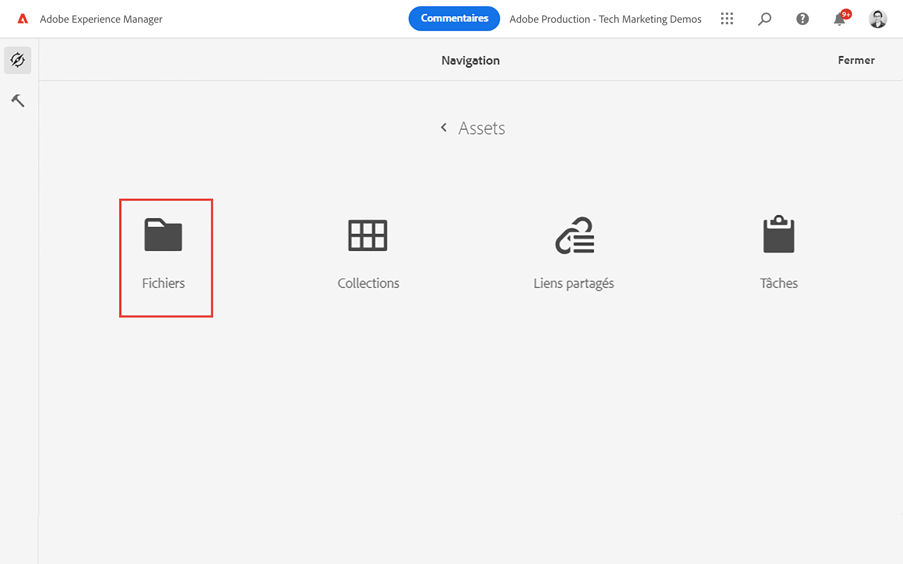

1. Cliquez sur **Créer** dans le coin supérieur droit et sélectionnez **Dossier**. Dans la boîte de dialogue qui s’affiche, saisissez :

   * Titre* : **Mon projet**
   * Nom : **mon-projet**

   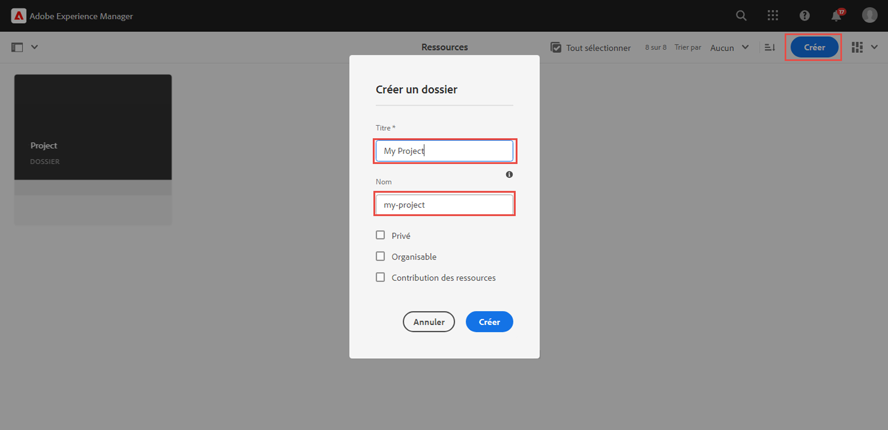

1. Sélectionnez le dossier **Mon dossier**, puis cliquez sur **Propriétés**.

   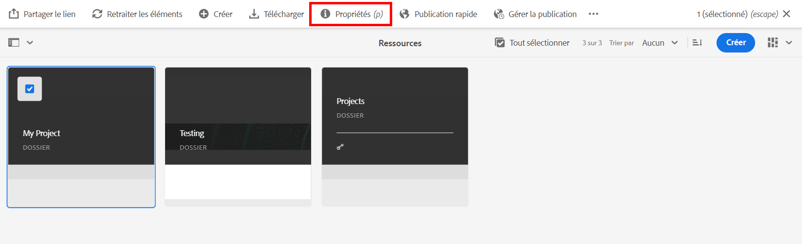

1. Cliquez sur l’onglet **Services Cloud**. Sous l’onglet Configuration cloud, dans l’outil de recherche de chemin d’accès, recherchez la configuration **Mon projet** et sélectionnez-la. La valeur doit être `/conf/my-project`.

   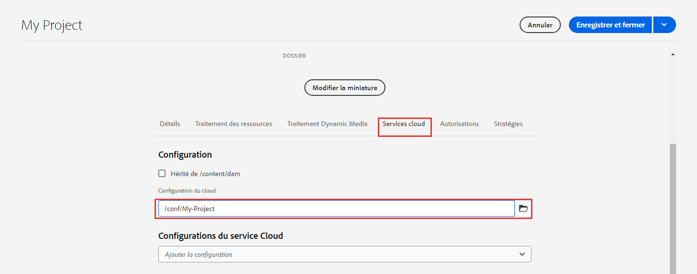

   La définition de cette propriété permet la création de fragments de contenu à l’aide des modèles créés dans le chapitre précédent.

1. Sous l’onglet **Stratégies**, accédez au champ **Modèles de fragment de contenu autorisés**, puis utilisez l’outil de recherche de chemin d’accès pour sélectionner les modèles **Personne** et **Équipe** créés précédemment.

   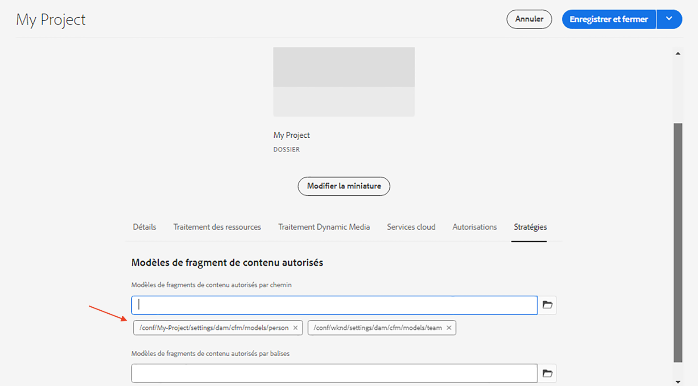

   Tous les sous-dossiers héritent automatiquement de ces stratégies, qui peuvent être remplacées. Vous pouvez également choisir les modèles autorisés en fonction d’une balise ou à partir d’autres configurations de projet. Ce mécanisme permet de gérer efficacement votre hiérarchie de contenu.

1. Cliquez sur **Enregistrer et fermer** pour enregistrer les modifications apportées aux propriétés du dossier.

1. Accédez au dossier **Mon projet** et ouvrez-le.

1. Créez un autre dossier avec les valeurs suivantes :

   * Titre* : **Français**
   * Nom : **fr**

   Il est recommandé de configurer les projets en gardant la prise en charge multilingue en tête. Consultez [la documentation suivante pour en savoir plus](https://experienceleague.adobe.com/docs/experience-manager-cloud-service/content/assets/admin/translate-assets.html?lang=fr).

## Créer un fragment de contenu {#create-content-fragment}

Dans cette section, nous allons créer plusieurs fragments de contenu basés sur les modèles **Équipe** et **Personne**.

1. Sur l’écran de démarrage d’AEM, cliquez sur **Fragments de contenu** pour ouvrir l’interface utilisateur des fragments de contenu.

   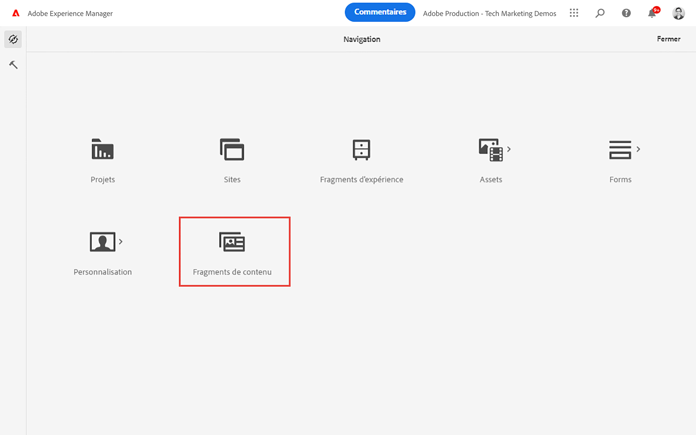

1. Dans le rail de gauche, développez **Mon projet** et sélectionnez **Français**.
1. Cliquez sur **Créer** pour afficher la boîte de dialogue **Nouveau fragment de contenu** et saisissez les valeurs suivantes :

   * Emplacement : `/content/dam/my-project/en`.
   * Modèle de fragment de contenu : **Personne**
   * Titre : **John Doe**
   * Nom : `john-doe`.

   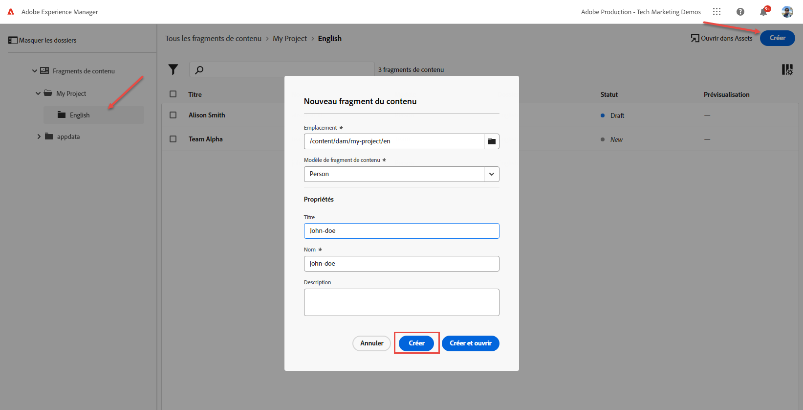
1. Appuyez sur **Créer**.
1. Répétez les étapes ci-dessus pour créer un fragment représentant **Alison Smith** :

   * Emplacement : `/content/dam/my-project/en`.
   * Modèle de fragment de contenu : **Personne**
   * Titre : **Alison Smith**
   * Nom : `alison-smith`.

   Appuyez sur **Créer** pour créer le fragment de personne.

1. Répétez ensuite les étapes pour créer un fragment d’**équipe** représentant l’**Équipe Alpha** :

   * Emplacement : `/content/dam/my-project/en`.
   * Modèle de fragment de contenu : **Équipe**
   * Titre : **Équipe Alpha**
   * Nom : `team-alpha`.

   Appuyez sur **Créer** pour créer le fragment d’équipe.

1. Il doit y avoir trois fragments de contenu sous **Mon projet** > **Français** :

   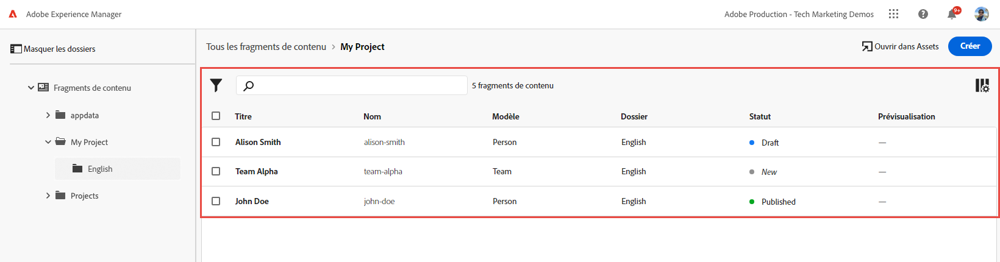

## Modifier des fragments de contenu de personne {#edit-person-content-fragments}

Remplissez ensuite les fragments nouvellement créés avec des données.

1. Cochez la case à côté de **John Doe** et appuyez sur **Ouvrir**.

   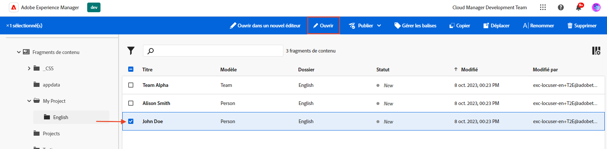

1. L’éditeur de fragment de contenu contient un formulaire basé sur le modèle de fragment de contenu. Renseignez les différents champs pour ajouter du contenu au fragment **John Doe**. Concernant l’image de profil, chargez votre propre image dans AEM Assets.

   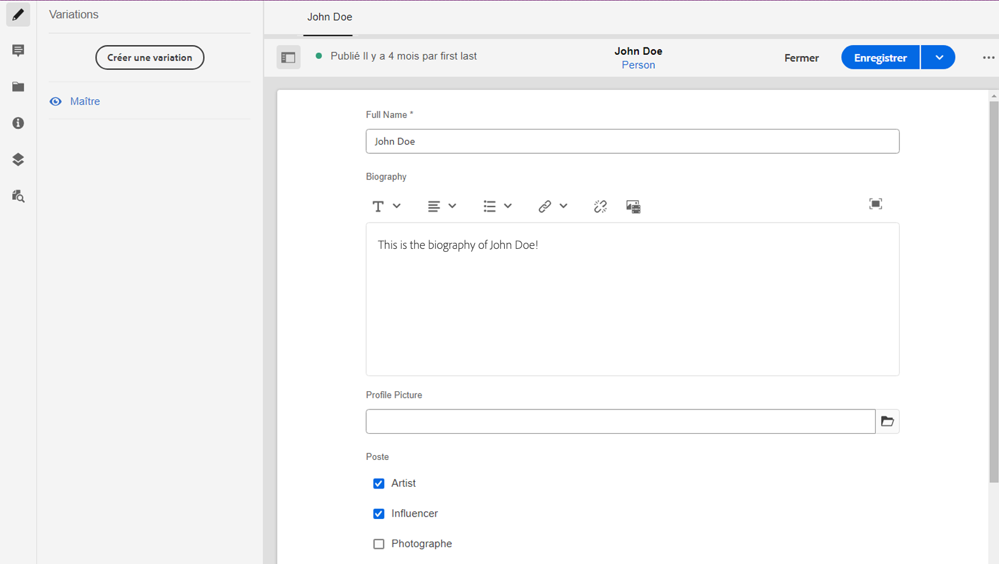

1. Appuyez sur **Enregistrer et fermer** pour enregistrer les modifications apportées au fragment John Doe.
1. Revenez à l’interface utilisateur de fragment de contenu et ouvrez le fichier **Alison Smith** à modifier.
1. Répétez les étapes ci-dessus pour renseigner le fragment **Alison Smith** avec du contenu.

## Modifier un fragment de contenu d’équipe {#edit-team-content-fragment}

1. Ouvrez le fragment de contenu **Équipe Alpha** à l’aide de l’interface utilisateur de fragment de contenu.
1. Renseignez les champs **Titre**, **Nom court** et **Description**.
1. Sélectionnez les fragments de contenu **John Doe** et **Alison Smith** pour renseigner le champ **Membres de l’équipe** :

   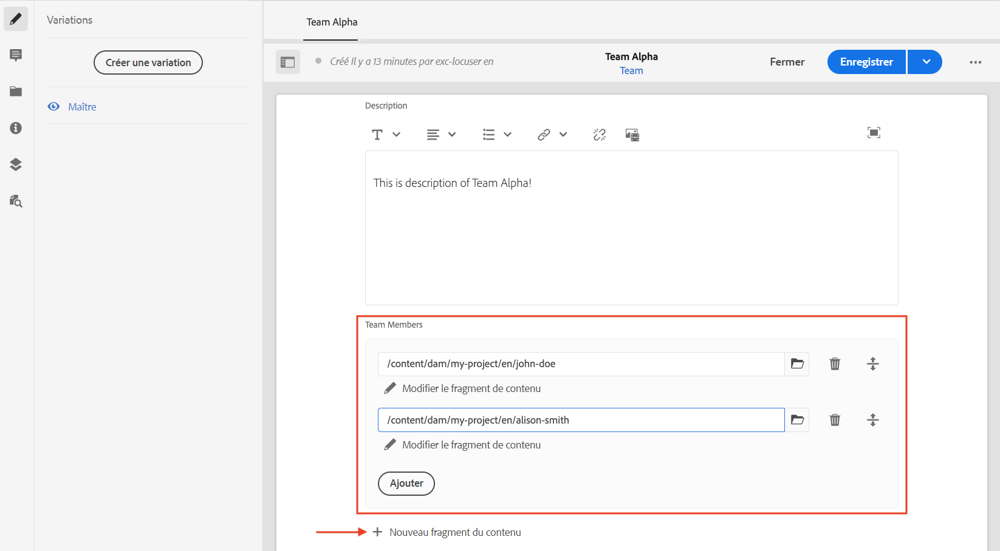

   >[!NOTE]
   >
   >Vous pouvez également créer des fragments de contenu en ligne à l’aide du bouton **Nouveau fragment de contenu**.

1. Appuyez sur **Enregistrer et fermer** pour enregistrer les modifications apportées au fragment Équipe Alpha.

## Publier des fragments de contenu

Lors de la révision et de la vérification, publiez les `Content Fragments` crées.

1. Dans l’écran de démarrage d’AEM, appuyez sur **Fragments de contenu** pour ouvrir l’interface utilisateur Fragments de contenu.

1. Dans le rail de gauche, développez **Mon projet** et appuyez sur **Français**.

1. Cochez la case à côté des fragments de contenu et appuyez sur **Publier**.
   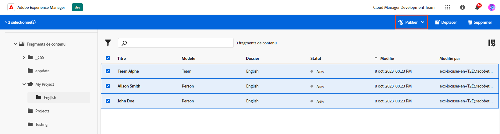

## Félicitations. {#congratulations}

Félicitations, vous avez créé plusieurs fragments de contenu et une variation.

## Étapes suivantes {#next-steps}

Dans le chapitre suivant, [Explorer les API GraphQL](explore-graphql-api.md), vous allez découvrir les API GraphQL d’AEM à l’aide de l’outil intégré GraphiQL. Découvrez comment AEM génère automatiquement un schéma GraphQL basé sur un modèle de fragment de contenu. Vous testerez la création de requêtes de base à l’aide de la syntaxe GraphQL.

## Documentation connexe

* [Gestion des fragments de contenu](https://experienceleague.adobe.com/docs/experience-manager-cloud-service/content/assets/content-fragments/content-fragments-managing.html?lang=fr)
* [Variations – création de contenu de fragment](https://experienceleague.adobe.com/docs/experience-manager-cloud-service/content/assets/content-fragments/content-fragments-variations.html?lang=fr)
